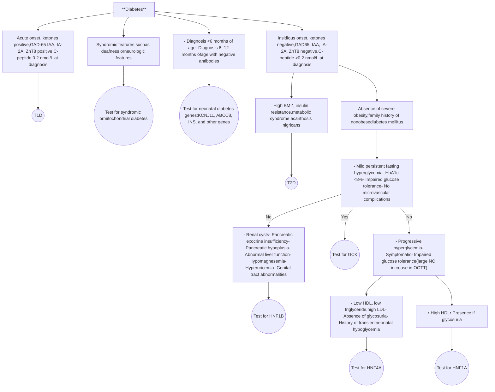
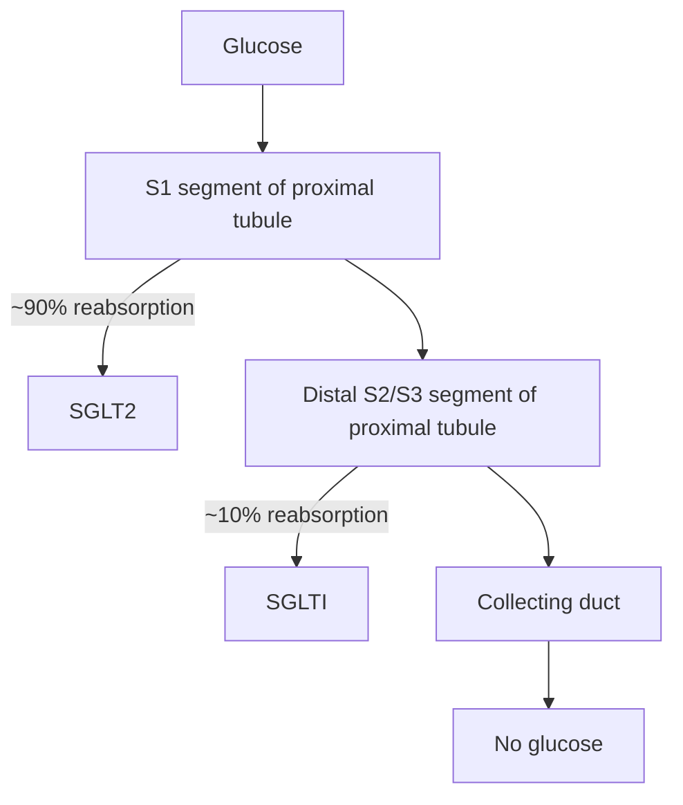

37

# Monogenic Diabetes

MARIA V. SALGUERO, MARILYN AROSEMENA, ROCHELLE N. NAYLOR, AND LOUIS H. PHILIPSON

## CHAPTER OUTLINE

* **Introduction**, 1453
* **Monogenic Diabetes and Pregnancy**, 1462
* **GCK-MODY**, 1462
* **Conclusions**, 1464

## KEY POINTS

* Monogenic forms of diabetes account for 1% to 2% of diabetes cases and are often a consequence of gene defects that either interfere with β-cell development and function, including insulin production and secretion, or insulin action and result in clinical diabetes.

* Monogenic forms of diabetes include neonatal diabetes with onset generally under 9 months of age and maturity-onset diabetes of the young (MODY), characterized by childhood or young adult–onset of diabetes, with diagnosis typically occurring before 30 years of age. Knowledge about monogenic forms of diabetes has evolved from basic descriptions of clinical characteristics to well-defined molecular genetics and specific therapeutic approaches.

* The most common causes of neonatal diabetes include pathogenic variants in the insulin gene (requiring insulin treatment) and in *KCNJ11* and *ABCC8* genes, which encode the subunits of the K-ATP channel and are usually responsive to high doses of sulfonylureas.

* The four most common causes of MODY include heterozygous pathogenic variants in glucokinase (*GCK*), characterized by mild fasting hyperglycemia with low to no incidence of related diabetes complications and generally requiring no glucose-lowering treatment; hepatocyte nuclear factor-1α (*HNF1A*) associated with glycosuria with progressive hyperglycemia and frequently response to low doses of sulfonylureas; hepatocyte nuclear factor-4 α (*HNF4A*) with history of transient neonatal hypoglycemia with progressive hyperglycemia, also frequently responsive to low doses of sulfonylureas; and hepatocyte nuclear factor-1β (*HNF1B*) with renal cysts, pancreatic hypoplasia and exocrine dysfunction, and hypomagnesemia, which lacks clear precision therapy.

* Monogenic causes of lipodystrophies, insulin resistance, and obesity may also include diabetes as part of the syndrome.

* Syndromic forms of diabetes account for less than 1% of children with diabetes. Examples include maternally inherited diabetes and deafness due to mitochondrial pathogenic variants, and Wolfram syndrome due to wolframin ER transmembrane glycoprotein (Wfs1) pathogenic variants, among others.

## Introduction

Throughout the chapter the terms *monogenic diabetes* and *maturity-onset diabetes of the young* (MODY) will be used. Monogenic diabetes is defined as the heterogenous group of monogenic diseases that include both neonatal diabetes and MODY. MODY specifically refers to a family of autosomal-dominant monogenic diabetes that includes GCK-MODY, HNF1A-MODY, HNF4A-MODY, and HNF1B-MODY. Although the more common forms of monogenic diabetes will be highlighted, new genes continue to be identified that are strongly associated with both dominant and recessive forms of diabetes, with variable levels of penetrance. The total number of such genes now exceeds 30, so we will avoid use of the “MODY-X” nomenclature and for clarity will instead use the generally preferred terminology with gene name itself (e.g., HNF1A-MODY rather than MODY1).

## Monogenic Diabetes and Precision Medicine

Precision medicine in diabetes has the goal of “reducing the enormous and growing burden of diabetes worldwide” and “realiz[ing] a future of longer, healthier lives for people with diabetes.”1 The Precision Medicine in Diabetes Initiative (PMDI) of the American Diabetes Association (ADA) and European Association for the Study of Diabetes (EASD) recognize “clinical implementation [is] already a reality for precision medicine in monogenic forms of diabetes.”2

Thanks to efforts and collaboration of multiple research teams, our understanding of monogenic diabetes has grown exponentially. Starting in 1958, Stefan Fajans began studying a Michigan family that became known as the “R-W pedigree” and now spans seven generations. Seventy-four members of this family were first described to have a form of non–insulin-dependent diabetes that

<page_number>1453</page_number>

Downloaded for d4030sltung d4030sltung ([d4030sltung@gmail.com](mailto:d4030sltung@gmail.com)) at Tungs' Taichung MetroHarbor Hospital from [ClinicalKey.com](https://www.clinicalkey.com) by Elsevier on August 18, 2026. For personal use only. No other uses without permission. Copyright ©2026. Elsevier Inc. All rights reserved.

1454 SECTION VIII

Disorders of Carbohydrate and Fat Metabolism

| 1960–1976 | 1987 | 1992–1993 | 1994 | 1996 | 1997 | 1998 | 2000–2003 | 2004–2006 | 2007 |
| --- | --- | --- | --- | --- | --- | --- | --- | --- | --- |
| - Fajans and Tattersall: Initial description of MODY as mild familial diabetes with dominant inheritance. (3–5) | - Fajans: Definition and phenotypic expression of MODY (6,7) | - Froguel et al, Stoffel et al: Discovery of GCK-MODY (MODY 2) (8–11) - Fajans et al: Sulfonylureas can treat some MODY (12) - Fajans et al: MODY described as a model for the study of the molecular genetics of non–insulin-dependent diabetes (13) | - Fajans et al, Herman et al: Abnormal insulin secretion in the RW pedigree (14) | - Bell et al: Discovery of HNF4A-MODY (MODY 1) (15) - Bell et al: Hepatic function in HNF4A-MODY (16) - Bell et al, Polonsky et al: Discovery of MODY-HNF1A (MODY 3) (17,18) | - Staffers et al: IPF1 (MODY 4) (19) - Bell et al: HNF1B (MODY 5) (20) - Hansen et al, Hattersley et al: Sulfonylureas treat HNF1A and HNF4A (21,22) | - Menzel et al: Low renal threshold for glucose in MODY-HNF1A (23) | - Njølstad et al: Neonatal diabetes caused by GCK deficiency (24) | - Hattersley et al: Discovery of KCNJ11, ABCC8 in transient neonatal diabetes, treatment with sulfonylurea (25) | - Støy et al: Insulin gene mutations in permanent neonatal diabetes (26) |

• Fig. 37.1 Clinical highlights of the history of monogenic diabetes.

appeared unusually early, in childhood and adolescence.3 Robert Tattersall described three additional families in which diabetes was dominantly inherited, and although diagnosed in adolescence they could be effectively treated with sulfonylureas for over 40 years.4 The study of these families, as well as others, led Fajans and Tattersall in 1974 to name this form of autosomal dominantly inherited diabetes as MODY. Fig. 37.1 provides clinical highlights on the history of monogenic diabetes.3–26 Ongoing work throughout the world continues to identify new causes of monogenic diabetes, define the natural history in relation to temporal changes in diabetes care practices, and advance precision therapeutics and management for individuals living with monogenic diabetes.

The key pillars of diabetes precision medicine include diagnosis, prevention, treatment, prognosis, and monitoring.

***Precision diagnosis:*** Use of established monogenic diabetes biomarkers has proven a successful strategy to identify individuals for genetic testing (Fig. 37.2). The biomarker screening pathway comprises three stages: (1) assessment of endogenous insulin secretion using serum or urinary C-peptide/creatinine ratio (UCPCR); (2) if serum C-peptide is ≥0.60 mg/mL (0.2 nmol/L) or UCPCR is ≥0.2 nmol/mmol, measurement of glutamic acid decarboxylase and insulinoma-associated protein-2 islet autoantibodies; and (3) if negative for both autoantibodies, molecular genetic diagnostic testing for monogenic diabetes subtypes.1,28

***Precision therapeutics:*** The most common forms of monogenic diabetes are amenable to therapies targeting the molecular etiology of diabetes, result in stable or improved diabetes control, and are cost-effective or cost-saving, which is an almost unheard of feat in health care practice.29–32

***Precision prognosis and monitoring:*** Nondiabetes comorbidities related to the pathogenic variant can be surveilled for and treated effectively based on accurate molecular diagnosis of monogenic diabetes. Two exemplars of this include the improved neurocognitive outcomes seen in K-ATP–related neonatal diabetes based on early implementation of precision treatment with sulfonylureas and recognition of increased cardiovascular risk warranting statin therapy in those with HNF1A-MODY.33

Successful implementation of precision medicine in monogenic diabetes serves as a road map for more complex polygenic forms of diabetes. The main hindrances for implementation are

timely recognition, accurate genetic diagnosis, and prompt therapeutic action after diagnosis.

## Epidemiology

Monogenic diabetes refers to diabetes mellitus caused by a mutation in a single gene generally involved in pancreatic β-cell development or function. There are now more than 30 genes associated with different monogenic diabetes subtypes.34 Monogenic diabetes prevalence rates are largely based on European cohorts and estimated at approximately 1% to 4% of all patients diagnosed with diabetes before the age of 30 years, among patients suspected as having MODY based on their predominant phenotype.35–37

A minimum estimated prevalence of MODY of 108 cases per million, accounting for 1% of diabetes cases, was based on genetic testing in 2072 probands and 1280 relatives of United Kingdom referrals between 1996 and 2009. There is variation across regions from 5.3 cases per million for the population in Northern Ireland to 28.4 for Scotland and across the English regions from 8.2 in London to 48.9 in the South West.36 Of 808 patients younger than 20 years of age attending six pediatric clinics in the United Kingdom, 2.5% were found to have monogenic diabetes.35

The SEARCH for Diabetes in Youth Study assessed for MODY caused by heterozygous pathogenic variants in the three most common genes *GCK*, *HNF1A*, and *HNF4A*. Of approximately 5000 pediatric participants with newly diagnosed diabetes in the United States, 586 underwent sequencing of *GCK*, *HNF1A*, and *HNF4A*, and 47 (8.2%) were positive for a pathogenic or likely pathogenic mutation in one of these three genes. Overall, 1.2% of the original cohort of children had genetically confirmed monogenic diabetes. Of these 47 patients identified to have a MODY variant, only 3 had a clinical diagnosis of MODY, and the majority were treated with insulin demonstrating the individual value of a precision diagnosis. Although most participants with MODY variants were of minority ethnicity (64%), largely African American (20%), Hispanic (31%), and Asian/Pacific Islander (11%), the frequency of minority ethnicity in those with and without MODY variants did not differ, suggesting the prevalence is reflective of the underlying racial/ethnic distribution of the SEARCH population and not different among the race/ethnic groups evaluated.38

The University of Chicago Monogenic Diabetes Registry published an update of its results as of 2021. Participants included in this registry are from all 50 U.S. states but also include those from

Downloaded for d4030sltung d4030sltung ([d4030sltung@gmail.com](mailto:d4030sltung@gmail.com)) at Tungs' Taichung MetroHarbor Hospital from [ClinicalKey.com](https://www.clinicalkey.com) by Elsevier on August 18, 2026. For personal use only. No other uses without permission. Copyright ©2026. Elsevier Inc. All rights reserved.

CHAPTER 37 Monogenic Diabetes

1455

\* **Fig. 37.2** Algorithm for the diagnosis of monogenic diabetes. The diagnosis is a stepwise process (clinical assessment, diabetes-specific test, and genetic testing). Because these features are insufficiently pathognomonic (outside of GCK, which has a distinct phenotype), most are not pathognomonic; therefore, it is suggested that commercial gene panels be performed (such as shown in Table 37.2). \*Relative to the ethnic background of the individual. Commercial panels from monogenic diabetes typically include the following genes to be sequenced: *GCK, HNF1A, HNF4A, HNF1B*. *BMI*, body mass index; *GAD-65*, glutamic decarboxylase 65 autoantibodies; *HbA1c*, glycated hemoglobin; *HDL*, high-density lipoprotein; *IAA*, insulin autoantibodies; *IA-2A*, tyrosine phosphatase-related islet antigen-2 autoantibodies; *LDL*, low-density lipoprotein; *OGTT*, oral glucose tolerance test; *T1D*, type 1 diabetes mellitus; *T2D*, type 2 diabetes mellitus; *ZnT8*, zinc transporter 8 autoantibodies. (This table was submitted to NIDDK’s Diabetes in America compendium. Chapter is under review.)

Downloaded for d4030sltung d4030sltung ([d4030sltung@gmail.com](mailto:d4030sltung@gmail.com)) at Tungs' Taichung MetroHarbor Hospital from [ClinicalKey.com](https://ClinicalKey.com) by Elsevier on August 18, 2026. For personal use only. No other uses without permission. Copyright ©2026. Elsevier Inc. All rights reserved.

1456 SECTION VIII Disorders of Carbohydrate and Fat Metabolism

over 20 other countries (including Canada, Germany, Australia, India, and the Philippines). As of 2021, over 3800 people have enrolled in the registry; most are referred by their diabetes care provider (54%), whereas others credit web searches (24%), friends and family (18%), or other sources (13%). Of these, 1120 (43%) have a known genetic cause. Among genes that cause a MODY phenotype, glucokinase (GCK) pathogenic variants were the most common (59%), followed by *HNF1A* (28%), whereas pathogenic variants in *KCNJ11* were the most common cause among genes associated with neonatal diabetes (35%), followed by *INS* pathogenic variants (16%).39

Interestingly, the predominant subtype of MODY varies across countries. In the United Kingdom and other European countries such as the Netherlands, Norway, Germany, and Poland, as well as in the United States, *HNF1A*-MODY has the highest prevalence (52% of all genetically confirmed cases), followed by GCK-MODY.27 In some registries in Europe and the United States *HNF1A*-MODY has the highest prevalence of genetically confirmed cases followed by GCK-MODY, but other registries find GCK-MODY more common,40,41,43 including the Monogenic Diabetes Registry in the United States, where GCK-MODY is about two times more common than *HNF1A*-MODY.39,42 The prevalence of MODY variants in African, Asian, South American, and Middle Eastern populations is not known. Clearly, research is needed to elucidate the prevalence of MODY in those regions.44

The age of diagnosis varies by mutation. Mild hyperglycemia due to GCK-MODY is present at birth, but diagnosis is often incidental in childhood or young adulthood. *HNF1A* penetration in patients is approximately 63% by age 25 years, 93.6% by age 50 years, and 98.7% by age 75 years. *HNF1B*-MODY is typically diagnosed before the third decade of life, with a mean age of diagnosis of 24 years. *HNF4A*-MODY typically has its onset during the second to third decade of life but may be diagnosed later in some patients.45–47

Despite the lack of reported ethnic predilection, the prevalence of MODY varies by ethnicity (mostly reported in non-Hispanic White populations), which may be due to disparities in availability and access to genetic testing.38,48 There is a female sex predominance reported in studies from the United Kingdom and United States.39,49

Regarding other forms of monogenic diabetes, the prevalence of permanent neonatal diabetes in the United States in youth was estimated to be 1 in 252,000 in a population-based study of diabetes.50

# Clinical Characteristics

At diagnosis, MODY cannot reliably be distinguished from type 1 and type 2 diabetes based on clinical characteristics alone.51 However, using clinical features, family history, and available biomarkers, MODY can be suspected in the presence of atypical features for type 1 and type 2 diabetes, identifying individuals who should have monogenic diabetes genetic testing.47,52–54 Features that raise the possibility of monogenic diabetes are presented in Table 37.1.

Early-onset diabetes, insulin independence, and autosomal-dominant inheritance are associated with MODY forms of monogenic diabetes, with key exceptions.4,55 GCK-MODY, *HNF1A*-MODY, and *HNF4A*-MODY are mostly inherited and dominant, but rare de novo mutations causing sporadic disease may occur. In contrast, *HNF1B* deletions are 50% to 60% de novo, and for many of the more atypical forms (i.e., mutations in the *Wfs1* gene in Wolfram syndrome), spontaneous mutations predominate. Age of onset is particularly useful for distinguishing

| TABLE 37.1 Features Atypical for Type 1 and Type 2 Diabetes Mellitus |  |
| --- | --- |
| Features Atypical for Type 1 Diabetes Mellitus | Features Atypical for Type 2 Diabetes Mellitus |
| * Absence of pancreatic islet autoantibodies | * Onset of diabetes before age of 45 years |
| * Evidence of endogenous insulin production beyond the honeymoon period | * Lack of significant obesity |
| * Measurable C-peptide (≥0.60 ng/mL [≥0.2 nmol/L]) in the presence of hyperglycemia | * Lack of acanthosis nigricans |
| * Low insulin requirement for treatment | * Normal triglyceride levels and/or normal or elevated high-density lipoprotein cholesterol |
| * Lack of ketoacidosis when insulin is omitted from treatment |  |

MODY from other types of diabetes. However, MODY subtypes with variable age of onset, low penetrance, or atypical presentation may not fulfill classical diagnostic criteria. Clinical manifestations of MODY are diverse and may vary even among members of the same family carrying the same pathogenic variant. This phenotypic variation has been explained by differences in the effect of the pathogenic variant and common variants on protein function, the role of maternal glycemia, and environmental factors in epigenetics (obesity and activity levels) and may reflect the impact of modifying genes.56–58

Most patients with MODY pathogenic variants affecting insulin secretion are not obese, likely reflecting some amount of ascertainment bias in who is referred for MODY testing. In the past, the presence of obesity in a patient with diabetes was counted as evidence against MODY, with some exceptions, such as seen in MODY due to mutations in pancreatic and duodenal homeobox 1 (*PDX1*) or neuronal differentiation 1 (*NEUROD1*). Obesity and hyperinsulinemia have also been observed sporadically in patients with *HNF4A* (which often includes macrosomia and hypoglycemia at birth) and *HNF1A* (rarely associated), suggesting that β-cell compensation of obesity-related insulin resistance via hyperinsulinemia occurs in MODY as it does in type 2 diabetes.56,59 The Treatment Options for type 2 Diabetes in Adolescents and Youth study assessed for monogenic diabetes across all races/ethnicities in a cohort of overweight and obese adolescents diagnosed with type 2 diabetes who were diabetes-associated autoantibody-negative and C-peptide–positive. Pathogenic or likely pathogenic variants in MODY genes were found in 4.5% of the cohort, providing evidence that monogenic diabetes occurs in overweight and obese individuals and is likely underdiagnosed in the absence of systematic assessment.48

A clinical prediction tool (MODY Calculator) to calculate an individual’s probability of having MODY is available at [https://www.diabetesgenes.org/exeter-diabetes-app](https://www.diabetesgenes.org/exeter-diabetes-app) and as a phone-based app. It takes into account commonly available clinical information (age at diagnosis, sex, diabetes treatment, body mass index [BMI], glycated hemoglobin, current age), first-degree family history, and other clinical features (history and presence of renal cysts, deafness, partial lipodystrophy, severe insulin resistance in absence of obesity, severe obesity with other syndromic features) to predict MODY and guide molecular genetic testing. This calculator was developed using data from a White European population

Downloaded for d4030sltung d4030sltung ([d4030sltung@gmail.com](mailto:d4030sltung@gmail.com)) at Tungs' Taichung MetroHarbor Hospital from [ClinicalKey.com](https://ClinicalKey.com) by Elsevier on August 18, 2026. For personal use only. No other uses without permission. Copyright ©2026. Elsevier Inc. All rights reserved.

CHAPTER 37 Monogenic Diabetes

<page_number>1457</page_number>

and is only applicable to patients diagnosed under 35 years.49 Genetic risk scores have been developed to help discriminate type 1 diabetes from monogenic diabetes and from type 2 diabetes and have been studied mainly in White European populations.60,61 Data from populations of non-European ancestry and with adult-onset disease remain limited. The type 1 diabetes genetic risk score, T1D-GRS, based on a European ancestry type 1 diabetes genetic risk, has been applied to many populations.62 For example, the T1D-GRS discriminated between monogenic and type 1 diabetes in children diagnosed under age 5 years in an Iranian population.63 The European ancestry–based score performed significantly less well than an African-ancestry type 1 diabetes genetic risk score when applied to African-ancestry population, and an African-specific genetic risk score has been developed.64

## Challenges in Diagnosing Monogenic Diabetes

There are multiple challenges in diagnosing monogenetic diabetes that contribute to frequent misdiagnosis of MODY, including the overlap of clinical features with type 1 and type 2 diabetes, low rates of referral for early comprehensive genetic testing, and the inability to obtain any genetic testing in many patients.38 Timely and accurate genetic diagnosis of monogenic diabetes provides an opportunity to target therapy to the underlying causative gene, refine overall management and identify affected and at-risk relatives. Because of the clinical overlap with type 1 and type 2 diabetes, clinical and laboratory features warrant careful attention to aid in diabetes classification and to identify those individuals who warrant genetic testing. As described earlier, we provide an algorithm that could help clinicians navigate through the clinical presentation and laboratory findings of patients with diabetes (see Fig. 37.2). The most common commercial panels for monogenic diabetes genetic testing are provided in Table 37.2.

## Genomic Variants of Monogenic Diabetes

Monogenic diabetes is broadly categorized into MODY, neonatal, and syndromic forms.

### MODY

MODY is characterized by childhood or young adult–onset of diabetes, with diagnosis typically occurring before age 30 years. Single-gene pathogenic variants and various types of genetic mutations are implicated in the pathogenesis of MODY (Table 37.3). Pathogenic variants in these genes generally cause β-cell dysfunction resulting in decreased insulin production and hyperglycemia (Fig. 37.3). MODY genes have distinct mechanisms of action but overlapping phenotypic presentations compared with type 1 and type 2 diabetes and other forms of diabetes mellitus. There is characteristic pancreatic β-cell disrupted insulin biosynthesis.5,65

**Glucokinase-maturity-onset diabetes of the young (GCK-MODY [previously MODY 2])** results from decreased β-cell sensing of glucose due to loss of function pathogenic variants in the gene encoding the enzyme glucokinase (*GCK*) on chromosome 7.66 These patients have stable fasting hyperglycemia (generally in the range of 99–144 mg/dL [5.5–8.0 mmol/L]) present at birth. Hyperglycemia is usually discovered as an incidental finding during a routine blood chemistry check performed for an unrelated illness or pregnancy screening. In these patients, islet cell antibodies are negative, and an oral glucose tolerance test (OGTT) reveals mild hyperglycemia, often with an increase of less than 90 mg/dL (5.0 mmol/L) between fasting and 2-hour values.

The phenotype of GCK-MODY is uniform despite the differences in pathogenic variant severity; this may be due to compensation by overexpression of the normal allele.27,47

Insulin levels, if measured, are appropriate (normal fasting level below 25 mIU/L [144 pmol/L]) but occur at higher glucose thresholds. GCK is expressed in liver and altered regulation of glycogen storage, and release also contributes to altered glycemia. GCK is also expressed in the brain. GCK neurons innervate several nuclei throughout the brain axis with strongest connections in the forebrain. These areas are associated with reward and stress and with hypothalamic structures that are involved in energy balance and feeding regulation. The presence of GCK in the brain could potentially explain why studies have shown these patients to have a lower BMI compared to other MODY causes.

These patients are usually misclassified as having type 1 or type 2 diabetes, but there is a lack of glycemic response to oral hypoglycemia agents or insulin. Treatment with these agents in GCK-MODY is not recommended and is even contraindicated because of the lack of most long-term microvascular and macrovascular complications of diabetes and the side effects of potential glycemic-reduction interventions.47,67–70 Nonproliferative retinopathy is the only microvascular complication reported in these subjects after an average 50-year exposure to mild hyperglycemia.71 Pregnancy is an exception, when treatment may be recommended for individuals with *GCK* pathogenic variants causing hyperglycemia (see “Monogenic Diabetes and Pregnancy” section for further details).

Rare cases of co-occurring type 1 diabetes (antibody positive) have been reported in subjects with GCK-MODY. These cases usually present with worsening glycemic control beyond the typical range expected for GCK-MODY. If suspected, subjects should be tested for type 1 diabetes; if positive antibodies and low C-peptide are discovered, insulin treatment will be warranted.72 There are also reported cases of co-occurring type 2 diabetes and GCK-MODY, as people with GCK-MODY are also susceptible to weight gain and insulin resistance associated with aging and obesogenic environment.73,74 Adjusting glycemic targets to account for GCK-MODY is likely appropriate but has not been rigorously studied.

***HNF1A-maturity-onset diabetes of the young* (HNF1A-MODY [previously MODY 3])** occurs because of heterozygous-dominant variants in the gene encoding the transcription factor HNF1A, which is expressed mainly in liver, pancreatic β-cells, and kidney.17,75,76 HNF1A, HNF4A, and HNF1B are homeobox transcription factors that interact with DNA at specific target sequences and regulate the expression of specific proteins. Point pathogenic variants are predominantly located in the DNA-binding domain (Fig. 37.4), and diabetes primarily results from the functional absence of one allele. There is genotype-phenotype correlation in the variant.57,77 However, variability in the age of onset of HNF1A-MODY can occur even within the same pedigree. Several single nucleotide polymorphisms and one in the leucine-rich melanocyte differentiation–associated (*LRMDA*) gene in particular are associated with age at diabetes onset in HNF1A-MODY patients.78 A recent study suggests serum insulin may be more discriminative than C-peptide to distinguish between carriers and noncarriers. The conclusion was made after both fasting and during OGTT, where the difference in insulin levels outweighed that in proinsulin or C-peptide levels. A higher insulin:C-peptide ratio in the carriers may be due to a difference in hepatic insulin clearance.58

Downloaded for d4030sltung d4030sltung ([d4030sltung@gmail.com](mailto:d4030sltung@gmail.com)) at Tungs' Taichung MetroHarbor Hospital from [ClinicalKey.com](https://www.clinicalkey.com) by Elsevier on August 18, 2026. For personal use only. No other uses without permission. Copyright ©2026. Elsevier Inc. All rights reserved.

1458 SECTION VIII

Disorders of Carbohydrate and Fat Metabolism

# TABLE 37.2 The Most Common Commercial Panels for Monogenic Diabetes Genetic Testing (as of 2022)

| INVITAE | GeneDx | University of Chicago |
| --- | --- | --- |
| ABCC8 | ABCC8 | ABCC8 |
| APPL1 | APPL1 | DUT APPL1 |
| BLK | BLK | DYRK1B |
| EIF2AK3 | CEL | BLK EIF2AK3 |
| FOXP3 | GCK | CEL |
| GATA4 | GLUD1 | EIF2B1 GCK |
| GATA6 | HADH | EIF2S3 |
| GCK | HNF1A | HNF1A FOXP3 |
| GLIS3 | HNF1B | HNF1B |
| HNF1A | HNF4A | GATA4 HNF4A |
| HNF1B | INS | GATA6 |
| HNF4A | KCNJ11 | INS GLIS3 |
| IER3IP1 | KLF11 | KCJN11 |
| INS | NEUROD1 | GLUD1 KLF11 |
| KCNJ11 | PAX4 | HADH |
| KLF11 | PDX1 | MT-TE M.14709T>C IER3IP1 |
| MNX1 | RFX6 | MT-TK M.8296A>G IL2RA |
| NEUROD1 | WFS1 | MT-TL1 M.3243A>G INSR |
|  |  | NEUROD1 |
|  |  | ITCH |
|  |  | PAX4 |
|  |  | LIPE |
|  |  | PDX1 |
|  |  | LMNA |

| INVITAE | GeneDx | University of Chicago |
| --- | --- | --- |
| NEUROG3 |  | AIRE |
| NKX2-2 |  | LRBA |
| PAX4 |  | AKT2 |
| PDX1 |  | MAFA |
| PPARG |  | CDKN1C |
| PTF1A |  | MNX1 |
| RFX6 |  | CIDEC |
| SLC19A2 |  | NEUROG3 |
| WFS1 |  | CISD2 |
| ZFP57 |  | NKX2-2 |
|  |  | CNOT1 |
|  |  | PAX6 |
|  |  | CP |
|  |  | PCBD1 |
|  |  | CTLA4 |
|  |  | PIK3R1 |
|  |  | DCAF17 |
|  |  | PLIN1 |
|  |  | DNAJC3 |
|  |  | POLD1 |
|  |  | DOCK8 |
|  |  | PPRG |
|  |  | SLC19A3 |
|  |  | PPP1R15B |
|  |  | SLC2A2 |
|  |  | PTF1A |
|  |  | STAT1 |
|  |  | RFX6 |
|  |  | STAT3 |
|  |  | SLC19A2 |
|  |  | TRMT10A |
|  |  | ZMPSTE24 |
|  |  | WFS1 |
|  |  | ZFP57 |
|  |  | ZBTB20 |

Early clinical presentation is characterized by minimal symptoms, mild fasting hyperglycemia, and glucosuria occurring at lower renal thresholds compared with other forms of diabetes. Insulin secretory defect is progressive, leading to overt diabetes symptoms in many affected individuals. Birth weight is normal, and many carriers develop diabetes after young adulthood. A recent family-based multigenerational study on *HNF1A*-MODY phenotype showed that the most common causal variant of *HNF1A*-MODY, p.(Gly292fs), presents not only with hyperglycemia and insulin deficiency but also with increased lipolysis and markedly lower adult BMI.58 Other features of *HNF1A*-MODY include hepatocellular adenomas, hyperlipidemia, and increased risk of cardiovascular mortality compared with their unaffected family members.33 Hepatocellular adenomas are benign liver tumors, and related complications (hepatic hemorrhage and malignant transformation) are rare but serious. The 2016 European guideline on benign liver tumors recognizes the formation of hepatocellular adenomas in metabolic disorders such as *HNF1A*-MODY and recommends hepatocellular adenoma resection in males, irrespective of size or concurring metabolic diagnosis.79,80

Complications of diabetes due to *HNF1A*-MODY can be just as severe as in unmanaged type 2 diabetes if not adequately treated. Most patients are initially quite responsive to sulfonylureas, even

to the point of hypoglycemia with low doses. Later in life these patients may show progressive failure of sulfonylurea therapy, requiring insulin.81 The factors leading to this are not fully elucidated, but weight gain appears to be a risk factor. Meglitinide analogues act similarly to sulfonylureas but achieve lower postprandial glucose levels and pose a lower risk of delayed hypoglycemia compared with sulfonylureas.82

Several anecdotal or small studies have suggested that sodium-glucose cotransporter-2 (SGLT2) inhibitors might also be useful, but large systematic studies have not been performed, so caution is advised in pursuing these therapies. Expression of SGLT2 and the function of the SGLT2 protein are reduced among *HNF1A*-MODY individuals. In fact, because *HNF1A* is a key factor for SGLT2 expression, the appearance of glucose in the urine before onset of diabetes is a hallmark of *HNF1A* insufficiency (Fig. 37.5).83 Further inhibition of SGLT2 with small molecule inhibitors could lead to euglycemia diabetic ketoacidosis or dehydration. The effectiveness of glucagon-like peptide 1 (GLP1) receptor agonists in *HNF1A*-MODY has been described in case reports and in a small, 6-week double-blind randomized crossover trial.55 The trial showed that the sulfonylurea glimepiride and the GLP1 receptor agonist liraglutide were effective in reducing fasting plasma glucose; glimepiride had a more pronounced effect on postprandial glucose

Downloaded for d4030sltung d4030sltung ([d4030sltung@gmail.com](mailto:d4030sltung@gmail.com)) at Tungs' Taichung MetroHarbor Hospital from [ClinicalKey.com](https://ClinicalKey.com) by Elsevier on August 18, 2026. For personal use only. No other uses without permission. Copyright ©2026. Elsevier Inc. All rights reserved.

CHAPTER 37 Monogenic Diabetes

1459

**TABLE 37.3** **Classifications of MODY, Pathophysiology, and Treatment Options**

| Gene and Chromosome | Name and MODY Designation | Protein Function | Pathophysiology | Precision Treatment | Relative Incidence/ Frequency (%) of All Cases Identifieda |
| --- | --- | --- | --- | --- | --- |
| Most Common Forms |  |  |  |  |  |
| GCK (7p15-p13) | GCK-MODY (MODY 2) | Key enzyme in glucose metabolism | Glucose-sensing defect | None | >70 |
| HNF1A (12q24.2) | HNF1A-MODY (MODY 3) | Transcription factor | β-cell dysfunction | Low-dose sulfonylurea /insulin | 20–30 |
| HNF4A (20q12-q13.1) | HNF4A-MODY (MODY 1) | Transcription factor | β-cell dysfunction | Sulfonylurea/insulin | ~5 |
| HNF1B (17q12) | HNF1B-MODY (MODY 5) | Transcription factor | β-cell dysfunction with syndromic features (see text) | Insulin | <2 |
| Rarer Forms |  |  |  |  |  |
| INS 11p15.5 | MODY 10 | Hormone | Insulin biosynthesis defect and structural defect | Insulin | <1 |
| ABCC8 11p15.1 | MODY 12 | Subunit of ATP-sensitive channels | Insulin secretion defect | High-dose sulfonylurea | <1 |
| KCNJ11 11p15.1 | MODY 13 | Subunit of ATP-sensitive channels | Insulin secretion defect | High-dose sulfonylurea | <1 |
| PDX1 13q12.2 | MODY 4 | Transcription factor | β-cell dysfunction | Insulin | <1 |
| NEUROD1 2q32 | MODY 6 | Transcription factor | β-cell dysfunction | Insulin | <1 |
| CEL 9q34.3 | MODY 8 | Lipolytic enzyme | Pancreatic exocrine and endocrine dysfunction | Insulin | <1 |
| APPL1 3p14.3 | MODY 14 | Adaptor protein |  | — |  |
| KCNK16 2p16.1 |  | Sensitive channel | Insulin secretion defect | — |  |
| TALK-1 |  | K+ channel | Glucose-stimulated insulin secretion defect and reduced plasma insulin levels | — |  |
| Refuted/Disputed Forms |  |  |  |  |  |
| KLF11 (2p25.1) | MODY 7 | Transcription factor | β-cell dysfunction | — |  |
| PAX4 (7q32.1) | MODY 9 | Transcription factor | β-cell dysfunction | — |  |
| BLK (8p23.1) | MODY 11 | Enzyme | Insulin secretion defect | — |  |

aRelative incidence frequency is among those patients suspected to have MODY and may differ from general population sampling.

CEL, carboxyl-ester lipase; HNF, hepatocyte nuclear factor; KLF, Kruppel-like factor; MODY, maturity-onset diabetes of the young; PAX, paired homeobox; PDX, pancreatic and duodenal homeobox.
Adapted from a table submitted to the NIDDK’s Diabetes in America compendium. Chapter is under review.

excursions, but treatment was associated with a greater risk for hypoglycemic events compared with liraglutide.84

**HNF4A-maturity-onset diabetes of the young (HNF4A-MODY [previously MODY 1])** occurs because of variants in the gene encoding HNF4A. HNF4A is a known key regulator of hepatic gene expression. HNF4A-MODY is characterized by

progressive loss of insulin secretion with increasing age. The gene is expressed in liver, kidney, intestine, and islets and at lower levels in many other cell types.15

The clinical phenotype is similar to those seen in HNF1A (progressive β-cell dysfunction, defects in glucose-stimulated insulin secretion, and sensitivity to low-dose sulfonylureas).18,85,86

Downloaded for d4030sltung d4030sltung ([d4030sltung@gmail.com](mailto:d4030sltung@gmail.com)) at Tungs' Taichung MetroHarbor Hospital from [ClinicalKey.com](https://ClinicalKey.com) by Elsevier on August 18, 2026. For personal use only. No other uses without permission. Copyright ©2026. Elsevier Inc. All rights reserved.

<page_number>1460</page_number> SECTION VIII

Disorders of Carbohydrate and Fat Metabolism

MODY-associated genes and glucose-induced insulin secretion diagram

• **Fig. 37.3** MODY-associated genes and glucose-induced insulin secretion. In this depiction of a β-cell, the key genes related to cell function are listed. Please refer to the text for details.

Patients are likewise diagnosed between early childhood and the third decade of life. However, hepatocellular adenoma is not seen in HNF4A-MODY.

Affected individuals have been found to weigh about 800 g more at birth than their unaffected siblings, and hyperinsulinemia at birth with symptomatic neonatal hypoglycemia that resolves spontaneously may occur.87 Other features seen in these patients are lower levels of lipoprotein A2 and high-density lipoprotein cholesterol. Some patients respond well to sulfonylureas, but later in life, as β-cell function declines, they ultimately require insulin treatment.86,88,89 The potential for effectiveness of the GLP1 receptor agonists semaglutide and liraglutide was reported in a father-son cohort of patients with HNF4A-MODY, showing notable improvement in their HbA1c levels and fewer hypoglycemic events.90

***HNF1B-maturity-onset diabetes of the young*** (**HNF1B-MODY** [previously called MODY 5]) occurs most commonly because of heterozygous single nucleotide variants and large deletions in the *HNF1B* gene. There is no clear correlation between the genotype and phenotype expression of this disorder.91 Clinical features most frequently observed include abnormally developed kidneys, and a common presentation is the renal cysts and diabetes syndrome.20 Other presenting features include anomalies

of the exocrine pancreas (reduced size and pancreatic exocrine deficiency), reproductive tract abnormalities, abnormal liver tests, hyperuricemia, hypomagnesemia due to renal wasting, alkalosis, and proteinuria. End-stage kidney disease can occur, with patients requiring hemodialysis and kidney transplantation. Unlike the other transcription factor causes of MODY (HNF1A and HNF4A), these patients do not respond to sulfonylureas and frequently require insulin for management. Rigorous studies of newer diabetes drug classes have not been carried out in HNF1B-MODY.

In addition to single nucleotide variants and large deletions in the *HNF1B* gene, contiguous gene microdeletions in chromosome 17q12 are also a cause of HNF1B-MODY. These deletions are associated with neurodevelopmental disorders, such as autism spectrum disorder, attention-deficit/hyperactivity disorder, and cognitive impairments. Recent publications have suggested a genotype-phenotype correlation between better renal function in HNF1B with 17q12 deletion than *HNF1B* intragenic pathogenic variants that cause loss of function.92–95

The care of patients with HNF1B-associated disease is complex, and combined guidance of experts in diabetes, kidney disease, gynecology/urology, gastroenterology, and neurology may be needed. The care team should be aware of the associated

Downloaded for d4030sltung d4030sltung ([d4030sltung@gmail.com](mailto:d4030sltung@gmail.com)) at Tungs' Taichung MetroHarbor Hospital from [ClinicalKey.com](https://www.clinicalkey.com) by Elsevier on August 18, 2026. For personal use only. No other uses without permission. Copyright ©2026. Elsevier Inc. All rights reserved.

CHAPTER 37 Monogenic Diabetes

1461

HNF1α gene mutation map showing the HNF1A protein structure with dimerization, DNA binding, and transactivation domains, and various amino acid mutations.

• **Fig. 37.4** Depiction of the HNF1A protein with representative amino acid mutations. The amino acid sequence begins at the top right. Red, dimerization domain; blue, DNA-binding domain including the homeobox domain; green, transactivation domain. The figure illustrates the principal functional regions of the family of transcription factors that include HNF1A, HNF4A, and HNF1B. The density of red circles illustrating alternate amino acids shows the high localization of mutations in HNF1A are found predominantly in the DNA-binding domain. (Thanks to Ade Ayoola for creating the original version of this figure.)

features so they can be addressed in a timely manner. At the present time, insulin use is preferred for HNF1B-MODY management.

## Neonatal Diabetes Mellitus

Neonatal diabetes mellitus (ND) is the term used to define a rare category of diabetes where patients are diagnosed with diabetes typically under 6 months of age but with some cases detected up to 1 year of age. ND is characterized by insulin deficiency, and infants are generally small at birth. ND can be permanent or transient.96 In most cases the diabetes will be permanent, whereas in some cases individuals may experience spontaneous remission of the diabetes, with near-normal glucose homeostasis in the absence of any treatment. Transient ND cases are due to overexpression of the paternal allele at the imprinted 6q24 locus (6q24-TNDM) or to mildly activating pathogenic variants in *ABCC8* and *KCNJ11* (the two genes encoding the subunits of the pancreatic KATP channel). Permanent ND cases are mostly due to KATP channel–related ND and heterozygous pathogenic variants in the insulin gene (*INS*). *INS* pathogenic variant–related diabetes tends to occur a bit later than KATP channel–related ND.

Comprehensive genetic testing that preferably includes all known causes or, at the very least, *KCNJ11*, *ABCC8*, and *INS*, along with determination of 6q24 imprinting defects, should be undertaken in all individuals with diabetes diagnosed under 9 months of age, as well as those diagnosed between 6 and 12 months of age if islet antibodies are negative or if there are features

suggesting a monogenic etiology.97–102 There is some overlap of genes of ND also associated with MODY and type 2 diabetes.

The classification and phenotypic features of neonatal diabetes are shown in Table 37.4.

## Syndromic Diabetes

Syndromic forms of diabetes are rare, accounting for less than 1% of children seen in diabetes clinics. Most cases are either misdiagnosed or not diagnosed at all.103 Here we discuss the most common syndromic diabetes forms.

*Maternally inherited diabetes and deafness* (MIDD) is estimated to affect up to 1% of patients with diabetes and results from an A to G substitution at position 3243 (m.3243A>G) of the mitochondrial DNA encoding the gene for tRNA. In addition to m.3243A>G, other mutations in the mitochondrial genome and in the nuclear genes that encode for mitochondrial proteins have also been implicated in some forms of diabetes (m.8296A>G, m.14709T>C).

Mitochondrial encephalopathy, lactic acidosis, and stroke-like episodes (MELAS) syndrome can include diabetes and all the same features as MIDD, depending on heteroplasmy. Tissues with high energy turnover, such as pancreatic islets and the cochlear stria vascularis, are affected, explaining the presence of deafness and diabetes. Other systemic manifestations of this syndrome include cardiac conduction defects and cardiomyopathy, short stature, pigmentary retinopathy, lactic acidosis, glomerulopathy with focal segmental glomerulosclerosis, and strokes with cerebellar and cerebral atrophy.104,105

Downloaded for d4030sltung d4030sltung (d4030sltung@gmail.com) at Tungs' Taichung MetroHarbor Hospital from ClinicalKey.com by Elsevier on August 18, 2026. For personal use only. No other uses without permission. Copyright ©2026. Elsevier Inc. All rights reserved.

1462 SECTION VIII

Disorders of Carbohydrate and Fat Metabolism

| HNF1A | Controls |
| --- | --- |
| 10.0 | 13.4 |
| 8.5 | 13.0 |
| 8.5 | 12.8 |
| 8.4 | 12.4 |
| 7.8 | 12.3 |
| 7.5 | 11.8 |
| 6.5 | 10.8 |
|  | 6.5 |

\* **Fig. 37.5** HNF1A and renal glucosuria. HNF1A directly controls SGLT2 gene expression. HNF1A patients are characterized by reduced tubular reabsorption of glucose. The renal defect is due to reduced expression of SGLT2. (The graph showing the maximal glucose transport in MODY 3 patients was taken from Pontoglio M, Prié D, Cheret C, et al. HNF1alpha controls renal glucose reabsorption in mouse and man. *EMBO Rep.* 2000;1[4]:359–365.)

Many people with MIDD can initially be treated with dietary changes or oral hypoglycemic agents. Insulin therapy is usually needed within 2 years of diagnosis, reflecting reduced insulin secretion. Metformin is best avoided as it is known to interfere with mitochondrial function and the risk of lactic acidosis may be increased, although this has not been reported to date.106

**Wolfram syndrome (WS)** is an autosomal-recessive disorder (previously known as diabetes insipidus, diabetes mellitus, optic atrophy, and deafness) due to a mutation in *WFS1* gene, with an estimated prevalence of 1 in 100,000 in North America and 1 in 770,000 in the United Kingdom.107,108 Dominant forms also occur, some with deafness alone, which is typically low-frequency hearing loss. Insulin-dependent nonautoimmune diabetes mellitus is the first clinical manifestation with onset at the mean age of 6 years (range 3 weeks–16 years).109 Mild forms with diabetes as the principal, if not the only, feature have also been reported.110 In the syndromic forms, optic atrophy closely follows or precedes the onset of diabetes, and affected individuals have worsening insulin deficiency and require insulin for treatment.111 Central diabetes insipidus is the next most common manifestation, followed by sensorineural deafness in the second decade. By the third decade, patients may have incontinence and evidence of neurologic degeneration.112 Several intracellular locations have been proposed for the membrane-spanning WFS1 protein wolframin, with defects in intracellular calcium handling, endoplasmic reticulum stress, and mitochondrial defects proposed to explain cell death.113–115 There is currently no cure for WS; management remains largely supportive.116

**Alström syndrome** is an autosomal recessive disorder due to a mutation in the *ALMS1* gene with an incidence under 1:100,000 births.117 It is characterized by cone-rod retinal dystrophy, childhood obesity, type 2 diabetes mellitus, and sensorineural hearing loss. Other clinical features include dilated cardiomyopathy, hepatic and renal dysfunction, hypertension, hypothyroidism, hypogonadism, urologic abnormalities, short stature in adulthood, and skeletal anomalies. Early diagnosis and medical intervention initially with diet and exercise can prevent or delay progression of the disease and improve quality of life.118–120

# Monogenic Diabetes and Pregnancy

Management guidelines during pregnancy have been developed for carriers of *GCK* gene pathogenic variants. Although some recommendations are available for the management of other MODY pathogenic variants during pregnancy, they are still a subject of debate.121 No data on care during pregnancy are available in the literature for most of the pathogenic gene variants. A summary of the available recommendations for management by trimester of GCK-MODY, HNF1A-MODY, and HNF4A-MODY during pregnancy is presented in Table 37.5.

## GCK-MODY

Pregnancy is a time when asymptomatic women are screened for hyperglycemia, so women with GCK-MODY may be detected and classified as having gestational diabetes mellitus. Approximately 2% (range 0%–6%) of women with a diagnosis of gestational diabetes mellitus have a heterozygous *GCK* gene mutation.67 When comparing β-cell function and glycemia in offspring born to mothers with glucokinase pathogenic variants (exposed) with those of offspring whose fathers had glucokinase pathogenic variants (unexposed), the mean birthweight in offspring born to mothers with glucokinase mutation increased by 450 g compared with offspring of affected fathers, but there was no difference in β-cell function.122

Importantly, unaffected offspring of women with *GCK* pathogenic variants are at increased risk of macrosomia and its obstetric consequences, and data supporting fetal birth weight are predominantly altered by fetal genotype and not treatment of maternal hyperglycemia with insulin.123 The fetal genotype determines how the fetus senses and responds to maternal hyperglycemia. If the fetus does not carry the *GCK* mutation, it will sense the maternal glucose to be high and increase insulin secretion. Thus, insulin therapy is recommended in these pregnancies with an unaffected fetus to attempt to normalize maternal blood sugar to prevent development of macrosomia.

Downloaded for d4030sltung d4030sltung ([d4030sltung@gmail.com](mailto:d4030sltung@gmail.com)) at Tungs' Taichung MetroHarbor Hospital from [ClinicalKey.com](https://ClinicalKey.com) by Elsevier on August 18, 2026. For personal use only. No other uses without permission. Copyright ©2026. Elsevier Inc. All rights reserved.

CHAPTER 37 Monogenic Diabetes 1463

# TABLE 37.4 Classification of Neonatal Diabetes Mellitus, 2022

| Gene Name | Mode of Inheritancea | Relative Incidence/Frequency (%) Nonconsanguineous/ Consanguineous | Phenotypic Features |  |
| --- | --- | --- | --- | --- |
| Most Common |  |  |  |  |
| KATP channel | Dominant |  | Diabetes responds well to high-dose sulfonylurea treatment in most cases; spectrum of neurodevelopmental dysfunction that depends on specific mutation. |  |
| KCNJ11 | Dominant/ Recessive | 30%, 5% |  |  |
| ABCC8 | Dominant/ Recessive | 15%, 10% |  |  |
| 6q24 | Variable | 15%, 5% | IUGR, macroglossia, and umbilical hernia are common; other features are rare; diabetes is always transient, with median remittance by 4 months, with recurrence of diabetes around puberty or later. |  |
| INS | Dominant/ Recessive | 10%, 10% |  |  |
| GATA6 | Dominant | 5%, <2.5% | Progressive insulin deficiency clinically like type 1 diabetes |  |
| GATA4 | Dominant |  | Pancreatic agenesis/hypoplasia and corresponding exocrine pancreatic insufficiency; cardiac malformations; developmental delay; other features less common |  |
| EIF2AK3 | Recessive | 2.5%, 25% | The most common recessive cause, especially in populations where consanguinity is more common. Wolcott-Rallison syndrome: spondyloepiphyseal dysplasia, recurrent episodic liver failure, renal failure; neurocognitive dysfunction |  |
| FOXP3 | X-linked | 1.5%, 1.5% | IPEX syndrome or IPEX-like syndrome: autoimmune enteropathy, eczema, and other autoimmune manifestations (similar manifestations may be seen in other autoimmune causes such as STAT3, LRBA, IL2RA and others). Severe cases often require stem cell transplant. |  |
| GCK | Recessive | 1%, 10% | Both parents will have GCK-MODY. |  |
| PTF1A | Recessive | <2.5%, 10% | Pancreatic agenesis; cerebellar agenesis; developmental delay |  |
| Rare |  |  |  |  |
| HNF1B, GATA4, STAT3 | Dominant | 5%, 10% |  |  |
| GLIS3, PDX1, ZFP57, RFX6, NEUROG3, NKX2- 2, MNX1, SLC2A2, SLC19A2, IER3IP1, CNOT1, IL2RA, LRBA, WFS1, PAX6 | Recessive |  |  |  |
| Unknown (fraction of cases in whom no monogenic cause has yet been identified) |  | 15%, 10% | A significant proportion of cases may represent type 1 diabetes131; several cases in this category have Down syndrome.132 |  |

aFor the more common dominant causes of ND including KATP channel genes and INS, ~80%–85% of cases have mutations that were not inherited but were de novo/spontaneous, and thereafter they could be passed on to future generations. Heterozygous mutations in GCK, PDX1, and HNF1B may also cause MODY2, MODY4, and MODY5, respectively.

GCK, glucokinase; HNF, hepatocyte nuclear factor; INS, insulin gene; IPEX (immunodysregulation, polyendocrinopathy, enteropathy, X-linked); MODY, maturity-onset diabetes of the young; PTF, pancreas transcription factor; RFX6, regulatory factor X, 6.

This table was submitted as part of the chapter Monogenic Forms of Diabetes to the NIDDK’s Diabetes in America compendium. Chapter is under review.

Downloaded for d4030sltung d4030sltung ([d4030sltung@gmail.com](mailto:d4030sltung@gmail.com)) at Tungs' Taichung MetroHarbor Hospital from [ClinicalKey.com](https://ClinicalKey.com) by Elsevier on August 18, 2026. For personal use only. No other uses without permission. Copyright ©2026. Elsevier Inc. All rights reserved.

1464 SECTION VIII

Disorders of Carbohydrate and Fat Metabolism

| TABLE 37.5 Management of GCK, HNF1A, and HNF4A During Pregnancy |  |  |  |  |  |
| --- | --- | --- | --- | --- | --- |
|  | Before Pregnancy | 1st Trimester | 2nd Trimester | 3rd Trimester | Management |
| GCK-MODY | Usually no treatment | Mother and fetus carry a GCK mutation: no treatment is needed | No additional management is required |  |  |
| Mother carries a GCK mutation; large dose (>1 IU/kg/day) of insulin is recommended | Induction at 38 weeks Monitor neonatal glycemia |  |  |  |  |
| HNF1A-MODY HNF4A-MODY | Option 1 (preferred): switch from sulfonylurea to insulin | Continue insulin | Fetal growth assessment with ultrasound at 2-week intervals after 28 weeks |  |  |
| Option 2: continue sulfonylurea medication and switch to insulin during pregnancy | Continue sulfonylurea | Switch from sulfonylurea to insulin | Continue insulin | Elective cesarean section or induction of labor between 35 and 38 weeks Switch to previous sulfonylurea once breastfeeding is completed Monitor neonatal glycemia (only for HNF4A-MODY) |  |

Modified from Delvecchio M, Pastore C, Giordano P. Treatment options for MODY patients: a systematic review of literature. *Diabetes Ther*. 2020;11(8):1667–1685.

In these cases, consideration of delivery at 38 weeks is also recommended.124

Management of high blood sugar and pregnancy outcomes have been evaluated in women with GCK-MODY enrolled in the United States Monogenic Diabetes Registry.69 Women with GCK-MODY treated with insulin experienced a 23% incidence of severe hypoglycemia requiring assistance from another person, and lower birth weights were observed in the insulin-treated, GCK-affected neonates compared with diet alone. The findings of this study support the current recommendation that insulin should be used in cases where it is strongly suspected that the fetus has not inherited the *GCK* mutation based on ultrasound monitoring of fetal growth.69 Several challenges persist, including the identification of women with GCK-MODY before or early in pregnancy, identification of fetal *GCK* genotype, and the modalities of insulin therapy. Cell-free fetal DNA technology studies are ongoing and could provide invaluable help in deciding on maternal treatment during pregnancy.125,126 Further studies are needed to specify the management of women with GCK-MODY during pregnancy.127

## HNF4A and HNF1A

For *HNF4A-MODY* mutation carriers, birthweight is significantly increased by a median of 790 g compared with family members without the mutation. Because of the increased risk of macrosomia and hypoglycemia compared with family members without the mutation, monitoring of fetal growth with ultrasonography is recommended after 28 weeks of gestation and early delivery is suggested.87 In contrast, in *HNF1A-MODY* mutation carriers, birth weight and frequency of neonatal hypoglycemia were not different compared with their unaffected siblings.87

As noted previously, *HNF1A* and *HNF4A* carriers are optimally treated with low-dose sulfonylureas outside of pregnancy.22,86 There is little evidence regarding the most appropriate treatment during pregnancy.128

Shepherd et al reviewed the available evidence and recommended that in women with HNF1A/HNF4A MODY, those with good glycemic control who are on a sulfonylurea periconception

either transfer to insulin before conception (at the risk of a short-term deterioration of glycemic control) or continue with sulfonylurea (glyburide) treatment in the first trimester and transfer to insulin during the second trimester. The reason behind this recommendation is that sulfonylurea (glyburide) crosses the placenta, and its use in pregnancy increases the risk of large-for-gestational-age neonates and neonatal hypoglycemia; thus, it is generally not recommended in the late second and third trimesters. No teratogenic effects have been reported but it is contraindicated during pregnancy and breastfeeding.129,130 Glyburide is specifically recommended as the sulfonylurea of choice when used early in pregnancy because it has been most extensively studied in pregnancy. Patients on alternative sulfonylureas who are continuing sulfonylureas should be switched to equivalent doses of glyburide.69

Monitoring fetal growth at 2-week intervals after 28 weeks of gestation and early delivery (elective cesarean section or induction of labor between 35 and 38 weeks) if the fetus inherits an *HNF4A* mutation from either parent is recommended because the increased insulin secretion results in weight gain of ~800 g in utero, and prolonged severe neonatal hypoglycemia can occur postdelivery. The mother can be switched to her previous sulfonylurea medication once she is done breastfeeding. For HNF1A-MODY the suggested management is like HNF4A-MODY, with elective cesarean section or induction of labor to be planned between 35 and 38 weeks of gestation.128

## Conclusions

More than 6 decades have passed since monogenic forms of diabetes were first clinically identified. Global efforts have spurred a deeper understanding of molecular etiologies and therapeutic implications. Now the identification, molecular diagnosis, and treatment of neonatal diabetes and MODY serve as an exemplar of diabetes precision medicine. It is imperative that diabetes care providers are aware of the clinical features, proven biomarkers, and precision therapeutics for monogenic forms of diabetes. It is also critical that continued efforts are made to broaden the scope and understanding of monogenic diabetes in those currently underrepresented in epidemiology and treatment studies, including

Downloaded for d4030sltung d4030sltung ([d4030sltung@gmail.com](mailto:d4030sltung@gmail.com)) at Tungs' Taichung MetroHarbor Hospital from [ClinicalKey.com](https://ClinicalKey.com) by Elsevier on August 18, 2026. For personal use only. No other uses without permission. Copyright ©2026. Elsevier Inc. All rights reserved.

CHAPTER 37 Monogenic Diabetes <page_number>1465</page_number>

African, Asian, South American, and Middle Eastern populations, to ensure equity in diabetes care.

*Visit Elsevier eBooks+ at eBooks.Health.Elsevier.com for the complete reference list.*

## Acknowledgments/Funding

This work was supported by R01DK104942 (Philipson/Greeley/Naylor), U54DK118612 (Philipson/Naylor), DRTC P30DK020595 (Bell), and ADA grant 7-22-ICTSPM-17 (Naylor). Training for Maria V. Salguero was funded by the Clinical Therapeutics Training Grant (T32GM00719). We would like to acknowledge Maria Paula Bermonth Rojas for her work on Figure 37.3.

Downloaded for d4030sltung d4030sltung ([d4030sltung@gmail.com](mailto:d4030sltung@gmail.com)) at Tungs' Taichung MetroHarbor Hospital from [ClinicalKey.com](https://www.clinicalkey.com) by Elsevier on August 18, 2026. For personal use only. No other uses without permission. Copyright ©2026. Elsevier Inc. All rights reserved.

# References

1. Chung WK, et al. Precision medicine in diabetes: a Consensus report from the American diabetes association (ADA) and the European association for the study of diabetes (EASD). *Diabetes Care*. 2020;43(7):1617–1635.

2. Nolan JJ, et al. ADA/EASD precision medicine in diabetes Initiative: an International Perspective and future Vision for precision medicine in diabetes. *Diabetes Care*. 2022;45(2):261–266.

3. Tattersall RB, Fajans SS. A difference between the inheritance of classical juvenile-onset and maturity-onset type diabetes of young people. *Diabetes*. 1975;24(1):44–53.

4. Tattersall RB. Mild familial diabetes with dominant inheritance. *Q J Med*. 1974;43(170):339–357.

5. Fajans SS, et al. The various Faces of diabetes in the young: Changing Concepts. *Arch Intern Med*. 1976;136(2):194–202.

6. Fajans SS. MODY--a model for understanding the pathogeneses and natural history of type II diabetes. *Horm Metab Res*. 1987;19(12):591–599.

7. Fajans SS. Scope and Heterogeneous nature of MODY. *Diabetes Care*. 1990;13(1):49–64.

8. Stoffel M, et al. Human glucokinase gene: isolation, characterization, and identification of two missense mutations linked to early-onset non-insulin-dependent (type 2) diabetes mellitus. *Proc Natl Acad Sci U S A*. 1992;89(16):7698–7702.

9. Stoffel M, et al. Missense glucokinase mutation in maturity-onset diabetes of the young and mutation screening in late-onset diabetes. *Nat Genet*. 1992;2(2):153–156.

10. Vionnet N, et al. Nonsense mutation in the glucokinase gene causes early-onset non-insulin-dependent diabetes mellitus. *Nature*. 1992;356(6371):721–722.

11. Froguel P, et al. Familial hyperglycemia due to mutations in glucokinase. Definition of a subtype of diabetes mellitus. *N Engl J Med*. 1993;328(10):697–702.

12. Fajans SS, Brown MB. Administration of sulfonylureas can increase glucose-induced insulin secretion for decades in patients with maturity-onset diabetes of the young. *Diabetes Care*. 1993;16(9):1254–1261.

13. Fajans SS, Bell GI, Bowden DW. MODY: a model for the study of the molecular genetics of NIDDM. *J Lab Clin Med*. 1992;119(3):206–210.

14. Herman WH, et al. Abnormal insulin secretion, not insulin resistance, is the genetic or primary defect of MODY in the RW pedigree. *Diabetes*. 1994;43(1):40–46.

15. Yamagata K, et al. Mutations in the hepatocyte nuclear factor-4alpha gene in maturity-onset diabetes of the young (MODY1). *Nature*. 1996;384(6608):458–460.

16. Lindner TH, et al. A novel syndrome of diabetes mellitus, renal dysfunction and Genital Malformation associated with a partial deletion of the Pseudo-POU domain of hepatocyte nuclear factor-1β. *Hum Mol Genet*. 1999;8(11):2001–2008.

17. Yamagata K, et al. Mutations in the hepatocyte nuclear factor-1alpha gene in maturity-onset diabetes of the young (MODY3). *Nature*. 1996;384(6608):455–458.

18. Byrne MM, et al. Altered insulin secretory responses to glucose in diabetic and nondiabetic subjects with mutations in the diabetes susceptibility gene MODY3 on chromosome 12. *Diabetes*. 1996;45(11):1503–1510.

19. Staffers DA, et al. Early-onset type-ll diabetes mellitus (MODY4) linked to IPF1. *Nat Genet*. 1997;17(2):138–139.

20. Horikawa Y, et al. Mutation in hepatocyte nuclear factor-1 beta gene (TCF2) associated with MODY. *Nat Genet*. 1997;17(4):384–385.

21. Hansen T, et al. Novel MODY3 mutations in the hepatocyte nuclear factor-1alpha gene: evidence for a hyperexcitability of pancreatic beta-cells to intravenous secretagogues in a glucose-tolerant carrier of a P447L mutation. *Diabetes*. 1997;46(4):726–730.

22. Pearson ER, et al. Genetic cause of hyperglycaemia and response to treatment in diabetes. *Lancet*. 2003;362(9392):1275–1281.

23. Menzel R, et al. A low renal threshold for glucose in diabetic patients with a mutation in the hepatocyte nuclear factor-1alpha (HNF-1alpha) gene. *Diabet Med*. 1998;15(10):816–820.

24. Njølstad PR, et al. Permanent neonatal diabetes caused by glucokinase deficiency: inborn error of the glucose-insulin signaling pathway. *Diabetes*. 2003;52(11):2854–2860.

25. Flanagan SE, et al. Mutations in ATP-sensitive K+ channel genes cause transient neonatal diabetes and permanent diabetes in childhood or adulthood. *Diabetes*. 2007;56(7):1930–1937.

26. Støy J, et al. Insulin gene mutations as a cause of permanent neonatal diabetes. *Proc Natl Acad Sci U S A*. 2007;104(38):15040–15044.

27. Reference deleted in proofs.

28. Majidi S, et al. Can biomarkers help target maturity-onset diabetes of the young genetic testing in antibody-negative diabetes? *Diabetes Technol Therapeut*. 2018;20(2):106–112.

29. Johnson SR, et al. Cost-effectiveness analysis of routine screening using Massively Parallel sequencing for maturity-onset diabetes of the young in a pediatric diabetes cohort: reduced health System costs and improved patient quality of life. *Diabetes Care*. 2019;42(1):69–76.

30. Laiteerapong N, et al. Individualized glycemic control for U.S. Adults with type 2 diabetes: a cost-effectiveness analysis. *Ann Intern Med*. 2018;168(3):170–178.

31. Greeley SAW, et al. The cost-effectiveness of personalized genetic medicine: the case of genetic testing in neonatal diabetes. *Diabetes Care*. 2011;34(3):622–627.

32. GoodSmith MS, et al. The impact of biomarker screening and Cascade genetic testing on the cost-effectiveness of MODY genetic testing. *Diabetes Care*. 2019;42(12):2247–2255.

33. Steele AM, et al. Increased all-cause and cardiovascular mortality in monogenic diabetes as a result of mutations in the HNF1A gene. *Diabet Med*. 2010;27(2):157–161.

34. Sanyoura M, Philipson LH, Naylor R. Monogenic diabetes in children and adolescents: recognition and treatment options. *Curr Diab Rep*. 2018;18(8):58.

35. Shepherd M, et al. Systematic population screening, using biomarkers and genetic testing, Identifies 2.5% of the U.K. Pediatric diabetes population with monogenic diabetes. *Diabetes Care*. 2016;39(11):1879–1888.

36. Shields BM, et al. Maturity-onset diabetes of the young (MODY): how many cases are we missing? *Diabetologia*. 2010;53(12):2504–2508.

37. Shields BM, et al. Population-based assessment of a biomarker-based screening pathway to aid diagnosis of monogenic diabetes in young-onset patients. *Diabetes Care*. 2017;40(8):1017–1025.

38. Pihoker C, et al. Prevalence, characteristics and clinical diagnosis of maturity onset diabetes of the young due to mutations in HNF1A, HNF4A, and glucokinase: results from the SEARCH for Diabetes in Youth. *J Clin Endocrinol Metab*. 2013;98(10):4055–4062.

39. Bowden T, et al. Insight on diagnosis and treatment from over a decade of research through the University of Chicago monogenic diabetes registry. *Front Clin Diabetes Healthc*. 2021;2:735548.

40. Estalella I, et al. Mutations in GCK and HNF-1alpha explain the majority of cases with clinical diagnosis of MODY in Spain. *Clin Endocrinol (Oxf)*. 2007;67(4):538–546.

41. Schober E, et al. Phenotypical aspects of maturity-onset diabetes of the young (MODY diabetes) in comparison with Type 2 diabetes mellitus (T2DM) in children and adolescents: experience from a large multicentre database. *Diabet Med*. 2009;26(5):466–473.

42. Carmody D, et al. GCK-MODY in the US National Monogenic Diabetes Registry: frequently misdiagnosed and unnecessarily treated. *Acta Diabetol*. 2016;53(5):703–708.

43. Firdous P, et al. Genetic testing of maturity-onset diabetes of the young current Status and future perspectives. *Front Endocrinol (Lausanne)*. 2018;9:253.

<page_number>1465.e1</page_number>

Downloaded for d4030sltung d4030sltung ([d4030sltung@gmail.com](mailto:d4030sltung@gmail.com)) at Tungs' Taichung MetroHarbor Hospital from [ClinicalKey.com](https://www.clinicalkey.com) by Elsevier on August 18, 2026. For personal use only. No other uses without permission. Copyright ©2026. Elsevier Inc. All rights reserved.

1465.e2 References

44. Nkonge KM, Nkonge DK, Nkonge TN. The epidemiology, molecular pathogenesis, diagnosis, and treatment of maturity-onset diabetes of the young (MODY). *Clin Diabetes Endocrinol*. 2020;6(1):20–20.

45. Shepherd M, et al. Predictive genetic testing in maturity-onset diabetes of the young (MODY). *Diabet Med*. 2001;18(5):417–421.

46. Chen YZ, et al. Systematic review of TCF2 anomalies in renal cysts and diabetes syndrome/maturity onset diabetes of the young type 5. *Chin Med J (Engl)*. 2010;123(22):3326–3333.

47. Naylor R, Knight Johnson A, del Gaudio D. In: Adam MP, et al., ed. Maturity-Onset Diabetes of the Young Overview, in *GeneReviews*(®). University of Washington, Seattle Copyright © 1993-2022: Seattle (WA); 2018.

48. Kleinberger JW, et al. Monogenic diabetes in overweight and obese youth diagnosed with type 2 diabetes: the TODAY clinical trial. *Genet Med*. 2018;20(6):583–590.

49. Shields B, et al. The development and validation of a clinical prediction model to determine the probability of MODY in patients with young-onset diabetes. *Diabetologia*. 2012;55(5):1265–1272.

50. Kanakatti Shankar R, et al. Permanent neonatal diabetes mellitus: prevalence and genetic diagnosis in the SEARCH for Diabetes in Youth Study. *Pediatr Diabetes*. 2013;14(3):174–180.

51. Hattersley AT, et al. ISPAD Clinical Practice Consensus Guidelines 2018: the diagnosis and management of monogenic diabetes in children and adolescents. *Pediatr Diabetes*. 2018;19(suppl 27):47–63.

52. McDonald TJ, et al. Islet autoantibodies can discriminate maturity-onset diabetes of the young (MODY) from Type 1 diabetes. *Diabet Med*. 2011;28(9):1028–1033.

53. Besser RE, et al. Urinary C-peptide creatinine ratio is a practical outpatient tool for identifying hepatocyte nuclear factor 1-{alpha}/hepatocyte nuclear factor 4-{alpha} maturity-onset diabetes of the young from long-duration type 1 diabetes. *Diabetes Care*. 2011;34(2):286–291.

54. Ludvigsson J, et al. C-peptide in the classification of diabetes in children and adolescents. *Pediatr Diabetes*. 2012;13(1):45–50.

55. Fajans SS, et al. Maturity-onset diabetes of the young. *Life Sci*. 1994;55(6):413–422.

56. Fajans SS, Bell GI. MODY: history, genetics, pathophysiology, and clinical decision making. *Diabetes Care*. 2011;34(8):1878–1884.

57. Locke JM, et al. The common HNF1A variant I27L is a Modifier of age at diabetes diagnosis in individuals with HNF1A-MODY. *Diabetes*. 2018;67(9):1903–1907.

58. Kettunen JLT, et al. A multigenerational study on phenotypic consequences of the most common causal variant of HNF1A-MODY. *Diabetologia*. 2022;65(4):632–643.

59. Fajans SS, et al. Obesity and hyperinsulinemia in a family with pancreatic agenesis and MODY caused by the IPF1 mutation Pro63fsX60. *Transl Res*. 2010;156(1):7–14.

60. Patel KA, et al. Type 1 diabetes genetic risk score: a novel tool to discriminate monogenic and type 1 diabetes. *Diabetes*. 2016;65(7):2094–2099.

61. Oram RA, et al. A type 1 diabetes genetic risk score can aid discrimination between type 1 and type 2 diabetes in young adults. *Diabetes Care*. 2016;39(3):337–344.

62. Harrison JW, et al. Type 1 diabetes genetic risk score is discriminative of diabetes in non-Europeans: evidence from a study in India. *Sci Rep*. 2020;10(1):9450.

63. Yaghootkar H, et al. Type 1 diabetes genetic risk score discriminates between monogenic and Type 1 diabetes in children diagnosed at the age of <5 years in the Iranian population. *Diabet Med*. 2019;36(12):1694–1702.

64. Onengut-Gumuscu S, et al. Type 1 diabetes risk in African-ancestry participants and utility of an ancestry-specific genetic risk score. *Diabetes Care*. 2019;42(3):406–415.

65. Yahaya TO, Ufuoma SB. Genetics and pathophysiology of maturity-onset diabetes of the young (MODY): a review of current Trends. *Oman Med J*. 2020;35(3):e126.

66. Osbak KK, et al. Update on mutations in glucokinase (GCK), which cause maturity-onset diabetes of the young, permanent neonatal diabetes, and hyperinsulinemic hypoglycemia. *Hum Mutat*. 2009;30(11):1512–1526.

67. Chakera AJ, et al. Recognition and management of individuals with hyperglycemia because of a heterozygous glucokinase mutation. *Diabetes Care*. 2015;38(7):1383–1392.

68. Carmody D, et al. Sulfonylurea treatment before genetic testing in neonatal diabetes: pros and cons. *J Clin Endocrinol Metab*. 2014;99(12):E2709–E2714.

69. Dickens LT, et al. Management and pregnancy outcomes of women with GCK-MODY enrolled in the US Monogenic Diabetes Registry. *Acta Diabetol*. 2019;56(4):405–411.

70. Steele AM, et al. Prevalence of vascular complications among patients with glucokinase mutations and prolonged, mild hyperglycemia. *JAMA*. 2014;311(3):279–286.

71. Broome DT, et al. Approach to the patient with MODY-monogenic diabetes. *J Clin Endocrinol Metab*. 2021;106(1):237–250.

72. Garrahy A, Mijares Zamuner MB, Byrne MM. An evolving spectrum of diabetes in a woman with GCK-MODY. *Endocrinol Diabetes Metab Case Rep*. 2019; 2019.

73. Stanik J, et al. Impact of Type 2 diabetes on Glucokinase diabetes (GCK-MODY) phenotype in a Roma (Gypsy) family - case report. *Endocr Regul*. 2012;46(2):99–105.

74. Pandian B, et al. Long-term Observation of a man with severe obesity and Undiagnosed monogenic diabetes Serendipitously treated with metabolic Surgery. *J Investig Med High Impact Case Rep*. 2020;8:2324709620974871.

75. Hershey HV, Werner D. Evidence for non-deoxynucleotide linkers in Ehrlich ascites tumour cell DNA. *Nature*. 1976;262(5564):148–150.

76. Vaxillaire M, et al. A gene for maturity onset diabetes of the young (MODY) maps to chromosome 12q. *Nat Genet*. 1995;9(4):418–423.

77. Bellanné-Chantelot C, et al. The type and the position of HNF1A mutation modulate age at diagnosis of diabetes in patients with maturity-onset diabetes of the young (MODY)-3. *Diabetes*. 2008;57(2):503–508.

78. Ludwig-Słomczyńska AH, et al. Variants influencing age at diagnosis of HNF1A-MODY. *Molecular Medicine*. 2022;28(1):113.

79. Haring MPD, et al. Diagnosis of hepatocellular adenoma in men before onset of diabetes in HNF1A-MODY: Watch out for winkers. *Liver Int*. 2019;39(11):2042–2045.

80. Colombo M, et al. EASL Clinical Practice Guidelines on the management of benign liver tumours. *J Hepatol*. 2016.

81. Bacon S, et al. Successful maintenance on sulphonylurea therapy and low diabetes complication rates in a HNF1A-MODY cohort. *Diabet Med*. 2016;33(7):976–984.

82. Tuomi T, et al. Improved prandial glucose control with lower risk of hypoglycemia with nateglinide than with glibenclamide in patients with maturity-onset diabetes of the young type 3. *Diabetes Care*. 2006;29(2):189–194.

83. Pontoglio M, et al. HNF1alpha controls renal glucose reabsorption in mouse and man. *EMBO Rep*. 2000;1(4):359–365.

84. Østoft SH, et al. Glucose-lowering effects and low risk of hypoglycemia in patients with maturity-onset diabetes of the young when treated with a GLP-1 receptor agonist: a double-blind, randomized, crossover trial. *Diabetes Care*. 2014;37(7):1797–1805.

85. Byrne MM, et al. Altered insulin secretory responses to glucose in subjects with a mutation in the MODY1 gene on chromosome 20. *Diabetes*. 1995;44(6):699–704.

86. Pearson ER, et al. Molecular genetics and phenotypic characteristics of MODY caused by hepatocyte nuclear factor 4alpha mutations in a large European collection. *Diabetologia*. 2005;48(5):878–885.

87. Pearson ER, et al. Macrosomia and hyperinsulinaemic hypoglycaemia in patients with heterozygous mutations in the HNF4A gene. *PLoS Med*. 2007;4(4):e118.

Downloaded for d4030sltung d4030sltung ([d4030sltung@gmail.com](mailto:d4030sltung@gmail.com)) at Tungs' Taichung MetroHarbor Hospital from [ClinicalKey.com](https://www.clinicalkey.com) by Elsevier on August 18, 2026. For personal use only. No other uses without permission. Copyright ©2026. Elsevier Inc. All rights reserved.

References 1465.e3

88. Steck AK, Winter WE. Review on monogenic diabetes. *Curr Opin Endocrinol Diabetes Obes.* 2011;18(4):252–258.

89. Murphy R, Ellard S, Hattersley AT. Clinical implications of a molecular genetic classification of monogenic beta-cell diabetes. *Nat Clin Pract Endocrinol Metab.* 2008;4(4):200–213.

90. Broome DT, et al. Novel Use of GLP-1 receptor agonist therapy in HNF4A-MODY. *Diabetes Care.* 2020;43(6):e65.

91. Edghill EL, et al. HNF1B deletions in patients with young-onset diabetes but no known renal disease. *Diabet Med.* 2013;30(1):114–117.

92. Dubois-Laforgue D, et al. Intellectual disability in patients with MODY due to hepatocyte nuclear factor 1B (HNF1B) molecular defects. *Diabetes Metab.* 2017;43(1):89–92.

93. Clissold RL, et al. Genome-wide methylomic analysis in individuals with HNF1B intragenic mutation and 17q12 microdeletion. *Clin Epigenet.* 2018;10(1):97.

94. Heidet L, et al. Spectrum of HNF1B mutations in a large cohort of patients who harbor renal diseases. *Clin J Am Soc Nephrol.* 2010;5(6):1079–1090.

95. Moreno-De-Luca D, et al. Deletion 17q12 is a recurrent copy number variant that confers high risk of autism and schizophrenia. *Am J Hum Genet.* 2010;87(5):618–630.

96. Lemelman MB, Letourneau L, Greeley SAW. Neonatal diabetes mellitus: an update on diagnosis and management. *Clin Perinatol.* 2018;45(1):41–59.

97. Mackay DJ, Temple IK. Transient neonatal diabetes mellitus type 1. *Am J Med Genet C Semin Med Genet.* 2010;154c(3):335–342.

98. Habeb AM, et al. Incidence, genetics, and clinical phenotype of permanent neonatal diabetes mellitus in northwest Saudi Arabia. *Pediatr Diabetes.* 2012;13(6):499–505.

99. Russo L, et al. Permanent diabetes during the first year of life: multiple gene screening in 54 patients. *Diabetologia.* 2011;54(7):1693–1701.

100. Sperling MA. Neonatal diabetes mellitus: from understudy to center stage. *Curr Opin Pediatr.* 2005;17(4):512–518.

101. Ma D, et al. Impaired glucose homeostasis in transgenic mice expressing the human transient neonatal diabetes mellitus locus. TNDM. *J Clin Invest.* 2004;114(3):339–348.

102. Mackay DJ, et al. Hypomethylation of multiple imprinted loci in individuals with transient neonatal diabetes is associated with mutations in ZFP57. *Nat Genet.* 2008;40(8):949–951.

103. Barrett TG. Differential diagnosis of type 1 diabetes: which genetic syndromes need to be considered? *Pediatr Diabetes.* 2007;8(suppl 6):15–23.

104. Murphy R, et al. Clinical features, diagnosis and management of maternally inherited diabetes and deafness (MIDD) associated with the 3243A>G mitochondrial point mutation. *Diabet Med.* 2008;25(4):383–399.

105. Goto Y, Nonaka I, Horai S. A mutation in the tRNALeu(UUR) gene associated with the MELAS subgroup of mitochondrial encephalomyopathies. *Nature.* 1990;348(6302):651–653.

106. Donovan LE, Severin NE. Maternally inherited diabetes and deafness in a North American Kindred: Tips for making the diagnosis and review of Unique management Issues. *J Clin Endocrinol Metab.* 2006;91(12):4737–4742.

107. Fraser FC, Gunn T. Diabetes mellitus, diabetes insipidus, and optic atrophy. An autosomal recessive syndrome? *J Med Genet.* 1977;14(3):190–193.

108. Barrett TG, Bundey SE, Macleod AF. Neurodegeneration and diabetes: UK nationwide study of Wolfram (DIDMOAD) syndrome. *Lancet.* 1995;346(8988):1458–1463.

109. Rigoli L, et al. Wolfram syndrome 1: from genetics to therapy. *Int J Environ Res Public Health.* 2022;19(6).

110. Cano A, et al. Identification of novel mutations in WFS1 and genotype–phenotype correlation in Wolfram syndrome. *Am J Med Genet Part A.* 2007;143A(14):1605–1612.

111. Bansal V, Boehm BO, Darvasi A. Identification of a missense variant in the WFS1 gene that causes a mild form of Wolfram syndrome and is associated with risk for type 2 diabetes in Ashkenazi Jewish individuals. *Diabetologia.* 2018;61(10):2180–2188.

112. Ward SR, et al. A novel muscle biopsy clamp yields accurate in vivo sarcomere length values. *J Biomech.* 2009;42(2):193–196.

113. van ven Ouweland JM, et al. Molecular characterization of WFS1 in patients with Wolfram syndrome. *J Mol Diagn.* 2003;5(2):88–95.

114. Urano F. Wolfram syndrome iPS cells: the first human cell model of endoplasmic reticulum disease. *Diabetes.* 2014;63(3):844–846.

115. Minton JA, et al. Wolfram syndrome. *Rev Endocr Metab Disord.* 2003;4(1):53–59.

116. Mishra R, et al. Wolfram syndrome: new pathophysiological insights and therapeutic strategies. *Ther Adv Rare Dis.* 2021;2:26330040211039518.

117. Bea-Mascato B, et al. Prevalent ALMS1 pathogenic variants in Spanish Alström patients. *Genes.* 2021;12(2):282.

118. Girard D, Petrovsky N. Alström syndrome: insights into the pathogenesis of metabolic disorders. *Nat Rev Endocrinol.* 2011;7(2):77–88.

119. Marshall JD, et al. Clinical utility gene card for: Alström Syndrome - update 2013. *Eur J Hum Genet.* 2013;21(11).

120. Marshall JD, et al. Alström syndrome: mutation spectrum of ALMS1. *Hum Mutat.* 2015;36(7):660–668.

121. Delvecchio M, Pastore C, Giordano P. Treatment options for MODY patients: a systematic review of literature. *Diabetes Ther.* 2020;11(8):1667–1685.

122. Singh R, et al. The long-term impact on offspring of exposure to hyperglycaemia in utero due to maternal glucokinase gene mutations. *Diabetologia.* 2007;50(3):620–624.

123. Spyer G, et al. Pregnancy outcome in patients with raised blood glucose due to a heterozygous glucokinase gene mutation. *Diabet Med.* 2009;26(1):14–18.

124. Rudland VL. Diagnosis and management of glucokinase monogenic diabetes in pregnancy: current perspectives. *Diabetes Metab Syndr Obes.* 2019;12:1081–1089.

125. Nouspikel T, et al. Precision medicine in diabetes: a non-invasive prenatal diagnostic test for the determination of fetal glucokinase mutations. *J Diabetes Investig.* 2022;13(2):256–261.

126. Caswell RC, et al. Noninvasive fetal genotyping by Droplet Digital PCR to identify maternally inherited monogenic diabetes variants. *Clin Chem.* 2020;66(7):958–965.

127. Timsit J, et al. Pregnancy in women with monogenic diabetes due to pathogenic variants of the glucokinase gene: Lessons and challenges. *Front Endocrinol.* 2022;12.

128. Shepherd M, et al. Management of sulfonylurea-treated monogenic diabetes in pregnancy: implications of placental glibenclamide transfer. *Diabet Med.* 2017;34(10):1332–1339.

129. Hebert MF, et al. Are we optimizing gestational diabetes treatment with glyburide? The pharmacologic basis for better clinical practice. *Clin Pharmacol Ther.* 2009;85(6):607–614.

130. Holt RIG. Glyburide for gestational diabetes: time for a Pause for Thought. *JAMA Pediatr.* 2015;169(5):427–428.

131. Johnson MB, et al. Type 1 diabetes can present before the age of 6 months and is characterised by autoimmunity and rapid loss of beta cells. *Diabetologia.* 2020;63(12):2605–2615.

132. Johnson MB, et al. Trisomy 21 is a cause of permanent neonatal diabetes that is Autoimmune but not HLA associated. *Diabetes.* 2019;68(7):1528–1535.

Downloaded for d4030sltung d4030sltung ([d4030sltung@gmail.com](mailto:d4030sltung@gmail.com)) at Tungs' Taichung MetroHarbor Hospital from [ClinicalKey.com](https://ClinicalKey.com) by Elsevier on August 18, 2026. For personal use only. No other uses without permission. Copyright ©2026. Elsevier Inc. All rights reserved.