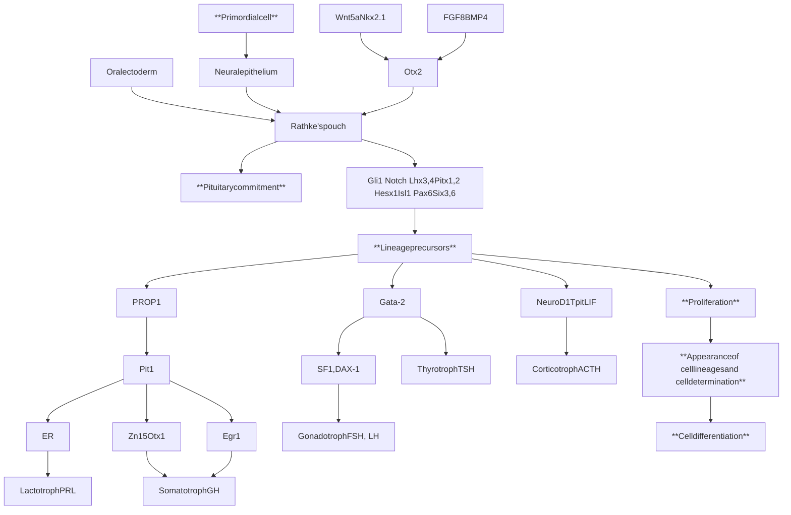
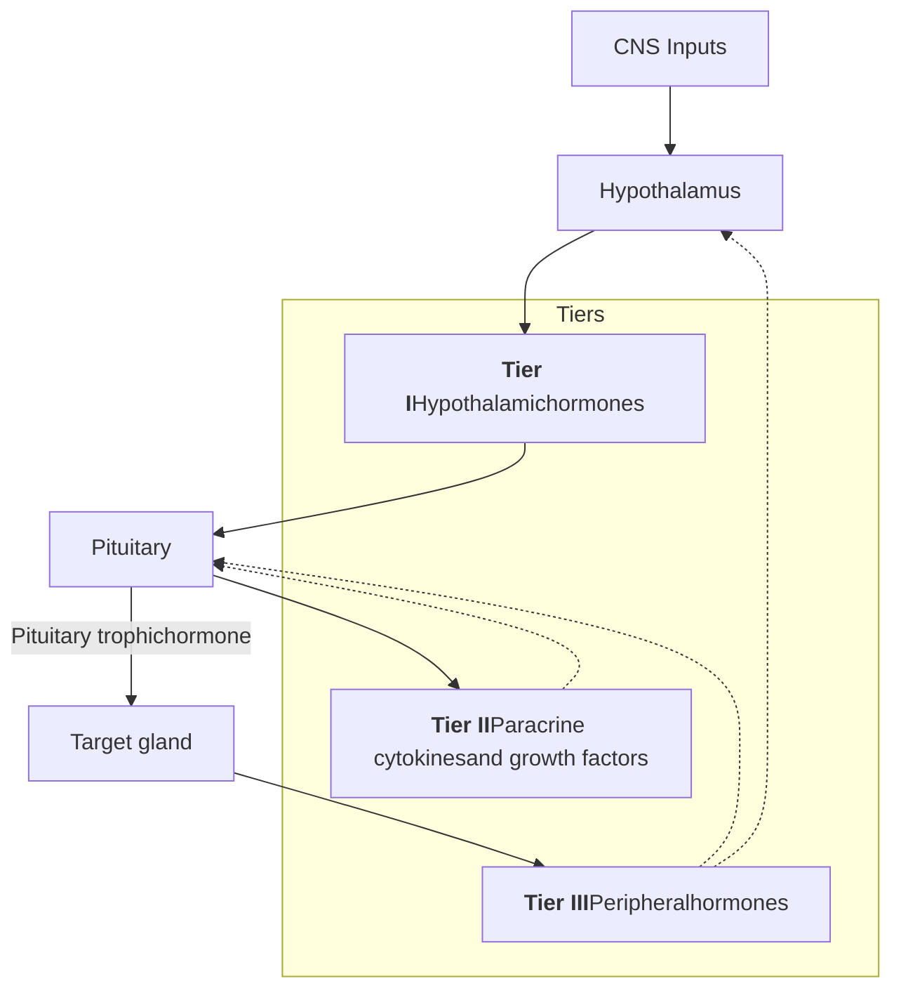
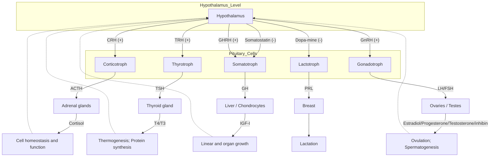
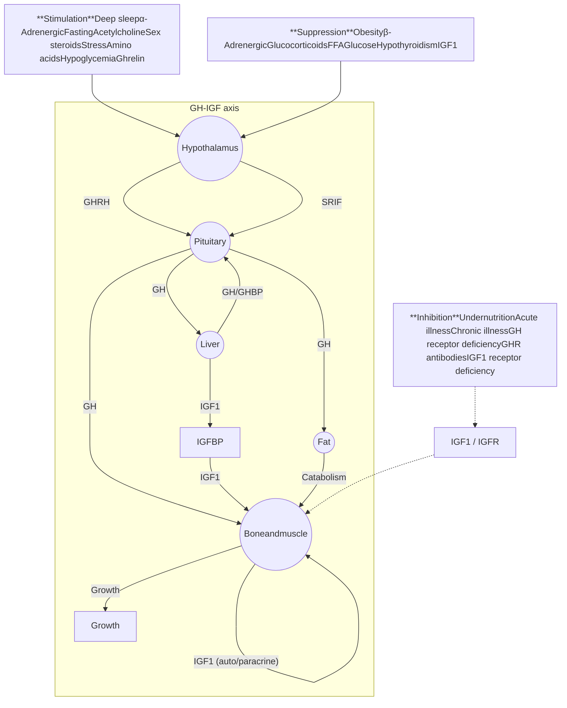
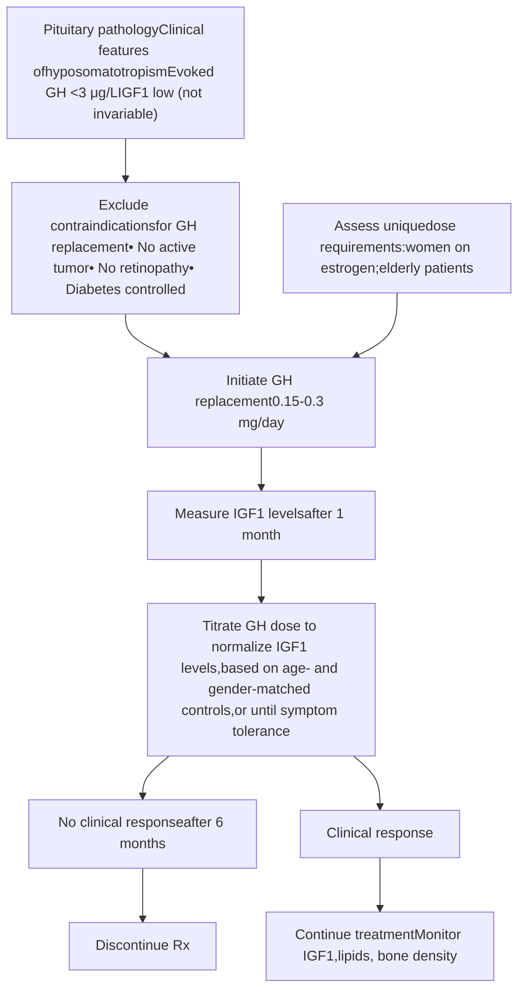
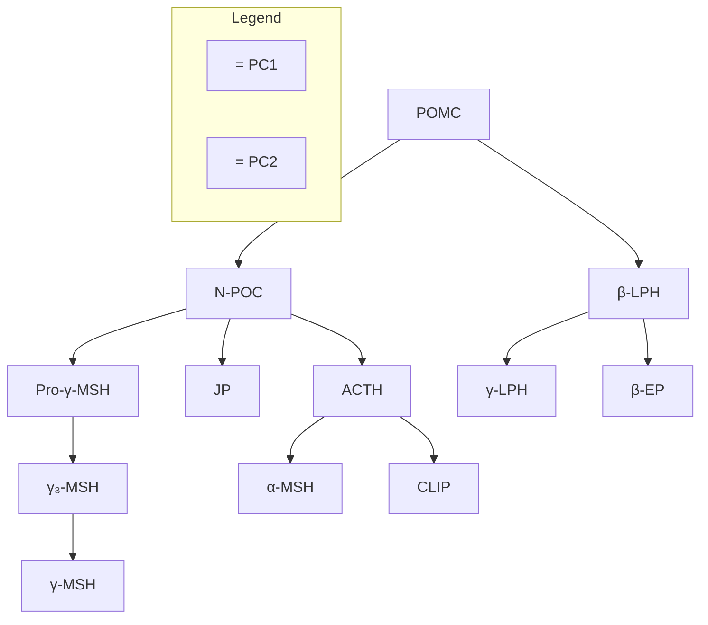
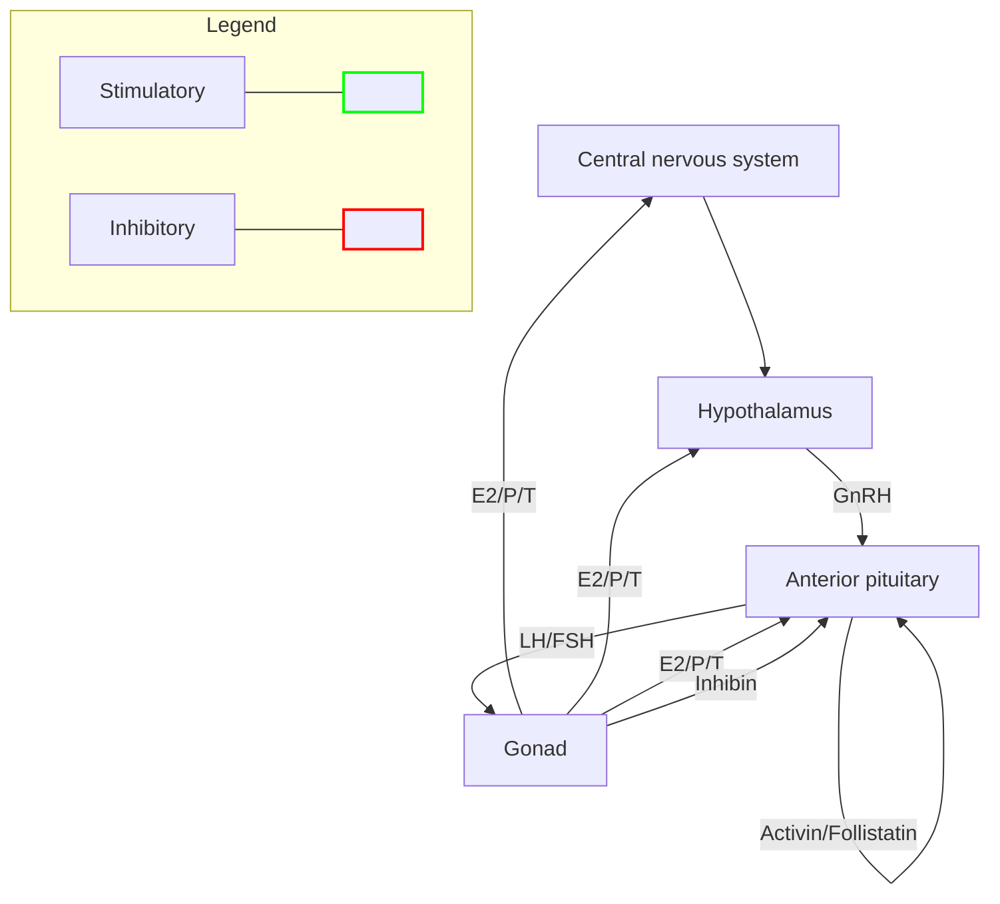
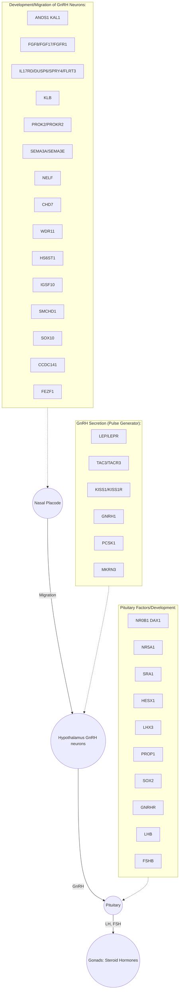
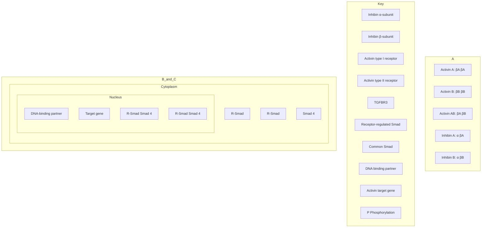
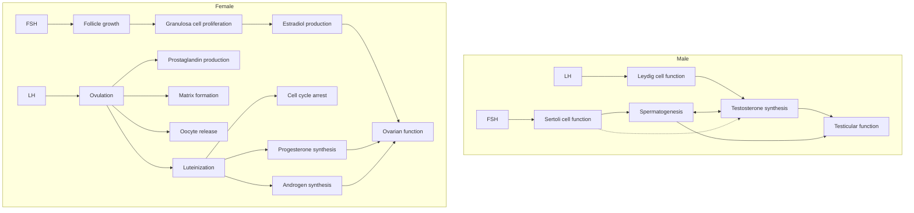

6

# Pituitary Physiology and Diagnostic Evaluation

URSULA KAISER AND KEN K. Y. HO

## CHAPTER OUTLINE

Anatomy, Development, and Overview of Control of Hormone Secretion, 167

Physiology and Disorders of Pituitary Hormone Axes, 171

Developmental, Genetic, and Acquired Causes of Pituitary Failure, 211

## KEY POINTS

* The pituitary gland orchestrates endocrine system integrity through central hypothalamic and peripheral hormonal signals.

* Pituitary gland cells are organized into structural and functional networks formed during embryonic development but modified throughout life.

* Differentiated lactotrophs, somatotrophs, gonadotrophs, corticotrophs, and thyrotrophs are each regulated by system-specific factors.

* The growth hormone axis controls growth in childhood while regulating energy and substrate metabolism throughout life.

* Prolactin, responsible primarily for milk production during pregnancy and lactation, is uniquely under tonic inhibitory hypothalamic control by dopamine.

* The hypothalamic-pituitary-adrenal axis is the pivotal system subserving stress and survival, elaborated through effects on energy supply, fuel metabolism, immunity, and cardiovascular function.

* The hypothalamic-pituitary-gonadal axis plays a pivotal role in puberty, reproductive function, and fertility, controlling both gametogenesis and sex steroid hormone production.

* The hypothalamic-pituitary-thyroid axis plays a critical role in development, growth, and cellular metabolism, mediated by thyroid hormones.

* Pituitary gland failure can arise from developmental, heritable, and acquired disorders and is diagnosed by baseline and provocative pituitary and target gland hormone testing.

## Anatomy, Development, and Overview of Control of Hormone Secretion

The pituitary gland, situated within the sella turcica, derives its name from the Greek *ptuo* and Latin *pituita*, meaning "phlegm," reflecting its nasopharyngeal origin. Galen hypothesized that nasal phlegm originated from the brain and drained via the pituitary gland. It is now clear that, together with the hypothalamus, the pituitary orchestrates the structural integrity and function of endocrine glands, including the thyroid, adrenal, and gonads, in addition to target tissues, including liver, cartilage, and breast. The pituitary stalk serves as an anatomic and functional connection to the hypothalamus. Preservation of the hypothalamo-pituitary unit is critical for integration of systemic and central nervous system (CNS) inputs for anterior pituitary control of sexual function and fertility, linear and organ growth, lactation, stress responses, energy, appetite, and temperature regulation and secondarily for carbohydrate and mineral metabolism.

Integration of vital body functions by the brain was first proposed by Descartes in the 17th century. In 1733, Morgagni 

 recorded the absence of adrenal glands in an anencephalic neonate, providing early evidence for a developmental and functional connection between the brain and the adrenal glands. In 1849, Claude Bernard set the stage for the subsequent advances in neuroendocrinology by demonstrating that central lesions to the area of the fourth ventricle resulted in polyuria.<sup>1</sup> Subsequent studies led to the identification and chemical isolation of pituitary hormones, and astute clinical observations led to the realization that pituitary tumors were associated with functional hypersecretory syndromes, including acromegaly and Cushing disease.<sup>2–4</sup> In 1948, Geoffrey Harris, the father of modern neuroendocrinology, reviewed the control of anterior pituitary gland hormones and proposed their hypothalamic regulation, predicting the subsequent discovery of specific hypothalamic-regulating hormones.<sup>5</sup>

## Anatomy

The pituitary gland comprises the predominant anterior lobe, the posterior lobe, and a vestigial intermediate lobe (Fig. 6.1). The gland is situated within the bony sella turcica and is overlain by

<page_number>167</page_number>

Downloaded for d4030sltung d4030sltung ([d4030sltung@gmail.com](mailto:d4030sltung@gmail.com)) at Tungs' Taichung MetroHarbor Hospital from [ClinicalKey.com](https://ClinicalKey.com) by Elsevier on August 18, 2026. For personal use only. No other uses without permission. Copyright ©2026. Elsevier Inc. All rights reserved.

<page_number>168</page_number> 

SECTION II 

Hypothalamus and Pituitary

Schematic representation of the blood supply of the hypothalamus and pituitary, showing various arteries, veins, and tracts including the superior and inferior hypophyseal arteries, portal vessels, and the anterior and posterior lobes of the pituitary gland.

• **Fig. 6.1** Schematic representation of the blood supply of the hypothalamus and pituitary. (From Scheithauer BW. The hypothalamus and neurohypophysis. In: Kovacs K, Asa SL, eds. *Functional Endocrine Pathology*. Oxford, UK: Blackwell Scientific; 1991.)

the dural diaphragma sella, through which the stalk connects to the median eminence of the hypothalamus. The adult pituitary weighs approximately 600 mg and measures approximately 13 mm in the longest transverse diameter, 6 to 9 mm in vertical height, and about 9 mm anteroposteriorly. Structural variation may occur in multiparous women, and gland volume also changes during the menstrual cycle. During pregnancy these measurements may be increased in any dimension, with pituitary weight increasing up to 1 g.

The sella turcica, located at the base of the skull, forms the thin bony roof of the sphenoid sinus. The lateral walls comprise either bony or dural tissue around the cavernous sinuses, which are traversed by the third, fourth, and six cranial nerves and internal carotid arteries. Thus, the cavernous sinus contents are vulnerable to intrasellar expansion. The dural roofing protects the gland from compression by fluctuant cerebrospinal fluid (CSF) pressure. The optic chiasm, located anterior to the pituitary stalk, is directly above the diaphragma sella. The optic tracts and central structures are therefore vulnerable to pressure effects by an expanding pituitary mass, which typically follows the path of least tissue resistance. The posterior pituitary gland, in contrast to the anterior pituitary, is directly innervated by the supraopticohypophyseal and tuberohypophyseal nerve tracts of the posterior stalk. Hypothalamic neuronal lesions, stalk disruption, or systemically derived metastases to the hypothalamus are therefore often associated with attenuated vasopressin (arginine vasopressin [AVP] deficiency,<sup>6</sup> or diabetes insipidus) or oxytocin secretion.

The hypothalamus contains, among other neuronal populations, nerve cell bodies that synthesize hypophysiotropic releasing and inhibiting hormones, as well as the neurohypophyseal hormones of the posterior pituitary (AVP and oxytocin). Five distinct hormone-secreting cell types are present in the mature anterior pituitary gland:

1. Corticotroph cells express pro-opiomelanocortin (POMC) peptides, including adrenocorticotropic hormone (ACTH).

2. Somatotroph cells express growth hormone (GH).

3. Thyrotroph cells express the common glycoprotein α-subunit and the specific thyroid-stimulating hormone (TSH; thyrotropin) β-subunit.

4. Gonadotroph cells express the common α-subunits and unique β-subunits for both follicle-stimulating hormone (FSH) and luteinizing hormone (LH).

5. Lactotroph cells express prolactin (PRL).

Each cell type is under highly specific signal controls that regulate their respective differentiated gene expression. The pituitary gland also contains support cells, known as *pituicytes* or *folliculostellate cells*.

## Pituitary Blood Supply

The pituitary gland receives an abundant blood supply derived from several sources (see Fig. 6.1). The superior hypophyseal

Downloaded for d4030sltung d4030sltung ([d4030sltung@gmail.com](mailto:d4030sltung@gmail.com)) at Tungs' Taichung MetroHarbor Hospital from [ClinicalKey.com](https://www.clinicalkey.com) by Elsevier on August 18, 2026. For personal use only. No other uses without permission. Copyright ©2026. Elsevier Inc. All rights reserved.

CHAPTER 6 Pituitary Physiology and Diagnostic Evaluation 169

arteries branch from the internal carotid arteries to supply the hypothalamus, where they form a capillary network in the median eminence, which is external to the blood-brain barrier. Both long and short hypophyseal portal vessels originate from infundibular plexuses and the stalk, respectively. These vessels form the hypothalamic portal circulation, the predominant blood supply to the anterior pituitary gland. They deliver hypothalamic-releasing and hypothalamic-inhibiting hormones to the hormone-producing cells of the adenohypophysis, without significant systemic dilution, allowing the pituitary cells to be sensitively regulated by timed hypothalamic hormone secretion. Vascular transport of hypothalamic hormones is also locally regulated by a contractile internal capillary plexus (gomitoli), derived from stalk branches of the superior hypophysial arteries.<sup>7</sup> Retrograde blood flow toward the median eminence also occurs, facilitating bidirectional functional hypothalamic-pituitary interactions.<sup>8</sup> Systemic arterial blood supply is maintained by inferior hypophyseal arterial branches, which predominantly supply the posterior pituitary. Disruption of stalk integrity may lead to compromised pituitary portal blood flow, depriving the anterior pituitary cells of hypothalamic hormone input.

## Pituitary Development

The pituitary gland arises from within the rostral neural plate. Rathke’s pouch, a primitive ectodermal invagination anterior to the roof of the oral cavity, gives rise to the anterior pituitary gland (Fig. 6.2).<sup>9,10</sup> The pouch is directly connected to the stalk and hypothalamic infundibulum and ultimately becomes distinct from the oral cavity and nasopharynx. Rathke’s pouch proliferates toward the third ventricle, where it fuses with the diverticulum and subsequently obliterates its lumen, which may persist as Rathke’s cleft. Remnants of pituitary tissue may persist in the nasopharyngeal midline and rarely give rise to functional ectopic hormone-secreting tumors in the nasopharynx. The neurohypophysis arises from neural ectoderm associated with third ventricle development.<sup>11</sup>

Functional development of the anterior pituitary cell types involves spatiotemporal regulation of cell-lineage–specific transcription factors expressed in pluripotential pituitary stem cells, as well as dynamic gradients of locally acting soluble factors.<sup>12–15</sup> Critical neuroectodermal signals for pituitary morphogenesis include infundibular bone morphogenetic protein 4 (BMP4), fibroblast growth factor (FGF)8, FGF10, WNT5, and WNT4.<sup>10,16,17</sup> Subsequent ventral developmental patterning and transcription factor expression are determined by spatial and graded expression of factors, including BMP2 and sonic hedgehog (SHH) protein, which appear critical for directing early patterns of cell proliferation.<sup>18,19</sup>

The human fetal Rathke’s pouch is evident at 3 weeks,<sup>20</sup> and the pituitary grows rapidly in utero. By 7 weeks, the anterior pituitary vasculature begins to develop, and by 20 weeks, the entire hypophyseal portal system is established. The anterior pituitary undergoes major cellular differentiation during the first 12 weeks, by which time all the major secretory cell compartments are structurally and functionally intact, except for lactotrophs. Totipotential pituitary stem cells give rise to acidophilic (mammosomatotroph, somatotroph, lactotroph) and basophilic (corticotroph, thyrotroph, and gonadotroph) differentiated pituitary cell types, which appear at clearly demarcated developmental stages. At 6 weeks, corticotroph cells are morphologically identifiable, and immunoreactive ACTH is detectable by 7 weeks. At 8 weeks, somatotroph cells are evident, with abundant immunoreactive cytoplasmic GH

expression. Glycoprotein hormone–secreting cells express a common $\alpha$-subunit, and at 12 weeks, differentiated thyrotrophs and gonadotrophs express immunoreactive $\beta$-subunits for TSH, LH, and FSH, respectively.<sup>21</sup> Fully differentiated PRL-expressing lactotrophs are only evident late in gestation, after 24 weeks. Before that time, immunoreactive PRL is only detectable in mixed mammosomatotrophs, also expressing GH, reflecting the common genetic origin of these two hormones.<sup>22</sup>

## Pituitary Transcription Factors

Determination of anterior pituitary cell type lineages results from a temporally regulated cascade of homeodomain transcription factors.<sup>12,16,23</sup> Although most pituitary developmental information has been acquired from murine models,<sup>24</sup> histologic and pathogenetic observations in human subjects largely corroborate these developmental mechanisms (see Fig. 6.2; Tables 6.1 and 6.2). Early cell differentiation requires intracellular Hesx1 and Pitx expression. Rathke’s pouch expresses several transcription factors of the LIM homeodomain family, including Lhx3, Lhx4, and Isl1,<sup>24</sup> which are early determinants of functional pituitary development. In contrast, activated Notch2 delays murine gonadotroph differentiation.<sup>25</sup> Wnt/$\beta$-catenin signaling leads to suppression of Hesx1 and induction of Prophet of Pit 1 (Prop1),<sup>26</sup> which participate in a highly orchestrated cascade that ultimately leads to the commitment of the five differentiated cell types (see Fig. 6.2). Prop1, a member of the paired-like family of homeodomain transcription factors, determines subsequent development of Pou1f1 (Pit1)-dependent and gonadotroph cell lineages, whereas corticotroph cell commitment is directed by Tbx19 protein (previously referred to as *Tpit*).<sup>27–30</sup>

The homeodomain proteins, Pitx1 and Pitx2, behave as universal pituitary regulators and activate transcription of all of the major anterior pituitary hormones.<sup>31,32</sup> Pitx1 is expressed in the oral ectoderm and subsequently in all pituitary cell types.<sup>33</sup> Rieger syndrome, characterized by defective eye, tooth, umbilical cord, and pituitary development, is caused by mutations in Pitx2.<sup>34</sup> Lhx3 determines GH, PRL, and TSH cell differentiation. Prop1, expressed early in the development of Rathke’s pouch, is a prerequisite for Pit1, a POU homeodomain transcription factor that activates and regulates somatotroph, lactotroph, and thyrotroph development and determines appropriate temporal and spatial expression of GH, PRL, and TSH. Signal-dependent coactivating factors cooperate with Pit1 to determine specific hormone expression; in Pit1-containing cells, high estrogen receptor levels induce a commitment to express PRL, whereas thyrotroph embryonic factor (TEF) favors TSH expression. Steroidogenic factor 1 (SF1) and DAX1 determine gonadotroph development.<sup>35,36</sup> TSH and gonadotropin-expressing cells share a common $\alpha$-subunit ($\alpha$GSU) expression under developmental control of Gata2.<sup>37</sup> Foxl2, a forkhead transcription factor, regulates differentiation of cell types expressing $\alpha$GSU, including gonadotrophs and thyrotrophs, and transcription of $\alpha$GSU and FSH$\beta$.<sup>16,38–41</sup> Tbx19 protein is a prerequisite for POMC expression.<sup>42</sup> Hereditary mutations arising within these transcription factors may result in isolated or combined pituitary hormone failure syndromes (see “Heritable Disorders” section in this chapter).<sup>43</sup>

## Pituitary Stem Cells

The adult pituitary gland exhibits plastic and regenerative trophic properties, which allow maintenance of homeostatic functions.<sup>44</sup>

Downloaded for d4030sltung d4030sltung ([d4030sltung@gmail.com](mailto:d4030sltung@gmail.com)) at Tungs' Taichung MetroHarbor Hospital from [ClinicalKey.com](https://www.clinicalkey.com) by Elsevier on August 18, 2026. For personal use only. No other uses without permission. Copyright ©2026. Elsevier Inc. All rights reserved.

<page_number>170</page_number>

SECTION II

Hypothalamus and Pituitary



| Fetal appearance | 12 weeks | 8 weeks |  |  |  |
| --- | --- | --- | --- | --- | --- |
| Hormone | FSH LH | TSH | PRL | GH | POMC |
| Chromosomal gene locus | β-11p; β-19q | α-6q; β-1p | 6 | 17q | 2p |
| Protein | Glycoprotein α, β subunits | Glycoprotein α, β subunits | Polypeptide | Polypeptide | Polypeptide |
| Amino acids | 210 204 | 211 | 199 | 191 | 266 (ACTH 1-39) |
| Stimulators | GnRH, estrogen | TRH | Estrogen, TRH | GHRH GHS | CRH, AVP gp-130 cytokines |
| Inhibitors | Sex steroids, inhibition | T3, T4, Dopamine, somatostatin glucocorticoids | Dopamine | Somatostatin, IGF activins | Glucocorticoids |
| Target gland | Ovary, testis | Thyroid | Breast, other tissues | Liver, bones, other tissues | Adrenal |
| Trophic effect | Sex steroid Follicle growth Germ cell maturation | T4 Synthesis and secretion | Milk production | IGF-I production, growth induction, insulin antagonism | Steroid production |
| Normal range | M, 5-20 IU/L F (basal) 5-20 IU/L | 0.1-5 mU/L | M <15; F <20 μg/L | <0.5 μg/L | ACTH, 4-22 pg/L |

\* **Fig. 6.2** Model for development of the human anterior pituitary gland and cell-lineage determination by a cascade of transcription factors. Trophic cells are depicted with transcription factors known to determine cell-specific human or murine gene expression. *ACTH*, adrenocorticotropic hormone; *AVP*, arginine vasopressin; *CRH*, corticotropin-releasing hormone; *ER*, estrogen receptor; *F*, female; *FSH*, follicle-stimulating hormone; *GH*, growth hormone; *GHRH*, growth hormone–releasing hormone; *GHS*, growth hormone secretagogue; *GnRH*, gonadotropin-releasing hormone; *IGF*, insulin-like growth factor; *LH*, luteinizing hormone; *M*, male; *POMC*, pro-opiomelanocortin; *PRL*, prolactin; *T<sub>3</sub>*, triiodothyronine; *T<sub>4</sub>*, thyroxine; *TRH*, thyrotropin-releasing hormone; *TSH*, thyrotropin. (Adapted from Shimon I, Melmed S. Anterior pituitary hormones. In: Conn P, Melmed S, eds. *Scientific Basis of Endocrinology*. Totowa, NJ: Humana Press; 1996; and Amselem S. Perspectives on the molecular basis of developmental defects in the human pituitary region. In: Rappaport R, Amselem S, eds. *Hypothalamic-Pituitary Development*. Basel, Switzerland: Karger; 2001; and Dasen JS, O’Connell SM, Flynn SE, et al. Reciprocal interactions of Pit1 and GATA2 mediate signaling gradient-induced determination of pituitary cell types. *Cell*. 1999;97:587–598.)

This characteristic is exemplified by pituitary lactotroph expansion during pregnancy and pituitary trophic hormone cell hyperplasia occurring after target organ ablation.

Pituitary stem cells of the pituitary actively generate new cells during early postnatal development but remain mostly quiescent

during adulthood.<sup>45</sup> Pituitary cells have been identified with characteristics of a stem cell phenotype, including an undifferentiated gene profile, clonality, the ability to form colonies, and expression of stem cell markers such as SOX2, SOX9, and OCT4.<sup>46,47</sup> Cell-lineage tracing has demonstrated that SOX2- and

<page_number>170</page_number>
Downloaded for d4030sltung d4030sltung ([d4030sltung@gmail.com](mailto:d4030sltung@gmail.com)) at Tungs' Taichung MetroHarbor Hospital from [ClinicalKey.com](https://ClinicalKey.com) by Elsevier on August 18, 2026. For personal use only. No other uses without permission. Copyright ©2026. Elsevier Inc. All rights reserved.

CHAPTER 6 Pituitary Physiology and Diagnostic Evaluation <page_number>171</page_number>

| TABLE 6.1 Etiology of Inherited Pituitary Deficiency |  |
| --- | --- |
| Mutation | Hormone Deficit |
| Receptor |  |
| GHRH receptor | GH |
| CRH receptor | ACTH |
| GnRH receptor | FSH, LH |
| TRH receptor | TSH |
| Structural |  |
| Pituitary aplasia | Any |
| Pituitary hypoplasia | Any |
| CNS masses; encephalocele | Any |
| Transcription Factor Defect |  |
| HESX1 | GH, PRL, TSH, LH, FSH, ACTH |
| SOX2/3 | GH, PRL, TSH, LH, FSH, ACTH |
| SIX6 | GH, PRL, TSH, LH, FSH, ACTH |
| LHX3/4 | GH, PRL, TSH, LH, FSH, ACTH |
| PITX2 | GH |
| PROP1 | GH, PRL, TSH, LH, FSH, ACTH |
| POU1F1 | PRL, GH, TSH |
| FOXA2 | ACTH, TSH, GH |
| IGSF1 | PRL, GH, TSH |
| TBX19 | ACTH |
| NR5A1 | LH, FSH |
| NR0B1 | LH, FSH |
| Hormone Mutation |  |
| GH1 | GH |
| Bioinactive GH | GH |
| FSHβ | FSH |
| LHβ | LH |
| TSHβ | TSH |
| POMC | ACTH |
| POMC processing defect | ACTH |
| PC1 | ACTH, FSH, LH |

ACTH, adrenocorticotropic hormone; CNS, central nervous system; CRH, corticotropin-releasing hormone; FSH, follicle-stimulating hormone; GH, growth hormone; GHRH, growth hormone–releasing hormone; GnRH, gonadotropin-releasing hormone; GPR, orphan G protein–coupled receptor; LH, luteinizing hormone; POMC, pro-opiomelanocortin; PRL, prolactin; TSH, thyroid-stimulating hormone; TRH, thyrotropin-releasing hormone.

SOX9-expressing progenitors can self-renew and give rise to pituitary endocrine cells in vivo, supporting the model of these as tissue stem cells.<sup>48–50</sup> Other markers, including Notch, Wnt, and SHH, are essential transcription factors for cell type determination and expansion of pituitary cell lineages.<sup>47,51,52</sup> A population of nestin-expressing murine pituitary cells has also been suggested to fulfill criteria consistent with pituitary-specific multipotent stem cells.<sup>53</sup>

Expression of nestin in the marginal zone around Rathke’s cleft has suggested that the stem cell population may exist in this marginal zone.<sup>54</sup> Single-nucleus RNA-sequencing from postmortem human pituitaries identified uncommitted human pituitary stem cells expressing *SOX2*, *SOX9*, and Hippo pathway effectors, as well as lineage-committed progenitors expressing *GATA3*, *POMC*, or *POU1F1*.<sup>55</sup> Advances have also been made toward recapitulation of pituitary differentiation in vitro—three-dimensional (3D) cultures of embryonic stem cells have been stimulated to differentiate into Rathke’s pouch–like 3D structures, and various endocrine cells, including functional corticotrophs and somatotrophs, were subsequently produced.<sup>56,57</sup> This area of research opens avenues for novel regenerative therapies for pituitary diseases, such as hypopituitarism, and for understanding the potential role of pluripotent pituitary stem or progenitor cells in pituitary tumorigenesis.<sup>47,58</sup>

## Pituitary Control

The endocrine and nonendocrine cells of the pituitary gland are organized into structural and functional networks formed during embryonic development but modified throughout life.<sup>59</sup> The various endocrine cell types form distinct networks in spatial relationships with the vasculature that can explain the marked secretory capacity.<sup>60</sup> The existence of these endocrine cell networks indicates that the pituitary is more than a gland that simply responds to external regulation; rather, it is an oscillator that can imprint memory and adapt to coordinated network responses to hypothalamic inputs.<sup>60</sup>

Three levels of control subserve the regulation of anterior pituitary hormone secretion (Fig. 6.3). Hypothalamic control is mediated by adenohypophysiotropic hormones secreted into the hypothalamic portal system to impinge directly upon anterior pituitary cell surface receptors. G protein–coupled cell surface membrane-binding sites are highly selective and specific for each of the hypothalamic hormones and elicit positive or negative signals mediating pituitary hormone gene transcription and secretion. Peripheral hormones also participate in mediating pituitary cell function, predominantly by negative feedback regulation of trophic hormones by their respective target hormones. Intrapituitary paracrine and autocrine growth factors and cytokines act to locally regulate neighboring cell development and function. The net result of these three tiers of intracellular signals is the controlled pulsatile secretion of the six pituitary trophic hormones: ACTH, GH, PRL, TSH, FSH, and LH (Fig. 6.4). Temporal and quantitative control of pituitary hormone secretion is critical for physiologic integration of peripheral hormonal systems, as exemplified by the menstrual cycle, which relies on complex and precisely regulated hormonal pulse control.

# Physiology and Disorders of Pituitary Hormone Axes

## Prolactin

### Physiology

PRL is produced primarily by pituitary lactotrophs and is tonically inhibited by hypothalamic dopamine. The identification of PRL in humans was elusive until 1970 because human GH is highly lactogenic and active in bioassays used to isolate and measure PRL.<sup>61</sup> Furthermore, GH is present in human pituitary glands in much higher concentrations (5–10 mg) than PRL (approximately

Downloaded for d4030sltung d4030sltung ([d4030sltung@gmail.com](mailto:d4030sltung@gmail.com)) at Tungs' Taichung MetroHarbor Hospital from [ClinicalKey.com](https://ClinicalKey.com) by Elsevier on August 18, 2026. For personal use only. No other uses without permission. Copyright ©2026. Elsevier Inc. All rights reserved.

172 SECTION II Hypothalamus and Pituitary

| TABLE 6.2 Hereditary Pituitary Deficiency Caused by Transcription Factor Mutations |  |  |  |  |  |
| --- | --- | --- | --- | --- | --- |
| Gene | Chromosome | Pituitary Deficiency | MRI | Associated Malformations | Inheritance Mode |
| POU1F1 | 3p11 | GH, PRL, ± TSH | Normal or hypoplastic anterior pituitary | — | Recessive, dominant |
| PROP1 | 5q35 | GH, PRL, TSH, LH, FSH, ± ACTH | Normal, hypoplastic, hyperplastic, or cystic anterior pituitary | — | Recessive |
| HESX1 | 3p21 | GH, PRL, TSH, LH, FSH, ACTH Posterior defects | Hypoplastic or hyperplastic anterior pituitary; normal or ectopic posterior pituitary | Septo-optic dysplasia | Recessive |
| PITX2 | 4q25 | GH, PRL, TSH, FSH, LH | — | Rieger syndrome | Dominant |
| LHX3 | 9q34 | GH, PRL, TSH, LH, FSH, + ACTH | Hypoplastic or hyperplastic anterior pituitary | Limited neck rotation, short cervical spine | Recessive |
| LHX4 | 1q25 | GH, TSH, ACTH | Hypoplastic anterior pituitary Ectopic posterior pituitary | — | Dominant |
| TBX19 | 1q23 | ACTH | Normal | — | Recessive |
| OTX2 |  | GH, PRL, TSH, LH, FSH, ACTH | Hypoplastic anterior pituitary Ectopic posterior pituitary | Eye malformations | Dominant |
| SIX6 | 14q22 | GH, PRL, TSH, LH, FSH, ACTH | Hypoplastic pituitary Absent chiasm | Brachio-otorenal and oculoauriculo-vertebral syndromes | Dominant |
| SOX2 | 3q26 | GH, FSH, LH | Anterior pituitary hypoplasia Midbrain defects | Anophthalmia/microphthalmia Esophageal atresia |  |
| SOX3 | Xq27 | GH, TSH, ACTH, FSH, LH | Anterior pituitary hypoplasia Ectopic posterior pituitary | Mental retardation | X-linked |
| IGSF1 | Xq25 | GH, PRL, TSH | — | Testicular enlargement | X-linked |
| NR5A1 | 9q33 | FSH, LH | — | Adrenal insufficiency, gonadal defects, XY sex reversal | Dominant, recessive |
| NR0B1 | Xp21.3 | FSH, LH | — | Adrenal hypoplasia congenita, gonadal defects, XY sex reversal | X-linked |
| GPR161 | 1q24.2 | GH, TSH | Pituitary stalk interruption syndrome | Alopecia, ptosis, short 5th finger | Recessive |
| ARNT2 | 15q25.1 | ACTH, TSH, GH, LH, FSH | Hypoplastic anterior pituitary and pituitary stalk interruption | Microcephaly, visual and renal abnormalities | Recessive |
| NFKB2 | 10q24 | ACTH, GH, TSH | — | Variable immune deficiency | Dominant |
| FOXA2 | 20p11 | ACTH, TSH, GH | Hypoplastic anterior pituitary and ectopic posterior pituitary bright spot | Hyperinsulinemic hypoglycemia | — |

Genes involved in pituitary development, or in maintaining integrity of the hypothalamic-pituitary axis. Functional defects include missense or frameshifts leading to truncated or deleted protein, DNA binding abnormality.

100 μg).<sup>62</sup> Purification and isolation of PRL by Friesen and development of a specific radioimmunoassay underscored the utility of PRL measurements in understanding human disease.<sup>63,64</sup>

**Lactotroph Cells.** About 15% to 25% of functioning anterior pituitary cells are lactotrophs. Most PRL-expressing cells appear

to arise from GH-producing cells. Ablation of somatotrophs by expression of GH-diphtheria toxin and GH-thymidine kinase fusion genes inserted into the germline of transgenic mice eliminates most lactotrophs, suggesting that the majority of PRL-producing cells arise from postmitotic somatotrophs in mice.<sup>65,66</sup>

Downloaded for d4030sltung d4030sltung ([d4030sltung@gmail.com](mailto:d4030sltung@gmail.com)) at Tungs' Taichung MetroHarbor Hospital from [ClinicalKey.com](https://ClinicalKey.com) by Elsevier on August 18, 2026. For personal use only. No other uses without permission. Copyright ©2026. Elsevier Inc. All rights reserved.

CHAPTER 6 Pituitary Physiology and Diagnostic Evaluation 173

A zinc-finger protein, ZBTB20, has been shown to be important for lactotrope lineage specification.<sup>67</sup> PRL is found in large polyhedral cells throughout the gland and in smaller angulated or elongated cells clustered in the lateral wings and median wedge. Large PRL secretory granules (250–800 nm) are present in the evenly distributed cells, whereas the laterally localized cells are sparsely populated by smaller (200- to 350-nm) granules. Occasional mammosomatotroph cells cosecrete both PRL and GH, often stored within the same granule. In animal models, lactotroph cell function is heterogeneous. Thus, dopamine or thyrotropin-releasing



• **Fig. 6.3** Model for regulation of anterior pituitary hormone secretion by three tiers of control. Hypothalamic hormones traverse the portal system and impinge directly upon their respective target cells. Intrapituitary cytokines and growth factors regulate tropic cell function by paracrine (and autocrine) control. Peripheral hormones exert negative feedback inhibition of respective pituitary trophic hormone synthesis and secretion. (From Ray D, Melmed S. Pituitary cytokine and growth factor expression and action. *Endocr Rev.* 1997;18:206–228.)

hormone (TRH) responsiveness, and shifting proportions of PRL versus GH secreting cells, may depend on cell localization within the pituitary, as well as the surrounding hormonal milieu, especially that of estrogen.<sup>68</sup> Although their absolute number is similar in men and women and does not change with age, lactotroph hyperplasia does occur during pregnancy and lactation<sup>69</sup> and resolves within several months of delivery.

**Prolactin Structure.** The human PRL gene, located on chromosome 6,<sup>70</sup> arose from a single common ancestral gene, which gave rise to the relatively homologous PRL, GH, and placental lactogen-related proteins.<sup>71</sup> Several factors influence *PRL* gene expression, including estrogen, dopamine, and TRH.<sup>72</sup> The *PRL* gene is transcribed from two alternative promoter regions, with the more proximal directing pituitary-specific expression and the more upstream, distal promoter region directing extrapituitary expression (Fig. 6.5).<sup>73</sup> PRL is a 199–amino acid polypeptide containing three intramolecular disulfide bonds (see Fig. 6.5). It circulates in blood in various sizes: monomeric PRL (“little prolactin”; 23 kDa), dimeric PRL (“big prolactin”; 48–56 kDa), and macroprolactin (also known as “big, big prolactin,” composed of prolactin bound to immunoglobulins; >100 kDa).<sup>74</sup> The monomeric form is the most bioactive PRL. In response to TRH, the proportion of the monomeric form increases.

Monomeric PRL is cleaved into 8- and 16-kDa forms<sup>75</sup>; the 16-kDa variant is antiangiogenic.<sup>76–78</sup> This 16-kDa PRL cleavage product, also referred to as *vasoinhibin*, has been implicated in peripartum cardiomyopathy.<sup>79,80</sup> The mechanism underlying the association was shown to result from actions of vasoinhibin on capillary endothelial cells, stimulating the production of miR-146a, which in turn acts through a paracrine mechanism on cardiomyocytes to inhibit metabolism by blocking the activity of ERBB4, a tyrosine kinase receptor, to impair cardiomyocyte function.<sup>81</sup> Cardiac dysfunction could be improved by treatment with the dopamine agonist bromocriptine, which results in a fall in miR-146a levels in parallel with an improvement in cardiac



• **Fig. 6.4** Control of hypothalamic-pituitary target organ axes. ACTH, adrenocorticotropic hormone; CRH, corticotropin-releasing hormone; FSH, follicle-stimulating hormone; GH, growth hormone; GHRH, growth hormone–releasing hormone; GnRH, gonadotropin-releasing hormone; IGF, insulin-like growth factor; LH, luteinizing hormone; PRL, prolactin; T<sub>3</sub>, triiodothyronine; T<sub>4</sub>, thyroxine; TRH, thyrotropin-releasing hormone; TSH, thyroid-stimulating hormone. (Adapted from Melmed S. Mechanisms for pituitary tumorigenesis: the plastic pituitary. *J Clin Invest.* 2003;112:1603–1618.)

Downloaded for d4030sltung d4030sltung (d4030sltung@gmail.com) at Tungs' Taichung MetroHarbor Hospital from ClinicalKey.com by Elsevier on August 18, 2026. For personal use only. No other uses without permission. Copyright ©2026. Elsevier Inc. All rights reserved.

174 SECTION II Hypothalamus and Pituitary

Schematic representation of the human PRL gene

Schematic representation of the human PRL protein

• **Fig. 6.5** Schematic representation of the human *PRL* gene and PRL protein. (**A**) The *PRL* gene consists of five exons (E1–E5). *PRL* gene transcription is regulated by two independent promoter regions, upstream of two alternative first exons (1a and 1b). The proximal promoter region directs pituitary-specific expression, whereas the distal promoter region directs extrapituitary expression. Exons 1a and 1b both encode 5′-untranslated sequences, so the protein-coding sequences of both transcripts are identical. (**B**) PRL is a 23-kDa protein comprising 199 amino acids with three disulfide bonds (hatched lines).

function.<sup>82–84</sup> Conversely, vasoinhibin may protect against the angiogenic and vasopermeability effects in diabetic retinopathy.<sup>80</sup>

## Regulation

PRL secretion is under inhibitory control by dopamine, produced by the tuberoinfundibular (TIDA) cells and the hypothalamic tuberohypophyseal dopaminergic system (Fig. 6.6).<sup>85,86</sup> Dopamine reaches the lactotrophs via the hypothalamic-pituitary portal system and binds to type 2 dopamine (D<sub>2</sub>) receptors on pituitary lactotrophs to inhibit PRL secretion.<sup>87</sup> PRL, in turn, participates in negative feedback to control its release, either by increasing tyrosine hydroxylase activity and thereby dopamine synthesis in the TIDA neurons or through direct autocrine actions.<sup>86,88–90</sup> Many other factors modulate PRL secretion, although their physiologic or clinical relevance remains unclear. Factors other than dopamine that inhibit PRL secretion include endothelin-1 and TGFβ1, which act as paracrine PRL inhibitors,<sup>91,92</sup> and calcitonin, which may be derived from the hypothalamus.<sup>93</sup> Several substances act as PRL-releasing factors. Growth factors such as basic FGF and epidermal growth factor (EGF) induce PRL synthesis and secretion. Neuropeptides acting through G protein–coupled receptors to stimulate PRL include vasoactive intestinal polypeptide (VIP), prolactin-releasing peptide (PrRP), opioid peptides, and TRH.<sup>94</sup> Estrogen stimulates *PRL* gene transcription and PRL secretion,<sup>95</sup> explaining why women have higher PRL levels than men, particularly during the periovulatory menstrual phase and in pregnancy.<sup>96,97</sup>

## Prolactin Secretion

The calculated production rate of PRL ranges from 200 to 536 μg/day/m<sup>2</sup>.<sup>98</sup> PRL is cleared rapidly, with a calculated half-life in the circulation ranging from 26 to 47 minutes. PRL secretion occurs episodically, with 4 to 14 secretory pulses over 24 hours,<sup>99,100</sup>

with the highest levels achieved during sleep and the lowest occurring between 10 am and noon.<sup>101</sup> Nocturnal elevation is sleep entrained, and a temporal relationship exists between rapid eye movement (REM) and non-REM sleep cycles.<sup>102</sup> PRL levels decline with age in both men and women. In older men, less PRL is produced with each secretory burst than in younger men.<sup>103</sup> Postmenopausal women have lower mean serum PRL levels and PRL pulse frequency than do premenopausal women, suggesting a stimulatory effect of estrogen on both these parameters.<sup>97</sup>

## Prolactin Action

The PRL receptor gene is a member of the cytokine receptor superfamily,<sup>104</sup> localized to chromosome 5p13, with an extracellular domain, a hydrophobic transmembrane domain, and an intracytoplasmic region homologous to the GH receptor<sup>105</sup> (Fig. 6.7). PRL receptor dimerization occurs in both a ligand-dependent and a ligand-independent manner, with a single PRL molecule binding to both components of the receptor dimer, with phosphorylation of intracellular Janus kinase/signal transducers and activators of transcription (JAK-STAT) molecules subsequent to PRL binding. Two ligand-receptor–binding sites are critical for formation of the trimeric ligand-receptor complex and subsequent signaling.<sup>106–108</sup> The PRL receptor induces protein tyrosine phosphorylation and activation of JAK2 and STAT 1, 3, 5a and 5b.<sup>109,110</sup> STAT5a phosphorylation is particularly important for mammary gland development and lactogenesis.<sup>111</sup>

PRL receptors are ubiquitously expressed in breast tissue as well as the pituitary, liver, adrenal cortex, kidneys, prostate, ovaries, testes, intestine, epidermis, pancreatic islets, lungs, myocardium, brain, and lymphocytes. Regulation of milk production occurs via a cascade of intracellular events. Homozygous mice in which the PRL receptor has been inactivated are infertile.<sup>106</sup> A gain-of-function mutation conferring constitutive activity of the PRL receptor is present in a subset of patients with multiple breast fibroadenomas.<sup>112</sup> PRL receptor antagonists have been developed for targeting the receptor in PRL-sensitive disturbances, including resistant prolactinomas, breast tumors, and prostate tumors.<sup>108,113</sup>

PRL is essential for human species survival because it is responsible for milk production during pregnancy and lactation. Additional biologic functions ascribed to PRL include reproductive, metabolic, and immune effects.<sup>73,90</sup> Although PRL and its receptor are clearly crucial in lower animals,<sup>114</sup> the impact of PRL on maternal behavior in humans has not been fully delineated.

**Mammary Gland Development.** PRL is not essential for pubertal mammary development, which instead requires GH, the action of which is mediated by insulin-like growth factor 1 (IGF-1).<sup>115–117</sup> At birth, the rodent mammary gland consists of a fat pad with small areas of ductal anlagen, which differentiate into pubertal mammary glandular elements under the influence of estrogen, GH, and IGF-1.<sup>118</sup> At puberty, a surge of estrogen begins the developmental process. Terminal end buds form and lead the process of mammary development by branching and extending into the substance of the mammary fat pad to produce a network of ducts that virtually fill the mouse mammary fat pad.<sup>119,120</sup> GH acts on the mammary stromal compartment to produce IGF-1, which, in turn, stimulates formation of terminal end buds and ducts in synergy with estrogen.<sup>117,118</sup> In humans, pubertal mammary development begins in girls between the ages of 8 and 13 (see the discussion of the Tanner developmental scale in Chapter 23). Once fully developed, the pubertal mammary gland remains quiescent until pregnancy, although cyclic changes occur during the menstrual cycle.

Downloaded for d4030sltung d4030sltung ([d4030sltung@gmail.com](mailto:d4030sltung@gmail.com)) at Tungs' Taichung MetroHarbor Hospital from [ClinicalKey.com](https://www.clinicalkey.com) by Elsevier on August 18, 2026. For personal use only. No other uses without permission. Copyright ©2026. Elsevier Inc. All rights reserved.

CHAPTER 6 Pituitary Physiology and Diagnostic Evaluation

175

```mermaid
graph TD
    subgraph Levels
        Hypothalamus
        Hypophyseal_portal_system[Hypophyseal portal system]
        Anterior_pituitary[Anterior pituitary]
        Systemic_circulation[Systemic circulation]
    end

    subgraph Mechanisms
        Hypothyroidism
        Drugs[Antipsychotic drugsSome antidepressantsSignals from spinal cord]
        Lesions[Suprasellar andinfundibular lesions]
        Adenomas[ProlactinomaSome growth hormone-secreting adenomas]
        Estrogen
        Renal_failure[Renal insufficiency/failure]
    end

    TRH([TRH])
    VIP([VIP])
    Dopamine([Dopamine])
    Prolactin([Prolactin])
    Renal_clearance([Renal clearance])

    Hypothalamus --- Hypothyroidism
    Hypothalamus --> TRH
    Hypothalamus --> VIP
    Hypothalamus --> Dopamine
    
    TRH --> Hypophyseal_portal_system
    VIP --> Hypophyseal_portal_system
    Dopamine --| Hypophyseal_portal_system
    
    Drugs --| Dopamine
    
    Hypophyseal_portal_system --> Anterior_pituitary
    Lesions --| Hypophyseal_portal_system
    
    Anterior_pituitary --> Prolactin
    Adenomas --> Prolactin
    Estrogen --> Prolactin
    
    Prolactin --> Systemic_circulation
    Systemic_circulation --> Renal_clearance
    Renal_failure --| Renal_clearance
```

\* **Fig. 6.6** Neuroendocrine regulation of PRL secretion. Regulation of prolactin under physiologic and pathologic conditions. *Black arrows* indicate stimulation, whereas *red bars* depict inhibition. The regulation of serum prolactin occurs at different levels, as illustrated on the left. Common causes of hyperprolactinemia and relevant mechanisms are shown on the right. TRH, thyrotrophin-releasing hormone; VIP, vasoactive intestinal peptide. (From Huang W, Molitch ME. Evaluation and management of galactorrhea. *Am Fam Physician*. 2012;85:1073–1080.)

In human pregnancy, mammary gland alveolar elements proliferate and begin to produce milk proteins and colostrum, primarily under the control of progesterone and PRL.<sup>118</sup> In mice with targeted disruption of the *PRL* or *PRLR* gene, formation of alveolar structures is impaired.<sup>106</sup> Likewise, women with isolated PRL deficiency are unable to lactate, and a woman with compound heterozygous loss-of-function variants of *PRLR* had agalactia and hyperprolactinemia.<sup>121,122</sup> Interestingly, only a minority of women have expressible milk during pregnancy, due to inhibitory effects of estradiol<sup>123</sup> and progesterone<sup>124</sup> on PRL-induced milk production.

**Lactation.** Active lactation is due in part to attenuation of estrogen and progesterone levels and elevation of PRL levels after delivery. Suckling also increases milk production after parturition and is essential for continued lactation because of its effect on pituitary hormone production and because it empties the mammary gland of milk.<sup>125</sup> Milk accumulation inhibits milk synthesis, explaining why a certain level of nursing activity is necessary for successful breastfeeding. In the absence of suckling, PRL concentrations, which rise throughout gestation, return to normal by 7 days postpartum.<sup>126</sup> Suckling also stimulates posterior pituitary oxytocin release, and unlike PRL, oxytocin responses to suckling do not decline for up to 6 months if nursing continues. Oxytocin induces myoepithelial cell contraction, thereby causing

milk ejection.<sup>127</sup> Oxytocin also has important effects on alveolar proliferation.

**Reproductive Function.** Lactation results in amenorrhea and secondary infertility, and this natural form of contraception depends on the frequency and duration of breastfeeding. The Kung hunter-gatherer women suckle their infants approximately four times an hour and at will during the night, and women bear a mean of 4.7 children during their reproductive years.<sup>128</sup> In contrast, the Hutterites of North America bear a mean of 10.6 children during their lifetimes, presumably because they nurse according to a rigid schedule, use supplemental feedings, and wean at 1 year. Amenorrhea and infertility result from PRL-mediated inhibitory effects on hypothalamic gonadotropin-releasing hormone (GnRH) secretion and on the pituitary to reduce secretion of the gonadotropins, LH, and FSH, resulting in a reduction in both amplitude and frequency of LH pulses (Fig. 6.8). In a hyperprolactinemic mouse model, hypothalamic kisspeptin immunoreactivity was reduced, and administration of kisspeptin restored estrous cyclicity, ovulation, and circulating LH and FSH levels. In addition, kisspeptin neurons have been shown to express PRL receptors.<sup>129</sup> Taken together, these data suggested that kisspeptin may be the missing link between hyperprolactinemia and the associated hypogonadotropic hypogonadism, anovulation, and infertility, a conclusion further supported by the demonstration that

Downloaded for d4030sltung d4030sltung ([d4030sltung@gmail.com](mailto:d4030sltung@gmail.com)) at Tungs' Taichung MetroHarbor Hospital from [ClinicalKey.com](https://ClinicalKey.com) by Elsevier on August 18, 2026. For personal use only. No other uses without permission. Copyright ©2026. Elsevier Inc. All rights reserved.

<page_number>176</page_number>

SECTION II

Hypothalamus and Pituitary

Diagram showing ligand-dependent and ligand-independent dimerization of the prolactin receptor (PRLR). Part A illustrates the ligand-dependent model where PRL binding induces dimerization and activation of Jak2 and STAT5a. Part B illustrates the ligand-independent model where PRLR exists as a preformed dimer that is activated upon PRL binding.

\* **Fig. 6.7** Ligand-dependent and ligand-independent dimerization of the prolactin (*PRL*) receptor (*PRLR*). (A) Ligand-dependent dimerization model. PRLR is in monomeric form at the cell membrane. One molecule of PRL first binds to one PRLR monomer via binding site 1, and this 1:1 complex then recruits the second PRLR via binding site 2. Dimerization of the two PRLRs leads to activating changes in the intracellular domain, leading to PRL signal transduction, such as phosphorylation (*P*) of Janus kinase 2 (*Jak2*), phosphorylation of the PRLR, and the recruitment and phosphorylation of the signal transducer and activator of transcription (STAT5). (B) Ligand-independent model. PRLR exists in dimeric form at the cell membrane in the absence of ligand. The receptors are held in an inactive form until binding of PRL to this preformed complex induces activating changes in the intracellular domain, leading to phosphorylation of Jak2, phosphorylation of the PRLR, and recruitment and phosphorylation of STAT5a. (From Clevenger C, Gadd SL, Zheng J. New mechanisms for PRLR action in breast cancer. Trends Endocrinol Metab. 2009;20:223–229.)

kisspeptin administration induced an increase in LH and FSH levels and increased LH pulses.<sup>130–132</sup> During lactation, additional metabolic factors induced by negative energy balance may also contribute to disruption of pulsatile GnRH and LH secretion.

**Other Actions.** Early evidence suggested that PRL regulates immune function, although some evidence indicated that PRL may not be important for immune function<sup>133</sup> because innate immunity was not altered in transgenic mice devoid of either the PRL receptor (*PRLR*<sup>−/−</sup>) or PRL (*PRL*<sup>−/−</sup>).<sup>87,134</sup> Nonetheless, PRL has been shown to have protective effects against inflammation-induced chondrocyte apoptosis, with potential to reduce joint damage and inflammation in rheumatoid arthritis.<sup>73</sup> Prolactin has also been shown to have effects on maternal behavior in rodents, but its role in humans remains to be determined. Other roles that have been proposed for prolactin include effects on neurogenesis, metabolism and glucose homeostasis, appetite regulation, and bone and calcium homeostasis.<sup>73,90</sup> PRL is expressed and secreted in a number of organs, tissues, and cells; the impact of this extrapituitary PRL on localized metabolism and cellular function, including its role in breast and prostate cancer, autoimmune disease, placental function, and metabolism and obesity, remains to be determined.<sup>135</sup>

**Prolactin Measurements.** PRL is usually measured by automated immunoassays, calibrated against the World Health Organization (WHO) 84/500 international standard containing exclusively 23-kDa monomeric human PRL.<sup>136</sup> Stimulation and suppression tests yield nonspecific results and have been largely abandoned.<sup>137</sup>

The serum concentration of PRL can be given in mass concentration (μg/L or ng/mL), molar concentration (nmol/L or pmol/L), or international units (mIU/L). Well-established assay- and sex-specific reference intervals should be used; normal values are higher in women than in men.

In two-site immunoradiometric assays or chemiluminometric assays, extremely high PRL concentrations may saturate the capture and signal antibodies, preventing detection of very high PRL levels and resulting in a falsely lower, only moderately elevated value being reported.<sup>138</sup> This so-called “hook effect” may result in PRL-secreting macroadenomas being misdiagnosed as clinically nonfunctioning adenomas. In patients harboring macroadenomas with clear-cut clinical features of hyperprolactinemia, serum samples should be subjected to at least 1:100 dilution before assay. The hook effect is rarely encountered with current assays.<sup>139</sup>

Conversely, macroprolactin, a physiologically inactive form of prolactin bound to immunoglobulin G (IgG), can lead to a falsely elevated prolactin levels, resulting in a misdiagnosis of hyperprolactinemia. Misdiagnosis can be avoided by asking the laboratory to pretreat the serum with polyethylene glycol to precipitate macroprolactin before the immunoassay for prolactin in the supernatant.<sup>140</sup>

## Hyperprolactinemia

**Causes.** Hyperprolactinemia may be physiologic, pathologic, or drug induced (Box 6.1).<sup>141–143</sup>

Downloaded for d4030sltung d4030sltung ([d4030sltung@gmail.com](mailto:d4030sltung@gmail.com)) at Tungs' Taichung MetroHarbor Hospital from [ClinicalKey.com](https://www.clinicalkey.com) by Elsevier on August 18, 2026. For personal use only. No other uses without permission. Copyright ©2026. Elsevier Inc. All rights reserved.

CHAPTER 6 Pituitary Physiology and Diagnostic Evaluation

177

# Normal hormone profile

| Time (hour) | LH/FSH (mIU/mL) | PRL (μg/L) |
| --- | --- | --- |
| 0 | 15 | 15 |
| 1 | 13 | 14 |
| 2 | 18 | 16 |
| 3 | 14 | 15 |
| 4 | 19 | 18 |
| 5 | 15 | 16 |
| 6 | 17 | 15 |
| 7 | 14 | 17 |
| 8 | 16 | 15 |

## Hyperprolactinemia

| Time (hour) | LH (mIU/mL) | FSH (mIU/mL) | PRL (μg/L) |
| --- | --- | --- | --- |
| 0 | 3 | 8 | 60 |
| 1 | 4 | 9 | 82 |
| 2 | 3 | 8 | 65 |
| 3 | 4 | 9 | 70 |
| 4 | 3 | 8 | 85 |
| 5 | 4 | 9 | 60 |
| 6 | 3 | 8 | 55 |
| 7 | 4 | 9 | 78 |
| 8 | 3 | 8 | 50 |

\* **Fig. 6.8** Effect of hyperprolactinemia to suppress luteinizing hormone (LH) and follicle-stimulating hormone (FSH) secretory patterns, leading to hypogonadotropism in a female patient. PRL, prolactin. (Adapted from Tolis G. Prolactin: physiology and pathology. Hosp Pract. 1980;15:85–95.)

## Physiologic Causes

**Pregnancy.** During pregnancy, the normal pituitary gland increases in size,<sup>69</sup> which is the result of an increase in the number of PRL-producing cells. Serum PRL concentrations rise up to 10 times baseline during pregnancy, and amniotic fluid PRL concentrations are up to 100 times those of maternal or fetal blood.<sup>126</sup>

**Suckling.** Suckling increases serum PRL levels approximately 8.5-fold in actively nursing mothers.<sup>144,145</sup> As nursing continues, PRL concentrations fall, but each suckling episode continues to cause a subsequent episodic rise in serum PRL. Mean serum concentrations were found to be 162 μg/L at 2 to 4 weeks postpartum, 130 μg/L at 5 to 14 weeks, and 77 μg/L at 15 to 24 weeks.<sup>146</sup> It is unclear why active milk production continues despite progressively lower PRL levels following parturition.

**Idiopathic Hyperprolactinemia.** An elevated circulating PRL level in patients in whom no cause is identified is considered idiopathic, and these patients are relatively resistant to dopamine agonist therapy. Mean serum PRL levels in patients with idiopathic hyperprolactinemia are usually less than 100 μg/L.<sup>147</sup>

**Macroprolactinemia.** PRL is a 23-kDa single-chain polypeptide but may also circulate in higher-molecular-weight forms. High-molecular-weight PRL variants may in some situations represent 85% or more of total PRL, but under usual circumstances, the 23-kDa variety predominates. Macroprolactinemia refers to large circulating PRL molecules (>100 kDa) composed of PRL bound to immunoglobulins, which have markedly reduced bioactivity.<sup>74</sup> Few of the expected clinical abnormalities usually associated with hyperprolactinemia (sexual dysfunction, hypogonadism, galactorrhea, osteoporosis) occur in patients with macroprolactinemia.<sup>148</sup> Screening for macroprolactinemia can be accomplished by polyethylene glycol precipitation of serum samples. In a 2005 survey, macroprolactinemia was detected in 22% of 2089 hyperprolactinemia samples.<sup>149</sup>

**Pathologic Causes.** Pathologic hyperprolactinemia may be caused by a prolactinoma, pituitary or sellar tumors that inhibit dopamine because of pressure on the pituitary stalk, or interruption of the vascular connections between the pituitary and hypothalamus. In a large series of histologically confirmed cases, a serum PRL level greater than 2000 mU/L (~100 μg/L) was almost never encountered from stalk dysfunction.<sup>150</sup> However, prolactinomas can present with any level of PRL elevation.

Breast stimulation has only a minimal effect on serum PRL levels. In 18 normal women, serum PRL levels rose from a mean of 10 μg/L to 15 μg/L during breast pump stimulation.<sup>144</sup> Chest wall lesions—for example, in association with herpes zoster (shingles)—can also be associated with mild hyperprolactinemia as a result of activation of neurogenic pathways that inhibit hypothalamic dopamine. Up to 20% of patients with *hypothyroidism* have elevated PRL levels.<sup>151</sup> Treatment of hypothyroidism with thyroid hormone normalizes serum PRL if the hyperprolactinemia is due to thyroid hormone deprivation. PRL is moderately elevated in patients with *chronic renal failure*, particularly those on dialysis.<sup>152</sup> The increase is largely a result of an increase in PRL cleavage products, due in part to a decreased glomerular filtration rate. Hyperprolactinemia is not influenced by intensification of dialysis<sup>153</sup> but is reversed by renal transplantation. Sexual dysfunction is common in men on dialysis, and reducing PRL with dopamine agonists improves sexual function<sup>154</sup> but does not normalize menses in women.<sup>155</sup> PRL levels rise in response to stress, correlate with the degree of stress, and generally return to normal as stress abates. Mean peak serum PRL levels in 19 women undergoing general anesthesia were 39 μg/L immediately before surgery, 173 μg/L at surgery, and still elevated at 47 μg/L 24 hours after surgery.<sup>156</sup> Hyperprolactinemia related to feminizing hormone treatment can occur in up to 20% of transwomen, although it is usually mild and asymptomatic.<sup>157</sup>

Severe head trauma can also result in hyperprolactinemia, often accompanied by AVP deficiency or syndrome of inappropriate antidiuretic hormone secretion (SIADH) and other anterior pituitary hormone deficiencies. Fifty percent of patients develop moderate hyperprolactinemia after cranial and hypothalamic irradiation.

Hyperprolactinemia has been reported in association with inactivating prolactin receptor mutations.<sup>122,158</sup> The presence of hyperprolactinemia in these affected women suggests central negative feedback by prolactin on its secretion in humans, as previously demonstrated in animal studies.<sup>87,159</sup> Lymphocytic hypophysitis can be associated with high PRL levels, reflecting either local autoimmune cell antibody actions or a stalk effect.<sup>160</sup>

**Drug-Induced Hyperprolactinemia.** A variety of medications cause minimal or moderate prolactin elevations. Neuroleptic drugs elevate PRL because of their dopamine receptor antagonist properties, as do atypical antipsychotics that act by antagonizing both serotonin and dopamine receptors. Clozapine and olanzapine weakly induce PRL, and risperidone is a potent PRL stimulator.<sup>161,162</sup> Immune checkpoint inhibitors used in cancer immunotherapy, such as anti-CTLA4 antibodies (e.g., ipilimumab) and, less commonly, anti-PD1 (e.g., nivolumab, pembrolizumab) and anti-PDL1 (e.g., atezolizumab, avelumab, durvalumab) antibodies, can in rare instances be associated with hyperprolactinemia, although they are more commonly associated with prolactin deficiency.<sup>163,164</sup>

Downloaded for d4030sltung d4030sltung ([d4030sltung@gmail.com](mailto:d4030sltung@gmail.com)) at Tungs' Taichung MetroHarbor Hospital from [ClinicalKey.com](https://ClinicalKey.com) by Elsevier on August 18, 2026. For personal use only. No other uses without permission. Copyright ©2026. Elsevier Inc. All rights reserved.

<page_number>178</page_number>

SECTION II

Hypothalamus and Pituitary

# • BOX 6.1 Etiology of Hyperprolactinemia

**Physiologic**

Pregnancy
Suckling
Stress
Sleep
Coitus
Exercise

**Pathologic**

**Hypothalamic-Pituitary Stalk Damage**

Tumors

Craniopharyngioma

Suprasellar pituitary mass extension

Meningioma

Dysgerminoma

Hypothalamic/pituitary metastases

Granulomas

Infiltrations

Rathke’s cleft cyst

Pituitary and/or brain irradiation

Trauma: pituitary stalk section, sellar surgery, head trauma

**Pituitary**

Prolactinoma
Acromegaly
Macroadenoma (stalk compression)
Idiopathic
Plurihormonal adenoma
Lymphocytic hypophysitis
Parasellar mass
Macroprolactinemia

**Systemic Disorders**

Chronic renal failure
Polycystic ovary syndrome
Cirrhosis
Pseudocyesis
Epileptic seizures
Cranial irradiation
Chest: neurogenic, chest wall trauma, surgery, herpes zoster

**Genetic**

Inactivating prolactin receptor mutation

**Pharmacologic**

**Neuropeptides**

Thyrotropin-releasing hormone

**Drug-Induced Hypersecretion**

**Dopamine Receptor Blockers**

Phenothiazines: chlorpromazine, perphenazine
Butyrophenones: haloperidol
Thioxanthenes
Metoclopramide

**Dopamine Synthesis Inhibitors**

$\alpha$-Methyldopa

**Catecholamine Depleters**

Reserpine

**Cholinergic Agonists**

Physostigmine

**Antihypertensives**

Labetalol
Reserpine
Verapamil

**H₂ Antihistamines**

Cimetidine
Ranitidine

**Estrogens**

Oral contraceptives
Oral contraceptive withdrawal

**Anticonvulsants**

Phenytoin

**Neuroleptics**

Chlorpromazine

Risperidone

Promazine

Promethazine

Trifluoperazine

Fluphenazine

Butaperazine

Perphenazine

Thiethylperazine

Thioridazine

Haloperidol

Pimozide

Thiothixene

Molindone

**Opiates and Opiate Antagonists**

Heroin
Methadone
Apomorphine
Morphine

**Antidepressants**

Tricyclic antidepressants: clomipramine, amitriptyline
Selective serotonin reuptake inhibitors: fluoxetine

Unless patients exhibit hypogonadism, related osteoporosis, or troublesome galactorrhea, treatment of drug-induced hyperprolactinemia may not be necessary.<sup>137</sup> It should not always be assumed that hyperprolactinemia in patients on drugs known to elevate PRL is, in fact, due to those medications. Prolactinoma, other sellar lesions,<sup>165</sup> hypothyroidism, and renal failure should be considered as possible causes of hyperprolactinemia requiring active management. In patients taking neuroleptic

medications, if the clinical situation permits, temporary drug withdrawal might be considered to determine if PRL levels normalize.<sup>137</sup> If PRL levels do not normalize or medication withdrawal is not possible, a pituitary MRI should be performed. When neuroleptics elevate PRL levels, switching to olanzapine may be attempted because the medication has minimal effects on PRL levels. In determining whether to discontinue a drug or whether to use alternative medication, the benefits should be

Downloaded for d4030sltung d4030sltung ([d4030sltung@gmail.com](mailto:d4030sltung@gmail.com)) at Tungs' Taichung MetroHarbor Hospital from [ClinicalKey.com](https://www.clinicalkey.com) by Elsevier on August 18, 2026. For personal use only. No other uses without permission. Copyright ©2026. Elsevier Inc. All rights reserved.

CHAPTER 6 Pituitary Physiology and Diagnostic Evaluation

<page_number>179</page_number>

weighed against the risks of drug replacement or cessation.<sup>166</sup> Although combined use of dopamine antagonists and dopamine agonists is not usually advised because of an increased risk of side effects, such as postural hypotension or exacerbation of the underlying psychosis, some advocate the use of both formulations simultaneously.<sup>167</sup>

**Clinical Features.** Galactorrhea and reproductive dysfunction are the hallmarks of pathologic hyperprolactinemia.<sup>143</sup> Women can present with galactorrhea associated with a range of menstrual cycle disturbances, including infertility, oligomenorrhea, and amenorrhea, and men present with symptoms of hypogonadism and tumor mass effects, with galactorrhea occurring infrequently.

Galactorrhea and amenorrhea were reported in the 19<sup>th</sup> century by Chiari and Frommel.<sup>168</sup> The Chiari-Frommel syndrome comprises persistent postpartum galactorrhea, amenorrhea, and “utero-ovarian atrophy” in patients not nursing. This disorder is usually self-limiting, and fertility eventually returns after normalization of PRL levels, sometimes without an intervening menstrual period. Patients with postpartum amenorrhea, hyperprolactinemia, and galactorrhea have in some cases subsequently been found to harbor prolactinomas. In the 1950s, Argonz and del Castillo<sup>169</sup> and Forbes and colleagues<sup>170</sup> associated galactorrhea and amenorrhea with pituitary tumors.

Inappropriate nipple secretion of milk-like substances may persist after childbirth or discontinuation of nursing for as long as 6 months despite normalization of PRL levels. Thereafter, continued milk production is considered abnormal, and other causes for galactorrhea should be investigated. Galactorrhea can occur in either women or men and may be unilateral or bilateral, can be profuse or sparse, and can vary in color and thickness. If blood is present in the galactorrhea fluid, it could be the harbinger of an underlying pathologic process, such as a ductal papilloma or carcinoma, and mammography or sonography is indicated. Most patients with so-called idiopathic galactorrhea with amenorrhea likely harbor microprolactinomas. Up to 50% of patients with acromegaly also have galactorrhea, even in the absence of hyperprolactinemia, because GH is a lactogen and can cause galactorrhea when elevated.<sup>171</sup> Normoprolactinemic galactorrhea with regular menses represents the most frequent cause of galactorrhea. In two-thirds of these patients, galactorrhea persists in the context of the postpartum state, despite the resumption of menses, and likely does not represent a pathologic entity. Normal PRL levels may still permit milk production because treatment of such patients with dopamine agonists alleviates galactorrhea. Galactorrhea may develop transiently after surgical procedures to the chest wall, including mammoplasty, arising from neural reflexes due to intercostal nerve stimulation.<sup>172</sup> The optimal management of galactorrhea should be determined by identifying and treating the underlying cause. Regardless of the cause, galactorrhea associated with hyperprolactinemia responds to correction of hyperprolactinemia.

## Prolactin Deficiency

**Causes.** Congenital PRL deficiency can occur in association with mutations in transcription factors involved in lactotroph lineage development, including POU1F1, PROP1, LHX3, and HESX1 (see Tables 6.1 and 6.2). In these cases, deficiencies in other anterior pituitary hormones occur in conjunction with PRL deficiency, with the spectrum of pituitary hormone deficiencies depending on the gene affected.<sup>173</sup> PRL deficiency has also been reported in conjunction with central hypothyroidism in a subset of patients with mutations in IGSF1.<sup>173,174</sup> Prolactin deficiency is also associated with both autoimmune lymphocytic hypophysitis, particularly when associated with anti-PIT1 antibodies, and 

 hypophysitis induced by treatment with immune checkpoint inhibitors.<sup>163,164,175</sup>

**Manifestations.** The only known clinical manifestation of PRL deficiency is the inability to lactate after delivery. Isolated PRL deficiency is rare but has been reported in association with autoantibodies directed specifically against PRL-secreting pituitary cells.<sup>176</sup> Most patients with acquired PRL deficiency have evidence of other pituitary hormone deficiencies in association with pituitary injury.<sup>177</sup> Infarction of the pituitary gland after postpartum hemorrhage, known as Sheehan syndrome, has long been recognized as a cause of hypopituitarism.<sup>178</sup> In developed countries, postpartum hemorrhage now less often results in Sheehan syndrome than previously, largely due to improvements in obstetric care. No commercially available PRL preparation is available for these women, although studies with recombinant human PRL administration have been shown to increase milk volume in women with PRL deficiency or lactation insufficiency.<sup>179</sup>

# Growth Hormone

## Physiology

**Somatotroph Cells.** Mammosomatotroph cells expressing both PRL and GH arise from the acidophilic stem cell and immunostain mainly for PRL. Somatotrophs are located predominantly in the lateral wings of the anterior pituitary gland and comprise 35% to 45% of pituitary cells (see Chapter 7). These ovoid cells contain prominent secretory granules up to 700 μm in diameter. Juxtanuclear Golgi structures are particularly prominent, with secretory granules in formation. The gland contains a total of 5 to 15 mg of GH.<sup>180</sup>

**Structure.** The human growth hormone (hGH) genome locus spans approximately 66 kb and contains a cluster of five highly conserved genes located on the long arm of human chromosome 17q22-24.<sup>181</sup> It encodes the following forms of hGH and human chorionic somatomammotropin (hCS): hGH-N, hCS-L, hCS-A, hGH-V, and hCS-B,<sup>182</sup> all of which consist of five exons separated by four introns (Fig. 6.9). The *GH-N* gene is expressed in pituitary somatotroph cells, whereas *GH-V* and *CS* genes are expressed in the placenta.

The *hGH-N* gene codes for a 22-kDa (191–amino acid) protein.<sup>183</sup> The *hCS-A* and *hCS-B* genes are expressed in placental trophoblasts.<sup>184</sup> *hGH-V*, expressed exclusively in placental syncytiotrophoblasts, encodes a 22-kDa protein that emerges from midgestation as hGH-V2. When hGH-V levels are elevated, hGH-N declines progressively, indicating feedback regulation of the maternal hypothalamic-pituitary axis. Postpartum circulating hGH-V levels drop rapidly and are undetectable 1 hour after delivery.<sup>185</sup> hCS-L is found in placental villi but has been considered a pseudogene.

The hGH promoter region contains cis-elements that mediate both pituitary-specific and hormone-specific signaling. The POUIFI transcription factor confers tissue-specific GH expression, and a second, ubiquitous factor binds to a distal Pit1 site containing a consensus sequence for the Sp1 transcription factor. Pit1 and Sp1 both contribute to GH promoter activation because mutation of the Sp1 binding site attenuates promoter activity.<sup>186</sup> DNase hypersensitive sites of a locus control region (LCR) located 14.5 kb upstream of the *hGH-N* promoter confers and restricts the expression of GH only to somatotrophs and mammosomatotrophs among the Pit1–positive cell population during development.<sup>187</sup> This distant locus also plays a major role in sustaining the level of *hGH* gene expression in somatotrophs. Growth hormone releasing hormone (GHRH) stimulates GH synthesis and release mediated by cAMP. cAMP-response element binding (CREB) protein (CBP) is phosphorylated by protein kinase A and is a cofactor for Pit1–dependent human GH activation.

Downloaded for d4030sltung d4030sltung ([d4030sltung@gmail.com](mailto:d4030sltung@gmail.com)) at Tungs' Taichung MetroHarbor Hospital from [ClinicalKey.com](https://www.clinicalkey.com) by Elsevier on August 18, 2026. For personal use only. No other uses without permission. Copyright ©2026. Elsevier Inc. All rights reserved.

180 SECTION II Hypothalamus and Pituitary

Schematic of the human growth hormone gene cluster and GH-N gene structure

Diagram of the 22-kDa human growth hormone polypeptide chain showing amino acid sequence and disulfide bonds

\* **Fig. 6.9** Schematic presentation of the human growth hormone gene cluster (*upper panel*) on chromosome 17 containing *GH-N*, *CS-L*, *CS-A*, *GH-V*, and *CS-A* genes. *GH-N* is expressed in the pituitary gland, whereas the rest are expressed in the placenta. *CS-L* and *GH-V* are the predominant forms expressed during pregnancy. The *GH-N* gene (*middle panel*) encoding human growth hormone contains five exons and four introns and generates a full-length 22-kDa protein (*lower panel*). Exon 3 contains a splice acceptor site (*arrow*), which generates a 20-kDa isoform that lacks amino acids 32 to 46, shown with thickened lines in the lower panel within the 22-kDa hormone.

The GH molecule, a single-chain polypeptide hormone consisting of 191 amino acids, is synthesized, stored, and secreted by somatotroph cells. The crystal structure of hGH reveals four $\alpha$-helixes.<sup>188</sup> Circulating GH molecules comprise several heterogeneous forms: 22- and 20-kDa monomers, the latter lacking amino acids 32 through 46 from alternative splicing of the GH

gene (see Fig 6.9). The 22-kDa peptide is the major physiologic GH component, accounting for 75% of pituitary GH secretion, with the 20-kDa peptide accounting for about 10%. The pituitary gland also produces a number of other variants formed from posttranslational modification, including two deamidated forms, acylated forms, and glycosylated forms.<sup>189</sup>

Downloaded for d4030sltung d4030sltung ([d4030sltung@gmail.com](mailto:d4030sltung@gmail.com)) at Tungs' Taichung MetroHarbor Hospital from [ClinicalKey.com](https://ClinicalKey.com) by Elsevier on August 18, 2026. For personal use only. No other uses without permission. Copyright ©2026. Elsevier Inc. All rights reserved.

CHAPTER 6 Pituitary Physiology and Diagnostic Evaluation <page_number>181</page_number>



\* **Fig. 6.10** The growth hormone/insulin-like growth factor (*GH-IGF*) axis. Simplified diagram of GH axis involving hypophysiotropic hormones controlling pituitary GH release, circulating GH-binding protein (*GHBP*) and its GH receptor (*GHR*) source, insulin-like growth factor 1 (*IGF-1*) and its largely GH-dependent binding proteins (*IGFBP*), and cellular responsiveness to GH and IGF-1 interacting with their specific receptors. *FFA*, free fatty acids; *GHRH*, growth hormone–releasing hormone; *IGFR*, IGF-1 receptor; *SRIF*, somatotropin release–inhibiting factor (somatostatin). (From Rosenbloom A. Growth hormone insensitivity: physiologic and genetic basis, phenotype and treatment. *J Pediatr.* 1999;135:280–289.)

## Regulation

Neuropeptides, neurotransmitters, and opiates impinge on the hypothalamus and modulate release of GHRH and somatostatin (somatotropin release–inhibiting factor [SRIF]). The integrated effects of these complex neurogenic influences determine the final secretory pattern of GH (Fig. 6.10). Apomorphine, a central dopamine receptor agonist, stimulates GH secretion.<sup>190</sup> Oral L-dopa administration evokes a brisk serum GH response within an hour. Norepinephrine increases GH secretion via α-adrenergic pathways and inhibits GH release via β-adrenergic pathways. Insulin-induced hypoglycemia, clonidine, arginine administration, exercise, and L-dopa facilitate GH secretion by α-adrenergic effects.<sup>191</sup> β-Adrenergic blockade increases GHRH-induced GH release, possibly due to direct pituitary action or by decreasing hypothalamic somatostatin release. Endorphins and enkephalins stimulate GH and may account for GH release during severe physical stress and extreme exercise<sup>191</sup> (see Fig. 6.10). Galanin, a 29–amino acid neuropeptide, induces GH release and enhances responses to GHRH. Cholinergic and serotoninergic neurons and several neuropeptides stimulate GH, including neurotensin, VIP, motilin, cholecystokinin, and glucagon.

The somatotroph cell expresses specific receptors for GHRH,<sup>192</sup> GH secretagogues, and SRIF receptor subtypes 2 and 5, which mediate GH secretion.<sup>193,194</sup> GHRH selectively induces GH gene transcription and hormone release.<sup>195</sup> GHRH administered to normal adults elicits a prompt rise in serum GH levels, with higher levels occurring in female subjects.<sup>196</sup> SRIF suppresses both basal and GHRH-stimulated GH pulse amplitude and frequency but does not affect GH biosynthesis.

**Ghrelin.** The isolation of ghrelin from the stomach has revealed an additional control system for GH (see Chapter 40). Ghrelin is a 28–amino acid peptide that binds the growth hormone secretagogue (GHS) receptor to induce hypothalamic GHRH and pituitary GH release.<sup>197</sup> A unique *n*-octanoylated serine 3 residue confers GH-releasing activity to the molecule. Ghrelin is synthesized in peripheral tissues, especially gastric mucosal neuroendocrine cells, as well as in the hypothalamus. Control of GH secretion thus requires hypothalamic GHRH/SRIF as well as ghrelin.<sup>198</sup> Ghrelin dose-dependently evokes GH release. It requires the presence of GHRH to evoke GH release, as evidenced in patients with intact pituitary but disordered hypothalamic function, when GHS does not induce GH.<sup>199</sup> This is because GHRH acts as an allosteric coagonist for the ghrelin receptor.<sup>200</sup> GHS agonists also potentiate GH release in response to a maximal stimulating dose of exogenous GHRH. After a saturating dose of GHRH, subsequent GHRH administration is ineffective, although GHS agonists remain effective.<sup>201</sup> Hypothalamic ghrelin likely controls GH secretion interacting with GHRH and SRIF.<sup>198,202,203</sup> Ghrelin and synthetic hexapeptidergic analogues of the GHS receptor that induce potent and reproducible GH release associated with modest increases in PRL and ACTH occur with some GHSs (Fig. 6.11). The GHS receptor employs intracellular signaling pathways distinct from the GHRH receptor.<sup>199,200</sup> In addition to its GH-releasing action, there is strong evidence that ghrelin is a pleiotropic hormone regulating appetite, energy balance, sleep-wake rhythm, gastric motility, glucose homeostasis, cell growth, and cardiac function.<sup>204,205</sup>

## Extrapituitary GH

GH is expressed outside the pituitary gland in the brain, immune cells, reproductive tract (breast, ovary, testis, prostate), gastrointestinal system (liver, pancreas, gut), and the lungs.<sup>206</sup> The regulation of GH in these tissues is poorly understood. Evidence suggests that GH subserves developmental and proliferative function, acting in an autocrine and paracrine manner. Autocrine GH binds growth hormone receptors (GHRs) that are translocated to the nucleus, inducing the cell cycle.<sup>207</sup> Extrapituitary GH expression is strongly implicated in neoplastic transformation of breast, prostate, and colonic neoplasms.<sup>208,209</sup>

## Secretion

GH secretion is episodic and exhibits a diurnal rhythm, with approximately two-thirds of the total daily GH secretion produced at night, triggered by the onset of slow-wave sleep. Nadir growth hormone levels occur mainly during the daytime when levels are mostly undetectable, especially in elderly or obese persons.<sup>210</sup> GH concentration is high in the fetal circulation, peaking at approximately 150 μg/L during midgestation. Neonatal levels are lower (~30 μg/L), possibly reflecting the negative feedback control by rising levels of circulating IGF-1. GH output falls to a stable level during childhood, rising at the onset of puberty by a two- to threefold level at late puberty. GH secretion starts to decline exponentially during the third decade of life, progressively declining with advancing age to about 50% of that observed in the third decade.<sup>191</sup> The decline in GH status occurs by a change

Downloaded for d4030sltung d4030sltung ([d4030sltung@gmail.com](mailto:d4030sltung@gmail.com)) at Tungs' Taichung MetroHarbor Hospital from [ClinicalKey.com](https://www.clinicalkey.com) by Elsevier on August 18, 2026. For personal use only. No other uses without permission. Copyright ©2026. Elsevier Inc. All rights reserved.

182 SECTION II Hypothalamus and Pituitary

| Time (minutes) | Ghrelin | HEX | GHRH | Placebo |
| --- | --- | --- | --- | --- |
| GH (μg/L) |  |  |  |  |
| -15 | 2 | 2 | 2 | 2 |
| 0 | 10 | 10 | 5 | 2 |
| 30 | 90 | 65 | 15 | 2 |
| 60 | 55 | 40 | 10 | 2 |
| 90 | 30 | 20 | 5 | 2 |
| 120 | 15 | 10 | 3 | 2 |
| 150 | 8 | 5 | 2 | 2 |
| 180 | 5 | 3 | 2 | 2 |
| ACTH (pmol/L) |  |  |  |  |
| -15 | 5 | 5 | 5 | 5 |
| 0 | 8 | 8 | 5 | 5 |
| 30 | 22 | 14 | 10 | 5 |
| 60 | 12 | 8 | 6 | 5 |
| 90 | 8 | 5 | 5 | 5 |
| 120 | 5 | 4 | 4 | 4 |
| 150 | 4 | 4 | 4 | 4 |
| 180 | 4 | 4 | 4 | 4 |
| PRL (μg/L) |  |  |  |  |
| -15 | 4 | 4 | 4 | 4 |
| 0 | 6 | 6 | 4 | 4 |
| 30 | 15 | 8 | 5 | 4 |
| 60 | 12 | 6 | 5 | 4 |
| 90 | 10 | 5 | 4 | 4 |
| 120 | 8 | 4 | 4 | 4 |
| 150 | 7 | 4 | 4 | 4 |
| 180 | 6 | 4 | 4 | 4 |

• **Fig. 6.11** Effect of GH secretagogues on secretion of GH, adrenocorticotropic hormone (ACTH), and prolactin (PRL) in healthy subjects. Mean (± standard error of the mean [SEM]) curve responses after administration of ghrelin (1.0 μg/kg), hexarelin (HEX, 1.0 μg/kg), growth hormone–releasing hormone (GHRH) (1.0 μg/kg), or placebo. (Adapted from Arvat E, Maccario M, Di Vito L, et al. Endocrine activities of ghrelin, a natural growth hormone secretagogue [GHS], in humans: comparison and interactions with hexarelin, a nonnatural peptidyl GHS, and GH-releasing hormone. *J Clin Endocrinol Metab.* 2001;86[3]:1169–1174.)

in pulse amplitude rather than frequency. On average, the daily production of GH in the prepubertal state is 200 to 600 μg/day, rising to 1000 to 1800 μg/day at the peak of puberty.<sup>191</sup> In adulthood, production rates range from approximately 200 to 600 μg/day, with rates higher in women than in men.<sup>191</sup> Adiposity contributes significantly to declining GH output with increasing age (Table 6.3).<sup>211</sup> Exercise and stress, including trauma with hypovolemic shock and sepsis, increase GH levels.<sup>191</sup> Emotional deprivation and endogenous depression suppress GH secretion.

The level of IGF-1 reflects the status of GH output during the various phases of life. IGF-1 levels are stable postnatally and during childhood, rising at the start of puberty and peaking in late adolescence (Fig. 6.12). This close correspondence throughout life renders the age-stratified IGF-1 level a valuable serum marker of GH status in both sexes.

Nutrition plays a major role in GH regulation, in part mediated by the inhibitory actions of insulin.<sup>212</sup> Malnutrition increases GH secretion, whereas obesity has the opposite effect. These

| TABLE 6.3 Adult Growth Hormone Secretiona |  |  |  |  |
| --- | --- | --- | --- | --- |
| Interval | Young Adult | Fasting | Obesity | Middle Age |
| 24-h secretion (μg/24 h) | 540 ± 44 | 2171 ± 333 | 77 ± 20 | 196 ± 65 |
| Secretory bursts (number in 24 h) | 12 ± 1 | 32 ± 2 | 3 ± 0.5 | 10 ± 1 |
| GH burst (μg) | 45 ± 4 | 64 ± 9 | 24 ± 5 | 10 ± 6 |

<sup>a</sup>Deconvolution analysis of growth hormone (GH) secretion in adult males.

From Thorner MO, Vance ML, Horvath E, Kovacs K. The anterior pituitary. In: Wilson JD, Foster D, eds. *Williams Textbook of Endocrinology.* 8th ed. Philadelphia: WB Saunders; 1992:221–310.

nutritional effects occur acutely, as exemplified by fasting, which amplifies GH secretion within 12 hours (Fig. 6.13),<sup>213</sup> and glucose ingestion, which suppresses GH secretion. Central glucoreceptors appear to sense glucose fluctuations, rather than absolute levels. Intravenous (IV) administration of single amino acids, such as arginine and leucine, stimulates GH secretion. Free fatty acids blunt the effects of arginine, sleep, l-dopa, exercise, and GHRH on GH release.<sup>214</sup> Leptin acts as a metabolic signal in stimulating GH secretion by interactions with somatostatin, GHRH, and the neuropeptide Y (NPY) system.<sup>215</sup>

**GHRH and SRIF Interaction.** Hypothalamic SRIF and GHRH are secreted in independent waves, which interact to generate pulsatile GH release. The rat hypothalamus releases GHRH and SRIF 180 degrees out of phase every 3 to 4 hours, generating GH pulses. SRIF antibody administration elevates GH levels, with intact intervening GH pulses,<sup>216</sup> implying that hypothalamic SRIF secretion generates GH troughs. Similarly, GHRH antibodies eliminate spontaneous GH surges. In humans, GH pulsatility persists when GHRH is tonically elevated, as in ectopic tumor GHRH production or during GHRH infusion,<sup>217</sup> suggesting that hypothalamic SRIF is largely responsible for GH pulsatility. However, GHRH antagonists inhibit GH pulses, indicating an important role in the generation of pulsatile secretion in humans.<sup>201</sup> The periodic, pulsatile GH release is the result of coordinated SRIF and GHRH secretion and action.

Chronic GHRH stimulation, either by continuous infusion or repeated bolus administration, eventually desensitizes GH release in vitro and in vivo, possibly due to depletion of a GHRH-sensitive pool of GH. GHRH pretreatment also decreases somatotroph GHRH binding sites.<sup>218</sup> GH stimulates hypothalamic SRIF, GHRH and SRIF autoregulate their own respective secretion, and GHRH stimulates SRIF release.<sup>219</sup> GH secretion is further regulated by IGF-1, which participates in a hypothalamic-pituitary peripheral regulatory feedback system,<sup>212,220</sup> stimulating hypothalamic SRIF release and inhibiting GH gene transcription and secretion.

**Interaction With Other Hormone Axes.** Glucocorticoids acutely stimulate GH, while chronic treatment inhibits GH secretion. Three hours of glucocorticoid administration to normal subjects increases GH levels, which remain elevated for a further 2 hours.<sup>221</sup> Glucocorticoids dose-dependently inhibit GHRH-simulated GH secretion.<sup>221</sup> Thyroid hormones are required for the function of the GH system. Gonadal steroids regulate GH secretion and GH action in men and women. Testosterone stimulates GH secretion, an effect that is mediated centrally and is dependent

Downloaded for d4030sltung d4030sltung ([d4030sltung@gmail.com](mailto:d4030sltung@gmail.com)) at Tungs' Taichung MetroHarbor Hospital from [ClinicalKey.com](https://ClinicalKey.com) by Elsevier on August 18, 2026. For personal use only. No other uses without permission. Copyright ©2026. Elsevier Inc. All rights reserved.

CHAPTER 6 Pituitary Physiology and Diagnostic Evaluation 183

### A Males

| Age (years) | 2.5% | 25% | 50% | 75% | 97.5% |
| --- | --- | --- | --- | --- | --- |
| 0 | 50 | 75 | 100 | 150 | 200 |
| 10 | 150 | 250 | 350 | 450 | 550 |
| 20 | 150 | 220 | 300 | 400 | 500 |
| 30 | 120 | 180 | 250 | 320 | 420 |
| 40 | 100 | 150 | 200 | 280 | 380 |
| 50 | 80 | 130 | 180 | 250 | 350 |
| 60 | 70 | 110 | 160 | 220 | 320 |
| 70 | 60 | 100 | 140 | 200 | 300 |
| 80 | 50 | 90 | 120 | 180 | 280 |

### B Females

| Age (years) | 2.5% | 25% | 50% | 75% | 97.5% |
| --- | --- | --- | --- | --- | --- |
| 0 | 50 | 75 | 100 | 150 | 200 |
| 10 | 180 | 300 | 420 | 550 | 650 |
| 20 | 150 | 220 | 300 | 400 | 500 |
| 30 | 120 | 180 | 250 | 320 | 420 |
| 40 | 100 | 150 | 200 | 280 | 380 |
| 50 | 80 | 130 | 180 | 250 | 350 |
| 60 | 70 | 110 | 160 | 220 | 320 |
| 70 | 60 | 100 | 140 | 200 | 300 |
| 80 | 50 | 90 | 120 | 180 | 280 |

\* **Fig. 6.12** Normal ranges for IGF-1. Individual points and fitted percentiles for IGF-1 in males (A) and females (B). Displayed are the 2.5%, 25%, 50%, 75%, and 97.5% centiles. (From Bidlingmaier et al. Reference intervals for insulin-like growth factor-1 [IGF-1] from birth to senescence: results from a multicenter study using a new automated chemiluminescence IGF-I immunoassay conforming to recent international recommendations. *J Clin Endocrinol Metab.* 2014;99: 1712–1721.)

| Control day | Fasting day |  |  |
| --- | --- | --- | --- |
| Time (hours) | GH (µg/L) | Time (hours) | GH (µg/L) |
| 0800 | 1 | 0800 | 1 |
| 2000 | 12 | 2000 | 17 |
| 0800 | 1 | 0800 | 1 |

\* **Fig. 6.13** Effect of fasting on growth hormone (GH) secretion patterns in a healthy male subject. (From Hartman ML, Veldhuis JD, Johnson ML, et al. Augmented growth hormone [GH] secretory burst frequency and amplitude mediate enhanced GH secretion during a two-day fast in normal men. *J Clin Endocrinol Metab.* 1992;74:757–765.)

on prior aromatization to estrogen.<sup>222</sup> In women, estrogen stimulates GH secretion, evident only with oral but not parenteral administration because of a first-pass hepatic effect that reduces IGF-1 production<sup>223</sup> and enhances GH secretion through reduced feedback inhibition.<sup>223</sup> In women, endogenous GH secretion is driven centrally by aromatization of androgens. Thus in women, estrogens act centrally in a paracrine manner in stimulating GH secretion but act peripherally in an endocrine manner in enhancing GH secretion through reduced IGF-1 feedback inhibition.<sup>224</sup>

# Action

GH exerts its pleiotropic effects directly and indirectly through the actions of IGF-1. The direct and IGF-1–mediated actions stimulate growth and a host of actions in various tissues, organs, and systems (Fig. 6.14).

## GHR

**Signaling.** GH elicits intracellular signaling though its receptor, initiating a phosphorylation cascade involving the JAK-STAT pathway.<sup>225</sup> The GHR is a 620–amino acid 70-kDa protein of the class I cytokine/hematopoietin receptor superfamily consisting of an extracellular ligand-binding domain, a single membrane-spanning domain, and a cytoplasmic component.<sup>226</sup> The GHR superfamily is homologous with receptors for PRL, interleukin 2 (IL2) through IL7, erythropoietin, interferon, and colony-stimulating factor. These receptors exist as constitutive dimers. GHR activation is triggered by the binding of GH at two distinct sites to the extracellular domains of each of the two receptor dimers (Fig. 6.15). The binding reorientates and rotates the receptor, separating the transmembrane domains, sliding the pseudokinase inhibitory domain of one JAK kinase away from the kinase domain of the other JAK within the receptor dimer–JAK complex (see Fig. 6.15).<sup>227,228</sup> This results in phosphorylation of intracellular signaling molecules,<sup>227,228</sup> including the signal transducing activators of transcription proteins (STATs 1, 3, and 5).<sup>229</sup> Phosphorylated STAT proteins are directly translocated to the cell nucleus, where they elicit GH-specific target gene expression by binding to nuclear DNA. STAT1 and STAT5 may also interact directly with the GHR molecule.<sup>229</sup> GH also triggers c-fos induction, insulin receptor substrate 1 phosphorylation, and insulin synthesis. Additional intracellular signaling pathways induced by GH include mitogen-activated protein kinase (MAPK), protein kinase C, SH2-β, SHP-2, SIRPA, SHC, FAK, CrKll, C-SRC, paxillin, and tensin. Intracellular GH signaling is abrogated by suppressor of cytokine signaling (SOCS) proteins, which disrupt the JAK-STAT pathway and thus terminate GH action.<sup>230</sup> In transgenic mice with deletion of SOCS-2, gigantism develops, presumably due to unrestrained GH action. Because SOCS proteins are also induced by proinflammatory cytokines, critically ill patients or those with renal failure develop GH resistance due to cytokine-induced SOCS expression.<sup>231</sup> Unraveling STAT/SOCS regulation in syndromes associated with disordered GH signaling will likely yield mechanistic insights for dysregulated GH action. The GHR is expressed in virtually all tissues, with liver, fat, muscle, and kidney showing the highest levels of expression.<sup>232</sup> A polymorphism of the GHR resulting in the deletion of exon 3 enhances signaling by 30% higher than that of the full-length receptor.<sup>233</sup> A recent meta-analysis has reported no convincing influence of the exon

Downloaded for d4030sltung d4030sltung ([d4030sltung@gmail.com](mailto:d4030sltung@gmail.com)) at Tungs' Taichung MetroHarbor Hospital from [ClinicalKey.com](https://ClinicalKey.com) by Elsevier on August 18, 2026. For personal use only. No other uses without permission. Copyright ©2026. Elsevier Inc. All rights reserved.

184 SECTION II Hypothalamus and Pituitary

| IGF1 | GH |  |  |  |
| --- | --- | --- | --- | --- |
| Feedback Loop: IGF1 ←(+)— GH; GH —(−)→ IGF1 |  |  |  |  |
| Immune function | Lipolysis Insulin resistance |  |  |  |
| Skeletal muscle | Renal function | Chondrocyte proliferation hypertrophy | Bone, tooth | Insulin synthesis |
| Cardiovascular endothelium | Gastrointestinal | Reproduction | Neurogenesis | Hepatic metabolism |

\* **Fig. 6.14** Major physiologic actions of GH and IGF-1 action. Given that GH uses signal transducer and activator of transcription 5 (STAT5) to induce both IGF-1 and many of its direct actions, it is difficult to attribute specific roles to GH or IGF-1 for many biological effects. However, those actions that involve more direct GH action are placed to the right, whereas those involving induced IGF-1 are placed to the left, acknowledging that these assignments may change. Note that the GH–IGF-1 system is regulated by the tight negative feedback loop between hepatic IGF-1 production and pituitary GH secretion. *GH*, growth hormone; *IGF-1*, insulin-like growth factor 1. (From Brooks AJ, Waters MJ. The growth hormone receptor: mechanism of activation and clinical implications. *Nat Rev Endocrinol*. 2010 Sep;6[9]:515–525.)

Schematic representation of the growth hormone (GH) receptor in the basal state and the active state.

\* **Fig. 6.15** Schematic representation of the growth hormone (*GH*) receptor in the basal state (*left*) and the active state (*right*). Binding of GH at two distinct sites to predimerized receptors leads to a crossover rotation and realignment, producing a separation of the lower transmembrane domains. This results in the separation of two associated JAK2 domains and the removal of the inhibitory pseudokinase domain from the kinase domain of the other JAK2, bringing the two kinase domains into position for transactivation, initiating tyrosine phosphorylation of the receptor cytoplasmic domain and signaling proteins such as STAT5. (From Brooks AJ, Dai W, O’Mara ML, et al. Mechanism of activation of protein kinase JAK2 by the growth hormone receptor. *Science*. 2014;344[6185]:1249783.)

3–deleted GHR on stature, GH-induced growth responsiveness in children, metabolic benefits of GH replacement in adults with GH deficiency (GHD), or clinical manifestations and response to treatment in acromegaly.<sup>234</sup>

The pattern of GH secretion also determines tissue responses to GH in addition to the absolute amount secreted. Gender-specific patterns of GH secretion profiles in rodents determine sex-specific expression of cytochrome P450 enzymes. In turn, circulating sex steroids regulate neuroendocrine release of GH. SRIF, by suppressing interpulse GH levels, serves to masculinize the ultradian GH rhythm. In mice harboring a disrupted SRIF gene, plasma

GH secretory patterns are elevated, and liver enzyme induction loses its gender-specific dimorphism, but these animals retain sexually dimorphic growth patterns.<sup>235</sup> Linear growth patterns and liver enzyme induction are phenotypically gender specific, driven by higher GH pulse frequency rates involving STAT5b mediation. STAT5b is sensitive to repeated pulses of injected GH,<sup>236</sup> unlike other GH-induced responses, which are desensitized by repeated GH administration. Disruption of STAT5b in transgenic mice impairs male-pattern body growth<sup>237</sup> associated with female-pattern IGF-1 and testosterone levels. Appropriate GH pulsatility drives body growth mediated by STAT5b<sup>238,239</sup> but not metabolic

Downloaded for d4030sltung d4030sltung ([d4030sltung@gmail.com](mailto:d4030sltung@gmail.com)) at Tungs' Taichung MetroHarbor Hospital from [ClinicalKey.com](https://www.clinicalkey.com) by Elsevier on August 18, 2026. For personal use only. No other uses without permission. Copyright ©2026. Elsevier Inc. All rights reserved.

CHAPTER 6 Pituitary Physiology and Diagnostic Evaluation

<page_number>185</page_number>

effects. In humans, GH secretion is also sexually dimorphic and regulates the P450 liver enzymes.<sup>239</sup> A flatter pattern appears to evoke a higher IGF-1 response and a lesser degree of lipolysis.<sup>240</sup>

IGF-1 mediates growth-promoting activities of GH in an endocrine or paracrine manner.<sup>241</sup> In mice, paracrine IGF-1 produced in extrahepatic tissues is critical for growth, which persists even when hepatic IGF-1 is deleted.<sup>242</sup> GHR mutations are associated with partial or complete GH insensitivity and growth failure. These syndromes are associated with normal or high circulating GH levels, decreased circulating GH-binding protein (GHBP) levels, and low levels of circulating IGF-1. Multiple homozygous or heterozygous exonic and intronic GHR mutations have been described. These occur mostly in the extracellular ligand-binding receptor domain (see Chapter 22).

**Growth Hormone–Binding Proteins.** Two high- and low-affinity GHBPs are present in the circulation—a 20-kDa low-affinity GHBP and a 60-kDa high-affinity GHBP, which corresponds to the extracellular domain of the GHR and binds half of the circulating 22-kDa GH form.<sup>243,244</sup> The high-affinity GHBP in humans is generated by proteolytic cleavage through the action of tumor necrosis factor-α–converting enzyme, a metalloprotease.<sup>245</sup> The 20-kDa GH binds preferentially to the low-affinity binding protein, which is unrelated to the GHR. It has been proposed that the circulating level of GHBP reflects global GHR expression in the body. The GHBPs dampen the acute oscillations in serum GH levels associated with pulsatile pituitary GH secretion, and plasma GH half-life is prolonged by decreased renal GH clearance of bound GH. The high-affinity binding protein also competes with GH for binding to surface GHRs and, as such, alters GH pharmacokinetics and distribution.

GHBP concentrations are unaffected by GH status, such as in GHD or acromegaly.<sup>246</sup> Some patients with Laron dwarfism have absent or reduced levels of GHBP, reflecting mutations that result in absent translation of the GHR or of the extracellular domain.<sup>247</sup> Serum concentrations of GHBP are low in some children with idiopathic short stature<sup>248</sup> and in African Pygmies, suggesting abnormalities in the gene for the GHR.<sup>249</sup> GHBP levels are increased in obesity, in pregnancy, and in subjects undergoing refeeding,<sup>249</sup> and they are increased by oral estrogen administration.<sup>223</sup> Levels are reduced in malnutrition, cirrhosis, and hypothyroidism and by glucocorticoids and androgens.<sup>250</sup>

**Metabolic Action.** GH is a major metabolic hormone in the adult, regulating energy and substrate metabolism and optimizing body composition and physical function. The metabolic actions of GH also closely interact with those of insulin in the control of fat, glucose, and protein metabolism during fasted and fed states.

GH promotes fat utilization by stimulating lipolysis and fatty acid oxidation. This function is particularly important during the fasted state when GH secretion is enhanced, resulting in the partitioning of fuel utilization toward fat, with the sparing of protein. Stimulation of lipolysis occurs indirectly through activation of hormone-sensitive lipase by β-adrenergic stimulation. GH also regulates lipoprotein metabolism by enhancing low-density lipoprotein (LDL) clearance by activating hepatic LDL receptor expression.<sup>251</sup> The atherogenic profile of lipoproteins is increased in GHD and reduced by GH therapy.<sup>252</sup>

GH exerts profound effects on glucose metabolism, either directly or by antagonizing insulin action. GH enhances glucose uptake and utilization in cells, referred to as its *insulin-like effects*.<sup>253</sup> At the whole-body level, GH suppresses glucose oxidation and utilization while enhancing hepatic glucose production, subserving the nonoxidative<sup>253</sup> use of glucose. Because GH is an important counterregulatory hormone, it is conceivable that this function protects against hypoglycemia.

Protein anabolism is a signature property of GH mediated by IGF-1. However, GH also acutely stimulates amino acid uptake and incorporation into protein in vitro<sup>254</sup> and in vivo, suggesting a direct effect.<sup>255</sup> Whole-body studies in humans using isotopes have consistently shown that GH reduces protein oxidation and stimulates protein synthesis.<sup>149</sup> The protein-sparing effect of GH is coupled with the utilization of free fatty acids during fasting.<sup>253</sup>

## Growth Hormone Assays

Plasma GH is measured by immunoassays. There are differences in the results of GH measurements between assay methods, varying by as much as threefold.<sup>256,257</sup> These differences are due mainly to heterogeneity in assay components and characteristics. An important contributor is the use of different calibrator materials<sup>258</sup> and international reference preparations, which has shifted from purified pituitary extracts to recombinant GH.<sup>258</sup> Not all assays are calibrated to the recombinant international GH reference preparation (98/574). Heterogeneity of secreted GH poses an additional problem because it consists of monomers, dimers, and other posttranslational modified products. Their detection varies, with different antibodies having different specificities for the different molecular forms of GH. The reporting of assay results also varies. GH assay results are expressed in mass units but also in international units, which have been arbitrarily defined and do not have a clear relationship to mass.<sup>258</sup> Many factors interfere with GH measurements, including GHBP, which binds approximately 50% of circulating GH. Modern two-site monoclonal assays are engineered to detect solely 22 kDa GH and return lower values than polyclonal radioimmunoassays (RIAs), which detect various circulating forms. The inhomogeneity of GH immunoassay results poses a challenge in the definition of accepted standards for diagnosis of GHD where criteria are based on cutoffs. Clinicians should be aware of the nature of the GH assay and how values compare to those previously obtained by polyclonal RIA.

Similar issues apply to assays for IGF-1. A significant issue arises from interference of IGF-binding proteins, which bind over 95% of IGF-1. This necessitates dissociating IGF-1 from its binding proteins as a step before immunologic detection. Two-site assays have now overcome the need for prior dissociation. IGF-1 measurements are particularly valuable in the management of GH-related disorders because GH status can only be estimated from repeated GH measurements over an extended period. Like GH, IGF-1 status changes over the human lifespan, rising to a peak in late puberty and declining in early adulthood and gradually after the fourth decade. A study employing a two-site chemiluminescent assay calibrated against a recombinant human IGF-1 standard (02/254) in over 15,000 subjects has provided timely age- and gender-stratified reference ranges from childhood to senescence (see Fig. 6.12). Nonimmunologic methods such as mass spectrometry have been introduced to quantify IGF-1 to circumvent some of the issues inherent in immunologic methods.<sup>259</sup>

## Growth Hormone Deficiency

GH is the most abundant hormone in the adult pituitary gland, and it plays an important role in maintaining the metabolic process and the integrity and function of many tissues and systems after the cessation of growth. Life expectancy is reduced in hypopituitary patients with GHD. In a meta-analysis of six studies totaling over 19,000 patients, the mortality was twice that of the control population (Fig. 6.16), with the risk greater in women than men and greater in those who received radiotherapy.<sup>260–263</sup>

**Pathophysiology.** GHD in adults may be acquired or congenital (Box 6.2).<sup>210,264</sup> Surgical or radiation treatment of pituitary,

Downloaded for d4030sltung d4030sltung ([d4030sltung@gmail.com](mailto:d4030sltung@gmail.com)) at Tungs' Taichung MetroHarbor Hospital from [ClinicalKey.com](https://ClinicalKey.com) by Elsevier on August 18, 2026. For personal use only. No other uses without permission. Copyright ©2026. Elsevier Inc. All rights reserved.

186 SECTION II Hypothalamus and Pituitary

| Study | Sample Size | SMR [ 95% CI ] |
| --- | --- | --- |
| Bates et al 1996 | (n = 172) | 1.73 [ 1.23 , 2.23 ] |
| Bulow et al 1997 | (n = 344) | 2.17 [ 1.85 , 2.49 ] |
| Tomlinson et al 2001 | (n = 1044) | 1.87 [ 1.37 , 2.37 ] |
| Svensson et al 2004 | (n = 1411) | 3.80 [ 3.42 , 4.18 ] |
| Van Bunderen 2011 | (n = 2229) | 1.27 [ 1.01 , 1.53 ] |
| Gaillard et al 2012 | (n = 13983) | 1.13 [ 1.03 , 1.23 ] |
| RE Model |  | 1.99 [ 1.21 , 2.76 ] |
| Heterogeneity | I2 = 97.85% | (p < 0.0001) |

• **Fig. 6.16** Forest plot of standardized mortality ratios with 95% confidence intervals from six studies in patients with hypopituitarism. (From Pappachan JM, Raskauskiene D, Raman Kutty V, et al. Excess mortality associated with hypopituitarism in adults: a meta-analysis of observational studies. *J Clin Endo Metab.* 2015;100[4]:1405–1411.)

parasellar, and brain tumors is the most common cause of GHD, accounting for nearly two-thirds of cases. The frequency of causes differs between patients with childhood-onset and adult-onset GHD (Fig. 6.17).<sup>265</sup> Idiopathic causes, representing the most commonly encountered group in childhood-onset GHD, likely represent a heterogeneous collection of congenital developmental abnormalities, including mutations of *PROP1* or *POU1F1* genes, causing GHD with other pituitary hormone deficiencies (see Table 6.2).<sup>266</sup> Isolated GHD may be complete or partial, and up to 67% of children initially diagnosed with idiopathic GHD had normal GH responses when subsequently retested as adults following cessation of GH treatment.<sup>267</sup> Children with GHD should be retested before GH treatment is continued into adulthood unless they have clearly documented panhypopituitarism or a defined genetic or developmental abnormality that causes complete and irreversible GHD. Mutations in the *GH*<sup>268</sup> and *GHRH* receptor genes,<sup>269</sup> and GH insensitivity as a result of primary GHR dysfunction,<sup>270</sup> result in a selective lack of GH action.

**Presentation.** The clinical consequences of GHD in adults are shown in Table 6.4. Symptoms of GHD are nonspecific and include fatigue, lack of energy, social isolation, low mood, poor concentration, and reduced physical function contributing to a poor quality of life.<sup>210,271</sup> The signs are also nonspecific and include general and central adiposity, reduced lean tissue and bone mineral density (BMD), and unfavorable biochemical changes such as hyperlipidemia<sup>272,273</sup> and glucose intolerance.<sup>271</sup> Some patients have evidence of macrovascular disease, such as increased carotid intimal thickness.<sup>274,275</sup> GH deficiency impairs cardiac function.<sup>276,277</sup> Cardiovascular risk abnormalities are less pronounced in adults with childhood-onset GHD than in those acquiring the deficiency during adulthood, who have more pronounced disordered quality of life, lipids, and body composition.<sup>273</sup>

Subjects with isolated GHD or inactivating mutation of the GHR manifest some features that contrast with those of GHD as a component of multiple pituitary hormone deficits. Patients with selective absence of GH action display enhanced insulin sensitivity, lower prevalence of diabetes, absence of premature atherosclerosis, and normal life expectancy.<sup>278,279</sup> These findings suggest that the observed increased mortality rate in hypopituitary adults with

GHD arises in part from suboptimal replacement regimens and coexisting comorbid conditions.

**Evaluation.** GHD is diagnosed biochemically within an appropriate clinical context. Biochemical testing for GHD occurs with a high probability in patients with a history of organic hypothalamic-pituitary dysfunction, cranial irradiation, known childhood-onset GHD, and traumatic brain injury (TBI).<sup>280,281</sup> The features of adult GHD are not particularly distinct and mimic body compositional and biochemical changes of the aging process. Thus, clinical suspicion must be confirmed by accurate biochemical diagnosis to ensure that GH-deficient patients are accurately identified and treated.<sup>210</sup>

**Provocative Testing.** The diagnosis of adult GHD is established by provocative testing of GH secretion (Table 6.5). Patients should be adequately replaced for other pituitary hormonal deficits before testing. Several provocative tests include the insulin tolerance test (ITT), arginine, glucagon, clonidine, growth hormone–releasing peptides (GHRPs), and GHRH, alone or in combination with arginine or pyridostigmine. GHRPs are synthetic analogues of ghrelin. Because provocative tests vary in the ability to evoke GH release, a single value cannot be applied as a diagnostic threshold across different tests.<sup>282</sup> ITT is a more potent stimulator of GH release than arginine, clonidine, or l-dopa, whereas combinations such as arginine plus GHRH, or GHRP plus GHRH are more potent than ITT alone.<sup>283–285</sup>

The ITT is the gold standard test for GHD. Normal subjects respond to insulin-induced hypoglycemia with peak GH concentrations of more than 5 μg/L (Fig. 6.18).<sup>286</sup> Severe GHD is defined by a peak GH response to hypoglycemia of less than 3 μg/L.<sup>287</sup> These cutoff values were defined using polyclonal GH RIAs.<sup>287</sup> The test is contraindicated in patients with electrocardiographic evidence or history of ischemic heart disease and in patients with seizure disorders.

Glucagon,<sup>288</sup> GHRH, and ghrelin mimetics (GHRP2, GHRP6, and macimorelin),<sup>289</sup> alone<sup>290</sup> or in combination,<sup>285,291</sup> are validated diagnostic tests.<sup>284,285,291</sup> The diagnostic thresholds for these tests are shown in Table 6.5 and are reduced by obesity, such as for the GHRH-arginine and glucagon stimulation tests.<sup>284,292</sup> The unavailability of GHRH has brought glucagon

Downloaded for d4030sltung d4030sltung ([d4030sltung@gmail.com](mailto:d4030sltung@gmail.com)) at Tungs' Taichung MetroHarbor Hospital from [ClinicalKey.com](https://ClinicalKey.com) by Elsevier on August 18, 2026. For personal use only. No other uses without permission. Copyright ©2026. Elsevier Inc. All rights reserved.

CHAPTER 6 Pituitary Physiology and Diagnostic Evaluation

<page_number>187</page_number>

# • BOX 6.2 Causes of Acquired Hypopituitarism

### Traumatic

* Surgical resection
* Radiation damage
* Traumatic brain injury

### Infiltrative/Inflammatory

* Primary hypophysitis
    - Lymphocytic
    - Granulomatous
    - Xanthomatous
* Secondary hypophysitis
    - Cancer immune checkpoint inhibitor therapy
    - Sarcoidosis
    - Histiocytosis X
    - Wegener granulomatosis
    - Takayasu disease
    - Hemochromatosis

### Infections

* Tuberculosis
* Fungal (*Pneumocytis jirovecii*, histoplasmosis, aspergillosis)
* Parasitic (toxoplasmosis)
* Viral (cytomegalovirus)

### Vascular

* Pregnancy-related (Sheehan syndrome)
* Aneurysm
* Apoplexy
* Diabetes
* Subarachnoid hemorrhage
* Sickle cell disease

### Neoplastic

* Pituitary adenoma
* Parasellar mass
    - Rathke’s cyst
    - Dermoid cyst
    - Meningioma
    - Germinoma
    - Ependymoma
    - Glioma
* Craniopharyngioma
* Hypothalamic hamartoma, gangliocytoma
* Metastases
* Hematologic malignancy
    - Leukemia
    - Lymphoma

greater attention as a simple diagnostic test for GHD when the ITT is not desirable.<sup>293</sup> Patients with three or four pituitary axis deficiencies (thyroid, adrenal, gonadal, and/or vasopressin deficiencies) invariably are GH deficient.<sup>294</sup>

The ITT evaluates the integrity of the hypothalamic-pituitary axis and has the added advantage of also stimulating ACTH secretion. Diagnostic tests employing GHRH or GHRPs, both of which directly stimulate GH release from the pituitary gland, may not identify GHD caused by hypothalamic disease.<sup>295</sup> This is exemplified by studies in patients treated with cranial irradiation, where the ITT shows the greatest sensitivity and specificity within the first 5 years after irradiation.<sup>296</sup> If peak GH levels are normal during a GHRH-plus-arginine test in patients who have received irradiation, then an ITT should also be performed. In

irradiated patients as well as those with inflammatory and infiltrative parasellar lesions, GHD may develop many years after the initial insult. Therefore, this group of patients should be followed in the long term with repeat testing.

**Growth Hormone–Responsive Markers.** These markers include IGF-1, IGF-binding protein 3 (IGFBP3), and the acid-labile subunit of the IGFBP complex. IGF-1 is useful for diagnosis only when age-adjusted normal ranges are used. Although IGF-1 levels are reduced in adult GHD, a normal concentration does not exclude the diagnosis<sup>286</sup> (see Fig. 6.18). A subnormal IGF-1 level in an adult patient with coexisting pituitary hormone deficits is strongly suggestive of GHD, particularly in the absence of conditions known to reduce IGF-1 levels, such as malnutrition, liver disease, poorly controlled diabetes mellitus, and hypothyroidism. The separation of IGF-1 values between GH-deficient and normal subjects is greatest in the young. Because IGF-1 levels decline with aging in normal subjects, IGF-1 measurements become less reliable as a biochemical marker of GHD in patients older than 50 years when the values merge with those of normal age-matched subjects.<sup>297</sup> Measurement of IGFBP3 or the acid-labile subunit does not offer any diagnostic advantage over IGF-1.<sup>280,281</sup>

In patients with organic hypothalamic-pituitary disease, the prevalence of GHD is strongly linked to the number of pituitary hormone deficits, ranging from approximately 25% to 40% in those with no other deficit to virtually 95% to 100% when more than three pituitary hormone deficiencies are present.<sup>298</sup> Patients with three or more pituitary hormone deficiencies and an IGF-1 level below the reference range have a greater than 97% chance of being GH deficient (see Table 6.5)<sup>294</sup> and therefore do not require GH stimulation testing.<sup>280,281</sup>

**Spontaneous GH Secretion.** Because pituitary GH secretion occurs episodically, accurate quantification of integrated GH secretion requires continuous measurement of secretion over 24 hours. This procedure requires insertion of a continuous withdrawal pump or patent indwelling catheter for frequent sampling. Continuous 24-hour GH measurement in the diagnosis of GHD is inferior to provocative testing<sup>286</sup> (see Fig. 6.18) and is cumbersome and expensive.

**Gene-Expression Analysis.** With the advent of high-throughput and computational technology, there has been much interest in applying genomics and transcriptomics to identify dysfunction of the GH system and predict responsiveness to GH therapy. A recent study of well-characterized children with GH deficiency combining genotyping and gene-expression analysis of peripheral blood mononuclear cells has identified a cluster of probe sets that strongly associate with the biochemical severity of GHD.<sup>299</sup> The results provide tantalizing evidence that gene-expression analysis from a blood sample may aid in the diagnosis of GH deficiency. However, evidence that blood transcriptome changes are useful in predicting growth in children<sup>300</sup> or identifying GH abuse is poor.<sup>301</sup>

**Growth Hormone Replacement Therapy.** The effects of GH replacement were first reported in 1989. GH replacement induces profound effects on protein, fat, and energy metabolism, which result in increased lean body mass and decreased fat mass without a significant change in body weight within months (Fig. 6.19).<sup>302</sup> The greatest reduction of body fat occurs in abdominal and visceral adipose tissue (Fig. 6.20).<sup>303</sup> Significant increases in extracellular water occur as a consequence of the dose-dependent antinatriuretic properties of GH.<sup>304</sup> The GH-induced reduction in abdominal and visceral fat is accompanied by a significant shift in lipoprotein metabolism to a less atherogenic profile, with improvements

Downloaded for d4030sltung d4030sltung ([d4030sltung@gmail.com](mailto:d4030sltung@gmail.com)) at Tungs' Taichung MetroHarbor Hospital from [ClinicalKey.com](https://ClinicalKey.com) by Elsevier on August 18, 2026. For personal use only. No other uses without permission. Copyright ©2026. Elsevier Inc. All rights reserved.

188 SECTION II Hypothalamus and Pituitary

**Adult-Onset**
**n = 1329**

| Category | Percentage |
| --- | --- |
| Pituitary adenoma | 61% |
| Craniopharyngioma | 8% |
| Malignant tumors | 5% |
| Benign tumors | 7% |
| Inflammatory | 3% |
| Apoplexy | 2% |
| Other | 9% |
| Unknown | 5% |

**Childhood-Onset**
**n = 494**

| Category | Percentage |
| --- | --- |
| Pituitary adenoma | 5% |
| Craniopharyngioma | 10% |
| Malignant tumors | 8% |
| Benign tumors | 17% |
| Inflammatory | 1% |
| Idiopathic | 18% |
| Other | 21% |
| Unknown | 20% |

\* **Fig. 6.17** Frequency of the causes of childhood- and adult-onset growth hormone (GH) deficiency in Denmark. “Other” includes cysts, hypophysitis, granulomas, trauma, and empty sella syndrome. (Drawn from Stochholm K, Gravholt CH, Laursen T, et al. Incidence of GH deficiency—a nationwide study. *Eur J Endocrinol.* 2006; 155[1]: 61-71.)

| TABLE 6.4 Adult Somatotropin Deficiency |  |
| --- | --- |
| Clinical Consequence | Effect of GH Replacement |
| Body Composition |  |
| General and central adiposity | Decrease |
| Reduced lean mass | Increase |
| Reduced bone mass | Increase |
| Function |  |
| Reduced exercise capacity | Improve |
| Impaired anaerobic capacity | Improve |
| Muscle weakness | Increase |
| Impaired cardiac function | Improve |
| Hypohydrosis | Increase |
| Quality of Life |  |
| Low mood | Improve |
| Fatigue | Improve |
| Low motivation | Improve |
| Reduced satisfaction | Improve |
| Cardiovascular Risk Profile |  |
| Abnormal lipid profile | Improve |
| Insulin resistance | No change |
| Increased inflammatory markers | Decrease |
| Intimal media thickening | Decrease |
| Laboratory |  |
| Low IGF-1 (in 50%–60%) | Increase |
| Hyperinsulinemia | Improve |
| High LDL and low HDL cholesterol | Improve |

GH, growth hormone; HDL, high-density lipoprotein; IGF-1, insulin-like growth factor 1; LDL, low-density lipoprotein.

| TABLE 6.5 Validated Tests for the Diagnosis of Growth Hormone Deficiency in Adults |  |  |  |
| --- | --- | --- | --- |
| Test | Subject Numbers | GH Threshold (μg/L) | Reference |
| Normal/GHD |  |  |  |
| Insulin-induced hypoglycemiaa | 35/23 | <5 | Hoffman et al286 |
| Arginine-GHRHa | 74/49 | <9 | Aimaretti et al284 |
| Glucagona,b | 46/73 | <3 | Gomez et al288 |
| GHRP 6-GHRHa | 125/125 | <15 | Popovic et al285 |
| GHRP 2-GHRHa | 30/36 | <17 | Mahajan et al291 |
| GHRP 2 | 77/58 | <15 | Chihara et al290 |
| Macimorelin | 25/114 | <5.1 | Garcia et al289 |
| Low IGF-1 and ≥3 PHDsa | 785 | N/A | Hartman et al294 |

<sup>a</sup>Recommended by the Growth Hormone Research Society and the Endocrine Society.

<sup>b</sup>GH threshold <1 μg/L for body mass index greater than 30 kg/m<sup>2</sup>.<sup>292,572</sup>

GH, growth hormone; GHD, growth hormone deficiency; GHRH, growth hormone–releasing hormone; GHRP, growth hormone–releasing peptide; IGF-1, insulin-like growth factor 1; N/A, not applicable; PHD, pituitary hormone deficiency.

in cholesterol level and the high-density lipoprotein (HDL)-cholesterol ratio but little or no change in triglycerides.<sup>252</sup> Long-term experience of more than 10 years indicates that treatment provides sustained benefits in body composition and metabolic risk markers (Fig. 6.21).<sup>305</sup> GH treatment reduces the intimal media thickness of the carotid arteries.<sup>274</sup> Proinflammatory factors such as C-reactive protein and IL6, strongly implicated in the pathogenesis of vascular disease, fall significantly with GH treatment.<sup>272</sup>

Downloaded for d4030sltung d4030sltung ([d4030sltung@gmail.com](mailto:d4030sltung@gmail.com)) at Tungs' Taichung MetroHarbor Hospital from [ClinicalKey.com](https://ClinicalKey.com) by Elsevier on August 18, 2026. For personal use only. No other uses without permission. Copyright ©2026. Elsevier Inc. All rights reserved.

CHAPTER 6 Pituitary Physiology and Diagnostic Evaluation 189

| Measurement | Hypopituitary | Normal |
| --- | --- | --- |
| Peak GH (ng/mL) | 0.05 — 4.0 | 5.0 — 60.0 |
| IGHC (ng/mL) | 0.1 — 0.5 | 0.2 — 3.5 |
| IGF1 (ng/mL) | 10 — 200 | 50 — 350 |

\* **Fig. 6.18** Comparison of peak growth hormone (GH) concentration obtained during an insulin-tolerance test (A), integrated GH concentration (*IGHC*) obtained from blood samples withdrawn every 20 minutes over 24 hours (B), and insulin-like growth factor 1 (*IGF-1*) concentrations (C) in patients with organic hypopituitarism and sex-matched normal subjects. Horizontal lines represent the limit of reading. (Modified from Hoffman DM, O’Sullivan AJ, Baxter RC, Ho KKY. Diagnosis of growth hormone deficiency in adults. *Lancet*. 1994;343:1064–1068.)

GH replacement activates bone turnover, resulting in a transient decline before a net increase in bone mass by 12 months.<sup>306–308</sup> Markers of bone turnover increase over the first 12 months but return to baseline after 3 to 4 years.<sup>309</sup> The increase is greater in men and in younger subjects.<sup>307</sup> BMD may increase for up to 10 years in the lumbar spine, whereas a decline that occurs in the femoral neck may start sooner (Fig. 6.22).<sup>310</sup> In an observational study, the fracture incidence over a mean follow-up period of 4.9 years was 30% lower in patients replaced with GH compared with an unreplaced group, providing evidence of long-term protective benefit.<sup>311</sup>

GH replacement improves physical function through gains in anaerobic<sup>312</sup> and aerobic capacity,<sup>313,314</sup> the latter mediated in part by an increase in red cell mass, plasma volume, and cardiac output.<sup>315,316</sup> Most studies assessing GH effects beyond 12 months have reported a significant improvement in muscle strength through gains in muscle mass,<sup>317–319</sup> without affecting contractile force or fiber composition.<sup>320</sup> The improvement in anaerobic capacity is significantly linked to a parallel improvement in measures of quality of life in the domains of energy and vitality,<sup>312</sup> suggesting that the energy systems required to drive physical activity and function affect quality of life.

| Measurement | Month | rhGH (Value) | rhGH (n) | Placebo (Value) | Placebo (n) |
| --- | --- | --- | --- | --- | --- |
| Body weight (kg) | 0 | 82.5 | 12 | 79.5 | 12 |
| Body weight (kg) | 1 | 86.0 | 11 | 79.5 | 12 |
| Body weight (kg) | 6 | 84.0 | 11 | 80.0 | 12 |
| Lean body mass (kg) | 0 | 52.5 | 12 | 48.0 | 12 |
| Lean body mass (kg) | 1 | 56.0 | 10 | 48.0 | 11 |
| Lean body mass (kg) | 6 | 58.0 | 11 | 48.5 | 12 |
| Fat mass (kg) | 0 | 31.0 | 12 | 27.5 | 12 |
| Fat mass (kg) | 1 | 28.5 | 10 | 27.5 | 11 |
| Fat mass (kg) | 6 | 25.5 | 11 | 27.5 | 12 |

\* **Fig. 6.19** Effects of growth hormone (GH) replacement on lean body mass and fat mass in adults with GH deficiency. Effect of GH replacement on lean body mass and fat mass in 24 adults with GH deficiency. *rhGH*, recombinant human growth hormone. (From Salomon F, Cuneo RC, Hesp R, et al. The effects of treatment with recombinant human growth hormone on body composition and metabolism in adults with growth hormone deficiency. *N Engl J Med*. 1989;321:1797–1803.)

Most trials with GH replacement report improved quality of life.<sup>321</sup> Discrepant results likely arise from varying study tools, with some being generic health questionnaires and others being disease specific. Domains of energy and emotional reaction tend to show the greatest improvements. Disease-specific tools have reported unequivocal improvement in measures of life satisfaction after GH treatment.<sup>322</sup> A large survey of 304 patients showed improved quality of life and a significant reduction in the numbers of sick leave days and doctor visits during 12 months of GH therapy.<sup>323,324</sup>

**Growth Hormone Replacement.** GH secretion is greater in the young and greater in women than in men. It is recommended that the starting dose of GH in young men and women be 0.2 and 0.3 mg/day, respectively, and in older individuals, 0.1 mg/day,<sup>280,281</sup> which is then titrated according to serum IGF-1 concentrations and at a rate that minimizes side effects (Fig. 6.23).<sup>325</sup> If side effects occur, the dose should be reduced, and if no side effects are reported, the therapeutic goal is to maintain IGF-1 levels in the normal age- and gender-matched range while avoiding levels in the upper quintile or above. Dose determination based on body weight is not

Downloaded for d4030sltung d4030sltung ([d4030sltung@gmail.com](mailto:d4030sltung@gmail.com)) at Tungs' Taichung MetroHarbor Hospital from [ClinicalKey.com](https://ClinicalKey.com) by Elsevier on August 18, 2026. For personal use only. No other uses without permission. Copyright ©2026. Elsevier Inc. All rights reserved.

190 SECTION II Hypothalamus and Pituitary

recommended because GH secretion is reduced in the obese.<sup>280,281</sup> GH is administered by nightly subcutaneous injection to mimic the greater secretion of GH at night. Side effects of GH in children are considerably fewer than those observed in adults.

Computed tomography scan through the abdomen before (A) and after (B) treatment with human growth hormone (hGH) in a GH-deficient patient.

• **Fig. 6.20** Computed tomography scan through the abdomen before (A) and after (B) treatment with human growth hormone (hGH) (*bottom*) in a GH-deficient patient. (Courtesy B. A. Bengtsson.)

Women with GHD require higher doses of hGH when also receiving oral rather than transdermal estrogen<sup>326,327</sup> because of a first-pass hepatic effect. Fifty percent more GH is required during oral estrogen treatment to maintain an IGF-1 level equivalent to that achieved during transdermal administration; the waste is even greater when contraceptive instead of replacement estrogen doses are prescribed (Fig. 6.24).<sup>328</sup> In contrast, androgens enhance metabolic effects of GH.<sup>149</sup> The divergent effects of estrogens and androgens on GH action largely explain why women are less responsive than men to GH.<sup>305</sup>

**Transition-Age Patients.** GH treatment of the GH-deficient child normally is terminated when final height and epiphysis closure are reached.<sup>329</sup> These GHD patients who transition from the time of cessation of linear growth do not attain the somatic and structural skeletal maturity that continues to occur in the early years of normal adulthood. GH-deficient children should continue GH treatment after puberty to complete somatic maturation of muscle and bone.<sup>329</sup> A significant proportion of patients with childhood-onset GHD exhibit normal GH response when retested at the end of GH treatment as young adults. Therefore, patients considered for continuation of GH replacement in the transition years must be retested. GH retesting is not required for those patients with a transcription factor mutation (e.g., POU1F1, PROP-1) or those with more than three demonstrated pituitary hormone deficits.<sup>280,281</sup>

**Precautions and Caveats of Treating With Human Growth Hormone.** The most common side effects of hGH replacement include edema, arthralgias, and myalgias (Box 6.3). However, these symptoms are mild, dose related, and resolve in the majority of patients either spontaneously or with dosage reduction.<sup>325</sup> Although GH antagonizes insulin action, the risk of developing hyperglycemia is very low. A meta-analysis of 13 placebo-controlled trials involving 511 patients found a mean elevation of fasting blood glucose of 0.22 mmol/L compared with placebo levels.<sup>252</sup> However, the propensity for developing diabetes is increased up to eightfold in adults with GHD who are obese.<sup>330</sup>

### Lean body mass

| Years | Men (n = 52) | Women (n = 35) |
| --- | --- | --- |
| 0 | 0 | 0 |
| 1 | 7.0 | 3.0 |
| 3 | 6.0 | 4.0 |
| 5 | 6.5 | 5.5 |
| 7 | 7.5 | 4.5 |
| 10 | 6.5 | 7.0 |

### HbA1c

| Years | Men (n = 52) | Women (n = 35) |
| --- | --- | --- |
| 0 | 0 | 0 |
| 1 | 5.5 | 3.0 |
| 3 | 6.0 | 0.5 |
| 5 | 2.0 | -3.0 |
| 7 | 0.5 | -7.0 |
| 10 | -3.0 | -10.0 |

|  | Baseline | 1 yr | 3 yr | 5 yr | 7 yr | 10 yr |
| --- | --- | --- | --- | --- | --- | --- |
| GH Dose (mg/d) | 0.98 | 0.65 | 0.53 | 0.50 | 0.48 | 0.47 |
| Metabolic (mmol/L) |  |  |  |  |  |  |
| TC | 5.9 |  |  |  |  | 5.37 |
| HDL-C | 1.21 |  |  |  |  | 1.36 |
| LDL-C | 3.89 |  |  |  |  | 3.22 |
| Glucose | 4.00 |  |  |  |  | 4.96 |

• **Fig. 6.21** Ten-year growth hormone (GH) therapy in 87 GH-deficient adults. *CI*, confidence interval; *HbA<sub>1c</sub>*, hemoglobin A<sub>1c</sub>; *HDL-C*, high-density lipoprotein cholesterol; *LDL-C*, low-density lipoprotein cholesterol; *TC*, total cholesterol. (Modified from Melmed S. Update in pituitary disease. *J Clin Endocrinol Metab.* 2008;93:331–338.)

Downloaded for d4030sltung d4030sltung ([d4030sltung@gmail.com](mailto:d4030sltung@gmail.com)) at Tungs' Taichung MetroHarbor Hospital from [ClinicalKey.com](https://ClinicalKey.com) by Elsevier on August 18, 2026. For personal use only. No other uses without permission. Copyright ©2026. Elsevier Inc. All rights reserved.

CHAPTER 6 Pituitary Physiology and Diagnostic Evaluation 191

| Lumbar Spine (A) |  |  |
| --- | --- | --- |
| Years | Men | Women |
| 0 | 0 | 0 |
| 1 | 1.5 | -1 |
| 3 | 5.5 | 1.5 |
| 5 | 7 | 2.5 |
| 7 | 7 | 3 |
| 10 | 9 | 3 |
| 12 | 9 | 1.5 |
| 15 | 10*** | 0.5 |

| Femoral Neck (B) |  |  |
| --- | --- | --- |
| Years | Men | Women |
| 0 | 0 | 0 |
| 1 | 1 | 0.5 |
| 3 | 2.5* | 2 |
| 5 | 3.5*** | 1.8 |
| 7 | 4.5*** | 2.2 |
| 10 | 2.5 | 1.5 |
| 12 | 2.5 | -0.5 |
| 15 | 2.2* | -3* |

• **Fig. 6.22** Effect of 15 years of growth hormone (GH) replacement on bone mineral densities at the lumbar (L2–L4) spine (A) and femoral neck (B) in adult men and women with GH deficiency. The results are shown as percent change from baseline. The vertical bars indicate the standard error of the mean (SEM) values shown. \*p <0.05; \*\*\*p <0.001 versus baseline. p <0.01 for men versus women. (From Elbornsson M, Gotherstrom G, Bosaeus I, et al. Fifteen years of GH replacement increases bone mineral density in hypopituitary patients with adult-onset GH deficiency. *Eur J Endocrinol.* 2012;166[5]:787–795.)

Patients with active malignancies should not be treated with GH. The possibility that hGH might initiate new cancers or stimulate growth of preexisting benign tumors is an important theoretical issue. The incidence of cancer is markedly reduced among subjects with inactivating mutations of the GHR.<sup>278</sup> A number of epidemiologic studies have reported an association between higher, albeit normal, IGF-1 levels and a later risk of developing prostate cancer,<sup>331</sup> breast cancer in premenopausal women,<sup>332</sup> and colon and lung cancer.<sup>333</sup>

An important consideration is whether GH replacement increases risk of pituitary tumor recurrence or development of other cancers. However, there is no evidence that GH replacement increases the risk of recurrence of pituitary adenomas or craniopharyngiomas.<sup>334</sup> Some observational studies have reported a reduction in cancer risk.<sup>335–337</sup> The possibility of a selection bias favoring such an outcome cannot be ruled out. A recent large postmarketing observational study involving over 18,000 patients followed for up to 18 years has reported neutral effects on glucose and lipid metabolism and no increased risk of de novo cancers, providing reassuring evidence of the safety of GH replacement therapy.<sup>338</sup>

Nevertheless, long-term surveillance with adequate control groups in adults being treated for adult GHD is required to ensure that adult GH replacement does not increase the incidence of new cancers or the growth of existing benign tumors.

# Investigational Uses of Growth Hormone

**Catabolic States.** The anabolic actions of GH have prompted investigational use of GH in catabolic states, including surgery, trauma, burns, parenteral nutrition, and organ failure, to reduce negative nitrogen balance in critically ill patients.<sup>339</sup> Beneficial effects of GH have been reported in patients with extensive burns, but there is an increased risk of hyperglycemia.<sup>340</sup> A study in which critically ill patients received very high doses of GH (up to 7 mg/day), approximating 15 to 20 times the normal daily production rates, was prematurely terminated due to increased fatality.<sup>341</sup> It has been suggested that GH may have had an adverse effect on acute-phase protein in these patients.<sup>342</sup> Caution is advised for nonapproved uses of GH in adults.<sup>343</sup>

**Osteoporosis.** There is strong evidence that GH administered to otherwise healthy subjects with idiopathic osteoporosis improves bone mineral mass.<sup>344</sup> A double-blind placebo-controlled treatment study over 18 months observed improvements in bone mineral content at the lumbar spine, in the femoral neck, and of the whole skeleton by up to 14%, which was sustained at 4 years.<sup>345</sup> Unclear long-term side effects, cost, and lack of comparative studies with other therapies for osteoporosis limit the potential use of GH in osteoporosis.

**Human Immunodeficiency Virus Infection.** GH is approved by the U.S. Food and Drug Administration (FDA) for administration to adult patients with human immunodeficiency virus (HIV)-associated cachexia and results in a positive nitrogen balance, increased lean body mass, decreased body fat, and improved work output.<sup>346</sup> One large study using supraphysiologic GH doses of 4 mg/day has reported impairment in glucose tolerance.<sup>347</sup> A study using physiologic dosing to maintain IGF-1 in the high-normal range has reported beneficial body compositional changes of lesser magnitude, reduced triglycerides, and lowered diastolic blood pressure but impaired glucose tolerance.<sup>348</sup> Treatment with a GH-releasing factor analogue for 26 weeks improved visceral fat and lipid profiles.<sup>349</sup> However, long-term beneficial effects of GH on survival and quality of life in those with HIV infection have not yet been reported.

**Sports.** GH is banned by the World Anti-Doping Agency as a performance-enhancing anabolic agent. GH is widely abused by athletes to enhance performance.<sup>350</sup> A systematic review concluded that claims that GH enhances physical performance are not supported by the scientific literature evaluating effects on aerobic capacity, strength, and power.<sup>351</sup> A double-blind

Downloaded for d4030sltung d4030sltung ([d4030sltung@gmail.com](mailto:d4030sltung@gmail.com)) at Tungs' Taichung MetroHarbor Hospital from [ClinicalKey.com](https://ClinicalKey.com) by Elsevier on August 18, 2026. For personal use only. No other uses without permission. Copyright ©2026. Elsevier Inc. All rights reserved.

192 SECTION II Hypothalamus and Pituitary



\* Fig. 6.23 Management of somatotropin deficiency in adults. Patients older than 60 years require lower maintenance doses. Women receiving oral estrogen require higher doses than those receiving transdermal estrogen preparations. GH, growth hormone; IGF-1, insulin-like growth factor 1; Rx, treatment.

placebo-controlled study has reported that GH, in doses approximating four times the daily production rates, selectively enhances anaerobic sprint capacity but does not affect aerobic capacity, strength, or power in recreational athletes.<sup>352</sup> The benefit for sprinting provides the first evidence justifying the prohibition of GH as a performance-enhancing drug. However, the doses typically used in the underground and the way GH is combined with other doping agents and their safety are largely unknown.

**Aging.** Disease mongering of declining GH status is rampant and spawned by unsubstantiated claims that GH is an antiaging hormone.<sup>353</sup> The claims are based on observations that body composition changes that accompany the physical decline of the aging process superficially recapitulate the features of adults with organic GHD for which beneficial effects of GH replacement are established. A systematic review of literature on randomized, controlled trials in the healthy elderly indicates that GH supplementation is associated with small changes in body composition, no functional or cognitive benefit, but increased rates of adverse events.<sup>354</sup>

With increasing evidence for the oncogenic potential of GH and the observation that cancers do not develop in people with

| Type of estrogen therapy | Δ IGF1/GH dose (nmol/mg) |
| --- | --- |
| None | 38 |
| Transdermal | 33 |
| Conjugated (oral) | 20 |
| 17β-Estradiol (oral) | 17 |
| Ethinyl estradiol (oral) | 14 |

\* Fig. 6.24 The effect of the route and type of estrogen therapy on the efficacy of growth hormone (GH) therapy in women with hypopituitarism. The GH sensitivity index was calculated as change in insulin-like growth factor 1 (IGF-1) level (nmol/L) by dose of GH (mg). Created using data from several studies. (From Birzniece V, Ho KKY Growth and Development: Patching up a better pill for GH-deficient women. *Nat Rev Endo.* 2012,8[4]:197–198.)

| BOX 6.3 | Side Effects of Adult Growth Hormone Treatment |
| --- | --- |
| Edema |  |
| Arthralgias |  |
| Myalgias |  |
| Muscle stiffness |  |
| Paresthesia |  |
| Carpal tunnel syndrome |  |
| Atrial fibrillation |  |
| Headache |  |
| Benign intracranial hypertension |  |
| Increase in melanocytic nevi |  |
| Hyperglycemia |  |
| Sleep apnea |  |

inactivation of the GH receptor providing strong support, GH cannot be recommended as an antiaging therapy.<sup>210,353</sup>

## GH Excess

GH secretion is stimulated by fasting and by inadequate nutrition. This arises from the removal of substrates such as glucose, fatty acids, and insulin, all of which suppress GH secretion.<sup>213</sup> The liver, being the major source of circulating IGF-1, plays an important role in modulating feedback control of GH secretion. Thus liver disease and systemic illness affecting hepatic function and nutritional intake cause reversible hypersecretion of GH.<sup>355,356</sup> GH secretion is enhanced in type 1 diabetes and falls when glycemic control improves.<sup>357</sup> Oral estrogen therapy enhances GH secretion by reducing blood IGF-1 levels.<sup>223</sup> Under these circumstances, episodic GH secretion is amplified, retaining a diurnal profile associated with subnormal IGF-1 concentrations. This stands in contrast to the hypersecretion in acromegaly, where secretion is autonomous and associated with elevated IGF-1 concentration.

Downloaded for d4030sltung d4030sltung ([d4030sltung@gmail.com](mailto:d4030sltung@gmail.com)) at Tungs' Taichung MetroHarbor Hospital from [ClinicalKey.com](https://www.clinicalkey.com) by Elsevier on August 18, 2026. For personal use only. No other uses without permission. Copyright ©2026. Elsevier Inc. All rights reserved.

CHAPTER 6 Pituitary Physiology and Diagnostic Evaluation <page_number>193</page_number>

# Adrenocorticotropic Hormone

## Physiology

The hypothalamic-pituitary-adrenal (HPA) axis is the major system subserving stress and survival. Key components of the stress response are aimed at providing adequate amounts of glucocorticoids, which exert vital pleiotropic effects on energy supply, fuel metabolism, immunity, and cardiovascular function.

**Corticotroph Cells.** Corticotroph cells comprise about 20% of functional anterior pituitary cells and are the earliest detectable human fetal pituitary cell type, appearing by the eighth week of gestation. Corticotrophs are clustered mainly in the central median pituitary wedge. They are large irregular cells containing prominent neurosecretory granules (150–400 nm), endoplasmic reticulum, and Golgi bodies.<sup>358</sup> These cells stain strongly positive for periodic acid–Schiff (PAS) because of the rich carbohydrate moiety of POMC-derived peptides. In the presence of excess glucocorticoid, characteristic hyaline deposits develop. POMC is expressed only in corticotroph cells in the human pituitary. Most mammals possess an intermediate lobe comprising POMC-expressing melanotroph cells; however, this lobe is not developed in adult humans.

**Structure.** The primary translation product of POMC is a 266–amino acid pre-prohormone molecule encoding corticotropic, opioid, and melanotropic peptides. The peptide contains a leader sequence and multiple dibasic proteolytic cleavage sites for glycosylation, acetylation, and amidation.

The 8-kb human POMC gene, located on chromosome 2p23,<sup>42,359</sup> consists of three exons interspersed with two intervening introns (Fig. 6.25). The first exon encodes a leader sequence, the second encodes the signal initiation sequence and the N-terminal portion of the POMC peptide, and the third exon encodes most of the mature peptide sequences. The POMC gene is expressed in pituitary and nonpituitary tissues but with different processing, determined by tissue-specific expression and activity of cleavage enzymes.

In corticotroph cells, a pituitary-selective promoter region for POMC generates a POMC mRNA transcript of approximately 1200 nucleotides. The 800 nucleotides of the coding region are translated into a pre-POMC molecule that includes a 26–amino acid signal peptide, which is rapidly cleaved. The parent POMC protein of 241 amino acids enters the secretory pathway for subsequent processing (see following discussion).

In extrapituitary tissues, POMC gene expression is regulated by an upstream promoter that generates a longer transcript of approximately 1350 nucleotides. A downstream promoter generates truncated transcripts of approximately 800 nucleotides arising from the 5′ end of exon 3. In the brain, however, neurons in the arcuate nucleus express POMC mRNA that is identical to that of the pituitary.<sup>360</sup> In these neurons, POMC serves as a precursor to brain β-endorphin, alpha-melanocyte-stimulating hormone (α-MSH), and other peptides, which regulate food intake and energy homeostasis.

Structure of POMC gene diagram showing Exon 1, Exon 2, and Exon 3 with Pituitary and Downstream promoters and ACTH coding region.

\* Fig. 6.25 Structure of POMC gene. Exon 1 encodes the RNA leader sequence, and exon 2 encodes the initiator methionine (ATG), the signal peptide, and several N-terminal residues of the precursor peptide, the remainder of which is encoded by exon 3. Corticotroph expression is determined by the upstream pituitary promoter (longer arrowhead), whereas peripheral expression of the short POMC mRNA is determined by the downstream promoter (shorter arrowhead). Translation of these shorter transcripts initiates from the initiator methionines (ATG) indicated in exon 3. The precursor peptide coding region is lightly shaded, and the ACTH coding region is darkly shaded. (From Adrian JL, Clark AJL, Swords FM. Molecular pathology of corticotroph function. In: Rappaport R, Amselem S, eds. Hypothalamic-Pituitary Development. Basel, Switzerland: Karger; 2001.)

peptide, integrating complex humoral and behavioral responses to stress. The other members of the CRH family in mammals are urocortin 1, urocortin 2, and urocortin 3. There are two types of CRH receptors.

The CRH type 1 receptor is expressed on the corticotroph,<sup>362</sup> and receptor activation increases cAMP, protein kinase A, and CREB induction of CRH-binding protein (CRHBP) to the promoter, leading to POMC transcription.<sup>363</sup> CRH also activates an AP1 site within the first exon by a MAPK-mediated pathway. CRHR1 is also expressed in neocortical areas, the amygdala, hypothalamic nuclei, and the cerebellum. The type 2 CRH receptor predominantly regulates cardiovascular function<sup>364</sup> and is expressed in various brain regions, including the lateral septum, ventromedial hypothalamus, and cortical nucleus of the amygdala. CRH binds the type 1 receptor with high affinity, as does urocortin 1, whereas the type 2 receptor has a much higher affinity for urocortin 2 and 3.

The corticotroph is regulated by inflammatory and nutritional signals that potentiate or inhibit CRH.<sup>365</sup> CRH action is potentiated by vasopressin and β-adrenergic catecholamines enhancing POMC transcription and synthesis, increasing ACTH secretion.<sup>361</sup> Glucocorticoid inhibition of POMC transcription involves glucocorticoid receptor (GR) binding 5′-regulatory elements via two cooperative binding sites.<sup>360</sup> Normal pituitary corticotrophs express somatostatin receptors. Of the five subtypes, subtypes 2 and 5 are predominantly expressed. Somatostatin inhibits ACTH secretion, but the sensitivity is strongly regulated by glucocorticoids, which nullify the inhibition via downregulating somatostatin receptor expression.<sup>366</sup> Dopamine receptors have not been characterized in normal human corticotrophs.

## Regulation

Pituitary POMC expression is primarily under the positive regulation of CRH and negative regulation of glucocorticoids. However, multiple other signals regulate pituitary POMC gene expression; AVP, cytokines, catecholamines, and VIP activate, whereas somatostatin and atrial natriuretic peptide (ANP) inhibit.<sup>361</sup>

CRH, a 41 amino acid, is widely distributed in extrahypothalamic circuits of the CNS, where it acts as a neuroregulatory

**POMC Processing.** Key products of this processing are ACTH(1-39) and beta-lipotropin (β-LPH), which in turn give rise to γ-LPH and β-endorphin, also containing metenkephalin. ACTH itself can be cleaved to α-melanocyte-stimulating hormone (MSH)(1-13) and corticotropin-like intermediate lobe peptide (CLIP)(18-39) (Fig. 6.26). Several posttranslational POMC modification steps are required for ultimate polypeptide hormone secretion (see Fig. 6.26). First, the N-terminal signal sequence is removed, followed by glycosylation via an O-linkage to Thr45 and N-linkage to Asn65.<sup>367</sup> Serine-phosphorylation then occurs within the Golgi apparatus. After being transported to secretory vesicles, the constituent peptides are

Downloaded for d4030sltung d4030sltung ([d4030sltung@gmail.com](mailto:d4030sltung@gmail.com)) at Tungs' Taichung MetroHarbor Hospital from [ClinicalKey.com](https://www.clinicalkey.com) by Elsevier on August 18, 2026. For personal use only. No other uses without permission. Copyright ©2026. Elsevier Inc. All rights reserved.

<page_number>194</page_number>

SECTION II

Hypothalamus and Pituitary



\* **Fig. 6.26** Processing and cleavage of pro-opiomelanocortin (*POMC*). The mature POMC precursor peptide is sequentially cleaved by prohormone convertase 1 (*PC1*) in the anterior pituitary corticotroph. In the neuro-intermediate lobe and other cell types, cleavage by PC2 allows release of β-MSH or β-endorphin or both. Carboxypeptidase H (*not shown*) removes residual basic amino acids at cleavage sites. *ACTH*, adrenocorticotropic hormone; *CLIP*, corticotropin-like intermediate lobe peptide; *EP*, endorphin; *JP*, joining peptide; *LPH*, lipotropin; *MSH*, melanocyte-stimulating hormone; *N-POC*, N-terminal pro-POMC fragment. (From Clark AJL, Swords FM. Molecular pathology of corticotroph function. In: Rappaport R, Amselem S, eds. *Hypothalamic-Pituitary Development*. Basel, Switzerland: Karger; 2001.)

cleaved at dibasic amino acid residues, and ACTH-related peptides are stored in dense secretory granules for ultimate regulated release. Some POMC products also undergo carboxy-terminal (C-terminal) amidation mediated by peptidylglycine-amidating monooxygenase (PAM), peptidylhydroxyglycine-amidating lyase (PAL),<sup>368</sup> and N-terminal acetylation.

POMC proteolytic processing occurs at Lys-Arg or Arg-Arg residues by enzymes called *prohormone convertases* (PCs), mediated by either or both PC1 and PC2. They are part of a superfamily of subtilisin/kexin proteinases. Tissue distribution of the two PCs is distinct and determines the function of the cleaved peptides at the tissue level. PC1 is most abundant in the anterior pituitary and in the hypothalamus. PC2 is present in the neurointermediate lobe, hypothalamus, various brain regions, skin, and pancreatic islets, but it is absent in the pituitary. In corticotrophs, PC1 cleavage occurs at four sites, with ACTH and β-lipotropin being major end products (see Fig. 6.26). In the hypothalamus and CNS, both PC1 and PC2 allow coordinated proteolysis, resulting in the generation of αMSH, CLIP, γLPH, and β-endorphin. Heterozygous mutations of the *PC1* gene are associated with childhood obesity, adrenal insufficiency, hyperproinsulinemia, and postprandial hypoglycemia,<sup>369</sup> with elevated levels of plasma ACTH precursors.

**Extrapituitary and CNS Expression of POMC.** POMC is also expressed in the hypothalamus, gonads, lung, skin, gastrointestinal and adrenal medullary neuroendocrine cells, and white blood cells. POMC expression in the hypothalamus is stimulated by glucocorticoids, in turn enhancing the production of βMSH, which mediates the suppression of appetite.<sup>370</sup> Leptin and insulin also enhance hypothalamic POMC gene expression.<sup>371</sup> The regulation of hypothalamic expression and processing of POMC is discussed in Chapter 15.

The biology of extrapituitary and extra-CNS POMC is not well understood. There is little evidence that these tissues contain enzymes required for the production and secretion of the processed peptides.

### Melanocortin Receptors

The major secreted POMC products from the pituitary are ACTH, β-LPH, and β-endorphin. ACTH and POMC-derived

| TABLE 6.6 Tissue Distribution of Melanocortin Receptor (MCR) types |  |
| --- | --- |
| MC Receptor Types | Tissue |
| MCR1 | Skin, hair follicles |
| MCR2 | Adrenal cortex |
| MCR3 | Hypothalamus, limbic system |
| MCR4 | Hypothalamus, various brain areas,a intestines |
| MCR5 | Exocrine glands, skeletal muscle, adrenal cortex |

<sup>a</sup>Cortex, thalamus, brainstem, and spinal cord.

peptides bind to specific melanocortin receptors (MCRs). MCRs are members of the rhodopsin-like receptors, a branch of the seven-transmembrane-spanning domain G protein–coupled receptor (GPCR) superfamily. There are five MCRs, each with different tissue distribution. All MCRs except for MC2R, the ACTH receptor, bind melanocortin peptides containing the conserved heptapeptide core “MEHFRWG.” The ACTH receptor requires a peptide motif corresponding to C-terminal 13 amino of α-MSH for ligand binding. Each MCR mediates diverse physiologic responses to α-MSH, or ACTH in the case of MC2R.<sup>372</sup> The distribution of MCR types is shown in Table 6.6.

The MC1Rs are found primarily in melanocytes and regulate pigmentation of skin and hair follicles. ACTH, β-LPH, and γ-LPH produced from the corticotroph share a common heptapeptide sequence (Met-Glu-His-Phe-Arg-Trp-Gly) required to activate MC1R. These peptides are responsible for inducing skin pigmentation in Addison disease because the other melanostimulating peptides, α-MSH and β-MSH, are not produced in the pituitary. Some MC1R variations show impaired signaling pathways strongly associated with red hair color, fair skin, and poor tanning ability.<sup>373</sup> POMC is also expressed in skin melanocytes, the expression of which is simulated by ultraviolet light, increasing local α-MSH and β-endorphin production in parallel with PC1 and PC2 expression. β-endorphin production alleviates pain and is thought to explain UV-seeking addictive behavior.<sup>374</sup>

MC3R and MCR4 are expressed almost exclusively in the CNS, especially the hypothalamus, where they exert pivotal roles in satiety and energy homeostasis. Genetic and pharmacologic abrogation of the central melanocortin system causes profound obesity. POMC-deficient mice and humans are hyperphagic. MC4Rs are present in the L cells of the gut, where they stimulate the production of anorexigenic peptides. The role of pituitary-secreted POMC peptides in gut MC4Rs is not well understood.<sup>375</sup> MC5Rs play a major role in the regulation of exocrine gland function, especially of the sebaceous glands.<sup>376,377</sup> Recent findings provide evidence that MC5Rs enhance glucose uptake in skeletal muscle and trigger lipid mobilization in adipose tissue by α-MSH, independent of insulin.<sup>377,378</sup>

### Adrenal Action

ACTH is a polypeptide of 39 amino acids with a molecular weight of 4.5 kDa. It is the only POMC-derived peptide with adrenocorticotropic function, and it is the ligand of MC2R. ACTH (1–16) is the minimal sequence required for ACTH binding to MC2R and downstream signaling. The function of MCR2 is dependent

Downloaded for d4030sltung d4030sltung ([d4030sltung@gmail.com](mailto:d4030sltung@gmail.com)) at Tungs' Taichung MetroHarbor Hospital from [ClinicalKey.com](https://www.clinicalkey.com) by Elsevier on August 18, 2026. For personal use only. No other uses without permission. Copyright ©2026. Elsevier Inc. All rights reserved.

CHAPTER 6 Pituitary Physiology and Diagnostic Evaluation

195

on a protein, melanocortin 2 receptor accessory protein (MRAP), required to traffic the receptor to the cell surface.<sup>379</sup> MRAP mutations also cause familial glucocorticoid deficiency.<sup>380</sup> MC2R activation results in production of adrenal glucocorticoids, androgenic steroids, and to a lesser extent, mineralocorticoids.<sup>380</sup> The highly conserved 12 N-terminal amino acid residues are critical for adrenal gland steroid synthesis. N-terminal peptide POMC (1–28) exerts an independent mitogenic and growth-sustaining effect on the adrenal gland.<sup>381</sup>

ACTH signals via adenyl cyclase to regulate P450 enzyme transcription of cortisol, aldosterone, 17-hydroxyprogesterone, and to a lesser extent, adrenal androgens.<sup>382</sup> ACTH stimulates mitochondrial cholesterol transport and regulates the rate-limiting side-chain cleavage of cholesterol to pregnenolone.<sup>383</sup> Adrenal cortisol response to ACTH is sensitive to the background ambient ACTH milieu. In states of chronic ACTH deficiency, adrenal reserve is compromised, but it can be primed such that a subsequent ACTH bolus elicits a higher cortisol response. Both basal and stimulated (e.g., by CRH) ACTH secretion are blunted by glucocorticoids.

**ACTH Secretion.** The complex control of ACTH secretion reflects the integrated neuroendocrine control of the stress response. ACTH regulation is subserved by at least three tiers of control (see Fig. 6.3). First, the brain and hypothalamus release regulatory molecules (including CRH, vasopressin, and dopamine) that traverse the portal system and directly regulate corticotroph function. Second, intrapituitary cytokines and growth factors act locally to regulate ACTH, either in concert with hypothalamic factors or independently. These paracrine controls often overlap and induce sensitive intracellular molecules that limit the ACTH response, preventing chronic ACTH hypersecretion. Third, glucocorticoids maintain regulatory feedback control of corticotroph secretion by rapidly inhibiting hypothalamic CRH and pituitary ACTH secretion. In a short feedback loop, pituitary ACTH inhibits hypothalamic CRH, and in an ultrashort loop, it may also suppress the corticotroph itself.

**Stress Response.** The HPA axis responds to a range of stressors, including pain, infection, inflammation, hemorrhage, hypovolemia, trauma, psychological stress, hypoglycemia, and critical illness. The adaptation to stress involves vasovagal and catecholamine activation and cytokine secretion and action. A tightly controlled immunoneuroendocrine interface regulates the ACTH response to peripheral stressors, which include pain, infection, inflammation, hemorrhage, hypovolemia, trauma, psychological stress, and hypoglycemia. These signals vary in their ability to generate ACTH secretion and sensitize the glucocorticoid response to ACTH. In addition to CRH, proinflammatory cytokines potently induce POMC transcription and ACTH secretion.<sup>361</sup> Sensitive intracellular signals within the corticotroph also serve to override the ACTH response to stress, thus preventing persistent and chronic hypercortisolemia.

Cytokines such as IL6 and leukemia inhibitory factor (LIF) activate the HPA axis and enhance glucocorticoid production, protecting the organism against lethality by constraining the inflammatory response.<sup>365</sup> Thus, mice with inactivated *CRH* or *LIF* genes mount an inadequate neuroendocrine response to stress, inflammation, or endotoxins. During stress, glucocorticoid inhibition of ACTH is also prevented by nuclear factor κB activation, which interferes with pituitary glucocorticoid receptor function, thus further exaggerating enhanced ACTH secretion.<sup>384</sup>

Hypoglycemia evokes acute release of ACTH secretion. During the ITT, ACTH levels increase five- to sixfold, peaking by about 45 minutes, which is followed by peak cortisol at 60 to 90 minutes. Acute nutrient deprivation and exercise activate the secretion

| Panel A: Patient with Cushing disease |  |  |  |  |
| --- | --- | --- | --- | --- |
| Time (clock hours) | ACTH (ng/L) | Cortisol (nmol/L) |  |  |
| 9 | 60 | 400 |  |  |
| 12 | 145 | 850 |  |  |
| 15 | 110 | 650 |  |  |
| 18 | 115 | 700 |  |  |
| 21 | 85 | 550 |  |  |
| 24 | 110 | 750 |  |  |
| 3 | 95 | 600 |  |  |
| 6 | 75 | 500 |  |  |
| 9 | 80 | 550 |  |  |
| Panel B: Normal subject |  |  |  |  |
| Time (clock hours) | ACTH (ng/L) | Cortisol (nmol/L) |  |  |
| 9 | 20 | 150 |  |  |
| 12 | 85 | 420 |  |  |
| 15 | 25 | 180 |  |  |
| 18 | 15 | 100 |  |  |
| 21 | 25 | 150 |  |  |
| 24 | 10 | 50 |  |  |
| 3 | 45 | 250 |  |  |
| 6 | 85 | 420 |  |  |
| 9 | 25 | 180 |  |  |

• **Fig. 6.27** Plasma concentrations of adrenocorticotropic hormone (ACTH) (dashed line) and cortisol (*continuous line*) in a patient with Cushing disease (A) and a normal subject (B) showing the concordance between episodic ACTH and cortisol concentrations in blood. The ultradian pattern of ACTH and cortisol present in the normal subject is lost in the patient with Cushing disease. (From Roelfsema F, Pincus SM, Veldhuis JD, et al. Patients with Cushing’s disease secrete adrenocorticotropin and cortisol jointly more asynchronously than healthy subjects. *J Clin Endo Metab.* 1998;83[2]:688–692.)

of ACTH. Exercising to 90% of maximum oxygen capacity causes a significant elevation of ACTH, similar to levels observed during surgery or hypoglycemia.<sup>385,386</sup>

**Circadian Periodicity.** ACTH is secreted with both circadian periodicity and ultradian pulsatility under the control of the suprachiasmatic nucleus. The secretion of cortisol is tightly linked to and follows that of ACTH by 5 to 10 minutes (Fig. 6.27).<sup>387</sup> β-Endorphin, co-released with ACTH, also displays pulsatile, circadian, and ultradian rhythmicity, with a close temporal coupling to cortisol.<sup>388</sup> The circadian pattern of ACTH secretion typically begins at about 4 <small>AM</small>, peaking before 7 <small>AM</small>, with both ACTH and adrenal steroid levels reaching their nadir between 11 <small>PM</small> and 3 <small>AM</small>. Within this overall 24-hour diurnal cycle, periodic ACTH secretory bursts occur at a frequency of 40 pulses per 24 hours; amplitude rather than frequency modulation contributes to diurnal changes in the ACTH profile.<sup>389</sup> ACTH circadian rhythm is entrained by visual cues and the light-dark cycle, is centrally controlled by CRH and other factors,<sup>390</sup> and is lost in Cushing disease (see Fig. 6.27).<sup>387</sup>

Downloaded for d4030sltung d4030sltung ([d4030sltung@gmail.com](mailto:d4030sltung@gmail.com)) at Tungs' Taichung MetroHarbor Hospital from [ClinicalKey.com](https://www.clinicalkey.com) by Elsevier on August 18, 2026. For personal use only. No other uses without permission. Copyright ©2026. Elsevier Inc. All rights reserved.

<page_number>196</page_number>

SECTION II

Hypothalamus and Pituitary

The HPA axis is a critical component of a circadian system regulating substrate metabolism, immunity, cognition, and stress adaptation through the actions of glucocorticoids. This 24-hour rhythm partly reflects the activity of a master circadian pacemaker located in the suprachiasmatic nucleus regulated by an oscillatory system governed by clock genes cued by light-dark and feeding cycles. The same molecular circuitry of core clock elements is present in peripheral tissues, including heart, kidney, muscle, liver, pancreas, blood, fat, and the adrenal gland.<sup>391</sup> The central clock also entrains peripheral clocks via neural and hormonal systems, the latter through the HPA axis. The physiologic effects of glucocorticoids are optimized when the central signal that controls the rhythm of glucocorticoid release and the peripheral rhythms in tissues are aligned. There is strong evidence that a regular 24-hour temporal organization underpins good health. The early-morning peak subserves the metabolic and CNS preparation of physical activity at the start, with declining levels favoring the optimization of insulin sensitivity for the rest of the day. The disruption of the circadian system brought about by the lifestyles and social demands of modern civilization, such as shift work and jet lag, brings adverse health outcomes.<sup>391</sup> The 24-hour profile of cortisol concentrations does not adapt rapidly to acute shifts in light-dark, activity-rest, and/or feeding cycles. Under these circumstances, the asynchrony between mealtimes and the ultradian rhythm of cortisol secretion impairs substrate metabolism and worsens glucose tolerance (Fig. 6.28).<sup>392</sup>

| Cortisol Levels |  |  |
| --- | --- | --- |
| Time since wake (hours) | Aligned (Cortisol % from mean) | Misaligned (Cortisol % from mean) |
| 0 | 100 | 0 |
| 2 | 50 | -20 |
| 4 | 30 | -50 |
| 6 | 65 | -30 |
| 8 | -10 | -10 |
| 10 | -15 | 15 |
| 12 | -40 | 65 |
| 14 | -55 | 45 |
| 16 | -60 | 70 |
| 18 | -75 | -20 |
| 20 | -40 | -40 |
| 22 | 65 | 35 |
| 24 | 140 | 0 |
| 26 | 65 | -30 |
| 28 | 45 | -65 |

The action of glucocorticoids is mediated by the mineralocorticoid receptors (MRs) as well as the GRs. However, glucocorticoids bind to MRs with a 10-fold higher affinity than to GRs.<sup>393</sup> There is thus a concentration-dependent activation of MR and GR, providing a system for decoding glucocorticoid action at the cellular level generated by a pulsatile signal shifting within a circadian cycle.<sup>394</sup> The potential impact of a pulsatile glucocorticoid signal on the MRs and GRs and their tissue distribution on HPA biology is not fully understood. Because glucocorticoid ultradian dynamics are altered in many disease states and abrogated by synthetic glucocorticoid treatment, the potential effects on physiologic, cognitive, and behavioral function are unknown but add to mounting evidence that the standard regimen of glucocorticoid replacement therapy does not restore physical, metabolic, and psychological well-being among patients with adrenal insufficiency, as a result of the failure to replicate the 24-hour rhythm of cortisol concentration.<sup>394,395</sup>

| Glucose Levels |  |  |
| --- | --- | --- |
| Time since wake (hours) | Aligned (Glucose % from mean) | Misaligned (Glucose % from mean) |
| 0 | -10 | -10 |
| 2 | 30 | 55 |
| 4 | -5 | 25 |
| 6 | -10 | -10 |
| 8 | -15 | 15 |
| 10 | -10 | -5 |
| 12 | -15 | 45 |
| 14 | 30 | 35 |
| 16 | -5 | -5 |
| 18 | 5 | 0 |
| 20 | -10 | -10 |
| 22 | -10 | -10 |
| 24 | -10 | -10 |
| 26 | -10 | -10 |
| 28 | -10 | -10 |

### Measurement of ACTH

Measurements of plasma ACTH are extremely useful in the diagnosis of both Cushing syndrome and adrenal insufficiency. ACTH assays have evolved considerably since the first radioimmunoassay. Current commercially available two-site immunometric assays display high specificity and analytic sensitivity of less than 0.5 ng/L.<sup>396</sup> However, significant variability in precision and performance exists between commercial assays.<sup>397</sup> Assays for other POMC-derived peptides, such as $\alpha$-MSH, $\beta$-LPH, or $\beta$-endorphin, are helpful in evaluating ectopic POMC products secreted by lung tumors. Ideally, blood from nonstressed resting subjects should be withdrawn between 6 and 9 am. Because ACTH is relatively unstable at room temperature and has a propensity to adhere to glass, plasma samples should immediately be separated in iced siliconized glass tubes containing ethylenediaminetetra-acetic acid (EDTA) and stored below –20ºC for transport. Morning (8 am) plasma ACTH levels range from 8 to 25 ng/L. Episodic secretion and short plasma half-life result in wide and

| Insulin Levels |  |  |
| --- | --- | --- |
| Time since wake (hours) | Aligned (Insulin % from mean) | Misaligned (Insulin % from mean) |
| 0 | -70 | -70 |
| 2 | 270 | 200 |
| 4 | 100 | 230 |
| 6 | -50 | 100 |
| 8 | -60 | 10 |
| 10 | -70 | -50 |
| 12 | -80 | 230 |
| 14 | 100 | 210 |
| 16 | -20 | -10 |
| 18 | -60 | -60 |
| 20 | -65 | -65 |
| 22 | -65 | -65 |
| 24 | -65 | -65 |
| 26 | -65 | -65 |
| 28 | -65 | -65 |

\* **Fig. 6.28** Consequences of circadian misalignment on metabolic, autonomic, and endocrine function. Data are plotted according to time since awakening, during normal circadian alignment (open green symbols; scheduled awakening at habitual wake time) and during circadian misalignment (filled red symbols; scheduled awakening 12 h out of phase from habitual wake time). P-values, statistical significance for effect of misalignment (based on 24-h cycle for variable mainly driven by circadian cycle [cortisol] and 28-h cycle for variables mainly driven by behavior cycle [others]); gray area, scheduled sleep episode; short vertical gray bars, mealtimes; B, breakfast; L, lunch; D, dinner; S, snack. (Adapted from Scheer FA, Hilton MF, Mantzoros CS, Shea SA. Adverse metabolic and cardiovascular consequences of circadian misalignment. *Proc Natl Acad Sci USA*. 2009;106[11]:4453–4458.)

Downloaded for d4030sltung d4030sltung ([d4030sltung@gmail.com](mailto:d4030sltung@gmail.com)) at Tungs' Taichung MetroHarbor Hospital from [ClinicalKey.com](https://ClinicalKey.com) by Elsevier on August 18, 2026. For personal use only. No other uses without permission. Copyright ©2026. Elsevier Inc. All rights reserved.

CHAPTER 6 Pituitary Physiology and Diagnostic Evaluation

197

rapid fluctuation in concentrations. Cortisol values at 4 PM are about half those of morning levels, and at 11 PM levels are usually less than 5 μg/dL. Plasma ACTH levels fluctuate broadly within the same individual and are highly sensitive to stress, time of collection, and gender.

**ACTH Deficiency**

**Causes.** Congenital ACTH deficiency may occur as an isolated pituitary defect or as a component of a wider spectrum of multiple pituitary hormone deficiencies. A mutation of *TBX19*, encoding Tpit, a transcription factor involved in corticotroph differentiation, is a cause of isolated ACTH deficiency (see Tables 6.1 and 6.2).<sup>42</sup> Mutations of transcription factors involved in early stages of pituitary cell differentiation or midline brain development may also give rise to ACTH deficiency as a component of multiple hormone deficiencies. These genes with mutations include *LHX4* and *HESX1* (see Table 6.2). Secondary causes include pituitary tumors, sellar mass lesions, trauma, irradiation, and hypophysitis, which may be associated with autoimmune manifestations and with immunotherapy of cancers (see Box 6.2).

**Clinical Features.** The manifestations of ACTH deficiency are clinically indistinguishable from glucocorticoid deficiency of any cause. They are dependent on severity, the time of onset, and clinical context. In the newborn, ACTH deficiency may present as hypoglycemia and failure to thrive. In the adult, there is slowly progressive weight and appetite loss, anorexia, and generalized fatigue mimicking a wasting syndrome. Because adrenal mineralocorticoid secretion is largely unimpaired, salt wasting, volume contraction, and hyperkalemia, commonly encountered features in Addison disease, are not manifest. Furthermore, hyperpigmentation, usually associated with exuberant ACTH-related peptide secretion in the face of adrenal damage, does not occur.

**Evaluation.** Diagnostic evaluation of adrenal insufficiency requires concurrent measurement of cortisol and ACTH levels. Morning serum cortisol levels lower than 3 μg/dL suggest ACTH deficiency, but basal morning cortisol levels higher than 18 μg/dL usually indicate normal ACTH reserve. Provocative tests are required to diagnose ACTH deficiency. Because cortisol is highly bound to cortisol-binding globulin (CBG), the level of CBG may confound interpretation of cortisol values. Cirrhosis and hyperthyroidism lower CBG concentrations, whereas estrogens elevate them.

**Dynamic Testing for ACTH Deficiency**

**Hypothalamic Testing.** Insulin hypoglycemia is a potent endogenous stressor that evokes ACTH secretion and GH release. Insulin (0.1–0.15 U/kg) is injected intravenously after an overnight fast to achieve symptomatic hypoglycemia and a blood glucose level of less than 40 mg/dL. This test must be performed under supervision. Normal HPA response to this stressor evokes cortisol levels higher than 20 μg/dL. Because hypoglycemia acts centrally, a normal response implies integrity of all three tiers of HPA axis control.<sup>398</sup> Venous samples are collected at –15, 0, 15, 30, 45, 60, 90, and 120 minutes for measurement of glucose, ACTH, and cortisol levels. After the test, oral glucose and hydrocortisone should be administered to *ensure euglycemia and adequate glucocorticoid status*. Both intraindividual variations in blood glucose levels attained by a given dose of insulin and fluctuations in central sensitivity to glucose and activation of catecholamines may lead to difficulties in reproducibility. Contraindications are similar to those for the diagnosis of GH deficiency described earlier. If pronounced adrenal insufficiency is likely, insulin injection may provoke an adrenal crisis as a result of inadequate adrenal reserve;

hydrocortisone (100 mg) should be available for urgent IV use, and oral glucocorticoid replacement therapy should be initiated pending confirmation of the diagnosis.

The *metyrapone test* is an alternative to the ITT for hypothalamic evaluation of the HPA axis. It is based on inhibition of 11β-hydroxylase, preventing the conversion of 11-deoxycortisol to cortisol, which results in stimulation of ACTH secretion and, in turn, increased 11-deoxycortisol levels. A single oral dose (2–3 g) is given at midnight, and serum levels of ACTH, 11-deoxycortisol, and cortisol are measured at 8 AM the following day. In normal subjects, peak ACTH values higher than 200 ng/L and 11-deoxycortisol levels higher than 200 nmol/L are achieved. The test procedure and diagnostic criteria for adrenal insufficiency lack standardization.<sup>399,400</sup> False-positive results may arise with phenytoin, which prevents adequate enzymatic blockade. The limited availability of an assay for 11-deoxycortisol limits the wider utility of this test.

**Pituitary ACTH Stimulation Test.** Pituitary ACTH secretion is evoked by injecting either CRH or AVP. Ovine or human CRH (100 μg or 1 μg/kg) is administered intravenously, and cortisol and ACTH are measured at –5, −1, 0, 15, 30, 60, 90, and 120 minutes. Normally, maximal ACTH responses (two- to fourfold above baseline) are evoked at 30 minutes,<sup>401</sup> and cortisol levels peak (>20 μg/dL) at 60 minutes or increase more than 10 μg/dL above baseline. Although CRH readily induces ACTH secretion and may demonstrate ACTH deficiency or ACTH excess, the wide variation of responses observed has limited the utility of this test. A useful application of the CRH test is in making the diagnosis of Cushing disease (see Chapter 13).

**Adrenal Stimulation.** The acute response of the adrenal gland to a bolus ACTH injection reflects ambient ACTH concentrations to which the gland has been exposed. Thus, the cortisol response to an acute ACTH injection will be blunted if the subject has experienced chronic pituitary ACTH hyposecretion, with resultant adrenal atrophy and diminished cortisol reserve.<sup>402</sup> This time-honored test involves intramuscular or intravenous injection of 250 μg ACTH (1–24) (cosyntropin), and cortisol levels are measured before, 30 minutes after, and 60 minutes after injection. Cortisol values greater than 500 nmol/L (20 μg/dL) reflect normal adrenal reserve. Low-dose stimulation with 1 μg cosyntropin is also used as a test for adrenal reserve to address the concern that the traditional high-dose stimulus is unphysiologic. A meta-analysis reported that the high- and low-dose cosyntropin tests confer similar diagnostic accuracy in adults, with both tests showing modest sensitivity (0.64–0.83) and high specificity (0.86–0.93).<sup>403</sup> Failure to respond to low-dose ACTH should be corroborated by a standard dose of insulin or ACTH stimulation.

**Adrenal Steroid Replacement.** Hydrocortisone is widely used for glucocorticoid replacement. The normal secretory rate of cortisol is 15 to 20 mg/day, which is the recommended total daily dose. Because the plasma circulating half-life of cortisol is less than 2 hours, three times daily dosing of a total daily requirement of 10 to 20 mg (5–10 mg in the morning, 2.5–5 mg at noon, and 2.5–5 mg in the evening) is recommended.<sup>404</sup> Other synthetic glucocorticoids, including prednisolone (2.5–5 mg/day) and dexamethasone (0.25–0.5 mg/day), are suitable alternatives. Having longer half-lives, they can be administered once daily but are difficult to monitor biochemically. There is no consensus for monitoring treatment. Central AVP deficiency may be unmasked after initial glucocorticoid replacement. Mineralocorticoid replacement is not required for treating secondary hypoadrenalism. Adrenal androgen replacement with dehydroepiandrosterone (DHEA) at doses

Downloaded for d4030sltung d4030sltung ([d4030sltung@gmail.com](mailto:d4030sltung@gmail.com)) at Tungs' Taichung MetroHarbor Hospital from [ClinicalKey.com](https://www.clinicalkey.com) by Elsevier on August 18, 2026. For personal use only. No other uses without permission. Copyright ©2026. Elsevier Inc. All rights reserved.

<page_number>198</page_number>

SECTION II

Hypothalamus and Pituitary

| Category | Standard | Modified release |
| --- | --- | --- |
| Weight (kg) | 2 | -2.5 |
| Waist (cm) | 0.5 | -2.5 |
| HbA1c (%) | 0.5 | -1.5 |
| QOL score | 2 | 7 |

\* **Fig. 6.29** Changes in body weight, waist circumference, HbA1c, and quality of life (QOL) in patients with hypoadrenalism randomized to standard treatment or modified-release hydrocortisone formulation for 26 weeks. Differences between treatments are all statistically significant (*p* <0.05). (Drawn from Isidori AM, Venneri MA, Graziadio C, et al. Effect of once-daily, modified-release hydrocortisone versus standard glucocorticoid therapy on metabolism and innate immunity in patients with adrenal insufficiency [DREAM]: a single-blind, randomised controlled trial. *Lancet Diabetes Endocrinol.* 2018;6[3]:173–185.)

of 25 mg/day may improve the sense of well-being, relieve fatigue, and improve sexual function in patients with primary and secondary adrenal insufficiency.<sup>405,406</sup>

However, conventional regimens do not recapitulate the physiologic pattern of cortisol release, and this may explain the high prevalence of poor quality of life and osteoporosis in these patients.<sup>407</sup> Two modified-release formulations aimed at mimicking diurnal profiles have been evaluated in clinical trials.<sup>408,409</sup> One of these, a dual-release hydrocortisone tablet (DuoCort) containing an immediate-release coating and an extended-release core, was approved by the European Medicines Agency for once-daily therapy of adrenal insufficiency in 2012. In a 12-week randomized crossover study of 64 patients with adrenal insufficiency, improved weight, glucose, and blood pressure control was seen compared to conventional thrice-daily hydrocortisone dosing at the same total daily dose.<sup>408</sup> In a 26-week randomized controlled trial of 89 patients with adrenal insufficiency, significant benefits in weight, metabolic, immune, and quality-of-life measures were observed in the group randomized to once-daily dual-release hydrocortisone treatment compared to the group that continued with the conventional regimen of the same daily dose administered thrice daily (Fig. 6.29).<sup>395</sup> Thus, modified-release preparations mimicking diurnal cortisol profiles are a significant advance in the management of glucocorticoid insufficiency.

# ACTH Excess

**Causes.** Ectopic ACTH production occurs in tumors capable of generating high amounts of POMC. However, the clinical manifestation depends on whether PC enzymes are appropriately expressed. Small cell lung cancers preferentially release intact POMC, but carcinoid tumors tend to process the precursor, releasing ACTH and smaller peptides.<sup>410</sup> Extrapituitary neuroendocrine tumors associated with ectopic ACTH secretion generally have a defect in PC expression, resulting in inappropriate ACTH processing. These patients also exhibit a higher ratio of circulating ACTH precursors, as well as smaller peptides, including CLIP. Where sufficient ACTH or ACTH precursors that are biologically active are secreted, these tumors can cause florid morbidity from excessive cortisol production.

**Clinical Features.** ACTH-induced adrenal hyperfunction causes a syndrome of hypercortisolism and androgen excess in women. The manifestations, evaluation, and management of patients with Cushing disease are fully described in Chapter 13.

# Gonadotropins

## Physiology

The gonadotropins, LH and FSH, are produced by anterior pituitary gonadotrophs. These hormones play an essential role in the reproductive process. LH and FSH act on the ovaries and testes to direct gametogenesis and sex steroid hormone synthesis. Reproduction is a tightly regulated function, influenced by genetic, nutritional, and environmental factors. Befitting their important roles, the synthesis and secretion of LH and FSH are under complex regulation by hypothalamic input (e.g., GnRH), by positive and negative feedback from gonadal sex steroid and peptide hormones, and by paracrine modulation from local factors produced within the pituitary gland itself (e.g., activins, inhibins, follistatin).<sup>38</sup>

**Gonadotroph Cells.** Gonadotroph cells comprise about 10% to 15% of the functional anterior pituitary cells. They are a heterogeneous cell population, with large round cell bodies with prominent rough endoplasmic reticulum and Golgi apparatus. Immunocytochemical studies have demonstrated the presence of both bihormonal and monohormonal gonadotrophs. Gonadotrophs are also characterized by GnRH receptor expression and by SF1 and DAX1 nuclear receptors, which contribute to gonadotroph-specific gene expression.

**Gonadotropin Structure.** FSH and LH function to regulate gonadal steroid hormone biosynthesis and initiate and maintain germ cell development in concert with peripheral hormones and paracrine soluble factors. The four heterodimeric glycoprotein hormones—LH, FSH, TSH, and human chorionic gonadotrophin (hCG)—share structural homology, having evolved from a common ancestral gene. Although LH and FSH are cosecreted by gonadotrophs, their regulatory mechanisms are not uniformly concordant. The αGSU, LHβ, and FSHβ subunits are encoded by different genes, located on chromosomes 6, 11, and 19, respectively (Fig. 6.30; see also Fig. 6.2).<sup>411</sup> The heterodimeric structure of the common—and unique—subunits of LH and FSH is essential for biologic activity. Disulfide linkages within each subunit result in a tertiary structure that enables and maintains noncovalent heterodimerization, which also determines the ultrastructure of the mature folded molecule to facilitate specific ligand-receptor interaction (Fig. 6.31).<sup>412</sup> Glycosylation of the subunits occurs by the transfer of oligosaccharide complexes to asparagine residues.<sup>413</sup> Posttranslational processing of carbohydrate side chains is critical for hormone signaling, distinct for LH and FSH, and may vary physiologically to influence biologic activity and metabolic clearance rates.<sup>413,414</sup> The human LH/CGβ gene cluster comprises seven genes, arising from gene duplication, of which one gene encodes LHβ, one encodes CGβ, and the remainder are pseudogenes. Unlike LH, CG is present only in primate and equine species and is expressed primarily in the placenta. The LHβ and CGβ genes have different promoters and transcriptional start sites, accounting for their different tissue distribution patterns of expression.<sup>415</sup> LHβ includes a 24–amino acid signal peptide followed by a 121–amino acid mature protein. In contrast, the mature hCGβ protein is 145 amino acids in length and does not include a leader peptide but contains a 24–amino acid C-terminal extension important for the longer biologic half-life of hCG.<sup>411,416</sup>

Downloaded for d4030sltung d4030sltung ([d4030sltung@gmail.com](mailto:d4030sltung@gmail.com)) at Tungs' Taichung MetroHarbor Hospital from [ClinicalKey.com](https://www.clinicalkey.com) by Elsevier on August 18, 2026. For personal use only. No other uses without permission. Copyright ©2026. Elsevier Inc. All rights reserved.

CHAPTER 6 Pituitary Physiology and Diagnostic Evaluation

199

Schematic representation of the CGA gene and common α-subunit protein structure.

Schematic representation of the LHB gene and LHβ protein structure.

Schematic representation of the FSHB gene and FSHβ protein structure.

\* **Fig. 6.30** Schematic representation of the human gonadotropin subunit genes. (A) *CGA* gene, encoding the common α-subunit. (B) *LHB* gene, encoding LHβ. (C) *FSH* gene, encoding FSHβ. The top part of each scheme depicts the gene structure. Open bars indicate noding sequences; solid black bars indicate coding sequences. The bottom bar of each scheme shows the protein structure. Signal peptides are shaded; the mature peptide is depicted by an open bar. The positions of N-linked glycosylation sites are depicted by triangles. Amino acid positions are depicted by numbers. (Modified from Themmen APN, Huhtaniemi I. Mutations of gonadotropins and gonadotropin receptors: elucidating the physiology and pathophysiology of pituitary-gonadal function. *Endocr Rev.* 2000;21[5]:551–583.)

The *FSHβ* gene, on chromosome 11, is organized similarly to the other glycoprotein hormone β genes, encoding a mature peptide of 111 amino acids, with two glycosylation sites, and like *LHβ*, it is expressed only in gonadotrophs.

## Regulation

LH and FSH secretion patterns reflect the integration of sensitive, complex hypothalamic signals (mediated primarily via GnRH), paracrine intrapituitary factors (primarily activin and follistatin), and peripheral feedback (both gonadal sex steroids and gonadal peptide hormones) (Fig. 6.32).

The fetal pituitary contains measurable amounts of LH and FSH by 10 weeks, and gonadotrophins are first detectable in the human fetal circulation by weeks 12 to 14, rising to a peak at about 20 weeks. In the second half of pregnancy, fetal serum

3D molecular structure of a glycoprotein hormone heterodimer showing α and β subunits.

\* **Fig. 6.31** The subunit structure and glycosylation sites of a glycoprotein hormone heterodimer (α-subunit, blue; β-subunit, green). (From the University of Glasgow protein crystallography website. Available at [http://www.chem.gla.ac.uk/protein/glyco/GPH.html](http://www.chem.gla.ac.uk/protein/glyco/GPH.html).)



\* **Fig. 6.32** The hypothalamic-pituitary-gonadal axis. See text for discussion. E<sub>2</sub>/P/T, estrogen/progesterone/testosterone; FSH, follicle-stimulating hormone; GnRH, gonadotropin-releasing hormone; LH, luteinizing hormone. (Adapted from Kaiser UB. Gonadotrophin hormones. In: Melmed S, ed. *The Pituitary*, 3rd ed. San Diego, CA: Elsevier; 2011:205–260.)

Downloaded for d4030sltung d4030sltung (d4030sltung@gmail.com) at Tungs' Taichung MetroHarbor Hospital from ClinicalKey.com by Elsevier on August 18, 2026. For personal use only. No other uses without permission. Copyright ©2026. Elsevier Inc. All rights reserved.

200 SECTION II Hypothalamus and Pituitary

LH and FSH levels decline, likely the result of the rise in sex steroid secretion by the fetal gonad, rising maternal estrogen levels, and development of negative feedback mechanisms.<sup>417,418</sup> After birth, serum LH and FSH levels rise again, peaking around 2 to 3 months of age and then declining to prepubertal levels by age 6 months in boys and 1 to 2 years in girls. This time provides a window in which the integrity of the hypothalamic-pituitary-gonadal (HPG) axis can be assessed, before gonadotrophin and sex steroid levels fall to the low range of childhood, remaining quiescent until puberty onset.<sup>419</sup> Both males and females secrete gonadotrophins in a pulsatile fashion after puberty during adulthood, with more dynamic cyclical regulation in females across the menstrual cycle. Further increases in LH and FSH levels occur in women following menopause, with no parallel rise in men. Age-related declines in LH and FSH levels occur in both men and postmenopausal women.<sup>418,420,421</sup>

**Gonadotropin-Releasing Hormone.** Hypothalamic control of gonadotropin secretion occurs primarily through actions of GnRH. Hypothalamic GnRH neurons represent the pivotal integrators of peripheral signals in regulation of the pituitary-gonadal axis. Insights into the mechanisms that regulate GnRH secretion have been provided by the identification and study of genetic abnormalities in patients with pubertal disorders or infertility, as well as from studies of animal models. Molecular defects that manifest as GnRH deficiency, or hypogonadotropic hypogonadism (HH), can be classified as defects in GnRH neuronal development, defects in control of GnRH secretion, defects in GnRH action, and defects in pituitary gonadotroph development or in LH and/or FSH production (Fig. 6.33; see Table 6.1). Conversely, genetic defects in *MKRN3* and *DLK1* cause premature reactivation of GnRH secretion and central precocious puberty. *MKRN3*

encodes a putative ubiquitin ligase and appears to act as a repressor or inhibitor of GnRH secretion during childhood.<sup>422,423</sup> *DLK1*, also known as *preadipocyte factor 1*, encodes a transmembrane noncanonical ligand in the Delta–Notch signaling pathway.<sup>424,425</sup>

Many neurotransmitters directly or indirectly modulate GnRH secretion, including norepinephrine, dopamine, serotonin, GABA, glutamate, opiates, NPY, and galanin, among others. Glutamate and norepinephrine provide stimulatory drive, whereas GABA and opioid peptides are inhibitory. Kisspeptins, encoded by the *KISS1* gene, and their cognate receptor, KISS1R, were identified as key GnRH secretagogues.<sup>426,427</sup> Administration of kisspeptin to normal men increases FSH, LH, and testosterone concentrations, and in normal women, the peptide stimulates gonadotropin release, most potently during the preovulatory surge.<sup>428</sup> Neurokinin B (NKB), a member of the substance P–related tachykinin family, is coexpressed with kisspeptin in the hypothalamus and appears to act through control of kisspeptin secretion to modulate GnRH release.<sup>429,430</sup> MKRN3 acts in kisspeptin neurons to restrain neurokinin B and kisspeptin production prepubertally.<sup>423</sup> Substance P, another tachykinin family member, has also been shown to modulate GnRH secretion. Leptin, a product of peripheral adipose tissue, is a positive regulator of the HPG axis. This adipokine enables a pivotal link between body fat and reproduction, signaling energy availability centrally.<sup>431</sup> Nutrient sensing by the central melanocortin pathway, with signaling through the melanocortin 3 receptor, is another important link between energy availability and the activation of the HPG axis. Nutritional, metabolic, stress, and circadian inputs all appear to act through kisspeptin neurons to modulate GnRH, gonadotropin secretion, and the activity of the HPG axis.<sup>422</sup>



\* Fig. 6.33 Genetic and molecular basis of gonadotropin-releasing hormone (GnRH) neuronal development and migration, GnRH secretion, GnRH action, and pituitary gonadotrophin production. (Adapted from Bianco SD, Kaiser UB. The genetic and molecular basis of idiopathic hypogonadotropic hypogonadism. Nat Rev Endocrinol. 2009;5:569–576.)

Downloaded for d4030sltung d4030sltung ([d4030sltung@gmail.com](mailto:d4030sltung@gmail.com)) at Tungs' Taichung MetroHarbor Hospital from [ClinicalKey.com](https://www.clinicalkey.com) by Elsevier on August 18, 2026. For personal use only. No other uses without permission. Copyright ©2026. Elsevier Inc. All rights reserved.

CHAPTER 6 Pituitary Physiology and Diagnostic Evaluation

<page_number>201</page_number>

The hallmark of hypothalamic GnRH secretion is the pulsatile rather than continuous release into the hypophyseal portal circulation, resulting in episodic stimulation of the gonadotroph.<sup>432</sup> In patients with GnRH deficiency, restoration of gonadotropin secretion can be achieved after exogenous pulsatile GnRH treatment, whereas continuous GnRH exposure suppresses gonadotropin secretion.<sup>433</sup> GnRH signaling initiates with recognition by its cognate receptor, GnRHR, which belongs to the rhodopsin G protein–coupled receptor family. GnRHR activation increases calcium mobilization and stimulates influx of extracellular calcium to induce pituitary LH and FSH secretion.<sup>434</sup> The pattern of GnRH signaling is important in determining the quantity and quality of gonadotropins secreted.<sup>435,436</sup> The amplitude, frequency, and contour of GnRH pulses can all vary, and each of these characteristics can influence gonadotroph responses, providing a mechanism for the differential synthesis and secretion of the two gonadotropins, LH and FSH. These alterations in GnRH pulse pattern are one mechanism by which two functionally distinct gonadotropins can be differentially regulated by a single hypothalamic-releasing hormone.

**Inhibins and Activins.** The hypothesis that a peptide of gonadal origin selectively regulates FSH secretion dates back to at least 1932.<sup>437</sup> It took over 50 years to isolate and characterize the structure of inhibin and its related peptides.<sup>438</sup> Inhibin-related peptides, members of the transforming growth factor-β family, are dimeric proteins covalently linked by a disulfide bridge and consisting of a common α-subunit and one of two highly homologous β-subunits, β<sub>A</sub> or β<sub>B</sub> (Fig. 6.34). In addition, the β-subunits can form dimers, called *activins*, to stimulate FSH synthesis and secretion.<sup>439</sup> A structurally unrelated, monomeric polypeptide, follistatin, was also identified, based on its ability to inhibit FSH.<sup>439,440</sup> These three peptides (inhibins, activins, and



\* **Fig. 6.34** Activins and inhibins and their mechanism of action. (A) Inhibins and activins are dimeric proteins made up of two subunits. Inhibins are made up of an α-subunit linked to a β-subunit, whereas activins are made up by dimerization of two β-subunits, most commonly β<sub>A</sub> and β<sub>B</sub>. (B) Activin signaling pathway. Activins bind to specific sets of serine-threonine kinase type I and type II receptors on the cell surface. Upon ligand binding, the type II receptor phosphorylates and thereby activates the type I receptor, which in turn phosphorylates downstream signaling molecules, the receptor-regulated S-Smads (R-Smads). Once phosphorylated, the R-Smads associate with the common co-Smad (Smad 4) and translocate to the nucleus, where, in combination with cell type–specific binding partners, they bind to the promoter sequences of target genes to regulate gene transcription and cellular function. (C) Inhibins bind to activin type II receptors and block the recruitment of type I receptors, thereby blocking R-Smad activation and activin signaling. The presence of TGFBR3, a TGFβ superfamily accessory receptor also known as *betaglycan*, enhances the binding of inhibins to type II receptors, thereby enhancing the antagonistic actions of inhibins. (From Stenvers KL, Findlay JK. Inhibins: from reproductive hormones to tumor suppressors. Trends Endocrinol Metab. 2010;21:174–180.)

Downloaded for d4030sltung d4030sltung ([d4030sltung@gmail.com](mailto:d4030sltung@gmail.com)) at Tungs' Taichung MetroHarbor Hospital from [ClinicalKey.com](https://www.clinicalkey.com) by Elsevier on August 18, 2026. For personal use only. No other uses without permission. Copyright ©2026. Elsevier Inc. All rights reserved.

202 SECTION II Hypothalamus and Pituitary

follistatin) are relatively selective for FSH in terms of their effects on gonadotropins and serve as an additional mechanism for the differential control of FSH and LH. Although inhibins act primarily as classic circulating endocrine hormones, originating in the gonads and acting on the pituitary to regulate FSH, activins play an important role as regulators of growth and differentiation in diverse tissues and are produced and act locally in the pituitary as autocrine/paracrine factors. In the human male, inhibin B is produced in the testes in response to FSH stimulation and circulates systemically to provide feedback inhibition of FSH. In women, inhibin A is secreted by dominant ovarian follicles and corpora lutea, contributing to the high circulating levels during the late follicular and luteal phases. Inhibin B is reciprocally elevated during the late luteal and early follicular phases of the menstrual cycle.

Activin receptors are heteromeric complexes comprising type I (ActRI) and type II (ActRII) serine-threonine kinase receptors. Activin binds to the type II receptors, thereby increasing association with the type I receptor and stimulating its phosphorylation, which in turn results in the activation by phosphorylation of intracellular signaling Smad proteins, resulting in translocation of the Smad complex to the nucleus, where it binds to gene regulatory elements and interacts with other transcription factors (such as FoxL2) to regulate gene transcription, thereby influencing cell fate and function (see Fig. 6.34).<sup>38</sup> Follistatin and inhibin act as extracellular modulators of activin through distinct mechanisms.<sup>441</sup> Follistatin, an activin-binding protein, inhibits activin action by interfering with activin binding to its receptor. Inhibins compete for binding to type II activin receptors, preventing recruitment of type I receptors and thereby blocking activin signaling. Additional extracellular and intracellular proteins and mechanisms also serve to modulate the local activin signal.

**Sex Steroids.** Gonadal steroid hormones include estrogens, progesterones, and androgens. Effects on gonadotropins occur both directly at the level of the gonadotroph and indirectly via effects at the hypothalamus that modulate GnRH secretion. Estrogen, androgen, and progesterone receptors have been identified in gonadotrophs, consistent with direct actions of these peripheral sex steroid hormones. Within the hypothalamus, these receptors have been identified in multiple neuronal cell types, suggesting that alterations in GnRH release largely occur indirectly through modulation of neuronal systems that impinge on GnRH neurons, particularly through kisspeptin neurons.<sup>442,443</sup>

In women, estrogens can exert dual-feedback effects on gonadotropin secretion, depending on the reproductive state. The negative feedback effects of estrogens are clearly demonstrated by the elevated LH and FSH levels that follow ovariectomy or menopause but reverse with estrogen replacement. Negative feedback effects of estrogens are observed at the level of $\alpha$-subunit and at LH$\beta$ and FSH$\beta$ mRNA levels through effects on gene transcription in addition to effects on LH and FSH secretion, mediated in part directly at the level of the pituitary gland. Estrogen also has negative feedback effects at the levels of the hypothalamus, mediated in large part through effects on kisspeptin neurons.<sup>444,445</sup> On the other hand, during the late follicular phase of the menstrual cycle, the feedback effects of estrogens shift from negative to positive, triggering the midcycle ovulatory surge of LH and FSH secretion. Positive feedback effects of estrogen are mediated in large part through effects on sexually dimorphic kisspeptin neurons in the anteroventral periventricular region of the hypothalamus in female mice.<sup>446,447</sup> Estrogens may also elicit direct positive effects at the pituitary level.

The principal effect of progesterone is to decrease the frequency of gonadotropin pulses, mediated by effects on GnRH pulse frequency. During the luteal phase of the human menstrual cycle, when progesterone concentrations are the highest, LH pulse frequency is markedly slowed.

Testosterone and its aromatized derivative estradiol are the two steroid hormones that exert negative feedback effects on gonadotropin secretion in the male. The net *in vivo* effect of testosterone administration to normal men is inhibition of serum LH and FSH levels. The available evidence suggests that 5$\alpha$-reduction of testosterone is not essential for the inhibitory effects of testosterone on LH. Administration of a potent 5$\alpha$-reductase inhibitor, finasteride, to normal men did not result in elevated LH and FSH levels.<sup>448</sup> Much like the effects of estrogen, these inhibitory effects are felt to occur largely at the hypothalamic level, by kisspeptin neurons, mediated by both androgen receptors (ARs) and estrogen receptors (and ER$\alpha$s). Mechanisms for testosterone feedback are complex because testosterone also exerts a stimulatory effect on FSH$\beta$ mRNA levels.<sup>449</sup>

## Secretion

In light of the episodic, pulsatile nature of LH and FSH secretion, there was a need to develop discrete pulse-detection algorithms. Santen and Bardin developed an algorithm that defined a peak as a 20% increase in the hormone concentration in a single sample over the preceding sample, which was subsequently modified to define the pulse based on a chosen multiple of the assay coefficient of variation. Because of its simplicity of use and apparent freedom from assumptions, this program is still widely used, although a number of refinements and alternative algorithms have also been developed.<sup>450,451</sup> The longer circulating half-life of FSH makes the pulsatile secretory pattern of this gonadotropin less clear than that of LH, although differences in secretory pathways for FSH and LH also contribute.<sup>452</sup>

## Action

The primary targets of FSH and LH are the gonads, and thus, targets and effects differ in the male and female (Fig. 6.35). The actions of FSH and LH in the male and female are presented briefly here but are discussed in greater detail in Chapters 15 and 17.

**Female.** FSH acts on FSH receptors in granulosa cells to facilitate follicular growth and estradiol biosynthesis (see Fig. 6.35).<sup>453</sup> The initiation of follicular growth can occur independently of gonadotropin stimulation, after which further maturation requires FSH. At these more advanced stages of development, follicles convert theca cell–derived androstenedione to estradiol (E<sub>2</sub>) by the induction of aromatase activity in response to FSH.<sup>454</sup> FSH also controls granulosa cell production of inhibin during the follicular phase and induces LH receptor expression in granulosa cells of large preovulatory follicles. At the same time that FSH promotes the development of the dominant follicle, it also initiates the recruitment of the next generation of follicles that will enlarge during subsequent cycles.

LH, acting on LH receptors in ovarian theca cells, is a major regulator of ovarian steroid synthesis. LH stimulates estrogen production by promoting synthesis of androgen precursors in theca cells, which then diffuse into neighboring granulosa cells, where they are aromatized into estrogens under the control of FSH.<sup>411</sup> LH increases cholesterol availability for ovarian steroidogenesis by inducing the steroidogenic acute regulatory (StAR) protein,<sup>455</sup> which mediates cholesterol transfer from the outer to the inner

Downloaded for d4030sltung d4030sltung ([d4030sltung@gmail.com](mailto:d4030sltung@gmail.com)) at Tungs' Taichung MetroHarbor Hospital from [ClinicalKey.com](https://www.clinicalkey.com) by Elsevier on August 18, 2026. For personal use only. No other uses without permission. Copyright ©2026. Elsevier Inc. All rights reserved.

CHAPTER 6 Pituitary Physiology and Diagnostic Evaluation

203



\* **Fig. 6.35** Actions of follicle-stimulating hormone (FSH) and luteinizing hormone (LH) in the male and female. (Modified from Layman LC. Genetics of human hypogonadotropic hypogonadism. *Am J Med Genet (Semin Med Genet)*. 1999;89:240–248; Richards JS, Pangas SA. The ovary: basic biology and clinical implications. *J Clin Invest*. 2010;120:963–972; and Bhasin S, Fisher CE, Sverdloff RS. Follicle-stimulating hormone and luteinizing hormone. In: Melmed S, ed. *The Pituitary*, 2nd ed. Malden, MA: Blackwell Science; 2002:216–278.)

membrane, where it becomes available for steroidogenesis. LH also enhances cytochrome P450-linked enzyme activity to synthesize pregnenolone and induces synthesis of 3β-hydroxysteroid dehydrogenase, 17α-hydroxylase, and 17,20-lyase. The midcycle LH surge stimulates resumption of oocyte meiosis and maturation in the preovulatory follicle, initiates the rupture of the ovulatory follicle and ovulation, and induces conversion of the follicle wall into the corpus luteum (luteinization).<sup>453,454</sup> LH stimulates the expression of progesterone receptors in the granulosa cells of the dominant follicle, which promotes luteinization. In addition, LH helps sustain luteinization by stimulating progesterone synthesis.

**Male.** In the male, LH acts on LH receptors in Leydig cells to induce intratesticular testosterone synthesis, mediated by enhanced cAMP production. FSH, in concert with high intratesticular testosterone levels induced by LH, is important for spermatogenesis (see Fig. 6.35).<sup>456</sup> FSH binds to FSH receptors on Sertoli cells and stimulates the production of inhibins, androgen-binding protein, and AR, among other proteins, and mediates the maturation of spermatids into mature spermatozoa, in concert with testosterone.<sup>457</sup>

## Gonadotropin Measurements

Because of the high homology of the glycoprotein hormones, development of highly specific assays, especially those distinguishing free α-subunit from intact hormones, was necessary. Two-site–directed immunofluorometric and immunochemiluminescent LH and FSH assays have much improved sensitivity, are able to detect LH with a sensitivity of 0.1 mIU/mL, and have resolved prior challenges with cross-reactivity.<sup>458</sup>

**α-Subunit Assays.** Both GnRH and TRH increase circulating levels of free α-subunit derived from either gonadotrophs or thyrotrophs, especially in patients with hypothyroidism, after castration, and during menopause. GnRH agonist treatment, TSH-secreting tumors, or nonfunctioning pituitary adenomas may result in discordant circulating ratios of free α-subunit from intact LH dimers.

**GnRH Stimulation Test.** A single bolus of GnRH (25–100 μg) dose-dependently increases serum LH and FSH levels within 20 and 30 minutes. LH rises more abundantly than FSH, and peak values range from 8 to 34 mIU/mL. In contrast, patients with HH and no demonstrable hypothalamic-pituitary lesion have blunted LH responses and reversal of the LH:FSH ratio. The test, however, cannot adequately distinguish hypothalamic from pituitary lesions, and similar patterns are observed in patients with hypothalamic amenorrhea. Repetitive GnRH pulses may normalize responses, as would be expected from an intact hypothalamic-pituitary unit. Thus, the GnRH stimulation test has had limited usefulness in the diagnosis of hypothalamic-pituitary disorders in adults. GnRH responses may vary during the stages of puberty, reflecting altered pituitary sensitivity. The GnRH stimulation test is most frequently used in the assessment of pubertal status, for the diagnosis of HH, or for evaluation of central precocious puberty.<sup>459</sup> An alternative test now more commonly used is the measurement of LH 2 to 3 hours after administration of a GnRH agonist such as leuprolide.<sup>460</sup> Recently, a kisspeptin stimulation test accurately predicted pubertal outcomes in a cohort of 16 boys and girls presenting with delayed puberty and is a promising tool for evaluation of children with delayed puberty.<sup>461</sup>

**Clomiphene Citrate Challenge Test.** Clomiphene (100 mg), administered to women daily on cycle days 5 through 9 with measurement of FSH on days 3 and day 10, can be used to measure ovarian reserve; if the FSH rises excessively (typically, FSH >15 mU/mL on either day 3 or day 10), the results suggest that ovarian reserve is diminished.<sup>462</sup> The utility of the test is limited, and a day 3 FSH level or an anti-müllerian hormone (AMH) level is more commonly used.<sup>463</sup>

## Gonadotropin Deficiency

**Causes.** Gonadotropin deficiency may be congenital or acquired and may arise from hypothalamic or pituitary disorders. Congenital causes include gene mutations governing the processes of development and migration of GnRH neurons, the control of GnRH secretion, the development of the gonadotroph, or the regulation of LH and FSH secretion. Acquired HH may arise from functional or organic disorders. Functional causes are frequently encountered and include stress, malnutrition, chronic illness,

Downloaded for d4030sltung d4030sltung ([d4030sltung@gmail.com](mailto:d4030sltung@gmail.com)) at Tungs' Taichung MetroHarbor Hospital from [ClinicalKey.com](https://ClinicalKey.com) by Elsevier on August 18, 2026. For personal use only. No other uses without permission. Copyright ©2026. Elsevier Inc. All rights reserved.

<page_number>204</page_number> SECTION II

Hypothalamus and Pituitary

depression, excessive exercise, and low body weight. Several centrally acting drugs, including opiates, glucocorticoids, sex steroids, GnRH agonists and antagonists, tranquilizers, antidepressants, and antipsychotic medications, suppress gonadotropin secretion, either directly or indirectly via induction of hyperprolactinemia. Organic causes include malignant disease, developmental disorders, tumors, infiltrative disease, trauma, and hypothalamic or pituitary damage from surgery or radiotherapy. Gonadotropin deficiency can be associated with autoimmunelymphocytic hypophysitis, as well as with hypophysitis induced by treatment with immune checkpoint inhibitors.<sup>163,164,175</sup> Congenital and acquired causes of central hypogonadism are considered more fully in Chapter 23.

**Hypogonadotropic Hypogonadism.** The genetic basis of HH was recognized over 60 years ago with the description by Kallmann of hypogonadism and anosmia in two families. It was not until 1991 that anosmin, a glycoprotein encoded by the *KAL1* gene, was identified as a cause of X-linked Kallmann syndrome.<sup>464,465</sup> The realization that *KAL1* gene defects only accounted for a small proportion of patients with classic Kallmann syndrome has led to genotype-phenotype studies that have provided important insights into the molecular genetics underlying HH. Gene mutations affecting the olfactory bulb and GnRH neuronal migration tend to give rise to the Kallmann phenotype, which is comprised clinically of a lack of or incomplete pubertal development in association with anosmia or hyposmia, resulting from defective GnRH neuronal development in association with olfactory nerve agenesis or hypoplasia. Associated developmental disorders include optic atrophy, color blindness, sensorineural deafness, cleft palate, renal agenesis, cryptorchidism, and movement disorders.<sup>466</sup> The encoded anosmin protein mediates hypothalamic migration of GnRH cells from the primitive olfactory placode, and its absence leads to defective GnRH synthesis and anosmia.<sup>467,468</sup> Multiple genetic defects have been associated with Kallmann syndrome, which in many cases can be distinguished clinically based on well-established nonreproductive phenotypes. Both autosomal-recessive and autosomal-dominant forms of the disorder have since been described, with multiple additional genetic causes identified. On the other hand, defects in genes involved in regulating GnRH secretion or GnRH action are usually associated with normosmia, and in some cases, the clinical phenotype is solely that of isolated HH (for details, see Table 6.7 and Fig. 6.33).

Patients with congenital HH are exposed to low or absent sex steroids from birth. Consequently, females are tall and present with primary amenorrhea and absent secondary sexual development, and males have delayed or absent puberty, micropenis, and in some cases, cryptorchidism.<sup>469</sup> Absent GnRH secretory pulses result in low LH and FSH levels in the face of very low concentrations of estradiol or testosterone. Because the unprimed normal pituitary may not respond initially to GnRH stimulation, this test is of little value in distinguishing a hypothalamic from a pituitary defect. In some patients, repetitive GnRH priming may elicit pituitary LH and FSH responses, indicating a hypothalamic defect in GnRH secretion.

**Manifestations.** Gonadotropin deficiency causes hypogonadism with varying clinical manifestations, depending on the severity of the insult (Box 6.4). This disorder may occur at any stage of life. In its congenital form in females, primary amenorrhea and total absence of development of secondary sexual characteristics may occur. Onset later in life may present with a varying spectrum of reproductive dysfunction, ranging from luteal-phase abnormalities with subfertility to oligomenorrhea or secondary amenorrhea in women, associated with infertility, decreased vaginal secretion, dyspareunia, hot flashes, decreased bone density, and breast tissue atrophy.

Males with congenital HH have small testes (<4 mL) and an absence of secondary sexual characteristics. Tall stature with eunuchoid habitus may be present as a result of delayed or absent epiphyseal closure. Cryptorchidism and microphallus may be present, reflecting the absence of activity of the HPG axis during fetal development.<sup>470</sup> Men who acquire HH later in life present with loss of body hair, fatigue, muscle wasting, and obesity, along with loss of libido, potency, and fertility (Fig. 6.36).<sup>471</sup>

In both men and women with HH, serum gonadotropin levels are inappropriately low in the face of decreased sex steroid levels. In women with amenorrhea or oligomenorrhea, serum LH, FSH, and estradiol levels should be measured. Endogenous estrogen sufficiency can also be assessed by the response to a progesterone challenge (100 mg intramuscularly or 10 mg medroxyprogesterone acetate orally daily for 5–10 days); absence of withdrawal bleeding reflects estrogen deficiency. Men should have serum LH, FSH, and testosterone levels measured in a morning sample.

Hypothalamic and pituitary disorders are the most common endocrine cause of male subfertility. Because normal secretion of both FSH and LH is required for quantitatively and qualitatively normal spermatogenesis, any disease that affects hypothalamic secretion of GnRH or pituitary secretion of FSH or LH will impair spermatogenesis.<sup>472</sup> As FSH is required for normal spermatogenesis, isolated FSH deficiency is associated with oligospermia or azoospermia. Men with inactivating FSHβ mutations are azoospermic, but some have normal puberty associated with normal or low-normal testosterone levels and high LH levels, whereas another presented with a low testosterone concentration and absent puberty.<sup>473–475</sup> Inactivating FSHβ mutations have also been characterized in women and resulted in a phenotype of delayed puberty, absent or incomplete breast development, primary amenorrhea, and infertility, with low levels of estradiol and progesterone, undetectable FSH, and high LH.<sup>473,474</sup> Mutations that abolish the activity of LH, resulting in isolated LH deficiency, have also been reported.<sup>476–478</sup> Isolated LH deficiency in males may manifest with delayed or absent puberty, with eunuchoidal body proportions as a result of low testosterone levels. Low LH levels in these patients lead to low intratesticular testosterone concentrations with resultant decreased spermatogenesis. A female with isolated LH deficiency due to an LH mutation had normal pubertal development and menarche but secondary amenorrhea and infertility.<sup>478</sup>

**Management.** The goals of therapy are to replace or restore sex steroid hormones and induce and maintain normal reproductive function. If fertility is not an immediate objective, replacement of sex steroid hormone is usually sufficient. For induction of gametogenesis in those desiring fertility, therapy with gonadotropins or GnRH is usually required.

**Evaluation.** In evaluating patients with HH in the absence of an obvious pituitary or gonadal disorder, the primary diagnostic challenge is to distinguish constitutional pubertal delay from other causes of hypogonadotropism.<sup>340,479</sup> When puberty is delayed after 14 years of age, a primary developmental disorder, HH, should be considered in the absence of acquired causes. Cryptorchidism or micropenis is suggestive of congenital HH, whereas low patient height relative to the parents' height suggests constitutional delayed puberty (CDP) rather than congenital HH, in which height tends to be normal or even increased, and possibly with eunuchoidal proportions. No single test clearly distinguishes

Downloaded for d4030sltung d4030sltung ([d4030sltung@gmail.com](mailto:d4030sltung@gmail.com)) at Tungs' Taichung MetroHarbor Hospital from [ClinicalKey.com](https://www.clinicalkey.com) by Elsevier on August 18, 2026. For personal use only. No other uses without permission. Copyright ©2026. Elsevier Inc. All rights reserved.

CHAPTER 6 Pituitary Physiology and Diagnostic Evaluation

205

| TABLE 6.7 Genetics of Hypogonadotropic Hypogonadism |  |  |  |
| --- | --- | --- | --- |
| Phenotype/ Mechanism | Genea | Inheritance | Function |
| Kallmann syndrome/ neuronal development and migration | KAL1464 | X-linked | Anosmin required for cell surface signaling, adhesion, and migration |
| FGFR1573 | AD | Role in axonal development and guidance |  |
| FGF8574 | AD | Endogenous ligand of FGFR1 |  |
| PROK2575 | AD, AR | Development of olfactory bulb and migration of GnRH neurons |  |
| PROKR2575 |  |  |  |
| NELF576 | ? | Encoding nasal embryonic LHRH factor |  |
| SEMA3A, SEMA3E470,577 | AD | Axonal pathfinding |  |
| HS6ST1578 | AD | Modifications of extracellular sugars |  |
| CHD7579 | AD | Chromodomain helicase DNA binding protein 7, chromatin remodeling |  |
| WDR11580 | AD | WD repeat domain protein interacts with transcription factor EMX1 |  |
| FGF17, IL17RD, DUSP6, SPRY4, FLRT3581 |  | Components of fibroblast growth factor pathway |  |
| KLB582 | AD | FGF21/FGFR1 co-receptor |  |
| SOX10583 | AD | Transcription factor in olfactory ensheathing cells |  |
| CCDC141584 | AD | Coiled coil protein in GnRH neurons |  |
| FEZF1585 | AR | Protease |  |
| Normosmic hypogonadotropic hypogonadism/ GnRH synthesis, secretion, or action | KISS1586 | AR | Hypothalamic neuropeptide, stimulates GnRH secretion |
| KISS1R426,427 | AR | Receptor for kisspeptin |  |
| TAC3430 | AR | Encodes neurokinin B, a neuropeptide that stimulates kisspeptin release |  |
| TACR3430 | AR | Encodes neurokinin B receptor |  |
| LEP587 | AR | Encodes leptin, derived from adipose tissue, to signal adequacy of nutritional status |  |
| LEPR587 | AR | Encodes leptin receptor |  |
| PCSK1369 | AR | Processes GnRH |  |
| GNRH1588,589 | AR | Encodes GnRH |  |
| GNRHR426 | AR | Receptor for GnRH, stimulation of gonadotropin secretion |  |
| NR5A1 | AD | Transcription factor for hypothalamic, pituitary, gonadal, and adrenal development |  |
| NR0B1 | X-linked | Transcriptional repressor; hypothalamic, pituitary, gonadal, and adrenal development |  |
| SRA1590 | AD | SF1 and nuclear receptor co-regulator |  |
| LHB | AR | Encodes luteinizing hormone β-subunit |  |
| FSHB | AR | Encodes follicle-stimulating hormone β-subunit |  |

<sup>a</sup>Superscript numbers refer to references at the end of this chapter.

AD, autosomal dominant; AR, autosomal recessive; FGF, fibroblast growth factor; GnRH, gonadotropin-releasing hormone; GPR, orphan G protein–coupled receptor; IHH, isolated hypogonadotropic hypogonadism; KAL, Kallmann syndrome; KISS, KiSS metastasis suppressor; LHRH, luteinizing hormone–releasing hormone; NELF, nasal embryonic LHRH factor; PROK, prokineticin.

CDP and true HH, and expectant follow-up is often helpful because many patients enter puberty spontaneously. To enable androgenization, testosterone replacement should be provided intermittently until age 18, with periodic interruptions to unmask physiologic pubertal advance.

Acquired causes of hypogonadism are considered more fully in Chapters 23 to 25.

**Sex Steroid Replacement Therapy.** Estrogen or testosterone replacement is required for inducing and maintaining primary and secondary sexual characteristics and to maintain normal body

Downloaded for d4030sltung d4030sltung ([d4030sltung@gmail.com](mailto:d4030sltung@gmail.com)) at Tungs' Taichung MetroHarbor Hospital from [ClinicalKey.com](https://ClinicalKey.com) by Elsevier on August 18, 2026. For personal use only. No other uses without permission. Copyright ©2026. Elsevier Inc. All rights reserved.

<page_number>206</page_number>

SECTION II

Hypothalamus and Pituitary

# • BOX 6.4 Clinical Features of Hypogonadotropism

## Prepubertal Onset

* High-pitched voice
* Absent terminal facial hair
* Decreased or absent body hair
* Eunuchoidal body proportions
* Female escutcheon
* Testicular volume <6 cm<sup>3</sup>
* Testicular length <2.5 cm
* Cryptorchidism may be present
* Penile length <5 cm
* Hypopigmented scrotum with absent rugae
* Small prostate
* Decreased libido
* Decreased muscle and bone mass

## Postpubertal Onset

* Decreased libido
* Decreased spontaneous erections
* Slow beard growth
* Decreased body hair
* Testicular atrophy if long-standing
* Decreased muscle and bone mass

## Normal

* Voice pitch
* Skeletal proportions
* Penis length
* Scrotal rugae
* Prostate size

composition and integrity of BMD and muscle mass. For patients not seeking fertility, sex steroid therapy is warranted to treat central hypogonadism. However, monitoring of LH and FSH responses does not accurately reflect adequate steroid hormonal replacement because basal gonadotropin levels are already low or undetectable.

Estrogens are available as a tablet, patch, gel, or implant. Initiation of puberty can begin with any type or route of exogenous estrogen. Initial therapy should consist of estrogen alone to maximize breast growth and induce uterine and endometrial proliferation. A progestin eventually needs to be added to prevent endometrial hyperplasia but should be avoided before completion of breast development because it may reduce ultimate breast size. In premenopausal women, oral estrogens or transdermal estradiol delivering 50 to 100 mg daily can be used, with concomitant cyclic progesterone therapy for women with an intact uterus to prevent unopposed endometrial proliferation. Although early sex steroid replacement lessens the risk of developing osteoporosis, effects of estrogen replacement on cardiovascular function are unresolved. In patients with hypopituitarism, estrogen replacement should be maintained until the age of 50, after which continuation should be determined on an individual basis by assessing risks and benefits, especially in terms of bone mineral integrity, cardiovascular function, and cancer risk. Estrogen treatment may be associated with thromboembolic disease, breast tenderness, and possibly enhanced risk for breast cancer.

For men, androgen replacement is available as intramuscular, gel, patch, implants, nasal, or oral preparations. Transdermal testosterone gel systems and patches deliver 4 to 6 mg and have the advantage of achieving relatively sustained, stable testosterone profiles. However, patch sites may develop skin irritation, blisters, and vesicles in approximately 25% of patients.<sup>480</sup> Intramuscular injection of testosterone enanthate or testosterone cypionate is an alternative, usually administered at 200- to 300-mg doses every 2 or 3 weeks.<sup>471</sup> Administration of lower doses on a more frequent basis (e.g., 100 mg weekly) may stabilize fluctuations of hormone levels. Elderly males require lower doses, as do boys with delayed puberty. Testosterone undecanoate provides long-term replacement for 3 to 4 months after each injection, with improved pharmacokinetic profiles, but rare cases of pulmonary oil microembolism and anaphylaxis have been reported. Oral androgen replacement therapy is generally not recommended because of nonuniform absorption and hepatotoxicity. Nasal testosterone is an alternative with a shorter half-life, administered three times daily,<sup>481</sup> while at the other end of the spectrum, longer-acting implantable testosterone pellets are available. Testosterone administration may cause acne, gynecomastia, prostatic hypertrophy, and polycythemia. Although there is no compelling evidence that testosterone replacement causes prostate cancer, benign prostatic hypertrophy can be exacerbated, especially in elderly patients. Testosterone replacement should generally not be administered to men with diagnosed prostate cancer. Target serum hormone levels, which benefit lean mass, muscle strength, and sexual function without inducing undesirable adverse consequences, vary, and in the future, individual targets may guide the treatment of hypogonadism in men.<sup>482</sup>

**Fertility.** In patients with HH, fertility may be achieved with gonadotropin or GnRH therapy. In males, even relatively low sperm counts may be adequate for impregnation when fertility is induced by gonadotropins or GnRH. Because testosterone therapy may suppress spermatogenesis, the steroid should be discontinued before initiating treatment. Partial rather than complete hypogonadism predicts a more favorable response to treatment, whereas persistence of cryptorchidism beyond the age of 1 year reduces the likelihood of successful fertility induction. hCG is administered subcutaneously or intramuscularly (1000–2000 IU two to three times weekly) to induce spermatogenesis, with the dose titrated according to testosterone levels.<sup>483</sup> If necessary, after 6 months, human menopausal gonadotropin (hMG) or purified or recombinant FSH should be added to improve sperm quantity. An increase in testicular volume correlates well with induction of spermatogenesis. If testosterone levels are increased, subsequent conversion to estradiol may result. Therefore, both testosterone and estradiol levels should be monitored. Both recombinant human FSH and hCG are now available for treatment of both men and women.<sup>484</sup>

Pulsatile GnRH therapy is an alternative treatment for patients with normal pituitary function (i.e., those with idiopathic HH or Kallmann syndrome). GnRH is infused subcutaneously by continuous mini-pump (5 mg every 2 hours), with the dose titrated to maintain normal gonadotropin and testosterone levels. This approach may be marginally more effective than treatment with gonadotropins and may cause less gynecomastia. These approaches require strong patient commitment because adequate spermatogenesis may not be attained for 2 years or longer despite normalized testosterone levels. Aliquots of successfully generated sperm samples should be frozen for future impregnation.

Clomiphene citrate is a weak estrogen receptor antagonist that stimulates gonadotropin secretion in normal women and men. Clomiphene has been used to increase spermatogenesis in men with partial hypogonadotropism with oligospermia or azoospermia and normal to mildly low serum testosterone concentrations, particularly in men with functional hypogonadism, with variable results.

In women with HH, fertility may be effectively achieved by pulsatile GnRH administration or by gonadotropin therapy (fully

Downloaded for d4030sltung d4030sltung ([d4030sltung@gmail.com](mailto:d4030sltung@gmail.com)) at Tungs' Taichung MetroHarbor Hospital from [ClinicalKey.com](https://ClinicalKey.com) by Elsevier on August 18, 2026. For personal use only. No other uses without permission. Copyright ©2026. Elsevier Inc. All rights reserved.

CHAPTER 6 Pituitary Physiology and Diagnostic Evaluation

207

Photograph of identical twins, one with hypogonadism (right) and one unaffected (left).

Coronal MR image showing a suprasellar mass (arrows).

Sagittal MR image showing a suprasellar mass (arrows).

\* **Fig. 6.36** Features of hypopituitarism and hypogonadism, including central adiposity, proximal muscle wasting, loss of body hair, and gynecomastia. Note the contrast between the hypogonadal patient (A, *right*) and his unaffected identical twin (*left*). Laboratory tests confirmed secondary hypogonadism, with testosterone level of 0.4 ng/mL (normal range, 2.9–8.0 ng/mL), follicle-stimulating hormone level of 2.8 IU/L (normal range, 1.5–12.4 IU/L), and luteinizing hormone level of 1.5 IU/L (normal range, 1.7–8.6 IU/L). Coronal (B) and sagittal (C) MR images showed a lobulated, contrast-enhancing suprasellar mass (*arrows*). Pathologic analysis confirmed the diagnosis of pituicytoma. (From Newnham HH, Rivera-Woll LM. Images in clinical medicine. Hypogonadism due to pituicytoma in an identical twin. *N Engl J Med*. 2008;359:2824.)

discussed in Chapter 15). Although ovulation is often induced and pregnancy achieved by gonadotropin treatment, a high rate of multiple follicle development remains a concern.<sup>485</sup> If residual pituitary gonadotroph reserve is sufficiently robust, GnRH therapy is more likely to result in ovulation of a single rather than multiple follicles, thereby reducing the chances of multiple gestation.<sup>486</sup> Therapy with kisspeptin or kisspeptin analogues is an area of current investigation and holds promise for further reducing the chances of multiple gestation or the risks of ovarian hyperstimulation (see Chapter 15).<sup>487,488</sup> GnRH antagonists are also now available and used in assisted reproduction, as well as in the treatment of endometriosis and uterine leiomyomas in women and for palliation of metastatic prostate cancer in men.<sup>489,490</sup>

# Thyroid-Stimulating Hormone

## Physiology

The hypothalamic-pituitary-thyroid system plays a critical role in development, growth, and cellular metabolism through the action of thyroid hormones.

**Thyrotroph Cells.** Thyrotroph cells comprise approximately 5% of the functional anterior pituitary cells and are situated predominantly in the anteromedial areas of the gland. They are smaller than the other cell types and are irregularly shaped, with flattened nuclei and relatively small secretory granules containing TSH that is released under TRH stimulation. Immunoreactive TSH cells are present in the fetal pituitary by 12 weeks. The differentiation of thyrotrophs is critically dependent on the expression of transcription factors GATA2, POU1F1, and PROP1 during development.

**Structure.** TSH is a glycoprotein hormone comprising a 28-kDa heterodimer of two noncovalently linked α- and β-subunits.<sup>491,492</sup> The α- and β-subunits are encoded by two separate genes located on different chromosomes (Fig. 6.37). The tertiary TSH structure comprises three hairpin loops separated by central disulfide bonds, with the longer loop straddling one side.<sup>492–494</sup> The α-subunit is common to TSH, LH, FSH, and hCG, whereas the β-subunit is unique and confers specificity of action.<sup>492</sup> The α-subunit is the earliest hormone gene expressed embryonically, but activation of the β-subunit gene occurs later under the influence of GATA2 and POU1F1.<sup>495</sup>

Downloaded for d4030sltung d4030sltung ([d4030sltung@gmail.com](mailto:d4030sltung@gmail.com)) at Tungs' Taichung MetroHarbor Hospital from [ClinicalKey.com](https://ClinicalKey.com) by Elsevier on August 18, 2026. For personal use only. No other uses without permission. Copyright ©2026. Elsevier Inc. All rights reserved.

<page_number>208</page_number> SECTION II Hypothalamus and Pituitary

Schematic representation of the genes encoding TSHβ (A) and the α-subunit (B). The diagram shows the promoter, TATA box, exons, introns with their base pair lengths, and the resulting mRNA with polyA tails.

\* **Fig. 6.37** Schematic representation of the genes encoding TSHβ (A) and the α-subunit (B). The relative locations and sizes of the exons and introns are shown within translated regions shown as open boxes and protein-coding regions as shaded boxes. The TATA box position in the transcriptional start site is located in the promoter close to exon 1. The introns are spliced out during transcription, and exons are joined and a poly-A tail is added at the 3′ end. (From Gordon DF, Sarapura VD, Samuels MH, Ridgway C. Thyroid stimulating hormone. In Melmed S, ed. *The Pituitary*. 6th ed. St. Louis, MO: Elsevier, 2011;167–203; De Groot LJ, Jameson JL, eds. *Endocrinology: Adult and Pediatric. The Thyroid Gland*. Philadelphia: Elsevier; 2010.)

The 13.5-kb α-subunit gene is located on chromosome 6 and comprises four exons and three introns (see Fig 6.37).<sup>496</sup> Although the α-subunit gene is expressed in thyrotroph, gonadotroph, and placental cells, its regulation is uniquely cell specific. The downstream promoter region (−200 and below) is required for placental expression, intermediate sequences are required for gonadotroph expression, and upstream promoter elements are required for thyrotroph-specific expression.<sup>497</sup> The 4.9-kb TSH β-subunit gene located on chromosome 1 comprises three exons and two introns (see Fig 6.37).<sup>498</sup> POU1F1 binds directly to the gene promoter to confer tissue-specific expression.<sup>499</sup>

Production of the mature heterodimeric TSH molecule requires complex cotranslational glycosylation and folding of nascent α- and β-subunits.<sup>492</sup> Glycosylation occurs at asparagine 23 on the β-subunit and at two asparagine residues, 52 and 78, on the α-subunit.<sup>500</sup> Appropriate glycosylation is required for accurate molecular folding and subsequent combination of α- and β-subunits within the rough endoplasmic reticulum and Golgi apparatus.

## Regulation

α-Subunit and *TSHβ* gene transcriptions are inhibited by the thyroid hormone receptor (TR) in concert with other nuclear corepressors.<sup>501</sup> This potent suppression is evident within 30 minutes of T₃ exposure and is a critical determinant of ultimate TSH secretion. Both α- and β-TSH subunit gene transcription are induced by TRH and suppressed by dopamine.<sup>502</sup> Both TRH and T₃ regulate TSH glycosylation, albeit in opposite directions. TRH exposure or T₃ deprivation enhances oligosaccharide addition to the TSH molecule.<sup>502,503</sup>

The TRH neuron plays a central role in determining the setpoint of the hypothalamic-pituitary thyroid axis by regulating pituitary TSH release. Hypothalamic TRH synthesis is in turn regulated by thyroid hormones. Three main neuronal groups mediate the effects of other physiologic stimuli on hypothalamic TRH neurons, which are located in the paraventricular nucleus. The first is adrenergic input from the medulla that mediates the stimulatory effects of cold exposure on the TRH neuron (Fig 6.38).<sup>504,505</sup> Second, TRH neurons receive projections from the

Downloaded for d4030sltung d4030sltung ([d4030sltung@gmail.com](mailto:d4030sltung@gmail.com)) at Tungs' Taichung MetroHarbor Hospital from [ClinicalKey.com](https://www.clinicalkey.com) by Elsevier on August 18, 2026. For personal use only. No other uses without permission. Copyright ©2026. Elsevier Inc. All rights reserved.

CHAPTER 6 Pituitary Physiology and Diagnostic Evaluation

209

Schematic illustration of the feedback system regulating the hypothalamic-pituitary-thyroid axis.

\* **Fig. 6.38** Schematic illustration of the feedback system regulating the hypothalamic-pituitary-thyroid axis. Thyroid hormones exert a negative feedback effect at the levels of the pituitary and the hypothalamic hypophysiotropic TRH neurons. The central feedback effect of thyroid hormones primarily depends on the circulating T<sub>4</sub> levels. In the hypothalamus, T<sub>4</sub> is converted to T<sub>3</sub> by deiodinase 2 (D2) in tanycytes. By volume transmission, T<sub>3</sub> secreted from tanycytes reaches the hypophysiotropic TRH neurons, where T<sub>3</sub> inhibits *proTRH* gene expression via TR-β2 receptors. The set-point of the feedback regulation can be altered by two mechanisms: (1) regulation of D2 activity in tanycytes; (2) neuronal afferents altering CREB concentration in the hypophysiotropic TRH neurons. *ARC*, hypothalamic arcuate nucleus; *C1-3*, C1-3 adrenergic area of the brainstem; *CSF*, cerebrospinal fluid; *DMN*, hypothalamic dorsomedial nucleus; *ME*, median eminence; *NTS*, nucleus tractus solitarius; *PVN*, hypothalamic paraventricular nucleus; *py*, pyramidal tract; *sp5*, spinal trigeminal tract. (From Fekete C, Lechan RM. Negative feedback regulation of hypophysiotropic thyrotropin-releasing hormone [TRH] synthesizing neurons: role of neuronal afferents and type 2 deiodinase. *Front Neuroendocrinol*. 2007;28[2–3]:97–114.)

arcuate nucleus that contain two leptin-responsive groups regulating energy homeostasis: the POMC system that promotes weight loss activates while the NPY/agouti-related protein (AGRP) system that promotes weight gain inhibits TRH neurons.<sup>504</sup> Fasting results in a reduction of TRH expression, which is mediated by suppression of the POMC system and stimulation of the NPY/AGRP system. Third, the hypothalamic dorsomedial nucleus projects to the paraventricular nucleus as an alternative pathway by which leptin regulates TRH neurons.<sup>504,505</sup>

Feedback regulation by thyroid hormones is determined primarily by circulating T<sub>4</sub> entry into the blood-brain barrier elaborated through a complex system of paracrine control in the hypothalamus (see Fig. 6.38) and the subsequent release of TRH. TRH can be inactivated before entering the portal vessels by

peptidases (pyroglutamyl peptidase II) present in the membrane of tanycytes, the activity of which is enhanced by fasting and the hyperthyroid state.<sup>506</sup>

**Thyroid Hormone Receptors**

TRs are members of a superfamily of nuclear hormone receptors. They exist as two major isoforms, TRα and TRβ, with TRβ expressed in two isoforms, TRβ1 and TRβ2.<sup>507</sup> The functional role of each TR is dependent on tissue-specific expression. TRβ2 is the key TR isoform responsible for T<sub>3</sub>-mediated negative feedback regulation by hypophysiotropic TRH neurons.<sup>508</sup> Mutations of TRs cause thyroid hormone resistance, the clinical picture of which varies in accordance with tissue-specific expression of the mutated isoform (see Chapter 9).

Downloaded for d4030sltung d4030sltung ([d4030sltung@gmail.com](mailto:d4030sltung@gmail.com)) at Tungs' Taichung MetroHarbor Hospital from [ClinicalKey.com](https://www.clinicalkey.com) by Elsevier on August 18, 2026. For personal use only. No other uses without permission. Copyright ©2026. Elsevier Inc. All rights reserved.

<page_number>210</page_number>

SECTION II

Hypothalamus and Pituitary

# Deiodinases

Thyroid hormones are subjected to further metabolism by a family of deiodinases that determine local availability of T<sub>3</sub> in tissues<sup>507</sup> by catalyzing the removal of iodine from T<sub>4</sub> or T<sub>3</sub>. Among the three deiodinases, deiodinase 2 “activates” T<sub>4</sub> to T<sub>3</sub> by outer-ring deiodination. Deiodinase 3 inactivates T<sub>4</sub> and T<sub>3</sub> by inner-ring deiodination, whereas deiodinase 1, which is capable of outer- and inner-ring deiodination, activates and inactivates. It is the main deiodinase expressed in the thyroid gland.<sup>509</sup>

Deiodinase 2 is expressed in surrounding glial cells of the hypothalamus<sup>504,510</sup> and in tanycytes (lining the third ventricles), which generate T<sub>3</sub> from circulating T<sub>4</sub>. Tanycytes are important contributors to the negative feedback regulation of the hypothalamic-pituitary-thyroid axis.<sup>507</sup> The expression by the TRH neuron of deiodinase 3 points to an important local level of TRH regulation. T<sub>3</sub> suppresses hypothalamic TRH synthesis and decreases the number of pituitary TRH receptors.

In the anterior pituitary gland, deiodinase 2 is expressed in folliculostellate cells, whereas TRs and deiodinase 3 are expressed in thyrotrophs.<sup>504,510</sup> These findings indicate an important role for folliculostellate cells in processing and activating T<sub>4</sub>. Production and action of local T<sub>3</sub> occur in separate cell types of the hypothalamus and anterior pituitary gland, resulting in setting the level of TSH output.

# Thyroid Hormone Transporters

Thyroid hormone transporters are key to thyroid hormone action because thyroid hormones in blood do not passively cross cell membranes but require transport into cells. Three classes of thyroid hormone transport proteins serve this function: monocarboxylate transporters (MCTs), organic anion transporter (OATP), and L-type amino acid transporter (LAT).<sup>507</sup> MCT8 has a preference for T<sub>3</sub>, and OATP1 has a preference for T<sub>4</sub> and T<sub>3</sub>. LAT transports both T<sub>4</sub> and T<sub>3</sub> but with lower affinity.<sup>507</sup> In humans, mutations in the *MCT8* gene cause severe neurologic abnormalities, with elevated T<sub>3</sub> levels and decreased T<sub>4</sub> levels in the presence of a normal TSH secretion.<sup>511</sup>

# Secretion

Daily TSH production is approximately 100 to 400 mU,<sup>512</sup> with a circulating half-life of approximately 50 minutes. Secretion rates are enhanced up to 15-fold in hypothyroidism and are suppressed in hyperthyroidism. The degree of TSH glycosylation determines both metabolic clearance rate and bioactivity. In hypothyroidism, the molecule is highly sialylated, enhancing bioactivity.<sup>500</sup> Immediately after full-term birth, there is a brisk rise in TSH, which remains elevated for up to 5 days before stabilizing at adult levels.<sup>513</sup> TSH secretion is pulsatile; however, the low pulse amplitudes and long TSH half-life result in modest circulating variances that are amplified in hypothyroidism and abrogated in critical illness.<sup>514</sup> Secretory pulses every 2 to 3 hours are interspersed with periods of tonic, nonpulsatile TSH secretion.<sup>515</sup> Circadian TSH secretion peaks between 11 PM and 5 AM and is not sleep entrained.<sup>516</sup> The 24-hour TSH secretion is stable and robust and not influenced by sex, body mass index, and age.<sup>517</sup> Thyroid hormones suppress tonic TSH secretion and pulse amplitude but not frequency.

**Regulatory Factors.** Several factors and drugs affect the secretion of TSH (Box 6.5). Somatostatin infusion inhibits TSH pulse amplitude and blocks the nocturnal TSH surge<sup>518</sup> directly at the pituitary level. Although SRIF analogues are used

| • BOX 6.5 | Factors Affecting the Secretion of TSH |
| --- | --- |
| Stimulatory | TRH |
|  | Opioids |
|  | Dopamine receptor antagonists |
|  | Leptin |
| Inhibitory | Thyroid hormone |
|  | Somatostatin analogues |
|  | Dopamine agonists |
|  | Proinflammatory cytokines |
|  | Glucocorticoids |

to treat TSH-secreting pituitary adenomas (see later discussion), SRIF analogue treatment for acromegaly does not lead to hypothyroidism, although T<sub>4</sub> is lowered within the normal range. Dopamine infusions suppress TSH secretion and abrogate the nocturnal TSH surge.<sup>518</sup> Prolonged use of dopamine agonists, however, does not result in hypothyroidism. Glucocorticoids suppress TSH secretion but do not result in hypothyroidism. Proinflammatory cytokines such as TNFα and IL1 inhibit TSH secretion.<sup>519</sup> Leptin increases TSH secretion from central stimulation of TRH. Acute opiate administration causes a mild transient increase in TSH levels.

Several drugs, including nonsteroidal antiinflammatory agents (e.g., meclofenamate, salicylates, and fenclofenac), phenytoin, furosemide, and heparin, displace thyroid hormone from thyroxine-binding globulin (TBG), increasing free hormone concentrations and causing a transient decrease of TSH.<sup>520</sup>

# Action

TSH induces thyroid hormone synthesis and release and maintains trophic thyroid cell integrity.<sup>521</sup> The TSH G protein–coupled receptor is located on the thyrocyte plasma membrane and is encoded by a gene on chromosome 14q31. Its regulation is comprehensively described in Chapter 9.

# TSH Assays

The availability of ultrasensitive immunologic two-site assays for TSH measurement has revolutionized the biochemical and diagnostic evaluation of thyroid disorders. Current commercial assays are mainly “third generation,” with detection limits of 0.01 to 0.02 mU/L performed on automated platforms. They provide ready discrimination between hyperthyroid, euthyroid, and hyperthyroid states.<sup>522</sup> A major consequence of ultrasensitive TSH assay is the obsolescence of the TRH test for patients suspected of thyrotoxicosis. TSH measurement alone is not helpful in diagnosing central hypothyroidism, which is identified by concurrent measurement of thyroid hormone levels. Basal TSH levels are subnormal in only about one-third of patients with secondary hypothyroidism.<sup>523</sup> Central hypothyroidism is thus associated with low T<sub>4</sub> levels concomitant with low, normal, or even minimally elevated TSH levels. Importantly, this biochemical profile may also be encountered in critically ill patients without evidence of pituitary disease. The TRH test does not add to the diagnosis of central hypothyroidism or the sick-euthyroid state.<sup>524</sup> In a stimulation test, TRH (200–500 μg) is administered intravenously, and TSH levels are measured at –15, 0, 15, 30, 60, and 120 minutes. In euthyroid subjects, peak TSH levels (up to 22-fold higher than basal) are observed

Downloaded for d4030sltung d4030sltung ([d4030sltung@gmail.com](mailto:d4030sltung@gmail.com)) at Tungs' Taichung MetroHarbor Hospital from [ClinicalKey.com](https://www.clinicalkey.com) by Elsevier on August 18, 2026. For personal use only. No other uses without permission. Copyright ©2026. Elsevier Inc. All rights reserved.

CHAPTER 6 Pituitary Physiology and Diagnostic Evaluation

211

after 30 minutes.<sup>522</sup> Because feedback suppression by elevated thyroid hormone levels on TSH overrides stimulation by the hypothalamus, basal TSH levels are undetectable and do rise to TRH in hyperthyroidism. The TRH test has a useful role in differentiating hyperthyroidism due to a TSH-secreting adenoma and elevated thyroid hormone levels due to thyroid hormone resistance. The TSH levels do not increase in response to TRH in most cases of TSH adenomas, whereas they do so in thyroid hormone resistance.<sup>524</sup>

# TSH Deficiency

**Causes.** Congenital isolated TSH deficiency may arise from mutational defects of the TSH and TRH receptor genes. Genetic disorders of pituitary gland development involved in cell differentiation give rise to TSH deficiency as a component of multiple pituitary hormone deficiencies. The developmental genes involved include *LHX3*, *PROP1*, and *POU1F1* (see Table 6.2). Pituitary damage may result in functional TSH deficiency.

**Manifestations.** The consequences of TSH deficiency are those of thyroid hormone deficiency, which causes childhood mental and growth retardation and, in adults, results in clinical features similar to primary hypothyroidism.

**Treatment.** l-Thyroxine is used for replacement therapy, in doses similar to those required for treating primary hypothyroidism, ranging from 50 to 200 ug/day. Thyroxine is converted peripherally into the active T₃ and has a 7-day half-life with stable blood levels. Patients with central hypothyroidism are frequently undertreated. It is recommended that the dose be titrated to achieve mid-normal free T₄ levels.<sup>525</sup> TSH cannot be used to guide dose titration in patients with secondary hypothyroidism because the damaged thyrotroph is unlikely to adequately reflect appropriate feedback suppression. As GH stimulates the conversion of T₄ to T₃, blood fT4 levels may fall into the subnormal range, unmasking central hypothyroidism during GH therapy for GH deficiency.<sup>280,281</sup> Thyroid hormone should be supplemented in this situation. Because many women with pituitary failure are also likely to receive estrogen replacement, free instead of total T₄ level is measured to avoid the confounding effects of increased TBG levels. Thyroid hormone replacement accelerates cortisol metabolism and requirements and may therefore exacerbate primary hypoadrenalism or precipitate adrenal crisis in patients with coexisting perturbed adrenal function. Therefore, in pituitary patients suspected of having ACTH deficiency, thyroid hormone replacement should only be initiated after adrenal status has been evaluated and treated.

# TSH Excess

Other than primary hypothyroidism, TSH excess can rarely arise from TSH-secreting pituitary adenomas, thyroid hormone resistance, and TSH receptor resistance. The biochemical profiles of TSH adenoma and thyroid hormone resistance are similar, with both conditions manifesting high TSH and thyroid hormone levels; however, the two are usually distinguished through familial history, imaging, clinical examination, and TRH testing.<sup>523</sup> Thyroid hormone resistance can arise from mutations of TRα and TRβ, with the latter being more common. TSH receptor mutations were first described in 1995 as a cause of congenital hypothyroidism.<sup>526</sup> However, mutations causing partial resistance may manifest as nonautoimmune subclinical hypothyroidism.<sup>527</sup>

# Developmental, Genetic, and Acquired Causes of Pituitary Failure

## Developmental Disorders

Congenital pituitary gland absence (aplasia), partial hypoplasia, or ectopic tissue rudiments are rarely encountered. Pituitary development follows midline cell migration from Rathke’s pouch, and impaired midline anomalies, including failed forebrain cleavage and anterior commissure and corpus callosum defects, lead to structural pituitary anomalies. Craniofacial developmental anomalies, including anencephaly, result in cleft lip and palate, basal encephalocele, hypertelorism, and optic nerve hypoplasia, with varying degrees of pituitary dysplasia and aplasia. If these infants survive, lifelong appropriate pituitary hormone replacement is required. With sensitive MRI techniques for pituitary visualization, several anatomic features characteristic of hypopituitarism are now apparent. Evidence for acquired pituitary damage or destruction is often clearly visible on MRI, and patients presenting with hypopituitarism of undetermined cause may exhibit decreased gland volume, partial or complete empty sella, disturbed sella turcica architecture, absent or transected pituitary stalk, and an absent or ectopic posterior pituitary bright intensity signal.<sup>528</sup> Lesions of the pituitary stalk can arise from congenital maldevelopment causing stalk interruption (see later discussion) or from acquired diseases involving the infundibulum. Among 92 patients with pituitary stalk lesions, 32% were found incidentally. About 15% were due to congenital (ectopic posterior pituitary, Rathke’s cyst), 33% to inflammatory (sarcoidosis, histiocytosis, hypophysitis), and over 50% to neoplastic (craniopharyngioma, pituitary adenoma, metastatic disease) causes.<sup>529</sup> An absent infundibulum noted on MRI is associated with pituitary hormone deficits, and approximately 40% of patients with GHD of unclear cause show imaging evidence of mild stalk defects, reflecting a midline developmental anomaly.

Congenital basal encephalocele may result in the pituitary herniating through the sphenoid sinus roof, resulting in pituitary failure and diabetes insipidus.

## Heritable Disorders

Mutations at each level of pituitary function, including hormones, receptors, and transcription factors that determine anterior pituitary development, may lead to pituitary deficiency syndromes<sup>530</sup> (see Table 6.1). Furthermore, mutations in specific pituitary genes, including those encoding GH, POMC, TSHβ, LHβ, and FSHβ, all lead to single-hormone deficiencies. Patients heretofore diagnosed with idiopathic isolated or polyhormonal pituitary failure may in fact harbor a mutation, and as the transcriptional control of pituitary development is clarified, increasing numbers of mutant genes have become apparent (see Table 6.2).

## HESX1, SOX2, SOX3, and OTX2

HESX1, one of the earliest transcriptional markers of the primitive pituitary, with expression restricted to Rathke’s pouch, is a paired-like homeodomain transcription factor that acts as a transcriptional repressor.<sup>531</sup> The heterogeneous syndrome of septo-optic dysplasia (hypoplastic optic nerves, absent corpus callosum and septum pellucidum, and hypopituitarism) is associated with mutations in HESX1.<sup>532</sup> Hypopituitarism ranges from panhypopituitarism to isolated GHD. Although the mutant molecule exhibits reduced

Downloaded for d4030sltung d4030sltung ([d4030sltung@gmail.com](mailto:d4030sltung@gmail.com)) at Tungs' Taichung MetroHarbor Hospital from [ClinicalKey.com](https://ClinicalKey.com) by Elsevier on August 18, 2026. For personal use only. No other uses without permission. Copyright ©2026. Elsevier Inc. All rights reserved.

<page_number>212</page_number> SECTION II

Hypothalamus and Pituitary

DNA binding, panhypopituitarism may also occur secondary to profound anatomic defects in midline development. Mutations in *HESX1* have also been associated with pituitary stalk interruption syndrome (PSIS).<sup>533</sup> Mutated *SOX2*, a member of the SRY-related high mobility group box (Sox) genes, is also associated with septo-optic dysplasia, anophthalmia or microphthalmia, and anterior pituitary hypoplasia, frequently associated with HH and GHD, and other forebrain defects.<sup>534</sup> *SOX3* mutations are associated with X-linked hypopituitarism and mental retardation. Affected males have GHD and may also have deficient gonadotropins, TSH, or ACTH. Both *SOX3* duplications and loss-of-function mutations show similar phenotypes, suggesting that *SOX3* dosage is critical for normal pituitary development.<sup>535,536</sup> Mutations in *OTX2* have also been implicated in anophthalmia/microphthalmia syndromes in humans, associated with severe ocular and neurologic phenotypes, including developmental delay and seizures. Panhypopituitarism occurs, perhaps as a result of failure to activate transcription of *HESX1* and *POU1F1*.<sup>536</sup>

## LHX3 and LHX4

*LHX3* is expressed early during anterior pituitary development and persists into adulthood. Missense and deletion mutations of *LHX3* are associated with reduced numbers of all cell types and multiple anterior pituitary hormone deficits, affecting all axes except for largely intact ACTH reserve.<sup>441</sup> Most missense mutations identified in patients have diminished capacity to activate transcription of genes encoding $\alpha$GSU, PRL, FSH$\beta$, TSH$\beta$, and *POU1F1*.<sup>537</sup> These patients also exhibit defective neck rotation ability due to a rigid cervical spine and variable sensorineural hearing loss.<sup>538</sup> *LHX4* is closely related to *LHX3* and is also expressed throughout Rathke's pouch, but unlike *LHX3*, its expression is transient and not maintained in the adult pituitary. Patients with *LHX4* mutations exhibit GHD and 

 associated short stature, with variable additional endocrine deficits, particularly TSH and ACTH deficiency, and extrapituitary abnormalities. *LHX4* mutations associated with anterior pituitary hypoplasia, an ectopic posterior pituitary, and PSIS are unable to activate *PROP1* and *POU1F1*, and these result in pituitary failure.<sup>536,539</sup>

## PITX1 and PITX2

*PITX1* and *PITX2* show a high degree of homology and are expressed in an overlapping pattern during pituitary development. *PITX1* is expressed in all five anterior pituitary lineages in both the fetal and adult pituitary gland and is able to activate the expression of all six of the major anterior pituitary hormones, including LH and FSH. Mutations in *PITX2* cause Rieger syndrome, characterized by defects in the eyes and teeth and a protuberant umbilicus, as well as pituitary hormone deficiencies.<sup>31,32,540</sup>

## PROP1

Mutations in *PROP1* are the most common genetic cause of combined pituitary hormone deficiency (CPHD) (Fig. 6.39).<sup>541</sup> The role of this gene was first uncovered from studies of the Ames dwarf mouse, which harbors a missense *PROP1* mutation and exhibits a hypoplastic pituitary gland with combined GH, PRL, and TSH deficiency.<sup>542</sup> Similarly, human *PROP1* mutations are associated with deficiencies in *POU1F1*-dependent lineages (GH, PRL, and TSH). Impaired FSH and LH secretion, associated with delayed or absent puberty, HH, and infertility in females and in some males, is also frequently present.<sup>543</sup> ACTH deficiency can occur, frequently with a later onset, suggesting a role in maintenance of corticotroph function and emphasizing the necessity for complete and continued clinical assessment of patients with *PROP1* mutations.<sup>266</sup> The clinical spectra of CPHD associated with *PROP1* mutations are variable and

| Hormone Deficiency Pattern | Total Patients | PROP1 Mutations | POU1F1 Mutations | Notes |
| --- | --- | --- | --- | --- |
| ACTH + FSH/LH + GHD | 5 | 2 |  |  |
| TSH + ACTH + GHD + FSH/LHD | 32 | 7 |  |  |
| TSH + FSH/LH + GHD | 22 | 8 |  |  |
| TSH + ACTH + GHD | 8 | 2 |  | 8 ppa |
| GH + TSHD | 17 |  | 1 | 5 ppa |
| GHD + FSH/LHD | 14 | 1 |  |  |
| GHD + ACTHD | 1 |  |  | 1 ppa |
| GHD | 5 |  |  | 5 ppa |
| Non-GHD (6 patients total): |  |  |  |  |
| TSH + ACTH | 1 |  |  | 1 ppa |
| TSH + FSH/LH | 1 |  |  |  |
| ACTH + FSH/LH | 2 |  |  |  |
| TSH + ACTH + FSH/LH | 2 |  |  |  |

\* **Fig. 6.39** Pituitary hormone deficiencies reported in 110 unrelated patients affected by congenital pituitary deficiency without stalk pituitary interruption or septo-optic dysplasia. Patients were studied for *PROP1*, *POU1F1*, or *LHX3* mutations according to hormonal deficit phenotype. Twenty mutations of *PROP1* and one mutation of *POU1F1* were found. Gonadotroph function was unavailable for prepubertal age (ppa) patients. *ACTH*, adrenocorticotropic hormone; *ACTHD*, ACTH deficiency; *FSH*, follicle-stimulating hormone; *GH*, growth hormone; *GHD*, growth hormone deficiency; *LH*, luteinizing hormone; *LHD*, luteinizing hormone deficiency; *TSH*, thyroid-stimulating hormone; *TSHD*, thyroid-stimulating hormone deficiency. (From Reynaud R, Gueydan M, Saveanu A, et al. Genetic screening of combined pituitary hormone deficiency: experience in 195 patients. *J Clin Endocrinol Metab*. 2006;91:3326–3329.)

Downloaded for d4030sltung d4030sltung ([d4030sltung@gmail.com](mailto:d4030sltung@gmail.com)) at Tungs' Taichung MetroHarbor Hospital from [ClinicalKey.com](https://ClinicalKey.com) by Elsevier on August 18, 2026. For personal use only. No other uses without permission. Copyright ©2026. Elsevier Inc. All rights reserved.

CHAPTER 6 Pituitary Physiology and Diagnostic Evaluation

213

temporal. The phenotype varies with both the type of mutation and the age of the patient.<sup>536</sup> The pituitary gland size is usually small or normal. Inheritance modes of *PROP1* mutations usually reflect autosomal-recessive patterns.

### POU1F1

The *POU1F1* gene (OMIM 173110) encodes a POU homeobox protein, PIT1, which activates transcription of the genes encoding GH, PRL, TSHβ, and GHRH receptor.<sup>544</sup> PIT1 also partners with coactivators, including thyroid hormone, estrogen, and retinoic acid receptors, as well as other transcription factors. Because of the absolute requirement of PIT1 for somatotroph, lactotroph, and thyrotroph development and specific gene expression, inactivating mutations of the gene result in a spectrum of pituitary hormone deficiencies.<sup>545</sup> The Snell and Jackson dwarf mouse strains both harbor *POU1F1* gene mutations.<sup>546</sup> Both autosomal-recessive (loss-of-function) and autosomal-dominant (dominant negative action) *POU1F1* mutations have been identified. Interestingly, adult-onset combined GH, PRL, and TSH deficiencies have also been reported in association with circulating autoantibodies directed against the PIT1 protein.<sup>547</sup>

### IGSF1

Loss-of-function mutations have been identified in *IGSF1* in association with X-linked congenital central hypothyroidism, often in association with variable PRL deficiency and GHD and with testicular enlargement.<sup>174</sup> *IGSF1* is a membrane glycoprotein highly expressed in the anterior pituitary gland, and patients with mutations appear to have impaired pituitary TRH signaling.

### TBX19

*TBX19* (also referred to as *TPIT*) mutations result in early-onset isolated ACTH deficiency and hypocortisolism (see Table 6.2).<sup>42</sup> Associated phenotypes, including those for POMC deficiency, may include obesity, red hair pigmentation, and other associated pituitary deficiencies. Patients are homozygous or compound heterozygous for *TBX19* mutations, indicating an autosomal-recessive mode of inheritance. Mutations in this gene appear to be the principal molecular cause of congenital neonatal isolated ACTH deficiency.<sup>548</sup> Interestingly, among 22 patients with isolated ACTH deficiency diagnosed between ages 5 and 15 years and no identified mutation of *TBX19*, three had common variable immunodeficiency (CVID), characterized by defective immunoglobulin production and recurrent infections diagnosed at age 2 to 8 years. This has led to the proposal of a new syndrome linking these two rare disorders: deficient anterior pituitary function and variable immune deficiency (DAVID).<sup>549</sup> *NFKB2*, encoding a subunit of the transcription factor complex of nuclear factor-kappa-B, has recently been implicated as the transcription factor responsible for this syndrome.<sup>550</sup>

### NR5A1 and NR0B1

*NR5A1* encodes SF1, a member of the nuclear receptor family expressed throughout the reproductive axis (hypothalamus, pituitary, and gonads) and in the adrenal gland. It is a key transcriptional regulator of many genes involved in sexual differentiation, steroidogenesis, and reproduction, including the pituitary genes encoding αGSU, LHβ, FSHβ, and GnRHR. Patients with mutations in SF1 have been described with varying degrees of XY sex reversal, testicular dysgenesis, ovarian insufficiency, adrenal failure, and impaired pubertal maturation with HH.<sup>63,551,552</sup> *NR0B1* encodes DAX1 (dosage-sensitive sex-reversal adrenal hypoplasia critical region on 

 the X chromosome protein 1), a nuclear receptor transcription factor related to SF1, with a similar distribution pattern of expression. Mutations in *NR0B1* are associated with X-linked HH and adrenal hypoplasia congenita.<sup>35</sup> HH is often mild, with failure to undergo puberty or incomplete puberty. DAX1 is a transcriptional repressor and inhibits SF1-mediated transcription of target genes. How the loss of function in these two opposing genes, *SF1* and *DAX1*, results in similar phenotypes is still not well understood.

### Pituitary Stalk Interruption Syndrome

PSIS is a congenital defect of the pituitary gland characterized by a thin or interrupted pituitary stalk, anterior pituitary hypoplasia, and an ectopic posterior pituitary. Patients may present with an isolated pituitary hormone deficiency or with combined hypothalamic-pituitary hormone deficiencies. Accompanying midline defects and eye abnormalities suggest involvement of developmental processes. Mutations or single-nucleotide variants in *HESX1*, *LHX4*, *OTX2*, *SOX3*, and *PROKR2* have been associated with PSIS. A homozygous missense mutation was identified in a family with PSIS in *GPR161*, encoding an orphan G protein–coupled receptor expressed in the hypothalamus and pituitary and implicated in SHH signaling.<sup>553</sup> A homozygous frameshift mutation in *ARNT2*, or aryl hydrocarbon receptor nuclear translocator 2, a helix-loop-helix transcription factor, has also been associated with anterior pituitary hypoplasia and pituitary stalk interruption, together with other CNS defects.<sup>554</sup>

Pituitary deficiencies have also been reported recently in patients with other syndromic disorders, including patients with CHARGE syndrome and *CHD7* mutations; patients with *PAX6* mutations, a well-known regulator of eye development; patients with septo-optic dysplasia or Kallmann syndrome and *PROKR2*, *FGF8*, and *FGFR1* variants; and patients with holoprosencephaly and variants in *SHH*, *GLI2*, or *TGIF*.<sup>550</sup>

### Acquired Disorders

Hypopituitarism is an uncommon condition that can arise from diverse causes (see Box 6.2). It has an estimated prevalence of 46 per 100,000.<sup>555</sup> Depending on the etiology, its onset can be acute or insidious, and the manifestations are dependent on the hormone axis or axes affected. It commonly arises from pituitary macroadenomas and their treatment by surgery and radiotherapy. There is strong evidence that its prevalence is underestimated because many cases remain undiagnosed due to a lack of recognition as a comorbidity of many non–endocrine-related major conditions or their treatment.

### Head Trauma

Traumatic injury to the pituitary gland can occur at any stage of life. In the newborn, birth trauma may cause pituitary stalk section, vasospasm, or ischemic infarction. The most common traumatic cause of hypopituitarism in the adult is neurosurgical trauma from adenoma resection. TBI caused by motor vehicle collisions and contact sports is an increasing but unappreciated cause of adult hypopituitarism. A meta-analysis of patients followed up for at least 3 to 12 months after TBI reported a prevalence of a single pituitary deficit in 15% and multiple deficits in 4%, all confirmed by diagnostic tests.<sup>556</sup> The prevalence of axis deficits was GH 13% > ACTH 12% > LH/FSH 10% > TSH 4%. These data equate to an incidence of 7 cases per 100,000 persons per year, posing a burden to public health worldwide. There is increasing recognition of the risk of pituitary damage from contact sports. The incidence of sports-related TBI ranges

Downloaded for d4030sltung d4030sltung ([d4030sltung@gmail.com](mailto:d4030sltung@gmail.com)) at Tungs' Taichung MetroHarbor Hospital from [ClinicalKey.com](https://www.clinicalkey.com) by Elsevier on August 18, 2026. For personal use only. No other uses without permission. Copyright ©2026. Elsevier Inc. All rights reserved.

214 SECTION II Hypothalamus and Pituitary

from 3.5 to 31.5 per 100,000.<sup>557</sup> High-impact contact sports, such as boxing, kickboxing, and football carry, a high risk of hypopituitarism. Among retired boxers, the prevalence of GHD was 45%. Among kickboxers, GHD was diagnosed in 22% and ACTH deficiency in 9%.<sup>556</sup> A U.S. study reported GHD in 19% and hypogonadism in 9% among football players.<sup>558</sup> There is likely an unrecognized and unknown burden of hypopituitarism from impact sports. There are sparse data on the pituitary consequences of TBI in children. A large prospective French study of 87 children, mean age of 6.7 years, has reported a prevalence of 7% for GHD, 2% for thyroid insufficiency, and 1% adrenal insufficiency evaluated 5 months after TBI.<sup>559</sup>

## Subarachnoid Hemorrhage

Subarachnoid hemorrhage is a recognized but underappreciated cause of pituitary dysfunction, contributing to residual symptoms during recovery. The incidence of subarachnoid hemorrhage is 6 to 10 per 100,000, peaking between 40 and 60 years of age, with 30% left with neurologic impairment. In a meta-analysis of 20 studies, the prevalence of pituitary dysfunction in the acute phase was about 46%, decreasing to 25% after 6 months.<sup>560</sup> Among these, GHD is the most prevalent.<sup>561</sup> Age, gender, cardiovascular risk factors, and radiologic grading do not influence the severity or extent of hypopituitarism.

The nonspecific symptomology of hypopituitarism and the usually profound and variable CNS consequences of mixed brain injuries pose a major challenge to the identification of pituitary dysfunction and its management. The level of evidence supporting which patients to investigate, and when, is low because endocrinopathy is one component of a much larger complex clinical problem. In the acute situation, assessment should focus on the HPA axis because of the vital role glucocorticoids play in the stress response. Because pituitary impairment may recover, there is merit in deferring the assessment of the other axes to a time when the vital systems are stable.

## Radiation

The progression and degree of hypopituitarism are dose and time dependent with pituitary exposure to irradiation. Susceptibility is also dependent on the age at irradiation.<sup>562</sup> The GH axis is the

most radiosensitive, followed by the gonadotropin, ACTH, and TSH axes (Fig. 6.40).<sup>563,564</sup> GH deficiency can develop with doses as low as 18 Gy; with higher doses (30–50 Gy), this can reach 50% to 100% within 3 to 5 years. Gonadotrophin deficiency occurs with doses in excess of 30 Gy; however, lower doses in children cause central precocious puberty. Pituitary irradiation induces hyperprolactinemia, a result of hypothalamic damage. This develops with exposure to 40 Gy or higher and occurs in both sexes in all age groups. Table 6.8 summarizes the conditions for which

| Years | TSH | LH/FSH | ACTH | GH |
| --- | --- | --- | --- | --- |
| 0 | 1.0 | 1.0 | 1.0 | 1.0 |
| 2 | 0.95 | 0.8 | 0.7 | 0.45 |
| 4 | 0.85 | 0.6 | 0.45 | 0.15 |
| 6 | 0.8 | 0.5 | 0.45 | 0.05 |
| 8 | 0.75 | 0.45 | 0.3 | 0.0 |
| 10 | 0.75 | 0.3 | 0.2 | 0.0 |

\* **Fig. 6.40** Life-table analysis indicating probabilities of initially normal hypothalamic-pituitary-target gland axes remaining normal after radiotherapy (3750–4250 cGy). Growth hormone (GH) secretion is the most sensitive of the anterior pituitary hormones to the effects of external radiotherapy, and thyroid-stimulating hormone (TSH) secretion is the most resistant. In two-thirds of patients, gonadotropin deficiency develops before adrenocorticotropic hormone (ACTH) deficiency. The reverse occurs in the remaining third. *FSH*, follicle-stimulating hormone; *LH*, luteinizing hormone. (From Littley MD, Shalet SM, Beardwell CG, et al. Hypopituitarism following external radiotherapy for pituitary tumors in adults. *Q J Med.* 1989;70:145–160.)

| TABLE 6.8 Pituitary Dysfunction After Cranial Irradiation in Various Conditions |  |  |  |
| --- | --- | --- | --- |
| Condition Treated | Schedule | Dose Gy | Pituitary Dysfunction |
| Leukemia and lymphoma | Fractionated TBI | 7–16 | Isolated GHD, mostly postpubertal children |
|  | 18–24 | Isolated GHD, mostly postpubertal children |  |
|  | Fractionated cranial |  | Precocious puberty, girls only (prepubertal) |
| Nonpituitary brain tumors | Conventional fractionated cranial | 30–50 | GHD (30%–100%) Gonadotrophin, TSH, ACTH, PRL (3%–20%) Precocious puberty both sexes (prepubertal) |
| Nasopharyngeal carcinoma and skull-base tumors | Conventional fractionated cranial | 50–70 | GHD (100% within 5 yr) Gonadotrophin, TSH, ACTH, PRL (20%–50%) |
| Pituitary tumors | Conventional fractionated cranial | 30–50 | GHD (100% within 5 yr) Gonadotrophin, TSH, ACTH, PRL (20%–60%) |

ACTH, adrenocorticotropic hormone; GHD, growth hormone deficiency; PRL, prolactin; TBI, total body irradiation; TSH, thyroid-stimulating hormone.
Modified from Darzy KH. Radiation-induced hypopituitarism after cancer therapy: who, how and when to test. *Nat Clin Pract Endocrinol Metab.* 2009;5(2):88–99.

Downloaded for d4030sltung d4030sltung ([d4030sltung@gmail.com](mailto:d4030sltung@gmail.com)) at Tungs' Taichung MetroHarbor Hospital from [ClinicalKey.com](https://ClinicalKey.com) by Elsevier on August 18, 2026. For personal use only. No other uses without permission. Copyright ©2026. Elsevier Inc. All rights reserved.

CHAPTER 6 Pituitary Physiology and Diagnostic Evaluation

215

radiation is given, the exposure to the pituitary gland, and the impact on pituitary function.<sup>562</sup> Pituitary irradiation indicated for pituitary adenoma therapy or for nonpituitary neoplasms such as meningiomas will directly cause atrophy of the gland, in addition to damaging hypothalamic neurons.<sup>565</sup> Early anterior pituitary dysfunction seems less likely after stereotactic radiosurgery for pituitary adenomas than after fractionated radiotherapy. Sparing the hypothalamus from significant irradiation with stereotactic radiotherapy for pituitary tumors does not appear to reduce the long-term risk of hypopituitarism.<sup>566</sup> Previously irradiated patients should therefore undergo lifelong periodic anterior pituitary hormone testing to unmask incipient pituitary failure before onset of morbidity.

## Hypophysitis

Hypophysitis is a rare disease arising from inflammation of the pituitary gland. Primary hypophysitis is inflammation isolated to the pituitary gland, also referred to as lymphocytic or autoimmune hypophysitis.<sup>567</sup> Secondary hypophysitis describes pituitary inflammation associated with systemic conditions (e.g., sarcoidosis, granulomatosis, hemochromatosis, amyloidosis, or histiocytosis), infections (tuberculosis, syphilis, or fungal infections), or medications. Among the medications that cause hypophysitis is a class of immune checkpoint inhibitors (ICPis), which are monoclonal antibodies used to treat cancers by targeting immune checkpoints.<sup>163</sup> This form of immunotherapy has revolutionized the therapy of cancers by targeting small molecules expressed by immune cells that play critical roles in maintaining immune homeostasis. These checkpoint molecules include (1) cytotoxic T-lymphocyte-associated protein 4 (CTLA4) and (2) programmed death 1 (PD1) or its ligand PDL1.<sup>568</sup> Activation of the immune system to destroy cancer cells may also affect other tissues, including endocrine organs, with the thyroid and pituitary glands being the most common. Hypophysitis occurs more commonly with anti-CTLA4 therapy (about 3%–4%) and even more frequently (6%–8%) when combined with anti-PD1 therapy, although it is less common with anti-PD1 or anti-PDL1 alone.<sup>163,568</sup> Males are affected more commonly than females. These immune-related adverse effects typically emerge between 8 and 10 weeks after starting anti-CTLA4 therapy, although late presentations can occur even after several months of treatment. The symptoms are nonspecific, manifesting as fatigue, nausea, and headaches, and may mimic those of the primary cancer, so a high index of suspicion must be maintained. The diagnosis of ICPi-related hypophysitis is based on a combination of biochemical and radiographic findings. Imaging may reveal pituitary gland enlargement and thickening of the pituitary stalk. Among patients who have pituitary deficits associated with anti-CTLA4 therapy, about 83% have hypoadrenalism, 77% have hypothyroidism, and 53% have hypogonadism.<sup>568</sup> Hormone deficits should be replaced, as with other causes of pituitary hormone deficiency. Treatment with supraphysiologic doses of glucocorticoids worsens outcome.<sup>569</sup> Recovery may occur, although this appears uncommon for hypoadrenalism.

## Empty Sella Syndrome

Damage to the sellar diaphragm may lead to arachnoid herniation into the sellar space. An empty sella may develop as a consequence of a primary congenital weakness of the diaphragm in those patients in whom no secondary cause is evident. Up to

50% of cases of empty sella are associated with benign intracranial hypertension.<sup>570</sup> A secondary empty sella may develop subsequent to infarction of a pituitary adenoma or surgical or radiation-induced damage to the sellar diaphragm. These patients usually exhibit demonstrable pituitary tissue compressed against the sellar floor, with lateral stalk deviation visible on MRI. Although an empty sella is usually an incidental finding, if more than 90% of pituitary tissue is compressed or atrophied, pituitary failure usually occurs. About 10% of patients may develop small GH- or PRL-secreting adenomas within the narrow rim of compressed pituitary tissue.

## Clinical Features of Hypopituitarism

Patients with pituitary failure, regardless of cause, have excessive mortality rates, primarily due to vascular disease.<sup>260</sup> Age at diagnosis, female gender, and history of craniopharyngioma were the most striking determinants of increased fatality. The spectrum of clinical features of pituitary insufficiency depends on several factors. In acquired pituitary insufficiency, the clinical spectrum depends on the degree of hormone deficiency, the number of hormones impaired, and the rapidity of onset. In congenital forms, the earlier the age of onset, the greater the severity of thyroid, gonadal, adrenal, growth, or water disturbances. Heritable genetic disorders invariably exhibit the most severe phenotypic changes, although later changes may also occur in these disorders, as seen with *PROP1* mutations. The resilience of the individual pituitary cell lineages to compressive, inflammatory, vascular, radiation, and invasive insults also differs. The lactotroph cell is often hyperfunctional as a result of decreased tonic inhibitory signals. PRL deficiency is thus exceedingly rare, except for complete pituitary destruction or genetic syndromes. The order of diminished trophic hormone reserve function by pituitary compression is usually as follows: GH > FSH > LH > TSH > ACTH. The corticotroph cell appears particularly resistant and is usually the last cell to lose function. The qualitative phenotypic manifestations of pituitary failure are determined by which specific trophic hormones are lost (see earlier discussion for a description of individual hormone deficiencies).

## Screening for Pituitary Insufficiency

As the onset of hypopituitarism may be extremely slow, subclinical pituitary insufficiency is often not apparent to the patient or physician. Screening for pituitary dysfunction should be undertaken in patients with hypothalamic or pituitary mass lesions, developmental craniofacial abnormalities, inflammatory disorders, brain granulomatous disease, prior head or neck irradiation, head trauma, prior skull-base surgery, those with newly discovered empty sella, and those who have previously experienced pregnancy-associated hemorrhage or blood pressure changes.<sup>571</sup>

Because hypopituitarism may develop insidiously and is often not readily clinically apparent, screening of appropriate patients is important to prevent long-term morbidity. Therefore, all patients harboring hypothalamic or pituitary masses should be screened for hypopituitarism (Table 6.9). PRL should be measured because many patients with hypopituitarism may also present with secondary hyperprolactinemia. Up to two-thirds of patients harboring pituitary macroadenomas, craniopharyngiomas, and other parasellar lesions have compromised pituitary reserve function. Less commonly, patients with intrasellar

Downloaded for d4030sltung d4030sltung ([d4030sltung@gmail.com](mailto:d4030sltung@gmail.com)) at Tungs' Taichung MetroHarbor Hospital from [ClinicalKey.com](https://ClinicalKey.com) by Elsevier on August 18, 2026. For personal use only. No other uses without permission. Copyright ©2026. Elsevier Inc. All rights reserved.

216 SECTION II Hypothalamus and Pituitary

| TABLE 6.9 Assessment of Anterior Pituitary Function |  |  |  |
| --- | --- | --- | --- |
| Test | Dose | Normal Response | Side Effects |
| ACTH |  |  |  |
| Insulin tolerance | 0.1–0.15 U/kg IV | Peak cortisol >18 μg/dL, or increase by ≥7 μg/dL | Sweating, palpitation, tremor |
| Metyrapone | Oral administration of 30 mg/kg at 11 PM | Peak 11-DOC ≥7 μg/dL Peak cortisol ≤7 μg/dL Peak ACTH >75 pg/mL | Nausea, insomnia, adrenal crisis |
| CRH stimulation | 100 μg IV | Peak ACTH ≥ two- to fourfold Peak cortisol ≥20 μg/dL, or increase by ≥7 μg/dL | Flushing |
| ACTH stimulation | 250 μg IV or IM or 1 μg IV | Peak cortisol ≥20 μg/dL | Rare |
| TSH |  |  |  |
| Serum free T4 Total T3 TSH—third generation TRH stimulation | 200–500 μg IV | Peak TSH ≥2.5-fold or increase by ≥5–6 mU/L (females), ≥2–3 mU/L (males) | Flushing, nausea, urge to micturate |
| PRL |  |  |  |
| Serum PRL TRH stimulation | 200–500 μg IV | PRL ≥2.5-fold | Flushing, nausea, urge to micturate |
| LH/FSH |  |  |  |
| Serum LH and FSH Serum testosterone GnRH stimulation | 100 μg IV | Elevated in menopause and in men with primary testicular failure 300–900 ng/mL LH ≥ two- to threefold, or by 10 IU/L FSH 1.5- to 2-fold, or by 2 IU/L | Rare |
| GH |  |  |  |
| Insulin tolerance | 0.1–0.15 U/kg IV | GH peak >5 μg/L | Sweating, palpitation, tremor |
| Glucagon | 1–1.5 mg IM | GH peak >3 μg/L | Nausea, headaches |
| L-Arginine | 0.5 g/kg (max 30 g) IV over 30–120 min |  | Nausea |
| L-Arginine plus GHRH | 1–5 μg/kg IV | GH peak >5 μg/L | Flushing |

\*ACTH, adrenocorticotropic hormone; CRH, corticotropin-releasing hormone; 11-DOC, 11-deoxycorticosterone; FSH, follicle-stimulating hormone; GH, growth hormone; GHRH, growth hormone–releasing hormone; GnRH, gonadotropin-releasing hormone; IM, intramuscular; IV, intravenous; LH, luteinizing hormone; PRL, prolactin; T<sub>3</sub>, triiodothyronine; T<sub>4</sub>, thyroxine; TRH, thyrotropin-releasing hormone; TSH, thyroid-stimulating hormone.

aneurysms, pituitary metastases, parasellar meningiomas, optic gliomas, and hypothalamic astrocytomas may also have pituitary insufficiency. Although about a third of patients with hypopituitarism undergoing pituitary surgery recover function after decompression, about 25% of patients experience further loss of pituitary function after surgery, and

patients therefore should be screened annually. Treatment regimens for pituitary failure are described in Table 6.10.

Visit Elsevier eBooks+ at eBooks.Health.Elsevier.com for the complete reference list.

Downloaded for d4030sltung d4030sltung ([d4030sltung@gmail.com](mailto:d4030sltung@gmail.com)) at Tungs' Taichung MetroHarbor Hospital from [ClinicalKey.com](https://ClinicalKey.com) by Elsevier on August 18, 2026. For personal use only. No other uses without permission. Copyright ©2026. Elsevier Inc. All rights reserved.

CHAPTER 6 Pituitary Physiology and Diagnostic Evaluation <page_number>217</page_number>

| TABLE 6.10 Replacement Therapy for Adult Hypopituitarisma |  |
| --- | --- |
| Deficient Hormone | Treatment |
| ACTH | Hydrocortisone, 10–20 mg daily in divided doses Cortisone acetate, 15–25 mg/day in divided doses |
| TSH | L-Thyroxine, 0.05–0.2 mg daily according to T4 levels |
| FSH/LH | Males: Testosterone enanthate, 200 mg IM every 2–3 weeks Testosterone undecanoate 1000 mg IM every 3–6 months Testosterone skin patch, 2.5–5.0 mg/day—can increase dose up to 7.5 mg/day Testosterone gel, 5–10 g/day (delivering 50–100 mg/day) For fertility: hCG three times weekly, or hCG + FSH (or menopausal gonadotropin or GnRH) Females: (nonoral route is recommended) Estradiol skin patch, 4–8 mg, twice weekly Estradiol gel Conjugated estrogen, 0.625 mg daily Micronized estradiol, 1 mg daily Estradiol valerate, 1–2 mg Piperazine estrone sulfate, 1.25 mg All of the estrogens are administered with progesterone or progestin sequentially or in combination if uterus present For fertility: menopausal gonadotropin and hCG or GnRH |
| GH | Adults: Somatotropin, 0.2–1.0 mg SC daily Children: Somatotropin, 0.02–0.05 mg/kg/day |
| Vasopressin | Intranasal desmopressin, via rhinal tube, 5–20 μg twice daily Oral DDAVP, 300–600 μg daily, usually in divided doses |

<sup>a</sup>Doses shown should be individualized and reassessed during stress, surgery, or pregnancy. Male and female fertility management is fully discussed in Chapter 23.

ACTH, adrenocorticotropic hormone; *DDAVP*, desmopressin acetate; FSH, follicle-stimulating hormone; GH, growth hormone; GnRH, gonadotropin-releasing hormone; hCG, human chorionic gonadotropin; IM, intramuscularly; LH, luteinizing hormone; SC, subcutaneously; TSH, thyroid-stimulating hormone; T<sub>4</sub>, thyroxine.

Downloaded for d4030sltung d4030sltung ([d4030sltung@gmail.com](mailto:d4030sltung@gmail.com)) at Tungs' Taichung MetroHarbor Hospital from [ClinicalKey.com](https://ClinicalKey.com) by Elsevier on August 18, 2026. For personal use only. No other uses without permission. Copyright ©2026. Elsevier Inc. All rights reserved.

# References

1. Bernard C. Physiologie; chiens rendus diabetiques. *C R Soc Biol*. 1849;1:60.

2. Marie P. On two cases of acromegaly: marked hypertrophy of the upper and lower limbs and the head. *Rev Med*. 1886;6:297–333.

3. Cushing H. Partial hypophysectomy for acromegaly: with remarks on the function of the hypophysis. *Ann Surg*. 1909;50(6):1002–1017.

4. Cushing H. Surgical experiences with pituitary disorders. *JAMA*. 1914;63:1515–1525.

5. Harris GW. Neural control of the pituitary gland. *Physiol Rev*. 1948;28(2):139–179.

6. Arima H, Cheetham T, Christ-Crain M, et al. Changing the name of diabetes insipidus: a position statement of the working group for renaming diabetes insipidus. *J Clin Endocrinol Metab*. 2022;108:1–3.

7. Stanfield JP. The blood supply of the human pituitary gland. *J Anat*. 1960;94:257–273.

8. Bergland RM, Page RB. Pituitary-brain vascular relations: a new paradigm. *Science*. 1979;204(4388):18–24.

9. Etchevers HC, Vincent C, Le Douarin NM, Couly GF. The cephalic neural crest provides pericytes and smooth muscle cells to all blood vessels of the face and forebrain. *Development*. 2001;128:1059–1068.

10. Takuma N, Sheng HZ, Furuta Y, et al. Formation of Rathke’s pouch requires dual induction from the diencephalon. *Development*. 1998;125(23):4835–4840.

11. Gleiberman AS, Fedtsova NG, Rosenfeld MG. Tissue interactions in the induction of anterior pituitary: role of the ventral diencephalon, mesenchyme, and notochord. *Dev Biol*. 1999;213(2):340–353.

12. Scully KM, Rosenfeld MG. Pituitary development: regulatory codes in mammalian organogenesis. *Science*. 2002;295(5563):2231–2235.

13. Zhu X, Wang J, Ju BG, Rosenfeld MG. Signaling and epigenetic regulation of pituitary development. *Curr Opin Cell Biol*. 2007;19(6):605–611.

14. Pulichino AM, Lamolet B, Vallette-Kasic S, et al. Tpit-/-NeuroD1-/- mice reveal novel aspects of corticotroph development. *Endocr Res*. 2004;30(4):551–552.

15. Ward RD, Stone BM, Raetzman LT, Camper SA. Cell proliferation and vascularization in mouse models of pituitary hormone deficiency. *Mol Endocrinol*. 2006;20(6):1378–1390.

16. Davis SW, Ellsworth BS, Perez Millan MI, et al. Pituitary gland development and disease: from stem cell to hormone production. *Curr Top Dev Biol*. 2013;106:1–47.

17. Cheung LY, Davis SW, Brinkmeier ML, Camper SA, Pérez-Millán MI. Regulation of pituitary stem cells by epithelial to mesenchymal transition events and signaling pathways. *Mol Cell Endocrinol*. 2017;445:14–26.

18. Treier M, Gleiberman AS, O’Connell SM, et al. Multistep signaling requirements for pituitary organogenesis in vivo. *Genes Dev*. 1998;12(11):1691–1704.

19. Carreno G, Apps JR, Lodge EJ, et al. Hypothalamic sonic hedgehog is required for cell specification and proliferation of LHX3/LHX4 pituitary embryonic precursors. *Development*. 2017;144:3289–3302.

20. Rathke H. Ueber die Entsehung der glandula. *Arch Anat Physio Wissened*. 1838:482–485.

21. Asa SL, Kovacs K, Laszlo FA, Domokos I, Ezrin C. Human fetal adenohypophysis. Histologic and immunocytochemical analysis. *Neuroendocrinology*. 1986;43(3):308–316.

22. Dubois PM, Hemming FJ. Fetal development and regulation of pituitary cell types. *J Electron Microsc Tech*. 1991;19(1):2–20.

23. Fang Q, George AS, Brinkmeier ML, et al. Genetics of combined pituitary hormone deficiency: roadmap into the genome era. *Endocr Rev*. 2016;37:636–675.

24. Zhu X, Lin CR, Prefontaine GG, Tollkuhn J, Rosenfeld MG. Genetic control of pituitary development and hypopituitarism. *Curr Opin Genet Dev*. 2005;15(3):332–340.

25. Raetzman LT, Wheeler BS, Ross SA, Thomas PQ, Camper SA. Persistent expression of Notch2 delays gonadotrope differentiation. *Mol Endocrinol*. 2006;20(11):2898–2908.

26. Olson LE, Tollkuhn J, Scafoglio C, et al. Homeodomain-mediated beta-catenin-dependent switching events dictate cell-lineage determination. *Cell*. 2006;125(3):593–605.

27. Davis S, Keisler J, Pérez-Millán M, Schade V, Camper S. All hormone-producing cell types of the pituitary intermediate and anterior lobes derive from Prop1-expressing progenitors. *Endocrinology*. 2016;157(4):1385–1396.

28. Drouin J. The corticotroph cells from early development to tumorigenesis. *J Neuroendocrinol*. 2022;34:e13147.

29. Carriere C, Gleiberman A, Lin CR, Rosenfeld MG. From panhypopituitarism to combined pituitary deficiencies: do we need the anterior pituitary? *Rev Endocr Metab Disord*. 2004;5(1):5–13.

30. Pulichino A-M, Vallette-Kasic S, Drouin J. Transcriptional regulation of pituitary gland development: binary choices for cell differentiation. *Curr Opin Endocrinol Metab*. 2004;11:13–17.

31. Suh H, Gage PJ, Drouin J, Camper SA. Pitx2 is required at multiple stages of pituitary organogenesis: pituitary primordium formation and cell specification. *Development*. 2002;129(2):329–337.

32. Tremblay JJ, Lanctot C, Drouin J. The pan-pituitary activator of transcription, Ptx1 (pituitary homeobox 1), acts in synergy with SF-1 and Pit1 and is an upstream regulator of the Lim-homeodomain gene Lim3/Lhx3. *Mol Endocrinol*. 1998;12(3):428–441.

33. Lanctot C, Gauthier Y, Drouin J. Pituitary homeobox 1 (Ptx1) is differentially expressed during pituitary development. *Endocrinology*. 1999;140(3):1416–1422.

34. Lu MF, Pressman C, Dyer R, Johnson RL, Martin JF. Function of Rieger syndrome gene in left-right asymmetry and craniofacial development. *Nature*. 1999;401(6750):276–278.

35. Muscatelli F, Strom TM, Walker AP, et al. Mutations in the DAX-1 gene give rise to both X-linked adrenal hypoplasia congenita and hypogonadotropic hypogonadism. *Nature*. 1994;372(6507):672–676.

36. Tabarin A, Achermann JC, Recan D, et al. A novel mutation in DAX1 causes delayed-onset adrenal insufficiency and incomplete hypogonadotropic hypogonadism. *J Clin Invest*. 2000;105(3):321–328.

37. Charles MA, Saunders TL, Wood WM, et al. Pituitary-specific Gata2 knockout: effects on gonadotrope and thyrotrope function. *Mol Endocrinol*. 2006;20(6):1366–1377.

38. Coss D, Mellon PL, Thackray VG. A FoxL in the Smad house: activin regulation of FSH. *Trends Endocrinol Metab*. 2010;21(9):562–568.

39. Ellsworth BS, Egashira N, Haller JL, et al. FOXL2 in the pituitary: molecular, genetic, and developmental analysis. *Mol Endocrinol*. 2006;20(11):2796–2805.

40. Justice NJ, Blount AL, Pelosi E, et al. Impaired FSHbeta expression in the pituitaries of Foxl2 mutant animals. *Mol Endocrinol*. 2011;25(8):1404–1415.

41. Lamba P, Fortin J, Tran S, Wang Y, Bernard DJ. A novel role for the forkhead transcription factor FOXL2 in activin A-regulated follicle-stimulating hormone beta subunit transcription. *Mol Endocrinol*. 2009;23(7):1001–1013.

42. Lamolet B, Pulichino AM, Lamonerie T, et al. A pituitary cell-restricted T box factor, Tpit, activates POMC transcription in cooperation with Pitx homeoproteins. *Cell*. 2001;104(6):849–859.

43. Reynaud R, Gueydan M, Saveanu A, et al. Genetic screening of combined pituitary hormone deficiency: experience in 195 patients. *J Clin Endocrinol Metab*. 2006;91(9):3329–3336.

44. Melmed S. Mechanisms for pituitary tumorigenesis: the plastic pituitary. *J Clin Invest*. 2003;112(11):1603–1618.

45. Russell JP, Lodge EJ, Andoniadou CL. Basic research advances on pituitary stem cell function and regulation. *Neuroendocrinology*. 2018;107:196–203.

<page_number>217.e1</page_number>

Downloaded for d4030sltung d4030sltung ([d4030sltung@gmail.com](mailto:d4030sltung@gmail.com)) at Tungs' Taichung MetroHarbor Hospital from [ClinicalKey.com](https://ClinicalKey.com) by Elsevier on August 18, 2026. For personal use only. No other uses without permission. Copyright ©2026. Elsevier Inc. All rights reserved.

217.e2 References

46. Alatzoglou KS, Kelberman D, Dattani MT. The role of SOX proteins in normal pituitary development. *J Endocrinol*. 2009;200(3):245–258.

47. Laporte E, Vennekens A, Vankelecom H. Pituitary remodeling throughout life: are resident stem cells involved? *Front Endocrinol (Lausanne)*. 2021;11:604519.

48. Fauquier T, Rizzoti K, Dattani M, Lovell-Badge R, Robinson IC. SOX2-expressing progenitor cells generate all of the major cell types in the adult mouse pituitary gland. *Proc Natl Acad Sci U S A*. 2008;105(8):2907–2912.

49. Andoniadou CL, Matsushima D, Mousavy Gharavy SN, et al. Sox2(+) stem/progenitor cells in the adult mouse pituitary support organ homeostasis and have tumor-inducing potential. *Cell Stem Cell*. 2013;13(4):433–445.

50. Rizzoti K, Akiyama H, Lovell-Badge R. Mobilized adult pituitary stem cells contribute to endocrine regeneration in response to physiological demand. *Cell Stem Cell*. 2013;13(4):419–432.

51. Cox B, Roose H, Vennekens A, Vankelecom H. Pituitary stem cell regulation: who is pulling the strings? *J Endocrinol*. 2017;234(3):R135–R158.

52. Haston S, Manshaei S, Martinez-Barbera J. Stem/progenitor cells in pituitary organ homeostasis and tumourigenesis. *J Endocrinol*. 2018;236(1):R1–R13.

53. Gleiberman AS, Michurina T, Encinas JM, et al. Genetic approaches identify adult pituitary stem cells. *Proc Natl Acad Sci U S A*. 2008;105(17):6332–6337.

54. Garcia-Lavandeira M, Quereda V, Flores I, et al. A GRFa2/Prop1/ stem (GPS) cell niche in the pituitary. *PLoS One*. 2009;4(3):e4815.

55. Zhang Z, Zamojski M, Smith GR, et al. Single nucleus transcriptome and chromatin accessibility of postmortem human pituitaries reveal diverse stem cell regulatory mechanisms. *Cell Rep*. 2022;38:110467.

56. Suga H, Kadoshima T, Minaguchi M, et al. Self-formation of functional adenohypophysis in three-dimensional culture. *Nature*. 2011;480(7375):57–62.

57. Suga H. Making pituitary hormone-producing cells in a dish. *Endocr J*. 2016;63(8):669–680.

58. Edwards W, Raetzman LT. Complex integration of intrinsic and peripheral signaling is required for pituitary gland development. *Biol Reprod*. 2018;99:504–513.

59. Budry L, Lafont C, El Yandouzi T, et al. Related pituitary cell lineages develop into interdigitated 3D cell networks. *Proc Natl Acad Sci U S A*. 2011;108(30):12515–12520.

60. Le Tissier PR, Hodson DJ, Lafont C, et al. Anterior pituitary cell networks. *Front Neuroendocrinol*. 2012;33(3):252–266.

61. Wilhelmi AE. Fractionation of human pituitary glands. *Can J Biochem Physiol*. 1961;39:1659–1668.

62. Suganuma N, Seo H, Yamamoto N, et al. Ontogenesis of pituitary prolactin in the human fetus. *J Clin Endocrinol Metab*. 1986;63(1):156–161.

63. Hwang P, Guyda H, Friesen H. A radioimmunoassay for human prolactin. *Proc Natl Acad Sci U S A*. 1971;68(8):1902–1906.

64. Friesen HG. The discovery of human prolactin: a very personal account. *Clin Invest Med*. 1995;18(1):66–72.

65. Borrelli E, Heyman RA, Arias C, Sawchenko PE, Evans RM. Transgenic mice with inducible dwarfism. *Nature*. 1989;339:538–541.

66. Behringer RR, Mathews LS, Palmiter RD, Brinster RL. Dwarf mice produced by genetic ablation of growth hormone-expressing cells. *Genes Dev*. 1988;2:453–461.

67. Cao D, Ma X, Cai J, et al. ZBTB20 is required for anterior pituitary development and lactotrope specification. *Nat Commun*. 2016;7:11121.

68. Boockfor FR, Hoeffler JP, Frawley LS. Estradiol induces a shift in cultured cells that release prolactin or growth hormone. *Am J Physiol*. 1986;250(1 Pt 1):E103–E105.

69. Scheithauer BW, Sano T, Kovacs KT, et al. The pituitary gland in pregnancy: a clinicopathologic and immunohistochemical study of 69 cases. *Mayo Clin Proc*. 1990;65(4):461–474.

70. Owerbach D, Rutter WJ, Cooke NE, Martial JA, Shows TB. The prolactin gene is located on chromosome 6 in humans. *Science*. 1981;212(4496):815–816.

71. Cooke NE, Coit D, Weiner RI, Baxter JD, Martial JA. Structure of cloned DNA complementary to rat prolactin messenger RNA. *J Biol Chem*. 1980;255(13):6502–6510.

72. Lamberts SW, Macleod RM. Regulation of prolactin secretion at the level of the lactotroph. *Physiol Rev*. 1990;70(2):279–318.

73. Marano R, Ben-Jonathan N. Minireview: extrapituitary prolactin: an update on the distribution, regulation, and functions. *Mol Endocrinol*. 2014;28(5):622–633.

74. Saleem M, Martin H, Coates P. Prolactin biology and laboratory measurement: an update on physiology and current analytical issues. *Clin Biochem Rev*. 2018;39:3–16.

75. Mittra I. A novel “cleaved prolactin” in the rat pituitary: part I. Biosynthesis, characterization and regulatory control. *Biochem Biophys Res Commun*. 1980;95(4):1750–1759.

76. Lee H, Struman I, Clapp C, Martial J, Weiner RI. Inhibition of urokinase activity by the antiangiogenic factor 16K prolactin: activation of plasminogen activator inhibitor 1 expression. *Endocrinology*. 1998;139(9):3696–3703.

77. Ferrara N, Clapp C, Weiner R. The 16K fragment of prolactin specifically inhibits basal or fibroblast growth factor stimulated growth of capillary endothelial cells. *Endocrinology*. 1991;129(2):896–900.

78. Struman I, Bentzien F, Lee H, et al. Opposing actions of intact and n-terminal fragments of the human prolactin/growth hormone family members on angiogenesis: an efficient mechanism for the regulation of angiogenesis. *Proc Natl Acad Sci USA*. 1999;96:1246–1251.

79. Hilfiker-Kleiner D, Kaminski K, Podewski E, et al. A cathepsin D-cleaved 16 kDa form of prolactin mediates postpartum cardiomyopathy. *Cell*. 2007;128(3):589–600.

80. Triebel J, Bertsch T, Clapp C. Prolactin and vasoinhibin are endogenous players in diabetic retinopathy revisited. *Front Endocrinol (Lausanne)*. 2022;13:994898.

81. Nakajima R, Nakamura E, Harigaya T. Vasoinhibin, an N-terminal prolactin fragment, directly inhibits cardiac angiogenesis in three-dimensional heart culture. *Front Endocrinol (Lausanne)*. 2017;8(4). [https://doi.org/10.3389/fendo.2017.00004](https://doi.org/10.3389/fendo.2017.00004).

82. Halkein J, Tabruyn SP, Ricke-Hoch M, et al. MicroRNA-146a is a therapeutic target and biomarker for peripartum cardiomyopathy. *J Clin Invest*. 2013;123(5):2143–2154.

83. Ho KK. The year in pituitary 2014. *J Clin Endocrinol Metab*. 2014;99(12):4449–4454.

84. Yang Y, Rodriguez JE, Kitsis RN. A microRNA links prolactin to peripartum cardiomyopathy. *J Clin Invest*. 2013;123(5):1925–1927.

85. Liu JW, Ben-Jonathan N. Prolactin-releasing activity of neurohypophysial hormones: structure-function relationship. *Endocrinology*. 1994;134(1):114–118.

86. Horseman N. Prolactin. In: DeGroot L, Jameson J, eds. *Endocrinology*. Philadelphia, PA: WB Saunders; 2001:209–220.

87. Horseman ND, Zhao W, Montecino-Rodriguez E, et al. Defective mammopoiesis, but normal hematopoiesis, in mice with a targeted disruption of the prolactin gene. *Embo j*. 1997;16(23):6926–6935.

88. Bernard V, Lamothe S, Beau I, et al. Autocrine actions of prolactin contribute to the regulation of lactotroph function in vivo. *FASEB J*. 2018. [https://doi.org/10.1096/fj.201701111RR](https://doi.org/10.1096/fj.201701111RR). fj201701111RR. [Epub ahead of print].

89. Lyons D, Hellysaz A, Broberger C. Prolactin regulates tuberoinfundibular dopamine neuron discharge pattern: novel feedback control mechanisms in the lactotrophic axis. *J Neurosci*. 2012;32(23):8074–8083.

90. Grattan D. 60 years of neuroendocrinology: the hypothalamo-prolactin axis. *J Endocrinol*. 2015;226(2):T101–T122.

91. Kanyicska B, Lerant A, Freeman ME. Endothelin is an autocrine regulator of prolactin secretion. *Endocrinology*. 1998;139(12):5164–5173.

Downloaded for d4030sltung d4030sltung ([d4030sltung@gmail.com](mailto:d4030sltung@gmail.com)) at Tungs' Taichung MetroHarbor Hospital from [ClinicalKey.com](https://www.clinicalkey.com) by Elsevier on August 18, 2026. For personal use only. No other uses without permission. Copyright ©2026. Elsevier Inc. All rights reserved.

References 217.e3

92. Sarkar DK, Kim KH, Minami S. Transforming growth factor-beta 1 messenger RNA and protein expression in the pituitary gland: its action on prolactin secretion and lactotropic growth. *Mol Endocrinol*. 1992;6(11):1825–1833.

93. Shah GV, Pedchenko V, Stanley S, Li Z, Samson WK. Calcitonin is a physiological inhibitor of prolactin secretion in ovariectomized female rats. *Endocrinology*. 1996;137(5):1814–1822.

94. Rubinek T, Hadani M, Barkai G, Melmed S, Shimon I. Prolactin (PRL)-releasing peptide stimulates PRL secretion from human fetal pituitary cultures and growth hormone release from cultured pituitary adenomas. *J Clin Endocrinol Metab*. 2001;86(6):2826–2830.

95. Cooke N. Prolactin: normal synthesis, regulation, and actions. In: DeGroot L, Besser G, Cahill G, eds. *Endocrinology*. Philadelphia, PA: WB Saunders; 1989:384–407.

96. Ignacak A, Kasztelnik M, Sliwa T, et al. Prolactin--not only lactotrophin. A “new” view of the “old” hormone. *J Physiol Pharmacol*. 2012;63(5):435–443.

97. Katznelson L, Riskind PN, Saxe VC, Klibanski A. Prolactin pulsatile characteristics in postmenopausal women. *J Clin Endocrinol Metab*. 1998;83(3):761–764.

98. Cooper DS, Ridgway EC, Kliman B, Kjellberg RN, Maloof F. Metabolic clearance and production rates of prolactin in man. *J Clin Invest*. 1979;64(6):1669–1680.

99. Veldhuis JD, Johnson ML. Operating characteristics of the hypothalamo-pituitary-gonadal axis in men: circadian, ultradian, and pulsatile release of prolactin and its temporal coupling with luteinizing hormone. *J Clin Endocrinol Metab*. 1988;67(1):116–123.

100. Greenspan SL, Klibanski A, Rowe JW, Elahi D. Age alters pulsatile prolactin release: influence of dopaminergic inhibition. *Am J Physiol*. 1990;258(5 Pt 1):E799–E804.

101. Sassin JF, Frantz AG, Weitzman ED, Kapen S. Human prolactin: 24-hour pattern with increased release during sleep. *Science*. 1972;177(4055):1205–1207.

102. Parker DC, Rossman LG, Vanderlaan EF. Relation of sleep-entrained human prolactin release to REM-nonREM cycles. *J Clin Endocrinol Metab*. 1974;38(4):646–651.

103. Iranmanesh A, Mulligan T, Veldhuis JD. Mechanisms subserving the physiological nocturnal relative hypoprolactinemia of healthy older men: dual decline in prolactin secretory burst mass and basal release with preservation of pulse duration, frequency, and interpulse interval--a General Clinical Research Center study. *J Clin Endocrinol Metab*. 1999;84(3):1083–1090.

104. Bazan JF. Structural design and molecular evolution of a cytokine receptor superfamily. *Proc Natl Acad Sci U S A*. 1990;87(18):6934–6938.

105. Hu ZZ, Zhuang L, Meng J, Leondires M, Dufau ML. The human prolactin receptor gene structure and alternative promoter utilization: the generic promoter hPIII and a novel human promoter hP(N). *J Clin Endocrinol Metab*. 1999;84(3):1153–1156.

106. Bole-Feysot C, Goffin V, Edery M, Binart N, Kelly PA. Prolactin (PRL) and its receptor: actions, signal transduction pathways and phenotypes observed in PRL receptor knockout mice. *Endocr Rev*. 1998;19(3):225–268.

107. de Vos AM, Ultsch M, Kossiakoff AA. Human growth hormone and extracellular domain of its receptor: crystal structure of the complex. *Science*. 1992;255(5042):306–312.

108. Clevenger CV, Gadd SL, Zheng J. New mechanisms for PRLr action in breast cancer. *Trends Endocrinol Metab*. 2009;20(5):223–229.

109. Gao J, Hughes JP, Auperin B, et al. Interactions among Janus kinases and the prolactin (PRL) receptor in the regulation of a PRL response element. *Mol Endocrinol*. 1996;10(7):847–856.

110. Hynes NE, Cella N, Wartmann M. Prolactin mediated intracellular signaling in mammary epithelial cells. *J Mammary Gland Biol Neoplasia*. 1997;2(1):19–27.

111. Henninghausen L, Robinson G. Interpretation of cytokine signaling through the transcription factors STAT5A and STAT5B. *Genes Dev*. 2008;22(6):711–721.

112. Bogorad RL, Courtillot C, Mestayer C, et al. Identification of a gain-of-function mutation of the prolactin receptor in women with benign breast tumors. *Proc Natl Acad Sci U S A*. 2008;105(38):14533–14538.

113. Jomain JB, Tallet E, Broutin I, et al. Structural and thermodynamic bases for the design of pure prolactin receptor antagonists: X-ray structure of Del1-9-G129R-hPRL. *J Biol Chem*. 2007;282(45):33118–33131.

114. Lucas BK, Ormandy CJ, Binart N, Bridges RS, Kelly PA. Null mutation of the prolactin receptor gene produces a defect in maternal behavior. *Endocrinology*. 1998;139(10):4102–4107.

115. Kleinberg DL, Ruan W, Catanese V, Newman CB, Feldman M. Non-lactogenic effects of growth hormone on growth and insulin-like growth factor-I messenger ribonucleic acid of rat mammary gland. *Endocrinology*. 1990;126(6):3274–3276.

116. Feldman M, Ruan W, Cunningham BC, Wells JA, Kleinberg DL. Evidence that the growth hormone receptor mediates differentiation and development of the mammary gland. *Endocrinology*. 1993;133(4):1602–1608.

117. Ruan W, Catanese V, Wieczorek R, Feldman M, Kleinberg DL. Estradiol enhances the stimulatory effect of insulin-like growth factor-I (IGF-I) on mammary development and growth hormone-induced IGF-I messenger ribonucleic acid. *Endocrinology*. 1995;136(3):1296–1302.

118. Macias H, Hinck L. Mammary gland development. *Wiley Interdiscip Rev Dev Biol*. 2012;1:533–557.

119. Cunha GR. Role of mesenchymal-epithelial interactions in normal and abnormal development of the mammary gland and prostate. *Cancer*. 1994;74(3 Suppl):1030–1044.

120. Ruan W, Monaco ME, Kleinberg DL. Progesterone stimulates mammary gland ductal morphogenesis by synergizing with and enhancing insulin-like growth factor-I action. *Endocrinology*. 2005;146(3):1170–1178.

121. Falk RJ. Isolated prolactin deficiency: a case report. *Fertil Steril*. 1992;58(5):1060–1062.

122. Kobayashi T, Usui H, Tanaka H, Shozu M. Variant prolactin receptor in agalactia and hyperprolactinemia. *N Engl J Med*. 2018;379:2230–2236.

123. Kleinberg DL, Boyd 3rd AE, Wardlaw S, et al. Pergolide for the treatment of pituitary tumors secreting prolactin or growth hormone. *N Engl J Med*. 1983;309(12):704–709.

124. Graham JD, Clarke CL. Physiological action of progesterone in target tissues. *Endocr Rev*. 1997;18(4):502–519.

125. Vorherr H. Galactopoiesis, galactosecretion, and onset of lactation. In: Vorherr H, ed. *The Breast*. New York, NY: Academic Press; 1974:71–127.

126. Tyson JE, Hwang P, Guyda H, Friesen HG. Studies of prolactin secretion in human pregnancy. *Am J Obstet Gynecol*. 1972;113(1):14–20.

127. Leite V, Cowden E, Friesen H. Endocrinology of lactation and nursing: disorders of lactation. In: DeGroot L, ed. *Endocrinology*. Philadelphia, PA: WB Saunders; 1995.

128. Short RV. Breast feeding. *Sci Am*. 1984;250(4):35–41.

129. Kokay IC, Petersen SL, Grattan DR. Identification of prolactin-sensitive GABA and kisspeptin neurons in regions of the rat hypothalamus involved in the control of fertility. *Endocrinology*. 2011;152(2):526–535.

130. Kaiser UB. Hyperprolactinemia and infertility: new insights. *J Clin Invest*. 2012;122(10):3467–3468.

131. Sonigo C, Bouilly J, Carre N, et al. Hyperprolactinemia-induced ovarian acyclicity is reversed by kisspeptin administration. *J Clin Invest*. 2012;122(10):3791–3795.

132. Millar RP, Sonigo C, Anderson RA, et al. Hypothalamic-pituitary-ovarian axis reactivation by kisspeptin-10 in hyperprolactinemic women with chronic amenorrhea. *J Endocr Soc*. 2017;1:1362–1371.

133. Richards SM, Murphy WJ. Use of human prolactin as a therapeutic protein to potentiate immunohematopoietic function. *J Neuroimmunol*. 2000;109(1):56–62.

Downloaded for d4030sltung d4030sltung ([d4030sltung@gmail.com](mailto:d4030sltung@gmail.com)) at Tungs' Taichung MetroHarbor Hospital from [ClinicalKey.com](https://ClinicalKey.com) by Elsevier on August 18, 2026. For personal use only. No other uses without permission. Copyright ©2026. Elsevier Inc. All rights reserved.

217.e4 References

134. Ormandy CJ, Camus A, Barra J, et al. Null mutation of the prolactin receptor gene produces multiple reproductive defects in the mouse. *Genes Dev.* 1997;11(2):167–178.

135. Bernard V, Young J, Chanson P, Binart N. New insights in prolactin: pathological implications. *Nat Rev Endocrinol.* 2015;11:265–275.

136. Overgaard M, Pedersen S. Serum prolactin revisited: parametric reference intervals and cross platform evaluation of polyethylene glycol precipitation-based methods for discrimination between hyperprolactinemia and macroprolactinemia. *Clin Chem Lab Med.* 2017;55:1744–1753.

137. Melmed S, Casanueva F, Hoffman A, et al. Diagnosis and treatment of hyperprolactinemia: an Endocrine Society clinical practice guideline. *J Clin Endocrinol Metab.* 2011;96(2):273–288.

138. Vilar L, Fleseriu M, Bronstein M. Challenges and pitfalls in the diagnosis of hyperprolactinemia. *Arq Bras Endocrinol Metabol.* 2014;58(1):9–22.

139. Raverot V, Perrin P, Chanson P, et al. Prolactin immunoassay: does the high-dose hook effect still exist? *Pituitary.* 2022;25(4):653–657.

140. Kavanagh-Wright L, Smith T, Gibney J, McKenna T. Characterization of macroprolactin and assessment of markers of autoimmunity in macroprolactinaemic patients. *Clin Endocrinol.* 2009;70:599.

141. Chahal J, Schlechte J. Hyperprolactinemia. *Pituitary.* 2008;11(2):141–146.

142. Molitch ME. Pathologic hyperprolactinemia. *Endocrinol Metab Clin North Am.* 1992;21(4):877–901.

143. Melmed S. Pituitary-tumor endocrinopathies. *N Engl J Med.* 2020;382:937–950.

144. Noel GL, Suh HK, Frantz AG. Prolactin release during nursing and breast stimulation in postpartum and nonpostpartum subjects. *J Clin Endocrinol Metab.* 1974;38(3):413–423.

145. Diaz S, Seron-Ferre M, Cardenas H, et al. Circadian variation of basal plasma prolactin, prolactin response to suckling, and length of amenorrhea in nursing women. *J Clin Endocrinol Metab.* 1989;68(5):946–955.

146. Johnston JM, Amico JA. A prospective longitudinal study of the release of oxytocin and prolactin in response to infant suckling in long term lactation. *J Clin Endocrinol Metab.* 1986;62(4):653–657.

147. Berinder K, Stackenas I, Akre O, Hirschberg AL, Hulting AL. Hyperprolactinaemia in 271 women: up to three decades of clinical follow-up. *Clin Endocrinol.* 2005;63(4):450–455.

148. McKenna TJ. Should macroprolactin be measured in all hyperprolactinaemic sera? *Clin Endocrinol.* 2009;71(4):466–469.

149. Gibney J, Smith TP, McKenna TJ. The impact on clinical practice of routine screening for macroprolactin. *J Clin Endocrinol Metab.* 2005;90(7):3927–3932.

150. Karavitaki N, Thanabalasingham G, Shore HC, et al. Do the limits of serum prolactin in disconnection hyperprolactinaemia need re-definition? A study of 226 patients with histologically verified non-functioning pituitary macroadenoma. *Clin Endocrinol.* 2006;65(4):524–529.

151. Kleinberg DL, Noel GL, Frantz AG. Galactorrhea: a study of 235 cases, including 48 with pituitary tumors. *N Engl J Med.* 1977;296(11):589–600.

152. Cowden E, Ratcliffe W, Ratcliffe J, Dobbie J, Kennedy A. Hyperprolactinaemia in renal disease. *Clin Endocrinol.* 1978;9:241–248.

153. Lo JC, Beck GJ, Kaysen GA, et al. Hyperprolactinemia in end-stage renal disease and effects of frequent hemodialysis. *Hemodial Int.* 2017;21:190–196.

154. Ramirez G, Butcher DE, Newton JL, et al. Bromocriptine and the hypothalamic hypophyseal function in patients with chronic renal failure on chronic hemodialysis. *Am J Kidney Dis.* 1985;6(2):111–118.

155. Lim VS, Henriquez C, Sievertsen G, Frohman LA. Ovarian function in chronic renal failure: evidence suggesting hypothalamic anovulation. *Ann Intern Med.* 1980;93(1):21–27.

156. Noel GL, Suh HK, Stone JG, Frantz AG. Human prolactin and growth hormone release during surgery and other conditions of stress. *J Clin Endocrinol Metab.* 1972;35(6):840–851.

157. Hembree WC, Cohen-Kettenis PT, Gooren L, et al. Endocrine treatment of gender-Dysphoric/gender-Incongruent persons: an endocrine Society clinical practice guideline. *J Clin Endocrinol Metab.* 2017;102:3869–3903.

158. Newey PJ, Gorvin CM, Cleland SJ, et al. Mutant prolactin receptor and familial hyperprolactinemia. *N Engl J Med.* 2013;369(21):2012–2020.

159. Steger RW, Chandrashekar V, Zhao W, Bartke A, Horseman ND. Neuroendocrine and reproductive functions in male mice with targeted disruption of the prolactin gene. *Endocrinology.* 1998;139(9):3691–3695.

160. De Bellis A, Colao A, Pivonello R, et al. Antipituitary antibodies in idiopathic hyperprolactinemic patients. *Ann N Y Acad Sci.* 2007:129–135.

161. Ajmal A, Joffe H, Nachtigall L. Psychotropic-induced hyperprolactinemia: a clinical review. *Psychosomatics.* 2014;55:29–36.

162. Szarfman A, Tonning JM, Levine JG, Doraiswamy PM. Atypical antipsychotics and pituitary tumors: a pharmacovigilance study. *Pharmacotherapy.* 2006;26(6):748–758.

163. Chang LS, Barroso-Sousa R, Tolaney SM, et al. Endocrine toxicity of cancer immunotherapy targeting immune checkpoints. *Endocr Rev.* 2019;40:17–65.

164. Min L, Hodi FS, Kaiser UB. Corticosteroids and immune checkpoint blockade. *Aging (Albany NY).* 2015;7:521–522.

165. Bonert VS, Melmed S. Acromegaly with moderate hyperprolactinemia caused by an intrasellar macroadenoma. *Nat Clin Pract Endocrinol Metab.* 2006;2(7):408–412. quiz following 412.

166. Johnsen E, Kroken RA, Abaza M, Olberg H, Jorgensen HA. Antipsychotic-induced hyperprolactinemia: a cross-sectional survey. *J Clin Psychopharmacol.* 2008;28(6):686–690.

167. Tollin SR. Use of the dopamine agonists bromocriptine and cabergoline in the management of risperidone-induced hyperprolactinemia in patients with psychotic disorders. *J Endocrinol Invest.* 2000;23(11):765–770.

168. Sharp E. Historical review of a syndrome embracing utero-ovarian atrophy with persistent lactation (Frommel’s disease). *Am J Obstet Gynecol.* 1935;30:411–414.

169. Argonz J, Del Castillo EB. A syndrome characterized by estrogenic insufficiency, galactorrhea and decreased urinary gonadotropin. *J Clin Endocrinol Metab.* 1953;13(1):79–87.

170. Forbes AP, Henneman PH, Griswold GC, Albright F. Syndrome characterized by galactorrhea, amenorrhea and low urinary FSH: comparison with acromegaly and normal lactation. *J Clin Endocrinol Metab.* 1954;14(3):265–271.

171. Kleinberg DL, Lieberman A, Todd J, et al. Pergolide mesylate: a potent day-long inhibitor of prolactin in rhesus monkeys and patients with Parkinson’s disease. *J Clin Endocrinol Metab.* 1980;51(1):152–154.

172. MacFarlane IA, Rosin MD. Galactorrhoea following surgical procedures to the chest wall: the role of prolactin. *Postgrad Med J.* 1980;56(651):23–25.

173. Bosch i Ara L, Katugampola H, Dattani MT. Congenital hypopituitarism during the neonatal period: epidemiology, pathogenesis, therapeutic options, and outcome. *Front Pediatr.* 2021;8:600962.

174. Joustra SD, Schoenmakers N, Persani L, et al. The IGSF1 deficiency syndrome: characteristics of male and female patients. *J Clin Endocrinol Metab.* 2013;98(12):4942–4952.

175. Yamamoto M, Iguchi G, Bando H, et al. Autoimmune pituitary disease: new concepts with clinical implications. *Endocr Rev.* 2020;41:261–272.

176. Iwama S, Welt CK, Romero CJ, Radovick S, Caturegli P. Isolated prolactin deficiency associated with serum autoantibodies against prolactin-secreting cells. *J Clin Endocrinol Metab.* 2013;98(10):3920–3925.

177. Mukherjee A, Murray RD, Columb B, Gleeson HK, Shalet SM. Acquired prolactin deficiency indicates severe hypopituitarism in patients with disease of the hypothalamic-pituitary axis. *Clin Endocrinol.* 2003;59(6):743–748.

178. Kelestimur F. Sheehan’s syndrome. *Pituitary.* 2003;6(4):181–188.

179. Powe CE, Allen M, Puopolo KM, et al. Recombinant human prolactin for the treatment of lactation insufficiency. *Clin Endocrinol.* 2010;73(5):645–653.

Downloaded for d4030sltung d4030sltung ([d4030sltung@gmail.com](mailto:d4030sltung@gmail.com)) at Tungs' Taichung MetroHarbor Hospital from [ClinicalKey.com](https://www.clinicalkey.com) by Elsevier on August 18, 2026. For personal use only. No other uses without permission. Copyright ©2026. Elsevier Inc. All rights reserved.

References 217.e5

180. Frohman LA, Burek L, Stachura MA. Characterization of growth hormone of different molecular weights in rat, dog and human pituitaries. *Endocrinology*. 1972;91(1):262–269.

181. Ho Y, Liebhaber SA, Cooke NE. Activation of the human GH gene cluster: roles for targeted chromatin modification. *Trends Endocrinol Metab*. 2004;15(1):40–45.

182. Miller WL, Eberhardt NL. Structure and evolution of the growth hormone gene family. *Endocr Rev*. 1983;4(2):97–130.

183. Ho Y, Elefant F, Liebhaber SA, Cooke NE. Locus control region transcription plays an active role in long-range gene activation. *Mol Cell*. 2006;23(3):365–375.

184. Kimura AP, Sizova D, Handwerger S, Cooke NE, Liebhaber SA. Epigenetic activation of the human growth hormone gene cluster during placental cytotrophoblast differentiation. *Mol Cell Biol*. 2007;27(18):6555–6568.

185. Frankenne F, Closset J, Gomez F, et al. The physiology of growth hormones (GHs) in pregnant women and partial characterization of the placental GH variant. *J Clin Endocrinol Metab*. 1988;66(6):1171–1180.

186. Parks JS, Brown MR, Hurley DL, Phelps CJ, Wajnrajch MP. Heritable disorders of pituitary development. *J Clin Endocrinol Metab*. 1999;84(12):4362–4370.

187. Ho Y, Liebhaber SA, Cooke NE. The role of the hGH locus control region in somatotrope restriction of hGH-N gene expression. *Mol Endocrinol*. 2011;25(5):877–884.

188. Cunningham BC, Ultsch M, De Vos AM, et al. Dimerization of the extracellular domain of the human growth hormone receptor by a single hormone molecule. *Science*. 1991;254(5033):821–825.

189. Baumann G. Growth hormone heterogeneity: genes, isohormones, variants, and binding proteins. *Endocr Rev*. 1991;12(4):424–449.

190. Lal S, Martin JB, De la Vega CE, Friesen HG. Comparison of the effect of apomorphine and L-DOPA on serum growth hormone levels in normal men. *Clin Endocrinol*. 1975;4(3):277–285.

191. Giustina A, Veldhuis JD. Pathophysiology of the neuroregulation of growth hormone secretion in experimental animals and the human. *Endocr Rev*. 1998;19(6):717–797.

192. Mayo KE, Miller T, DeAlmeida V, et al. Regulation of the pituitary somatotroph cell by GHRH and its receptor. *Recent Prog Horm Res*. 2000;55:237–266. discussion 266-7.

193. Shimon I, Taylor JE, Dong JZ, et al. Somatostatin receptor subtype specificity in human fetal pituitary cultures. Differential role of SSTR2 and SSTR5 for growth hormone, thyroid-stimulating hormone, and prolactin regulation. *J Clin Invest*. 1997;99(4):789–798.

194. Shimon I, Yan X, Taylor JE, et al. Somatostatin receptor (SSTR) subtype-selective analogues differentially suppress in vitro growth hormone and prolactin in human pituitary adenomas. Novel potential therapy for functional pituitary tumors. *J Clin Invest*. 1997;100(9):2386–2392.

195. Barinaga M, Yamonoto G, Rivier C, et al. Transcriptional regulation of growth hormone gene expression by growth hormone-releasing factor. *Nature*. 1983;306(5938):84–85.

196. Gelato MC, Pescovitz O, Cassorla F, Loriaux DL, Merriam GR. Effects of a growth hormone releasing factor in man. *J Clin Endocrinol Metab*. 1983;57(3):674–676.

197. Kojima M, Hosoda H, Date Y, et al. Ghrelin is a growth-hormone-releasing acylated peptide from stomach. *Nature*. 1999;402(6762):656–660.

198. Tannenbaum GS, Epelbaum J, Bowers CY. Interrelationship between the novel peptide ghrelin and somatostatin/growth hormone-releasing hormone in regulation of pulsatile growth hormone secretion. *Endocrinology*. 2003;144(3):967–974.

199. Popovic V, Damjanovic S, Micic D, et al. Blocked growth hormone-releasing peptide (GHRP-6)-induced GH secretion and absence of the synergic action of GHRP-6 plus GH-releasing hormone in patients with hypothalamopituitary disconnection: evidence that GHRP-6 main action is exerted at the hypothalamic level. *J Clin Endocrinol Metab*. 1995;80(3):942–947.

200. Casanueva FF, Camina JP, Carreira MC, et al. Growth hormone-releasing hormone as an agonist of the ghrelin receptor GHS-R1a. *Proc Natl Acad Sci U S A*. 2008;105(51):20452–20457.

201. Jaffe CA, Friberg RD, Barkan AL. Suppression of growth hormone (GH) secretion by a selective GH-releasing hormone (GHRH) antagonist. Direct evidence for involvement of endogenous GHRH in the generation of GH pulses. *J Clin Invest*. 1993;92(2):695–701.

202. Cummings DE, Weigle DS, Frayo RS, et al. Plasma ghrelin levels after diet-induced weight loss or gastric bypass surgery. *N Engl J Med*. 2002;346(21):1623–1630.

203. Grove KL, Cowley MA. Is ghrelin a signal for the development of metabolic systems? *J Clin Invest*. 2005;115(12):3393–3397.

204. Callaghan B, Furness JB. Novel and conventional receptors for ghrelin, desacyl-ghrelin, and pharmacologically related compounds. *Pharmacol Rev*. 2014;66(4):984–1001.

205. Smith RG, Jiang H, Sun Y. Developments in ghrelin biology and potential clinical relevance. *Trends Endocrinol Metab*. 2005;16(9):436–442.

206. Harvey S, Martinez-Moreno CG, Luna M, Aramburo C. Autocrine/paracrine roles of extrapituitary growth hormone and prolactin in health and disease: an overview. *Gen Comp Endocrinol*. 2015;220:103–111.

207. Conway-Campbell BL, Wooh JW, Brooks AJ, et al. Nuclear targeting of the growth hormone receptor results in dysregulation of cell proliferation and tumorigenesis. *Proc Natl Acad Sci U S A*. 2007;104(33):13331–13336.

208. Chesnokova V, Zonis S, Zhou C, et al. Growth hormone is permissive for neoplastic colon growth. *Proc Natl Acad Sci U S A*. 2016;113(23):E3250–E3259.

209. Chesnokova V, Zonis S, Barrett R, et al. Excess growth hormone suppresses DNA damage repair in epithelial cells. *JCI Insight*. 2019;4(3).

210. Melmed S. Pathogenesis and diagnosis of growth hormone deficiency in adults. *N Engl J Med*. 2019;380(26):2551–2562.

211. Vahl N, Jorgensen JO, Jurik AG, Christiansen JS. Abdominal adiposity and physical fitness are major determinants of the age associated decline in stimulated GH secretion in healthy adults. *J Clin Endocrinol Metab*. 1996;81(6):2209–2215.

212. Yamashita S, Melmed S. Insulin regulation of rat growth hormone gene transcription. *J Clin Invest*. 1986;78(4):1008–1014.

213. Ho KY, Veldhuis JD, Johnson ML, et al. Fasting enhances growth hormone secretion and amplifies the complex rhythms of growth hormone secretion in man. *J Clin Invest*. 1988;81(4):968–975.

214. Casanueva FF, Dieguez C. Neuroendocrine regulation and actions of leptin. *Front Neuroendocrinol*. 1999;20(4):317–363.

215. Watanobe H, Habu S. Leptin regulates growth hormone-releasing factor, somatostatin, and alpha-melanocyte-stimulating hormone but not neuropeptide Y release in rat hypothalamus in vivo: relation with growth hormone secretion. *J Neurosci*. 2002;22(14):6265–6271.

216. Tannenbaum GS, Ling N. The interrelationship of growth hormone (GH)-releasing factor and somatostatin in generation of the ultradian rhythm of GH secretion. *Endocrinology*. 1984;115(5):1952–1957.

217. Vance ML, Cragun JR, Reimnitz C, et al. CV 205-502 treatment of hyperprolactinemia. *J Clin Endocrinol Metab*. 1989;68(2):336–339.

218. Bilezikjian LM, Seifert H, Vale W. Desensitization to growth hormone-releasing factor (GRF) is associated with down-regulation of GRF-binding sites. *Endocrinology*. 1986;118(5):2045–2052.

219. Kineman RD, Teixeira LT, Amargo GV, et al. The effect of GHRH on somatotrope hyperplasia and tumor formation in the presence and absence of GH signaling. *Endocrinology*. 2001;142(9):3764–3773.

220. Le Roith D, Scavo L, Butler A. What is the role of circulating IGF-I? *Trends Endocrinol Metab*. 2001;12(2):48–52.

221. Casanueva FF, Burguera B, Muruais C, Dieguez C. Acute administration of corticoids: a new and peculiar stimulus of growth hormone secretion in man. *J Clin Endocrinol Metab*. 1990;70(1):234–237.

Downloaded for d4030sltung d4030sltung ([d4030sltung@gmail.com](mailto:d4030sltung@gmail.com)) at Tungs' Taichung MetroHarbor Hospital from [ClinicalKey.com](https://ClinicalKey.com) by Elsevier on August 18, 2026. For personal use only. No other uses without permission. Copyright ©2026. Elsevier Inc. All rights reserved.

217.e6

References

222. Weissberger AJ, Ho KK. Activation of the somatotropic axis by testosterone in adult males: evidence for the role of aromatization. *J Clin Endocrinol Metab.* 1993;76(6):1407–1412.

223. Leung KC, Johannsson G, Leong GM, Ho KK. Estrogen regulation of growth hormone action. *Endocr Rev.* 2004;25(5):693–721.

224. Birzniece V, Ho KKY. Mechanisms in endocrinology: paracrine and endocrine control of the growth hormone axis by estrogen. *Eur J Endocrinol.* 2021;184(6):R269–R278.

225. Carter-Su C, Schwartz J, Smit LS. Molecular mechanism of growth hormone action. *Annu Rev Physiol.* 1996;58:187–207.

226. Leung KC, Waters MJ, Markus I, Baumbach WR, Ho KK. Insulin and insulin-like growth factor-I acutely inhibit surface translocation of growth hormone receptors in osteoblasts: a novel mechanism of growth hormone receptor regulation. *Proc Natl Acad Sci U S A.* 1997;94(21):11381–11386.

227. Brooks AJ, Wooh JW, Tunny KA, Waters MJ. Growth hormone receptor; mechanism of action. *Int J Biochem Cell Biol.* 2008;40(10):1984–1989.

228. Brooks AJ, Dai W, O’Mara ML, et al. Mechanism of activation of protein kinase JAK2 by the growth hormone receptor. *Science.* 2014;344(6185):1249783.

229. Xu BC, Wang X, Darus CJ, Kopchick JJ. Growth hormone promotes the association of transcription factor STAT5 with the growth hormone receptor. *J Biol Chem.* 1996;271(33):19768–19773.

230. Starr R, Hilton DJ. SOCS: suppressors of cytokine signalling. *Int J Biochem Cell Biol.* 1998;30(10):1081–1085.

231. Greenhalgh CJ, Rico-Bautista E, Lorentzon M, et al. SOCS2 negatively regulates growth hormone action in vitro and in vivo. *J Clin Invest.* 2005;115(2):397–406.

232. Ballesteros M, Leung KC, Ross RJ, Iismaa TP, Ho KK. Distribution and abundance of messenger ribonucleic acid for growth hormone receptor isoforms in human tissues. *J Clin Endocrinol Metab.* 2000;85(8):2865–2871.

233. Dos Santos C, Essioux L, Teinturier C, et al. A common polymorphism of the growth hormone receptor is associated with increased responsiveness to growth hormone. *Nat Genet.* 2004;36(7):720–724.

234. Boguszewski CL, Barbosa EJL, Svensson PA, Johannsson G, Glad CAM. Mechanisms in endocrinology: clinical and pharmacogenetic aspects of the growth hormone receptor polymorphism. *Eur J Endocrinol.* 2017;177(6):R309–r321.

235. Low MJ, Otero-Corchon V, Parlow AF, et al. Somatostatin is required for masculinization of growth hormone-regulated hepatic gene expression but not of somatic growth. *J Clin Invest.* 2001;107(12):1571–1580.

236. Ram PA, Park SH, Choi HK, Waxman DJ. Growth hormone activation of Stat 1, Stat 3, and Stat 5 in rat liver. Differential kinetics of hormone desensitization and growth hormone stimulation of both tyrosine phosphorylation and serine/threonine phosphorylation. *J Biol Chem.* 1996;271(10):5929–5940.

237. Teglund S, McKay C, Schuetz E, et al. Stat5a and Stat5b proteins have essential and nonessential, or redundant, roles in cytokine responses. *Cell.* 1998;93(5):841–850.

238. Davey HW, Park SH, Grattan DR, McLachlan MJ, Waxman DJ. STAT5b-deficient mice are growth hormone pulse-resistant. Role of STAT5b in sex-specific liver p450 expression. *J Biol Chem.* 1999;274(50):35331–35336.

239. Park SH, Liu X, Hennighausen L, Davey HW, Waxman DJ. Distinctive roles of STAT5a and STAT5b in sexual dimorphism of hepatic P450 gene expression. Impact of STAT5a gene disruption. *J Biol Chem.* 1999;274(11):7421–7430.

240. Surya S, Horowitz JF, Goldenberg N, et al. The pattern of growth hormone delivery to peripheral tissues determines insulin-like growth factor-1 and lipolytic responses in obese subjects. *J Clin Endocrinol Metab.* 2009;94(8):2828–2834.

241. Le Roith D, Bondy C, Yakar S, Liu JL, Butler A. The somatomedin hypothesis: 2001. *Endocr Rev.* 2001;22(1):53–74.

242. Yakar S, Liu JL, Stannard B, et al. Normal growth and development in the absence of hepatic insulin-like growth factor I. *Proc Natl Acad Sci U S A.* 1999;96(13):7324–7329.

243. Herington AC, Ymer S, Stevenson J. Identification and characterization of specific binding proteins for growth hormone in normal human sera. *J Clin Invest.* 1986;77(6):1817–1823.

244. Leung DW, Spencer SA, Cachianes G, et al. Growth hormone receptor and serum binding protein: purification, cloning and expression. *Nature.* 1987;330(6148):537–543.

245. Schantl JA, Roza M, Van Kerkhof P, Strous GJ. The growth hormone receptor interacts with its sheddase, the tumour necrosis factor-alpha-converting enzyme (TACE). *Biochem J.* 2004;377(Pt 2):379–384.

246. Ho KK, Valiontis E, Waters MJ, Rajkovic IA. Regulation of growth hormone binding protein in man: comparison of gel chromatography and immunoprecipitation methods. *J Clin Endocrinol Metab.* 1993;76(2):302–308.

247. Daughaday WH, Trivedi B. Absence of serum growth hormone binding protein in patients with growth hormone receptor deficiency (Laron dwarfism). *Proc Natl Acad Sci U S A.* 1987;84(13):4636–4640.

248. Goddard AD, Covello R, Luoh SM, et al. Mutations of the growth hormone receptor in children with idiopathic short stature. The Growth Hormone Insensitivity Study Group. *N Engl J Med.* 1995;333(17):1093–1098.

249. Baumann G, Shaw MA, Merimee TJ. Low levels of high-affinity growth hormone-binding protein in African pygmies. *N Engl J Med.* 1989;320(26):1705–1709.

250. Ip TP, Hoffman DM, O’Sullivan AJ, Leung KC, Ho KK. Do androgens regulate growth hormone-binding protein in adult man? *J Clin Endocrinol Metab.* 1995;80(4):1278–1282.

251. Rudling M, Norstedt G, Olivecrona H, et al. Importance of growth hormone for the induction of hepatic low density lipoprotein receptors. *Proc Natl Acad Sci U S A.* 1992;89(15):6983–6987.

252. Maison P, Griffin S, Nicoue-Beglah M, et al. Impact of growth hormone (GH) treatment on cardiovascular risk factors in GH-deficient adults: a Metaanalysis of Blinded, Randomized, Placebo-Controlled Trials. *J Clin Endocrinol Metab.* 2004;89(5):2192–2199.

253. Moller N, Jorgensen JO. Effects of growth hormone on glucose, lipid, and protein metabolism in human subjects. *Endocr Rev.* 2009;30(2):152–177.

254. Cameron CM, Kostyo JL, Adamafio NA, et al. The acute effects of growth hormone on amino acid transport and protein synthesis are due to its insulin-like action. *Endocrinology.* 1988;122(2):471–474.

255. Fryburg DA, Barrett EJ. Growth hormone acutely stimulates skeletal muscle but not whole-body protein synthesis in humans. *Metabolism.* 1993;42(9):1223–1227.

256. Pokrajac A, Wark G, Ellis AR, et al. Variation in GH and IGF-I assays limits the applicability of international consensus criteria to local practice. *Clin Endocrinol.* 2007;67(1):65–70.

257. Granada ML, Sanmarti A, Lucas A, et al. Assay-dependent results of immunoassayable spontaneous 24-hour growth hormone secretion in short children. *Acta Paediatr Scand Suppl.* 1990;370:63–70. discussion 71.

258. Clemmons DR. Consensus statement on the standardization and evaluation of growth hormone and insulin-like growth factor assays. *Clin Chem.* 2011;57(4):555–559.

259. Pratt MS, van Faassen M, Remmelts N, Bischoff R, Kema IP. An antibody-free LC-MS/MS method for the quantification of intact insulin-like growth factors 1 and 2 in human plasma. *Anal Bioanal Chem.* 2021;413(8):2035–2044.

260. Pappachan JM, Raskauskiene D, Kutty VR, Clayton RN. Excess mortality associated with hypopituitarism in adults: a meta-analysis of observational studies. *J Clin Endocrinol Metab.* 2015;100(4):1405–1411.

Downloaded for d4030sltung d4030sltung ([d4030sltung@gmail.com](mailto:d4030sltung@gmail.com)) at Tungs' Taichung MetroHarbor Hospital from [ClinicalKey.com](https://www.clinicalkey.com) by Elsevier on August 18, 2026. For personal use only. No other uses without permission. Copyright ©2026. Elsevier Inc. All rights reserved.

References

217.e7

261. Rosen T, Bengtsson BA. Premature mortality due to cardiovascular disease in hypopituitarism. *Lancet*. 1990;336(8710):285–288.

262. Tomlinson JW, Holden N, Hills RK, et al. Association between premature mortality and hypopituitarism. West Midlands prospective hypopituitary study group. *Lancet*. 2001;357(9254):425–431.

263. Bulow B, Hagmar L, Eskilsson J, Erfurth EM. Hypopituitary females have a high incidence of cardiovascular morbidity and an increased prevalence of cardiovascular risk factors. *J Clin Endocrinol Metab*. 2000;85(2):574–584.

264. Ho K. Growth hormone deficiency in adults. In: DeGroot L, Jameson J, eds. *De Groot’s Textbook of Endocrinology*. Philadelphia, PA: WB Saunders; 2004:550–558.

265. Stochholm K, Gravholt CH, Laursen T, et al. Incidence of GH deficiency - a nationwide study. *Eur J Endocrinol*. 2006;155(1):61–71.

266. Wu W, Cogan JD, Pfaffle RW, et al. Mutations in *PROP1* cause familial combined pituitary hormone deficiency. *Nat Genet*. 1998;18(2):147–149.

267. Tauber M, Moulin P, Pienkowski C, Jouret B, Rochiccioli P. Growth hormone (GH) retesting and auxological data in 131 GH-deficient patients after completion of treatment. *J Clin Endocrinol Metab*. 1997;82(2):352–356.

268. Cogan JD, Phillips 3rd JA, Schenkman SS, Milner RD, Sakati N. Familial growth hormone deficiency: a model of dominant and recessive mutations affecting a monomeric protein. *J Clin Endocrinol Metab*. 1994;79(5):1261–1265.

269. Baumann G. Mutations in the growth hormone releasing hormone receptor: a new form of dwarfism in humans. *Growth Horm IGF Res*. 1999;9(Suppl B). 24-9; discussion 29-30.

270. Rosenfeld RG, Rosenbloom AL, Guevara-Aguirre J. Growth hormone (GH) insensitivity due to primary GH receptor deficiency. *Endocr Rev*. 1994;15(3):369–390.

271. Carroll PV, Christ ER, Bengtsson BA, et al. Growth hormone deficiency in adulthood and the effects of growth hormone replacement: a review. Growth Hormone Research Society Scientific Committee. *J Clin Endocrinol Metab*. 1998;83(2):382–395.

272. Sesmilo G, Biller BM, Llevadot J, et al. Effects of growth hormone administration on inflammatory and other cardiovascular risk markers in men with growth hormone deficiency. A randomized, controlled clinical trial. *Ann Intern Med*. 2000;133(2):111–122.

273. Attanasio AF, Lamberts SW, Matranga AM, et al. Adult growth hormone (GH)-deficient patients demonstrate heterogeneity between childhood onset and adult onset before and during human GH treatment. Adult Growth Hormone Deficiency Study Group. *J Clin Endocrinol Metab*. 1997;82(1):82–88.

274. Pfeifer M, Verhovec R, Zizek B, et al. Growth hormone (GH) treatment reverses early atherosclerotic changes in GH-deficient adults. *J Clin Endocrinol Metab*. 1999;84(2):453–457.

275. Borson-Chazot F, Serusclat A, Kalfallah Y, et al. Decrease in carotid intima-media thickness after one year growth hormone (GH) treatment in adults with GH deficiency. *J Clin Endocrinol Metab*. 1999;84(4):1329–1333.

276. Merola B, Cittadini A, Colao A, et al. Cardiac structural and functional abnormalities in adult patients with growth hormone deficiency. *J Clin Endocrinol Metab*. 1993;77(6):1658–1661.

277. Amato G, Carella C, Fazio S, et al. Body composition, bone metabolism, and heart structure and function in growth hormone (GH)-deficient adults before and after GH replacement therapy at low doses. *J Clin Endocrinol Metab*. 1993;77(6):1671–1676.

278. Guevara-Aguirre J, Balasubramanian P, Guevara-Aguirre M, et al. Growth hormone receptor deficiency is associated with a major reduction in pro-aging signaling, cancer, and diabetes in humans. *Sci Transl Med*. 2011;3(70). 70ra13.

279. Aguiar-Oliveira MH, Souza AHO, Oliveira CRP, et al. Mechanisms in endocrinology: the multiple facets of GHRH/GH/IGF-I axis: lessons from lifetime, untreated, isolated GH deficiency due to a GHRH receptor gene mutation. *Eur J Endocrinol*. 2017;177(2):R85–r97.

280. Ho KK. Consensus guidelines for the diagnosis and treatment of adults with GH deficiency II: a statement of the GH research Society in association with the European Society for Pediatric Endocrinology, Lawson Wilkins Society, European Society of Endocrinology, Japan endocrine Society, and endocrine Society of Australia. *Eur J Endocrinol*. 2007;157(6):695–700.

281. Molitch ME, Clemmons DR, Malozowski S, Merriam GR, Vance ML. Evaluation and treatment of adult growth hormone deficiency: an Endocrine Society clinical practice guideline. *J Clin Endocrinol Metab*. 2011;96(6):1587–1609.

282. Biller BM, Samuels MH, Zagar A, et al. Sensitivity and specificity of six tests for the diagnosis of adult GH deficiency. *J Clin Endocrinol Metab*. 2002;87(5):2067–2079.

283. Rahim A, Toogood AA, Shalet SM. The assessment of growth hormone status in normal young adult males using a variety of provocative agents. *Clin Endocrinol*. 1996;45(5):557–562.

284. Aimaretti G, Corneli G, Razzore P, et al. Comparison between insulin-induced hypoglycemia and growth hormone (GH)-releasing hormone + arginine as provocative tests for the diagnosis of GH deficiency in adults. *J Clin Endocrinol Metab*. 1998;83(5):1615–1618.

285. Popovic V, Leal A, Micic D, et al. GH-releasing hormone and GH-releasing peptide-6 for diagnostic testing in GH-deficient adults. *Lancet*. 2000;356(9236):1137–1142.

286. Hoffman DM, O’Sullivan AJ, Baxter RC, Ho KK. Diagnosis of growth-hormone deficiency in adults. *Lancet*. 1994;343(8905):1064–1068.

287. Growth hormone research Society Workshop on adult growth hormone deficiency. Consensus guidelines for the diagnosis and treatment of adults with growth hormone deficiency: summary statement of the growth hormone research Society Workshop on adult growth hormone deficiency. *J Clin Endocrinol Metab*. 1998;83(2):379–381.

288. Gomez JM, Espadero RM, Escobar-Jimenez F, et al. Growth hormone release after glucagon as a reliable test of growth hormone assessment in adults. *Clin Endocrinol*. 2002;56(3):329–334.

289. Garcia JM, Biller BMK, Korbonits M, et al. Macimorelin as a diagnostic test for adult growth hormone deficiency. *J Clin Endocrinol Metab*. 2018.

290. Chihara K, Shimatsu A, Hizuka N, et al. A simple diagnostic test using GH-releasing peptide-2 in adult GH deficiency. *Eur J Endocrinol*. 2007;157(1):19–27.

291. Mahajan T, Lightman SL. A simple test for growth hormone deficiency in adults. *J Clin Endocrinol Metab*. 2000;85(4):1473–1476.

292. Yuen KC, Tritos NA, Samson SL, Hoffman AR, Katznelson L. American association of clinical Endocrinologists and American College of Endocrinology disease state clinical review: update on growth hormone stimulation testing and proposed Revised cut-point for the glucagon stimulation test in the diagnosis of adult growth hormone deficiency. *Endocr Pract*. 2016;22(10):1235–1244.

293. Yuen KC, Biller BM, Molitch ME, Cook DM. Clinical review: is lack of recombinant growth hormone (GH)-releasing hormone in the United States a setback or time to consider glucagon testing for adult GH deficiency? *J Clin Endocrinol Metab*. 2009;94(8):2702–2707.

294. Hartman ML, Crowe BJ, Biller BM, et al. Which patients do not require a GH stimulation test for the diagnosis of adult GH deficiency? *J Clin Endocrinol Metab*. 2002;87(2):477–485.

295. Leal-Cerro A, Garcia E, Astorga R, Casanueva FF, Dieguez C. Growth hormone (GH) responses to the combined administration of GH-releasing hormone plus GH-releasing peptide 6 in adults with GH deficiency. *Eur J Endocrinol*. 1995;132(6):712–715.

296. Darzy KH, Aimaretti G, Wieringa G, et al. The usefulness of the combined growth hormone (GH)-releasing hormone and arginine

Downloaded for d4030sltung d4030sltung ([d4030sltung@gmail.com](mailto:d4030sltung@gmail.com)) at Tungs' Taichung MetroHarbor Hospital from [ClinicalKey.com](https://ClinicalKey.com) by Elsevier on August 18, 2026. For personal use only. No other uses without permission. Copyright ©2026. Elsevier Inc. All rights reserved.

217.e8 References

stimulation test in the diagnosis of radiation-induced GH deficiency is dependent on the post-irradiation time interval. *J Clin Endocrinol Metab.* 2003;88(1):95–102.

297. Ghigo E, Aimaretti G, Gianotti L, et al. New approach to the diagnosis of growth hormone deficiency in adults. *Eur J Endocrinol.* 1996;134(3):352–356.

298. Toogood AA, Beardwell CG, Shalet SM. The severity of growth hormone deficiency in adults with pituitary disease is related to the degree of hypopituitarism. *Clin Endocrinol.* 1994;41(4):511–516.

299. Murray PG, Stevens A, De Leonibus C, et al. Transcriptomics and machine learning predict diagnosis and severity of growth hormone deficiency. *JCI Insight.* 2018;3(7).

300. Clayton P, Chatelain P, Tato L, et al. A pharmacogenomic approach to the treatment of children with GH deficiency or Turner syndrome. *Eur J Endocrinol.* 2013;169(3):277–289.

301. Mitchell CJ, Nelson AE, Cowley MJ, et al. Detection of growth hormone doping by gene expression profiling of peripheral blood. *J Clin Endocrinol Metab.* 2009;94(12):4703–4709.

302. Salomon F, Cuneo RC, Hesp R, Sonksen PH. The effects of treatment with recombinant human growth hormone on body composition and metabolism in adults with growth hormone deficiency. *N Engl J Med.* 1989;321(26):1797–1803.

303. Bengtsson BA, Eden S, Lonn L, et al. Treatment of adults with growth hormone (GH) deficiency with recombinant human GH. *J Clin Endocrinol Metab.* 1993;76(2):309–317.

304. Hoffman DM, Crampton L, Sernia C, Nguyen TV, Ho KK. Short-term growth hormone (GH) treatment of GH-deficient adults increases body sodium and extracellular water, but not blood pressure. *J Clin Endocrinol Metab.* 1996;81(3):1123–1128.

305. Gotherstrom G, Bengtsson BA, Bosaeus I, Johannsson G, Svensson J. A 10-year, prospective study of the metabolic effects of growth hormone replacement in adults. *J Clin Endocrinol Metab.* 2007;92(4):1442–1445.

306. Baum HB, Biller BM, Finkelstein JS, et al. Effects of physiologic growth hormone therapy on bone density and body composition in patients with adult-onset growth hormone deficiency. A randomized, placebo-controlled trial. *Ann Intern Med.* 1996;125(11):883–890.

307. Barake M, Klibanski A, Tritos NA. Effects of recombinant human growth hormone therapy on bone mineral density in adults with growth hormone deficiency: a meta-analysis. *J Clin Endocrinol Metab.* 2014;99(3):852–860.

308. Kotzmann H, Riedl M, Bernecker P, et al. Effect of long-term growth-hormone substitution therapy on bone mineral density and parameters of bone metabolism in adult patients with growth hormone deficiency. *Calcif Tissue Int.* 1998;62(1):40–46.

309. Valimaki MJ, Salmela PI, Salmi J, et al. Effects of 42 months of GH treatment on bone mineral density and bone turnover in GH-deficient adults. *Eur J Endocrinol.* 1999;140(6):545–554.

310. Elbornsson M, Gotherstrom G, Bosaeus I, et al. Fifteen years of GH replacement increases bone mineral density in hypopituitary patients with adult-onset GH deficiency. *Eur J Endocrinol.* 2012;166(5):787–795.

311. Mo D, Fleseriu M, Qi R, et al. Fracture risk in adult patients treated with growth hormone replacement therapy for growth hormone deficiency: a prospective observational cohort study. *Lancet Diabetes Endocrinol.* 2015;3(5):331–338.

312. Chikani V, Cuneo RC, Hickman I, Ho KK. Growth hormone (GH) enhances anaerobic capacity: impact on physical function and quality of life in adults with GH deficiency. *Clin Endocrinol.* 2016;85(4):660–668.

313. Nass R, Huber RM, Klauss V, et al. Effect of growth hormone (hGH) replacement therapy on physical work capacity and cardiac and pulmonary function in patients with hGH deficiency acquired in adulthood. *J Clin Endocrinol Metab.* 1995;80(2):552–557.

314. Cuneo RC, Salomon F, Wiles CM, Hesp R, Sonksen PH. Growth hormone treatment in growth hormone-deficient adults. II. Effects on exercise performance. *J Appl Physiol.* 1991;70(2):695–700.

315. Boger RH, Skamira C, Bode-Boger SM, et al. Nitric oxide may mediate the hemodynamic effects of recombinant growth hormone in patients with acquired growth hormone deficiency. A double-blind, placebo-controlled study. *J Clin Invest.* 1996;98(12):2706–2713.

316. Colao A, Marzullo P, Di Somma C, Lombardi G. Growth hormone and the heart. *Clin Endocrinol.* 2001;54(2):137–154.

317. Gotherstrom G, Elbornsson M, Stibrant-Sunnerhagen K, et al. Ten years of growth hormone (GH) replacement normalizes muscle strength in GH-deficient adults. *J Clin Endocrinol Metab.* 2009;94(3):809–816.

318. Janssen YJ, Doornbos J, Roelfsema F. Changes in muscle volume, strength, and bioenergetics during recombinant human growth hormone (GH) therapy in adults with GH deficiency. *J Clin Endocrinol Metab.* 1999;84(1):279–284.

319. Jorgensen JO, Pedersen SA, Thuesen L, et al. Beneficial effects of growth hormone treatment in GH-deficient adults. *Lancet.* 1989;1(8649):1221–1225.

320. Chikani V, Ho KK. Action of GH on skeletal muscle function: molecular and metabolic mechanisms. *J Mol Endocrinol.* 2014;52(1):R107–R123.

321. Hazem A, Elamin MB, Bancos I, et al. Body composition and quality of life in adults treated with GH therapy: a systematic review and meta-analysis. *Eur J Endocrinol.* 2012;166(1):13–20.

322. Rosilio M, Blum WF, Edwards DJ, et al. Long-term improvement of quality of life during growth hormone (GH) replacement therapy in adults with GH deficiency, as measured by questions on life satisfaction-hypopituitarism (QLS-H). *J Clin Endocrinol Metab.* 2004;89(4):1684–1693.

323. Hernberg-Stahl E, Luger A, Abs R, et al. Healthcare consumption decreases in parallel with improvements in quality of life during GH replacement in hypopituitary adults with GH deficiency. *J Clin Endocrinol Metab.* 2001;86(11):5277–5281.

324. Drake WM, Howell SJ, Monson JP, Shalet SM. Optimizing gh therapy in adults and children. *Endocr Rev.* 2001;22(4):425–450.

325. de Boer H, Blok GJ, Popp-Snijders C, et al. Monitoring of growth hormone replacement therapy in adults, based on measurement of serum markers. *J Clin Endocrinol Metab.* 1996;81(4):1371–1377.

326. Wolthers T, Hoffman DM, Nugent AG, et al. Oral estrogen antagonizes the metabolic actions of growth hormone in growth hormone-deficient women. *Am J Physiol Endocrinol Metab.* 2001;281(6):E1191–E1196.

327. Cook DM, Ludlam WH, Cook MB. Route of estrogen administration helps to determine growth hormone (GH) replacement dose in GH-deficient adults. *J Clin Endocrinol Metab.* 1999;84(11):3956–3960.

328. Birzniece V, Ho KK. Growth and development: patching up a better pill for GH-deficient women. *Nat Rev Endocrinol.* 2012;8(4):197–198.

329. Clayton PE, Cuneo RC, Juul A, et al. Consensus statement on the management of the GH-treated adolescent in the transition to adult care. *Eur J Endocrinol.* 2005;152(2):165–170.

330. Attanasio AF, Jung H, Mo D, et al. Prevalence and incidence of diabetes mellitus in adult patients on growth hormone replacement for growth hormone deficiency: a surveillance database analysis. *J Clin Endocrinol Metab.* 2011;96(7):2255–2261.

331. Chan JM, Stampfer MJ, Giovannucci E, et al. Plasma insulin-like growth factor-I and prostate cancer risk: a prospective study. *Science.* 1998;279(5350):563–566.

332. Hankinson SE, Willett WC, Colditz GA, et al. Circulating concentrations of insulin-like growth factor-I and risk of breast cancer. *Lancet.* 1998;351(9113):1393–1396.

333. Yu H, Rohan T. Role of the insulin-like growth factor family in cancer development and progression. *J Natl Cancer Inst.* 2000;92(18):1472–1489.

334. Boguszewski MCS, Boguszewski CL, Chemaitilly W, et al. Safety of growth hormone replacement in survivors of cancer and intracranial and pituitary tumours: a consensus statement. *Eur J Endocrinol.* 2022;186(6):P35–P52.

Downloaded for d4030sltung d4030sltung ([d4030sltung@gmail.com](mailto:d4030sltung@gmail.com)) at Tungs' Taichung MetroHarbor Hospital from [ClinicalKey.com](https://ClinicalKey.com) by Elsevier on August 18, 2026. For personal use only. No other uses without permission. Copyright ©2026. Elsevier Inc. All rights reserved.

References **217.e9**

335. Stochholm K, Berglund A, Juul S, Gravholt CH, Christiansen JS. Socioeconomic factors do not but GH treatment does affect mortality in adult-onset growth hormone deficiency. *J Clin Endocrinol Metab*. 2014;99(11):4141–4148.

336. Widdowson WM, Gibney J. The effect of growth hormone replacement on exercise capacity in patients with GH deficiency: a meta-analysis. *J Clin Endocrinol Metab*. 2008;93(11):4413–4417.

337. Olsson DS, Trimpou P, Hallen T, et al. Life expectancy in patients with pituitary adenoma receiving growth hormone replacement. *Eur J Endocrinol*. 2017;176(1):67–75.

338. Johannsson G, Touraine P, Feldt-Rasmussen U, et al. Long-term safety of growth hormone in adults with growth hormone deficiency: overview of 15 809 GH-treated patients. *J Clin Endocrinol Metab*. 2022;107(7):1906–1919.

339. Chu LW, Lam KS, Tam SC, et al. A randomized controlled trial of low-dose recombinant human growth hormone in the treatment of malnourished elderly medical patients. *J Clin Endocrinol Metab*. 2001;86(5):1913–1920.

340. Breederveld RS, Tuinebreijer WE. Recombinant human growth hormone for treating burns and donor sites. *Cochrane Database Syst Rev*. 2012;12:Cd008990.

341. Takala J, Ruokonen E, Webster NR, et al. Increased mortality associated with growth hormone treatment in critically ill adults. *N Engl J Med*. 1999;341(11):785–792.

342. Hoiden-Guthenberg I, Flores-Morales A, Norstedt G, Fryklund L. Anabolic actions of growth hormone in catabolic states: analysis of differential gene expression in rats treated with GH and LPS using cDNA microarrays. In: *83rd Annual of the Endocrine Society, 2001: Abstract P2-601*. Denver, CO: The Endocrine Society; 2001.

343. Perls TT, Reisman NR, Olshansky SJ. Provision or distribution of growth hormone for "antiaging": clinical and legal issues. *JAMA*. 2005;294(16):2086–2090.

344. Holloway L, Kohlmeier L, Kent K, Marcus R. Skeletal effects of cyclic recombinant human growth hormone and salmon calcitonin in osteopenic postmenopausal women. *J Clin Endocrinol Metab*. 1997;82(4):1111–1117.

345. Landin-Wilhelmsen K, Nilsson A, Bosaeus I, Bengtsson BA. Growth hormone increases bone mineral content in postmenopausal osteoporosis: a randomized placebo-controlled trial. *J Bone Miner Res*. 2003;18(3):393–405.

346. Schambelan M, Mulligan K, Grunfeld C, et al. Recombinant human growth hormone in patients with HIV-associated wasting. A randomized, placebo-controlled trial. Serostim Study Group. *Ann Intern Med*. 1996;125(11):873–882.

347. Grunfeld C, Thompson M, Brown SJ, et al. Recombinant human growth hormone to treat HIV-associated adipose redistribution syndrome: 12 week induction and 24-week maintenance therapy. *J Acquir Immune Defic Syndr*. 2007;45(3):286–297.

348. Lo J, You SM, Canavan B, et al. Low-dose physiological growth hormone in patients with HIV and abdominal fat accumulation: a randomized controlled trial. *JAMA*. 2008;300(5):509–519.

349. Falutz J, Allas S, Blot K, et al. Metabolic effects of a growth hormone-releasing factor in patients with HIV. *N Engl J Med*. 2007;357(23):2359–2370.

350. Holt RIG, Ho KKY. The Use and abuse of growth hormone in sports. *Endocr Rev*. 2019;40(4):1163–1185.

351. Liu H, Bravata DM, Olkin I, et al. Systematic review: the effects of growth hormone on athletic performance. *Ann Intern Med*. 2008;148(10):747–758.

352. Meinhardt U, Nelson AE, Hansen JL, et al. The effects of growth hormone on body composition and physical performance in recreational athletes: a randomized trial. *Ann Intern Med*. 2010;152(9):568–577.

353. Perls T, Handelsman DJ. Disease mongering of age-associated declines in testosterone and growth hormone levels. *J Am Geriatr Soc*. 2015;63(4):809–811.

354. Liu H, Bravata DM, Olkin I, et al. Systematic review: the safety and efficacy of growth hormone in the healthy elderly. *Ann Intern Med*. 2007;146(2):104–115.

355. Moller S, Becker U. Insulin-like growth factor 1 and growth hormone in chronic liver disease. *Dig Dis*. 1992;10(4):239–248.

356. Bassanello M, De Palo EF, Lancerin F, et al. Growth hormone/insulin-like growth factor 1 axis recovery after liver transplantation: a preliminary prospective study. *Liver Transpl*. 2004;10(5):692–698.

357. Hansen AP. Normalization of growth hormone hyperresponse to exercise in juvenile diabetics after "normalization" of blood sugar. *J Clin Invest*. 1971;50(9):1806–1811.

358. Scheithauer B, Horvath E, Lloyd R, Kovacs K. Pathology of pituitary adenomas and pituitary hyperplasia. In: Thapar K, et al., ed. *Diagnosis and Management of Pituitary Tumors*. Totowa, NJ: Humana Press; 2001:91–154.

359. Zabel BU, Naylor SL, Sakaguchi AY, Bell GI, Shows TB. High-resolution chromosomal localization of human genes for amylase, proopiomelanocortin, somatostatin, and a DNA fragment (D3S1) by in situ hybridization. *Proc Natl Acad Sci U S A*. 1983;80(22):6932–6936.

360. Gee CE, Chen CL, Roberts JL, Thompson R, Watson SJ. Identification of proopiomelanocortin neurones in rat hypothalamus by in situ cDNA-mRNA hybridization. *Nature*. 1983;306(5941):374–376.

361. Jenks BG. Regulation of proopiomelanocortin gene expression: an overview of the signaling cascades, transcription factors, and responsive elements involved. *Ann N Y Acad Sci*. 2009;1163:17–30.

362. Arai M, Assil IQ, Abou-Samra AB. Characterization of three corticotropin-releasing factor receptors in catfish: a novel third receptor is predominantly expressed in pituitary and urophysis. *Endocrinology*. 2001;142(1):446–454.

363. Jin WD, Boutillier AL, Glucksman MJ, et al. Characterization of a corticotropin-releasing hormone-responsive element in the rat proopiomelanocortin gene promoter and molecular cloning of its binding protein. *Mol Endocrinol*. 1994;8(10):1377–1388.

364. Coste SC, Kesterson RA, Heldwein KA, et al. Abnormal adaptations to stress and impaired cardiovascular function in mice lacking corticotropin-releasing hormone receptor-2. *Nat Genet*. 2000;24(4):403–409.

365. Bousquet C, Zatelli MC, Melmed S. Direct regulation of pituitary proopiomelanocortin by STAT3 provides a novel mechanism for immuno-neuroendocrine interfacing. *J Clin Invest*. 2000;106(11):1417–1425.

366. Gatto F, Hofland LJ. The role of somatostatin and dopamine D2 receptors in endocrine tumors. *Endocr Relat Cancer*. 2011;18(6):R233–R251.

367. Seidah NG, Chretien M. Complete amino acid sequence of a human pituitary glycopeptide: an important maturation product of pro-opiomelanocortin. *Proc Natl Acad Sci U S A*. 1981;78(7):4236–4240.

368. Fenger M, Johnsen AH. Alpha-amidated peptides derived from pro-opiomelanocortin in normal human pituitary. *Biochem J*. 1988;250(3):781–788.

369. Jackson RS, Creemers JW, Ohagi S, et al. Obesity and impaired prohormone processing associated with mutations in the human prohormone convertase 1 gene. *Nat Genet*. 1997;16(3):303–306.

370. Wardlaw SL, McCarthy KC, Conwell IM. Glucocorticoid regulation of hypothalamic proopiomelanocortin. *Neuroendocrinology*. 1998;67(1):51–57.

371. Plum L, Belgardt BF, Bruning JC. Central insulin action in energy and glucose homeostasis. *J Clin Invest*. 2006;116(7):1761–1766.

372. Anderson EJ, Cakir I, Carrington SJ, et al. 60 years of POMC: regulation of feeding and energy homeostasis by alpha-MSH. *J Mol Endocrinol*. 2016;56(4):T157–T174.

373. Newton RA, Roberts DW, Leonard JH, Sturm RA. Human melanocytes expressing MC1R variant alleles show impaired activation of multiple signaling pathways. *Peptides*. 2007;28(12):2387–2396.

Downloaded for d4030sltung d4030sltung ([d4030sltung@gmail.com](mailto:d4030sltung@gmail.com)) at Tungs' Taichung MetroHarbor Hospital from [ClinicalKey.com](https://www.clinicalkey.com) by Elsevier on August 18, 2026. For personal use only. No other uses without permission. Copyright ©2026. Elsevier Inc. All rights reserved.

217.e10 References

374. Fell GL, Robinson KC, Mao J, Woolf CJ, Fisher DE. Skin beta-endorphin mediates addiction to UV light. *Cell*. 2014;157(7):1527–1534.

375. Manning S, Batterham RL. Enteroendocrine MC4R and energy balance: linking the long and the short of it. *Cell Metab*. 2014;20(6):929–931.

376. Chen W, Kelly MA, Opitz-Araya X, et al. Exocrine gland dysfunction in MC5-R-deficient mice: evidence for coordinated regulation of exocrine gland function by melanocortin peptides. *Cell*. 1997;91(6):789–798.

377. Ji LQ, Hong Y, Tao YX. Melanocortin-5 receptor: Pharmacology and its regulation of energy metabolism. *Int J Mol Sci*. 2022;23(15).

378. Enriori PJ, Chen W, Garcia-Rudaz MC, et al. alpha-Melanocyte stimulating hormone promotes muscle glucose uptake via melanocortin 5 receptors. *Mol Metab*. 2016;5(10):807–822.

379. Metherell LA, Chapple JP, Cooray S, et al. Mutations in MRAP, encoding a new interacting partner of the ACTH receptor, cause familial glucocorticoid deficiency type 2. *Nat Genet*. 2005;37(2):166–170.

380. Novoselova TV, King PJ, Guasti L, et al. ACTH signalling and adrenal development: lessons from mouse models. *Endocr Connect*. 2019;8(7):R122–R130.

381. Bicknell AB, Lomthaisong K, Woods RJ, et al. Characterization of a serine protease that cleaves pro-gamma-melanotropin at the adrenal to stimulate growth. *Cell*. 2001;105(7):903–912.

382. Keeney DS, Waterman MR. Regulation of steroid hydroxylase gene expression: importance to physiology and disease. *Pharmacol Ther*. 1993;58(3):301–317.

383. Ilvesmaki V, Voutilainen R. Interaction of phorbol ester and adrenocorticotropin in the regulation of steroidogenic P450 genes in human fetal and adult adrenal cell cultures. *Endocrinology*. 1991;128(3):1450–1458.

384. Clark AR. Anti-inflammatory functions of glucocorticoid-induced genes. *Mol Cell Endocrinol*. 2007;275(1–2):79–97.

385. Kanaley JA, Weltman JY, Pieper KS, Weltman A, Hartman ML. Cortisol and growth hormone responses to exercise at different times of day. *J Clin Endocrinol Metab*. 2001;86(6):2881–2889.

386. Luger A, Deuster PA, Kyle SB, et al. Acute hypothalamic-pituitary-adrenal responses to the stress of treadmill exercise. Physiologic adaptations to physical training. *N Engl J Med*. 1987;316(21):1309–1315.

387. Roelfsema F, Pincus SM, Veldhuis JD. Patients with Cushing’s disease secrete adrenocorticotropin and cortisol jointly more asynchronously than healthy subjects. *J Clin Endocrinol Metab*. 1998;83(2):688–692.

388. Iranmanesh A, Lizarralde G, Johnson ML, Veldhuis JD. Circadian, ultradian, and episodic release of beta-endorphin in men, and its temporal coupling with cortisol. *J Clin Endocrinol Metab*. 1989;68(6):1019–1026.

389. Veldhuis JD, Iranmanesh A, Johnson ML, Lizarralde G. Twenty-four-hour rhythms in plasma concentrations of adenohypophyseal hormones are generated by distinct amplitude and/or frequency modulation of underlying pituitary secretory bursts. *J Clin Endocrinol Metab*. 1990;71(6):1616–1623.

390. Gomez MT, Magiakou MA, Mastorakos G, Chrousos GP. The pituitary corticotroph is not the rate limiting step in the postoperative recovery of the hypothalamic-pituitary-adrenal axis in patients with Cushing syndrome. *J Clin Endocrinol Metab*. 1993;77(1):173–177.

391. Oster H, Challet E, Ott V, et al. The functional and clinical significance of the 24-hour rhythm of circulating glucocorticoids. *Endocr Rev*. 2017;38(1):3–45.

392. Scheer FA, Hilton MF, Mantzoros CS, Shea SA. Adverse metabolic and cardiovascular consequences of circadian misalignment. *Proc Natl Acad Sci U S A*. 2009;106(11):4453–4458.

393. Reul JM, de Kloet ER. Two receptor systems for corticosterone in rat brain: microdistribution and differential occupation. *Endocrinology*. 1985;117(6):2505–2511.

394. Lightman SL, Birnie MT, Conway-Campbell BL. Dynamics of ACTH and cortisol secretion and implications for disease. *Endocr Rev*. 2020;41(3).

395. Isidori AM, Venneri MA, Graziadio C, et al. Effect of once-daily, modified-release hydrocortisone versus standard glucocorticoid therapy on metabolism and innate immunity in patients with adrenal insufficiency (DREAM): a single-blind, randomised controlled trial. *Lancet Diabetes Endocrinol*. 2018;6(3):173–185.

396. Talbot JA, Kane JW, White A. Analytical and clinical aspects of adrenocorticotrophin determination. *Ann Clin Biochem*. 2003;40(Pt 5):453–471.

397. Pecori Giraldi F, Saccani A, Cavagnini F. Assessment of ACTH assay variability: a multicenter study. *Eur J Endocrinol*. 2011;164(4):505–512.

398. Lee P, Greenfield JR, Ho KK. Factors determining inadequate hypoglycaemia during insulin tolerance testing (ITT) after pituitary surgery. *Clin Endocrinol*. 2009;71(1):82–85.

399. Garrahy A, Agha A. How should we interrogate the hypothalamic-pituitary-adrenal axis in patients with suspected hypopituitarism? *BMC Endocr Disord*. 2016;16(1):36.

400. Berneis K, Staub JJ, Gessler A, et al. Combined stimulation of adrenocorticotropin and compound-S by single dose metyrapone test as an outpatient procedure to assess hypothalamic-pituitary-adrenal function. *J Clin Endocrinol Metab*. 2002;87(12):5470–5475.

401. Streeten DH, Anderson Jr GH, Dalakos TG, et al. Normal and abnormal function of the hypothalamic-pituitary-adrenocortical system in man. *Endocr Rev*. 1984;5(3):371–394.

402. l’Allemand D, Penhoat A, Lebrethon MC, et al. Insulin-like growth factors enhance steroidogenic enzyme and corticotropin receptor messenger ribonucleic acid levels and corticotropin steroidogenic responsiveness in cultured human adrenocortical cells. *J Clin Endocrinol Metab*. 1996;81(11):3892–3897.

403. Ospina NS, Al Nofal A, Bancos I, et al. ACTH stimulation tests for the diagnosis of adrenal insufficiency: systematic review and meta-analysis. *J Clin Endocrinol Metab*. 2016;101(2):427–434.

404. Howlett TA. An assessment of optimal hydrocortisone replacement therapy. *Clin Endocrinol*. 1997;46(3):263–268.

405. Arlt W, Callies F, van Vlijmen JC, et al. Dehydroepiandrosterone replacement in women with adrenal insufficiency. *N Engl J Med*. 1999;341(14):1013–1020.

406. Johannsson G, Burman P, Wiren L, et al. Low dose dehydroepiandrosterone affects behavior in hypopituitary androgen-deficient women: a placebo-controlled trial. *J Clin Endocrinol Metab*. 2002;87(5):2046–2052.

407. Hahner S, Loeffler M, Fassnacht M, et al. Impaired subjective health status in 256 patients with adrenal insufficiency on standard therapy based on cross-sectional analysis. *J Clin Endocrinol Metab*. 2007;92(10):3912–3922.

408. Johannsson G, Nilsson AG, Bergthorsdottir R, et al. Improved cortisol exposure-time profile and outcome in patients with adrenal insufficiency: a prospective randomized trial of a novel hydrocortisone dual-release formulation. *J Clin Endocrinol Metab*. 2012;97(2):473–481.

409. Whitaker M, Debono M, Huatan H, et al. An oral multiparticulate, modified-release, hydrocortisone replacement therapy that provides physiological cortisol exposure. *Clin Endocrinol*. 2014;80(4):554–561.

410. Raffin-Sanson ML, de Keyzer Y, Bertagna X. Proopiomelanocortin, a polypeptide precursor with multiple functions: from physiology to pathological conditions. *Eur J Endocrinol*. 2003;149(2):79–90.

411. Themmen APN, Huhtaniemi IT. Mutations of gonadotropins and gonadotropin receptors: elucidating the physiology and pathophysiology of pituitary-gonadal function. *Endocr Rev*. 2000;21(5):551–583.

412. Gharib SD, Wierman ME, Shupnik MA, Chin WW. Molecular biology of the pituitary gonadotropins. *Endocr Rev*. 1990;11(1):177–199.

413. Sairam MR, Bhargavi GN. A role for glycosylation of the alpha subunit in transduction of biological signal in glycoprotein hormones. *Science*. 1985;229(4708):65–67.

414. Fares F. The role of O-linked and N-linked oligosaccharides on the structure-function of glycoprotein hormones: development of agonists and antagonists. *Biochim Biophys Acta*. 2006;1760(4):560–567.

Downloaded for d4030sltung d4030sltung ([d4030sltung@gmail.com](mailto:d4030sltung@gmail.com)) at Tungs' Taichung MetroHarbor Hospital from [ClinicalKey.com](https://www.clinicalkey.com) by Elsevier on August 18, 2026. For personal use only. No other uses without permission. Copyright ©2026. Elsevier Inc. All rights reserved.

References **217.e11**

415. Albanese C, Colin IM, Crowley WF, et al. The gonadotropin genes: evolution of distinct mechanisms for hormonal control. *Recent Prog Horm Res.* 1996;51:23–58. discussion 59-61.

416. Talmadge K, Vamvakopoulos NC, Fiddes JC. Evolution of the genes for the beta subunits of human chorionic gonadotropin and luteinizing hormone. *Nature.* 1984;307(5946):37–40.

417. Grumbach MM. A window of opportunity: the diagnosis of gonadotropin deficiency in the male infant. *J Clin Endocrinol Metab.* 2005;90:3122–3127.

418. Seminara SB, Hayes FJ, Crowley Jr WF. Gonadotropin-releasing hormone deficiency in the human (idiopathic hypogonadotropic hypogonadism and Kallmann’s syndrome): pathophysiological and genetic considerations. *Endocr Rev.* 1998;19:521–539.

419. Abreu AP, Kaiser UB. Pubertal development and regulation. *Lancet Diabetes Endocrinol.* 2016;4:254–264.

420. Kaufman J M, Vermeulen A. The decline of androgen levels in elderly men and its clinical and therapeutic implications. *Endocr Rev.* 2005;26:833–876.

421. Hall JE. Neuroendocrine changes with reproductive aging in women. *Semin Reprod Med.* 2007;25:344–351.

422. Abreu AP, Dauber A, Macedo DB, et al. Central precocious puberty caused by mutations in the imprinted gene MKRN3. *N Engl J Med.* 2013;368(26):2467–2475.

423. Abreu AP, Toro CA, Song YB, et al. MKRN3 inhibits the reproductive axis through actions in kisspeptin-expressing neurons. *J Clin Invest.* 2020;130:4486–4500.

424. Dauber A, Cunha-Silva M, Macedo D, et al. Paternally Inherited DLK1 deletion associated with familial central precocious puberty. *J Clin Endocrinol Metab.* 2017;102(5):1557–1567.

425. Brito VN, Canton APM, Seraphim CE, et al. The congenital and acquired mechanisms implicated in the etiology of central precocious puberty. *Endocr Rev.* 2022. bnac020.

426. de Roux N, Genin E, Carel JC, et al. Hypogonadotropic hypogonadism due to loss of function of the KiSS1-derived peptide receptor GPR54. *Proc Natl Acad Sci U S A.* 2003;100(19):10972–10976.

427. Seminara SB, Messager S, Chatzidaki EE, et al. The GPR54 gene as a regulator of puberty. *N Engl J Med.* 2003;349(17):1614–1627.

428. Dhillo WS, Chaudhri OB, Thompson EL, et al. Kisspeptin-54 stimulates gonadotropin release most potently during the preovulatory phase of the menstrual cycle in women. *J Clin Endocrinol Metab.* 2007;92(10):3958–3966.

429. Navarro VM, Gottsch ML, Chavkin C, et al. Regulation of gonadotropin-releasing hormone secretion by kisspeptin/dynorphin/neurokinin B neurons in the arcuate nucleus of the mouse. *J Neurosci.* 2009;29(38):11859–11866.

430. Topaloglu AK, Reimann F, Guclu M, et al. TAC3 and TACR3 mutations in familial hypogonadotropic hypogonadism reveal a key role for Neurokinin B in the central control of reproduction. *Nat Genet.* 2009;41(3):354–358.

431. Moschos S, Chan JL, Mantzoros CS. Leptin and reproduction: a review. *Fertil Steril.* 2002;77(3):433–444.

432. Belchetz PE, Plant TM, Nakai Y, Keogh EJ, Knobil E. Hypophysial responses to continuous and intermittent delivery of hypothalamic gonadotropin-releasing hormone. *Science.* 1978;202(4368):631–633.

433. Crowley Jr WF, Whitcomb RW, Jameson JL, et al. Neuroendocrine control of human reproduction in the male. *Recent Prog Horm Res.* 1991;47:27–62. discussion 62-7.

434. Naor Z. Signaling by G-protein-coupled receptor (GPCR): studies on the GnRH receptor. *Front Neuroendocrinol.* 2009;30(1):10–29.

435. Knobil E. The neuroendocrine control of the menstrual cycle. *Recent Prog Horm Res.* 1980;36:53–88.

436. Ciccone NA, Kaiser UB. The biology of gonadotroph regulation. *Curr Opin Endocrinol Diabetes Obes.* 2009;16(4):321–327.

437. McCullagh DR. Dual endocrine activity of the testes. *Science.* 1932;76(1957):19–20.

438. Mason AJ, Hayflick JS, Ling N, et al. Complementary DNA sequences of ovarian follicular fluid inhibin show precursor structure and homology with transforming growth factor-beta. *Nature.* 1985;318(6047):659–663.

439. Ying SY. Inhibins, activins, and follistatins: gonadal proteins modulating the secretion of follicle-stimulating hormone. *Endocr Rev.* 1988;9(2):267–293.

440. Vale W, Rivier C, Hsueh A, et al. Chemical and biological characterization of the inhibin family of protein hormones. *Recent Prog Horm Res.* 1988;44:1–34.

441. Kristrom B, Zdunek AM, Rydh A, et al. A novel mutation in the LIM homeobox 3 gene is responsible for combined pituitary hormone deficiency, hearing impairment, and vertebral malformations. *J Clin Endocrinol Metab.* 2009;94(4):1154–1161.

442. Clarkson J. Effects of estradiol on kisspeptin neurons during puberty. *Front Neuroendocrinol.* 2013;34(2):120–131.

443. Gottsch M, Navarro V, Zhao Z, et al. Regulation of Kiss1 and dynorphin gene expression in the murine brain by classical and nonclassical estrogen receptor pathways. *J Neurosci.* 2009;29(29):9390–9395.

444. Dungan HM, Clifton DK, Steiner RA. Minireview: kisspeptin neurons as central processors in the regulation of gonadotropin-releasing hormone secretion. *Endocrinology.* 2006;147(3):1154–1158.

445. Stevenson H, Bartram S, Charalambides MM, et al. Kisspeptin-neuron control of LH pulsatility and ovulation. *Front Endocrinol.* 2022;13:951938.

446. Clarkson J, d’Anglemont de Tassigny X, Moreno A, Colledge W, Herbison A. Kisspeptin-GPR54 signaling is essential for preovulatory gonadotropin-releasing hormone neuron activation and the luteinizing hormone surge. *J Neurosci.* 2008;28(35):8691–8697.

447. Kauffman AS. Neuroendocrine mechanisms underlying estrogen positive feedback and the LH surge. *Front Neurosci.* 2022;16:953252.

448. Gormley GJ. Chemoprevention strategies for prostate cancer: the role of 5 alpha-reductase inhibitors. *J Cell Biochem Suppl.* 1992;16h:113–117.

449. Bhasin S, Fielder TJ, Swerdloff RS. Testosterone selectively increases serum follicle-stimulating hormonal (FSH) but not luteinizing hormone (LH) in gonadotropin-releasing hormone antagonist-treated male rats: evidence for differential regulation of LH and FSH secretion. *Biol Reprod.* 1987;37(1):55–59.

450. Santen RJ, Bardin CW. Episodic luteinizing hormone secretion in man. Pulse analysis, clinical interpretation, physiologic mechanisms. *J Clin Invest.* 1973;52(10):2617–2628.

451. Veldhuis JD, Keenan DM, Pincus SM. Motivations and methods for analyzing pulsatile hormone secretion. *Endocr Rev.* 2008;29(7):823–864.

452. McNeilly AS, Crawford JL, Taragnat C, Nicol L, McNeilly JR. The differential secretion of FSH and LH: regulation through genes, feedback and packaging. *Reprod Suppl.* 2003;61:463–476.

453. Richards JS, Pangas SA. The ovary: basic biology and clinical implications. *J Clin Invest.* 2010;120(4):963–972.

454. Macklon NS, Stouffer RL, Giudice LC, Fauser BC. The science behind 25 years of ovarian stimulation for in vitro fertilization. *Endocr Rev.* 2006;27(2):170–207.

455. Stocco DM. Tracking the role of a star in the sky of the new millennium. *Mol Endocrinol.* 2001;15(8):1245–1254.

456. Plant TM, Marshall GR. The functional significance of FSH in spermatogenesis and the control of its secretion in male primates. *Endocr Rev.* 2001;22(6):764–786.

457. Ruwanpura SM, McLachlan RI, Meachem SJ. Hormonal regulation of male germ cell development. *J Endocrinol.* 2010;205(2):117–131.

458. Jaakkola T, Ding YQ, Kellokumpu-Lehtinen P, et al. The ratios of serum bioactive/immunoreactive luteinizing hormone and follicle-stimulating hormone in various clinical conditions with increased and decreased gonadotropin secretion: reevaluation by a highly sensitive immunometric assay. *J Clin Endocrinol Metab.* 1990;70(6):1496–1505.

Downloaded for d4030sltung d4030sltung (d4030sltung@gmail.com) at Tungs' Taichung MetroHarbor Hospital from ClinicalKey.com by Elsevier on August 18, 2026. For personal use only. No other uses without permission. Copyright ©2026. Elsevier Inc. All rights reserved.

217.e12 References

459. Brito VN, Batista MC, Borges MF, et al. Diagnostic value of fluorometric assays in the evaluation of precocious puberty. *J Clin Endocrinol Metab.* 1999;84(10):3539–3544.

460. Brito VN, Spinola-Castro AM, Kochi C, et al. Central precocious puberty: revisiting the diagnosis and therapeutic management. *Arch Endocrinol Metab.* 2016;60:163–172.

461. Chan YM, Lippincott MF, Sales Barroso P, et al. Using kisspeptin to predict pubertal outcomes for youth with pubertal delay. *J Clin Endocrinol Metab.* 2020;105:e2717–e2725.

462. Hendriks DJ, Mol BW, Bancsi LF, te Velde ER, Broekmans FJ. The clomiphene citrate challenge test for the prediction of poor ovarian response and nonpregnancy in patients undergoing in vitro fertilization: a systematic review. *Fertil Steril.* 2006;86:807–818.

463. Cedars MI. Evaluation of female fertility - AMH and ovarian reserve testing. *J Clin Endocrinol Metab.* 2022;107:1510–1519.

464. Franco B, Guioli S, Pragliola A, et al. A gene deleted in Kallmann’s syndrome shares homology with neural cell adhesion and axonal path-finding molecules. *Nature.* 1991;353(6344):529–536.

465. Rugarli EI, Ballabio A. Kallmann syndrome. From genetics to neurobiology. *JAMA.* 1993;270(22):2713–2716.

466. Kallmann F, Schonfeld W, Barrera W. Genetic aspects of primary eunuchoidism. *Am J Ment Defic.* 1944;48:203.

467. Hardelin JP, Levilliers J, Young J, et al. Xp22.3 deletions in isolated familial Kallmann’s syndrome. *J Clin Endocrinol Metab.* 1993;76(4):827–831.

468. Prager O, Braunstein GD. X-chromosome-linked Kallmann’s syndrome: pathology at the molecular level. *J Clin Endocrinol Metab.* 1993;76(4):824–826.

469. Lieblich JM, Rogol AD, White BJ, Rosen SW. Syndrome of anosmia with hypogonadotropic hypogonadism (Kallmann syndrome): clinical and laboratory studies in 23 cases. *Am J Med.* 1982;73(4):506–519.

470. Hanchate NK, Giacobini P, Lhuillier P, et al. SEMA3A, a gene involved in axonal pathfinding, is mutated in patients with Kallmann syndrome. *PLoS Genet.* 2012;8(8):e1002896.

471. Basaria S. Male hypogonadism. *Lancet.* 2014;383(9924):1250–1263.

472. Anawalt BD. Approach to male infertility and induction of spermatogenesis. *J Clin Endocrinol Metab.* 2013;98(9):3532–3542.

473. Layman LC, Lee EJ, Peak DB, et al. Delayed puberty and hypogonadism caused by mutations in the follicle-stimulating hormone beta-subunit gene. *N Engl J Med.* 1997;337(9):607–611.

474. Layman LC, Porto AL, Xie J, et al. FSH beta gene mutations in a female with partial breast development and a male sibling with normal puberty and azoospermia. *J Clin Endocrinol Metab.* 2002;87(8):3702–3707.

475. Cogan JD, Wu W, Phillips 3rd JA, et al. The PROP1 2-base pair deletion is a common cause of combined pituitary hormone deficiency. *J Clin Endocrinol Metab.* 1998;83(9):3346–3349.

476. Valdes-Socin H, Salvi R, Daly AF, et al. Hypogonadism in a patient with a mutation in the luteinizing hormone beta-subunit gene. *N Engl J Med.* 2004;351(25):2619–2625.

477. Weiss J, Axelrod L, Whitcomb RW, et al. Hypogonadism caused by a single amino acid substitution in the beta subunit of luteinizing hormone. *N Engl J Med.* 1992;326(3):179–183.

478. Lofrano-Porto A, Barra GB, Giacomini LA, et al. Luteinizing hormone beta mutation and hypogonadism in men and women. *N Engl J Med.* 2007;357:897–904.

479. Anawalt B, Bremner W. Diagnosis and treatment of male gonadotropin insufficiency. In: Lamberts S, ed. *The Diagnosis and Treatment of Pituitary Insufficiency.* Bristol, UK: BioScientifica; 1997:163–207.

480. Handelsman DJ, Conway AJ, Boylan LM. Pharmacokinetics and pharmacodynamics of testosterone pellets in man. *J Clin Endocrinol Metab.* 1990;71(1):216–222.

481. Carrasquillo R, Chu K, Ramasamy R. Novel therapy for male hypogonadism. *Curr Urol Rep.* 2018;19(8):63.

482. Finkelstein JS, Lee H, Burnett-Bowie SA, et al. Gonadal steroids and body composition, strength, and sexual function in men. *N Engl J Med.* 2013;369(11):1011–1022.

483. Bhasin S, Salehian B. Gonadotropin therapy of men with hypogonadotropic hypogonadism. *Curr Ther Endocrinol Metab.* 1997;6:349–352.

484. Von Hofe J, Bates GW. Ovulation induction. *Obstet Gynecol Clin North Am.* 2015;42:27–37.

485. Balen AH, Braat DD, West C, Patel A, Jacobs HS. Cumulative conception and live birth rates after the treatment of anovulatory infertility: safety and efficacy of ovulation induction in 200 patients. *Hum Reprod.* 1994;9(8):1563–1570.

486. Martin KA, Hall JE, Adams JM, Crowley Jr WF. Comparison of exogenous gonadotropins and pulsatile gonadotropin-releasing hormone for induction of ovulation in hypogonadotropic amenorrhea. *J Clin Endocrinol Metab.* 1993;77(1):125–129.

487. Jayasena CN, Abbara A, Comninos AN, et al. Kisspeptin-54 triggers egg maturation in women undergoing in vitro fertilization. *J Clin Invest.* 2014;124(8):3667–3677.

488. Abbara A, Eng PC, Phylactou M, et al. Kisspeptin receptor agonist has therapeutic potential for female reproductive disorders. *J Clin Invest.* 2020;130:6739–6753.

489. Schlaff WD, Ackerman RT, Al-Hendy A, et al. Elagolix for heavy menstrual bleeding in women with uterine fibroids. *N Engl J Med.* 2020;382:328–340.

490. Huhtaniemi I, White R, McArdle CA, Persson BE. Will GnRH antagonists improve prostate cancer treatment? *Trends Endocrinol Metab.* 2009;20:43–50.

491. Pierce JG, Parsons TF. Glycoprotein hormones: structure and function. *Annu Rev Biochem.* 1981;50:465–495.

492. Grossmann M, Weintraub BD, Szkudlinski MW. Novel insights into the molecular mechanisms of human thyrotropin action: structural, physiological, and therapeutic implications for the glycoprotein hormone family. *Endocr Rev.* 1997;18(4):476–501.

493. Abel ED, Kaulbach HC, Campos-Barros A, et al. Novel insight from transgenic mice into thyroid hormone resistance and the regulation of thyrotropin. *J Clin Invest.* 1999;103(2):271–279.

494. Beck-Peccoz P, Persani L. Variable biological activity of thyroid-stimulating hormone. *Eur J Endocrinol.* 1994;131(4):331–340.

495. Dasen JS, O’Connell SM, Flynn SE, et al. Reciprocal interactions of Pit1 and GATA2 mediate signaling gradient-induced determination of pituitary cell types. *Cell.* 1999;97(5):587–598.

496. Fiddes JC, Goodman HM. The gene encoding the common alpha subunit of the four human glycoprotein hormones. *J Mol Appl Genet.* 1981;1(1):3–18.

497. Sarapura VD, Strouth HL, Wood WM, Gordon DF, Ridgway EC. Activation of the glycoprotein hormone alpha-subunit gene promoter in thyrotropes. *Mol Cell Endocrinol.* 1998;146(1–2):77–86.

498. Wondisford FE, Radovick S, Moates JM, Usala SJ, Weintraub BD. Isolation and characterization of the human thyrotropin beta-subunit gene. Differences in gene structure and promoter function from murine species. *J Biol Chem.* 1988;263(25):12538–12542.

499. Steinfelder HJ, Hauser P, Nakayama Y, et al. Thyrotropin-releasing hormone regulation of human TSHB expression: role of a pituitary-specific transcription factor (Pit-1/GHF-1) and potential interaction with a thyroid hormone-inhibitory element. *Proc Natl Acad Sci U S A.* 1991;88(8):3130–3134.

500. Lania A, Persani L, Ballare E, et al. Constitutively active Gs alpha is associated with an increased phosphodiesterase activity in human growth hormone-secreting adenomas. *J Clin Endocrinol Metab.* 1998;83(5):1624–1628.

501. Tagami T, Madison LD, Nagaya T, Jameson JL. Nuclear receptor corepressors activate rather than suppress basal transcription of genes that are negatively regulated by thyroid hormone. *Mol Cell Biol.* 1997;17(5):2642–2648.

502. Ross DS, Downing MF, Chin WW, Kieffer JD, Ridgway EC. Changes in tissue concentrations of thyrotropin, free thyrotropin beta, and alpha-subunits after thyroxine administration: comparison

Downloaded for d4030sltung d4030sltung ([d4030sltung@gmail.com](mailto:d4030sltung@gmail.com)) at Tungs' Taichung MetroHarbor Hospital from [ClinicalKey.com](https://www.clinicalkey.com) by Elsevier on August 18, 2026. For personal use only. No other uses without permission. Copyright ©2026. Elsevier Inc. All rights reserved.

References **217.e13**

of mouse hypothyroid pituitary and thyrotropic tumors. *Endocrinology*. 1983;112(6):2050–2053.

503. Papandreou MJ, Persani L, Asteria C, Ronin C, Beck-Peccoz P. Variable carbohydrate structures of circulating thyrotropin as studied by lectin affinity chromatography in different clinical conditions. *J Clin Endocrinol Metab*. 1993;77(2):393–398.

504. Fekete C, Lechan RM. Negative feedback regulation of hypophysiotropic thyrotropin-releasing hormone (TRH) synthesizing neurons: role of neuronal afferents and type 2 deiodinase. *Front Neuroendocrinol*. 2007;28(2–3):97–114.

505. Lechan RM, Fekete C. The TRH neuron: a hypothalamic integrator of energy metabolism. *Prog Brain Res*. 2006;153:209–235.

506. Charli JL, Rodriguez-Rodriguez A, Hernandez-Ortega K, et al. The thyrotropin-releasing hormone-Degrading Ectoenzyme, a therapeutic target? *Front Pharmacol*. 2020;11:640.

507. Mendoza A, Hollenberg AN. New insights into thyroid hormone action. *Pharmacol Ther*. 2017;173:135–145.

508. Abel ED, Ahima RS, Boers ME, Elmquist JK, Wondisford FE. Critical role for thyroid hormone receptor beta2 in the regulation of paraventricular thyrotropin-releasing hormone neurons. *J Clin Invest*. 2001;107(8):1017–1023.

509. Lavado-Autric R, Calvo RM, de Mena RM, de Escobar GM, Obregon MJ. Deiodinase activities in thyroids and tissues of iodine-deficient female rats. *Endocrinology*. 2013;154(1):529–536.

510. Fliers E, Unmehopa UA, Alkemade A. Functional neuroanatomy of thyroid hormone feedback in the human hypothalamus and pituitary gland. *Mol Cell Endocrinol*. 2006;251(1–2):1–8.

511. Friesema EC, Visser WE, Visser TJ. Genetics and phenomics of thyroid hormone transport by MCT8. *Mol Cell Endocrinol*. 2010;322(1–2):107–113.

512. Ridgway EC, Weintraub BD, Maloof F. Metabolic clearance and production rates of human thyrotropin. *J Clin Invest*. 1974;53(3):895–903.

513. Vanhole C, Aerssens P, Naulaers G, et al. L-thyroxine treatment of preterm newborns: clinical and endocrine effects. *Pediatr Res*. 1997;42(1):87–92.

514. Van den Berghe G, de Zegher F, Veldhuis JD, et al. Thyrotrophin and prolactin release in prolonged critical illness: dynamics of spontaneous secretion and effects of growth hormone-secretagogues. *Clin Endocrinol*. 1997;47(5):599–612.

515. Samuels MH, Henry P, Kleinschmidt-Demasters BK, Lillehei K, Ridgway EC. Pulsatile glycoprotein hormone secretion in glycoprotein-producing pituitary tumors. *J Clin Endocrinol Metab*. 1991;73(6):1281–1288.

516. Goichot B, Weibel L, Chapotot F, et al. Effect of the shift of the sleep-wake cycle on three robust endocrine markers of the circadian clock. *Am J Physiol*. 1998;275(2 Pt 1):E243–E248.

517. Roelfsema F, Pijl H, Kok P, et al. Thyrotropin secretion in healthy subjects is robust and independent of age and gender, and only weakly dependent on body mass index. *J Clin Endocrinol Metab*. 2014;99(2):570–578.

518. Samuels MH, Henry P, Ridgway EC. Effects of dopamine and somatostatin on pulsatile pituitary glycoprotein secretion. *J Clin Endocrinol Metab*. 1992;74(1):217–222.

519. van der Poll T, Romijn JA, Wiersinga WM, Sauerwein HP. Tumor necrosis factor: a putative mediator of the sick euthyroid syndrome in man. *J Clin Endocrinol Metab*. 1990;71(6):1567–1572.

520. Favresse J, Burlacu MC, Maiter D, Gruson D. Interferences with thyroid function immunoassays: clinical implications and detection algorithm. *Endocr Rev*. 2018;39(5):830–850.

521. Rapoport B, Chazenbalk GD, Jaume JC, McLachlan SM. The thyrotropin (TSH) receptor: interaction with TSH and autoantibodies. *Endocr Rev*. 1998;19(6):673–716.

522. Spencer CA, Schwarzbein D, Guttler RB, LoPresti JS, Nicoloff JT. Thyrotropin (TSH)-releasing hormone stimulation test responses employing third and fourth generation TSH assays. *J Clin Endocrinol Metab*. 1993;76(2):494–498.

523. Beck-Peccoz P, Persani L. TSH-producing adenomas. In: DeGroot L, Jameson J, eds. *Endocrinology*. Philadelphia, PA: Elsevier Saunders; 2006:475–484.

524. Faglia G. The clinical impact of the thyrotropin-releasing hormone test. *Thyroid*. 1998;8(10):903–908.

525. Beck-Peccoz P. Treatment of central hypothyroidism. *Clin Endocrinol*. 2011;74(6):671–672.

526. Sunthornthepvarakui T, Gottschalk ME, Hayashi Y, Refetoff S. Brief report: resistance to thyrotropin caused by mutations in the thyrotropin-receptor gene. *N Engl J Med*. 1995;332(3):155–160.

527. Calebiro D, Gelmini G, Cordella D, et al. Frequent TSH receptor genetic alterations with variable signaling impairment in a large series of children with nonautoimmune isolated hyperthyrotropinemia. *J Clin Endocrinol Metab*. 2012;97(1):E156–E160.

528. Root AW. Neonatal screening for 21-hydroxylase deficient congenital adrenal hyperplasia--the role of CYP21 analysis. *J Clin Endocrinol Metab*. 1999;84(5):1503–1504.

529. Turcu AF, Erickson BJ, Lin E, et al. Pituitary stalk lesions: the Mayo Clinic experience. *J Clin Endocrinol Metab*. 2013;98(5):1812–1818.

530. Mehta A, Dattani MT. Developmental disorders of the hypothalamus and pituitary gland associated with congenital hypopituitarism. *Best Pract Res Clin Endocrinol Metab*. 2008;22(1):191–206.

531. Dattani MT, Martinez-Barbera JP, Thomas PQ, et al. Mutations in the homeobox gene HESX1/Hesx1 associated with septo-optic dysplasia in human and mouse. *Nat Genet*. 1998;19(2):125–133.

532. Sobrier ML, Maghnie M, Vie-Luton MP, et al. Novel HESX1 mutations associated with a life-threatening neonatal phenotype, pituitary aplasia, but normally located posterior pituitary and no optic nerve abnormalities. *J Clin Endocrinol Metab*. 2006;91(11):4528–4536.

533. Reynaud R, Albarel F, Saveanu A, et al. Pituitary stalk interruption syndrome in 83 patients: novel HESX1 mutation and severe hormonal prognosis in malformative forms. *Eur J Endocrinol*. 2011;164(4):457–465.

534. Ragge NK, Lorenz B, Schneider A, et al. SOX2 anophthalmia syndrome. *Am J Med Genet*. 2005;135(1):1–7. discussion 8.

535. Woods KS, Cundall M, Turton J, et al. Over- and underdosage of SOX3 is associated with infundibular hypoplasia and hypopituitarism. *Am J Hum Genet*. 2005;76(5):833–849.

536. Kelberman D, Rizzoti K, Lovell-Badge R, Robinson IC, Dattani MT. Genetic regulation of pituitary gland development in human and mouse. *Endocr Rev*. 2009;30(7):790–829.

537. Savage JJ, Hunter CS, Clark-Sturm SL, et al. Mutations in the LHX3 gene cause dysregulation of pituitary and neural target genes that reflect patient phenotypes. *Gene*. 2007;400(1–2):44–51.

538. Netchine I, Sobrier ML, Krude H, et al. Mutations in LHX3 result in a new syndrome revealed by combined pituitary hormone deficiency. *Nat Genet*. 2000;25(2):182–186.

539. Machinis K, Amselem S. Functional relationship between LHX4 and POU1F1 in light of the LHX4 mutation identified in patients with pituitary defects. *J Clin Endocrinol Metab*. 2005;90(9):5456–5462.

540. Saadi I, Semina EV, Amendt BA, et al. Identification of a dominant negative homeodomain mutation in Rieger syndrome. *J Biol Chem*. 2001;276(25):23034–23041.

541. Cohen LE, Radovick S. Molecular basis of combined pituitary hormone deficiencies. *Endocr Rev*. 2002;23(4):431–442.

542. Sornson MW, Wu W, Dasen JS, et al. Pituitary lineage determination by the Prophet of Pit-1 homeodomain factor defective in Ames dwarfism. *Nature*. 1996;384(6607):327–333.

543. Reynaud R, Barlier A, Vallette-Kasic S, et al. An uncommon phenotype with familial central hypogonadism caused by a novel PROP1 gene mutant truncated in the transactivation domain. *J Clin Endocrinol Metab*. 2005;90(8):4880–4887.

Downloaded for d4030sltung d4030sltung ([d4030sltung@gmail.com](mailto:d4030sltung@gmail.com)) at Tungs' Taichung MetroHarbor Hospital from [ClinicalKey.com](https://www.clinicalkey.com) by Elsevier on August 18, 2026. For personal use only. No other uses without permission. Copyright ©2026. Elsevier Inc. All rights reserved.

217.e14 References

544. Voss JW, Rosenfeld MG. Anterior pituitary development: short tales from dwarf mice. *Cell*. 1992;70(4):527–530.

545. Andersen B, Rosenfeld MG. POU domain factors in the neuroendocrine system: lessons from developmental biology provide insights into human disease. *Endocr Rev*. 2001;22(1):2–35.

546. Li S, Crenshaw 3rd EB, Rawson EJ, et al. Dwarf locus mutants lacking three pituitary cell types result from mutations in the POU-domain gene pit-1. *Nature*. 1990;347(6293):528–533.

547. Yamamoto M, Iguchi G, Takeno R, et al. Adult combined GH, prolactin, and TSH deficiency associated with circulating PIT-1 antibody in humans. *J Clin Invest*. 2011;121(1):113–119.

548. Vallette-Kasic S, Brue T, Pulichino AM, et al. Congenital isolated adrenocorticotropin deficiency: an underestimated cause of neonatal death, explained by TPIT gene mutations. *J Clin Endocrinol Metab*. 2005;90(3):1323–1331.

549. Quentien MH, Delemer B, Papadimitriou DT, et al. Deficit in anterior pituitary function and variable immune deficiency (DAVID) in children presenting with adrenocorticotropin deficiency and severe infections. *J Clin Endocrinol Metab*. 2012;97(1):E121–E128.

550. Castinetti F, Reynaud R, Saveanu A, et al. Mechanisms in endocrinology: an update in the genetic aetiologies of combined pituitary hormone deficiency. *Eur J Endocrinol*. 2016;174(6):R239–R247.

551. Ingraham HA, Lala DS, Ikeda Y, et al. The nuclear receptor steroidogenic factor 1 acts at multiple levels of the reproductive axis. *Genes Dev*. 1994;8(19):2302–2312.

552. Schimmer BP, White PC. Minireview: steroidogenic factor 1: its roles in differentiation, development, and disease. *Mol Endocrinol*. 2010;24(7):1322–1337.

553. Karaca E, Buyukkaya R, Pehlivan D, et al. Whole-exome sequencing identifies homozygous GPR161 mutation in a family with pituitary stalk interruption syndrome. *J Clin Endocrinol Metab*. 2015;100(1):E140–E147.

554. Webb E, AlMutair A, Kelberman D, et al. ARNT2 mutation causes hypopituitarism, post-natal microcephaly, visual and renal anomalies. *Brain*. 2013;136:3096–3110.

555. Higham CE, Johannsson G, Shalet SM. Hypopituitarism. *Lancet*. 2016;388(10058):2403–2415.

556. Tanriverdi F, Schneider HJ, Aimaretti G, et al. Pituitary dysfunction after traumatic brain injury: a clinical and pathophysiological approach. *Endocr Rev*. 2015;36(3):305–342.

557. Theadom A, Mahon S, Hume P, et al. Incidence of sports-related traumatic brain injury of all Severities: a systematic review. *Neuroepidemiology*. 2020;54(2):192–199.

558. Kelly DF, Chaloner C, Evans D, et al. Prevalence of pituitary hormone dysfunction, metabolic syndrome, and impaired quality of life in retired professional football players: a prospective study. *J Neurotrauma*. 2014;31(13):1161–1171.

559. Personnier C, Crosnier H, Meyer P, et al. Prevalence of pituitary dysfunction after severe traumatic brain injury in children and adolescents: a large prospective study. *J Clin Endocrinol Metab*. 2014;99(6):2052–2060.

560. Robba C, Bacigaluppi S, Bragazzi N, et al. Clinical prevalence and outcome impact of pituitary dysfunction after aneurysmal subarachnoid hemorrhage: a systematic review with meta-analysis. *Pituitary*. 2016;19(5):522–535.

561. Can A, Gross BA, Smith TR, et al. Pituitary dysfunction after aneurysmal subarachnoid hemorrhage: a systematic review and meta-analysis. *Neurosurgery*. 2016;79(2):253–264.

562. Darzy KH. Radiation-induced hypopituitarism after cancer therapy: who, how and when to test. *Nat Clin Pract Endocrinol Metab*. 2009;5(2):88–99.

563. Rose SR, Lustig RH, Pitukcheewanont P, et al. Diagnosis of hidden central hypothyroidism in survivors of childhood cancer. *J Clin Endocrinol Metab*. 1999;84(12):4472–4479.

564. Constine LS, Woolf PD, Cann D, et al. Hypothalamic-pituitary dysfunction after radiation for brain tumors. *N Engl J Med*. 1993;328(2):87–94.

565. Kyriakakis N, Lynch J, Orme SM, et al. Pituitary dysfunction following cranial radiotherapy for adult-onset nonpituitary brain tumours. *Clin Endocrinol*. 2016;84(3):372–379.

566. Darzy KH. Radiation-induced hypopituitarism. *Curr Opin Endocrinol Diabetes Obes*. 2013;20(4):342–353.

567. Caturegli P, Newschaffer C, Olivi A, et al. Autoimmune hypophysitis. *Endocr Rev*. 2005;26:599–614.

568. Barroso-Sousa R, Ott PA, Hodi FS, et al. Endocrine dysfunction induced by immune checkpoint inhibitors: Practical recommendations for diagnosis and clinical management. *Cancer*. 2018;124:1111–1121.

569. Faje AT, Lawrence D, Flaherty K, et al. High-dose glucocorticoids for the treatment of ipilimumab-induced hypophysitis is associated with reduced survival in patients with melanoma. *Cancer*. 2018;124:3706–3714.

570. De Marinis L, Bonadonna S, Bianchi A, Maira G, Giustina A. Primary empty sella. *J Clin Endocrinol Metab*. 2005;90(9):5471–5477.

571. Prabhakar VK, Shalet SM. Aetiology, diagnosis, and management of hypopituitarism in adult life. *Postgrad Med J*. 2006;82(966):259–266.

572. Dichtel LE, Yuen KC, Bredella MA, et al. Overweight/Obese adults with pituitary disorders require lower peak growth hormone cutoff values on glucagon stimulation testing to avoid overdiagnosis of growth hormone deficiency. *J Clin Endocrinol Metab*. 2014;99(12):4712–4719.

573. Dode C, Levilliers J, Dupont JM, et al. Loss-of-function mutations in FGFR1 cause autosomal dominant Kallmann syndrome. *Nat Genet*. 2003;33(4):463–465.

574. Falardeau J, Chung WC, Beenken A, et al. Decreased FGF8 signaling causes deficiency of gonadotropin-releasing hormone in humans and mice. *J Clin Invest*. 2008;118(8):2822–2831.

575. Dode C, Teixeira L, Levilliers J, et al. Kallmann syndrome: mutations in the genes encoding prokineticin-2 and prokineticin receptor-2. *PLoS Genet*. 2006;2(10):e175.

576. Miura K, Acierno Jr JS, Seminara SB. Characterization of the human nasal embryonic LHRH factor gene, NELF, and a mutation screening among 65 patients with idiopathic hypogonadotropic hypogonadism (IHH). *J Hum Genet*. 2004;49(5):265–268.

577. Cariboni A, André V, Chauvet S, et al. Dysfunctional SEMA3E signaling underlies gonadotropin-releasing hormone neuron deficiency in Kallmann syndrome. *J Clin Invest*. 2015;125:2413–2428.

578. Tornberg J, Sykiotis GP, Keefe K, et al. Heparan sulfate 6-O-sulfotransferase 1, a gene involved in extracellular sugar modifications, is mutated in patients with idiopathic hypogonadotrophic hypogonadism. *Proc Natl Acad Sci U S A*. 2011;108(28):11524–11529.

579. Kim HG, Kurth I, Lan F, et al. Mutations in CHD7, encoding a chromatin-remodeling protein, cause idiopathic hypogonadotropic hypogonadism and Kallmann syndrome. *Am J Hum Genet*. 2008;83(4):511–519.

580. Kim HG, Ahn JW, Kurth I, et al. WDR11, a WD protein that interacts with transcription factor EMX1, is mutated in idiopathic hypogonadotropic hypogonadism and Kallmann syndrome. *Am J Hum Genet*. 2010;87(4):465–479.

581. Miraoui H, Dwyer A, Sykiotis G, et al. Mutations in FGF17, IL17RD, DUSP6, SPRY4, and FLRT3 are identified in individuals with congenital hypogonadotropic hypogonadism. *Am J Hum Genet*. 2013;92(5):725–743.

582. Xu C, Messina A, Somm E, et al. KLB, encoding β-Klotho, is mutated in patients with congenital hypogonadotropic hypogonadism. *EMBO Mol Med*. 2017;9:1379–1397.

583. Pingault V, Bodereau V, Baral V, et al. Loss-of-function mutations in SOX10 cause Kallmann syndrome with deafness. *Am J Hum Genet*. 2013;92:707–724.

584. Turan I, Hutchins B, Hacihamdioglu B, et al. CCDC141 mutations in idiopathic hypogonadotropic hypogonadism. *J Clin Endocrinol Metab*. 2017;102:1816–1825.

Downloaded for d4030sltung d4030sltung ([d4030sltung@gmail.com](mailto:d4030sltung@gmail.com)) at Tungs' Taichung MetroHarbor Hospital from [ClinicalKey.com](https://www.clinicalkey.com) by Elsevier on August 18, 2026. For personal use only. No other uses without permission. Copyright ©2026. Elsevier Inc. All rights reserved.

References 217.e15

585. Kotan L, Hutchins B, Ozkan Y, et al. Mutations in *FEZF1* cause Kallmann syndrome. *Am J Hum Genet*. 2014;95:326–331.

586. Topaloglu AK, Tello JA, Kotan LD, et al. Inactivating *KISS1* mutation and hypogonadotropic hypogonadism. *N Engl J Med*. 2012;366(7):629–635.

587. Farooqi IS, Wangensteen T, Collins S, et al. Clinical and molecular genetic spectrum of congenital deficiency of the leptin receptor. *N Engl J Med*. 2007;356(3):237–247.

588. Bouligand J, Ghervan C, Tello JA, et al. Isolated familial hypogonadotropic hypogonadism and a *GNRH1* mutation. *N Engl J Med*. 2009;360(26):2742–2748.

589. Cohen RN, Brue T, Naik K, et al. The role of CBP/p300 interactions and Pit-1 dimerization in the pathophysiological mechanism of combined pituitary hormone deficiency. *J Clin Endocrinol Metab*. 2006;91(1):239–247.

590. Kotan L, Cooper C, Darcan Ş, et al. Idiopathic hypogonadotropic hypogonadism caused by inactivating mutations in *SRA1*. *J Clin Res Pediatr Endocrinol*. 2016;8(2):125–134.

Downloaded for d4030sltung d4030sltung ([d4030sltung@gmail.com](mailto:d4030sltung@gmail.com)) at Tungs' Taichung MetroHarbor Hospital from [ClinicalKey.com](https://ClinicalKey.com) by Elsevier on August 18, 2026. For personal use only. No other uses without permission. Copyright ©2026. Elsevier Inc. All rights reserved.