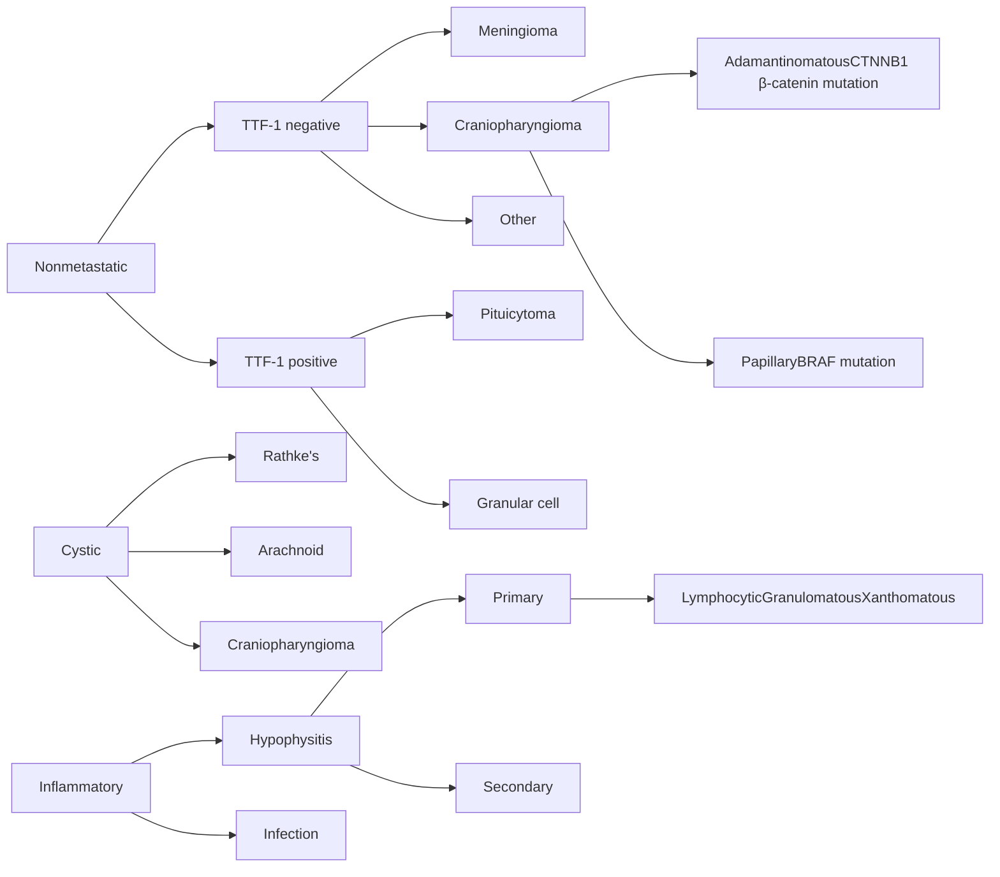
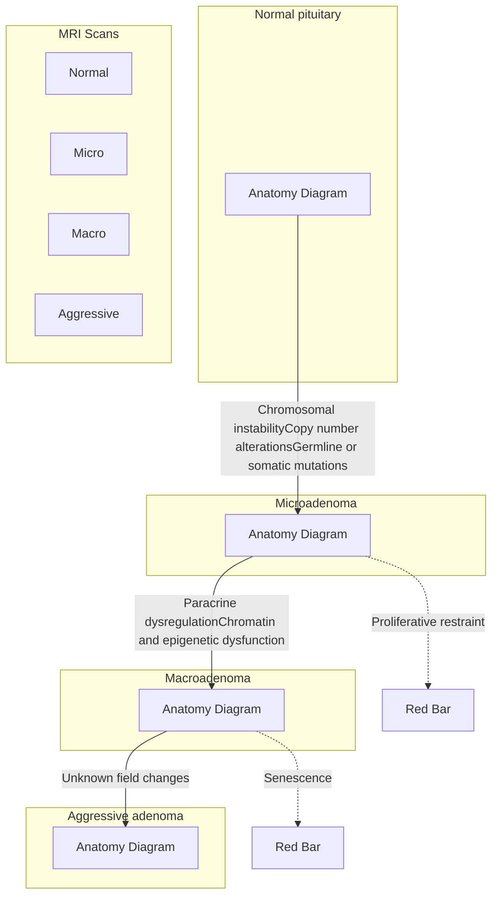
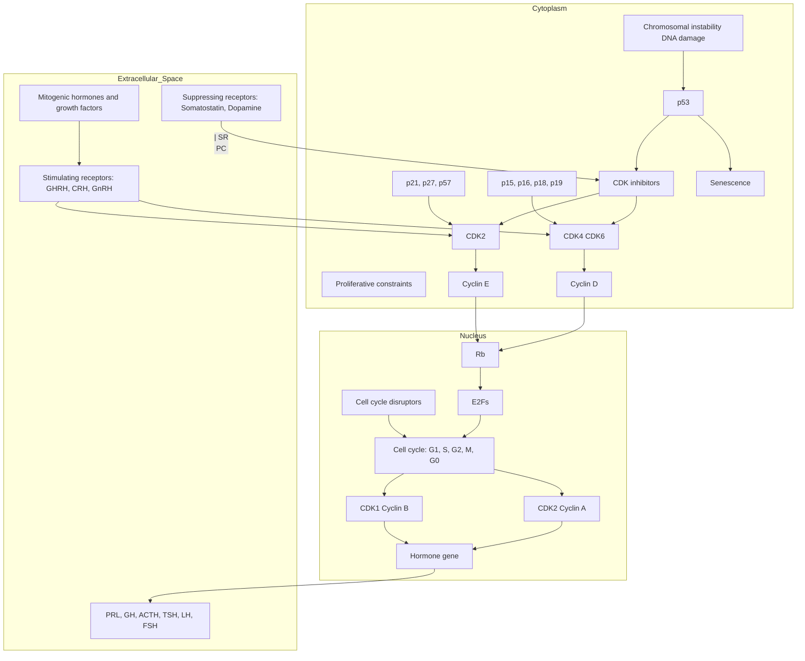
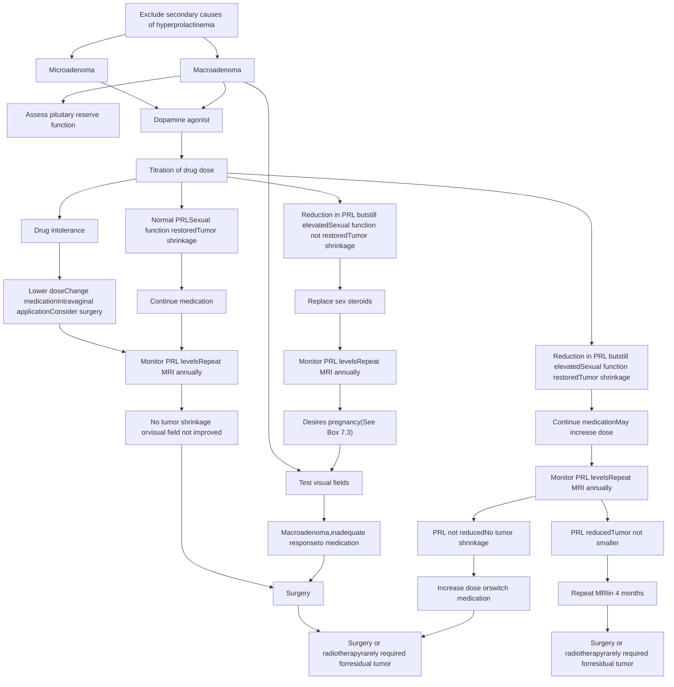
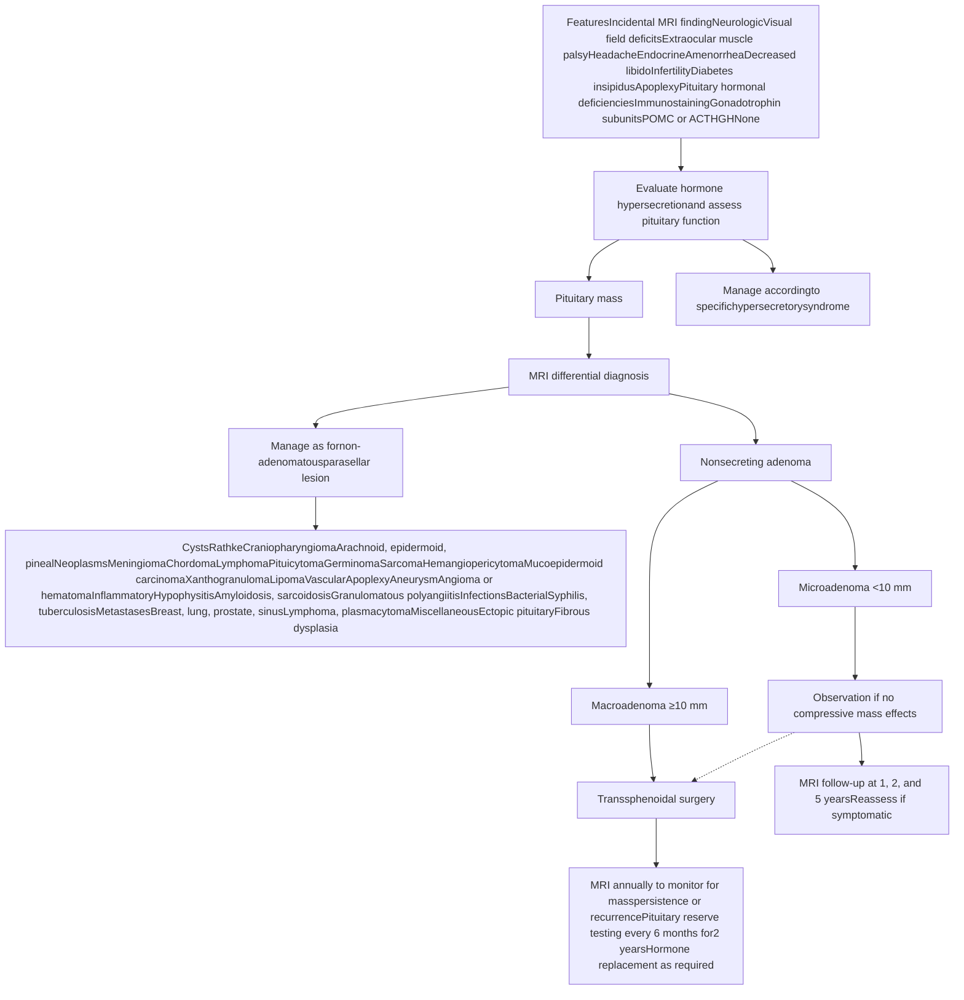
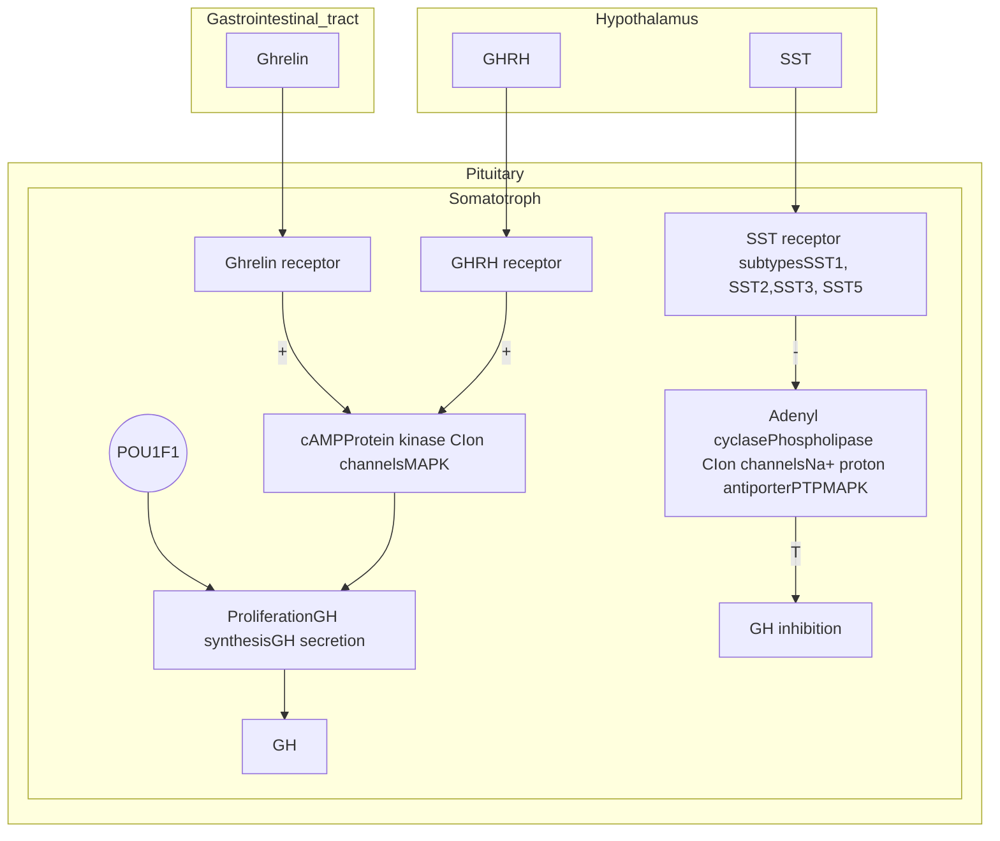
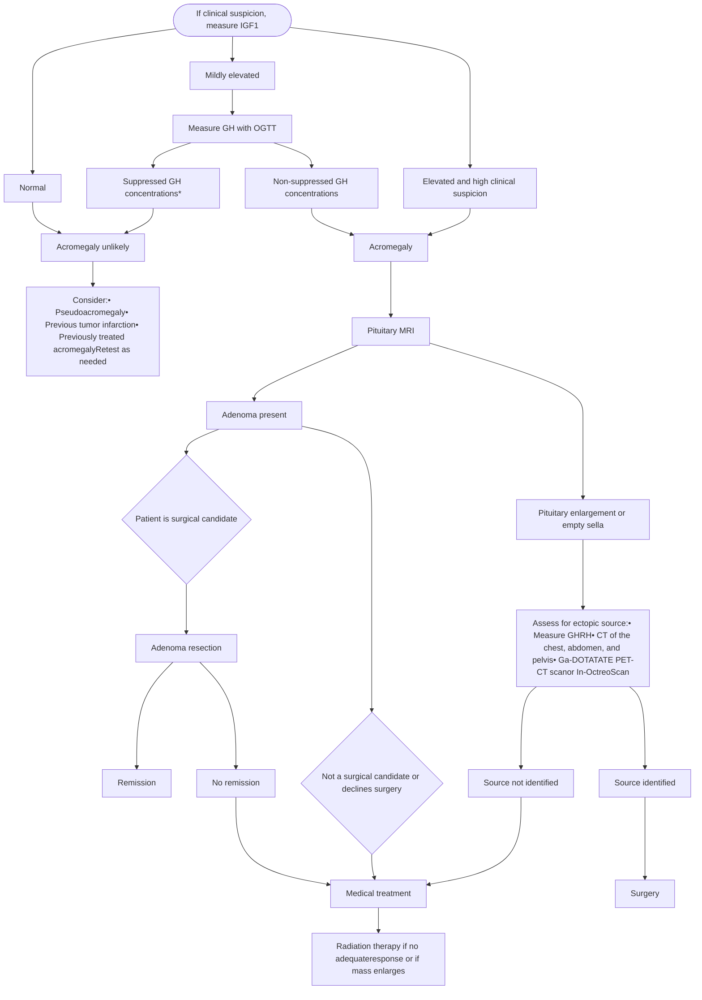
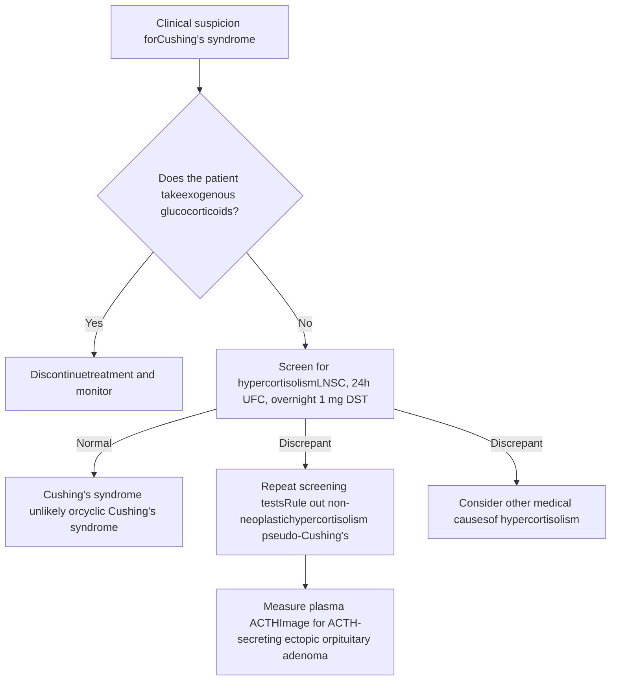
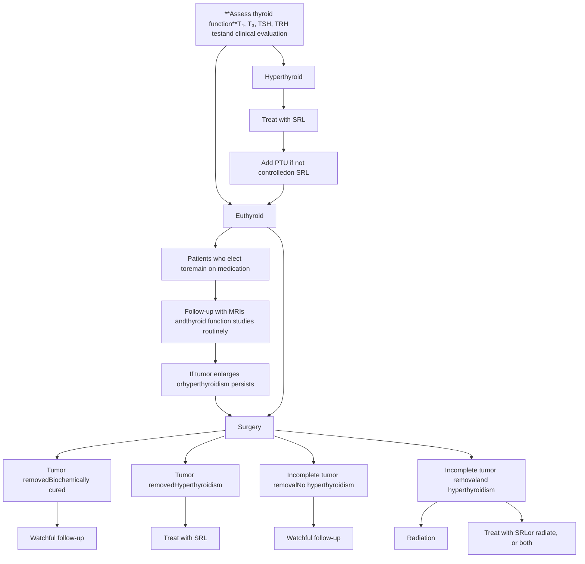

7

# Pituitary Adenomas and Masses

SHLOMO MELMED AND FELIPE F. CASANUEVA

## CHAPTER OUTLINE

Pituitary Masses, 218

Parasellar Masses, 231

Classification, 251

Prolactin-Secreting Adenomas, 255

Nonfunctioning Pituitary Adenomas, 264

Functional Gonadotrophin-Secreting Pituitary Adenomas, 269

Acromegaly, 270

ACTH-Secreting Adenomas (Cushing Disease), 291

Thyrotrophin-Secreting Adenomas, 292

## KEY POINTS

* Intrapituitary or parasellar masses are mostly benign pituitary adenomas.

* Nonadenomatous sellar masses are rare and are usually inflammatory processes, infiltrations, or metastatic deposits or may arise from adjacent structures including aneurysms, meningiomas, or chordomas.

* Nonfunctioning pituitary adenomas are usually of gonadotroph or null cell origin and usually present with compressive features or are diagnosed as incidentalomas.

* Secreting pituitary adenomas exhibit unique syndromes due to excess production of prolactin (prolactinomas), growth hormone (acromegaly/gigantism), adrenocorticotrophin (Cushing disease), or very rarely, thyrotrophin or gonadotrophins.

* Management of pituitary masses includes surgery, radiation, and specific targeted medical therapies.

The pituitary gland is situated in the sella turcica at the base of the brain and comprises the anterior and posterior lobes (Fig. 7.1). The anterior gland arises from Rathke’s pouch oral ectoderm and comprises well-differentiated trophic-hormone lineages, each of which is controlled by its respective, unique hypothalamic hormone signals traversing the pituitary stalk portal system to impinge on specific cell surface receptors. Thus, anterior lobe-derived adrenocorticotrophin (ACTH), growth hormone (GH), follicle-stimulating hormone (FSH), luteinizing hormone (LH), prolactin (PRL), and thyrotrophin (TSH) are secreted in highly controlled patterns into the systemic circulation via the hypophyseal veins draining to the internal jugular veins.<sup>1</sup> The posterior lobe is primarily a neural extension that synthesizes and secretes oxytocin and arginine vasopressin (AVP), previously known as antidiuretic hormone (ADH), independent of hypothalamic hormonal control (see Chapter 8).

## Pituitary Masses

### Pituitary Mass Effects

An expanding intrasellar mass may compress normal pituitary tissue and inexorably alter sellar size and shape by bony erosion and

remodeling (Fig. 7.2). Although the time course for this process is unclear, it appears to be slow and progressive over years or decades. The tumor may invade soft tissue, and the dorsal sellar roof presents the least resistance to expansion from within the confines of the bony sella. Both suprasellar and parasellar compression and invasion may occur with an enlarging mass, with resultant clinical manifestations (Table 7.1). As sellar masses impinge upon the optic chiasm, they may interfere with vision. Because of the anatomy of the chiasm, pressure from below affects temporal visual fields, starting superiorly and ultimately extending to the entire temporal field. Continued growth and pressure on the optic apparatus can extend visual loss to the nasal field and may ultimately result in blindness. Long-standing optic chiasmal pressure results in optic disc atrophy. Extension of pituitary lesions laterally may also impinge on or invade the dural wall of the cavernous sinus. Despite invasion, these lesions only rarely compromise the third, fourth, and sixth cranial nerves, as well as the ophthalmic and maxillary branches of the fifth cranial nerve. Although adenomas in the cavernous sinus often surround the internal carotid artery, clinical vascular sequelae are rarely encountered. Varying degrees of diplopia, ptosis, ophthalmoplegia, and decreased facial sensation may occur infrequently, depending on the extent of neural involvement by the cavernous sinus mass. In contrast to cavernous

<page_number>218</page_number>

Downloaded for d4030sltung d4030sltung ([d4030sltung@gmail.com](mailto:d4030sltung@gmail.com)) at Tungs' Taichung MetroHarbor Hospital from [ClinicalKey.com](https://ClinicalKey.com) by Elsevier on August 18, 2026. For personal use only. No other uses without permission. Copyright ©2026. Elsevier Inc. All rights reserved.

CHAPTER 7 Pituitary Adenomas and Masses

<page_number>219</page_number>

Hypothalamic-pituitary unit diagram showing the hypothalamus, optic chiasm, superior hypophyseal artery, portal veins, anterior and posterior pituitary, and associated vasculature.

\* **Fig. 7.1** Hypothalamic-pituitary unit. Hypothalamic neurons send their axons through the median eminence and release stimulatory hormones into the hypophyseal-portal circulation, which surrounds the pituitary stalk and penetrates the anterior lobe of the pituitary, enabling secretion of anterior pituitary hormones. (From Ben-Shlomo A, Melmed S. Hypothalamic regulation of anterior pituitary function. In: Melmed S, ed. *The Pituitary*. 5th ed. Elsevier; 2022. Copyright Giovanna Santoni, CMI. Used by permission.)

invasion by slow mass progression, sudden insults to the cavernous sinus by hemorrhage or infarction of a pituitary adenoma occur more frequently and may affect nerves coursing through the sinus. Downward extension into the sphenoid sinus indicates that the parasellar mass has eroded the bony sellar floor. Aggressive adenomas may also invade the roof of the palate and cause nasopharyngeal obstruction, infection, and cerebrospinal fluid (CSF) leakage. Infrequently, temporal or frontal lobes may be invaded, causing uncinate seizures, personality disorders, and anosmia. In addition to the anatomic lesions caused by the expanding mass, direct hypothalamic involvement of the encroaching mass may lead to important metabolic sequelae discussed in Chapter 6.

Intrasellar masses commonly present with headaches, even in the absence of demonstrable suprasellar extension. Small changes in intrasellar pressure caused by a microadenoma within the confined sella are sufficient to stretch the dural plate with resultant headache. Relatively minor diaphragmatic distortions or dural impingement may be associated with persistent headache.

Successful medical management of small functional pituitary adenomas with dopamine agonists (DAs) or somatostatin receptor ligands (SRLs) is often accompanied by remarkable headache improvement. In a retrospective assessment of transsphenoidal surgery for microadenomas, headaches resolved or disappeared in 90% of patients with nonfunctioning adenomas (NFAs) and in 56% of those with functioning adenomas.<sup>2</sup> Regardless of cause or size, pituitary masses may compress surrounding healthy pituitary tissue and result in hypopituitarism. In 49 patients undergoing transsphenoidal resection of pituitary adenomas, mean intrasellar pressure was elevated two- to threefold in patients with associated pituitary failure. Furthermore, prevalence of headache and elevated PRL levels correlate positively with intrasellar pressure levels,<sup>3</sup> suggesting interrupted portal delivery of hypothalamic hormones. Thus, surgical decompression of a sellar mass may lead to recovery of compromised anterior pituitary function. In those who do not recover pituitary function postoperatively, irreversible compromised pituitary

Downloaded for d4030sltung d4030sltung ([d4030sltung@gmail.com](mailto:d4030sltung@gmail.com)) at Tungs' Taichung MetroHarbor Hospital from [ClinicalKey.com](https://ClinicalKey.com) by Elsevier on August 18, 2026. For personal use only. No other uses without permission. Copyright ©2026. Elsevier Inc. All rights reserved.

220 SECTION II Hypothalamus and Pituitary

Sagittal view and schematic illustration of a large pituitary adenoma extending into the sphenoid sinus.

Coronal view and schematic illustration of a pituitary adenoma extending upward into the paraventricular space.

Coronal and sagittal views of a bilobed hypoenhancing adenoma with cavernous sinus invasion.

T1-weighted axial images showing extension of a giant pituitary adenoma to the inferior petrosal sinus and hypoglossal canal.

\* **Fig. 7.2** Invasive pituitary adenomas. (A) Sagittal view of a large pituitary adenoma (*left*) and schematic illustration (*right*) of a lesion extending into the sphenoid sinus cavity down to the floor of nasal cavities. (B) Coronal view (*left*) and schematic illustration (*right*) of a lesion extending upward with eccentric sprout into the paraventricular space, encroaching the internal and middle carotid arteries, and their branches, and compressing perforating vessels of basal ganglia and internal capsule. (C) Coronal view (*left*) of bilobed homogeneous hypoenhancing adenoma with invasion of the cavernous sinus and suprasellar cistern; on sagittal view (*right*), inferior extension into the sphenoid sinus anteriorly and retroclival region via the petrosal/basilar plexus posteriorly (*arrowhead*) is seen. (D) Left, T1-weighted axial image at the level of the inferior pons demonstrates extension of the mass to the right inferior petrosal sinus (*white arrowhead*). Further extension on the right to the pars nervosa of the jugular foramen is seen (*black arrowhead*). Right, more inferiorly at the level of the upper medulla, mass extension to the right hypoglossal canal is seen (*white arrowhead*), within the hypoglossal plexus. The pars vascularis of the jugular foramen, seen more posteriorly, is patent (*black arrowhead*). (A–B, schematic illustrations from Cappabianca P, et al. Size does not matter. The intrigue of giant adenomas: a true surgical challenge. *Acta Neurochir [Wien]*. 2014;156:2217–2220. C–D, from Kuo AH, et al. Giant pituitary adenoma with inferior petrosal sinus, jugular foramen, and hypoglossal canal extension. *JAMA Otolaryngol Head Neck Surg*. 2020;146:82–84.)

reserve or ischemic necrosis of residual pituitary tissue is likely to have occurred. Stalk compression may result in pituitary failure caused by encroachment of the portal vessels that normally provide pituitary access to hypothalamic trophic hormones. Stalk compression also usually leads to hyperprolactinemia due to compromised dopamine access, with concomitant failure of other pituitary trophic hormones.

## Evaluation of Pituitary Masses

### Approach to the Patient Harboring a Pituitary Mass

Most pituitary masses are adenomas. Ninety-one percent of 1120 patients undergoing transsphenoidal surgery for sellar masses were diagnosed as harboring pituitary adenomas.<sup>4</sup> In a series of 2598 patients undergoing pituitary magnetic resonance imaging (MRI), pituitary adenomas accounted for 82% of visible lesions. Most commonly encountered nonadenomatous lesions include Rathke's cleft cyst, craniopharyngioma, and meningioma,<sup>5</sup> with Rathke's cysts accounting for up to 40% of all such masses.<sup>6</sup> Thus, the differential diagnosis of a pituitary mass should be aimed at excluding the diagnosis of a pituitary adenoma before considering the presence of other rare sellar lesions. Pituitary adenomas arise

from differentiated cell lineages producing trophic hormones, including GH, PRL, ACTH, TSH, and gonadotrophins. These adenomas may hypersecrete hormone or may be clinically nonsecreting (Fig. 7.3).

The management and prognosis of anterior pituitary adenomas differ markedly from those for other nonpituitary masses, and an important diagnostic challenge is to effectively distinguish a pituitary adenoma from other parasellar masses.<sup>7</sup> Several physiologic states are associated with pituitary enlargement. Lactotroph hyperplasia occurs during pregnancy, and thyrotroph, gonadotroph, or rarely corticotroph hyperplasias occur in the presence of long-standing primary thyroid, gonadal, or adrenal failure, respectively<sup>8</sup> (Fig. 7.4). Pituitary enlargement may also occur as a result of ectopic GH-releasing hormone (GHRH) or corticotrophin-releasing hormone (CRH) secretion from pulmonary and pancreatic neuroendocrine tumors or hypothalamic gangliocytomas, with resultant hyperplasia of somatotroph or corticotroph cells.

Autopsy series show that up to 20% of subjects harbor an incidental clinically silent pituitary adenoma. With sensitive imaging techniques employed for nonpituitary indications including head trauma, chronic sinusitis, or headaches, previously inapparent pituitary lesions are being identified with increasing frequency.

Downloaded for d4030sltung d4030sltung ([d4030sltung@gmail.com](mailto:d4030sltung@gmail.com)) at Tungs' Taichung MetroHarbor Hospital from [ClinicalKey.com](https://ClinicalKey.com) by Elsevier on August 18, 2026. For personal use only. No other uses without permission. Copyright ©2026. Elsevier Inc. All rights reserved.

CHAPTER 7 Pituitary Adenomas and Masses

221

# TABLE 7.1 Local Effects of an Expanding Pituitary, Parasellar, or Hypothalamic Mass

| Impacted Structure | Clinical Effect |
| --- | --- |
| Pituitary | Growth failure, adult hyposomatotropism, hypogonadism, hypothyroidism, hypoadrenalism |
| Optic tract | Loss of red perception, bitemporal hemianopia, superior or bitemporal field defect, scotoma, blindness |
| Hypothalamus | Temperature dysregulation, obesity, AVP deficiency; thirst, sleep; appetite, behavioral, and autonomic nervous system dysfunctions |
| Cavernous sinus | Ptosis, diplopia, ophthalmoplegia, facial numbness |
| Temporal lobe | Uncinate seizures |
| Frontal lobe | Personality disorder, anosmia |
| Central | Headache, hydrocephalus, psychosis, dementia, laughing seizures |
| Neuro-ophthalmologic tract | Field defects: Bitemporal hemianopia (50%), amaurosis with hemianopia (12%), contralateral or monocular hemianopia (7%) Scotomas—junctional; monocular central, arcuate, altitudinal; hemianopic Homonymous hemianopia Acuity loss: Snellen Contrast sensitivity Color vision Visual evoked potential Pupillary abnormality: Impaired light reactivity Afferent defect Optic atrophy: Papilledema Cranial nerve palsy—oculomotor, trochlear, abducens, sensory trigeminal Nystagmus Visual hallucinations Postfixation blindness |

AVP, arginine vasopressin.

Modified from Snyder PJ, Melmed S. Clinically nonfunctioning sellar masses. In: Jameson JL, DeGroot L, eds. *Endocrinology: Adult and Pediatric*. 7th ed. Elsevier; 2016:256–265; Arnold A. Neuroophthalmologic evaluation of pituitary disorders. In: Melmed S, ed. *The Pituitary*. 2nd ed. Blackwell; 2002.

Incidental pituitary cysts, hemorrhages, and infarctions are also discovered at autopsy. Pituitary abnormalities compatible with the diagnosis of microadenoma are detectable in about 10% of the normal adult population undergoing MRI studies.<sup>9</sup> Recognizing that approximately 90% of observed pituitary lesions represent pituitary adenomas, initial assessment should determine whether

the mass is hormonally functional and whether local mass effects are apparent at the time of diagnosis or likely to develop in the future.

As the onset of clinical features associated with disordered hormone secretion is insidious and may be unnoticed for years or decades, endocrine function should always be tested at presentation (Table 7.2). Clinical evaluation for changes compatible with hyper- or hyposecretion of GH, gonadotrophins, PRL, or ACTH may reveal unique long-term sequelae requiring distinct therapies. In the absence of clinical features of a humoral hypersecretory syndrome, cost-effective laboratory screening should be performed. Serum PRL levels >200 ng/mL strongly suggest the presence of a micro- or macroprolactinoma. Any elevation in serum PRL from minimal to high can occur when a microadenoma is present. A minimal to moderate elevation can also indicate secondary stalk interruption by a pituitary mass (usually a nonfunctioning macroadenoma). Only a very elevated PRL level >500 ng/mL in a nonpregnant individual is considered pathognomonic of a prolactinoma, as significant PRL elevations can be caused by drugs such as risperidone and other antipsychotics.<sup>10</sup> Elevated age-matched insulin-like growth factor 1 (IGF1) levels indicate the presence of GH-secreting adenoma, and a high 24-hour urinary free cortisol (UFC) level or elevated nighttime salivary cortisol<sup>11</sup> is an effective screen for most patients with Cushing disease. Nevertheless, the overall incidence of functional hormone-secreting adenomas in asymptomatic subjects with incidentally discovered pituitary masses is low. The presence of, or the potential for, local compressive effects must also be considered. Because the risk for microadenoma progression to a compressive macroadenoma is low, no direct intervention may be warranted. For parasellar masses of uncertain origin, histologic examination of surgically excised tissue may be the best approach to yield an accurate diagnosis. Clearly, the benefits versus risks of biopsy or surgery should be considered in such cases, especially for lesions that are not growing or not causing a functional deficit. Although imaging features may be helpful in diagnosing the cause of a nonpituitary sellar mass, the final diagnosis may remain elusive until pathologic confirmation is obtained.

Parasellar masses include neoplastic and nonneoplastic lesions and manifest clinically by local compression of surrounding vital structures or as a result of metabolic or hormonal derangements. Rarely, sellar masses or infiltrative processes may be the presenting feature of a previously undiagnosed systemic disorder such as lymphoma, tuberculosis, sarcoidosis, or histiocytosis. Fever with or without associated sterile or septic meningitis may rarely be caused by fluid leakage into the subarachnoid space from Rathke’s cleft, dermoid, and epidermoid cysts, craniopharyngioma, and apoplexy.<sup>12</sup> Pituitary masses may present with hemorrhage and infarction, especially when there is a pituitary adenoma during pregnancy, or when elderly individuals with unsuspected pituitary adenomas become hypotensive because of another illness. Rarely, these adenomas present with CSF leak, which may predispose to meningitis. Pituitary masses may also undergo silent infarction leading to development of a partial or totally empty pituitary sella with normal pituitary reserve, implying that the surrounding rim of pituitary tissue is fully functional. Rarely, functional adenomas may arise within the remnant pituitary tissue, and these may not be visible by sensitive MRI (i.e., <2 mm in diameter), despite their endocrine hyperactivity. More than one kind of tumor may be found coincidentally in the same patient, such as a pituitary adenoma and a meningioma or adenoma with a craniopharyngioma component. Acute or chronic infection with abscess formation

Downloaded for d4030sltung d4030sltung ([d4030sltung@gmail.com](mailto:d4030sltung@gmail.com)) at Tungs' Taichung MetroHarbor Hospital from [ClinicalKey.com](https://ClinicalKey.com) by Elsevier on August 18, 2026. For personal use only. No other uses without permission. Copyright ©2026. Elsevier Inc. All rights reserved.

222 SECTION II Hypothalamus and Pituitary

Diagram of anterior pituitary cell lineages showing distribution of PRL (10-30%), GH (50%), TSH (5%), FSH/LH (10%), and ACTH (10-30%) cells.

Microscopic image of pituitary adenoma distribution with arrows pointing to incidental adenomas.

\* **Fig. 7.3** Distribution of anterior pituitary cell lineages. Nonfunctioning tumors are typically macroadenomas that efface pituitary landmarks, while localization and frequency of functioning microadenomas reflect the maximal concentration of their corresponding normal pituitary cells. (A) PRL-expressing lactotrophs, GH-expressing somatotrophs, ACTH-expressing corticotrophs, and TSH-expressing thyrotrophs are mainly located in defined areas, whereas gonadotroph cells expressing LH and FSH are diffusely scattered. (B) Adenoma distribution with multiple incidental adenomas shown by arrows. *ACTH*, adrenocorticotrophic hormone; *FSH*, follicle-stimulating hormone; *GH*, growth hormone; *LH*, luteinizing hormone; *N*, neurohypophysis; *PRL*, prolactin; *TSH*, thyroid-stimulating hormone. (A, adapted from Ben-Shlomo A, Melmed S. Hypothalamic regulation of anterior pituitary function. In: Melmed S, ed. *The Pituitary*. 5th ed. Elsevier; 2022. Copyright Giovanna Santoni, CMI. Used by permission. B from Scheithauer BW, Horvath E, Lloyd RV, Kovacs K. Pathology of pituitary adenomas and pituitary hyperplasia. In: Thapar K, Kovacs K, Scheithauer BW, Lloyd RV, eds. *Diagnosis and Management of Pituitary Tumors*. Humana Press; 2001.)

may rarely occur within the mass. Compromised pituitary hormone hyposecretion may be due to direct pressure effects of the expanding mass on hormone-secreting cells or parasellar pressure effects that attenuate synthesis or secretion of hypothalamic hormones, with resultant pituitary failure.

## Imaging

Pituitary masses are best diagnosed with MRI because the technique has better resolution than other imaging modalities for identifying soft tissue changes (see Fig. 7.2). When a sellar mass is suspected, an MRI specifically focused on the pituitary should be performed, as more widely spaced cuts during a routine brain MRI are often inadequate to visualize relatively small pituitary masses. This technique permits high-contrast, detailed visualization of mass effects on neighboring soft tissue structures, including the cavernous sinus or optic chiasm. A pituitary MRI includes images of the optic chiasm, hypothalamus, pituitary stalk, and cavernous

and sphenoid sinuses.<sup>13</sup> High-resolution, T1-weighted sections in the coronal and sagittal plane both before and after gadolinium-based contrast administration distinguish most pituitary masses. Slice thickness should be <3 mm to obtain a pixel of 1 mm. If necessary, especially for diagnosing high-signaling hemorrhage, T2-weighted images provide additional diagnostic information. MRI thus clearly delineates the gland, stalk, optic tracts, and surrounding soft tissues. The gland may be concave, convex, or flat. The posterior pituitary lobe exhibits a discrete bright spot of high signal intensity on T1-weighted images, which declines with age and is absent in AVP deficiency and most posterior pituitary lesions. The pituitary gland may transiently enlarge during adolescence, pregnancy, and postpartum, with teenage females exhibiting increasing gland convexity during the menstrual cycle. During pregnancy, the gland should normally not exceed 10 to 12 mm, and the stalk should not exceed 4 mm in diameter. A thickened stalk may be indicative of hypophysitis, granuloma, germinoma,

Downloaded for d4030sltung d4030sltung ([d4030sltung@gmail.com](mailto:d4030sltung@gmail.com)) at Tungs' Taichung MetroHarbor Hospital from [ClinicalKey.com](https://www.clinicalkey.com) by Elsevier on August 18, 2026. For personal use only. No other uses without permission. Copyright ©2026. Elsevier Inc. All rights reserved.

CHAPTER 7 Pituitary Adenomas and Masses

<page_number>223</page_number>

MRI of the head showing pituitary hyperplasia in a 10-year-old female with primary hypothyroidism.

MRI of the head showing resolution of pituitary enlargement after treatment with levothyroxine.

• **Fig. 7.4** Primary hypothyroidism with secondary pituitary hyperplasia in a 10-year-old female. (A) Magnetic resonance imaging of the head showing pituitary hyperplasia owing to hormonal-feedback mechanisms through the hypothalamic-pituitary-thyroid axis. (B) After treatment with levothyroxine, repeated MRI shows resolution of the pituitary enlargement. (From Shivaprasad KS, Siddardha K. Pituitary hyperplasia from primary hypothyroidism. *N Engl J Med*. 2019;380:e9.)

| TABLE 7.2 | Laboratory Testing for Diagnosis of Hormone-Secreting Pituitary Adenomas |  |  |
| --- | --- | --- | --- |
|  | Test | Results Requiring Further Evaluation |  |
| Prolactinoma | Serum PRL measurement | PRL level elevated |  |
| Acromegaly | Serum IGF1 level | Age-adjusted IGF1 level elevated |  |
|  | OGTT (75 g glucose) with GH measured at 0, 30, and 60 min | GH >0.4 μg/L with use of an ultrasensitive assay |  |
| Cushing disease | 24-h UFC measurement | Elevated UFC on at least two tests |  |
|  | Midnight salivary cortisol measurement | Elevated free salivary cortisol level |  |
|  | Plasma cortisol measurement at 08:00 after dexamethasone (1 mg) at 21:00 | Failure to suppress cortisol level to <1.8 μg/dL |  |
|  | Serum ACTH measurement | Low ACTH level suggests adrenal adenoma; very high level may indicate ectopic ACTH source |  |
| Thyrotrophin-secreting tumor | Serum TSH measurement | Normal or increased T4 level with measurable TSH |  |
|  | Free T4 measurement | may suggest TSH-secreting tumor |  |

*ACTH, adrenocorticotrophic hormone; GH, growth hormone; IGF1, insulin-like growth factor type 1; OGTT, oral glucose tolerance test; PRL, prolactin; T<sub>4</sub>, thyroxine; TSH, thyroid-stimulating hormone; UFC, urinary free cortisol.*

From Melmed S. Pituitary-tumor endocrinopathies. *N Engl J Med*. 2020;382:937–950.

or chordoma. After gadolinium injection, microadenomas usually appear hypodense compared to the normal gland, especially when multiple thin section echo sequences are examined in the first few minutes. Intrasellar hypointensity may reflect compromised microadenoma vasculature.<sup>14</sup>

Although microadenomas may also cause gland asymmetry or stalk deviation, macroadenomas, which are significantly more vascular, have a higher gadolinium uptake. They

may enlarge the sella turcica by remodeling the bony fossa and can grow upward toward the optic apparatus and cause draping of the nerves over the mass, often accompanied by visual field abnormalities. Masses can also extend into the sphenoid sinus and not infrequently invade connective tissue separating the pituitary from the cavernous sinus. Visible tissue surrounding the carotid artery confirms cavernous sinus invasion. Infrequently, these patients may develop palsies of the third,

Downloaded for d4030sltung d4030sltung ([d4030sltung@gmail.com](mailto:d4030sltung@gmail.com)) at Tungs' Taichung MetroHarbor Hospital from [ClinicalKey.com](https://www.clinicalkey.com) by Elsevier on August 18, 2026. For personal use only. No other uses without permission. Copyright ©2026. Elsevier Inc. All rights reserved.

224 SECTION II Hypothalamus and Pituitary

fourth, or sixth cranial nerves. MRI may readily distinguish pituitary adenomas from other masses, including hyperplasias, craniopharyngiomas, meningiomas, chordomas, cysts, and metastatic lesions. Visualization of a distinct pituitary gland adjacent to a parasellar mass suggests that the mass is not of pituitary origin. Secondary distinguishing features, such as visualization of noninvolved pituitary tissue, mass consistency, calcification, hemorrhage, and suprasellar involvement, usually allow an imaging diagnosis often only confirmed by direct tissue histologic diagnosis. Preoperative localization of carotid artery aneurysms are confirmed by MRI or magnetic resonance (MR) angiography. Gadolinium may be contraindicated with impaired renal function.<sup>15</sup>

Pituitary computed tomography (CT) allows visualization of bony structures, including the sellar floor and clinoid bones, and identifies bony invasion. CT also recognizes calcifications that characterize craniopharyngiomas, meningiomas, and rarely aneurysms not evident on MRI. Rarely, pituitary adenomas may calcify. Pituitary CT scan is indicated for characterization of hemorrhagic lesions, metastatic deposits, chordomas, and evidence of calcification.

**Receptor Imaging.** As prolactinomas express dopamine 2 receptors (D2Rs), they can be imaged with a radiolabeled D2R antagonist using <sup>123</sup>I-iodobenzamine single-photon emission scanning. Radiolabeled indium-pentetreotide is of limited specificity as most pituitary adenomas heterogeneously express somatostatin receptor subtypes (SSTs). As the sensitivity of single-photon emission CT is about 1 cm and also detects underlying normal pituitary tissue receptor expression, its use is limited for pituitary adenoma detection, but it may be helpful for imaging ectopic ACTH-secreting adenomas. <sup>11</sup>C-methionine positron emission tomography (PET)-CT has been shown to be helpful in guiding surgical decision making for equivocal prolactinoma masses.<sup>16,17</sup>

## Neuroophthalmologic Assessment

The optic tracts are particularly vulnerable to compression by expanding sellar masses, and neuroophthalmologic evaluation is helpful for diagnosis, determining pretreatment baseline visual status for posttreatment monitoring, or detection of mass recurrence.<sup>18</sup> The relationship between the optic chiasm and the intracranial components of the optic nerves with the pituitary gland and surrounding vessels is depicted in Fig. 7.5. As a 10-mm posteriorly angled gap separates the optic chiasm and diaphragma sellae (Fig. 7.6), extensive suprasellar mass extension is required before visual function is compromised. Decussation of neural fibers originating from the nasal half of each retina occurs at the chiasm, and those originating from the temporal retinal halves are situated ipsilaterally.<sup>19</sup> Fibers from the superior and inferior retinal aspect are segregated in the corresponding chiasmal regions. Local vascular compromise and chiasmal stretching also contribute to selective visual compromise. Reversibility of visual effects correlates inversely with acuteness of the compressive insult, and longstanding visual tract compression from larger masses invariably leads to adverse outcomes.

**Visual Features.** An abnormal visual examination may unmask the presence of a pituitary mass in an asymptomatic patient. Before the availability of sophisticated assays and imaging, virtually all pituitary masses presented with visual loss. Currently, fewer than 10% of patients present with visual symptoms, and most harbor incidentally discovered NFAs, or incidentalomas. Unilateral or bilateral temporal or central visual loss is often asymmetric

and may be insidious, remitting, or recurring. Rarely, sudden visual loss occurs in a previously asymptomatic patient. Diplopia, impaired depth perception, and very rarely, visual hallucinations may occur.<sup>20</sup> The retinal nerve fiber layer is decreased as a reflection of optic atrophy.<sup>21</sup>

Most pituitary-related visual defects involve impingement of the inferior crossing chiasmal fibers leading to bitemporal visual loss, especially in the superior field portions (Fig. 7.7). Rarely, masses compress the optic chiasm from above and cause inferior temporal compromise. As optic chiasm damage progresses, field cuts can extend into the nasal field and also cause optic atrophy. Pituitary-related defects preferentially marginate at the vertical midline in contrast to other causes of bitemporal defects. Despite prominent field defects, many of which correlate with mass location defined by MRI, acuity in the remaining fields is invariably normal. However, anterior mass extension may damage central visual acuity.<sup>22</sup> Rarely, pupillary abnormalities, optic atrophy, papilledema, cranial nerve palsies, and nystagmus may be encountered. Preoperatively, automated quantitative perimetry, assessment of visual evoked potentials, and afferent pupillary defects, as well as disc appearance, should be undertaken. Optic coherence tomography assessing retinal fiber layer thickness or damaged ganglion cell layer may indicate potential for postoperative vision recovery.<sup>18</sup>

## Management of Pituitary Masses

Although pituitary masses are usually benign, they may compress local structures or invade brain tissue (Fig. 7.8). The goals of therapy are to alleviate local compressive mass effects and to suppress hormone hypersecretion or alleviate hormone hyposecretion while maintaining intact pituitary trophic function. Three modes of therapy are available: surgical, radiotherapeutic, and medical. In general, the benefits of each type of therapy should be weighed against their respective risks, and comprehensive physician and patient awareness is required to individualize treatment approaches. Appropriate consolidated approaches from expert endocrinologists, neurosurgeons, radiologists, pathologists, and ophthalmologists have been advocated as ideal management teams in pituitary centers of excellence.<sup>23</sup>

### Surgical

Pituitary surgery is indicated for resection of mass lesions causing central pressure effects, including visual compromise, primary correction of hormonal hypersecretion, or functional tumor resection in patients resistant or not immediately responsive to medical treatment. Unusual sellar lesions may require diagnostic tissue evaluation, and rarely, primary or secondary parasellar malignancies require wide excision.

In 1904, Horsley reported the surgical resection of a pituitary tumor by a lateral middle fossa approach.<sup>24</sup> Between 1910 and 1925, Cushing operated on 231 patients harboring pituitary adenomas with a remarkably low 5.6% mortality rate.<sup>24</sup> Cushing used a sublabial incision to enable an endonasal approach for removing the septum and improved visualization using Kanavel’s headlight. Hardy later improved the technique by using the operating microscope and intraoperative fluoroscopy, resulting in markedly reduced morbidity and mortality rates compared to those encountered with craniotomy, and his approach became the mainstay surgical technique for resecting these adenomas.

The transsphenoidal approach avoids invasion of the cranial cavity and precludes the need for brain tissue manipulation

Downloaded for d4030sltung d4030sltung ([d4030sltung@gmail.com](mailto:d4030sltung@gmail.com)) at Tungs' Taichung MetroHarbor Hospital from [ClinicalKey.com](https://ClinicalKey.com) by Elsevier on August 18, 2026. For personal use only. No other uses without permission. Copyright ©2026. Elsevier Inc. All rights reserved.

CHAPTER 7 Pituitary Adenomas and Masses

<page_number>225</page_number>

Illustration of a coronal section of the pituitary gland and surrounding structures, including the optic chiasm, cavernous sinus, and cranial nerves III, IV, V1, V2, and VI.

MRI scans showing a pituitary microadenoma (left) and a macroadenoma (right).

MRI scan showing a giant pituitary adenoma.

• **Fig. 7.5** Coronal section of pituitary adenomas with relationships to sellar structures and cavernous sinus. (A) Illustration showing the relationship of the oculomotor (III) and trochlear (IV) cranial nerves to the pituitary gland. (B) MRI of pituitary microadenoma (*top left*), macroadenoma (*top right*), and aggressive adenoma (*bottom*). (A from Silver SI, Sharpe JA. Neuro-ophthalmologic evaluation of pituitary tumors. In: Thapar K, Kovacs K, Scheihauer BW, Lloyd RV, eds. *Diagnosis and Management of Pituitary Tumors*. Humana Press; 2001:173–200.)

required during a subfrontal surgical approach (Fig. 7.9). A ventral sphenoid approach likewise does not violate the cranial fossa. Thus, transsphenoidal surgery is associated with minimal morbidity and mortality, most patients are ambulatory within 6 to 9 hours, and the hospital stay is generally about 2 days. Furthermore, the transsphenoidal approach allows for a clearly visible operative field with high magnification and internal illumination (Fig. 7.10). Normal pituitary can be clearly distinguished from tumor

tissue, facilitating microdissection and small microadenoma resection. The transsphenoidal approach has been greatly enhanced by head immobilization techniques, microinstrumentation development, and newer angled endoscopes. Enhanced MRI sensitivity and precision allow for clear delineation of mass location, size, and invasiveness, all critical determinants of surgical success.

Endonasal endoscopy has enabled an effective approach to intrapituitary and some extrasellar masses,<sup>25</sup> and, in experienced

Downloaded for d4030sltung d4030sltung ([d4030sltung@gmail.com](mailto:d4030sltung@gmail.com)) at Tungs' Taichung MetroHarbor Hospital from [ClinicalKey.com](https://ClinicalKey.com) by Elsevier on August 18, 2026. For personal use only. No other uses without permission. Copyright ©2026. Elsevier Inc. All rights reserved.

226 SECTION II Hypothalamus and Pituitary

Relationship of the pituitary gland to the optic chiasm. Diagram shows anatomical measurements: 15 mm, 8 mm, 4 mm, 10 mm, and a 45 degree angle. Labels include Optic chiasm, III, C (anterior clinoid process), and D (dorsum of the sella turcica).

• **Fig. 7.6** Relationship of the pituitary gland to the optic chiasm. The intracranial optic nerve/chiasmal complex lies up to 10 mm above the diaphragma sellae. *C*, anterior clinoid process; *D*, dorsum of the sella turcica. (From Miller NR. *Walsh and Hoyt’s Clinical Neuro-Ophthalmology*. 4th ed., vol 1. Williams & Wilkins; 1985:60–69.)

hands, results in similar or superior outcomes, as compared to the traditional microscopic approach.<sup>26</sup> Endonasal endoscopy may lead to a shorter operating time, reduced postoperative morbidity, and a shorter hospital stay. The advantages of the technique include a clear panoramic view of bony landmarks and the ability to access suprasellar and parasellar tumor extensions into the cavernous sinuses. Disadvantages of this approach include management of perioperative intrasellar bleeding and CSF leaks.

Craniotomy is indicated for rare invasive suprasellar masses extending into the frontal or middle cranial fossa, optic nerves, or extensive posterior clival invasion. Suprasellar extension contained by a small diaphragmatic aperture (“hourglass configuration”) may also require a transcranial approach. Extremely rarely, very solid masses may require a combination of transsphenoidal and intracranial surgery.

**Goals of Surgery.** The goal of pituitary surgery is total resection limited to the lesion, without compromising postoperative endogenous pituitary function.<sup>27</sup> Careful selective mass resection may be difficult for poorly encapsulated lesions, those embedded deeply within the gland body, and those extending into the wall or the body of the cavernous sinuses or suprasellar lesions. However, suprasellar tumors (e.g., craniopharyngiomas) may also be successfully removed via a transnasal approach. Excision of normal pituitary tissue and intraoperative gland manipulation should be avoided unless critical for effective dissection. Occasionally, hemihypophysectomy or even nonselective total gland resection may be indicated for multifocal adenomas if the surrounding normal gland is necrotic or if no mass lesion is discernible despite an accurate clinical and biochemical diagnosis, especially for corticotroph adenomas. Successful surgery should decompress central visual defects and rescue compromised trophic hormone secretion. For children and young adults, retention of adequate normal tissue for subsequent growth and reproductive function is an important determinant of intraoperative decision making. Nevertheless, especially for functional adenomas, small residual remnants attached to the dura are difficult

to access but remain hypersecretory with persistent postoperative clinical progression. Thus, the skilled neurosurgeon carefully balances maximally effective tumor removal with the requirement to preserve nontumorous pituitary function.

Intraoperative surgical navigation enables three-dimensional imaging, but there is no clear documented advantage to its use. If there is suspicion of a vascular lesion, carotid and intracranial angiography is indicated before surgery. By contrast, postoperative image stabilization may not be evident for months, and MRI may be useful only after 1 year or longer, especially after resection of secretory adenomas with measurable serum biomarkers.<sup>28</sup>

**Indications for Transsphenoidal Surgery.** A pituitary mass that may or may not compress local vital structures should be evaluated for surgical resection (Box 7.1) offering rapid resolution of hormone hypersecretion and resultant clinical features of functioning adenomas. Indications for the procedure depend on adenoma type. In general, patients intolerant of or resistant to medical therapy require surgery. Surgery is primarily indicated for well-circumscribed GH-secreting adenomas, TSH-secreting adenomas, all ACTH-secreting adenomas, and often for nonfunctioning macroadenomas. Surgery may also be indicated when tissue histologic confirmation is required for diagnosing the nature of an enigmatic sellar mass. Progressive compressive features including visual field loss, compromised pituitary function, or other central nervous system (CNS) functional change are indications for surgical debulking and sellar decompression. Hemorrhage into the encased bony sella turcica, usually occurring within a known or previously unknown adenoma, may require immediate surgical decompression, especially in patients with sudden visual field compromise. Hypopituitarism due to increased portal vessel pressure may recover shortly after decompressive surgery. When pituitary function after surgery was assessed in 234 patients, 52 patients developed new trophic hormone dysfunction, and 45 of 93 patients with preoperative evidence for hypopituitarism recovered between one and three previously suppressed pituitary axes. Significant factors determining restoration of postoperative pituitary function included no visible tumor remnants and no tumor invasion as determined by the neurosurgeon, pathologic examination of surrounding tissue, and MRI.<sup>29</sup> Therefore, as some patients with preoperative pituitary failure recover function, depending on the clinical circumstance, patients should be considered for retesting of pituitary reserve before initiating postoperative hormone replacement therapy, except for adrenal steroid replacement, which requires greater caution. Indications for second surgery include recurrence, persistent hormonal hypersecretion by tissue remnants, and CSF leak repair.

After surgery, patients should be kept at bedrest at an angle of 30 to 45 degrees, and urine and serum osmolality and serum electrolytes measured every 6 hours. Indications for postoperative vasopressin replacement include polyuria, especially with elevated serum sodium and osmolality, and inappropriately low urine osmolality. Postoperative polyuria alone is not an indication for vasopressin replacement, unless it is a reflection of compromised posterior pituitary function. Excess fluid given intraoperatively may also result in postoperative polyuria.

**Side Effects.** The success of surgery is largely determined by the skill and experience of the neurosurgeon. Higher volume pituitary centers and experienced surgeons report superior postoperative outcomes and shorter hospital stays.<sup>30</sup> Surgery complications include sinus damage, disrupted nerve function, postoperative infections, vascular complications, or endocrine dysfunction. Importantly, tumor growth persistence or recurrence

Downloaded for d4030sltung d4030sltung ([d4030sltung@gmail.com](mailto:d4030sltung@gmail.com)) at Tungs' Taichung MetroHarbor Hospital from [ClinicalKey.com](https://ClinicalKey.com) by Elsevier on August 18, 2026. For personal use only. No other uses without permission. Copyright ©2026. Elsevier Inc. All rights reserved.

CHAPTER 7 Pituitary Adenomas and Masses

227

Diagram A showing normal visual pathways from the temporal and nasal visual fields through the optic nerve and chiasm to the pituitary gland.

Diagram C showing nasal fibers compressed by a pituitary tumor at the optic chiasm.

Diagram B illustrating normal fusion of visual fields and the anatomy of the optic nerve and optic tract.

Diagram D illustrating hemifield slide phenomena (overlap, gap, vertical slide) resulting from fusion failure in the setting of a bitemporal hemianopic defect caused by a lesion at the optic chiasm.

Visual field test E showing superior bitemporal hemianopia.

Visual field test E (right eye) showing superior temporal defect.

Visual field test F showing advanced bitemporal hemianopia.

Visual field test F (right eye) showing advanced temporal defect.

• **Fig. 7.7** (A–D) Local effects of an expanding pituitary tumor causing visual field defects. (A) Normal vision. (C) Bitemporal hemianopia. (B and D) Hemifield slide phenomena arising in the setting of bitemporal hemianopia and from fusion instability. The nasal and temporal fields lose their linkage, resulting in overlap of the preserved visual fields. (E and F) Threshold field test showing superior bitemporal hemianopia in a patient with pituitary tumor compressing the optic chiasm (E), which later advanced to bitemporal hemianopia (F). (A and C from Newell-Price J. Endocrine assessment. In: Sheaves R, Jenkins PJ, Wass JAH, eds. *Clinical Endocrinology Oncology*. Blackwell Science; 1977. B and D from Stiver SI, Sharpe JA. Neuro-ophthalmologic evaluation of pituitary tumors. In: Thapar K, Kovacs K, Scheithauer BW, Lloyd RV, eds. *Diagnosis and Management of Pituitary Tumors*. Humana Press; 2001.)

Downloaded for d4030sltung d4030sltung ([d4030sltung@gmail.com](mailto:d4030sltung@gmail.com)) at Tungs' Taichung MetroHarbor Hospital from [ClinicalKey.com](https://www.clinicalkey.com) by Elsevier on August 18, 2026. For personal use only. No other uses without permission. Copyright ©2026. Elsevier Inc. All rights reserved.

MRI scans showing pituitary macroadenomas. (A) Coronal view of a macroadenoma invading laterally and elevating the optic chiasm. (B) Coronal view of a large invasive macroadenoma invading brain tissue.

\* **Fig. 7.8** (A) Pituitary macroadenoma invading laterally and elevating the optic chiasm dorsally. (B) Large invasive macroadenoma invading brain tissue. (B from Li-Ng M, Sharma M. Invasive pituitary adenoma. *J Clin Endocrinol Metab.* 2008;93:3284–3285.)

Diagrams of transsphenoidal pituitary surgery and adenoma extensions. (A) Lateral view of the surgical route. (B) Coronal view of the surgical corridor and anatomy including tumor, sphenoid sinus, mucosa, bony nasal septum, speculum, cartilaginous septum, and midline. (C) Coronal sections showing parasellar extensions: a, intrasellar adenoma; b, displacement of the cavernous sinus; c, focal invasion of the cavernous sinus; d, diffuse invasion of the cavernous sinus. (D) Sagittal sections showing extensions: e, suprasellar extension; f, invasion of the sphenoid sinus and clivus.

\* **Fig. 7.9** Transsphenoidal pituitary surgery. (A) Route of the transsphenoidal approach (lateral view) and surgical corridor of the transsphenoidal approach and positioning of the retractor. (B) The extent of removal of bone structures is indicated (*shaded areas*). (C) Parasellar extensions of pituitary adenomas (coronal sections) are shown: a, intrasellar adenoma; b, displacement of the cavernous sinus; c, focal invasion of the cavernous sinus; d, diffuse invasion of the cavernous sinus by the adenoma. (D) Extensions of a pituitary adenoma (sagittal sections): e, suprasellar extension; f, invasion of the sphenoid sinus and of the clivus. (Adapted from Honegger J, Buchfelder M, Fahlbusch R. Surgery for pituitary tumors. In: Sheaves R, Jenkins PJ, Wass JAH, eds. *Clinical Endocrinology Oncology.* Blackwell Science; 1977.)

Downloaded for d4030sltung d4030sltung ([d4030sltung@gmail.com](mailto:d4030sltung@gmail.com)) at Tungs' Taichung MetroHarbor Hospital from [ClinicalKey.com](https://ClinicalKey.com) by Elsevier on August 18, 2026. For personal use only. No other uses without permission. Copyright ©2026. Elsevier Inc. All rights reserved.

CHAPTER 7 Pituitary Adenomas and Masses

229

Transsphenoidal approach to pituitary adenoma resection diagram showing the surgical path through the nasal cavity to the sella turcica.

• **Fig. 7.10** Transsphenoidal approach to pituitary adenoma resection. (From Mamelak AN. Pituitary surgery. In: Melmed S, ed. *The Pituitary*. 5th ed. Elsevier; 2022. Copyright Giovanna Santoni, CMI. Used by permission.)

# • BOX 7.1 Transsphenoidal Pituitary Surgery

## Primary Indications
### General

* Visual tract or central nervous compression arising from within sella
* Relief of compressive hypopituitarism by presenting, residual, or recurrent tumor tissue

* Tumor recurrence after surgery or irradiation

* Pituitary hemorrhage

* Cerebrospinal fluid leak

* Resistance to medical therapy

* Intolerance of medical therapy

* Personal choice

* Desire for immediate pregnancy with macroadenoma

* Requirement for diagnostic tissue histology

### Specific

* Acromegaly

* Cushing disease

* Clinically nonfunctioning macroadenoma

* Prolactinoma

* Nelson syndrome

* TSH-secreting adenoma

## Side Effects
### Transient

* Arachnoiditis

* Meningitis

* Postoperative psychosis

* Local hematoma

* Arterial wall damage

* Epistaxis

* Local abscess

* Pulmonary embolism

* Narcolepsy

* AVP deficiency

* Cerebrospinal fluid leak and rhinorrhea

* Syndrome of inappropriate antidiuresis

### Permanent (up to 10%)

* AVP deficiency

* Total or partial hypopituitarism

* Visual loss

* Syndrome of inappropriate antidiuresis

* Vascular occlusion

* CNS damage—oculomotor palsy, hemiparesis, encephalopathy

* Nasal septum perforation

### Surgery-Related Mortality (up to 1%)

* Brain, hypothalamic injury

* Vascular damage

* Postoperative meningitis

* Cerebrospinal fluid leak

* Pneumocephalus

* Acute cardiopulmonary disease

* Anesthesia-related

* Seizure

AVP, arginine vasopressin; CNS, central nervous system; TSH, thyroid-stimulating hormone.

Downloaded for d4030sltung d4030sltung ([d4030sltung@gmail.com](mailto:d4030sltung@gmail.com)) at Tungs' Taichung MetroHarbor Hospital from [ClinicalKey.com](https://ClinicalKey.com) by Elsevier on August 18, 2026. For personal use only. No other uses without permission. Copyright ©2026. Elsevier Inc. All rights reserved.

230 SECTION II Hypothalamus and Pituitary

is a determinant of subsequent adverse outcome, as are mass size, degree of invasiveness, preoperative hormone levels, or previous pituitary surgery.<sup>31</sup> Overall, the most significant predictor of post-operative recurrence of a hormone-secreting adenoma is the post-operative basal hormone level<sup>32,33</sup> (see Box 7.1). Local damage may result in CSF leakage, arachnoiditis, hematoma formation, and epistaxis. Iatrogenic hypopituitarism, AVP deficiency, or syndrome of inappropriate antidiuresis is reported in up to 10% of patients. Very rarely, hemiparesis, cranial nerve palsies, encephalopathy, pulmonary embolism, narcolepsy, and local abscess have been reported.

Three phases of postoperative AVP deficiency occur. The transient disorder is followed by an interphase on days 6 to 11 with no polydipsia or polyuria. During this second phase, hyponatremia with features of inappropriate antidiuresis have also been reported, even in patients with no signs and symptoms of AVP deficiency.<sup>34</sup> Polyuria, polydipsia, and reduced ability to concentrate urine may recur in the third phase.

Mortality (<1% of patients) may be related to direct hypothalamic or cerebrovascular damage, meningitis, pneumocephalus, bleeding disorder, or anesthetic complications. Readmission rates after pituitary surgery are low. In a series of 466 consecutive cases, 29 were readmitted within 30 days, mainly for epistaxis, hyponatremia, or CSF leak.<sup>35</sup>

# Pituitary Radiation

**Principles.** High-energy ionizing radiation can be delivered to deep tissues by megavoltage techniques,<sup>36</sup> providing maximal localized necrotizing radiation to the lesion while minimally exposing surrounding normal structures. Accurate simulation models with isocentric rotational arcing allow repeat head positioning at the same exact points for recurrent patient visits, if required. For fractionated approaches, up to a maximum of 5000 rads (50 Gy) are administered as 180-rad daily fractions for about 5 to 6 weeks. High-precision stereotactic radiosurgery (SRS) may be administered as either single or multiple fractions and may be delivered by cobalt-60 Gamma Knife or CyberKnife radiosurgery or linear accelerator. These allow delivery of high energy directly targeting the pituitary lesion while minimizing radiation exposure to surrounding tissues<sup>37</sup> (Fig. 7.11). Radiosurgery is best suited for intrasellar and cavernous lesions distant from the optic nerves (Tables 7.3 and 7.4). In a long-term study with a mean 96-month follow-up of 76 patients, about half were in remission, 23%

developed new-onset hypopituitarism, and three patients developed oculomotor palsies.<sup>38</sup>

**Indications.** Irradiation of pituitary lesions depends on the expertise of the treating center, potential benefits and risks of the procedure, and informed patient preference (see Tables 7.3 and 7.4).<sup>39</sup> In general, radiation techniques are indicated for persistent hormone hypersecretion, residual mass effects after surgery, when surgery of a compressive mass is contraindicated, or for the exceedingly rare occurrence of a malignancy. Overall, fractionated radiotherapy (45–50 Gy) halts growth in over 90% of nonsecreting adenomas by 10 years, whereas secretory adenomas are usually more resistant.<sup>40</sup> Most indications for radiation are adjuvant to either surgical or medical treatment. Radiation may be indicated after resection of a potentially recurring or inadequately resected pituitary mass. In acromegaly, radiation is usually reserved as adjuvant to surgery or medical treatments.<sup>41</sup>

**Side Effects.** Pituitary failure occurs commonly in patients who have received pituitary irradiation. Within 10 years, up to 80% of patients may have one or more of FSH, LH, GH, TSH, or ACTH deficits.<sup>38</sup> The median time to develop pituitary failure after radiosurgery is about 5 years.<sup>42</sup> Hypopituitarism is likely caused mainly by damage to hypothalamic hormone–releasing cells, and these patients require lifelong endocrine follow-up for pituitary reserve testing and hormone replacement as needed.

Glioma has been reported after conventional pituitary radiation for adenomas and craniopharyngioma with a mean latency period of 11.5 years<sup>43</sup> (see Table 7.3). During 53,786 patient-years of surveillance after both SRS and conventional radiotherapy, the risk of developing a brain tumor after pituitary-directed radiotherapy increased 2.4-fold and meningioma risk increased 1.6-fold with every decade of younger age at therapy.<sup>44</sup> In a retrospective cohort study of 4292 patients undergoing 2- or 3-dimensional or intensity-modulated radiotherapy and followed for more than 45,000 patient-years, second brain tumors were observed in 61 patients, of which 7 were malignant, for a cumulative probability of second brain tumor arising in 5% of irradiated patients versus 2.1% in controls at 20 years.<sup>45</sup> These recent reports of lower risk than prior studies are reassuring. As patients harboring pituitary adenomas are more likely to undergo routine brain imaging during follow-up, it is not entirely clear whether observed meningiomas are coincidental findings.

The incidence of cerebrovascular events, but not mortality, increased threefold, mainly in men irradiated for NFAs.<sup>46</sup> However, in other reports, mortality rate from cerebrovascular disease appeared

Axial MR image showing radiation target delineation for a pituitary adenoma

Coronal MR image showing radiation target delineation for a pituitary adenoma

Sagittal MR image showing radiation target delineation for a pituitary adenoma

• **Fig. 7.11** MR images showing radiation target delineation for a pituitary adenoma, axial (A), coronal (B), and sagittal (C). Gross tumor and planning target volumes are highlighted in red. Organs at risk include optic chiasm, left optic nerve (orange), right optic nerve (cyan), left optic lens (light yellow), right optic lens (light blue), brainstem (green), pituitary stalk (pink), right hippocampus (purple), and left hippocampus (golden yellow). (From Minniti G, Osti MF, Niyazi M. Target delineation and optimal radiosurgical dose for pituitary tumors. Radiat Oncol. 2016;11:135.)

Downloaded for d4030sltung d4030sltung ([d4030sltung@gmail.com](mailto:d4030sltung@gmail.com)) at Tungs' Taichung MetroHarbor Hospital from [ClinicalKey.com](https://www.clinicalkey.com) by Elsevier on August 18, 2026. For personal use only. No other uses without permission. Copyright ©2026. Elsevier Inc. All rights reserved.

CHAPTER 7 Pituitary Adenomas and Masses

<page_number>231</page_number>

# TABLE 7.3 Pituitary Irradiation

**Indications**

Pituitary adenoma—adjuvant therapy for acromegaly, Cushing disease, nonfunctioning adenoma, prolactinoma

Craniopharyngioma

Nelson syndrome

Nonadenomatous invasive sellar mass

Tumor recurrence

Hormone hypersecretion recurrence

Resistance to surgery and medical treatments

**Side Effects**

Hypopituitarism—deficient GH, gonadotrophin, TSH, and ACTH reserve
Eye—visual loss, optic neuritis

Brain—rarely, malignant tumor, meningioma, brain necrosis, temporal lobe deficits, cognitive dysfunction

| Complications | No. of Patients (%) |
| --- | --- |
| New-cranial nerve dysfunctiona | 41 of 422 (9.3) |
| CN II | 29 (6.6) |
| CN III | 6 (1.36) |
| CN IV | 1 (0.23) |
| CN V | 4 (0.90) |
| CN VI | 2 (0.45) |
| CN VII | 1 (0.23) |
| New-onset or worsened hypopituitarism | 92 of 435 (21.1) |
| Cortisol | 29 of 293 (9.9) |
| Thyroid | 40 of 246 (16.3) |
| Gonadotrophin | 24 of 288 (8.3) |
| Growth hormone | 31 of 269 (8.4) |
| AVP deficiency | 6 of 422 (1.4) |
| Further tumor growth | 31 of 469 (6.6) |
| Further surgery or radiation therapy | 34 of 444 (7.7) |

<sup>a</sup>Forty-one patients had 43 deficits.

ACTH, adrenocorticotrophic hormone; AVP, arginine vasopressin; CN, cranial nerve; GH, growth hormone; RT, radiation therapy; TSH, thyroid-stimulating hormone.

Adapted from Burman P, van Beek AP, Biller BMK, et al. Radiotherapy, especially at young age, increases the risk for de novo brain tumors in patients treated for pituitary/sellar lesions. *J Clin Endocrinol Metab.* 2017;102:1051–1058; Sheehan JP, Starke RM, Mathieu D, et al. Gamma Knife radiosurgery for the management of nonfunctioning pituitary adenomas: a multicenter study. *J Neurosurg.* 2013;119:446–456; Hamblin R, Vardon A, Akpalu J, et al. Risk of second brain tumour after radiotherapy for pituitary adenoma or craniopharyngioma: a retrospective, multicentre, cohort study of 3679 patients with long-term imaging surveillance. *Lancet Diabetes Endocrinol.* 2022;10:581–588.

higher in previously irradiated pituitary-deficient patients.<sup>47,48</sup> The direct causality of this relationship is unclear, but direct effects on atherosclerotic occlusive lesions have been reported.

The risk of visual damage (and very rarely blindness) is minimized by fractionating dosages to less than 200 rads per treatment session for conventional radiotherapy. The incidence of reported new visual damage in patients undergoing radiosurgery is approximately 4%.<sup>49</sup>

Dose-related radiation-induced brain necrosis was documented by MRI in 14 of 45 patients, with temporal lobe atrophy and cystic and diffuse cerebral atrophy reported. Cognitive dysfunction, especially memory loss, has also been reported.<sup>50</sup>

## Medical Management

Pituitary adenomas often express receptors mediating hypothalamic control of hormone secretion, and appropriate therapeutic ligands for dopamine D2R and the SSTs are employed to effectively suppress PRL, GH, and TSH hypersecretion; to block adenoma growth; and often to shrink the mass. These features have enabled development of personalized targeted therapeutic approaches for pituitary adenomas (Table 7.5). Medical ablation of target gland function, including thyroid and adrenal, might also be useful in mitigating the deleterious impact of pituitary tumor trophic hormone hypersecretion. For example, peripheral antagonists block GH or cortisol action without targeting the respective pituitary tumor source. These approaches are considered later in this chapter.

## Parasellar Masses

Hypothalamic masses are described in Chapter 5, and causes of sellar and parasellar masses are depicted in Table 7.6.

## Evaluation

Because the differential diagnosis of parasellar lesions covers a wide spectrum of neoplastic, vascular, inflammatory, and infectious processes, patient age and sex, relevant clinical history and symptoms, and other comorbid conditions are useful for the differential diagnosis (Fig. 7.12). MRI with gadolinium is essential in defining the exact lesion location, gadolinium enhancement pattern, the presence of vascular voids or cystic regions, and associated vasogenic edema in surrounding brain tissue. CT scan identifies calcification in craniopharyngiomas, CT or MR angiogram may be used when vascular lesions are suspected, and PET may occasionally be used to identify metabolically active and rapidly growing lesions.

In a subset of lesions, serum molecular markers may be helpful in the diagnostic workup. For example, nongerminomatous germ cell parasellar tumors can be diagnosed by elevation of $\beta$ human chorionic gonadotropin (hCG) or $\alpha$-fetoprotein. If the lesion is suspected to cause pituitary or hypothalamic dysfunction, endocrine function should be tested. As parasellar lesions often impinge on the optic apparatus, neuroophthalmologic evaluation is required. The decision to resect a parasellar lesion depends on patient age, neurologic status, medical comorbid conditions, and characteristics of the lesion itself, including size, location, vascular pattern, growth pattern, sensitivity to radiotherapy or chemotherapy, or sensitivity to medical therapy.

Resection is undertaken by a minimally invasive transnasal endoscopic approach with excellent outcomes and few complications.<sup>25</sup> Rarely, craniotomy (pterional, supraorbital, subfrontal) is optimal for select parasellar lesions.

## Types of Parasellar Masses

Parasellar masses account for about 20% of all brain tumors, with a reported incidence of 13,340 new cases of pituitary adenomas and craniopharyngiomas in the United States in 2016.<sup>51,52</sup>

## Stalk Thickening

In adults, stalk thickening may be reflective of hypophysitis or metastatic deposit, whereas in children or young adults, underlying congenital malformation, germ cell tumor, or Langerhans histiocytosis should be considered.<sup>53</sup> The presence of AVP deficiency in younger males with pituitary hormone failure and hyperprolactinemia associated with stalk thickening is a strong determinant of an underlying neoplasm.<sup>54</sup>

## Cysts

The anterior and intermediate pituitary lobes arise embryologically from Rathke’s pouch. Inadequate pouch obliteration results

Downloaded for d4030sltung d4030sltung ([d4030sltung@gmail.com](mailto:d4030sltung@gmail.com)) at Tungs' Taichung MetroHarbor Hospital from [ClinicalKey.com](https://ClinicalKey.com) by Elsevier on August 18, 2026. For personal use only. No other uses without permission. Copyright ©2026. Elsevier Inc. All rights reserved.

232 SECTION II Hypothalamus and Pituitary

# TABLE 7.4 Effects of Stereotactic Radiosurgery in Patients With Hormone-Secreting and Nonsecreting Pituitary Adenomas

|  | Number of Patients | Mean Follow-Up (mo) | Remission Rate (%) | Time to Remission (mo) | Predictive Remission Factors | Hypopituitarism Rate (%) |
| --- | --- | --- | --- | --- | --- | --- |
| Acromegalya |  |  |  |  |  |  |
| Poon (2010) | 40 | 74 | 75 | NA | Cavernous sinus invasion | 12 |
| Sheehan (2011) | 130 | 31 | 53 | 30 | SRL treatment | 34 |
| Li (2012) | 40 | 72 | 47.5 | 45 | Initial hormone levels, cavernous sinus invasion | 40 |
| Ding (2018) | 371 | 79 | 59% | 38 | Cessation of IGF1 lowering therapy | 22 |
| Cushing Disease |  |  |  |  |  |  |
| Jagannathan (2007) | 90 | 42 | 53 | 13 | Tumor volume | 22 |
| Castinetti (2009)b | 18 | 96 | 46 | 24 | Initial hormone levels | 28 |
| Prolactinomas |  |  |  |  |  |  |
| Pouratian (2006) | 23 | 58 | 26 | 24.5 | Use of dopamine agonists at time of surgery, tumor volume | 29 |
| Jezkova (2008) | 35 | 75 | 37 | 96 | None | 14.3 |
| Castinetti (2009)b | 15 | 86 | 43 | 28 | Initial hormone levels | 13.3 |

| Study | Number of Patients | Mean Follow-Up (months) | Tumor Control Rate (%) | Visual Deficit Rate (%) | Hypopituitarism Rate (%) |
| --- | --- | --- | --- | --- | --- |
| Gopalan (2011) | 48 | 95 | 83.3 | 0 | 39 |
| Iwata (2011) | 100 | 33 | 98 | 1 | 3 |
| Park (2011) | 125 | 62 | 90 (84 at 5 years) | 0.8 | 24 |
| Starke (2012) | 140 | 50 | 89.6 (97 at 5 years) | 0 | 30.3 |
| Sheehan (2013) | 512 | 36 | 93.4 (95 at 5 years) | 7.9 | 21 |
| Lee (2014) | 41 | 48 | 92.7 (85 at 10 years) | 2.4 | 24.4 |
| Bir (2015) | 57 | 45.5 | 93 (90 at 10 years) | 0 | 8.8 |

<sup>a</sup>Remission after withdrawal of SRL.

<sup>b</sup>Only patients with a follow-up > 60 months were reported.

IGF1, insulin-like growth factor 1; NA, not available; SRL, somatostatin receptor ligand.

From Castinetti F, Regis J, Dufour H, Brue T. Role of stereotactic radiosurgery in the management of pituitary adenomas. *Nat Rev Endocrinol*. 2010;6:214–223; Minniti G, Flickinger J, Tolu B, Paolini S. Management of nonfunctioning pituitary tumors: radiotherapy. *Pituitary*. 2018;21:154–161; Abu Dabrh AM, Asi N, Farah WH, et al. Radiotherapy versus radiosurgery in treating patients with acromegaly: a systematic review and meta-analysis. *Endocr Pract*. 2015;21:943–956; Ding D, Mehta GU, Patibandla MR, et al. Stereotactic radiosurgery for acromegaly: an international multicenter retrospective cohort study. *Neurosurgery*. 2019;84:717–725.

in cysts or cystic remnants at the interface between the anterior and posterior pituitary lobes found in about 20% of pituitary glands at autopsy.<sup>55</sup>

Rathke’s cysts vary in size and may also extend to the suprasellar region. They are lined by cuboidal or columnar ciliated epithelium surrounding mucoid cyst fluid, arise from midline rudiments of failed Rathke’s cyst invagination, and account for approximately

3% of pituitary mass lesions.<sup>56</sup> By contrast, pituitary epidermoid cysts are lined by squamous epithelium and rarely become malignant. These lesions have heterogeneous MRI characteristics and may rarely present with panhypopituitarism with or without AVP deficiency.<sup>57</sup> Most, however, are not symptomatic and in 43 of 75 patients followed for up to 126 months, cyst size did not change. Accordingly, most of these patients can be followed expectantly.<sup>58</sup>

Downloaded for d4030sltung d4030sltung ([d4030sltung@gmail.com](mailto:d4030sltung@gmail.com)) at Tungs' Taichung MetroHarbor Hospital from [ClinicalKey.com](https://www.clinicalkey.com) by Elsevier on August 18, 2026. For personal use only. No other uses without permission. Copyright ©2026. Elsevier Inc. All rights reserved.

CHAPTER 7 Pituitary Adenomas and Masses 233

| TABLE 7.5 | Personalized Targeted Therapeutic Approaches for Pituitary Adenomas |
| --- | --- |
| Patient Factors |  |
| Age |  |
| <30 yr | More aggressive growth and recurrence, florid hormone phenotype, more treatment refractory (GH) |
| 60 yr | Less aggressive features, smaller tumor (GH), larger tumor (PRL) |
| Sex |  |
| Females | More microadenomas (PRL, ACTH) |
| Males | More macroadenomas (PRL), higher hormone levels (PRL); more Crooke’s cell adenomas (ACTH) |
| Adenoma Factors |  |
| MRI findings |  |
| Size | Larger adenomas usually more resistant to treatment |
| Invasiveness | Invasive adenomas more likely to recur |
| Intensity on T2-weighted MRI | Intensity determines SRL responsiveness (GH) |
| Histologic features |  |
| Dense granules | Indolent course, responsive to SRL (GH) |
| Sparse granules | Florid course, more resistant to SRL (GH) |
| Hyaline changes | More florid Crooke’s cell adenomas (ACTH) |
| Receptor expression |  |
| Positive for SST2 | Likely to respond to octreotide/lanreotide (GH) |
| Positive for SST5 | Likely to respond to pasireotide (ACTH and GH) |
| Positive for D2 | Likely to respond to dopamine agonist (PRL) |
| Negative for SST2, SST5, D2 | Likely to be treatment resistant or refractory |
| Ki67 cell-cycle marker | Recurrence less likely if <3%; recurrence may be more likely if >3% |
| GSP mutation | More likely to respond to SRL (GH) |
| USP8 mutation | More likely to be smaller adenomas with more favorable outcome (ACTH) |
| Treatment |  |
| Transsphenoidal surgical resection | Advantages: Rapid hormone and symptom remission, one-time cost, potential for cure, decompression of vital parasellar structures, tumor debulking may enhance adjuvant therapy Disadvantages: Persistence of tumor remnant, postoperative hypopituitarism requiring lifelong replacement therapy, some patients are not candidates for surgery Risks: AVP deficiency, electrolyte abnormalities, neurologic deficits, CSF rhinorrhea, death from anesthetic agents (rarely); other risks may be seen with resection performed by low-volume surgeon, as well as coexisting cardiac disease, cerebrovascular disease, or diabetes |
| Radiation therapy | Advantages: Permanent results, one-time cost, long-term treatment not required, no drug-related adverse events Disadvantages: Very slow efficacy onset, medical therapy required until effects are evident Risks: Hypopituitarism, visual disturbances, stroke; rarely, CNS damage, brain tumor |
| Pituitary-directed medical therapy | Advantages: Hormone control and symptom relief (PRL, GH, ACTH, TSH), no hypopituitarism, tumor mass control Disadvantages: Cure not permanent, long-term sustained treatment required, ongoing cost, injection adherence may be required Risks with SRL: Gallstones or sludge, diarrhea, nausea, hyperglycemia, sinus bradycardia, alopecia, headache, possibly injection-site pain Risks with dopamine agonist: Depression, nausea, vasospasm |

ACTH, adrenocorticotrophic hormone; *AVP*, arginine vasopressin; CNS, central nervous system; CSF, cerebrospinal fluid; GH, growth hormone; MRI, magnetic resonance imaging; PRL, prolactin; SRL, somatostatin receptor ligand.

Modified from Melmed S. Pituitary-tumor endocrinopathies. *N Engl J Med*. 2020;382:937–950.

In a retrospective review of 105 patients followed for a median of 6 years, 68 were managed conservatively and about two-thirds exhibited static growth or cyst regression.<sup>59</sup> The extent of headache or visual disturbance is determined by the size and location of the cyst as well as the degree of overall sellar enlargement. After surgical resection or drainage, which may be required to alleviate severe headache,<sup>60</sup> MRI and pituitary function should be assessed during long-term follow-up for signs of cyst recurrence.<sup>56</sup> Postoperative cyst recurrence or persistence may be safely managed by repeat surgery.<sup>61</sup>

Arachnoid, epidermoid, and dermoid cysts develop mainly in the cerebellopontine angle but may also arise in the suprasellar region. Pituitary dermoid cysts containing greasy sebaceous products or hair follicles are rarely encountered, and the cyst lining may be calcified. Acquired pituitary cysts may arise secondarily to intrapituitary hemorrhage, usually associated with an underlying adenoma, and these rarely cause pituitary failure. Cyst compression may cause internal hydrocephalus, visual disturbances, GH or ACTH deficiency, hyperprolactinemia, and AVP deficiency. Very rarely, squamous cell carcinoma may arise in the cyst.<sup>62</sup>

Downloaded for d4030sltung d4030sltung ([d4030sltung@gmail.com](mailto:d4030sltung@gmail.com)) at Tungs' Taichung MetroHarbor Hospital from [ClinicalKey.com](https://www.clinicalkey.com) by Elsevier on August 18, 2026. For personal use only. No other uses without permission. Copyright ©2026. Elsevier Inc. All rights reserved.

234 SECTION II Hypothalamus and Pituitary

# TABLE 7.6 Diagnostic Pituitary Magnetic Resonance Imaging of Parasellar Masses<sup>a</sup>

| Diagnosis | Total |
| --- | --- |
| Anterior Pituitary Adenomas |  |
| Prolactinoma | 395 |
| Nonfunctioning adenoma | 364 |
| GH adenoma | 127 |
| ACTH adenoma | 84 |
| GH/PRL mixed adenoma | 4 |
| Nelson syndrome | 2 |
| Pituitary carcinoma | 2 |
| LH/FSH functioning adenoma | 1 |
| TSH adenoma | 1 |
| GH/TSH mixed adenoma | 1 |
| Cysts |  |
| Rathke's cleft cyst | 42 |
| Craniopharyngioma | 33 |
| Arachnoid | 2 |
| Epidermoid | 1 |
| Pineal | 1 |
| Nonadenomatous Neoplasms |  |
| Meningioma | 32 |
| Chordoma | 3 |
| Pituitary lymphoma | 2 |
| Chondrosarcoma | 1 |
| Embryonal rhabdomyosarcoma | 1 |
| Germinoma | 1 |
| Granular cell tumor | 1 |
| Hemangipericytoma, malignant | 1 |
| Leiomyosarcoma | 1 |
| Mucoepidermoid carcinoma | 1 |
| Pituicytoma | 1 |
| Xanthogranuloma | 1 |
| Inflammatory and Vasculitides |  |
| Lymphocytic hypophysitis | 3 |
| Hypophysitis, unspecified type | 2 |
| Lymphocytic infundibulitis | 1 |
| Amyloidosis, primary | 1 |
| Sarcoidosis | 1 |
| Wegener granulomatosis | 1 |

| Diagnosis | Total |
| --- | --- |
| Infectious |  |
| Pseudomonas aeruginosa | 1 |
| Syphilis | 1 |
| Metastases |  |
| Breast | 3 |
| CNS lymphoma, to pituitary stalk | 1 |
| Nasopharyngeal lymphoma | 1 |
| Liver epithelioid hemangioendothelioma | 1 |
| Lung, adenocarcinoma | 1 |
| Pineal germinoma/dysgerminoma | 1 |
| Plasmacytoma | 1 |
| Prostate, adenocarcinoma | 1 |
| Sinusoidal squamous cell carcinoma | 1 |
| Vascular |  |
| Apoplexy with masses | 16 |
| Carotid aneurysm | 4 |
| Hypothalamic cavernous angioma | 1 |
| Hypothalamic interpeduncular hematoma | 1 |
| Miscellaneous |  |
| Empty sella | 21 |
| Hyperplasia | 14 |
| Ectopic pituitary gland | 4 |
| Fibrous dysplasia | 3 |
| Lipoma | 1 |
| Hypothalamic |  |
| Astrocytoma | 2 |
| Germinoma | 1 |
| Hamartoma | 1 |
| Undiagnosed Masses | 159 |
| Normal Pituitary | 1242 |

<sup>a</sup>Diagnosis in 2598 patients undergoing pituitary magnetic resonance imaging.

ACTH, adrenocorticotrophic hormone; CNS, central nervous system; FSH, follicle-stimulating hormone; GH, growth hormone; LH, luteinizing hormone; PRL, prolactin; TSH, thyroid-stimulating hormone.
Modified from Famini P, Maya MM, Melmed S. Pituitary magnetic resonance imaging for sellar and parasellar masses: ten-year experience in 2598 patients. J Clin Endocrinol Metab. 2011;96:1633–1641.

Downloaded for d4030sltung d4030sltung ([d4030sltung@gmail.com](mailto:d4030sltung@gmail.com)) at Tungs' Taichung MetroHarbor Hospital from [ClinicalKey.com](https://ClinicalKey.com) by Elsevier on August 18, 2026. For personal use only. No other uses without permission. Copyright ©2026. Elsevier Inc. All rights reserved.

CHAPTER 7 Pituitary Adenomas and Masses

235



\* Fig. 7.12 Differential diagnosis of nonadenomatous sellar masses. (Adapted from Syro LV, Rotondo F, Moshkin O, Kovacs K. Nonpituitary sellar masses. In: Melmed S, ed. The Pituitary. 5th ed. Elsevier; 2022.)

## Mucocele

Mucoceles are expanding accumulations of fluid within the sphenoid sinus and may compress parasellar structures. Headaches, visual disturbances (usually unilateral), and exophthalmos are characteristic features. On MRI, the homogeneous sphenoid mass may be quite prominent but may be distinguished from the pituitary gland dorsally.

## Blastomas and Germ Cell Tumors

Blastomas may rarely present in childhood with Cushing disease, are usually destructive lesions, and are associated with a significant mortality.<sup>63</sup> Germ cell tumors are extremely rare, arise from midline structures, and are usually seen in children.<sup>64</sup>

## Posterior Pituitary Tumors

Pituicytomas, granular cell tumors, spindle cell oncocytomas, and sellar ependymomas have been reported in 266 patients.<sup>65</sup> They likely arise from posterior pituicytes and may be misdiagnosed as NFAs, although adenomas are occasionally coincidentally associated with these tumors. Pituicytomas, accounting for over half of these lesions, are invasive suprasellar glial cell tumors that present with central mass effects or hypopituitarism. The tumor, which is iso- or hypointense on T1-weighted MR and hyperintense on T2, stains for vimentin, S100 protein, and glial fibrillar acidic protein, whereas spindle cell oncocytomas stain for S100 protein and thyroid transcription factor 1.<sup>66</sup> The preferred resection is by an expanded endoscopic endonasal transsphenoidal and transplanum approach.<sup>67</sup> Pituitary granular cell tumors, or choristomas, are very rare, and usually present only after the age of 20. Their abundant cytoplasmic granules do not contain pituitary hormones, but these lesions may present with AVP deficiency. They are usually highly vascularized and require extensive surgery with or without adjuvant radiation, with variable effect on outcomes.<sup>68</sup>

## Chordomas

The slow-growing cartilaginous chordomas arise from midline notochord remnants, are locally invasive, and may metastasize.<sup>69</sup> Most arise from the vertebrae and about one-third involve the clivus region. Chordomas contain a mucin-rich matrix that allows diagnosis by fine-needle aspiration. They present with headaches, asymmetric visual disturbances, hormone deficiency, and occasional nasopharyngeal obstruction. The tumor mass is associated with osteolytic bony erosion and calcification, and MRI may distinguish the normal pituitary gland from the very heterogeneous and often flocculent tumor mass. At surgery, the tumors are rough, heterogeneous, and lobular. Markers for epithelial cells, including cytokeratin and vimentin, are present. Recurrences commonly occur after surgical excision, with a mean survival time of about 5 years. Rarely, chordomas undergo sarcomatous transformation with an aggressive natural history and require extensive surgical dissection. Because of their location, an endoscopic endonasal approach may be preferrable for chordoma resection.<sup>70</sup>

## Craniopharyngiomas

Parasellar craniopharyngiomas constitute about 3% of all intracranial tumors and up to 10% of childhood brain tumors. In the United States, about 620 new cases are reported annually.<sup>71</sup> They are more commonly diagnosed during childhood and adolescence<sup>72</sup> and have a bimodal age distribution, occurring in children between 5 and 14 years of age and adults from 50 to 74 years of age.<sup>73</sup> Tumors arise from embryonic squamous remnants of Rathke’s pouch extending dorsally, and they may be large (>10 cm in diameter) and invade the third ventricle and associated brain structures. More than 60% arise from within the sella, and others arise from parasellar cell rests.<sup>74</sup> When intrasellar, they can often be distinguished from pituitary adenomas by a separate visible rim of normal pituitary tissue seen on MRI (see Fig. 7.2A). The cystic mass is usually filled with cholesterol-rich viscous fluid, which may leak into the CSF, causing aseptic meningitis. These slow-growing tumors are composed of embryonic precursor cells and may also contain calcifications, teeth, and immunoreactive hCG (Fig. 7.13).<sup>75</sup> Cysts are lined with a squamous epithelium containing islands characterized by columnar cells, and a mixed inflammatory reaction may also occur with calcification. Adamantinomatous craniopharyngiomas have a greater propensity to relapse than the less aggressive papillary

Downloaded for d4030sltung d4030sltung ([d4030sltung@gmail.com](mailto:d4030sltung@gmail.com)) at Tungs' Taichung MetroHarbor Hospital from [ClinicalKey.com](https://www.clinicalkey.com) by Elsevier on August 18, 2026. For personal use only. No other uses without permission. Copyright ©2026. Elsevier Inc. All rights reserved.

<page_number>236</page_number>

SECTION II

Hypothalamus and Pituitary

variant. Although large craniopharyngiomas may obstruct CSF flow, they rarely undergo malignant transformation.

Increased intracranial pressure results in headache, projectile vomiting, papilledema, and somnolence, especially in children. About one-third of patients are over age 40, and they commonly present with asymmetric visual disturbances, including papilledema, optic atrophy, and field deficits. If cavernous sinus invasion is present, other cranial nerves may also be involved. On CT imaging, most children and about half of all adults exhibit characteristic flocculent or convex calcifications. Rarely, however, pituitary adenomas, other parasellar tumors, and sellar vascular lesions are also calcified. In contrast to pituitary adenomas, where it is rarely encountered, AVP deficiency is often the earliest feature. These patients may also develop partial or complete pituitary deficiency. GH deficiency with short stature and gonadal failure is common (Fig. 7.14). Stalk compression or damage to hypothalamic dopaminergic neurons results in hyperprolactinemia. Thus, craniopharyngioma may mimic a prolactinoma by MRI, presence of hyperprolactinemia, and favorable biochemical response to DAs.

Treatment of primary or recurrent craniopharyngiomas includes radical surgery, adjuvant radiotherapy, or a combination of these modalities.<sup>73</sup> Treatment outcome appears to be related to hypothalamic involvement of the tumor, and careful hypothalamus-sparing surgery followed by local radiation therapy is recommended. Transsphenoidal surgery is effective for intrasellar craniopharyngiomas, and the expanded endoscopic transnasal approach has been crafted to approach suprasellar tumors.<sup>72</sup> A major side effect associated with surgery is severe postoperative obesity, which can be mitigated by surgery that spares the hypothalamus.<sup>76</sup> Patients with AVP deficiency have higher rates of anterior pituitary hormone deficits and subsequent obesity.<sup>77</sup> Postoperative recurrences and tumor growth progressions are frequent,<sup>72</sup> occurring in about 20% of patients.<sup>78</sup> As several oncogenic mutations have been discovered in adamantinomatous (*CTNNB1*) and papillary (*BRAF* V600E) craniopharyngiomas, therapeutic approaches with BRAF/MEK targeting appear promising.<sup>79</sup>

Life-complicating obesity after craniopharyngioma resection is associated with increased appetite (often insatiable), nonoptimal social development, and altered food intake–regulating hormones leptin and ghrelin.<sup>78</sup> Treatment with glucagon-like peptide-1 analogues has been successfully used for weight loss.<sup>80</sup> These patients are at high risk for diabetes and cerebrovascular disease with

increased mortality (standardized mortality rate [SMR] 2.7; 95% confidence interval [CI], 2.0–3.8) observed in 224 patients with 3153 combined years of follow-up.<sup>81</sup> Childhood-onset craniopharyngiomas exhibit fivefold increased cerebrovascular mortality,<sup>82</sup> and bone mineral density loss stabilizes with GH replacement.<sup>83</sup>

## Meningiomas

Meningiomas arise from arachnoid and meningioendothelial cells, and those occurring in the sellar and parasellar regions account for about one-fifth of all meningiomas.<sup>84</sup> Sellar meningiomas are usually well circumscribed and do not attain the size of craniopharyngiomas. Suprasellar meningiomas may invade the pituitary ventrally, and intrasellar tumor origins are rare.<sup>85</sup> Secondary hyperprolactinemia occurs in up to half of these patients, who usually present with local mass effects including headache and progressive visual disturbances accompanied by optic atrophy. The differential distinction of a suprasellar meningioma with downward extension from an upwardly extending pituitary adenoma may be difficult. On MRI, meningiomas are isodense on both T1- and T2-weighted imaging, in contrast to other parasellar lesions, which are usually hyperdense on T2-weighted imaging (Fig. 7.15). Dural calcification may be evident on CT scanning. Because of their rich vascularization, these tumors pose an intraoperative risk for hemorrhage and a resultant higher surgical mortality rate than is usually encountered for pituitary adenoma resection.

## Gliomas

Optic gliomas and low-grade astrocytomas arise mostly in children, from within the optic chiasm or optic tract; they often infiltrate the optic nerve, and less than one-third are intraorbital. Von Recklinghausen disease is the underlying cause in about one-third of these patients, and occasionally these tumors may be associated with growth retardation and delayed or precocious puberty and mass effects including visual disturbances, diencephalic syndrome, AVP deficiency, and hydrocephalus. Rarely, gliomas arise within the sella associated with hyperprolactinemia and should be considered in the differential diagnosis of a PRL-secreting pituitary adenoma.<sup>86</sup> Gliomas, unlike hamartomas, usually enhance after contrast injection.

## Parasellar Aneurysms

A parasellar aneurysm may mimic a pituitary adenoma, and intraoperative rupture may be catastrophic, underlying the absolute

MR image of tooth-like structures in the parasellar mass and mandible (arrows)

Fully formed teeth in the resected tumor

\* **Fig. 7.13** Adamantinomatous craniopharyngioma containing teeth. (A) MR image of tooth-like structures in the parasellar mass and mandible (*arrows*). (B) Fully formed teeth in the resected tumor. (From Beaty NB, Ahn E. Adamantinomous craniopharyngioma containing teeth. N Engl J Med. 2014;370:860.)

Downloaded for d4030sltung d4030sltung ([d4030sltung@gmail.com](mailto:d4030sltung@gmail.com)) at Tungs' Taichung MetroHarbor Hospital from [ClinicalKey.com](https://ClinicalKey.com) by Elsevier on August 18, 2026. For personal use only. No other uses without permission. Copyright ©2026. Elsevier Inc. All rights reserved.

CHAPTER 7 Pituitary Adenomas and Masses
<page_number>

237
</page_number>

# CDC Growth Charts: United States

| Age (years) | 5th | 10th | 25th | 50th | 75th | 90th | 95th |
| --- | --- | --- | --- | --- | --- | --- | --- |
| 2 | 80 | 81.5 | 84.5 | 86.5 | 89 | 91.5 | 93 |
| 3 | 88 | 90 | 93 | 95 | 98 | 100.5 | 102.5 |
| 4 | 94.5 | 96.5 | 100 | 102.5 | 106 | 108.5 | 111 |
| 5 | 100 | 102.5 | 106 | 109 | 113 | 116 | 118.5 |
| 6 | 105.5 | 108 | 112 | 115 | 119 | 122.5 | 125.5 |
| 7 | 111 | 113.5 | 117.5 | 121 | 125 | 129 | 132 |
| 8 | 116 | 119 | 123 | 126.5 | 131 | 135 | 138.5 |
| 9 | 121 | 124 | 128.5 | 132.5 | 137 | 141.5 | 145 |
| 10 | 126 | 129 | 134 | 138.5 | 143.5 | 148 | 152 |
| 11 | 131 | 134.5 | 140 | 144.5 | 150 | 155 | 159 |
| 12 | 137 | 141 | 146.5 | 151.5 | 157 | 162 | 166 |
| 13 | 143 | 147 | 153 | 158 | 163.5 | 168 | 172 |
| 14 | 148.5 | 152.5 | 158 | 163 | 168.5 | 173 | 176.5 |
| 15 | 152 | 156 | 161.5 | 166 | 171.5 | 175.5 | 179 |
| 16 | 154 | 158 | 163 | 167.5 | 173 | 177 | 180.5 |
| 17 | 155 | 159 | 164 | 168.5 | 174 | 178 | 181.5 |
| 18 | 155.5 | 159.5 | 164.5 | 169 | 174.5 | 178.5 | 182 |
| 19 | 156 | 160 | 165 | 169.5 | 175 | 179 | 182.5 |
| 20 | 156 | 160 | 165 | 169.5 | 175 | 179 | 182.5 |

Stature-for-age percentiles: Girls, 2 to 20 years
SOURCE: Developed by the National Center for Health Statistics in collaboration with the National Center for Chronic Disease Prevention and Health Promotion (2000).

Clinical effects of craniopharyngioma. (A) MRI showing suprasellar tumor. (B) MRI showing tumor abutting optic chiasm. MRI of parasellar lesions. (A) Meningioma. (B) Aneurysm. 3D rendering of MR angiogram showing aneurysm.

\* **Fig. 7.14** Clinical effects of craniopharyngioma. (A) Suprasellar tumor causing marked GH deficiency delaying linear growth. (B) Prechiasmatic (*top*) or retrochiasmatic (*bottom*) tumor abuts the optic chiasm (*arrow*). (A from Feuer AJ, Censani M. A 5-year-old female with short stature. *Clin Pediatr [Phila]*. 2016;55:883–886. B from Schroeder JW, Vezina LG. Pediatric sellar and suprasellar lesions. *Pediatr Radiol*. 2011;41:287–298.)

Parasellar lesions: (A) Meningioma, (B) Aneurysm, (C) MR angiogram of aneurysm.

Meningioma
Aneurysm
Aneurysm (MR angiogram)

\* **Fig. 7.15** Parasellar lesions. (A) Coronal contrast-enhanced T1-weighted MRI of meningioma of the right cavernous sinus with intrasellar extension showing marked luminal reduction of the right internal carotid artery (*arrow*). (B) Coronal T2-weighted MRI showing a well-circumscribed, strong hypointense right internal carotid artery thrombosed aneurysm (*yellow arrow*). (C) 3D rendering of MR angiogram showing aneurysm. (From Gatto F, Perez-Rivas LG, Olarescu NC, et al. Diagnosis and treatment of parasellar lesions. *Neuroendocrinology*. 2020;110:728–739.)

need for preoperative diagnosis. Differentiating features of aneurysms from other pituitary masses may be subtle, including eye pain, very intense headaches, and sudden onset of cranial nerve palsies. Although imaging techniques usually distinguish blood and hemorrhage from solid tumor or tissue, a highly vascular meningioma may be confused with an aneurysm (see Fig. 7.15).

Rarely encountered internal carotid artery aneurysms may cause hyperprolactinemia.<sup>87</sup>

## Pituitary Infections

Acute pituitary abscesses and perisellar arachnoiditis are encountered with sinus infections, especially after transsphenoidal surgery.

Downloaded for d4030sltung d4030sltung ([d4030sltung@gmail.com](mailto:d4030sltung@gmail.com)) at Tungs' Taichung MetroHarbor Hospital from [ClinicalKey.com](https://ClinicalKey.com) by Elsevier on August 18, 2026. For personal use only. No other uses without permission. Copyright ©2026. Elsevier Inc. All rights reserved.

238 SECTION II 

 Hypothalamus and Pituitary

Pituitary abscess may develop from hematogenous or direct local spread of infectious agents or may arise within a preexisting pituitary adenoma and may be difficult to distinguish from an adenoma, as these patients may not have fever or signs of meningitis. They often present with AVP deficiency and headache, and more than 80% in a series of 66 patients presented with pituitary insufficiency.<sup>88</sup> On MRI, an isointense central cavity with surrounding ring enhancement is characteristic of an abscess.<sup>4,88</sup> In 33 consecutive patients with pituitary abscess, typical MRI features included a sellar cystic mass with an enhanced rim.<sup>89</sup> Gram-positive streptococci or staphylococci may originate from nasopharyngeal passages. Disseminated *Entamoeba histolytica*, *Pneumocystis jirovecii*, or *Klebsiella* may also seed to the pituitary.<sup>90,91</sup> Immunosuppressed patients may develop pituitary infections including cytomegalovirus, toxoplasmosis, aspergillosis, histoplasmosis, and coccidiosis. Syphilitic gumma may also lead to pituitary damage, insufficiency, and painful hypophysitis.<sup>92</sup> Common viral infections, including influenza, measles, mumps, and herpes, are rarely associated with pituitary damage and insufficiency. Tuberculosis is rarely confined to the pituitary gland, although isolated sellar tuberculomas have been described.<sup>93</sup> Most of the fewer than 20 reported patients exhibited suprasellar extension of the pituitary mass, compromised pituitary function, and visual defects. Very rarely, leptospirosis may lead to pituitary apoplexy.<sup>94</sup>

## Sarcoidosis

Hypothalamic granulomatous involvement is commonly encountered in patients with CNS sarcoidosis and may be the sole manifestation of the disease.<sup>95</sup> The hypothalamus, pituitary stalk, and posterior pituitary are diffusely invaded by noncaseating granulomas, consisting of giant cells, macrophages, and lymphocytes. These patients may present with varying degrees of anterior pituitary failure with or without AVP deficiency. Onset of AVP deficiency with no obvious features of a pituitary disorder should alert the physician to exclude hypothalamic sarcoid deposits, especially in the face of a thickened stalk on MRI.<sup>96</sup> In 24 patients with hypothalamic-pituitary sarcoid, all but two had anterior pituitary dysfunction (gonadotrophin deficiency in 21 of 24 cases, TSH deficiency in 15 of 24, and hyperprolactinemia in 12 of 24) and 12 had AVP deficiency. Imaging studies showed pituitary stalk thickness and involvement of the infundibulum and pituitary gland, which improved or disappeared in 50% of patients. After glucocorticoid treatment, two patients experienced reversal of hypopituitarism.<sup>97</sup>

## Langerhans Cell Histiocytosis

Granulomatous damage to the hypothalamus and/or posterior pituitary may be associated with Langerhans cell histiocytosis, with characteristic AVP deficiency occurring in about 25% of children with this disorder.<sup>98</sup> Sleep disorders, adipsia, morbid obesity, axillary skin rash, history of recurrent pneumothorax, and classic bony lesions can occur.<sup>99</sup> Pituitary lesions comprise dendritic Langerhans cells, and MRI may reveal stalk thickening or a diminished posterior pituitary bright spot. Adults with the disorder should be carefully evaluated for anterior pituitary hormone deficits and appropriately replaced. Multisystem Langerhans cell histiocytosis causes long-term morbidity extending into adulthood.<sup>100</sup> Although surgery and radiation were, for many years, the mainstay treatments, a chemotherapeutic approach using cladribine has been successful in some patients.<sup>101</sup>

## Hereditary Iron Storage Diseases

Hemochromatosis and hemosiderosis result in predominantly gonadotroph cell damage.

## Idiopathic Retroperitoneal Fibrosis

Idiopathic retroperitoneal fibrosis may be associated with a suprasellar mass and hypothalamic panhypopituitarism.<sup>102</sup>

## Hypophysitis

The pituitary microenvironment comprises non–hormone-expressing cells including immune and stromal cells, as well as paracrine molecules such as growth factors and cytokines.<sup>103</sup> The immune landscape may be a determinant of adenoma pathogenesis and pituitary inflammation, as well as the potential for responses to immunotherapies.<sup>104,105</sup> Several such therapeutic studies are under way.

Pituitary mass lesions may be composed of inflammatory cells and may arise as primary hypophysitis disorders.<sup>106,107</sup> Several clinicopathologic forms have been described, and a definitive diagnosis may require pituitary biopsy (Fig. 7.16).<sup>108</sup>

## Lymphocytic Hypophysitis

The disorder is characterized by lymphocytic and plasma cell infiltrates, which may be isolated or associated with other recognized endocrinopathies. Circulating antipituitary antibodies have occasionally been reported, and the presence of isolated pituitary hormone deficiency may imply a selectively targeted autoimmune process to pituitary cell types. Although the natural history is often short-lived, the few comprehensive pathologic evaluations suggest that secondary adenohypophyseal cell atrophy, with a resultant empty sella, is a frequent outcome. Pathologic criteria for diagnosis include defining islands of anterior pituitary cells surrounded by diffuse T- and B-cell lymphocytic infiltrates; plasma cells, eosinophils, macrophages, neutrophils, and mast cells are also seen.<sup>107</sup>

**Clinical Features.** More than half of patients present with headache, visual field impairment, and hyperprolactinemia,<sup>107</sup> and pituitary deficiency accounts for the remaining cases. Fifty-six percent of patients have secondary hypoadrenalism, followed in frequency by hypothyroidism, hypogonadism, and GH or PRL deficiency. Hypothyroidism may occur even after 9 months. This disorder was originally thought to occur mainly during or shortly after parturition<sup>109</sup> and has also been reported after menopause.<sup>107</sup> In the 57% of patients developing the disorder in association with pregnancy, it most often occurred during the last month of pregnancy or during the first 2 months postpartum.<sup>107</sup> However, in 76 patients reported by the German Pituitary Working Group, only 11% were associated with pregnancy. Hypogonadism was the most frequent feature of pituitary failure.<sup>110</sup> MRI reveals a pituitary mass, often indistinguishable from an adenoma. Both intrasellar and suprasellar pituitary enlargement may occur, and the pituitary stalk may be thickened, especially when AVP deficiency is present. The inflammatory process often resolves with time, and initially abnormal pituitary function may be restored or may remain chronically compromised. AVP deficiency, encountered in up to 20% of patients, has been attributed to posterior pituitary or stalk infiltration of the inflammatory process.<sup>111</sup> In a study of 95 patients with autoimmune hypopituitarism and positive antipituitary antibodies, those with central AVP deficiency had antihypothalamic antibodies, suggesting autoimmune involvement of the hypothalamus rather than expansion of the pituitary inflammatory process.<sup>112</sup> In one-third of patients, thyroiditis, hypoadrenalism, parathyroid failure, atrophic gastritis, systemic lupus erythematosus, and Sjögren syndrome may also occur. The differential diagnosis includes prolactinoma and other sellar masses,

Downloaded for d4030sltung d4030sltung ([d4030sltung@gmail.com](mailto:d4030sltung@gmail.com)) at Tungs' Taichung MetroHarbor Hospital from [ClinicalKey.com](https://ClinicalKey.com) by Elsevier on August 18, 2026. For personal use only. No other uses without permission. Copyright ©2026. Elsevier Inc. All rights reserved.

CHAPTER 7 Pituitary Adenomas and Masses

239

| Hypophysitis | Etiology | Presentation | Treatment |
| --- | --- | --- | --- |
| Lymphocytic Lymphocytic infiltration, plasma cells, histiocytes and fibrosis Lymphocytic infiltration, plasma cells, histiocytes and fibrosis | Primary: F>M F: 3rd decade, pregnancy and peripartum M: 4th decade; coexisting autoimmunity Secondary: adenoma, craniopharyngioma, cyst, germinoma, lymphoma | Deficiencies: anterior hypopituitarism, AVP less frequent MRI: enlarged homogeneously enhancing gland, stalk thickening; empty sella in later stages Autoimmunity: thyroid disease, T1DM, celiac disease, connective tissue disorders, GI disorders | Observation GC or immunosuppressants; surgery, or radiation for GC-resistant Outcome usually favorable |
| Granulomatous Multinucleated giant cells, histiocytes, lymphocytes, granulomas Multinucleated giant cells, histiocytes, lymphocytes, granulomas | Primary: idiopathic F>M, 5th decade Secondary: isolated or part of systemic disease, e.g., sarcoidosis, GPA, tuberculosis, LCH/ECD | Anterior hypopituitarism, frequent AVP deficiency More severe than lymphocytic, frequent headache MRI: enlarged gland, stalk thickening | GC less effective for idiopathic Immunosuppressants, surgery, radiation for GC-resistant, LCH Chemotherapy (LCH, ECD) Outcome variable |
| Xanthomatous CD68 positive foamy macrophages, cholesterol clefts, hemosiderin deposits CD68 positive foamy macrophages, cholesterol clefts, hemosiderin deposits | F>M, 4th decade Secondary to hemorrhage/rupture of Rathke’s cleft cyst, craniopharyngioma; systemic autoimmune disorder | Anterior hypopituitarism, AVP deficiency Frequent headache MRI: cystic mass | Surgery usually necessary Limited response to GC Outcome variable |
| Necrotizing Extensive necrosis, lymphocytes, plasmacytes, few eosinophils Extensive necrosis, lymphocytes, plasmacytes, few eosinophils | Very rare F>M, 2nd to 4th decade Etiology unknown, possibly autoimmune | Anterior hypopituitarirm, AVP deficiency MRI: enlarged gland, stalk thickening, poor contrast enhancement, apoplexy-like appearance | Surgery for mass effect Pituitary deficiencies usually persist |
| IgG4-related ≥10 HPF IgG4-positive plasma cells, storiform fibrosis ≥10 HPF IgG4-positive plasma cells, storiform fibrosis | M>F, 5th to 7th decade Secondary to IgG4-related disease but can be isolated | Anterior hypopituitarism, AVP deficiency MRI: enlarged gland, stalk thickening Retroperitoneal fibrosis, pancreatitis, sialadenitis, polyadenopathy, Riedel thyroiditis; IgG4 levels variable | GC usually good response Hypopituitarism may be permanent |
| Immunotherapy induced Diffuse infiltration with lymphocytes (left) and macrophages (right) Diffuse infiltration with lymphocytes (left) and macrophages (right) | M>F, 6th decade Ipilimumab: 8-10% (up to 17%) Tremelimumab: 0-2.6% Nivolumab: 0-3% Pembrolizumab: 0-5% Nivolumab + ipilimumab: 8-13% | Anterior hypopituitarism, AVP deficiency MRI: enlarged gland, stalk thickening | Replacement dose GC if mild-moderate High-dose GC and withdraw immunotherapy temporarily if severe Radiographic outcome favorable, pituitary deficiencies usually persistent |
| Other autoimmune Pathology not well described; lymphocytic infiltration Pathology not well described; lymphocytic infiltration | Anti-PIT1 hypophysitis: associated with thymoma Anti-POMC or anti-ACTH: associated with APS, ectopic POMC and ACTH expressing NETs Antibodies against pituitary cells implicated | Anti-PIT1 hypophysitis: GH, PRL, and TSH deficiency Anti-POMC or anti-ACTH: isolated ACTH deficiency Other isolated deficiencies MRI: normal or atrophic gland | Treat underlying condition Pituitary deficiencies persist |

\* **Fig. 7.16** Summary of hypophysitis types, features, and treatment options. *APS*, autoimmune polyglandular syndrome; *AVP*, arginine vasopressin; *ECD*, Erdheim-Chester disease; *F*, female; *GC*, glucocorticoids; *GPA*, granulomatosis with polyangiitis; *HPF*, high power field; *LCH*, Langerhans cell histiocytosis; *M*, male; *NETs*, neuroendocrine tumors; *T1DM*, type 1 diabetes mellitus. (Adapted from Langlois F, Varlamov EV, Fleseriu M. Hypophysitis, the growing spectrum of a rare pituitary disease. *J Clin Endocrinol Metab*. 2022;107:10–28.)

Downloaded for d4030sltung d4030sltung ([d4030sltung@gmail.com](mailto:d4030sltung@gmail.com)) at Tungs' Taichung MetroHarbor Hospital from [ClinicalKey.com](https://www.clinicalkey.com) by Elsevier on August 18, 2026. For personal use only. No other uses without permission. Copyright ©2026. Elsevier Inc. All rights reserved.

240 SECTION II Hypothalamus and Pituitary

and careful history and demonstrated loss of the posterior pituitary “bright spot” on MRI are useful for supporting the diagnosis.

**Laboratory Findings.** The erythrocyte sedimentation rate is often elevated; PRL levels are usually elevated in both females and males. Hyperprolactinemia is expected during pregnancy and during the early postpartum period, and mass effect may contribute further to stalk compression and secondary hyperprolactinemia in other settings. Rarely, the disorder may be associated with isolated ACTH or TSH deficiencies.

**Treatment.** Surgery should be withheld if the diagnosis is convincingly supported, and in the absence of compressive visual field disturbances, pituitary hormone deficits appropriately replaced, and spontaneous resolution of the inflammatory mass expectantly followed. Treatment with high-dose glucocorticoids is a mainstay, and often resolves the sellar mass and improves endocrine dysfunction, although recurrences are reported in more than 40% of those responding to glucocorticoids.<sup>113</sup> Transsphenoidal resection may be required to confirm a tissue diagnosis and may also relieve compression symptoms, but the degree of surgical resection should be constrained by the need to conserve viable pituitary tissue, particularly in view of frequent spontaneous resolution.<sup>113</sup>

## Granulomatous Hypophysitis

Although granulomatous hypophysitis is not usually associated with pregnancy, females predominated in a systematic review comprising 82 patients.<sup>114</sup> Rarely, the condition may coexist with lymphocytic hypophysitis with features of chronic inflammation and granuloma with histiocytes and multinucleated giant cells. Patients present with headache and may have aseptic meningitis. Fever, nausea, and vomiting are seen at presentation, and histologic evidence of necrosis correlates with reduced time to presentation. Panhypopituitarism at presentation is predictive of the requirement for long-term replacement therapy.<sup>114</sup> MRI shows pituitary enlargement. Suprasellar extension occurs in about 60% of patients, often with extension to or compression of the optic chiasm (25.7%). The condition may reflect an underlying systemic disorder such as sarcoidosis<sup>115</sup> or Takayasu disease.<sup>116</sup>

## Xanthomatous Hypophysitis

A rare primary pituitary inflammatory process, xanthomatous hypophysitis occurs at equal frequency in both sexes and comprises lipid-laden macrophages. MRI often reveals a highly cystic lesion, possibly reflecting an inflammatory response to a ruptured pituitary cyst.

## Necrotizing Infundibulo-Hypophysitis

The rare necrotizing infundibulo-hypophysitis has been reported in patients with an enlarged sellar mass. Patients present with AVP deficiency, hypopituitarism, and severe headache<sup>117</sup> (Fig. 7.17).

## IgG4-Related Hypophysitis

Patients with rarely encountered pituitary lesion IgG4-related hypophysitis may also have retroperitoneal fibrosis, pancreatitis, and thyroid, lung, and meningeal involvement.<sup>118</sup> Only 34 such patients have been reported,<sup>119</sup> and they may present with pituitary failure, AVP deficiency, and elevated IgG4 levels.

## Immune Checkpoint Inhibitor–Induced Hypophysitis

Hypophysitis may be caused by exposure to the immune checkpoint inhibitor (ICI) ipilimumab.<sup>120</sup> The drug blocks the cytotoxic T-lymphocyte antigen 4, which is also expressed on pituitary tissue, leading to local complement activation.<sup>121</sup> Preexisting

endocrine autoantibodies may be predictive for early identification of ICI-induced endocrinopathies.<sup>122</sup> In a single-center analysis of 211 patients with advanced melanoma, an 8% overall incidence of hypophysitis was reported. Presenting symptoms include headache, nausea, vomiting, extreme fatigue, diarrhea, arthralgias, and mental status changes.<sup>123</sup> The median time to onset after drug administration was 4 months, but a delay in up to 19 months after treatment was also observed. The most common endocrine deficit encountered was secondary adrenal insufficiency (84%), and hypothyroidism/thyroiditis occurred in 6%. Biochemical evidence may also be consistent with central hypothyroidism (low free T<sub>4</sub> and normal or low TSH), and diabetes has also been observed. MRI may show diffuse pituitary enlargement. Treatment with high-dose steroids initially, followed by replacement doses in those with sustained secondary adrenal insufficiency, is effective. However, few patients recover endocrine function.<sup>124</sup> Azathioprine is effective in some patients.<sup>125</sup> Hypophysitis may also be induced by treatment with ICI targeting programmed death and its ligand (anti-PD1, anti-PD-L1), specifically pembrolizumab, nivolumab, and their respective combinations,<sup>126</sup> and is rarely associated with AVP deficiency.<sup>127</sup>

## Hemorrhage and Infarction

Intrapituitary hemorrhage and infarction are usually caused by ischemic damage to the hypophyseal-portal system and may be catastrophic with life-threatening damage to the pituitary and vital parasellar structures.<sup>128</sup> These acute events cause significant pituitary damage, and small clinically silent microinfarcts are found in up to 5% of unselected autopsies. Pituitary cells are relatively resilient to vascular insult, and pituitary insufficiency is only clinically apparent when approximately 75% of the gland is ischemically damaged. Ten percent residual functional pituitary cell mass appears sufficient to mask complete pituitary failure. Ischemic damage is limited to the anterior lobe, and posterior pituitary function usually remains intact, reflecting the predominant neural control of oxytocin and AVP secretion.

## Postpartum Pituitary Infarction

During pregnancy, the pituitary gland normally enlarges in response to estrogen stimulation. The hypervascular gland is thus particularly vulnerable to arterial pressure changes and prone to hemorrhage. Sheehan syndrome classically described after severe postpartum hemorrhage is now less commonly encountered with the advent of modern obstetric care<sup>129</sup> but occurs more frequently in persons from developing countries.<sup>130,131</sup> The presentation varies from hypovolemic shock resulting in adenohypophyseal vessel vasospasm and pituitary necrosis to the gradual onset of partial to complete pituitary insufficiency over months to years. Initial presentations also include hyponatremia and weight loss. Most prominent symptoms are inability to nurse and postpartum amenorrhea.<sup>130</sup> Pituitary autoimmunity has also been implicated in gland failure after postpartum hemorrhage.<sup>132</sup>

## Apoplexy

Pituitary apoplexy may result from spontaneous hemorrhage into a pituitary adenoma or may occur after head trauma, with skull base fracture, or in association with hypertension and diabetes mellitus, sickle cell anemia, or acute hypovolemic shock<sup>133</sup> (Table 7.7). Precipitating factors include major surgery, pregnancy, SRS radiotherapy, anticoagulant therapy,<sup>134</sup> coagulopathy secondary to liver failure,<sup>135</sup> and administration of thyrotrophin-releasing

Downloaded for d4030sltung d4030sltung ([d4030sltung@gmail.com](mailto:d4030sltung@gmail.com)) at Tungs' Taichung MetroHarbor Hospital from [ClinicalKey.com](https://www.clinicalkey.com) by Elsevier on August 18, 2026. For personal use only. No other uses without permission. Copyright ©2026. Elsevier Inc. All rights reserved.

CHAPTER 7 Pituitary Adenomas and Masses

<page_number>241</page_number>

MRI scan showing suprasellar extension of a pituitary mass (A)

MRI scan showing thickened pituitary stalk and infundibulum with avid enhancement (D)

MRI scan showing hypointense pituitary mass in T1-weighted image (B)

MRI scan showing inhomogeneous enhancement of the mass after intravenous contrast (C)

\* **Fig. 7.17** Infundibulo-hypophysitis depicted on MRI. The 22 × 20 × 16-mm pituitary mass is iso- to hyperintense on T2-weighted image with suprasellar extension (A) and hypointense in T1-weighted, non-enhanced image (B). (C) After intravenous contrast only slight to moderate and inhomogeneous enhancement occurs, most pronounced at the periphery of the mass. (D) The pituitary stalk and infundibulum are slightly thickened, showing avid enhancement. (From Gutenberg A, Caturegli P, Metz I, et al. Necrotizing infundibulo-hypophysitis: an entity too rare to be true? *Pituitary*. 2012;15:202–208.)

hormone (TRH), gonadotrophin-releasing hormone (GnRH) agonists, bromocriptine, and cabergoline.<sup>136</sup>

**Clinical Features.** Pituitary apoplexy is an endocrine emergency.<sup>137</sup> The condition may evolve over 1 to 2 days, usually presenting with severe headache and ocular palsies or visual field defects. Cardiovascular collapse, change in consciousness, neck stiffness, and sometimes hypoglycemia may occur. Bilateral cerebral infarction may also occur.<sup>138</sup> Acute adrenal insufficiency is a frequent occurrence due to loss of ACTH. It may also be superimposed owing to disordered intravascular clotting disorders, heparin administration, or acute CNS hemorrhage. MRI without contrast usually shows signs of intrapituitary or intraadenoma hemorrhage, stalk deviation, compression of normal pituitary tissue, and in severe cases, signs of parasellar hemorrhage<sup>139</sup> (Fig. 7.18). In a study of 13 consecutive patients with pituitary apoplexy, baseline serum cortisol was <5 μg/dL in seven patients, 5 to 15 μg/dL in four patients, and >15 μg/dL in two patients. Five patients also had low T<sub>4</sub> levels, and all 13 had evidence of gonadal

dysfunction.<sup>140</sup> Apoplexy, like Sheehan syndrome, is one of the few pituitary tumor presentations in which hyperprolactinemia is not a feature unless infarction occurs within a prolactinoma. Patient characteristics, signs and symptoms, and outcomes in 108 patients across three series are portrayed in Table 7.7.

**Management.** Patients with visual field compromise require urgent transsphenoidal surgery. Postoperative visual function recovery correlates inversely with the time elapsed subsequent to the acute hemorrhage.<sup>133,141</sup> Patients who are fully alert and conscious with no visual symptoms may be observed conservatively and may recover spontaneously but may develop long-term pituitary insufficiency. The decision to initiate therapy with high-dose glucocorticoids depends on the clinical status,<sup>12</sup> but the high incidence of adrenal dysfunction either before or after treatment requires replacement or stress doses of cortisol in most. Cranial nerve palsies, however, often improve whether or not surgery is undertaken. Pituitary function does not commonly recover after resolution of the acute hemorrhage, and hormone replacement

Downloaded for d4030sltung d4030sltung ([d4030sltung@gmail.com](mailto:d4030sltung@gmail.com)) at Tungs' Taichung MetroHarbor Hospital from [ClinicalKey.com](https://ClinicalKey.com) by Elsevier on August 18, 2026. For personal use only. No other uses without permission. Copyright ©2026. Elsevier Inc. All rights reserved.

<page_number>242</page_number> SECTION II Hypothalamus and Pituitary

| TABLE 7.7 | Presentation and Outcomes After Conservative or Surgical Management of Pituitary Apoplexy |  |  |  |  |  |  |
| --- | --- | --- | --- | --- | --- | --- | --- |
|  | AYUK (2004) | GRUBER (2006) | SIBAL (2004) |  |  |  |  |
|  | Conservative | Surgery | Conservative | Surgery | Conservative | Surgery |  |
| N | 18 | 15 | 20 | 10 | 18 | 27 |  |
| Presentation, n (%) |  |  |  |  |  |  |  |
| Decreased visual acuity | NA | NA | 11 (55) | 7 (70) | 4/15 (26) | 14/24 (58)a |  |
| Visual field defect | 6 (33) | 7 (46) | 4 (20) | 6 (60) | 4/17 (24) | 16/25 (64)a |  |
| Ocular palsy | 7 (39) | 8 (53) | 12 (60) | 3 (37) | 8/17 (47) | 14/26 (54) |  |
| Hypopituitarism | 13 (87) | 15 (83) | 15 (75) | 9 (90) | 13/18 (72) | 21/24 (87) |  |
| Outcomes, n (%) |  |  |  |  |  |  |  |
| Decreased visual acuity |  |  |  |  |  |  |  |
| Complete resolution | NA | NA | 5/11 (45) | 4/7 (57) | 3/4 (75) | 8/14 (57) |  |
| Partial resolution | NA | NA | 4/11 (36) | 2/7 (28) | 1/4 (25) | 5/14 (36) |  |
| Visual field defect |  |  |  |  |  |  |  |
| Complete resolution | 6/6 (100) | 4/7 (57) | 2/4 (50) | 2/6 (33) | 3/4 (75) | 7/16 (43) |  |
| Partial resolution | 0 | NA | 1/4 (25) | 3/6 (50) | 1/4 (25) | 8/16 (50) |  |
| Ocular palsy |  |  |  |  |  |  |  |
| Complete resolution | 7/7 (100) | 5/8 (63) | 10/12 (83) | 2/3 (66) | 6/8 (75) | 9/14 (64) |  |
| Partial resolution | 0 | NA | 2/12 (17) | 1/3 (33) | 2/8 (25) | 4/14 (29) |  |
| Endocrine deficit |  |  |  |  |  |  |  |
| ACTH | 13/18 (72) | 13/15 (87) | (68) | (60) | NA | NA |  |
| TSH | 9/15 (60) | 13/15 (87) | (70) | (68) | NA | NA |  |
| LH/FSH | 15/18 (83) | 10/15 (67) | (80) | (86) | NA | NA |  |

<sup>a</sup>$p = 0.01$.

ACTH, adrenocorticotrophin; FSH, follicle-stimulating hormone; LH, luteinizing hormone; NA, not available; TSH, thyroid-stimulating hormone.

Modified from Briet C, Salneve S, Bonneville JF, Laws ER, Chanson P. Pituitary apoplexy. *Endocr Rev*. 2015;36:622–645.

may be required. Subsequent atrophy of infarcted pituitary tissue often results in development of complete or partially empty sella.

## Pituitary Adenomas

### Pituitary Trophic Activity

Differentiated anterior pituitary lineages may each undergo proliferative transformation to develop overwhelmingly benign monoclonal hormone-secreting or nonsecreting adenomas.<sup>1,7</sup> Experimental recapitulation of their pathogenesis and clinical features has been achieved in transgenic animal models in which pituitary growth factors or genes have been overexpressed or deleted. For example, a transgenic zebrafish expressing corticotroph-targeted pituitary tumor-transforming gene (*PTTG*) recapitulates a Cushing disease phenotype with pituitary corticotroph proliferation and hypercortisolism.<sup>142</sup> Pituitary trophic signals may enhance or restrain expansion of the

monoclonal cell population by regulating the intrapituitary milieu.<sup>1,143,144</sup> Monoclonality was determined using X-chromosomal inactivation analysis<sup>145</sup> in female patients heterozygous for variant alleles of the X-linked genes hypoxanthine phosphoribosyl transferase (*HPRT*) and phosphoglycerate kinase (*PGK*). Thus, an intrinsic somatic pituitary cell genetic alteration likely gives rise to clonal expansion of a single cell, resulting in adenoma formation (Box 7.2).

The pituitary gland responds to central and peripheral signals that regulate both hormone production and cell proliferation (Fig. 7.19). For example, during pregnancy, pituitary trophic activity and volume increase, and prolonged target gland failure (e.g., hypothyroidism) can cause pituitary hyperplasia by releasing the gland from negative feedback inhibition. However, lactotroph hyperplasia occurring with pregnancy does not lead to increased frequency of prolactinomas, and somatotroph hyperplasia caused by ectopic GHRH production<sup>146</sup> is not commonly associated with

Downloaded for d4030sltung d4030sltung ([d4030sltung@gmail.com](mailto:d4030sltung@gmail.com)) at Tungs' Taichung MetroHarbor Hospital from [ClinicalKey.com](https://www.clinicalkey.com) by Elsevier on August 18, 2026. For personal use only. No other uses without permission. Copyright ©2026. Elsevier Inc. All rights reserved.

CHAPTER 7 Pituitary Adenomas and Masses

<page_number>243</page_number>

T1-weighted sagittal MRI image of pituitary apoplexy showing intrapituitary fluid levels

T1-weighted axial MRI image of pituitary apoplexy showing intrapituitary fluid levels

\* Fig. 7.18 Pituitary apoplexy depicted by MRI showing intrapituitary fluid levels. T1-weighted sagittal (A) and (B) axial images show hyperintensity in the upper compartment and isointensity in the lower compartment. (From Briet C, Salenave S, Bonneville JF, et al. Pituitary apoplexy. *Endocr Rev.* 2015;36:622–645.)

true adenoma formation. The influence of oral contraceptives on development of prolactinoma remains controversial. A recent large study found a mildly increased risk both for oral contraceptives and menopausal hormone therapy,<sup>147</sup> whereas others have shown either minimal or no PRL increase caused by oral contraceptives.<sup>148</sup>

Hypothalamic factors elicit specific trophic activity on pituitary cell proliferation in addition to regulating hormone gene expression and secretion (see Box 7.2). For example, in mice overexpressing a GHRH transgene, pituitary size increases dramatically due to somatotroph hyperplasia, and older mice develop GH-secreting adenomas.<sup>149</sup> Thus, ectopic GHRH-secreting neuroendocrine tumors result in GH hypersecretion and acromegaly with somatotroph hyperplasia.<sup>146,150</sup> However, adenomatous hormonal secretion is usually autonomous, independent of physiologic hypothalamic control, and surgical resection of small, well-defined lesions usually results in definitive cure of hormonal hypersecretion. As adenohypophyseal tissue surrounding pituitary adenomas is usually not hyperplastic, hypothalamic hormones, pituitary growth factors, and sex steroid hormones likely enable a permissive environment, which potentiates cell mutation and subsequent monoclonal growth (Fig. 7.20).

## Activating Mutations

Classic oncogene mutations are rarely encountered in pituitary adenomas.<sup>151</sup> *RAS* mutations were reported in three metastatic pituitary carcinomas,<sup>152</sup> and mutant *K-RAS* was detected in a gonadotroph adenoma.<sup>153</sup> Activating mutations of the stimulatory G protein (G<sub>s</sub>) are present in up to 40% of human GH-secreting adenomas (Table 7.8). Mutations of the G protein $\alpha$-subunit (G<sub>s</sub>$\alpha$) gene involving either arginine 201 (replaced by cysteine or histidine) or glutamine 227 (replaced with arginine or leucine) constitutively activate the G<sub>s</sub>$\alpha$ protein and convert it into an oncogene (*GSP*), which increases cyclic adenosine monophosphate (cAMP) levels, activates protein kinase A, and leads to sustained constitutive GH hypersecretion. *GSP*-bearing adenomas are smaller, have enhanced intratumoral cAMP, do not respond briskly to GHRH, and are sensitive to inhibitory effects of somatostatin.<sup>154</sup> Similar early postzygotic somatic mutations in codon 201 of the G<sub>s</sub>$\alpha$ were identified in tissues derived from patients with McCune-Albright syndrome.<sup>144,155</sup>

Recurrent activating heterozygous driver mutations identified in the ubiquitin-specific protease *USP8* gene<sup>156</sup> are uniquely detected in up to 60% of corticotroph adenomas, with a mean prevalence of 35.5%.<sup>157,158</sup> *USP8* mutant adenomas are more common in younger women with microadenomas. Endothelial growth factor (EGF) exhibits potent pituitary mitogenic activity especially in corticotroph cells<sup>159</sup> and EGF receptor (EGFR) abundance in ACTH-secreting adenomas is induced by *USP8* mutations, leading to deubiquitination.<sup>156</sup> *USP8* mutant and wild-type corticotroph adenomas cluster into two distinct transcriptomic profiles, thus elucidating a more robust molecular classification (Fig. 7.21).<sup>160</sup>

Other activating mutations occur in *USP48*, the glucocorticoid receptor *NR3C1*, which disrupts negative glucocorticoid feedback, the *BRAF* oncogene, and *TP53*.<sup>161–163</sup> Activating somatic *PIK3CA* mutations were reported to be associated with constitutive AKT activation and increased adenoma invasiveness.<sup>164</sup>

Human prolactinomas express *hst*, and transfected *hst* enhances PRL secretion and tumor vascularity.<sup>165</sup> Both ErbB2 and ErbB3 are expressed in aggressive, recurrent prolactinomas.<sup>166</sup> Gefitinib, the EGFR antagonist, decreases experimental prolactinoma cell proliferation and PRL secretion in vitro and in vivo, associated with abrogated EGFR/ERK signaling.<sup>167</sup> DA-resistant aggressive prolactinomas may show attenuated PRL levels and stabilization of adenoma growth after treatment with lapatinib, a tyrosine kinase inhibitor.<sup>168,169</sup>

The growth arrest and DNA damage–inducible protein $\gamma$, a tumor growth suppressor, is silenced in most pituitary adenomas, likely by methylation of CpG islands in the gene promoter.<sup>170</sup> Frequent epigenetic changes are encountered in all pituitary adenoma types, especially for *GH* and *POMC* gene expression,<sup>171</sup> and novel targeted therapies to reverse disrupted epigenomic events have been proposed.<sup>172</sup>

## Chromosomal Instability, DNA Damage, and Senescence

Pituitary adenomas exhibit a high degree of aneuploidy, and when adenomas were subjected to multiplexed next generation sequencing, copy number variations were found to be more prominent in hormone-secreting adenomas. Thus, unique chromosomal copy

Downloaded for d4030sltung d4030sltung ([d4030sltung@gmail.com](mailto:d4030sltung@gmail.com)) at Tungs' Taichung MetroHarbor Hospital from [ClinicalKey.com](https://www.clinicalkey.com) by Elsevier on August 18, 2026. For personal use only. No other uses without permission. Copyright ©2026. Elsevier Inc. All rights reserved.

<page_number>244</page_number>

SECTION II

Hypothalamus and Pituitary

# • BOX 7.2 Factors Involved in Pituitary Adenoma Pathogenesis

## Familial

Multiple endocrine neoplasia syndromes
Carney complex
AIP mutations

## Hypothalamic

Excess GHRH or CRH production
Hypothalamic peptide receptor activation on pituitary cell

Dopamine deprivation

## Pituitary

Signal transduction inactivating mutations or constitutive activation (GSP, USP8, GPR101, McCune-Albright syndrome)

DNA damage and chromosomal instability

Disrupted paracrine growth factor or cytokine action

Activated oncogene or cell cycle disruption

Intrapituitary paracrine hypothalamic hormone action

## Environmental

Estrogens
Irradiation

## Peripheral

Target organ failure (ovary, thyroid, adrenal)

Ectopic hypothalamic hormone secretion

## Evidence for an Intrinsic Pituitary Defect in the Pathogenesis of Pituitary Adenomas

Pituitary adenomas are monoclonal

There is no hyperplasia surrounding the adenomas

Surgical resection of well-circumscribed small adenomas leads to

biochemical control in most patients

Unrestrained pituitary hormonal hypersecretion persists independent of feedback suppression by elevated target hormones

Hormonal pulsatility pattern is often restored after adenoma resection

AIP, aryl hydrocarbon receptor–interacting protein; CRH, corticotrophin-releasing hormone; GHRH, growth hormone–releasing hormone.

Modified from Melmed S. Acromegaly pathogenesis and treatment. J Clin Invest. 2009;119:3189–3202; Melmed S. Pathogenesis of pituitary tumors. Nat Rev Endocrinol. 2011;7:257–266; Melmed S, Kaiser UB, Lopes MB, et al. Clinical biology of the pituitary adenoma. Endocr Rev. 2022;43(6):1003–1037.

number variations are associated with specific hormonal and histologic adenoma lineage phenotypes. Whole genome and exome sequencing have shown chromosomal losses or gains mostly on chromosomes 1, 2, 7, 8, 11, 18, 19, and 22.<sup>160,163,173–182</sup> However, three chromosomal susceptibility loci at 10p12.31, 10q21.1, and 13q12.13 with high genome-wide significance were reported in 771 pituitary adenomas, suggesting that sporadic pituitary adenoma pathogenesis may also include as yet unidentified inherited genetic types.<sup>183</sup> In a prospective series of 159 pituitary adenomas with somatic copy number variations (SCNAs) observed predominantly in GH and mixed GH/PRL-secreting adenomas, single SCNA pathway analysis showed activated cAMP pathways occurring predominantly in GH-secreting adenomas. cAMP induction induced both aneuploidy and GH hypersecretion, thereby linking hormone hypersecretion with DNA damage, both phenotypical of these adenomas.<sup>180</sup> Eliciting pituitary DNA replicative stress by cAMP may shift cell fate further away from apoptosis and toward senescence.<sup>184</sup>

Mechanisms underlying chromosomal aberrations include increased abundance<sup>185,186</sup> *PTTG* induced by the RWD-containing sumoylation enhancer and by estrogen.<sup>187,188</sup> *PTTG* is the index mammalian securin, and overexpression leads to dysregulated chromatid separation, aneuploidy, and senescence.<sup>189–191</sup> Although pituitary-targeted *PTTG* transgene expression leads to murine hormone-secreting adenomas,<sup>192</sup> *PTTG* mutations have not been identified. In a meta-analysis of 1464 adenomas in 24 studies, *PTTG* abundance correlated with pituitary adenoma invasiveness.<sup>193</sup>

Thus, several lines of evidence point to chromosomal instability and cellular senescence as features of pituitary adenomas. In support of this notion, p21<sup>Cip1</sup>, a CDK inhibitor, was induced with β-galactosidase activity, a marker of senescence, in all 38 GH-secreting adenomas tested in one series.<sup>191</sup> Furthermore, paracrine pituitary interleukin (IL)-6 was also shown to engender premature pituitary cell cycle arrest and senescence.<sup>194</sup> As cellular senescence is protective against malignant transformation,<sup>195</sup> this process may underlie the invariably benign nature of pituitary adenomas.

Thus, the body of current evidence indicates that although classic oncogenic mutations are very uncommonly encountered in pituitary adenomas, activating mutations for *USP8* in corticotrophinomas and *GNAS* in somatotrophinomas are clear adenoma drivers. The reported overall evidence favors sporadic adenoma pathogenesis being largely determined by disrupted somatic signaling pathways leading to chromosomal instability and senescence, coupled with hormone hypersecretion.<sup>1</sup> Non-genomic mechanisms underlying adenoma pathogenesis and hormone hypersecretion also include STAT3 activation<sup>196</sup> and Klotho.<sup>197</sup>

In summary, multifactorial mechanisms subserve the multistep pathogenetic process of pituitary adenoma formation, including early initiating chromosomal mutations that result in mutated pituitary stem or progenitor cells. The transformed pituitary cell is subjected to signals facilitating clonal expansion, and permissive factors, including hypothalamic hormone receptor signals, intrapituitary growth factors, and disordered cell cycle regulation, may determine the ultimate biologic fate of the tumor. Autonomous anterior pituitary hormone production and secretion and cell proliferation, the hallmarks of pituitary adenomas, result. However, proximal subcellular events initiating the formation of most sporadic pituitary adenomas have yet to be elucidated.

## Epidemiology

Pituitary adenomas account for about 15% of all intracranial neoplasms<sup>198</sup> (Table 7.9). The Brain Tumor Registry of Japan reports that 15.8% of 28,424 cases were histologically confirmed pituitary adenomas.<sup>199</sup> The prevalence of pituitary adenomas in Belgium is 1 in 1064 inhabitants,<sup>200</sup> and in Banbury in the United Kingdom, 63 pituitary adenomas were noted in 89,334 inhabitants, a population prevalence of approximately 77 cases per 100,000. Of these, 57% were prolactinomas, 28% were NFAs, 11% were GH-secreting adenomas, and 2% were Cushing disease adenomas. The median age of onset was 37 years, but NFAs were most commonly encountered in patients older than 60 years.<sup>201</sup> A more recent population-based study in Iceland showed a rising prevalence over time (Fig. 7.22). The total prevalence of adenomas from 2003 to 2012 was 115 per 100,000, up from 72 per 100,000 in the period from 1993 to 2002. Prolactinomas accounted for 54 per 100,000, and NFAs accounted for 43 per 100,000.<sup>202</sup> Employing large and comprehensive population-based cancer registries, the

Downloaded for d4030sltung d4030sltung ([d4030sltung@gmail.com](mailto:d4030sltung@gmail.com)) at Tungs' Taichung MetroHarbor Hospital from [ClinicalKey.com](https://ClinicalKey.com) by Elsevier on August 18, 2026. For personal use only. No other uses without permission. Copyright ©2026. Elsevier Inc. All rights reserved.

CHAPTER 7 Pituitary Adenomas and Masses 245



|  | PROP1 | TPIT |  |  |  |  |  |
| --- | --- | --- | --- | --- | --- | --- | --- |
|  | PIT1 |  |  |  |  |  |  |
| Cell type | Lactotroph | Mammosomatotroph | Somatotroph | Thyrotroph | Gonadotroph | Corticotroph | Null |
| Hormone secreted | PRL | PRL/GH | GH | TSH | FSH/LH | ACTH | None |
| Clinical phenotype | High PRL Pituitary failure | High PRL, high GH, and/or high IGF1 Pituitary failure | High GH, high IGF1 Pituitary failure | High/low TSH, high/low T4 Pituitary failure | High/low FSH, high/low LH Pituitary failure | High ACTH, high cortisol Pituitary failure | Pituitary failure |

• **Fig. 7.19** Pathogenesis of pituitary adenomas. Specific transcription factors determine development and differentiation of hormone-expressing cell lineages. Pituitary adenomas arise from a differentiated hormone-expressing cell, or from a null cell devoid of hormone products. Clinical phenotype is determined by the cell of origin and the presence or absence of autonomous, specific hormone hypersecretion. (From Melmed S, Kaiser UB, Lopes MB, et al. Clinical biology of the pituitary adenoma. *Endocr Rev.* 2022;43:1003–1037. Copyright Giovanna Santoni, CMI. Used by permission.)

annual pituitary tumor incidence rate in the United States was reported to increase from 2.52 per 100,000 population in 2004 to 3.13 in 2009,<sup>203</sup> with further increases to 5.8 per 100,000 in 2015 reported in the SEER database (Fig. 7.23).<sup>204</sup> An increase in incidence was similarly seen in a study in Sweden.<sup>205</sup> Whether or not this increase is due to an inherent absolute adenoma increase or to enhanced reporting, awareness, and diagnosis is yet unclear. Pituitary adenomas appear to associate with increased body mass index evident up to 14 years before diagnosis.<sup>206</sup> Identified racial disparities have suggested late or missed diagnoses in Black patients.<sup>207</sup>

Although representing fewer than one-thousandth of all pituitary adenomas discovered at autopsy (Fig. 7.24), clinically relevant adenomas variably and adversely affect morbidity and mortality depending on cell type, hormone secretory activity, and growth pattern.

## Pathogenesis

Unique clinical features of pituitary adenomas are determined by the adenoma-specific cell lineage of origin as classified by transcription factor and hormone immunochemistry (see Fig. 7.19). Terminally differentiated hormone-producing anterior pituitary cells that emerge from Rathke’s pouch follow lineage-specific

pathways determined by successive expression of cell-specific transcription.<sup>208</sup> TBX19 (TPIT) determines the corticotroph lineage expressing the ACTH precursor POMC. PROP1 induces PIT1 (POU1F1), essential for somatotroph, lactotroph, and thyrotroph development.<sup>209</sup> Thyrotroph embryonic factor and GATA1 stimulate TSH. Gonadotroph development is elicited by steroidogenic factor (SF1) and dosage-sensitive sex reversal, adrenal hypoplasia critical region (DAX1). Differentiated adenomas arise from each of these cell types and may oversecrete hormones. Thus, hyperprolactinemia derived from lactotroph adenomas leads to infertility and lactation, high ACTH derived from corticotroph adenomas leads to hypercortisolemia with Cushing disease, and somatotroph adenomas produce high levels of GH, which induces IGF1 and leads to acromegaly or gigantism. More rarely, thyrotroph adenomas produce excess TSH with resultant hyperthyroidism and goiter, whereas gonadotroph adenomas may produce excess FSH or LH with resultant hypergonadism. More commonly, gonadotroph adenomas present with hypogonadism.<sup>7</sup> Null cell adenomas may arise from a primitive precursor cell type with no differentiated hormone product detected.

As immunoreactive cell-specific transcription factors are reliably expressed in adenomas,<sup>210</sup> they are employed for

Downloaded for d4030sltung d4030sltung ([d4030sltung@gmail.com](mailto:d4030sltung@gmail.com)) at Tungs' Taichung MetroHarbor Hospital from [ClinicalKey.com](https://ClinicalKey.com) by Elsevier on August 18, 2026. For personal use only. No other uses without permission. Copyright ©2026. Elsevier Inc. All rights reserved.

<page_number>246</page_number> 

SECTION II 

Hypothalamus and Pituitary



\* **Fig. 7.20** Pituitary tumorigenesis. Transcription of hormone genes in a differentiated cell and cell proliferation are mostly induced by pituitary mitogenic factors including hypothalamic hormones and transcription factors, as well as hormones. Pituitary proliferative constraints include somatostatin and tumor suppressor genes. Cell cycle progression through G1 to S phase is mediated by CDK–cyclin complexes that phosphorylate Rb and cause it to release E2F, which drives cell proliferation. CDK inhibitors block kinase phosphorylation, thereby restraining the cell cycle. Chromosomal instability, DNA damage are more pronounced in hormone-secreting adenomas. Cellular senescence acts to constrain malignant transformation of the adenomas. *ACTH*, adrenocorticotrophic hormone; *CDK*, cyclin-dependent kinase; *CRH*, corticotrophin-releasing hormone; *FSH*, follicle-stimulating hormone; *GH*, growth hormone; *GHRH*, growth hormone–releasing hormone; *GnRH*, gonadotrophin-releasing hormone; *LH*, luteinizing hormone; *PRL*, prolactin; *TSH*, thyroid-stimulating hormone. (Modified from the American Society for Clinical Investigation, Copyright Melmed S. Acromegaly pathogenesis and treatment. J Clin Invest. 2009;119:3189–3202, used with permission.)

classification. Thus, PIT1 lineage adenomas include those arising from lactotrophs, somatotrophs, or thyrotrophs. Some may be plurihormonal. TPIT lineage corticotroph adenomas include the more common densely or sparsely granulated or Crooke’s cell adenoma. SF1 lineage adenomas arising from gonadotrophs may express variable ratios of FSHβ, LHβ, and/or α subunit or no hormonal expression. Null cell adenomas reported in 1% to 2% of surgical series do not express differentiated products and are often more aggressive.<sup>211</sup> Each of these adenoma lineages may exhibit single, multiple, or no hormone excess. Comprehensive immunochemistry for all hormones is therefore recommended.

Although pituitary adenomas are overwhelmingly benign and slow growing,<sup>212</sup> there are no validated histologic characteristics that determine the risk of further growth or malignant progression.<sup>213</sup> However, adenoma proliferation indices determined by mitotic count and/or Ki-67 labeling may correlate with more aggressive growth.<sup>214,215</sup> Adenoma subtypes exhibiting more aggressive growth patterns of behavior with higher recurrence rates and refractoriness to therapies include sparsely granulated somatotroph adenomas, silent corticotroph adenomas, and Crooke’s cell adenomas, as well as immature PIT1-lineage adenomas.<sup>216-220</sup>

Adenomas have a slow doubling time and rarely resolve spontaneously. Nevertheless, they can be aggressive and locally invasive

Downloaded for d4030sltung d4030sltung ([d4030sltung@gmail.com](mailto:d4030sltung@gmail.com)) at Tungs' Taichung MetroHarbor Hospital from [ClinicalKey.com](https://www.clinicalkey.com) by Elsevier on August 18, 2026. For personal use only. No other uses without permission. Copyright ©2026. Elsevier Inc. All rights reserved.

CHAPTER 7 Pituitary Adenomas and Masses

247

| Genes Affected in Pituitary Adenoma Mutation or DNA Methylation |  |  |
| --- | --- | --- |
| Gene | Function of Gene Product | Clinical Features |
| MEN1 | Tumor suppressor Involved in cell proliferation, genome stability, and gene transcription | Lactotroph, somatotroph, corticotroph, and nonsecreting adenomas |
| CDKN1B | Cell cycle regulation | Prone to somatotroph adenomas |
| PRKAR1A | Loss of PRKAR1A enhances PKA signaling | Somatotroph and lactotroph adenomas |
| GPR101 | GPCR Defects lead to constitutive action of the cAMP-PKA pathway | Somatotroph adenomas Gigantism |
| SDHx | Unknown | More likely to produce PRL Pituitary hyperplasia in mice |
| VHL | Likely modulates VEGF expression and induces apoptosis | Pituitary stalk hemangioblastomas |
| DICER | Unknown | Blastoma |
| MLH1 | Unknown | Corticotroph adenomas |
| MSH2 | Unknown | Corticotroph adenomas |
| AIP | Interaction in cAMP synthesis | All adenoma subtypes Gigantism |
| GNAS | Gsα activation leads to increased cAMP and PKA activation | Mainly somatotroph adenomas |
| PTTG1 | Enhanced PTTG1 regulates sister chromatid segregation driving chromosomal instability | All adenoma subtypes |
| STAT3 | Enhanced STAT3 increases GH transcription | Somatotroph adenomas |
| CDH23 | Calcium-dependent cell-cell adhesion glycoprotein | Mainly somatotroph adenomas |
| IGSF1 | IGSF1 mutation increases GH and IGF1 | Hyperplasia with increased GH and IGF1 |
| SSTs and DRDs | Decreased receptor expression (DRD4, DRD5, SST1, SST2) associated with poor response to SRLs | Somatotroph and thyrotroph adenomas |
| GADD45γ | Tumor suppressor DNA damage and negative regulation of cell growth | Nonsecreting and somatotroph adenomas |
| LGALS3 | Promoter methylation status of LGALS3 for regulation of Gal-3 expression | Lactotroph and corticotroph adenomas |
| USP8 | Deubiquitination of EGFR Gain of function mutations result in increased EGFR and POMC | Corticotroph adenomas |
| USP48 | Deubiquitination Activation of MAPK and increased POMC | Corticotroph adenomas |
| BRAF | Proto-oncogene with tyrosine kinase activity Activation of MAPK and increased POMC | Corticotroph adenomas |
| USP90 | Unknown | Corticotroph adenomas |
| HDAC2 | Unknown | Corticotroph adenomas |
| CABLES1 | Unknown | Corticotroph adenomas |
| SFRP2 | Overexpression reduces β-catenin and Wnt signaling | Corticotroph adenomas |
| FGFR2 | Inducing Rb phosphorylation and regulation of cell cycle progression by p21 and p27 | Corticotroph and lactotroph adenomas |
| PI3K | PI3K/AKT regulates cell survival, proliferation, and metabolism | Nonsecreting adenomas |
| CDKN2A | Tumor suppressor Cell cycle regulation | Nonsecreting and somatotroph adenomas |
| MEG3 | Tumor suppressor | Nonsecreting adenomas |

cAMP, cyclic adenosine monophosphate; EGFR, endothelial growth factor receptor; GH, growth hormone; IGF1, insulin-like growth factor type 1; MAPK, mitogen-activated protein kinase; POMC, pro-opiomelanocortin; PRL, prolactin; SRL, somatostatin receptor ligand; VEGF, vascular endothelial growth factor.

Modified from Chang M, Yang C, Bao X, Wang R. Genetic and epigenetic causes of pituitary adenomas. *Front Endocrinol (Lausanne)*. 2020;11:596554.

Downloaded for d4030sltung d4030sltung ([d4030sltung@gmail.com](mailto:d4030sltung@gmail.com)) at Tungs' Taichung MetroHarbor Hospital from [ClinicalKey.com](https://ClinicalKey.com) by Elsevier on August 18, 2026. For personal use only. No other uses without permission. Copyright ©2026. Elsevier Inc. All rights reserved.

248 SECTION II Hypothalamus and Pituitary

Pangenomic classification of pituitary adenomas diagram showing clusters t1 through t6 based on molecular analysis.

• **Fig. 7.21** Pangenomic classification of pituitary adenomas. Multiple factor analysis of the transcriptome, miRNome, methylome, mutations and chromosomal alterations in a series of 134 adenomas. *t1*, corticotroph adenomas with or without *USP8* somatic mutation; *t2*, lactotroph adenomas; *t3*, silent corticotroph adenomas; *t4*, gonadotroph adenomas; *t5*, thyrotroph and plurihormonal adenomas; *t6*, somatotroph adenomas with or without *GNAS* somatic mutation. (Adapted from Neou M, Villa C, Armignacco R, et al. Pangenomic classification of pituitary neuroendocrine tumors. *Cancer Cell*. 2020;37:123–134.e5.)

or compressive to vital central structures. Although pituitary adenomas usually express a single differentiated gene product, polyhormonal expression may reflect a primitive stem cell or mature bimorphous cellular origin. In children, ACTH- and PRL-secreting adenomas account for about 40% of surgical series, with a high (65%) surgical remission rate.<sup>221</sup>

## Familial Syndromes

About 5% of pituitary adenomas have a familial form or are components of a genetic syndrome.<sup>222</sup> Genetic screening and familial risk assessments are required for these identified families but are not necessarily cost-effective in adults given the overall sporadic nature of pituitary adenomas<sup>151</sup> (Table 7.10).

### Multiple Endocrine Neoplasia Type 1

Multiple endocrine neoplasia type 1 (MEN1), which is fully described in Chapter 42, is an autosomal dominant hereditary disorder characterized by tumor formation or hyperfunction of parathyroid, pancreatic islets, anterior pituitary, and less commonly, other neuroendocrine, thyroid, and adrenal tumors.<sup>223</sup> Pituitary adenomas are nonfunctioning or PRL- or GH-secreting microadenomas with less aggressive features.<sup>224</sup> The MEN1 syndrome is associated with germ cell inactivation of the *MEN1* gene (encoding the menin protein) located on chromosome 11q13.<sup>225</sup> Approximately 20% of patients with a clinical diagnosis of MEN1 do not exhibit identifiable *MEN1* mutations, and rarely the gene for p27Kip1 (*CDKN1B*) is mutated in patients with clinical features of MEN1 but with no *MEN1* mutations.<sup>226</sup> Although rigorous genetic screening of patients for suspected MEN1 has been advocated, there is still uncertainty as to

the clinical utility of such an approach, as well as the potential adverse psychological burden on patients undergoing presymptomatic screening.<sup>227</sup>

### Familial Pituitary Adenomas

Fewer than 5% of PRL- and GH-secreting adenomas are inherited on a familial basis.<sup>228</sup> Autosomal dominant germline mutations of the aryl hydrocarbon receptor–interacting protein (*AIP*) predispose to familial pituitary adenomas.<sup>228,229</sup> Eleven of 73 families with familial isolated pituitary adenomas (FIPAs) were found to have 10 germline *AIP* gene mutations associated mainly with GH- and PRL-secreting adenomas.<sup>230,231</sup> These adenomas are usually large, may grow aggressively, and are diagnosed at a median age of less than 18 years.<sup>228</sup> The disorder exhibits low penetrance, with <20% of *AIP* mutation carriers developing a pituitary adenoma.<sup>228,232</sup> *AIP* mutation-associated GH-secreting macroadenomas account for about 30% of pituitary gigantism cases.<sup>233</sup> *AIP* mutations are rarely encountered in patients with sporadic adenomas and have been reported mainly in the youngest patients with acromegaly or gigantism.<sup>234,235</sup> In young acromegaly patients, the frequency of *AIP* mutations ranged from 2.3% to 5.5%, with no apparent clinical differences in patients with or without mutations.<sup>236</sup>

### X-LAG Syndrome

Very rarely, sporadic or familial early childhood–onset X-linked acrogigantism (X-LAG) may be caused by a somatotroph macroadenoma and Xq26.3 microduplications.<sup>237</sup> In these patients, overexpressed somatotroph GPR101 constitutively activates Gs and Gq/11 to induce excessive GH production.<sup>238</sup> X-LAG adenomas may account for some of the tallest reported patients with

Downloaded for d4030sltung d4030sltung ([d4030sltung@gmail.com](mailto:d4030sltung@gmail.com)) at Tungs' Taichung MetroHarbor Hospital from [ClinicalKey.com](https://www.clinicalkey.com) by Elsevier on August 18, 2026. For personal use only. No other uses without permission. Copyright ©2026. Elsevier Inc. All rights reserved.

CHAPTER 7 Pituitary Adenomas and Masses <page_number>249</page_number>

# TABLE 7.9 Pituitary Adenoma Prevalence<sup>a</sup>

| Pituitary Adenoma Prevalencea |  |  |  |  |  |  |  |
| --- | --- | --- | --- | --- | --- | --- | --- |
|  | Belgium | Finland | Iceland | Malta | Sweden | Switzerland | United Kingdom |
|  | (n = 68) | (n = 164) | (n = 471) | (n = 316) | (n = 592) | (n = 44) | (n = 63) |
| Population prevalence | 1/1064 | 1/1471 | 1/865 | 1/1321 | 1/2688 | 1/1241 | 1/1289 |
| ACTH-secreting, % | 6 | 3 | 6 | 2 | 4 | 4 | 2 |
| GH-secreting, % | 13 | 8 | 11 | 16 | 9 | 9 | 11 |
| PRL-secreting, % | 66 | 51 | 40 | 46 | 32 | 56 | 57 |
| Nonfunctioning, % | 15 | 37 | 43 | 34 | 54 | 30 | 28 |

<sup>a</sup>Includes three adenomas not classified, nine TSH-secreting adenomas, and one gonadotrophin-secreting adenoma.
ACTH, adrenocorticotrophic hormone; GH, growth hormone; PRL, prolactin; TSH, thyroid-stimulating hormone.

Data from Molitch M. Diagnosis and treatment of pituitary adenomas: a review. *JAMA*. 2017;317:516–524.

### (A) Number of patients by age at diagnosis

| Age at diagnosis | Prolactinoma | NFA | Cushing disease | Acromegaly |
| --- | --- | --- | --- | --- |
| 0 | 0 | 0 | 0 | 0 |
| 25 | 15 | 5 | 2 | 3 |
| 50 | 22 | 18 | 8 | 5 |
| 75 | 12 | 14 | 2 | 1 |
| 100 | 0 | 0 | 0 | 0 |

### (B) Prevalence rate (Cases/100,000)

| Year | All | Prolactinoma | NFA | Acromegaly | Cushing disease |
| --- | --- | --- | --- | --- | --- |
| 1970 | 8 | 4 | 2 | 1 | 1 |
| 1980 | 15 | 8 | 4 | 2 | 1 |
| 1990 | 28 | 15 | 8 | 3 | 2 |
| 2000 | 65 | 35 | 22 | 5 | 3 |
| 2010 | 115 | 55 | 42 | 12 | 5 |

• **Fig. 7.22** Epidemiology of pituitary adenomas. (A) Number of patients with a prolactinoma, acromegaly, Cushing disease, or a nonfunctioning pituitary adenoma (*NFA*) by age at diagnosis. (B) Increasing prevalence of clinically significant pituitary adenomas between 1972 and 2012 showing a clear rise since around 1990, mainly explained by the increased prevalence of prolactinomas and nonfunctioning adenomas. (Redrawn from Melmed S, Kaiser UB, Lopes MB, et al. Clinical biology of the pituitary adenoma. *Endocr Rev*. 2022;43:1003–1037. Copyright Giovanna Santoni, CMI. Used by permission.)

Downloaded for d4030sltung d4030sltung ([d4030sltung@gmail.com](mailto:d4030sltung@gmail.com)) at Tungs' Taichung MetroHarbor Hospital from [ClinicalKey.com](https://ClinicalKey.com) by Elsevier on August 18, 2026. For personal use only. No other uses without permission. Copyright ©2026. Elsevier Inc. All rights reserved.

250 SECTION II Hypothalamus and Pituitary

# Incidence rate by year of diagnosis

| Year of diagnosis | Cases per 100,000 person-years |
| --- | --- |
| 2004 | 3.3 |
| 2005 | 3.6 |
| 2006 | 3.8 |
| 2007 | 4.1 |
| 2008 | 4.3 |
| 2009 | 4.7 |
| 2010 | 4.9 |
| 2011 | 5.3 |
| 2012 | 5.4 |
| 2013 | 5.5 |
| 2014 | 5.7 |
| 2015 | 5.8 |
| 2016 | 5.6 |

\* Fig. 7.23 Standardized incidence rate of pituitary adenomas by year in the United States SEER database, 2004–2016. (Redrawn from Chen C, Hu Y, Lyu L, et al. Incidence, demographics, and survival of patients with primary pituitary tumors: a SEER database study in 2004–2016. *Sci Rep.* 2021;11:15155.)

gigantism (see later),<sup>239</sup> reflective of their inexorable growth,<sup>240</sup> often requiring multimodal management approaches.

## Carney Complex

Carney complex is an autosomal dominant disorder comprising benign mesenchymal tumors including cardiac myxomas, schwannomas, thyroid adenomas, and pituitary adenomas associated with spotty skin pigmentation.<sup>241</sup> The disorder has been mapped to chromosome 17q24 and results from a mutated type 1α regulatory subunit (R1α) of the cAMP-dependent protein kinase A (*PRKAR1A*).<sup>242</sup> These patients may have elevated levels of GH, IGF1, or PRL, and 10% exhibit clinical acromegaly with GH-secreting tumor formation associated with inactivating mutations of *PRKAR1A*, leading to constitutive protein kinase A catalytic subunit activation. Excess GH levels in patients with concomitant acromegaly may, in fact, be a growth factor in development of cardiac myxomas.<sup>243</sup> In some patients, the wild-type *PRKAR1A* allele is retained in tumor tissue, and haploinsufficiency may be sufficient for tumorigenesis. A 17-miRNA signature for pituitary adenomas was identified on the background of pituitary hyperplasia and *PRKARIA* mutations. In GH-secreting adenomas, miR-26b and miR-128 appear to regulate the PTEN-AKT pathway.<sup>244</sup>

### A

| Autopsy | Community | Therapy | Pathology |
| --- | --- | --- | --- |
| 10% Adenoma | 0.1% Morbidity | 45% Surgery | 14% Invasive 2% Aggressive 0.2% Malignant |

### B

| Pituitary adenoma | Lifetime risk |
| --- | --- |
| Carcinoma | 1.0 per 1,000,000 |
| Aggressive | 0.1–0.5 per 100,000 |
| Clinically apparent | 0.5–1.0 per 1,000 |
| Clinically inapparent | 15–20 per 100 |

\* Fig. 7.24 Incidence and prevalence of clinically apparent and incidentally discovered pituitary adenomas. (A) Less than 0.1% of pituitary adenomas are clinically apparent, and 45% of these undergo surgery. (B) Aggressive adenomas and carcinomas are exceedingly rare. (A redrawn from Melmed S, Kaiser UB, Lopes MB, et al. Clinical biology of the pituitary adenoma. *Endocr Rev.* 2022;43:1003–1037. Copyright Giovanna Santoni, CMI. Used by permission. B modified from Dekkers OM, Karavitaki N, Pereira AM. The epidemiology of aggressive pituitary tumors (and its challenges). *Rev Endocr Metab Disord.* 2020;21:209–212.)

Downloaded for d4030sltung d4030sltung ([d4030sltung@gmail.com](mailto:d4030sltung@gmail.com)) at Tungs' Taichung MetroHarbor Hospital from [ClinicalKey.com](https://ClinicalKey.com) by Elsevier on August 18, 2026. For personal use only. No other uses without permission. Copyright ©2026. Elsevier Inc. All rights reserved.

CHAPTER 7 Pituitary Adenomas and Masses <page_number>251</page_number>

| TABLE 7.10 Genetic Syndromes |  |  |  |
| --- | --- | --- | --- |
|  | Gene | Phenotype | Pituitary Features |
| Germline | AIP | ~20% of FIPA | Younger age (<30 years) |
| ~13% of young sporadic macroadenomas | Male predominance |  |  |
| ~23% of pediatric pituitary adenomas | Large invasive adenomas |  |  |
| ~29% of gigantism |  |  |  |
| GPR101 (mosaicism in sporadic males) | X-LAG syndrome 10% of gigantism | Early onset (<36 months) Acromegaly features Increased appetite Hyperprolactinemia Hyperplasia |  |
| MEN1 | Up to 50% have pituitary adenoma | Mainly prolactinomas Plurihormonal and multiple adenomas Female predominance Larger and more invasive |  |
| CDKN1B | ~37% of MEN4 have pituitary adenoma | All subtypes |  |
| PRKAR1A | Pigmentations, myxomas, hormone hypersecretion | Up to 12% have acromegaly |  |
| PRKACB |  | Multiple adenomas with surrounding hyperplasia |  |
| SDHx, SDHA, SDHB, SDHC, SDHD, SDHAF2 | ~30% have pheochromocytoma and/or paraganglioma and pituitary adenoma | Prolactinomas, somatotrophinomas, nonsecreting adenomas Extensive cytoplasmic vacuolization Mostly aggressive macroadenomas |  |
| MAX | 3PAs Aggressive pheochromocytoma | Prolactinomas, somatotrophinomas |  |
| NF1 | Neurofibromatosis type 1 | Acromegaly or gigantism |  |
| DICER1 | Pleuropulmonary blastoma | Cushing disease with high mortality in early infancy |  |
| CABLES1 | Corticotrophinomas | Invasive macroadenomas with high Ki-67 index |  |
| Somatic | GNAS | 30%–60% of somatotrophinomas | Smaller, densely granulated, older age |
| McCune-Albright syndrome (café au lait macules, fibrous dysplasia, endocrine hyperactivity) | 10%–15% acromegaly and/or gigantism Pituitary hyperplasia |  |  |
| PIKA3CA | All types | Mainly large adenomas |  |
| USP8 | 30%–60% of corticotrophinomas | Female predominance |  |
| USP48 | ~20% of USP8 WT corticotrophinomas | No difference vs. WT |  |
| BRAF | ~16% of USP8 WT corticotrophinomas | Higher ACTH and cortisol |  |

3PAs, pituitary adenomas, paragangliomas, and pheochromocytomas; *ACTH*, adrenocorticotrophic hormone; FIPA, familial isolated pituitary adenoma; *WT*, wild-type; X-LAG, X-linked acrogigantism.
From Melmed S, Kaiser UB, Lopes MB, et al. Clinical biology of the pituitary adenoma. *Endocr Rev*. 2022;43:1003–1037.

These defects provide attractive potential subcellular therapeutic targets.

## Classification

Pituitary adenomas arise from hormone-secreting adenohypophyseal cells, and their secretory products depend upon the cell of origin (Table 7.11). Two classifications, Hardy and Knosp, are used to characterize adenoma mass characteristics (Fig. 7.25), whereas pathologic classification identifies cell-type origin.<sup>214,245,246</sup> Pituitary adenomas tend to localize to unique areas of the gland, reflecting relative cell-type abundance and intragland distribution

(see Fig. 7.2). In a study of 100 normal volunteers, 10 were found to have focal abnormalities on MRI consistent with microadenomas measuring 3 to 6 mm in diameter.<sup>9</sup> Such lesions have been termed incidentalomas. In a survey of 506 patients harboring incidentalomas, 20% were nonfunctioning, and of these, 20% increased in size during a mean follow-up of 50 months.<sup>247</sup> Although 46% of a subset of these immunostain for PRL,<sup>247</sup> expectant management may still be indicated.<sup>248</sup> Imaging and surgical classifications are based upon tumor localization, size, and degree of invasiveness (see Fig. 7.25). Microadenomas are intrasellar and generally smaller than 10 mm in the widest diameter. Macroadenomas are 10 mm or larger and usually impinge upon

Downloaded for d4030sltung d4030sltung ([d4030sltung@gmail.com](mailto:d4030sltung@gmail.com)) at Tungs' Taichung MetroHarbor Hospital from [ClinicalKey.com](https://www.clinicalkey.com) by Elsevier on August 18, 2026. For personal use only. No other uses without permission. Copyright ©2026. Elsevier Inc. All rights reserved.

252 SECTION II Hypothalamus and Pituitary

# TABLE 7.11 Classification of Pituitary Adenomas

| Adenoma | Transcription Factors | Hormones | Keratin (CAM5.2 or CK18) | Pathologic Subtype | Phenotype |
| --- | --- | --- | --- | --- | --- |
| PIT1 lineage |  |  |  |  |  |
| Somatotroph | PIT1 | GH, α-subunit | Perinuclear | Densely granulated | Acromegaly, gigantism |
| PIT1 | GH | Fibrous bodies (>70%) | Sparsely granulated |  |  |
| Lactotroph | PIT1, ERα | PRL (paranuclear) | Weak or negative | Sparsely granulated | Hyperprolactinemia |
| PIT1, ERα | PRL (diffuse cytoplasmic) | Weak or negative | Densely granulated |  |  |
| Mammosomatotroph | PIT1, ERα | GH (often predominant), PRL, α-subunit | Perinuclear |  | Acromegaly, hyperprolactinemia |
| Thyrotroph | PIT1, GATA2/3 | β-TSH, α-subunit | Weak or negative |  | Hyperthyroidism |
| Mature PIT1 lineage | PIT1, ERα, GATA2/3 | GH (often predominant), PRL, α-subunit, TSH-β | Perinuclear |  | Acromegaly, hyperprolactinemia, hyperthyroidism |
| Acidophil stem cell | PIT1, ERα | PRL (predominant) GH (focal/variable) | Scattered fibrous bodies |  | Acromegaly, hyperprolactinemia |
| Immature PIT1 lineage | PIT1, ERα, GATA2/3 | GH, PRL, α-subunit, TSH-β | Focal/variable |  | Acromegaly, hyperprolactinemia, hyperthyroidism |
| TPIT lineage |  |  |  |  |  |
| Corticotroph | TPIT (TBX19), NeuroD1 (β2) | ACTH and other POMC derivatives | Strong | Densely granulated | Cushing disease |
| Variable | Sparsely granulated |  |  |  |  |
| Intense ring-like perinuclear | Crooke cell |  |  |  |  |
| SF1 lineage |  |  |  |  |  |
| Gonadotroph | SF-1, ERα, GATA2/3, | α-subunit, β-FSH, β-LH | Variable |  | Hypogonadism, rarely hypergonadism |
| No distinct cell lineage |  |  |  |  |  |
| Unclassified plurihormonal | Multiple combinations | Multiple combinations | Variable |  | Variable |
| Null cell | None | None | Variable |  | None |

FSH, follicle-stimulating hormone; GH, growth hormone; POMC, pro-opiomelanocortin; PRL, prolactin; TSH, thyroid-stimulating hormone.

Modified from Lopes MBS, Asa SL, Kleinschmidt-DeMasters BK, et al. Pituitary adenoma/pituitary neuroendocrine tumor. In: WHO Classification of Tumors Editorial Board, ed. WHO Classification of Tumours: Central Nervous System Tumors, 5th ed. IARC; 2022.

adjacent sellar structures. Specific tumor types are considered later for each respective cell type.

Immunocytochemistry detects pituitary cell gene products at both the light and electron microscopic levels and allows classification of pituitary adenomas based on their structure and protein expression. Unlike corticotroph, somatotroph, lactotroph, and thyrotroph cell adenomas, which hypersecrete their respective hormones, gonadotroph cell adenomas are usually clinically silent and do not efficiently secrete their gene products. Double immunostaining identifies mixed adenomas expressing combinations of hormones; they are often macroadenomas secreting GH concomitantly with PRL or TSH or ACTH. Generally, immunohistochemical identification of pituitary hormones correlates with adenoma-specific messenger RNA (mRNA) abundance. With the exception of the glycoprotein α-subunit, immunohistochemical positivity greater than 5% of cells composing the adenoma

is usually reflective of peripheral circulating hormone levels. Quantification of immunostaining intensity is subjective, and a scale of intensity should also include the extent of staining, such as whether occasional, scattered, or most tumor cells express the immunodetectable protein. Electron microscopy, though costly, is useful for assessing the ultrastructure of hormone secretory granules, their size, and distribution. Other subcellular features important for diagnosis include visualizing large mitochondria in nonfunctioning oncocytomas and the secretory nature of Golgi and endoplasmic reticulum, especially for prolactinomas. Peroxidase or colloid gold particles of different diameters are also sensitive electron microscopic markers for identifying and localizing intracellular hormone signals.

Large-scale omics analyses including the transcriptome, miR-Nome, methylome, chromosomal, and sequence alterations<sup>249</sup> have yielded pangenomic profiles useful for a molecular classification of

Downloaded for d4030sltung d4030sltung ([d4030sltung@gmail.com](mailto:d4030sltung@gmail.com)) at Tungs' Taichung MetroHarbor Hospital from [ClinicalKey.com](https://ClinicalKey.com) by Elsevier on August 18, 2026. For personal use only. No other uses without permission. Copyright ©2026. Elsevier Inc. All rights reserved.

CHAPTER 7 Pituitary Adenomas and Masses

<page_number>253</page_number>

Hardy Classification System diagrams showing grades 0 to IV of noninvasive and invasive pituitary adenomas, and suprasellar tumor types A to E.

Knosp Classification System diagrams showing grades 0 to 4 of cavernous sinus invasion by pituitary adenomas.

• **Fig. 7.25** Classification systems characterizing pituitary adenomas. (A) *Hardy classification system*. Sella turcica adenomas can be noninvasive (grade 0, intact with normal contour; grade I, intact with bulging floor; or grade II, intact, enlarged fossa) or invasive (grade III, localized sellar destruction; or grade IV, diffuse destruction). Suprasellar tumors can be symmetric (grade A, suprasellar cistern only; grade B, recess of the third ventricle; or grade C, whole anterior third ventricle) or asymmetric (grade D, intracranial extradural; or grade E, extracranial extradural [cavernous sinus]). (B) *Knosp classification system* used to quantify invasion of the cavernous sinus, in which only grades 3 and 4 define true invasion of the adenoma into the cavernous sinus. Grade 0, no cavernous sinus involvement; grades 1 and 2, the tumor pushes into the medial wall of the cavernous sinus but does not go beyond a hypothetical line extending between the centers of the two segments of the internal carotid artery (grade 1) or it goes beyond such a line without passing a line tangent to the lateral margins of the artery itself (grade 2); grade 3, the tumor extends laterally to the internal carotid artery within the cavernous sinus; grade 4, total encasement of the intracavernous carotid artery. (Modified from Di Ieva A, Rotondo F, Syro LV, et al. Aggressive pituitary adenomas: diagnosis and emerging treatments. *Nat Rev Endocrinol*. 2014;10:423–435, used with permission.)

pituitary adenomas,<sup>160</sup> such that two distinct corticotroph adenoma expression profiles may distinguish between overt ACTH-secreting Cushing disease and silent corticotroph adenomas. Pangenomic analysis of epigenetic changes<sup>171,250,251</sup> also distinguishes somatotroph from gonadotroph and corticotroph adenomas.<sup>160</sup> Pituitary adenoma miRNome profiles<sup>160</sup> include a specific somatotroph adenoma MEG3 cluster located on chromosome 14q32.2.<sup>252</sup> Thus, integrating currently known transcriptome analysis with that of *GNAS* and *USP8* somatic mutations enables integration of specific genetic and epigenetic multiomic information together with clinical phenotypes (see Fig. 7.21).

## Aggressive Subtypes

### Aggressive Adenomas

Although malignant pituitary adenomas with extrapituitary metastases are exceedingly rare, about 0.5% display an aggressive phenotype.<sup>1,253–255</sup> About 30% of patients undergoing adenoma resection exhibit persistent remnant or progressive growth for up to 37 years after surgery.<sup>256</sup> Aggressive adenomas are defined as a

Knosp grade 3 or 4, evidence of sphenoid or cavernous sinus invasion, unusually rapid growth of >20% and at least 2 mm within 6 months, and persistent growth or recurrence after surgery, medications, and radiotherapy.<sup>257–259</sup> These lesions are characterized by elevated Ki-67 (>3%) proliferative index and increased mitotic activity<sup>212,260</sup> (Fig. 7.26). In a series of 121 consecutive patients undergoing transsphenoidal pituitary lesion resection, 18 were classified as “atypical,”<sup>261</sup> and in a study of 50 aggressive adenomas, more than 80% were macroadenomas and 42% had invaded the cavernous sinus.<sup>262</sup> These adenomas may arise from any pituitary cell lineage, and about 20% actively secrete GH or PRL, or rarely ACTH. *ATRX* mutations have been shown as biomarkers of a subset of aggressive lesions, especially corticotroph adenomas.<sup>263</sup>

Several adenoma types are particularly prone to aggressive behavior, including familial syndromes, prolactinomas in middle-age males, silent corticotroph adenomas, and silent somatotroph adenomas. Although temozolomide, tyrosine kinase inhibitors, and vascular EGF (VEGF) receptor inhibitors have been reported to exert variable efficacy, their overall responses have not been

Downloaded for d4030sltung d4030sltung ([d4030sltung@gmail.com](mailto:d4030sltung@gmail.com)) at Tungs' Taichung MetroHarbor Hospital from [ClinicalKey.com](https://ClinicalKey.com) by Elsevier on August 18, 2026. For personal use only. No other uses without permission. Copyright ©2026. Elsevier Inc. All rights reserved.

<page_number>254</page_number>

SECTION II

Hypothalamus and Pituitary

Aggressive pituitary adenomas MRI and histology

\* **Fig. 7.26** Aggressive pituitary adenomas feature invasion of neighboring soft tissue and bone, rapid growth, recurrence, resistance to conventional therapy, and elevated mitotic count/Ki-67 index. (A) MRI shows an invasive lesion with parasellar extension. Histologic panels depict an example of high adenomatous ACTH-expression with features of increased mitotic activity. (B) Aggressive sparsely granulated somatotroph adenoma. *Left*, Eosinophilic cytoplasm and eccentric nuclei (H&E stain). *Top right*, Immunohistochemically, cells show sparse cytoplasmic granular positivity for GH. *Bottom right*, Most cells show "dot-like" positivity of low molecular weight cytokeratin, CAM5.2. (A from Zada G, Woodmansee WW, Ramkissoon S, et al. Atypical pituitary adenomas: incidence, clinical characteristics, and implications. *J Neurosurg*. 2011;114:336–344. B from Inomoto C, Tahara S, Oyama K, Kimura M, et al. Molecular, functional, and histopathological classification of the pituitary neuroendocrine neoplasms. *Brain Tumor Pathol*. 2021;38:183–188.)

sustained in the long term.<sup>264</sup> Immunotherapies are also being evaluated for efficacy.<sup>265,266</sup>

No controlled prospective studies have rigorously assessed postoperative recurrence rates of these adenomas, and the role of p53 as a prognostic marker or driver may be especially relevant for pathogenesis of aggressive corticotroph adenomas.<sup>267</sup> Although there is no compelling evidence that frequently recurring or persistent invasive adenomas with high Ki-67 indices proceed to undergo true malignant transformation, the very rare diagnosis of metastatic lesions should be excluded.<sup>268</sup>

## Malignant Pituitary Adenomas

Very rarely, pituitary adenomas may metastasize either outside the CNS or as a separate focus within the brain, and these malignancies, as well as aggressive adenomas, account for 0.001% to 0.005% of pituitary adenomas.<sup>253,269,270</sup> Because no cell markers clearly distinguish aggressive invasiveness from malignancy, demonstration of extracranial metastasis is a prerequisite for diagnosis of pituitary malignancy.<sup>271</sup> When they occur, these cancers most often secrete either ACTH or PRL. As *HRAS* mutations are rarely encountered in distant metastatic pituitary carcinomas, but not in their respective primary pituitary adenomas or in noninvasive adenomas,<sup>152,272</sup> these mutations may be important in the very rare progression to malignancy. Rarely, primary sellar melanoma may present with compressive features, and the diagnosis can only be validated by histologic examination.<sup>273</sup>

Temozolomide, an alkylating agent that induces DNA damage to disrupt gene transcription, has been used to treat aggressive pituitary adenomas in patients who have failed to respond to other therapies or who have evidence of pituitary carcinoma. Results of tumor shrinkage or hormone suppression have been highly variable, with about half of patients showing initial responses,<sup>274</sup> and drug therapy should be reevaluated after three treatment cycles.<sup>212</sup> Although O<sup>6</sup>-methylguanine-DNA methyltransferase (MGMT) may interfere with drug efficacy, assessing MGMT expression in pituitary tumor samples has been reported to have variable utility.<sup>275–278</sup>

## Hematologic Malignancies

Primary CNS lymphomas are usually B-cell non-Hodgkin types, and fewer than 40 such patients with pituitary lymphoma have been described.<sup>279–281</sup> The pituitary mass may be an isolated presentation of the underlying disease. The disorder is usually diagnosed by histologic finding of tissue obtained by excision biopsy. Presentation includes headache and cranial nerve abnormalities with varying degrees of hypopituitarism. MRI reveals cavernous sinus invasion and isotense T1- and T2-weighted images, which enhance after gadolinium. About 38% of patients with solitary pituitary plasmacytomas may develop classical multiple myeloma.<sup>282</sup> Acute lymphoblastic leukemia may be associated with periglandular pituitary infiltrates with minimal pituitary dysfunction.

## Sarcomas

When 94 patients with sellar sarcomas were systemically reviewed, 62% were reported as arising from soft tissue and 38% from bone.<sup>283</sup> Notably, one-third of all sarcomas arose after radiotherapy (i.e., they were iatrogenic and mainly fibrosarcomas), whereas 7% were metastatic. They present mainly in middle age, with mass effect features, and require surgery.

## Metastases to the Pituitary

Pituitary metastases are found in up to 3.5% of cancer patients,<sup>284</sup> especially in older patients with diffuse malignancies. As the vascular supply to the posterior pituitary is derived directly from the systemic circulation via the internal carotid arteries, the posterior pituitary is the preferred site for blood-borne metastatic spread.<sup>285</sup> More than one-third of pituitary metastases are breast carcinomas (37.2% of 425 reported cases), followed by lung (24.2%), prostate (5.2%), renal (4.9%), and 28 other sites.<sup>286</sup> AVP deficiency is a common presenting sign, and cranial nerve palsies and hypopituitarism may occur as well.<sup>287</sup> Pituitary imaging may not clearly distinguish metastatic deposits from a pituitary adenoma, and these lesions may masquerade as an adenoma, and the diagnosis is made by histologic study of the resected specimen.<sup>288</sup> When the diagnosis is clear-cut in the presence

Downloaded for d4030sltung d4030sltung ([d4030sltung@gmail.com](mailto:d4030sltung@gmail.com)) at Tungs' Taichung MetroHarbor Hospital from [ClinicalKey.com](https://www.clinicalkey.com) by Elsevier on August 18, 2026. For personal use only. No other uses without permission. Copyright ©2026. Elsevier Inc. All rights reserved.

CHAPTER 7 Pituitary Adenomas and Masses 255

of a primary cancer, relatively low-dose pituitary radiation may be sufficient to shrink the metastasis and improve morbidity.

# Prolactin-Secreting Adenomas

## Introduction

Prolactinomas are the most common pituitary adenomas and produce varying amounts of PRL. Prolactinomas account for more than 50% of pituitary neoplasms with an annual incidence of approximately 30 per 100,000 individuals.<sup>201</sup> This incidence would be much higher if the estimate included microadenomas discovered in approximately 11% of pituitary glands at autopsy, 46% of which immunostain positively for PRL.<sup>247</sup> Microprolactinomas are <10 mm in diameter, macroadenomas are ≥10 mm, and giant prolactinomas have diameters >40 mm. Most are small intrasellar masses that rarely expand. Although they generally persist, some microprolactinomas may regress with time either spontaneously or after treatment or pregnancy.

The female:male ratio for microadenomas is 20:1,<sup>289–291</sup> and for macroadenomas the sex ratio is roughly equivalent. Although prolactinomas account for more than 75% of all female pituitary adenomas,<sup>201</sup> men harbor larger adenomas. In 45 men and 51 women with prolactinomas, mean serum PRL was 2789 ± 572 ng/mL versus 292 ± 74 ng/mL, respectively. Prolactinomas are larger in men than in women (26 ± 2 mm vs. 10 ± 1 mm), are more invasive, and show histologic evidence of more rapid growth. As macroprolactinomas have a greater propensity to grow and tumor size correlates with serum PRL levels, a PRL level >200 ng/mL is strongly indicative of a PRL-secreting pituitary tumor.

Occasionally, PRL levels >200 ng/mL may reflect use of a drug such as risperidone, but levels >500 ng/mL are invariably encountered in patients with prolactinomas.<sup>292</sup> Microprolactinomas can be associated with PRL levels ranging from minimal elevations to hundreds of nanograms per milliliter. Accordingly, when a patient with a small macroadenoma and a PRL level approximately 200 ng/mL is first encountered, it is prudent to first treat medically. If the tumor is indeed a prolactinoma, DA treatment should lower PRL levels and shrink the adenoma. If the mass does not shrink, it is likely not secretory, and the hyperprolactinemia is likely caused by a compressive stalk effect.

## Pathology and Pathogenesis

More than 99% of prolactinomas are benign (i.e., do not metastasize) and are often sharply demarcated, yet about half may invade local parasellar structures.<sup>293</sup> These aggressive lesions may exhibit higher mitotic activity and are more cellular and pleomorphic. Invasion into adjacent dura, bone, or venous structures may represent an intermediate form of prolactinoma between the sharply demarcated benign variety and the exceedingly rare malignant tumor. Nevertheless, in the absence of metastases within or outside of the brain, they are considered benign.<sup>294</sup> These adenomas are PRL positive on immunostaining with a "pseudocapsule" composed of compressed neighbor cells plus a reticulin fiber network.<sup>293,295,296</sup> Three pathologic adenoma subtypes have been described: the common sparsely granulated, the rarely encountered densely granulated, and the acidophil stem cell adenoma.<sup>297</sup> Occasionally, prolactinomas may produce other pituitary hormones, mostly GH. About 20% of macroprolactinomas contain areas of hemorrhage not usually associated with features of apoplexy, and these areas may resolve.<sup>298</sup>

Prolactinomas have been reported in patients age 2 to 80 years and are mostly slow growing, arise sporadically, and usually occur singly.

Six rare germline gain-of-function *PRLR* variants have been reported in prolactinoma patients.<sup>299</sup> Prolactinomas are the most common pituitary adenomas associated with MEN1, occurring in approximately 20% of a large kindred. FIPAs are characterized by the presence of adenomas only in affected members<sup>300,301</sup> and very rarely also occur in patients with germline *AIP* mutations.<sup>302</sup> Hyperprolactinemia derived from ectopic secretion from a perivascular epithelioid tumor resolved after resection of the abdominal mass.<sup>303</sup> Prolactinomas may arise after high-dose estrogen therapy in transgender women, but increased risk has not been reported in retrospective studies.<sup>304,305</sup>

The entity of giant prolactinomas has been ascribed to those aggressive adenomas representing <5% of prolactinomas that exhibit very high PRL levels (>1000 ng/mL) with a diameter >40 mm and with a high male preponderance (9:1).<sup>306</sup> Although these invasive lesions usually respond well to DAs, a subset are highly invasive and surgery is required, especially if mass effects do not resolve.<sup>307,308</sup> PRL levels may in fact drop with cabergoline therapy or surgery, but recovery of gonadal function is only seen in about 30% of these patients. Recurrence rates are high and repeat surgery and/or radiation in addition to high-dose cabergoline are required for these aggressive adenomas.

## Clinical Features

Clinical manifestations of prolactinomas are reflective of symptoms and signs of hyperprolactinemia, as well as those of local sellar tumor size or invasiveness (Table 7.12).

### Mass Effects

Prolactinomas may present as a result of tumor size or invasiveness. Men typically present with larger prolactinomas and neurologic symptoms, either because of delayed recognition or because of as yet unclear adenoma biological differences.<sup>309</sup>

Microadenomas range from entirely asymptomatic adenomas found at autopsy as small as 2 to 3 mm in diameter to larger ones that are still less than 10 mm in diameter. By contrast, macroadenomas range in size from noninvasive or diffuse adenomas approximately 1 cm in diameter to huge lesions that may impinge upon parasellar visual structures. Headaches are common, even in the absence of parasellar expansions.<sup>310</sup> Dorsal adenoma growth leads to variable compression of the optic chiasm, with loss of vision ranging from quadrantanopsia to classical bitemporal hemianopsia or scotomas.

| TABLE 7.12 Signs and Symptoms of Prolactinomas |  |
| --- | --- |
| Associated With Tumor Mass | Associated With Hyperprolactinemia |
| Common | Hypogonadism |
| Visual field abnormalities | Amenorrhea, oligomenorrhea |
| Blurred vision or decreased visual acuity | Infertility |
| Symptoms of hypopituitarism | Oligospermia |
| Headaches | Decreased libido |
|  | Erectile dysfunction |
|  | Galactorrhea |
| Rare | Osteoporosis |
| Cranial nerve palsies |  |
| Pituitary apoplexy |  |
| Seizures (temporal lobe) |  |
| Hydrocephalus |  |
| Unilateral exophthalmos |  |
| Cerebrospinal fluid rhinorrhea |  |
| Empty sella |  |

Downloaded for d4030sltung d4030sltung ([d4030sltung@gmail.com](mailto:d4030sltung@gmail.com)) at Tungs' Taichung MetroHarbor Hospital from [ClinicalKey.com](https://www.clinicalkey.com) by Elsevier on August 18, 2026. For personal use only. No other uses without permission. Copyright ©2026. Elsevier Inc. All rights reserved.

<page_number>256</page_number>

SECTION II

Hypothalamus and Pituitary

Adenomas may invade the cavernous sinus, but cranial palsies are rare, and seizures, exophthalmos, and hydrocephalus are extremely rare.<sup>311</sup> Blindness is an exceptional event that may occur with pituitary apoplexy. Prolactinomas can also be discovered incidentally when imaging is performed for clinically unrelated indications.<sup>312,313</sup>

## Hyperprolactinemia

Both small and large prolactinomas can present with signs and symptoms of hyperprolactinemia. PRL stimulates milk production by the lactating breast and excess PRL suppresses gonadal function in both sexes. Hyperprolactinemia attenuates pulsatile production of GnRH, inhibits release of LH and FSH, and impairs gonadal steroidogenesis, leading to low estradiol and testosterone levels. High PRL levels also directly inhibit ovarian and testicular functions. In premenopausal women, hyperprolactinemia may present with delayed menarche, primary amenorrhea, oligo/amenorrhea, menorrhagia, or irregular menstrual periods. Other manifestations include loss of libido and vaginal dryness, which contribute to sexual dysfunction and reduced quality of life.<sup>314,315</sup> A short luteal phase may impede fertility. In postmenopausal women, these classical signs and symptoms are not present, and the disorder is often recognized because of mass effect. In men, hyperprolactinemia usually causes erectile dysfunction, oligoazoospermia, infertility, and decreased libido, and rarely presents with galactorrhea.<sup>309,316,317</sup> Up to 50% of women and 35% of men with prolactinomas have galactorrhea, which can be overlooked unless actively elicited.

Bone density may decrease in both men and women as a result of hyperprolactinemia-induced sex steroid deficiency, and increased vertebral fractures detected radiologically have been reported in women.<sup>318,319</sup> Furthermore, compression of other

pituitary cells or the hypothalamic-pituitary stalk by very large adenomas may result in degrees of hypopituitarism.

## Causes of Hyperprolactinemia Other Than Prolactinoma

As prolactinomas are defined by hyperprolactinemia associated with a pituitary mass, differential diagnosis of hyperprolactinemia is required. Physiologic conditions, such as sleep, exercise, and stress are associated with high PRL levels<sup>289,309</sup> (Fig. 7.27). As the hypothalamus exerts tonic physiologic inhibition of lactotroph PRL production mediated by inhibitory dopamine actions, reduced dopamine production or action induces PRL secretion. Patients with a pituitary mass that compresses or damages stalk portal vessels, blocking delivery of hypothalamic dopamine to the lactotroph may develop hyperprolactinemia. Thus, craniopharyngiomas, granulomatous infiltration of the hypothalamus, or head trauma all suppress dopamine production and may lead to hyperprolactinemia. PRL facilitates protein content in lactating mother's milk, and chest nerve terminals in the stimulated nipple traverse via the spinal cord, resulting in suppressed hypothalamic dopamine secretion, leading to PRL release. Thus, chest trauma or irritative procedures may generate hyperprolactinemia. In addition, high estrogen levels in the blood, such as during pregnancy, polycystic ovary syndrome, or kidney disease, may elevate PRL. As PRL levels are 10 times higher in pregnant women, measurement during pregnancy has limited utility. About 25% of patients with primary hypothyroidism also exhibit mild hyperprolactinemia. Finally, idiopathic hyperprolactinemia should be considered as a diagnosis.

Many pharmacologic agents, mostly neuroleptics, reduce CNS dopamine production or action, leading to mild hyperprolactinemia (see Chapter 8). In a patient with hyperprolactinemia receiving a psychoactive drug, the drug is likely responsible. The

```mermaid
graph TD
    subgraph A [Normal]
        A_CNS[CNS] -- DA --> A_Portal[Portal vessels]
        A_Estrogens[Estrogens / TRH] -- + --> A_Portal
        A_Portal -- DA --> A_Pituitary[Pituitary]
        A_Pituitary -- PRL --> A_Peripheral[Peripheral blood]
        A_Peripheral -- - --> A_CNS
        A_Peripheral --> A_Mammary[Mammary gland]
    end

    subgraph B [Prolactinoma]
        B_CNS[CNS] -- DA ↑ --> B_Portal[Portal vessels]
        B_Portal -- DA ↑ --> B_Pituitary[Pituitary]
        B_Pituitary -- Prolactinoma --> B_Peripheral[Peripheral blood ↑↑ PRL]
        B_Peripheral -- + --> B_CNS
        B_Peripheral --> B_Mammary[Mammary gland]
    end

    subgraph C [Stalk Effect]
        C_CNS[CNS] -- DA ↑ --> C_Portal[Portal vessels]
        C_Portal -- X Mass/Trauma --> C_Pituitary[Pituitary]
        C_Pituitary -- DA ↓ --> C_Peripheral[Peripheral blood ↑ PRL]
        C_Peripheral -- + --> C_CNS
        C_Peripheral --> C_Mammary[Mammary gland]
    end

    subgraph D [Physiologic/Drugs]
        D_CNS[CNS] -- Exercise/Stress/Sleep/Narcoleptics/Drugs --> D_CNS_Out[DA ↓]
        D_CNS_Out --> D_Portal[Portal vessels DA ↓]
        D_Portal --> D_Pituitary[Pituitary DA ↓]
        D_Pituitary -- PRL ↑ --> D_Peripheral[Peripheral blood ↑ PRL]
        D_Peripheral -- + --> D_CNS
        D_Peripheral --> D_Mammary[Mammary gland]
    end
```



\* **Fig. 7.27** Representation of normal and disordered PRL regulation. (A) Physiologic hypothalamic dopamine tonically inhibits release of pituitary lactotroph PRL. When circulating PRL levels are reduced, hypothalamic DA secretion is suppressed, leading to unbridled PRL secretion. When circulating PRL rises, CNS dopamine production increases. (B) Excess circulating PRL derived from a prolactinoma induces hypothalamic dopamine, which suppresses nonadenomatous pituitary lactotrophs, whereas the adenoma is autonomously resistant. (C) Any mass lesion that blocks or impedes delivery of hypothalamic stalk dopamine to the pituitary leads to enhanced PRL release by pituitary lactotrophs. (D) Mammary nipple stimulation signaling through the thoracic nerve terminal leads to a reduction in hypothalamic dopamine. In addition, physiologic stimuli or neuroleptics inhibit or reduce hypothalamic dopamine, leading to enhanced PRL release. (Copyright Giovanna Santoni, CMI. Used by permission.)

Downloaded for d4030sltung d4030sltung ([d4030sltung@gmail.com](mailto:d4030sltung@gmail.com)) at Tungs' Taichung MetroHarbor Hospital from [ClinicalKey.com](https://ClinicalKey.com) by Elsevier on August 18, 2026. For personal use only. No other uses without permission. Copyright ©2026. Elsevier Inc. All rights reserved.

CHAPTER 7 Pituitary Adenomas and Masses <page_number>257</page_number>

definitive diagnosis is made by discontinuing the drug or changing to another with less PRL-releasing ability, in concurrence with the prescribing specialist.<sup>289</sup> PRL levels are elevated in treated transgender women who receive estrogens.<sup>320,321</sup>

## Evaluation

All patients with pituitary adenomas should have serum PRL levels measured. Conversely, patients with elevated serum PRL levels not fully explicable by an obvious cause, such as pregnancy or exposure to neuroleptic medications, should be evaluated for the presence of a pituitary tumor, and prolactinomas may also coexist with another cause of hyperprolactinemia. Even minimal to moderate PRL elevations are important to investigate because they may indicate the presence of a large pituitary tumor that does not secrete PRL.

PRL levels correlate with size of prolactinomas and are usually higher in male patients. Occasionally, a patient with a very high serum PRL level might have a normal result reported if serum dilutions are not assayed, a phenomenon called the “hook effect.”<sup>322</sup> By contrast, serum PRL may be elevated by the presence of a high-molecular-weight PRL variant, macroprolactin, which is a weaker lactogen than the monomeric PRL molecule. Although usually clinically inactive, macroprolactinemia can also occur in patients with pituitary adenomas. Pituitary adenomas are diagnosed in approximately 20% of patients with macroprolactinemia, some of which are associated with galactorrhea, oligo- or amenorrhea, or erectile dysfunction and decreased libido. Thus, assessment of macroprolactinemia by polyethylene glycol precipitation should be performed in patients with reported high levels of PRL and few or absent clinical features of hyperprolactinemia.<sup>323,324</sup>

A careful history will often unmask symptoms or signs of a space-related mass such as visual field abnormalities, impaired visual acuity, blurred or double vision, CSF rhinorrhea, headaches, AVP deficiency, and hypopituitarism. Patients should also be questioned carefully about sexual history including onset of menarche, regularity of menses, fertility, libido, potency, and ability to maintain an erection. A history of galactorrhea should also be ascertained. The coexistence of galactorrhea and amenorrhea suggests a diagnosis of pituitary adenoma until otherwise proven.

PRL is also elevated in up to 50% of patients with acromegaly.<sup>8</sup> Patients in the early stages of acromegaly or with mild disease or those harboring acidophilic stem cell adenomas may have few obvious signs of GH excess. Because the human GH molecule has lactogenic properties similar to those of PRL,<sup>325</sup> signs and symptoms of a prolactinoma may be mimicked by a purely GH-secreting tumor, and serum IGF1 should be measured. Elevated PRL levels are occasionally encountered in patients with TSH-secreting adenomas. Other pituitary hormone functions should be ascertained to determine the presence of hypopituitarism. An MRI is required to establish a definitive diagnosis of prolactinoma.

Prolactinomas are rare in children. About 75% are large macroadenomas with neurologic manifestations. Symptoms include delayed puberty in both sexes and primary amenorrhea and galactorrhea in females.<sup>326</sup> In a cohort of 77 children and adolescents with macroprolactinomas, factors associated with DA resistance encountered in 25% of patients included younger age of onset, higher PRL levels, and larger adenomas.<sup>327</sup>

## Diagnosis

The diagnosis of prolactinoma requires MRI evidence of a pituitary mass and laboratory results documenting the presence of hyperprolactinemia. With the more commonly used assays, normal

PRL levels in women and men are approximately 20 to 30 ng/mL, and the normal range should be adjusted to the specific assay used. Increased PRL due to interference with DAs or psychoactive drugs, estrogen, or other functional causes are mild and usually do not exceed 150 ng/mL.

In general, serum PRL levels correlate with tumor size,<sup>328</sup> and PRL levels >150 to 200 ng/mL usually indicate the presence of a prolactinoma. Conversely, macroadenomas and giant adenomas typically present with values >250 ng/mL and in some cases >1000 ng/mL. Nevertheless, these values are not absolute as neuroleptic drugs and prolactinomas can exhibit variable PRL elevations. In addition, tumor mass and hormonal secretion may be dissociated.<sup>289</sup>

Caution should be exercised for the patient with a pituitary macroadenoma exhibiting moderately elevated PRL levels, as the cause may be compression of the pituitary stalk by a tumor other than prolactinoma (see Fig. 7.27). Until better methods for evaluating PRL per tumor volume have been developed,<sup>329</sup> PRL values cannot accurately distinguish prolactinomas from other causes of hyperprolactinemia, and follow-up of PRL levels after treatment is required.

During the diagnostic evaluation of a symptomatic patient with persistently elevated PRL levels, alternative causes, including other sellar masses should be excluded and a pregnancy test should be performed. Subsequently, liver, kidney, or polycystic ovary disease should be excluded. IGF1, LH, FSH, TSH, thyroid hormones, and morning cortisol should be assessed to exclude acromegaly, gonadotrophin-producing adenomas, and different degrees of hypopituitarism resulting from mass compression of the nontumoral part of the pituitary by the adenoma or even from apoplexy. Primary hypothyroidism frequently is associated with elevated PRL levels, probably due to elevated TRH.<sup>326</sup> With severe primary hypothyroidism, a special concern is determination of both thyroid hormones and TSH because rarely, a pituitary adenoma secreting TSH may be accompanied by elevated PRL levels and may be mistaken for prolactinoma. In such lesions, slow progressive treatment with thyroid hormone replacement therapy may reverse hypothyroidism and reduce the adenoma size.

The initial determination of PRL should performed under basal conditions after an overnight fast to prevent excessive physical activity and venipuncture. If initial PRL values are inconclusive, repeat testing on venous cannulation may be of use.<sup>330</sup> Dynamic tests for PRL secretion are not useful.

## Imaging

Confirmation of prolactinoma diagnosis requires demonstrated sustained hyperprolactinemia and imaging evidence of pituitary adenoma.<sup>324</sup> After excluding pregnancy, a gadolinium-enhanced MRI should be performed; importantly, microadenomas are observed in approximately 10% of the normal population,<sup>331</sup> and a normal MRI examination does not necessarily exclude the presence of a microadenoma. Using T1-weighted MRI, pituitary adenomas are isointense or mildly hypointensive; on T2 MRI, they are typically hyperintense with respect to the surrounding gray matter.<sup>274</sup> Patients with macroadenomas that abut the optic chiasm require formal visual field examination with automated quantitative perimetry. Visual field testing is not required for microadenomas.

## Treatment

Patients with macroadenomas and most microadenomas require treatment to restore fertility, halt galactorrhea, or avoid longstanding hypogonadism with alterations in pubertal development

Downloaded for d4030sltung d4030sltung ([d4030sltung@gmail.com](mailto:d4030sltung@gmail.com)) at Tungs' Taichung MetroHarbor Hospital from [ClinicalKey.com](https://ClinicalKey.com) by Elsevier on August 18, 2026. For personal use only. No other uses without permission. Copyright ©2026. Elsevier Inc. All rights reserved.

258 SECTION II Hypothalamus and Pituitary

| TABLE 7.13 Dopamine Agonist Treatment of Prolactinomas |  |  |
| --- | --- | --- |
|  | Bromocriptine (2.5–7.5 mg/day) | Cabergoline (0.5–1 mg twice weekly) |
| Prolactin Normalized (range, 40%–100%) |  |  |
| Macroadenomas | 70 | 80 |
| Microadenomas | 65 | 70 |
| Menses Resumed (range, 40%–100%) |  |  |
| Macroadenomas | 70 | 80 |
| Microadenomas | 85 | 80 |
| Mass Shrinkage (range, 20%–100%) |  |  |
| None | 20 | 20 |
| Up to 50% | 40 | 55 |
| 50% or more | 40 | 25 |
| Visual Field Improvement (range, 33%–100%) |  |  |
|  | 90 | 70 |
| Drug Intolerance | 15 | 5 |

Long-acting cabergoline has superior patient compliance and fewer gastrointestinal side effects. Values shown indicate percentage of patients.

Data from Webster J, Piscatelli G, Polli A, et al. A comparison of cabergoline and bromocriptine in the treatment of hyperprolactinemic amenorrhea. Cabergoline Comparative Study Group. *N Engl J Med*. 1994;331:904–909; Verhelst J, Abs R, Maiter D, et al. Cabergoline in the treatment of hyperprolactinemia: a study in 455 patients. *J Clin Endocrinol Metab*. 1999;84:2518–2522; Melmed S, Casanueva FF, Hoffman AR, et al. Diagnosis and treatment of hyperprolactinemia: an Endocrine Society clinical practice guideline. *J Clin Endocrinol Metab*. 2011;96:273–288.

and prevention of bone loss. In patients with neurologic manifestations, particularly visual alterations, treatment should aim to promptly reduce the mass size and restore normal hypothalamic-pituitary function.<sup>289,309</sup> Current treatments for prolactinoma are medical, surgical, or radiation therapy.

## Medical Therapy

Medical management of prolactinomas with DAs has been widely recommended as the treatment of choice<sup>289</sup> (Table 7.13). Since the initial development of ergot derivates as DAs, prolactinomas have been treated with bromocriptine and later with cabergoline.<sup>332,333</sup> Oral administration of these drugs binds to lactotroph DA receptors to normalize PRL production and significantly reduce or shrink the prolactinoma mass.

**Cabergoline.** Large comparative studies have convincingly shown favorable patient tolerability and convenience, reduction of PRL secretion, restoration of gonadal function, and decreased tumor volume for cabergoline over bromocriptine (Fig. 7.28).<sup>334</sup> A significant reduction in PRL is observed at approximately 2 months. Once the positive effects on adenoma size, amenorrhea, and galactorrhea are established, some patients can be optimally maintained at lower doses. However, drug withdrawal may result in rapid mass reexpansion.<sup>335</sup>

Cabergoline is considered the first-line therapeutic choice for most patients harboring prolactinomas. Compared to daily or more frequently dosed bromocriptine, the drug is better tolerated, is more potent, has a longer duration of action, and is usually administered once or twice weekly.<sup>336</sup> The long half-life of

| Weeks of treatment | Bromocriptine (µg/L) | Cabergoline (µg/L) |
| --- | --- | --- |
| 0 | 110 | 110 |
| 2 | 40 | 30 |
| 4 | 35 | 15 |
| 6 | 25 | 12 |
| 8 | 25 | 12 |
| 10 | 22 | 10 |
| 12 | 22 | 10 |
| 14 | 20 | 8 |
| 16 | 22 | 8 |
| 18 | 22 | 8 |
| 20 | 25 | 8 |
| 22 | 22 | 8 |
| 24 | 22 | 8 |

\* Fig. 7.28 Comparison of bromocriptine and cabergoline in suppressing prolactin levels in women with hyperprolactinemia. (From Webster J, Piscitelli G, Polli A, et al. A comparison of cabergoline and bromocriptine in the treatment of hyperprolactinemic amenorrhea. *N Engl J Med*. 1994;331:904–909.)

cabergoline is associated with the high affinity for lactotroph D2R and the greater propensity of the drug to reside in pituitary tissue while dose-dependently lowering PRL levels.<sup>334</sup> PRL levels were normalized in 83% of 459 women with hyperprolactinemia treated with cabergoline (0.5–1 mg twice weekly) and in 52% of women receiving bromocriptine (2.5–5 mg twice daily). Cabergoline was also more effective than bromocriptine in restoring ovulatory cycles and fertility (72% vs. 52%; *p* < 0.001), was better tolerated than bromocriptine, and caused fewer but similar side effects.<sup>334</sup>

In a meta-analysis, PRL concentrations were reported to normalize in 77% of patients receiving cabergoline for macroadenomas.<sup>337</sup> Cabergoline also may result in dramatic improvement of prolactinoma-associated headache.<sup>338</sup> Although giant prolactinomas may secrete large amounts of PRL, clinical and biochemical responses to cabergoline are similar to those of other macroprolactinomas with mass shrinkage (Fig. 7.29) and restoration of sex steroid levels (Fig. 7.30) but with a higher tendency to recur.<sup>307</sup>

Up to 15% of patients receiving optimal cabergoline doses fail to normalize PRL levels, or they exhibit <50% tumor mass shrinkage. Many of these patients respond to higher cabergoline doses.<sup>339</sup> Most "resistant" patients may in fact exhibit partial resistance; that is, adenomas shrink and PRL levels are lowered but do not normalize. Even with tumor growth controlled on treatment, persistently elevated PRL levels should be addressed by evaluating and treating specific reproductive and bone disorders caused by hyperprolactinemia. Care must be taken when treating a completely resistant prolactinoma because it may be a manifestation of a nonprolactinoma sellar mass or a very rarely encountered malignant prolactinoma.

In contrast to adults, approximately 75% of childhood prolactinomas are larger macroadenomas. In children and adolescents with macroprolactinomas, resistance to DA therapy is associated with younger age of onset, higher PRL levels, and larger adenomas.<sup>326,327</sup>

Attention to the mode of administration may avoid or minimize potential adverse effects (Fig. 7.31). Cabergoline treatment is started at a dose of 0.25 once or twice per week, and the dose is increased monthly until PRL levels are normalized; doses >3 mg/week are rarely required. Prolactinoma size decreased in 11 of 15 patients with macroadenomas, and menses resumed in three of four premenopausal women<sup>340</sup> with 0.25 mg cabergoline weekly. Doses are either increased gradually or decreased, depending on tolerability, and should be initiated with a small dose with food before bedtime. Patients should initially avoid activities that cause peripheral vasodilatation (e.g., hot baths), thereby decreasing the

Downloaded for d4030sltung d4030sltung ([d4030sltung@gmail.com](mailto:d4030sltung@gmail.com)) at Tungs' Taichung MetroHarbor Hospital from [ClinicalKey.com](https://ClinicalKey.com) by Elsevier on August 18, 2026. For personal use only. No other uses without permission. Copyright ©2026. Elsevier Inc. All rights reserved.

CHAPTER 7 Pituitary Adenomas and Masses 259

| Parameter | 25/08/2010 | 31/08/2010 | 18/10/2010 | 03/05/2011 |
| --- | --- | --- | --- | --- |
| MRI | [Visual: Baseline MRI showing large mass] | [Visual: MRI showing shrinkage] | [Visual: MRI showing further shrinkage] | [Visual: MRI showing significant resolution] |
| Visual fields | [Visual: Significant defects] | [Visual: Improving defects] | [Visual: Near-normal fields] | [Visual: Normal fields] |
| Prolactin (Normal range, 45-375 mU/L) | 283909 mU/L | 57538 mU/L | 5941 mU/L | 940 mU/L |
| Treatment |  | Cabergoline 250 mcg twice weekly |  |  |

• **Fig. 7.29** Cabergoline-induced shrinkage of a 5-cm prolactinoma in a 27-year-old male patient as depicted by sequential MRIs, PRL levels, and visual fields over approximately 6 months. MRI at baseline shows bilateral cavernous sinus invasion and posterior clival extension. (From Dash S, Annamalai AK, et al. Acute shrinkage of a giant prolactinoma, masquerading as an erosive skull base tumour, with cabergoline. *QJM*. 2013;106:85.)

risk of postural hypotension. If side effects are troublesome, the subsequent dose should be halved and doses increased gradually thereafter to achieve effective levels. DAs are also effective in persistently shrinking cystic prolactinoma size.<sup>341</sup>

In most patients with microadenomas, cabergoline restores gonadal function and fertility, and these small masses may disappear during long-term treatment. Once normal PRL levels are achieved, annual serial assessment of PRL should be undertaken. When DAs normalize gonadal function in the face of mildly elevated PRL levels, the biological response is a preferable therapeutic outcome to that of achieving normal PRL levels. In addition, as microprolactinomas do not usually progress to larger masses, women with microprolactinomas who do not wish to become pregnant do not necessarily require therapy. Rather, these patients with amenorrhea may be treated with estrogens and undergo annual evaluation of serum PRL; at perimenopause, treatment should be reevaluated.<sup>342–344</sup>

In patients harboring macroprolactinomas, cabergoline normalizes serum PRL levels and reduces adenoma size. Eighty percent of prolactinomas treated with DAs shrink to more than 25% of the original volume, and in almost all patients, therapy is associated with a more than 50% reduction in serum PRL levels. Although adenoma shrinkage is observed within a week or two after starting treatment, attaining optimal efficacy sometimes requires several months, and mass reduction may continue for years. MRI should be repeated 2 to 3 months after starting therapy and at longer intervals thereafter.

Cabergoline restores the ovulatory cycle and fertility, as well as anterior pituitary function, decreases mass size, and dramatically improves prolactinoma-associated headaches.<sup>338,345</sup> When adenoma control is attained, doses should be slightly reduced and adjusted to maintain stable PRL values and adenoma size.<sup>316,346</sup> DAs may restore visual function due to chiasmal decompression without the need for surgery. If a visual defect is present at the

time of diagnosis, systematic evaluations using visual perimetry and MRI are required. Patients resistant to cabergoline or those showing fluctuations of adenoma volume should be referred to surgery.

Hyperprolactinemia may remit in approximately 20% of patients in whom DAs are tapered or discontinued. Generally, withdrawal should only be attempted after at least 2 years of therapy, and in those patients with no evidence of parasellar mass invasion.<sup>289,347</sup> Tapering of cabergoline doses before complete therapy withdrawal has been recommended. Predictors of achieving normoprolactinemia after withdrawal include lower cabergoline doses required for evident mass shrinkage or resolution, as well as a more pronounced initial PRL response to therapy.<sup>346,348</sup> Recurrences after withdrawal are more likely to occur for macroadenomas, and are reported in about 30% of patients.<sup>347,349–351</sup>

**Bromocriptine.** Bromocriptine, a semisynthetic ergot alkaloid DA, attenuates PRL levels, restores abnormal menstrual function in 80% to 90% of patients, shrinks prolactinomas, restores impaired sexual function, and resolves galactorrhea.<sup>332</sup> Usual starting doses are 1.25 mg daily, increasing to 2.5 mg three times daily. Very occasionally, bromocriptine lowers PRL levels despite continued adenoma expansion, although when adenomas grow during DA therapy, simultaneous PRL elevation is usually manifest.

Despite high doses of bromocriptine, some patients are entirely or partially resistant to its effects and to those of cabergoline as well.<sup>352</sup> Not infrequently, it is difficult to completely normalize PRL levels in patients with initially very high levels, although these patients respond to treatment with impressive adenoma shrinkage and sometimes improved sexual function. Although higher doses or a change from bromocriptine to cabergoline may further normalize PRL in some cases,<sup>352</sup> many such patients persist with elevated PRL levels regardless of medication employed. Resistance to DAs may reflect reduced D2R binding sites or receptor gene polymorphisms.<sup>353</sup>

Downloaded for d4030sltung d4030sltung ([d4030sltung@gmail.com](mailto:d4030sltung@gmail.com)) at Tungs' Taichung MetroHarbor Hospital from [ClinicalKey.com](https://www.clinicalkey.com) by Elsevier on August 18, 2026. For personal use only. No other uses without permission. Copyright ©2026. Elsevier Inc. All rights reserved.

260 SECTION II Hypothalamus and Pituitary

Sagittal and coronal T1-weighted MR images of a giant prolactinoma at baseline and after 15 months of therapy.

| Time | Prolactin [ng/ml] | Testosterone [ng/ml] |
| --- | --- | --- |
| Diagnosis | 13580 | 42 |
| 2 months | 1847 | 131 |
| 4 months | 1604 | 84 |
| 12 months | 1099 | 138 |
| 15 months | 847 | 185 |
| 22 months | 649 | 214 |

\* **Fig. 7.30** Treatment of a giant prolactinoma with cabergoline in a 25-year-old man presenting with neurologic symptoms. (A) Sagittal and coronal T1-weighted MR images showing 91% reduction in tumor volume from baseline after 15 months of cabergoline therapy. (B) Restoration of total testosterone with normalization of PRL from diagnosis through 22 months of follow-up. (Redrawn from Sliwinska A, Jalil F, De La Portilla L, et al. Giant prolactinoma presenting with facial nerve palsy and hemiparesis. *J Endocr Soc.* 2021;5:bvab069.)

Downloaded for d4030sltung d4030sltung ([d4030sltung@gmail.com](mailto:d4030sltung@gmail.com)) at Tungs' Taichung MetroHarbor Hospital from [ClinicalKey.com](https://ClinicalKey.com) by Elsevier on August 18, 2026. For personal use only. No other uses without permission. Copyright ©2026. Elsevier Inc. All rights reserved.

CHAPTER 7 Pituitary Adenomas and Masses

<page_number>261</page_number>



• **Fig. 7.31** Prolactinoma management. After secondary causes of hyperprolactinemia have been excluded, subsequent management decisions are based on clinical imaging and biochemical criteria. *MRI*, magnetic resonance imaging; *PRL*, prolactin.

Bromocriptine shrinks prolactinomas by shrinking cell size and by nuclear clumping.<sup>354</sup> PRL mRNA and PRL synthesis are inhibited, exocytoses are reduced, PRL secretory granules diminish, and rough endoplasmic reticulum and Golgi apparatus involute. The net effect is reduced cell volume. Tumor necrosis may also occur.<sup>355</sup>

Once positive effects on mass size and amenorrhea and galactorrhea are established, some patients can be satisfactorily maintained with lower doses but rarely without medication. Although cabergoline is effective in patients not responding to bromocriptine, bromocriptine is nevertheless effective and has been used reliably for years.<sup>356</sup> Because it is less expensive, it should be considered for some medical settings.

**Adverse Dopamine Agonist Effects.** After 50 years of clinical experience, it is accepted that DA side effects are common, mild, and generally transient. These effects can be minimized by starting with a low dose (0.25 mg cabergoline) and then gradually titrating depending on tolerability. Nausea, vomiting, and

gastrointestinal discomfort are common at the start of treatment and usually dissipate after transitory dose tapering. Less common are mild dizziness, nasal stuffiness, somnolence, digital vasospasm, and postural hypotension that could lead to loss of consciousness; hence, administering the dose at bedtime is advisable.<sup>289</sup>

More significant but rare are reports of psychological effects during DA treatment that may induce impulse control disorders in patients without a previous psychiatric history. Changes in impulsivity have been reported in both sexes, leading to gambling, aggressiveness, irregular spending of money, depression, and mania.<sup>345,357–359</sup> Hypersexuality may rarely occur in men with previous hyperprolactinemia-mediated hypogonadism.<sup>359,360</sup> These manifestations disappear when the drug is discontinued and should be managed with a psychiatric expert. Reports of hepatic dysfunction or cardiac arrhythmias after dopaminergic agonist DA use are extremely rare.<sup>361</sup> In patients with large adenomas eroding the sellar floor, DA-induced rapid mass shrinkage may lead to CSF nasal leakage in up to 6.1% of patients with macroadenomas.<sup>362</sup>

Downloaded for d4030sltung d4030sltung ([d4030sltung@gmail.com](mailto:d4030sltung@gmail.com)) at Tungs' Taichung MetroHarbor Hospital from [ClinicalKey.com](https://ClinicalKey.com) by Elsevier on August 18, 2026. For personal use only. No other uses without permission. Copyright ©2026. Elsevier Inc. All rights reserved.

262 SECTION II Hypothalamus and Pituitary

# TABLE 7.14 Outcomes After Surgical Prolactinoma Resection

| PATIENTS ACHIEVING PROLACTIN REMISSION |  |  |  |  |  |
| --- | --- | --- | --- | --- | --- |
|  | N | Microadenoma, n (%) | Macroadenoma, n (%) | All, % | Follow-up, Months |
| Képénékian, 2016 | 20 | – | 15/17 (88) | 75 | Mean: 196 |
| Shimon, 2016 | 8 | – | 4/8 (50) | 50 | Mean: 93.6 |
| Vale, 2013 | 13 | 1/1 (100) | 9/12 (75) | 77 | Mean: 48 |
| Vroonen, 2012 | 56 | – | – | 32 | 88.5 |
| Tamasauskas, 2012 | 32 | 19/32 (60) | – | 59 | Mean: 88.5 |
| Sinha, 2011 | 122 | 10/12 (83) | 40/83 (48) | 77 | Mean: 50.4 |
| Qu, 2011 | 87 | 13/18 (72) | 24/69 (35) | 72 | Median: 45.0 |
| Yu, 2005 | 18 | – | 4/18 (22) | 22 | Mean: 31.7 |
| Asanom, 2001 | 8 | – | 8/8 (100) | 100 | Mean: 42.48 |
| Gökalp, 2000 | 550 | 200/311 (64) | 15/222 (7) | 39 | Mean: 86.4 |
| Merola, 1992 | 49 | 24/25 (96) | 23/24 (96) | 92 | 60 |
| Zada, 2003 | 20 | – | – | 40 | Median: 16 |
| Zielinski, 2020 | 48 | – | – | 71 | 84 |
| Losa, 2002 | 120 | 46/59 (78) | 31/61 (51) | 64 | Mean: 50.2 |
| Micko, 2019 | 60 | – | – | 67 | Mean: 37 |
| Kreutzer, 2008 | 212 | 47/56 (85) | – | 43 | Mean: 19.6 |
| Penn, 2020 | 56 | 11/15 (73) | 14/39 (36) | 46 | Median: 39.4 |

\* Modified from Penn MC, Cardinal T, Zhang Y, et al. Cure and hormonal control after prolactinoma resection: case series and systematic review. J Endocr Soc. 2021;5:bvab074.

In patients with Parkinson disease, an association between cabergoline treatment and cardiac valvulopathy affecting at least one valve was reported in 2007.<sup>363,364</sup> The mechanism of the induced valvulopathy is reminiscent of that observed with fenfluramine. This finding led to the abandonment of the use of high-dose ergot derivatives for Parkinson disease and raised concerns for patients with prolactinomas treated with lower cabergoline doses. Several studies suggest that at the usual low dose used in prolactinoma patients valvular effects are not evident.<sup>365,366</sup> One hundred prospectively studied patients with hyperprolactinemia exposed to DAs for a median of 124 months and received a median cumulative dose of 277 mg cabergoline showed no altered cardiac valve function or calcification.<sup>366</sup> In a cross-sectional study of 747 patients with hyperprolactinemia, there were no associations of cumulative doses of DAs and cardiac valvulopathy.<sup>367</sup> These results were affirmed in a follow-up of 192 of these patients.<sup>368</sup> A meta-analysis confirmed overall DA safety when used at low doses, although asymptomatic increased tricuspid valve abnormalities have been reported unrelated to dose or treatment duration.<sup>367</sup> Overall, current reports do not indicate major concerns for patients treated chronically with standard low cabergoline doses (≤3 mg/week).<sup>368,369</sup>

When high doses of cabergoline for resistant prolactinomas are required for more than 6 months, surgery or radiotherapy should be considered.

## Surgery

Several recent reports have led to reappraisal of the role of surgery in managing prolactinomas. Especially for microprolactinomas, surgery may be a viable alternative to pharmacologic treatment

(Table 7.14).<sup>337,370</sup> Overall, DA treatment is the preferred first-line treatment for patients with a low chance of remission after surgical adenoma resection, such as macroprolactinomas adenomas graded >2 in the Knosp scale, which have a less favorable surgical outcome. By contrast, resection of small, well-circumscribed microprolactinomas by experienced neurosurgeons may result in PRL normalization without attendant concerns of drug intolerance, ongoing cost, and patient reluctance to commit to long-term medication. Transsphenoidal microprolactinoma resection may lead to normalized PRL levels in up to 90% of patients and in 50% to 75% of those with selected macroadenomas.<sup>337,371</sup> In 31 published surgical series, serum PRL levels normalized in 71% of 1224 patients with microprolactinomas.<sup>372</sup> More favorable remission rates are reported for resected prolactinomas associated with lower PRL levels (≤200 ng/mL),<sup>337,373</sup> as well as for those adenomas not invading the cavernous sinus. In one study, 45% of patients remitted after surgery for adenomas that were more lateral and adjacent to the cavernous sinus wall.<sup>374</sup> Importantly, DA therapy should be sustained, as longer-term remission rates after withdrawal of DA therapy was 34% compared to 67% after surgery.<sup>337</sup> In a meta-analysis, after >12 months of follow-up, remission rate with DA treatment was 96% compared to 86% after surgery,<sup>373</sup> but longer-term remission was achieved in 88% of patients treated with surgery and in 52% treated with ≥2 years of DA therapy.<sup>375</sup>

Results for macroprolactinoma resections are less favorable,<sup>375,376</sup> and negative outcome determinants include lateral and suprasellar adenoma invasiveness, size, and preoperative PRL levels and male sex.<sup>371,376</sup> Complete resection of macroprolactinomas is difficult to achieve, and about 25% of resected invasive

Downloaded for d4030sltung d4030sltung ([d4030sltung@gmail.com](mailto:d4030sltung@gmail.com)) at Tungs' Taichung MetroHarbor Hospital from [ClinicalKey.com](https://ClinicalKey.com) by Elsevier on August 18, 2026. For personal use only. No other uses without permission. Copyright ©2026. Elsevier Inc. All rights reserved.

CHAPTER 7 Pituitary Adenomas and Masses <page_number>263</page_number>

macroprolactinomas remit.<sup>371,377</sup> Postoperative serum PRL levels were initially normalized in 32% of such patients, with a 19% to 45% recurrence rate.<sup>378</sup> If the adenoma is only partially resected, adjunctive radiation therapy should be considered, as second surgery is associated with higher complication rates.

Surgery is also indicated for risk of progressive visual loss or for DA-induced CSF rhinorrhea, as well as for adenomas with hemorrhagic components endangering visual pathways.<sup>379</sup> Macroprolactinomas may require prepregnancy resection to mitigate the risk of symptomatic pregnancy-associated adenoma enlargement.

The success rate of surgery is determined by experience of the surgeon and correlates inversely with tumor size and serum PRL concentrations. Thus, higher rates of hyperprolactinemia recurrence are encountered postoperatively for those resected prolactinomas with higher PRL levels and cavernous sinus invasion.<sup>337</sup> Perioperative and postoperative complications for resected prolactinomas including permanent AVP deficiency and CSF leaks are reported in up to 3% of patients, with no mortality.<sup>337,372</sup> New-onset surgery-induced pituitary hormone deficiencies are rare. Remission rates are higher in centers with a high surgical volume for adenoma resections.<sup>380</sup> In general, integrity of postoperative pituitary function correlates negatively with adenoma size. If pituitary function is impaired preoperatively by macroadenoma compression, postoperative recovery is expected in about one-third of patients.<sup>371</sup>

Overall, the literature remains unresolved as to primary treatment preferences and also is subject to publication bias, depending on the patient cohorts reported. Until a randomized prospective comparator trial is performed, the current evidence suggests that patients should be offered an informed choice of long-term DA therapy versus surgery.<sup>372</sup> The current evidence suggests that DAs are effective for microadenomas, as well as for shrinking large invasive/aggressive macroadenomas. For well-encapsulated macroadenomas, surgery may be offered as primary therapy,<sup>337,371</sup> especially for those patients who exhibit true resistance and/or intolerance to DA. A meta-analysis showed that 38% of patients resistant to or intolerant of DA achieved remission with subsequent surgery without the need for further treatment.<sup>381</sup> For young patients, surgery could be less costly and more effective than ongoing medical treatments.

## Radiation Therapy

Radiation is usually reserved for patients with malignant or treatment-resistant prolactinomas or as second-line treatment after surgery failure. The primary objective is to control adenoma growth. However, this therapy requires years to achieve maximal efficacy: normalization of PRL was achieved in 50% of patients at a mean of 7.3 years after treatment. Hypopituitarism is a side effect of radiation.<sup>382</sup> SRS using Gamma Knife or proton beam for optimizing field focus is effective in treating prolactinomas resistant or intolerant of DA therapy.<sup>383</sup> These techniques are promising for patients with treatment-resistant prolactinoma patients. However, at present, there is as yet insufficient experience with their use.<sup>384</sup>

## Pregnancy

Hyperprolactinemia leads to reduced fertility, and if pregnancy is desired, PRL levels should be normalized even in women with apparently regular cycles. The pituitary normally enlarges during pregnancy, and 65% of untreated macroprolactinomas and up to 40% of microprolactinomas may increase in size.<sup>385</sup> In a prospective analysis in which 57 patients with microprolactinomas were followed by formal visual field examinations during pregnancy, none developed visual disturbances.<sup>386</sup>

Both bromocriptine and cabergoline cross the blood-placenta barrier and are classified as pregnancy risk category "B," indicating animal studies have not shown an adverse fetal risk and there are no well-controlled studies in pregnant women. During the first 8 weeks of gestation, when the fetal risk is higher, dopaminergic drugs are not recommended, and the exposure risk appears lower with advanced gestation.<sup>387,388</sup> Thus, although DAs have been used during pregnancy to prevent adenoma growth,<sup>389</sup> it seems prudent to mitigate fetal medication exposure.<sup>390</sup> Nevertheless, more than 100 women reported that they used bromocriptine throughout gestation with no relevant malformations.<sup>391</sup> After 6 weeks of fetal exposure to dopaminergic drugs in 6000 pregnancies with bromocriptine and 1000 pregnancies with cabergoline, no increase in spontaneous abortions, preterm deliveries, multiple births, or congenital malformations were reported as compared to the general population.<sup>290,388</sup> In 91 patients with hyperprolactinemia treated with cabergoline before pregnancy, the medication was discontinued at 6 weeks of gestation, and no increase in miscarriages or malformations was observed when offspring were monitored for up to 60 months.<sup>392</sup> In another study, malformations were reported in 3.4% of cabergoline-exposed pregnancies versus 6.4% in the general population.<sup>385</sup> By contrast, a higher miscarriage rate was reported when cabergoline was used later in gestation after tumor volume increased.<sup>391</sup> When cabergoline was administered throughout gestation in 15 women, one preterm delivery and one intrauterine death were reported.<sup>390</sup> Use of dopamine agonist during pregnancy reduces the risk of tumor growth and seems generally safe. Importantly, women with prolactinomas may ovulate and become fertile a few days after starting DA treatment.<sup>394</sup> Occasionally, prolactinoma-induced amenorrhea is followed by gestational amenorrhea without the patient's notice or initiation of a previous menstrual period. Thus, when gestations have occurred after several weeks of fetal exposure to dopaminergic drugs, significant maternal or neonatal side effects have not been reported.<sup>385,392,395,396</sup> Overall, as these results are similar to those observed for pregnancies in the nonprolactinoma population, DA treatment has been proposed to be maintained throughout pregnancy in selected patients.<sup>393</sup>

After cabergoline treatment, menstrual periods should be allowed to occur naturally for 3 to 4 months, sufficient to predict that a missed period might be a result of pregnancy (Box 7.3). For a planned pregnancy, barrier contraception should be started simultaneously with cabergoline, and spontaneous menstrual periods serve as an indication of ovulation initiation. Contraception should be subsequently discontinued and, when pregnancy is detected, cabergoline treatment discontinued within several days of obtaining a positive hCG test. Patients should be carefully followed throughout pregnancy.

Cabergoline is tolerated more favorably and exhibits higher efficacy both for PRL normalization and adenoma shrinkage compared to bromocriptine. Furthermore, suppressive action on the adenoma may persist for up to 3 months when cabergoline is discontinued,<sup>397</sup> allowing for DA discontinuation immediately after pregnancy confirmation, thereby enabling adenoma control while mitigating further fetal DA exposure during the first trimester. Pregnancy management should be carefully planned prospectively, and as pregnancy is not always planned, women being treated for prolactinoma in their fertile years should be offered prophylactic neurosurgical resection as an alternative. Macroprolactinoma size should be reduced to the extent possible before pregnancy to reduce the risk of subsequent enlargement. The risk of untreated microadenoma reexpansion with neurologic manifestations is low

Downloaded for d4030sltung d4030sltung ([d4030sltung@gmail.com](mailto:d4030sltung@gmail.com)) at Tungs' Taichung MetroHarbor Hospital from [ClinicalKey.com](https://ClinicalKey.com) by Elsevier on August 18, 2026. For personal use only. No other uses without permission. Copyright ©2026. Elsevier Inc. All rights reserved.

264 SECTION II Hypothalamus and Pituitary

# • BOX 7.3 Management of Pregnancy-Associated Prolactinomas

## Prolactinoma management in fertile women

During fertile years, cabergoline treatment is indicated
Macroadenoma mass should be reduced as much as possible before conception

Risks and benefits of surgical resection should be discussed with the patient before and after conception

## Planned pregnancy

* Barrier contraception should be initiated concomitant with DA treatment
* Allow 2–3 normal menses to occur
* Stop contraception and perform periodic hCG testing
* Upon positive hCG test, discontinue DA

## Spontaneous pregnancy

* DA should be discontinued as soon as pregnancy confirmed
* Expansion risk is <5% for microprolactinoma and is ~50% for macroprolactinoma

* If headache or visual disturbances arise, perform visual field tests
* If symptoms are worrisome, pituitary MRI without gadolinium is indicated
* If adenoma expansion is of concern during second or third trimester, DA should be restarted

* Risks and benefits of surgical adenoma resection should be offered to the patient

* Vaginal delivery may proceed, but the rare possibility of pituitary apoplexy should be discussed with the obstetrician

* Postpartum MRI should be performed after 6 weeks
* Lactation is not contraindicated if the patient is not being treated with DA
* Follow-up 6 and 12 months after delivery

DA, dopamine agonist, hCG, human chorionic gonadotropin; MRI, magnetic resonance imaging.

but is higher for macroadenomas. As PRL levels increase during pregnancy, they are not helpful in assessing follow-up, and evaluation should be based on neurologic signs, headaches, or systematic visual testing.

If pituitary reexpansion is suspected, MRI without gadolinium<sup>398</sup> should be performed. If this change occurs after the first trimester, restarting cabergoline can be considered. The alternative of performing surgical resection at this stage is associated with increased risk of fetal loss in 10% of pregnancies, especially during the second trimester.<sup>387</sup> Normal vaginal delivery may proceed, although pituitary apoplexy has rarely been reported in patients with both micro- and macroprolactinomas.<sup>137,399</sup>

After pregnancy and lactation, PRL levels normalize in approximately 25% of patients without reinitiating medication, especially with smaller adenomas. Baseline MRI should be performed at 6 weeks after delivery, and follow-up at 6 and 12 months. There is no evidence that breastfeeding induces prolactinoma growth, and mothers not receiving DA treatment may decide to postpone reinitiating treatment after infant weaning. If prepartum adenomas are insensitive to DA-induced shrinkage, prophylactic surgical resection could be considered.

The long experience of caring for these patients with DA therapy and/or surgery allow for effective management of the adenoma in most pregnant women.

## Menopause

At menopause, microadenomas under treatment often are no longer visible and PRL normalizes. In these circumstances, no specific treatment is indicated, and patients should be followed regularly.

For menopausal women harboring macroadenomas, PRL levels can be assessed after cabergoline withdrawal and, if necessary, treatment reinitiated at lower doses.<sup>290</sup>

## Nonfunctioning Pituitary Adenomas

NFAs account for 30% to 55% of pituitary adenomas<sup>400,401</sup> and are characterized by the presence of a pituitary mass with no clinical and biochemical evidence of pituitary hormone hypersecretion. NFAs are not associated with galactorrhea, acromegaly, hypercortisolism, or hyperthyroidism.<sup>400,402,403</sup> Because of the absence of an endocrine phenotype, NFAs were traditionally not detected early but were heralded by compressive neurologic signs associated with a macroadenoma. Therefore, most were initially diagnosed as macroadenomas. Over the years, however, presenting features of nonsecreting pituitary masses have changed from predominantly neurologic symptoms to incidental detection while imaging the hypothalamic-pituitary area for unrelated disorders. Thus, as pituitary microadenomas are increasingly observed in the population, the proportion of incidentally detected NFAs has doubled in the last 20 years, approaching 50% of the total at presentation. Between 2004 and 2018, the incidence rates for all pituitary adenomas in the U.S. SEER database increased from 0.73 ± 0.05 to 4.28 ± 0.04 per 100,000 population, whereas incidentally discovered adenomas were reported in 1.53 ± 0.02 per 100,000 population.<sup>313</sup> Currently, the number of NFAs detected as microadenomas approximately equals the number of macroadenomas. Men are older at presentation, and most often present with larger adenomas.<sup>404</sup>

## Hormonal Manifestations

All patients with small or large NFAs should undergo laboratory evaluation of pituitary axes<sup>404,405</sup> as most NFAs show some degree of hypopituitarism.<sup>406–408</sup> Macroadenoma compression of normal pituitary tissue against the sella, as well as attenuated function of hypothalamic-releasing hormones due to portal vessel disruption, frequently leads to suppressed pituitary hormonal production.<sup>401,404</sup> PRL levels may be either elevated, normal, or low; in fact, stalk blockade of portal vein dopamine delivery (see Fig. 7.27) may increase PRL usually to levels up to 100 ng/mL, and prolactinoma should be considered in the differential diagnosis. GH deficiency may be present in up to 85% of patients, and hypogonadism in up to 75% of patients; however, ACTH and TSH deficiencies are less commonly encountered.<sup>406–408</sup> If hypopituitarism is diagnosed, glucocorticoids and thyroid hormones should be replaced immediately. In some patients, presenting features of hypopituitarism may lead to the suspicion of NFA, and pituitary hormone deficiency reduces the quality of life of patients and increases mortality.<sup>409,410</sup>

NFAs are clinically silent and usually arise from pituitary cells expressing gonadotroph hormone genes, including LH and FSH (Fig. 7.32).<sup>411</sup> These are diagnosed with immunopositivity for LH/FSH α- or β-subunits and account for approximately 64% of all NFAs.<sup>412,413</sup> Although LH, FSH, and α-subunit are released from these NFAs when maintained in culture, production is usually not sufficient to elevate blood levels. Very rarely, a small subset of gonadotroph adenomas secrete gonadotrophins, which occasionally cause clinical syndromes (see later). NFAs that immunostain positively for ACTH or POMC, termed silent corticotroph adenomas,<sup>414</sup> are more aggressive than other types.<sup>415</sup> When the adenoma expresses GH, PRL, and TSH, the adenoma is termed silent subtype 3 or classified as a silent GH adenoma.

Downloaded for d4030sltung d4030sltung ([d4030sltung@gmail.com](mailto:d4030sltung@gmail.com)) at Tungs' Taichung MetroHarbor Hospital from [ClinicalKey.com](https://ClinicalKey.com) by Elsevier on August 18, 2026. For personal use only. No other uses without permission. Copyright ©2026. Elsevier Inc. All rights reserved.

CHAPTER 7 Pituitary Adenomas and Masses

265

Null cell adenomas do not immunostain for a hormone product. This pathologic subclassification is of limited utility for clinical endocrinologists and assessment of MRI features, mitotic activity, proliferative Ki-67 index, and adenoma invasiveness may be more relevant to predict tumor aggression.<sup>411</sup> In the future, integrating information on specific transcription factors, proliferative indices, and MRI phenotypes may enable development of precision medicine approaches for elucidating biomarker algorithms that predict adenoma outcome behavior and better understand adenoma biology.<sup>1,253,416,417</sup>

## Natural History

As patients with NFAs normally undergo surgery, elucidating the natural history of these adenomas has been challenging. Under conservative management, comprising clinical follow-up, serial imaging, and visual testing, disease evolution appears to be related to adenoma size at presentation, and no relationship with sex or age is observed. Among studies with fewer than 5 years of follow-up, the general observation is that macroadenomas increase in size more frequently than do microadenomas (50%–60% vs. 12.5%), 

whereas the remainder are stable or decrease<sup>418,419</sup> as confirmed in a systematic review and meta-analysis.<sup>420</sup>

All patients with a large NFA require visual field evaluation by automated quantitative perimetry. At follow-up, macroadenomas that were initially in contact with the optic chiasma at presentation grew in size and induced visual field defects in 24% of patients.<sup>402</sup>

Expectant follow-up could be undertaken for patients with microadenomas and few hormonal disturbances as macroadenomas exhibit a greater propensity to grow, induce more hypopituitarism, and have more visual disturbances requiring surgery.<sup>402,421–424</sup>

Initial clinical manifestations include headache, loss of visual acuity, and hemianopsias of different degrees, indicating that the adenoma impinges the optic chiasm (Table 7.15). Cranial nerve palsy, apoplexy, and optic nerve atrophy are rare. Approximately 50% of NFAs infiltrate the cavernous sinus at the time of diagnosis.<sup>403</sup> MRI can often reliably distinguish between pituitary adenomas and craniopharyngiomas, Rathke’s cleft cysts, meningiomas, and intrasellar metastases from an unknown primary tumor.<sup>4,403</sup>

Microscopic images of pituitary adenoma subtypes (Nonfunctioning gonadotroph, Silent corticotroph, Nonfunctioning lactotroph) showing HE staining, pituitary hormone immunoreactivity, and transcription factor expression.

\* **Fig. 7.32** Transcription factors determine cell-specific diagnosis of pituitary adenoma subtype when hormone expression is sparse or absent. Nonfunctioning gonadotroph adenoma showing hematoxylin eosin staining (1a); negative FSH and LH immunoreactivity (1b); and nuclear expression of SF-1 (1c). Silent corticotroph adenoma showing hematoxylin eosin staining (2a); sparse ACTH immunoreactivity (2b); and nuclear expression of TPIT (2c). Nonfunctioning lactotroph adenoma showing hematoxylin eosin staining (3a); sparse prolactin immunoreactivity (3b); and nuclear expression of PIT1 (3c). Magnification ×400. (From Manojlovic-Gacic, Engstrom BE, Casar-Borota O. Histopathological classification of nonfunctioning pituitary neuroendocrine tumors. *Pituitary*. 2018;21:119–129.)

Downloaded for d4030sltung d4030sltung ([d4030sltung@gmail.com](mailto:d4030sltung@gmail.com)) at Tungs' Taichung MetroHarbor Hospital from [ClinicalKey.com](https://ClinicalKey.com) by Elsevier on August 18, 2026. For personal use only. No other uses without permission. Copyright ©2026. Elsevier Inc. All rights reserved.

<page_number>266</page_number>

SECTION II

Hypothalamus and Pituitary

| TABLE 7.15 Clinical Presentation of Silent (Nonsecreting) Pituitary Adenomas |  |
| --- | --- |
|  | Frequency (%) |
| Incidental finding on MRI | 24–38 |
| Neurologic symptoms |  |
| Visual field deficits | 61 |
| Extraocular muscle palsy | 14 |
| Headache | 10–61 |
| Endocrine symptoms |  |
| Amenorrhea | 10 |
| Decreased libido | 26 |
| Hormonal deficiencies |  |
| GH | 36–61 |
| LH/FSH | 40 |
| TSH | 36 |
| ACTH | 33 |
| AVP deficiency | 2 |
| Pituitary apoplexy | 4–10 |
| Hyperprolactinemia | 48 |
| Immunostaining |  |
| Gonadotrophin subunits | 44 |
| POMC/ACTH | 5–19 |
| GH | 2–4 |
| PRL | 2 |
| TSH | 1 |

ACTH, adrenocorticotrophic hormone; AVP, arginine vasopressin; FSH, follicle-stimulating hormone; GH, growth hormone; LH, luteinizing hormone; MRI, magnetic resonance imaging; POMC, pro-opiomelanocortin; PRL, prolactin; TSH, thyroid-stimulating hormone.

From Mayson SE, Snyder PJ. Silent pituitary adenomas. *Endocrinol Metab Clin North Am.* 2015;44:79–87; Saeger W, Ludecke DK, Buchfelder M, et al. Pathohistological classification of pituitary tumors: 10 years of experience with the German Pituitary Tumor Registry. *Eur J Endocrinol.* 2007;156:203–216; Brochier S, Galland F, Kujas M, et al. Factors predicting relapse of nonfunctioning pituitary macroadenomas after neurosurgery: a study of 142 patients. *Eur J Endocrinol.* 2010;163:193–200; Yamada S, Ohyama K, Taguchi M, et al. A study of the correlation between morphological findings and biological activities in clinically nonfunctioning pituitary adenomas. *Neurosurgery.* 2007;61:580–584; Nishioka H, Inoshita N, Mete O, et al. The complementary role of transcription factors in the accurate diagnosis of clinically nonfunctioning pituitary adenomas. *Endocr Pathol.* 2015;26:349–355; Alexopoulou O, Everard V, Etoa M, et al. Outcome of pituitary hormone deficits after surgical treatment of nonfunctioning pituitary macroadenomas. *Endocrine.* 2021;73:166–176.

# Presentation

Clinically NFAs generally come to attention because of their large size or incidental detection. However, in a report of 9572 patients with no known or suspected history of a pituitary disorder undergoing imaging in one year, the frequency of incidentally discovered pituitary lesions was 1.2%.<sup>312</sup> Of 506 incidentally discovered pituitary masses, 324 were clinically NFAs, and the remainder were cystic or parasellar masses.<sup>425</sup> Overall, only about half of 269 NFAs presented with clinical, imaging, or hormonal pituitary features<sup>404</sup> (see Table 7.15). A gradual visual deficit arising from optic chiasmal compression is common, and patients are often

unaware of the disturbance. Recognition of visual field deficits is often delayed because formal visual fields are not routinely evaluated unless a defect is suspected clinically. In the absence of associated space-occupying or hormonal disorders, these adenomas may go unrecognized for many years. Sinusitis evaluation, pituitary apoplexy, or performance of a brain MRI for an unrelated indication (e.g., head trauma) may bring these adenomas to clinical attention. Although not often the initial presenting complaint, patients are commonly deficient in one or more pituitary hormones, as noted in two-thirds of 56 patients with nonfunctioning macroadenomas.<sup>29</sup>

# Evaluation

Patients with incidentally discovered adenomas should be comprehensively evaluated for hormone hypersecretion, pituitary failure, and local mass effects.<sup>22,403</sup> Subsequent decisions on whether to undertake surgery are determined by the size of the mass, evidence of continued growth, visual effects, central compressive features, or signs of hemorrhage. If hormone hypersecretion is detected, specific therapeutic approaches are required.

MRI, visual field examination, and pituitary hormones should be evaluated, the latter not only to detect hypopituitarism but also to exclude hormone overproduction that may not be clinically apparent. This distinction of nonfunctioning versus secretory adenomas is important for determining subsequent management.<sup>405</sup> LH, FSH, α-subunit, PRL, T<sub>4</sub>, triiodothyronine (T<sub>3</sub>), TSH, cortisol, and IGF1 levels should be measured. A serum cortisol at 08:00, or cortisol response to ACTH stimulation, is employed to exclude secondary adrenal insufficiency (see Chapter 6). The extent of hormonal evaluation requires clinical judgment. Elevated serum FSH levels in a premenopausal woman would be interpreted differently from those detected in a menopausal patient. Gonadotrophin elevations in patients with primary gonadal failure are not generally limited to one hormone, and elevated α-subunit is consistent with a pituitary adenoma but not gonadal failure. In patients harboring gonadotroph cell adenomas, increased FSH, LH, or α-subunit is evoked in response to TRH.<sup>426</sup>

# Treatment

Clinical judgment should be used in determining appropriate therapy including surgery, surgery followed by radiotherapy, radiotherapy alone, or expectant observation (Fig. 7.33). No reliable tumor marker is predictive of mass growth or recurrence.

**Surgery.** As medical treatment of NFAs is not effective, transsphenoidal surgical resection is the primary treatment modality.<sup>424</sup> Although the adenoma sometimes cannot be completely resected, decompressive surgery promptly improves visual field defects and headaches in up to 80% of patients.<sup>407,427,428</sup> Surgery may also relieve compressive hormonal deficits and improve pituitary function in most patients.<sup>429–431</sup> Interestingly, in patients with mildly elevated PRL at the time of diagnosis, pituitary function is more likely to recover,<sup>432,433</sup> strongly suggesting that the initial hypopituitarism is mostly due to compromised hypothalamic hormone function rather than damage of underlying pituitary tissue.

Surgical resection is indicated for symptomatic patients, if vision is threatened, or for macroadenomas whose size threatens vital structures.<sup>424</sup> After surgery, gross total mass removal was reported in 137 of 173 patients,<sup>434</sup> and in another study, gross total resection was achieved in 65% of 359 patients with improved vision or normalization of visual loss in 80% of affected patients.<sup>435</sup> In a large prospective study, visual function was restored in 75% to 90% of patients, whereas hypopituitarism was rescued in up

Downloaded for d4030sltung d4030sltung ([d4030sltung@gmail.com](mailto:d4030sltung@gmail.com)) at Tungs' Taichung MetroHarbor Hospital from [ClinicalKey.com](https://ClinicalKey.com) by Elsevier on August 18, 2026. For personal use only. No other uses without permission. Copyright ©2026. Elsevier Inc. All rights reserved.

CHAPTER 7 Pituitary Adenomas and Masses

<page_number>267</page_number>



• **Fig. 7.33** Management of nonfunctioning pituitary adenomas. (Adapted from Melmed S. Pituitary-tumor endocrinopathies. *N Engl J Med*. 2020;382:937–950.)

### Probability of enlargement

| Probability of enlargement |  |  |  |  |  |
| --- | --- | --- | --- | --- | --- |
| Follow-up (months) | Macroadenomas (N=24) | Follow-up (months) | Macroadenomas (N=40) | Follow-up (months) | Microadenomas (N=16) |
| 0 | 0.0 | 0 | 0.0 | 0 | 0.0 |
| 10 | 0.0 | 10 | 0.0 | 10 | 0.0 |
| 20 | 0.15 | 20 | 0.1 | 20 | 0.05 |
| 30 | 0.2 | 30 | 0.2 | 30 | 0.15 |
| 40 | 0.35 | 40 | 0.3 | 40 | 0.15 |
| 50 | 0.45 | 50 | 0.35 | 50 | 0.15 |
| 60 | 0.5 | 60 | 0.4 | 60 | 0.15 |
| 70 | 0.55 | 70 | 0.45 | 70 | 0.15 |
| 80 | 0.6 | 80 | 0.45 | 80 | 0.15 |
| 90 | 0.6 | 90 | 0.45 | 90 | 0.15 |
| 100 | 0.6 | 100 | 0.65 | 100 | 0.15 |
| 110 |  | 110 | 0.65 | 110 | 0.15 |
| 120 |  | 120 | 0.65 | 120 | 0.15 |
| 130 |  | 130 | 0.75 | 130 | 0.15 |
| 140 |  | 140 | 0.75 | 140 | 0.15 |

• **Fig. 7.34** Postoperative nonfunctioning adenoma growth. Microadenomas are stable for up to 140 months, whereas macroadenomas exhibit regrowth after surgery. (Adapted from Karavitaki N, Collison K, Halliday J, et al. What is the natural history of nonoperated nonfunctioning pituitary adenomas? *Clin Endocrinol [Oxf]*. 2007;67:938–943.)

to 50% of patients.<sup>436</sup> Progression-free survival after surgery in 365 patients was strongly determined by extent of tumor invasion and grade,<sup>215</sup> and microadenoma remnants do not regrow (Fig. 7.34).<sup>419</sup> In an exploratory study, genome-wide methylation patterns were shown to be a determinant of postoperative adenoma growth progression.<sup>437</sup> Newer flap techniques have reduced the postoperative incidence of CSF leaks, and permanent AVP deficiency occurs in up to 1.4% of patients. After surgery, recovery of

affected hormones should be assessed and, when needed, thyroid, cortisol, and gonadotrophin deficits should be managed.

Transsphenoidal surgery should be performed by an experienced surgeon working in a high-volume multidisciplinary team setting,<sup>23</sup> associated with acceptably low morbidity and mortality, a low rate of postsurgical complications, and effective relief of symptoms.<sup>429,438</sup> If the adenoma persists or regrows,<sup>439</sup> second surgery or radiotherapy should be considered.

Downloaded for d4030sltung d4030sltung ([d4030sltung@gmail.com](mailto:d4030sltung@gmail.com)) at Tungs' Taichung MetroHarbor Hospital from [ClinicalKey.com](https://ClinicalKey.com) by Elsevier on August 18, 2026. For personal use only. No other uses without permission. Copyright ©2026. Elsevier Inc. All rights reserved.

268 SECTION II Hypothalamus and Pituitary

**Radiotherapy.** If the adenoma mass is not resolved after surgery or after recurrence, radiotherapy may be considered. Reported high rates of morbidity and mortality in patients treated with conventional radiation precluded many endocrinologists from advising routine postoperative radiotherapy. However, with newer focused SRS techniques including Gamma Knife or proton beam, 60% to 90% of patients with NFA can experience a decrease in adenoma volume.

To lower the risk of residual adenoma growth, prophylactic postoperative radiotherapy may be recommended.<sup>440</sup> An expectant follow-up of 65 patients after pituitary surgery showed that 32% of patients with NFAs not receiving postoperative radiotherapy exhibited adenoma regrowth during a mean follow-up period of 76 months.<sup>441</sup> Similar recurrence rates were observed in a retrospective follow-up of 212 patients.<sup>442</sup> In another study, tumor recurrence or regrowth occurred in 6% to 46% of patients not receiving radiotherapy after transsphenoidal surgery, and patients who received radiotherapy had a recurrence rate of 0% to 36%.<sup>402</sup> Nevertheless, despite the relatively high incidence of postoperative tumor regrowth, even after apparently complete resection, many neurosurgeons do not advocate routine postoperative radiation. This approach requires periodic annual MRIs and visual evaluations and encouraging patients to maintain medical follow-up.

Radiation can be offered if the residual mass reexpands postoperatively. In a retrospective study of 62 patients with NFAs treated with SRS, 60% experienced decreased tumor size, and 37% remained unchanged. However, there was a 32% risk of developing new anterior pituitary hormone deficits.<sup>443–445</sup> In

140 consecutive patients undergoing SRS, the tumor mass was stabilized or decreased in 90% and median time to tumor progression was 14.5 years, with delayed hypopituitarism observed in 30% of patients.<sup>446</sup> In a large, multicenter outcomes analysis of 512 patients undergoing SRS for NFAs and a median follow-up of 36 months, progression-free tumor survival was associated with smaller tumor size and absence of suprasellar extension. New or aggravated pituitary failure was encountered in 21% of patients.<sup>444</sup> Because patients may experience adenoma regrowth even after radiation therapy, they too should undergo periodic posttreatment MRIs, albeit less frequently. In a retrospective study of 237 patients followed for a median of 5.9 years, the 5-year second regrowth rate was 36% after surgery and was 12.5% after radiation with or without surgery, with a 10% probability of second regrowth after 10 years.<sup>256</sup>

**Expectant Observation.** Given the slow growth rate for nonfunctioning microadenomas or small macroadenomas discovered incidentally (incidentalomas), patients may be followed expectantly.<sup>421</sup> Overall, the discovery rate for incidentally discovered adenomas in the broad population is very low.<sup>312</sup> Nevertheless, once discovered, some do not grow over years or even decades.<sup>447</sup> Overall, 8% of conservatively managed nonfunctioning microadenomas grew over 29 months, with no compressive pituitary failure or new visual defects.<sup>423</sup> However, more than 20% of incidental macroadenomas are reported to continue growing (Table 7.16). After 5 years, the rate of growth appears to increase.<sup>421</sup> As about 10% of incidentalomas may actually decrease in size when followed for up to 8 years, serial MRIs for microadenomas should

| TABLE 7.16 Changes in Pituitary Incidentaloma Size During Observation |  |  |  |  |  |  |  |  |  |
| --- | --- | --- | --- | --- | --- | --- | --- | --- | --- |
|  | MICROADENOMAS | MACROADENOMAS | Years Followed |  |  |  |  |  |  |
|  | Total | Increased | Decreased | No Change | Total | Enlarged | Decreased | No Change |  |
| Reincke | 7 | 1 | 1 | 5 | 7 | 2 | 0 | 5 | 8 |
| Donovan | 15 | 0 | 0 | 15 | 16 | 4a | 0 | 12 | 6–7 |
| Nishizawa |  |  |  |  | 28 | 2a | 0 | 26 | 5.6 |
| Feldkamp | 31 | 1 | 1 | 29 | 19 | 5 | 1 | 13 | 2.7 |
| Igarashi | 1 | 0 | 0 | 1 | 22 | 6 | 10 | 6 | 5.1 |
| Sanno | 74 | 10 | 7 | 57 | 165 | 20a | 22 | 123 | 2.3 |
| Day | 11 | 1 | 0 | 10 | 7 | 1 | 0 | 6 | 3.2 |
| Arita | 5 | 2 | 0 | 3 | 37 | 19a | 0 | 18 | 5.2 |
| Karavitaki | 16 | 2 | 1 | 13 | 24 | 12 | 4 | 8 | 3.6 |
| Dekkers |  |  |  |  | 28 | 14 | 8 | 6 | 7.1 |
| Anagnostis | 6 | 0 | 1 | 5 | 3 | 1 | 0 | 2 | 4.0 |
| Lendersb | 27 | 2a | 3 | 22 | 23 | 9 | 2 | 12 | 3.0 |
| Esteves | 14 | 0 | 2 | 12 | 12 | 1 | 3 | 8 | 3.2 |
| Iglesiasb | 22 | 4 | 1 | 17 | 28 | 0 | 1 | 27 | 1.2 |
| Total (n = 648) | 229 | 23 (10%) | 17 (7%) | 189 (83%) | 419 | 96 (23%) | 51 (12%) | 272 (65%) |  |

<sup>a</sup>Eight cases had tumor enlargement due to apoplexy.

<sup>b</sup>Personal communication.

From Huang W, Molitch ME. Management of nonfunctioning pituitary adenomas (NFAs): observation. *Pituitary*. 2018; 21:162-167.

Downloaded for d4030sltung d4030sltung ([d4030sltung@gmail.com](mailto:d4030sltung@gmail.com)) at Tungs' Taichung MetroHarbor Hospital from [ClinicalKey.com](https://ClinicalKey.com) by Elsevier on August 18, 2026. For personal use only. No other uses without permission. Copyright ©2026. Elsevier Inc. All rights reserved.

CHAPTER 7 Pituitary Adenomas and Masses <page_number>269</page_number>

be undertaken at 3 and 5 years.<sup>423</sup> However, as macroadenomas may grow insidiously postoperatively (see Fig. 7.34) and are usually asymptomatic until such time that they are large enough to affect vision, MRI should be performed more frequently. Periodic endocrine evaluation is also suggested because hypopituitarism may be challenging to detect. More than half of these patients exhibit pituitary hormone deficits (especially GH and gonadotrophins) before surgery, and postoperatively the condition may persist, recover, or become newly manifest. In a nationwide follow-up of 2795 patients with NFAs in Sweden, overall excess mortality was reported, especially for patients <40 years and women with hypopituitarism.<sup>410</sup> As ACTH and gonadotrophin deficiency are important determinants of mortality in patients with NFAs (an approximate two- to fivefold increase), careful hormone replacement regimens are required.<sup>448</sup>

## Pregnancy

Pregnant women should be monitored throughout gestation for adenoma progression. Microadenomas only very rarely expand and lead to impaired vision during pregnancy, as opposed to macroadenomas, which do so with greater frequency.<sup>449</sup> Because macroadenomas do not shrink on medical therapy, the risks of visual impairment arising during pregnancy must be considered and surgical resection may be indicated before pregnancy. Postpartum reassessment of adenoma MRI findings should be performed.

## Medical Therapy

Medical therapy is not usually effective in reducing adenoma size and improving compromised vision. As most NFAs express D2R, treatment with cabergoline has been advocated to shrink some or to prevent regrowth of postoperative remnants.<sup>450</sup> Treatment of 79 patients with cabergoline (mean weekly dose, 1.5 mg) for a mean of 8.8 years stabilized adenoma growth in 87%, with 38% experiencing mass shrinkage. Overall, 13% of treated versus 42% of untreated patients required further surgery or radiotherapy.<sup>451</sup>

## Silent Corticotroph Adenomas

Silent corticotroph adenomas are usually resected with a clinical diagnosis of nonfunctioning macroadenomas, and the diagnosis is subsequently made by pathologic assessment. They immunostain for ACTH and POMC but are clinically silent and are more aggressive than nonsecreting adenomas of pure gonadotroph cell origin.<sup>414</sup> ACTH secretion is unaltered, with no associated clinical or biochemical features of hypercortisolism, although these adenomas are morphologically indistinguishable from adenomas associated with Cushing disease. A mixed corticotroph-gonadotroph cell origin may underlie the primitive tumor cell type, with associated aggressive growth.<sup>452</sup> These adenomas exhibit impaired POMC processing accompanied by increased expression of invasive markers.<sup>453</sup> Silent corticotroph adenomas may represent up to 20% of all surgically removed adenomas and are usually hemorrhagic and invariably macroadenomas. Unlike Cushing disease, they have a 2:1 male preponderance, often present with mass effects, and about one-third have preoperative evidence for pituitary insufficiency. About half exhibit cavernous sinus or bony invasion, hemorrhage, necrosis, and cyst formation. They often recur and postoperative radiation and reoperation are required to eradicate tumor regrowth or residual mass.<sup>218</sup>

A review of 20 cases of silent ACTH-producing macroadenomas reported visual dysfunction as the most common presenting complaint (38%), and 13% presented with pituitary apoplexy.<sup>454</sup> In a study of 50 patients undergoing surgical resection and SRS for silent ACTH-secreting adenomas and followed for a median of 40 months, 82% exhibited tumor growth control versus 91% control achieved for NFAs.<sup>455</sup> Regular MRI follow-up is required because of the high risk for recurrence. Unless appropriate immunostaining is performed, many of these adenomas remain undiagnosed and are inadvertently classified as recurrent nonfunctioning macroadenomas.

## Silent Subtype 3 Adenomas

The silent subtype 3 entity usually expresses GH, PRL, and/or TSH (i.e., cells of the PIT1 lineage). They are clinically aggressive nonsecreting adenomas that exhibit cytologic features of nuclear atypia.<sup>456</sup>

## Silent GH-Expressing Adenomas

Silent GH-expressing adenomas occur with a prevalence of about 2% of all pituitary adenomas. These patients should be followed prospectively for recurrences and for potential progression to acromegaly.<sup>457</sup>

## Conclusions

Given the slow growth rate of nonfunctioning microadenomas, most patients may be followed expectantly. By contrast, more than 20% of macroadenomas continue to grow and may be associated with neurologic manifestations or differing degrees of hypopituitarism. These adenomas require surgical resection, and in individual cases, radiotherapy. Serial MRI should be undertaken at 1, 2, and 5 years posttreatment, or sometimes even longer together with ongoing evaluation of pituitary axes.

## Functional Gonadotrophin-Secreting Pituitary Adenomas

A very small subset of gonadotroph adenomas secrete FSH, LH, and/or α-subunit and are considered functioning and associated with specific endocrine syndromes. Most of these are macroadenomas, and imaging may also reveal ovarian cysts or increased testicular volumes.<sup>458</sup> High serum FSH, usually with a low LH level, is often the only sign that a pituitary adenoma is functional. Female patients may present with pelvic pain due to ovarian hyperstimulation.<sup>459</sup> High gonadotrophin levels associated with menopause or testicular failure may complicate interpretation of elevated gonadotrophin levels (Table 7.17). LH-producing adenomas are exceedingly rare and in males may cause elevations in serum testosterone with acne and skin oiliness. Very rarely, isosexual precocious puberty may occur in children. Paradoxically, these patients may sometimes present with hypogonadism due to gonadal downregulation.

## Clinical Presentation

Most functioning gonadotroph adenomas are macroadenomas, with associated headache and visual deficits. Biochemical determinations of pituitary axes should exclude hormonal hypersecretion other than LH or FSH, and even associated hypogonadism.<sup>459</sup> These adenomas are classified according to FSH/LH ratio<sup>460</sup>; most are FSH-secreting, though very rarely, some secrete LH with fewer clinical manifestations, mostly infertility. In premenopausal

Downloaded for d4030sltung d4030sltung ([d4030sltung@gmail.com](mailto:d4030sltung@gmail.com)) at Tungs' Taichung MetroHarbor Hospital from [ClinicalKey.com](https://www.clinicalkey.com) by Elsevier on August 18, 2026. For personal use only. No other uses without permission. Copyright ©2026. Elsevier Inc. All rights reserved.

<page_number>270</page_number> 

SECTION II 

Hypothalamus and Pituitary

women, manifestations of gonadotroph hypersecretion include secondary amenorrhea, oligomenorrhea, vaginal spotting, severe menorrhagia, and infertility.<sup>458,460–462</sup> High gonadotrophin levels lead to ovarian stimulation and abdominal pain, due to enlarged ovarian cysts and peritoneal irritation.<sup>463,464</sup> Ovarian hyperstimulation is a life-threatening complication, with rupture leading to fluid retention, fever, thromboembolism, and ascites,<sup>465,466</sup> often triggered by pregnancy, GnRH administration for assisted reproduction, or hypothyroidism.<sup>467,468</sup>

The diagnosis is challenging in postmenopausal women because the ovaries lack preantral follicles and are insensitive to FSH. After menopause, gonadotrophins are normally elevated, further complicating the biochemical diagnosis. In adolescent females, elevated gonadotrophin levels may lead to isosexual precocious puberty or delayed menarche, or precocious puberty.<sup>469,470</sup> In men, gonadotroph-secreting adenomas may lead to either hypergonadism or hypogonadism. FSH may induce testicular enlargement of 6 to 7 cm with altered spermatozoon production.<sup>471–473</sup>

In women, biochemical hyperestrogenemia is associated with elevated, or at least nonsuppressed, FSH levels with elevated inhibin and α-subunit. Estradiol levels may be elevated up to 80-fold.<sup>458,460</sup> PRL levels are normally elevated either because of the stalk effect or by estrogenic stimulation. In men, testosterone is normally low, with high FSH and LH levels suggesting primary hypogonadism; however, gonadotroph adenomas in men may elevate testosterone and increase sperm count.<sup>471</sup>

| TABLE 7.17 Characteristics of Gonadotroph Adenomas and Primary Hypogonadism in Men |  |  |
| --- | --- | --- |
|  | Gonadotroph Adenoma | Primary Hypogonadism |
| Puberty | Normal | Often incomplete |
| Fertility history | Normal | Decreased |
| Testicular size | Normal | Small |
| Serum testosterone level | Low to high | Low to normal |
| Testosterone response to hCG (when basal value is subnormal) | Brisk to well within normal range | Subnormal |
| Serum FSH level | High | High |
| Serum LH level | Usually normal or slightly high | High if testosterone is low |
| α-subunit level | High to very high | High |
| FSH response to TRH | Common | Absent |
| LHβ response to TRH | Common | Absent |

FSH, follicle-stimulating hormone; hCG, human chorionic gonadotrophin; LH, luteinizing hormone; TRH, thyrotrophin-releasing hormone.

Modified from Wass JAH, Karavitaki N. Nonfunctioning and gonadotrophin-secreting adenomas. In: Melmed S, ed. The Pituitary. 4th ed. Elsevier; 2017:589–603.

# Imaging

In approximately 90% of patients, MRI shows a macroadenoma with suprasellar extension and optic chiasm impingement.<sup>474,475</sup> In women, pelvic ultrasound or MRI shows multiple multiseptated bilateral ovarian cysts,<sup>475,476</sup> and the differential diagnosis includes polycystic ovarian syndrome and other ovarian neoplasms. However, in women with polycystic ovary syndrome, the cysts are usually smaller, in general <3 cm in diameter, and the FSH/LH ratio normally decreases with increased testosterone levels.<sup>460</sup> In men, ultrasound shows testicular enlargement without cysts or solid masses.<sup>458,460</sup>

# Treatment

DAs and SRLs are ineffective in functioning gonadotroph adenomas, and GnRH analogues may exacerbate ovarian hyperstimulation and even provoke adenoma apoplexy.<sup>477</sup> Transsphenoidal surgical resection is the definitive primary treatment<sup>458–460,478</sup>; postoperatively, gonadotrophins and estradiol levels normalize, menstrual cycles resume, ovaries return to normal size, and cysts usually remit. Rarely, spontaneous pregnancies have been described after surgical resection.<sup>479</sup> In men, surgery leads to normalization of LH and testosterone levels and reduced testicular volume.<sup>458,460</sup> In children, surgery partially reverses signs of precocious puberty and normalizes hormonal alterations.<sup>480</sup>

After surgery, the requirement for routine radiotherapy remains debatable. Radiotherapy may require years for adenoma mass and biochemical manifestations to resolve.<sup>478</sup> Radiotherapy is indicated for postoperative adenoma regrowth.

# Acromegaly

In 1886 Pierre Marie published the first clinical description of disordered somatic growth and proportion and proposed the name.<sup>481</sup> When relation of this syndrome to a pituitary tumor was later recognized, Benda showed in 1900 that these adenomas comprise mainly adenohypophyseal eosinophilic cells, which he proposed to be hyperfunctioning.<sup>482</sup> Cushing, Davidoff, and Bailey documented the clinicopathologic features of acromegaly and demonstrated clinical remission of soft tissue signs after adenoma resection.<sup>483</sup> Evans and Long induced gigantism in rats injected with anterior pituitary extracts, confirming the association of a pituitary factor with somatic growth.<sup>484</sup> Establishment of the unequivocal pathophysiologic link between hyperfunctioning adenoma and acromegaly was the earliest example of a pituitary disorder to be clinically and pathologically recognized and appropriately managed by surgical excision of a hypersecreting source.

# Epidemiology

The prevalence of acromegaly is estimated to range from 28 to 137 cases per million. Recent surveys indicate an increase in the annual incidence, to about 10 cases per million<sup>201,202,205,485–495</sup> (Table 7.18). In the United States, more than 3000 new cases of acromegaly are diagnosed annually, with an estimated population prevalence of 25,000 patients.<sup>495</sup>

# Pathogenesis

Acromegaly is caused by pituitary adenomas secreting GH or very rarely by extrapituitary disorders<sup>496</sup> (Fig. 7.35). Regardless of the cause, the disease is characterized by elevated levels of GH and

Downloaded for d4030sltung d4030sltung ([d4030sltung@gmail.com](mailto:d4030sltung@gmail.com)) at Tungs' Taichung MetroHarbor Hospital from [ClinicalKey.com](https://ClinicalKey.com) by Elsevier on August 18, 2026. For personal use only. No other uses without permission. Copyright ©2026. Elsevier Inc. All rights reserved.

CHAPTER 7 Pituitary Adenomas and Masses

<page_number>271</page_number>

IGF1, with resultant signs and symptoms of hypersomatotropism. GH and IGF1 act both independently and dependently to induce features of hypersomatotropism.

## Pituitary Acromegaly

More than 95% of patients with acromegaly harbor a GH-secreting pituitary adenoma (Fig. 7.36 and Table 7.19). Pure GH-cell adenomas contain either densely or sparsely staining cytoplasmic GH granules, and these two variants grow slowly (densely granulated) or rapidly (sparsely granulated).<sup>220</sup> The former type arises insidiously and presents during or after middle age, but the latter type arises in younger subjects with more aggressive tumor growth and florid disease. Mixed GH-cell and PRL-cell adenomas are composed of distinct somatotrophs expressing GH and lactotrophs expressing PRL. Monomorphous acidophilic stem cell adenomas arise from the common GH and PRL stem cells and often contain giant mitochondria and misplaced GH granule exocytosis. They grow rapidly, are invasive, and present with predominant features of hyperprolactinemia. Monomorphous mammosomatotroph cell adenomas express both GH and PRL from a single cell, but plurihormonal adenomas may express GH with any combination of PRL, TSH, ACTH, and $\alpha$-subunit. These patients present with clinical features of acromegaly and hyperprolactinemia, Cushing disease, or, very rarely, hyperthyroidism. Somatotroph hyperplasia is difficult to distinguish from a GH-cell adenoma, and silver staining displays a well-preserved reticulin network without a surrounding pseudocapsule. The rigorous morphologic diagnosis of GH-cell hyperplasia is usually associated with stimulation by ectopic GHRH derived from an extrapituitary tumor causing acromegaly.

**Disordered GHRH Secretion or Action.** Adenomas express receptors for GHRH, ghrelin,<sup>497</sup> and somatostatin, but activating receptor mutations have not been reported. GHRH directly stimulates GH gene expression and also induces somatotroph mitotic activity. Clinically, GHRH production by hypothalamic, abdominal, or chest neuroendocrine adenomas causes somatotroph hyperplasia and rarely adenoma, with resultant unrestrained GH secretion and acromegaly.<sup>150</sup> However, histologic examination of most pituitary GH-cell adenoma tissue specimens does not show hyperplastic somatotroph tissue surrounding the adenoma, implying no generalized hypothalamic overstimulation of somatotrophs. However, a GHRH antagonist reduced GH levels in 50 patients with acromegaly, suggesting a role for endogenous GHRH.<sup>498</sup> Although intraadenomatous GHRH abundance correlates with adenoma size and activity, implying a paracrine role for GHRH in mediating adenoma growth,<sup>499</sup> surgical resection of well-defined GH-secreting microadenomas usually results in a definitive cure of excess GH with very low postoperative tumor recurrence rates, strongly suggestive of intact hypothalamic function.

**Disordered Somatotroph Cell Function.** The sequence of events leading to somatotroph clonal expansions appears multifactorial<sup>145</sup> (see earlier).

Altered G<sub>s</sub>$\alpha$ protein in a subset of GH-secreting pituitary adenomas leads to high levels of intracellular cAMP and GH hypersecretion.<sup>154</sup> This dominant *GSP* mutant mimics GHRH effects, results in elevated cAMP levels, and is present in about 30% of GH-secreting adenomas. Germline inactivating mutations of *AIP* have been found in a subset of familial somatotropinomas, especially in younger patients with acromegaly or gigantism.<sup>151,500</sup>

**McCune-Albright Syndrome.** The rare McCune-Albright syndrome consists of polyostotic fibrous dysplasia, cutaneous

| TABLE 7.18 | Acromegaly Epidemiology |  |  |  |
| --- | --- | --- | --- | --- |
| Study | Population Covered | Prevalence (per 100,000) | Annual Incidence (per 100,000) |  |
| Mestron, 2004 | Population of Spain in 2001 | 3.4 | 0.2 |  |
| Daly, 2006 | 72,792 | 12.5 | NA |  |
| Bex, 2007 | 10,850,000 | 4 | 0.2 |  |
| Fernandez, 2010 | 81,449 | 8.6 | NA |  |
| Raappana, 2010 | 722,000–733,000 | NA | 0.3 |  |
| Gruppetta, 2013 | 417,608 | 12.4 | 0.3 |  |
| Kwon, 2013 | 48,456,369 | 2.8 | 0.4 |  |
| Tjornstrand, 2014 | 1,590,640 | 3.3 | 0.4 |  |
| Agustsson, 2015 | 321,857 | 13.7 | NA |  |
| Hoskuldsdottir, 2015 | 316,075 | 13.3 | 0.8 |  |
| Broder, 2016 | 24,508,019 (prevalence) 14,785,312 (incidence) | 8.78 | 1.17 |  |
| Burton, 2016 | 50,170,946 | 7.8 | 1.1 |  |
| Dal 2016 | 5,534,738 | 8.5 | 0.4 |  |

Modified from Lavrentaki A, Paluzzi A, Wass JAH, Karavitaki N. Epidemiology of acromegaly: review of population studies. *Pituitary*. 2017;20:4–9; Broder MS, Change E, Cherepanov D, Neary MP, Ludlam WH, et al. Incidence and prevalence of acromegaly in the United States: a claims-based analysis. *Endocr Pract* 2016;22:1327–1335.

pigmentation, sexual precocity, hyperthyroidism, hypercortisolism, hyperprolactinemia, and acromegaly due to somatotroph hyperplasia. In a comprehensive review of 112 patients, acromegaly was reported in up to 30% of patients with the syndrome and was invariably associated with skull base fibrous dysplasia.<sup>501</sup> About half of these patients have definitive imaging evidence for a pituitary adenoma. G<sub>s</sub>$\alpha$ mutations have been detected in both endocrine and nonendocrine tissues.<sup>155</sup> GH hypersecretion is rarely controlled by surgery, and these patients require SRLs, GH receptor antagonist, or pituitary irradiation.

## Extrapituitary Acromegaly

The source of excess GH secretion in acromegaly may not necessarily be of pituitary origin. Because management of ectopic acromegaly differs from that for pituitary-dependent GH hypersecretion, rigorous clinical and biochemical criteria should be fulfilled to confirm the diagnosis of albeit very rare ectopic acromegaly.<sup>502</sup> These include demonstration of elevated circulating GHRH or GH levels in the absence of a primary pituitary lesion,

Downloaded for d4030sltung d4030sltung ([d4030sltung@gmail.com](mailto:d4030sltung@gmail.com)) at Tungs' Taichung MetroHarbor Hospital from [ClinicalKey.com](https://www.clinicalkey.com) by Elsevier on August 18, 2026. For personal use only. No other uses without permission. Copyright ©2026. Elsevier Inc. All rights reserved.

272 SECTION II Hypothalamus and Pituitary

| Primary GH excess | Extrapituitary GH excess | GHRH excess |
| --- | --- | --- |
| Flow chart showing primary GH excess mechanism | Flow chart showing extrapituitary GH excess mechanism | Flow chart showing GHRH excess mechanism |

| *Pituitary adenoma* Densely granulated GH cell Sparsely granulated Mixed GH cell and PRL Mammosomatotroph cell Acidophil stem cell Plurihormonal Silent somatotroph | Pancreatic islet cell tumor Lymphoma | *Central* Hypothalamic tumor |
| --- | --- | --- |
| *Pituitary carcinoma* | Iatrogenic | *Peripheral* |
| Ectopic |  | Bronchial carcinoid Pancreatic islet cell tumor Small cell lung cancer Adrenal adenoma Medullary thyroid carcinoma Pheochromocytoma |

**Familial syndromes**

Multiple endocrine neoplasia-type I
McCune-Albright syndrome
Familial acromegaly
Carney complex

\* Fig. 7.35 Pathogenesis of acromegaly. GH, growth hormone; GHRH, growth hormone–releasing hormone; IGF1, insulin-like growth factor type 1; PRL, prolactin; SST, somatostatin. (From Melmed S. Medical progress: acromegaly. N Engl J Med. 2006;355:2558–2573.)

a significant arteriovenous hormone gradient across the ectopic tumor source, biochemical and clinical cure of acromegaly after resection of the ectopic hormone-producing tumor, and normalization of the GHRH/GH/IGF1 axis. Finally, GHRH or GH gene product expression should be shown. Patients with inconclusive imaging or biochemical or clinical features of pituitary acromegaly may inadvertently be diagnosed as harboring a nonpituitary source of excess GH secretion, and inappropriately treated.

**GHRH Hypersecretion.** Hypothalamic adenomas, including hamartomas, choristomas, gliomas, and gangliocytomas, may produce GHRH with subsequent somatotroph hyperplasia, and resultant acromegaly<sup>150,503</sup> (see Fig. 7.35). Primary mammosomatotroph hyperplasia with no evidence for pituitary adenoma or an extrapituitary tumor source of GHRH has been described in gigantism.<sup>504</sup> The structure of hypothalamic GHRH was in fact elucidated from material extracted from pancreatic GHRH-secreting neuroendocrine tumors in patients with acromegaly.<sup>146</sup> Acromegaly in patients harboring neuroendocrine tumors is uncommon. In a retrospective survey of 177 patients with acromegaly, only a single patient was identified with elevated plasma GHRH levels.<sup>505</sup> Rare pancreatic cell tumors, small cell lung cancers, adrenal adenoma, pheochromocytoma, and medullary thyroid, endometrial, and breast cancer express GHRH and may cause acromegaly.<sup>506,507</sup> Surgical resection of the tumor secreting ectopic GHRH should reverse GH hypersecretion, and pituitary surgery is not required in these patients. Carcinoid syndrome with ectopic GHRH secretion can

also be managed with SRLs, which lower GH and IGF1 levels and also suppress ectopic tumor elaboration of GHRH.<sup>508</sup>

**Ectopic Pituitary Adenomas.** GH-secreting adenomas may arise from ectopic pituitary remnants in the sphenoid sinus, petrous temporal bone, or nasopharyngeal cavity.<sup>509,510</sup> Very rarely, pituitary carcinoma may spread to the meninges, CSF, or cervical lymph nodes, resulting in functional GH-secreting metastases, which may be diagnosed by radiolabeled octreotide imaging (Octreoscan).<sup>511</sup>

**Peripheral GH–Secreting Tumors.** Lung adenocarcinoma, breast cancer, and ovarian tissues contain immunoreactive GH without clinical evidence of acromegaly. Rarely, GH-secreting intramesenteric pancreatic islet cell tumor<sup>502</sup> or a non-Hodgkin lymphoma<sup>512</sup> may cause acromegaly. These patients have a normal-sized or small pituitary gland on MRI, absent GH response to TRH injection, and normal levels of circulating plasma GHRH.

**Acromegaloidism.** Rarely, patients who exhibit soft tissue and skin changes usually associated with acromegaly but normal baseline and dynamic GH and IGF1 with no demonstrable pituitary or extrapituitary tumor have been termed acromegaloid. Pachydermoperiostosis should be considered in the differential diagnosis. Insulin resistance and defective IGF1 binding have been demonstrated in cells derived from some patients with acanthosis nigricans, and treatment is symptomatic.

Downloaded for d4030sltung d4030sltung ([d4030sltung@gmail.com](mailto:d4030sltung@gmail.com)) at Tungs' Taichung MetroHarbor Hospital from [ClinicalKey.com](https://ClinicalKey.com) by Elsevier on August 18, 2026. For personal use only. No other uses without permission. Copyright ©2026. Elsevier Inc. All rights reserved.

CHAPTER 7 Pituitary Adenomas and Masses

<page_number>273</page_number>



| Control |  |
| --- | --- |
| Time | GH (µg/L) |
| 9 AM | 2 |
| 10 PM | 16 |
| 9 AM | 1 |

| Acromegaly |  |
| --- | --- |
| Time | GH (µg/L) |
| 9 AM | 60 |
| 10 PM | 80 |
| 9 AM | 40 |

\* **Fig. 7.36** Normal and disrupted GHRH–GH–IGF1 axis and molecular targets for therapy. Normal and disrupted GHRH–GH–IGF1 axis in GH-secreting somatotroph adenomas, pituitary somatotroph cell development, and gene expression are determined by the POU1F1 transcription factor. Net GH secretion is determined by integration of hypothalamic, nutritional, hormonal, and intrapituitary signals. GH synthesis and secretion are induced by hypothalamic GHRH and gut-derived ghrelin. Hypothalamic somatostatin (SST) suppresses GH secretion mainly by high-affinity binding to SST2 and SST5 receptor subtypes expressed on somatotrophs. SST or analogues signal through SST2 and SST5 to control GH hypersecretion and shrink tumor mass. GH secretion patterns in a normal subject and in acromegaly are depicted in the insets showing secretory bursts (mainly at night) and daytime troughs. *cAMP*, cyclic adenosine monophosphate; *GH*, growth hormone; *GHRH*, growth hormone–releasing hormone; *IGF1*, insulin-like growth factor type 1; *MAPK*, mitogen-activated protein kinase; *PTP*, protein tyrosine phosphatase; *SST*, somatostatin. (Modified from Melmed S. Acromegaly pathogenesis and treatment. *J Clin Invest.* 2009;119:3189–3202, used with permission.)

### Gigantism

Tall stature may be caused by a GH-secreting pituitary tumor or hyperplasia associated with several specific syndromes.<sup>513</sup> *AIP* mutations (see earlier) have been traced in the lineage of patients with gigantism.<sup>514</sup> About 20% of patients have McCune-Albright syndrome, with somatotroph hyperplasia or rarely pituitary adenomas. Somatotroph hyperplasia and acidophilic stem cell adenomas (with hyperprolactinemia) may rarely cause gigantism during infancy or early childhood, suggesting early hypersecretion of GHRH or disordered pituicyte cell differentiation.<sup>504</sup> Early accelerated gigantism was associated with X-linked gigantism (X-LAG syndrome), with Xq26.3 chromosomal microduplications (Fig. 7.37). These patients exhibit features of very early accelerated gigantism. Adenomas derived from these patients overexpress *GPR101*, a putative regulator of GH.<sup>237</sup>

Pituitary gigantism should be considered in children who are more than 3 standard deviations above normal mean height for age or more than 2 standard deviations over their adjusted mean parental height. The biochemical diagnosis is similar to that for acromegaly (i.e., GH levels are in excess of 1 μg/L after a glucose load and serum IGF1 concentrations are elevated). In children undergoing pubertal growth spurts, GH responses to glucose may be paradoxical and serum IGF1 concentrations are often physiologically elevated. Thus, the diagnosis requires clear-cut MRI evidence for a pituitary lesion. The differential diagnosis includes familial tall stature, redundancy of Y chromosomes, Marfan syndrome, and homocystinuria. Aggressive control of the adenoma mass and hormone hypersecretion is important to mitigate long-term tissue damage from excess GH and IGF1. Surgery is recommended as primary therapy, and postoperative SRLs and GH receptor antagonist have been used effectively.<sup>239,515,516</sup> Radiation therapy should be followed by lifelong serial evaluation of pituitary function.

### Morbidity and Mortality

Manifestations of acromegaly are caused by either central pressure effects of the pituitary mass or peripheral actions of excess GH and IGF1 (Fig. 7.38). Headache is often severe and debilitating. Local signs are especially important presenting features because a higher preponderance of macroadenomas (>65%) is

Downloaded for d4030sltung d4030sltung ([d4030sltung@gmail.com](mailto:d4030sltung@gmail.com)) at Tungs' Taichung MetroHarbor Hospital from [ClinicalKey.com](https://ClinicalKey.com) by Elsevier on August 18, 2026. For personal use only. No other uses without permission. Copyright ©2026. Elsevier Inc. All rights reserved.

274 SECTION II Hypothalamus and Pituitary

# TABLE 7.19 Causes of Acromegaly

| Cause | Prevalence (%) | Hormonal Products | Clinical Features | Pathologic Characteristics |
| --- | --- | --- | --- | --- |
| Excess GH Secretion |  |  |  |  |
| Pituitary | 98 |  |  |  |
| Densely granulated GH cell adenoma | 30 | GH | Slow growing, clinically insidious | Resemble normal somatotrophs, numerous large secretory granules |
| Sparsely granulated adenoma | 30 | GH | Rapidly growing, often invasive | Cellular pleomorphism, characteristic ultrastructure |
| Mixed GH cell and PRL cell adenoma | 25 | GH and PRL | Variable | Densely granulated somatotrophs, sparsely granulated lactotrophs |
| Mammosomatotroph cell adenoma | 10 | GH and PRL | Common in children; gigantism, mild hyperprolactinemia | Both GH and PRL in same cell, often same secretory granule |
| Acidophil stem cell adenoma |  | PRL and GH | Rapidly growing, invasive, hyperprolactinemia dominant | Distinctive ultrastructure, giant mitochondria |
| Plurihormonal adenoma |  | GH (PRL with αGSU, FSH/LH, TSH, or ACTH) | Often secondary hormonal products are clinically silent | Variable; either monomorphous or plurimorphous |
| GH cell carcinoma or metastases |  | GH | Usually aggressive | Documented metastasis |
| MEN1 (adenoma) |  | GH or PRL | Pancreatic, parathyroid, or pituitary adenomas | Adenoma |
| McCune-Albright syndrome |  | GH, PRL | Classic triad | Hyperplasia |
| Ectopic sphenoid or parapharyngeal sinus pituitary adenoma |  | GH | Ectopic mass | Adenoma |
| Familial acromegaly |  | GH | Young patients | Large adenomas |
| Carney syndrome |  | GH | Classic syndrome | Adenoma |
| Extrapituitary Tumor |  |  |  |  |
| Pancreatic islet-cell tumor | <1 |  |  | Small pituitary |
| Excess GHRH Secretion |  |  |  |  |
| Central—hypothalamic hamartoma, choristoma, ganglioneuroma | <1 |  | Hypothalamic mass | Somatotroph hyperplasia |
| Peripheral—bronchial carcinoid, pancreatic islet cell tumor, small cell lung cancer, adrenal adenoma, medullary thyroid carcinoma, pheochromocytoma | 1 | GH, PRL | Systemic features | Somatotroph hyperplasia, rarely adenoma |

ACTH, adrenocorticotrophic hormone; αGSU, glycoprotein α-subunit; FSH, follicle-stimulating hormone; GH, growth hormone; GHRH, growth hormone–releasing hormone; LH, luteinizing hormone; MEN1, multiple endocrine neoplasia type 1; PRL, prolactin; TSH, thyroid-stimulating hormone.

Adapted from Melmed S. Acromegaly. *N Engl J Med*. 2006;355:2558–2573; Melmed S, Braunstein GD, Horvath E, et al. Pathophysiology of acromegaly. *Endocr Rev*. 1983;4:271–290.

encountered in acromegaly, as compared to mostly microadenomas for prolactinomas.<sup>517</sup>

Effects of hypersomatotropism on acral and soft tissue growth and metabolic function occur insidiously over several years (Box 7.4)<sup>518</sup> (Figs. 7.39 and 7.40). As a result, acromegaly remains underrecognized; the slow onset and elusive symptomatology often result in delayed diagnosis, with a mean delay of almost 10 years, especially in females.<sup>519</sup> In a comparison of acromegaly features observed between 1981 and 1994 and between 1995 and

2006, the delay in diagnosis was quite similar (5.9 vs. 5.2 years). Although biochemical features were also remarkably similar, sleep apnea and colon polyps were more frequently encountered in the latter time frames, likely reflecting enhanced awareness.<sup>520</sup> Patients may seek care for dental, orthopedic, rheumatologic, or cardiac disorders. Only 13% of 256 patients diagnosed during a 20-year period presented with primary symptoms of altered facial appearance or enlarged extremities.<sup>521</sup> In a review of several hundred patients presenting with acromegaly worldwide, 98% had

Downloaded for d4030sltung d4030sltung ([d4030sltung@gmail.com](mailto:d4030sltung@gmail.com)) at Tungs' Taichung MetroHarbor Hospital from [ClinicalKey.com](https://ClinicalKey.com) by Elsevier on August 18, 2026. For personal use only. No other uses without permission. Copyright ©2026. Elsevier Inc. All rights reserved.

CHAPTER 7 Pituitary Adenomas and Masses

<page_number>275</page_number>

Photograph of a young boy standing in front of a height chart, labeled A

Photograph of a young girl with her mother, labeled B

| Birth to 24 months: Boys Length-for-age and Weight-for-age percentiles |  |
| --- | --- |
| Age (Months) | Length (cm) |
| Birth | 50 |
| 3 | 61 |
| 6 | 67 |
| 9 | 72 |
| 12 | 76 |
| 15 | 79 |
| 18 | 82 |
| 21 | 85 |
| 24 | 88 |
| Age (Months) | Weight (kg) |
| Birth | 3.5 |
| 3 | 6.4 |
| 6 | 8.0 |
| 9 | 9.2 |
| 12 | 10.2 |
| 15 | 11.1 |
| 18 | 11.8 |
| 21 | 12.4 |
| 24 | 13.0 |

CDC logo

| Birth to 24 months: Girls Length-for-age and Weight-for-age percentiles |  |
| --- | --- |
| Age (Months) | Length (cm) |
| Birth | 49 |
| 3 | 60 |
| 6 | 66 |
| 9 | 70 |
| 12 | 74 |
| 15 | 77 |
| 18 | 81 |
| 21 | 84 |
| 24 | 86 |
| Age (Months) | Weight (kg) |
| Birth | 3.3 |
| 3 | 5.8 |
| 6 | 7.3 |
| 9 | 8.2 |
| 12 | 9.0 |
| 15 | 9.6 |
| 18 | 10.2 |
| 21 | 10.9 |
| 24 | 11.5 |

CDC logo

• **Fig. 7.37** Growth patterns in gigantism due to Xq26.3 microduplication. (A) Patient age 3 years and growth chart up to 24 months of age depicting early rapid acceleration in weight; acceleration in height did not begin until after age 2. (B) Patient age 3 years at a height of 120 cm and her unaffected mother. (C) Growth chart for another female patient depicting early increase in height and weight starting at 6 months. (From Trivellin G, Daly AF, Faucz FR, et al. Gigantism and acromegaly due to Xq26 microduplications and GPR101 mutation. *N Engl J Med.* 2014; 371:2363–2374.)

acral enlargement, and hyperhidrosis was prominent in 70%.<sup>518</sup> When presenting early, facial and peripheral features are usually not obvious, and serial review of old photographs often accentuates the progress of subtle physical changes.

Characteristic features include large, fleshy lips and nose, spade-like hands, frontal skull bossing, and cranial ridges. Enlarged tongue, bones, salivary glands, thyroid, heart, liver, and spleen are the effects of generalized visceromegaly. Increase in shoe, ring, or hat size is commonly reported. Hyperhidrosis and malodorous, oily skin are common early signs, occurring in up to 70% of patients. Facial wrinkles, nasolabial folds, heel pad thickening, and body hair coarsening<sup>522</sup> are attributed to glycosaminoglycan

deposition and increased connective tissue collagen production. Skin tags are common and may be markers for the adenomatous colonic polyps. Raynaud’s phenomenon is reported in up to one-third of patients.

Progressive acral changes may lead to facial coarsening and skeletal disfigurement, especially if excess GH secretion begins before epiphyseal closure.<sup>523</sup> These changes include mandibular overgrowth with prognathism, maxillary widening, teeth separation, jaw malocclusion overbite, large nose, and coarse oily skin. Sonorous voice deepening occurs in association with laryngeal hypertrophy and enlarged paranasal sinuses. Up to half of patients may experience joint symptoms severe enough to limit

Downloaded for d4030sltung d4030sltung ([d4030sltung@gmail.com](mailto:d4030sltung@gmail.com)) at Tungs' Taichung MetroHarbor Hospital from [ClinicalKey.com](https://ClinicalKey.com) by Elsevier on August 18, 2026. For personal use only. No other uses without permission. Copyright ©2026. Elsevier Inc. All rights reserved.

276 SECTION II Hypothalamus and Pituitary

Clinical features of acromegaly diagram showing physical changes, local tumor effects, cardiovascular, respiratory, metabolic and endocrine, gastrointestinal, musculoskeletal system, and reproductive disorders.

\* **Fig. 7.38** Clinical features of acromegaly. (From Melmed S, Kaiser UB, Lopes MB, et al. Clinical biology of the pituitary adenoma. *Endocr Rev.* 2022;43:1003–1037. Copyright Giovanna Santoni, CMI. Used by permission.)

daily activities. Arthropathy occurs in about 70% of patients, most of whom exhibit joint swelling, hypermobility, and cartilaginous thickening.<sup>524</sup> Cartilage T2 relaxation times on MRI scans are high, reflecting increased water content.<sup>525</sup> Local periarticular fibrous tissue thickening may cause joint stiffening or deformities and nerve entrapment. Knees, hips, shoulders, lumbosacral joints, elbows, and ankles are affected as monoarticular or polyarticular arthritides, but joint effusions rarely develop. Spinal involvement includes osteophytosis, disk space widening, and increased anteroposterior vertebral length, which may result in dorsal kyphosis. Chondrocyte proliferation with increased joint space occurs early, and ulcerations and fissures of weight-bearing cartilage areas are often accompanied by new bone formation. Debilitating osteoarthritis may result in bone remodeling, osteophyte formation, subchondral cysts, narrowed joint spaces, and lax periarticular ligaments. Vertebral fractures occur with increasing frequency, and osteophytes commonly occur at the phalangeal tufts and over the anterior aspects of spinal vertebrae.<sup>526–528</sup> Ultimately with longstanding exposure to elevated GH, ligaments may ossify, and periarticular calcium pyrophosphate deposition occurs. Overall, the spectrum of bone and cartilage signs often persists despite achieving biochemical remission.<sup>529</sup>

Neural enlargement and wrist tissue swelling may lead to carpal tunnel syndrome in up to half of all patients. Both median and ulnar nerve cross-sectional areas increase, and nerve conduction is abnormal.<sup>530</sup> Synovial edema leads to hyperplastic wrist ligaments and tendons that also contribute to painful median

nerve compression. Peripheral acroparesthesias and symmetric peripheral neuropathy should be distinguished from diabetic neuropathy, which may occur secondarily to acromegaly.<sup>531</sup> Proximal myopathy may also be accompanied by myalgias and cramps.

Symptomatic cardiac disease is present in about 20% of patients at diagnosis and is a major cause of morbidity and mortality.<sup>532</sup> Hypertension is present in about 50% of patients with active acromegaly, and half of these patients have evidence of left ventricular (LV) dysfunction with or without regurgitant valve disease.<sup>533</sup> Asymmetric septal hypertrophy and cardiac failure with increased ventricular ejection fraction may occur, and subclinical LV diastolic dysfunction is due to myocardial hypertrophy, interstitial fibrosis, and lymphocytic myocardial infiltrates. Increased aortic root diameter and aortic ectasia were reported in 26% of patients.<sup>534</sup> Resting electrocardiograms are abnormal in about 50% of patients, with ST-segment depression, T-wave abnormalities, conduction defects, and arrhythmias. Plasma renin levels are suppressed, and renal sodium channel activity is induced by GH at the aldosterone-sensitive distal nephron.<sup>535</sup> Despite increased cardiovascular risk factors,<sup>536</sup> there is no reported increased myocardial infarction in acromegaly.<sup>537</sup>

Prognathism, thick lips, macroglossia, and hypertrophied nasal structures may obstruct airways. Irregular laryngeal mucosa, cartilage hypertrophy, tracheal calcification, and cricoarytenoid joint arthropathy lead to unilateral or bilateral vocal cord fixation or laryngeal stenosis with voice changes. Tracheal intubation may be particularly difficult in patients undergoing anesthesia,

Downloaded for d4030sltung d4030sltung ([d4030sltung@gmail.com](mailto:d4030sltung@gmail.com)) at Tungs' Taichung MetroHarbor Hospital from [ClinicalKey.com](https://ClinicalKey.com) by Elsevier on August 18, 2026. For personal use only. No other uses without permission. Copyright ©2026. Elsevier Inc. All rights reserved.

CHAPTER 7 Pituitary Adenomas and Masses 277

# • BOX 7.4 Clinical Features of Acromegaly<sup>a</sup>

## Local Tumor Effects

Pituitary enlargement
Visual field defects
Cranial nerve palsy
Headache

## Somatic Effects

### Acral Enlargement

Thickening of soft tissues in hands and feet

### Musculoskeletal

Gigantism
Prognathism
Jaw malocclusion
Arthralgias and arthritis
Carpal tunnel syndrome
Acroparesthesia
Proximal myopathy
Hypertrophy of frontal bones

### Skin

Hyperhidrosis
Oily
Skin tags

### Colon

Polyps

### Cardiovascular

Left ventricular hypertrophy
Asymmetric septal hypertrophy
Cardiomyopathy
Hypertension
Congestive heart failure

### Pulmonary

Sleep disturbances
Sleep apnea—central and obstructive
Narcolepsy

## Visceromegaly

Tongue
Thyroid
Salivary gland
Liver
Spleen
Kidney
Prostate

## Endocrine-Metabolic Effects

### Reproductive

Menstrual abnormalities
Galactorrhea
Decreased libido, impotence, low sex hormone–blinding globulin

### Multiple Endocrine Neoplasia Type 1 (MEN1)

Hyperparathyroidism
Pancreatic islet cell tumors

### Carbohydrates

Impaired glucose tolerance
Insulin resistance and hyperinsulinemia
Diabetes mellitus

### Lipids

Hypertriglyceridemia

### Minerals

Hypercalciuria, increased 1,25-hydroxyvitamin D<sub>3</sub>
Urinary hydroxyproline

### Electrolytes

Low renin
Increased aldosterone

### Thyroid

Low thyroxine-binding globulin
Goiter

<sup>a</sup>Most soft tissue and metabolic changes are reversible by tight hormonal control. Bony changes, hypertension, and central sleep apnea are generally not reversible.
Modified from Bonert V, Melmed S. Acromegaly. In: Bar S, ed. Contemporary Endocrinology. Humana Press; 2002:201–228.

and tracheostomy may be required. Both central respiratory depression and airway obstruction lead to paroxysmal daytime sleep (narcolepsy), sleep apnea, and habitual excessive snoring. Obstructive sleep apnea with daytime somnolence occurs especially in men with acromegaly, who also may have a ventilation-perfusion defect with hypoxemia. Sleep apnea may also be central in origin and associated with higher GH and IGF1 levels.<sup>538–540</sup>

Hypertrophied tissue surrounding the canal of Schlemm may impede aqueous filtration, leading to open-angle glaucoma. Progressive facial and bodily disfigurement often leads to lowered self-esteem. Depression and mood swings may occur secondary to physical deformity, with impaired quality of life (Fig. 7.41).

In a meta-analysis of 16 studies, overall mortality rate was reported to be increased in acromegaly with an SMR of 1.72. Lower recent mortality rates reported likely reflect the positive impact of medical therapy, improved surgical techniques, and enhanced cardiac therapies<sup>541</sup> (Fig. 7.42). Cardiovascular disease has been the leading reported cause of death, followed by respiratory disease (18%) and cerebrovascular disease (14%). Diabetes mellitus, occurring in 20% of patients, is associated with 2.5 times the predicted mortality rate, and hypertension is present in about half of all patients.<sup>542</sup> More recently, causes of death shifted with

time from predominantly cardiovascular to cancer diagnoses.<sup>543</sup> The most significant mortality determinants are GH levels >2.5 μg/L, elevated IGF1 levels, coexisting hypertension and cardiac disease, older age, a history of pituitary irradiation, and overtreatment of ACTH-dependent adrenal insufficiency with doses of hydrocortisone more than 25 mg daily and diagnostic delay of more than 10 years.<sup>48,544</sup> In the U.K. West Midlands acromegaly registry comprising 501 patients, a last available recorded GH level ≤1 μg/L versus >1 μg/L was highly predictive of mortality rate. However, when summated over time in an unbiased fashion, the relative risk of fatality appeared to be associated with a GH cutoff level of 5 μg/L.<sup>545</sup> Moreover, control of GH levels to <2.5 μg/L and normal IGF1 levels after surgery or medical treatments are associated with significant reductions of both morbidity and mortality.<sup>542,546</sup> However, in a 20-year follow-up controlled study, all-cause mortality rates remained elevated (odds ratio 1.6; 95% CI, 1.2–2.2) and was more evident in women (Table 7.20).

**GH and Tumor Formation.** Several lines of evidence point to a proproliferative action of GH and IGF1. These hormones may exhibit direct or indirect mitogenic effects on mammalian cells and act as permissive cell growth stimulators.<sup>547</sup> Furthermore, GH has been shown to enable a protumorigenic microenvironment in

Downloaded for d4030sltung d4030sltung ([d4030sltung@gmail.com](mailto:d4030sltung@gmail.com)) at Tungs' Taichung MetroHarbor Hospital from [ClinicalKey.com](https://www.clinicalkey.com) by Elsevier on August 18, 2026. For personal use only. No other uses without permission. Copyright ©2026. Elsevier Inc. All rights reserved.

<page_number>278</page_number> 

 SECTION II 

 Hypothalamus and Pituitary

Harvey Cushing’s first acromegaly patient some years before presentation

Harvey Cushing’s first acromegaly patient at admission

\* **Fig. 7.39** Harvey Cushing’s first acromegaly patient. (A) Some years before presentation and (B) at admission. (From Jane JA, Laws ER. History of acromegaly. In: Wass J, ed. *Handbook of Acromegaly*. BioScientifica; 2001:3–15.)

colon epithelium.<sup>548</sup> The prevalence of polyps was 32% in 165 patients in a case-control study, with an estimated relative risk of 6.21 (95% CI, 4.08–9.48). Higher IGF1 levels at diagnosis were more likely associated with distal colon lesions.<sup>549</sup> Hypertrophic mucosal folds and colonic hypertrophy as well as diverticulae<sup>550</sup> are commonly present, and dolicomegacolon may be visualized by CT colonography.<sup>551</sup> Increased incidence of gallbladder polyps<sup>552</sup> and benign prostatic hypertrophy<sup>553</sup> has been reported. Although the German Acromegaly Registry does not report higher cancer incidence,<sup>554</sup> a survey of 1512 patients in Italy revealed a moderately increased cancer incidence.<sup>555</sup> Similarly, a nationwide study in Denmark of 529 acromegaly patients revealed an overall cancer standardized incidence ratio of 1.5 (95% CI, 1.2–1.8). Incidence of colorectal, kidney, and thyroid cancers appear to be the most significantly elevated.<sup>556–558</sup> Thus, although disordered cell proliferation and increased risk for growth promotion of coexisting neoplasms, as well as mortality, could be anticipated from elevated GH and IGF1 levels, a significantly enhanced cancer incidence has not been consistently observed. Colon cancer appears to be of particular concern, and screening colonoscopy should be performed at diagnosis in all patients. Thereafter, screening should follow established guidelines. As acromegaly patients are now living longer as a result of improved biochemical and cardiac control, long-term prospective studies are required to resolve this question in an aging population.

## Endocrine Complications

About 30% of patients exhibit elevated serum PRL levels (up to 100 ng/mL or more), with or without galactorrhea. Functional pituitary stalk compression by a pituitary mass prevents lactotroph access of hypothalamic dopamine, releasing the cell from 

 tonic hypothalamic inhibition. GH-secreting adenoma subtypes may also concomitantly secrete PRL. As GH behaves as an agonist for breast PRL-binding sites, galactorrhea may occur in the face of normal PRL levels. Adenoma mass compressing surrounding normal pituitary tissue may also cause hypopituitarism. Over half of all patients have amenorrhea or erectile dysfunction,<sup>517,559</sup> and secondary thyroid or adrenal failure is present in about 20% of patients. Gonadal dysfunction may exacerbate bone loss and vertebral fractures.<sup>527,528</sup> In a prospective controlled study of 22 patients, active acromegaly was associated with PTH-independent calcium-phosphate balance, with low PTH and high phosphorus levels associated with increased coupled bone formation and resorption.<sup>560</sup> Skeletal fragility may persist despite long-term biochemical control.<sup>561,562</sup>

GH suppresses β-cell function and antagonizes insulin action, and acromegaly is associated with increased insulin resistance, lipolysis, and gluconeogenesis,<sup>539,563</sup> despite increased lean body mass, decreased fat mass, and elevated IGF1 concentrations that would be expected to enhance insulin sensitivity. Accordingly, fasting glucose intolerance and diabetes mellitus occur in about 50% of patients.<sup>539,564</sup> Increased diabetes risk with a hazard ratio of 4.0 (95% CI, 2.7–5.8) was reported in a nationwide cohort study in Denmark.<sup>493</sup> Unique cardiomyopathy features are also associated with diabetes and acromegaly.<sup>563</sup> Carbohydrate intolerance and insulin requirements improve rapidly on lowering GH after surgery or SRL therapy, although diabetes may persist in some patients after biochemical remission.<sup>565</sup> Hypertriglyceridemia, hypercalciuria, and hypercalcemia also occur. Thyroid dysfunction may be associated with diffuse or nodular toxic or nontoxic goiter or Graves disease, especially as IGF1 is a major determinant of thyroid cell growth.<sup>566</sup> Associated MEN1 features

Downloaded for d4030sltung d4030sltung ([d4030sltung@gmail.com](mailto:d4030sltung@gmail.com)) at Tungs' Taichung MetroHarbor Hospital from [ClinicalKey.com](https://ClinicalKey.com) by Elsevier on August 18, 2026. For personal use only. No other uses without permission. Copyright ©2026. Elsevier Inc. All rights reserved.

CHAPTER 7 Pituitary Adenomas and Masses <page_number>279</page_number>

A 22-year-old man with gigantism shown to the left of his identical twin.

Enlarged hands of the twin affected by acromegaly.

Enlarged feet of the twin affected by acromegaly.

Dolicomegacolon in acromegaly as visualized by computed tomography colonography.

Increased incisor spacing and prognathism in a patient with acromegaly.

Macroglossia (left) compared to a normal tongue (right).

\* **Fig. 7.40** Clinical features of acromegaly. (A–C) Features of acromegaly/gigantism in identical twins. A 22-year-old man with gigantism due to excess growth hormone is shown to the left of his identical twin. The increased height and prognathism (A) and enlarged hand (B) and foot (C) of the affected twin are apparent. Their clinical features began to diverge at the age of approximately 13 years. (D) Increased incisor spacing and prognathism in patient with acromegaly. (E) Macroglossia (*left*) and a normal tongue (*right*). (F) Dolicomegacolon in acromegaly as visualized by computed tomography colonography. (A–C from Gagel R, McCutcheon IE. Images in clinical medicine: pituitary gigantism. *N Engl J Med.* 1999;324:524, used with permission. D and E from Turner HE. Clinical features, investigation and complications of acromegaly. In: Wass J, ed. *Handbook of Acromegaly.* BioScientifica; 2001, used with permission. F from Resmini E, Tagliafico A, Bacigalupo L, et al. Computed tomography colonography in acromegaly. *J Clin Endocrinol Metab.* 2009;94:218–222, used with permission.)

```mermaid
graph TD
    subgraph Clinical
        C1[HeadacheNeuropathic painAthropathy]
        C2[Impaired physicalfunctioning]
    end

    subgraph Psychological
        P1[Self-image]
        P2[Negative illnessperception/coping]
        P3[Depression andanxiety]
        P4[Fertility concerns]
    end

    subgraph Treatment_effects["Treatment effects"]
        T1[Burden of ongoingmedications]
        T2[Radiation therapy]
        T3[Surgery]
        T4[Hypopituitarism(including GHdeficiency)]
    end

    C1 --> P1
    C1 --> P2
    C2 --> P2
    C2 --> P3
    P1 --> P2
    P2 --> P3
    P3 --> P4
    
    T1 --- P1
    T1 --- P2
    T2 --- P2
    T3 --- P3
    T4 --- P3
    T4 --- P4
```

\* **Fig. 7.41** Factors affecting QoL in patients with acromegaly. (Modified from Gadelha MR, Kasuki L, Lim DST, Fleseriu M. Systemic complications of acromegaly and the impact of the current treatment landscape: an update. *Endocr Rev.* 2019;40:268–332.)

Downloaded for d4030sltung d4030sltung ([d4030sltung@gmail.com](mailto:d4030sltung@gmail.com)) at Tungs' Taichung MetroHarbor Hospital from [ClinicalKey.com](https://www.clinicalkey.com) by Elsevier on August 18, 2026. For personal use only. No other uses without permission. Copyright ©2026. Elsevier Inc. All rights reserved.

280 SECTION II Hypothalamus and Pituitary

| Follow-up (years) | Matched New Zealand population | Acromegaly |
| --- | --- | --- |
| 0 | 1.0 | 1.0 |
| 5 | 0.98 | 0.85 |
| 10 | 0.95 | 0.72 |
| 15 | 0.92 | 0.65 |
| 20 | 0.88 | 0.45 |
| 25 | 0.82 | 0.42 |
| 30 | 0.75 | 0.42 |
| 35 | 0.65 | 0.42 |
| 40 | 0.52 | 0.42 |

\* **Fig. 7.42** Mortality rate outcome in retrospective studies of acromegaly. (Data integrated from Holdaway IM, Rajasoorya RC, Wong J, et al. The natural history of treated functional pituitary adenomas. In: Webb S, ed. Pituitary Tumors. BioScientifica; 1998:31–42.)

may be present in affected individuals, including hypercalcemia with hyperparathyroidism or pancreatic tumors.

# Diagnosis

## Measurement of GH and IGF1 Levels

The measurement of GH and IGF1 levels is challenging, as the assays exhibit poor reproducibility, unless performed in a reliable laboratory employing rigorous controls and reference values.<sup>567</sup> Furthermore, multiple factors alter GH and IGF1 values (Table 7.21) and should all be considered when interpreting assay results. Although IGF1 is the most appropriate screening test for diagnosis, the definitive diagnosis of acromegaly can be made by measuring a GH nadir during a 75-g glucose load of less than 0.4 μg/L using ultrasensitive GH assays or GH less than 1.0 μg/L using standard assays with an accompanying elevated IGF1 level<sup>568,569</sup> (Fig. 7.43). In healthy subjects, serum GH levels initially fall after oral glucose administration and subsequently increase as plasma glucose declines. In patients with acromegaly, oral glucose fails to suppress GH; GH levels may increase, remain unchanged, or fall modestly in approximately one-third of patients. Basal morning and random GH levels are usually elevated in acromegaly. Because of the episodic nature of GH secretion, however, serum concentrations may normally fluctuate from "undetectable" up to 30 μg/L. Unlike the largely undetectable nadir GH levels in normal subjects, those with acromegaly sampled over 24 hours have mean GH levels >2 μg/L.<sup>569</sup> Evoked GH responses to GHRH administration are not of diagnostic use. Random GH levels measured with sensitive assays in acromegaly may be as low as 0.37 μg/L with persistently elevated postoperative IGF1 levels.<sup>570</sup> Serum IGF1 levels are high<sup>567,571</sup> and correlate with clinical features (Fig. 7.44). Basal GH levels determine ambient circulating IGF1 levels in a log-linear fashion.<sup>572</sup> Age- and gender-matched IGF1 elevations may persist for several months after GH levels are biochemically controlled after surgery. Although elevated IGF1 levels may be encountered during pregnancy and late puberty, an appropriately corrected high IGF1 level is highly specific for acromegaly and correlates with clinical indices of disease activity. IGF-binding protein 3 levels are also elevated but provide little added diagnostic value. Although GH-secreting adenomas exhibit discordant GH responses to TRH administration in up to 50% of patients, this adjunctive test is rarely required to confirm the diagnosis.

| TABLE 7.20 Factors Associated With All-Cause Acromegaly Mortality on Multivariate Analysisa |  |  |  |
| --- | --- | --- | --- |
| Variable | HR | 95% CI | P Value |
| Age at diagnosis (years) | 1.1 | 1.08–1.13 | <0.001 |
| Sex (M/F) |  |  |  |
| Up to 20 years from diagnosis | 2.5 | 1.46–4.17 | <0.001 |
| After 20 years from diagnosis | 0.9 | 0.42–1.91 | 0.78 |
| Serum basal GH at diagnosis (μg/L) | 1.0 | 0.99–1.01 | 0.91 |
| Primary operation (no vs. yes) | 1.5 | 0.86–2.61 | 0.15 |
| Radiotherapy (no vs. yes) | 0.5 | 0.34–0.88 | 0.012 |
| Last known basal serum GH <2.5 μg/L after primary treatment (no vs. yes)b | 1.8 | 1.21–2.83 | 0.048 |

<sup>a</sup>Piecewise Cox model.

<sup>b</sup>Measured a median of 5 years after diagnosis.

CI, confidence interval; F, female; GH, growth hormone; HR, hazard ratio; M, male.

From Ritvonen E, Loyttyniemi E, Jaatinen P, et al. Mortality in acromegaly: a 20-year follow-up study. Endocr Relat Cancer. 2016;23:469–480.

## Differential Diagnosis

The overwhelming majority of patients with acromegaly harbor a GH-cell pituitary adenoma; very rarely, extrapituitary acromegaly should be considered. Regardless of the cause of unrestrained GH secretion, IGF1 levels are invariably elevated and GH levels fail to suppress after an oral glucose load. When clinical features of acromegaly are associated with normal GH and IGF1 levels, "burned out" or "silent" acromegaly associated with an infarcted pituitary adenoma, often with a secondary empty sella, should be considered.<sup>573</sup> About 5% of patients with histologically proven somatotroph adenomas may present with "normal" GH and elevated IGF1 levels, likely reflective of assay insensitivity. Plasma GHRH levels are invariably elevated in patients with peripheral GHRH-secreting tumors but are normal or low in those with hypothalamic GHRH-secreting tumors.<sup>505</sup>

MRI and CT scanning are employed to localize pituitary or extrapituitary tumor, respectively. Routine abdominal or chest imaging of all acromegaly patients yields a very low incidence of ectopic tumors and is not recommended. A normal-sized or small pituitary gland or clinical and biochemical features of other tumors known to be associated with extrapituitary acromegaly and elevated circulating GHRH levels are indications for extrapituitary imaging. The very rare McCune-Albright syndrome should be considered after definitive exclusion of pituitary and extrapituitary tumors.

# Treatment

## Aims

A comprehensive strategy for treating acromegaly should aim to manage the pituitary mass, suppress GH and IGF1 hypersecretion,

Downloaded for d4030sltung d4030sltung ([d4030sltung@gmail.com](mailto:d4030sltung@gmail.com)) at Tungs' Taichung MetroHarbor Hospital from [ClinicalKey.com](https://ClinicalKey.com) by Elsevier on August 18, 2026. For personal use only. No other uses without permission. Copyright ©2026. Elsevier Inc. All rights reserved.

CHAPTER 7 Pituitary Adenomas and Masses

281

| TABLE 7.21 | Determinants of GH and IGF1 Values |  |  |
| --- | --- | --- | --- |
|  | IGF1 | GH |  |
| Age >60 years | ↓ | ↓ |  |
| Severe obesity | ↓ | ↓ |  |
| Late puberty | ↑ | ↑ |  |
| Anorexia or malnutrition | ↓ | ↑ |  |
| Liver and kidney disease | ↓ | ↑ |  |
| Poorly controlled diabetes |  |  |  |
| Critical illness (e.g., sepsis or multiorgan failure) | ↓ | ↑ |  |
| Oral estrogen and selective estrogen receptor modulators | ↓ | ↑ |  |
| Pregnancy | ↑ | ↑ |  |
| Parenteral testosterone | ↑ | ↑ |  |
| Assay inaccuracies (e.g., assay interference or inappropriate reference ranges) | ↑ or ↓ | ↑ or ↓ |  |

Modified from Fleseriu M, Langlois F, Lim DST, Varlamov EV, Melmed S. Acromegaly: pathogenesis, diagnosis, and management. *Lancet Diabetes Endocrinol.* 2022;10:804–826.

and prevent long-term clinical sequelae of hypersomatotrophism while maintaining normal anterior pituitary function.<sup>574,575</sup> Serum GH levels should be suppressed and age-matched serum IGF1 levels should be normalized. As current therapeutic modes for acromegaly management, including surgery, irradiation, and medical treatment, do not uniformly fulfill these goals, personalized approaches have been proposed (see later).

## Surgical Management

Well-circumscribed somatotroph cell adenomas should preferably be resected by transsphenoidal endoscopic or microscopic techniques.<sup>576–578</sup> Successful resection alleviates preoperative compression effects and compromised trophic hormone secretion, and the skilled surgeon balances the extent of maximal tumor tissue removal while preserving anterior pituitary function. Within 2 hours of successful resection, metabolic dysfunction and soft tissue swelling start improving, and GH levels are sometimes controlled within an hour. Overall, 38% to 83% of patients achieve normalized IGF1 levels. Fewer patients with macroadenomas are controlled. Of 1018 patients reported in 13 studies, 73% with microadenomas and 61% harboring macroadenomas achieved GH levels lower than 1.0 μg/L during glucose loading and normal serum IGF1 levels (Table 7.22).<sup>579–581</sup> When remission was rigorously defined as a normal IGF1 and either a nadir glucose-suppressed GH level less than 0.4 μg/L or a random GH level less than 1 μg/L, 14 of 14 patients with microadenomas and 28 of 46



\*Up to 30% of patients with GH excess may not suppress in response to OGTT

• **Fig. 7.43** Acromegaly diagnosis and management. (Modified from Fleseriu M, Langlois F, Lim DST, Varlamov EV, Melmed S. Acromegaly: pathogenesis, diagnosis, and management. *Lancet Diabetes Endocrinol.* 2022;10:804–826.)

Downloaded for d4030sltung d4030sltung ([d4030sltung@gmail.com](mailto:d4030sltung@gmail.com)) at Tungs' Taichung MetroHarbor Hospital from [ClinicalKey.com](https://ClinicalKey.com) by Elsevier on August 18, 2026. For personal use only. No other uses without permission. Copyright ©2026. Elsevier Inc. All rights reserved.

282 SECTION II Hypothalamus and Pituitary

Three scatter plots showing correlation between IGF1 and clinical indexes: heel pad thickness, blood glucose 1 hour after oral glucose, and fasting blood glucose.

* **Fig. 7.44** Correlation between insulin-like growth factor type 1 (IGF1) and clinical indexes linear regression analysis between fasting somatomedin C (IGF1) and growth hormone levels 1 hour after oral glucose administration. (Adapted from Clemmons DR, Van Wyk JJ, Ridgway EC, et al. Evaluation of acromegaly by radioimmunoassay of somatomedin-C. *N Engl J Med.* 1979;301:1138–1142.)

# TABLE 7.22 Remission After Transsphenoidal Surgery for GH-Secreting Pituitary Adenomas Published Since 2010

| Study | n | Overall | Microadenomas | Macroadenomas | Remission Criteria (GH Nadir), μg/L | Technique |
| --- | --- | --- | --- | --- | --- | --- |
| Hofstetter, 2010 | 24 | 38 | NA | NA | <1.0 | Endoscope |
| Gondim, 2010 | 67 | 75 | 86 | 72 | <1.0 | Endoscope |
| Campbell, 2010 | 26 | 58 | 75 | 55 | <1.0 | Endoscope |
| Jane, 2011 | 60 | 70 | 100 | 61 | <1.0 | Endoscope |
| Wang, 2012 | 43 | 67 | 77 | 63 | <1.0 | Endoscope |
| Starke, 2013 | 43 | 70 | 82 | 66 | <1.0 | Microscope |
| Starke, 2013 | 72 | 71 | 88 | 66 | <1.0 | Endoscope |
| Shin, 2013 | 53 | 49 | 83 | 46 | <1.0 | Endoscope |
| Hazer, 2013 | 214 | 63 | 63 | 63 | <1.0 | Endoscope |
| Yilidirim, 2014 | 56 | 66 | 80 | 67 | <1.0 | Endoscope |
| Fathalla, 2015 | 41 | 45 | NA | NA | <1.0 | Endoscope |
| Fathalla, 2015 | 23 | 34 | NA | NA | <1.0 | Microscope |
| Netuka, 2016 | 105 | 61 | 75 | 58 | <1.0 | Endoscope |
| Babu, 2017 | 55 | 78 | 35 | 65 | <1.0 | Endoscope |
| Sarkar, 2017 | 66 | 29 | 13 | 44 | <1.0 | Endoscope |
| Kim, 2017 | 134 | 73 | 87 | 72 | <0.4 | Endoscope |

GH, growth hormone.

Modified from Buchfelder M, Schlaffer SM. The surgical treatment of acromegaly. *Pituitary*. 2017;20:76–83; Babu H, Ortega A, Nuno M, et al. Long-term endocrine outcomes following endoscopic endonasal transsphenoidal surgery for acromegaly and associated prognostic factors. *Neurosurgery*. 2017;81:357–366; Kim JH, Hur KY, Lee JH, et al. Outcome of endoscopic transsphenoidal surgery for acromegaly. *World Neurosurg.* 2017;104:272–278.

with macroadenomas achieved remission.<sup>576</sup> As over one-third of premenopausal women exhibit cavernous sinus tumor invasion, remission rates are lower than in men aged <50 years.<sup>582</sup> Experience of the neurosurgeon,<sup>30</sup> smaller adenoma size, lower Knosp score, and lower preoperative IGF1 and GH levels are predictive

of postsurgical remission (Box 7.5). Postoperative GH level measured within 24 hours of surgery is a significant outcome predictor (Fig. 7.45).<sup>33</sup> Difficulties in endotracheal intubation due to macroglossia or severe kyphosis may rarely necessitate tracheostomy for anesthesia.

Downloaded for d4030sltung d4030sltung ([d4030sltung@gmail.com](mailto:d4030sltung@gmail.com)) at Tungs' Taichung MetroHarbor Hospital from [ClinicalKey.com](https://ClinicalKey.com) by Elsevier on August 18, 2026. For personal use only. No other uses without permission. Copyright ©2026. Elsevier Inc. All rights reserved.

CHAPTER 7 Pituitary Adenomas and Masses

<page_number>283</page_number>

**Side Effects.** Although often transient, surgical complications may require lifelong pituitary hormone replacement (see earlier). New postoperative pituitary deficits reflect operative damage to the surrounding normal pituitary tissue; in a meta-analysis, ~15% of patients developed a deficit.<sup>583</sup> Importantly, secondary adrenal insufficiency is a determinant of mortality,<sup>584</sup> and postoperative adrenal failure occurs in 2 cases per 1000 person-years among those in remission.<sup>585</sup> Other adverse effects include transient or permanent AVP deficiency, CSF leaks, and hemorrhage (see Box 7.1). The extent and prevalence of local complications depend upon tumor size and invasiveness. Experienced pituitary surgeons report more favorable postoperative complication rates.<sup>30</sup> Biochemical or anatomic acromegaly recurrence (~7% over 10 years) or postoperative adenoma persistence may indicate incomplete resection, surgically inaccessible cavernous sinus tissue, or dural nesting of functional adenoma tissue.

> ### • BOX 7.5 Significant Predictors of Postoperative Biochemical Remission in Acromegaly Patients
>
> * Older age
> * Smaller tumor size
> * Lower Knosp grade
> * Lower preoperative GH level
> * Lower preoperative IGF1 level
>
> 

> *GH, growth hormone; IGF1, insulin-like growth factor 1.*
>
> 

> *Modified from Sun H, Brzana J, Yedinak CG, et al. Factors associated with biochemical remission after microscopic transsphenoidal surgery for acromegaly. J Neurol Surg B Skull Base. 2014;75(1):47–52.*

## Radiation Therapy

Primary or adjuvant radiation of GH-secreting adenomas may be achieved by conventional external deep x-ray therapy, as well as SRS (see earlier). Maximal adenoma radiation should ideally be attained with minimal soft tissue damage. Radiation is a highly individualized choice, depending on the expertise and experience of the treating radiotherapist, and includes careful physician and patient consideration of the benefits of therapy weighed against potential risks. Radiation arrests adenoma growth and most adenomas ultimately shrink. As GH levels fall gradually after treatment, most patients are still exposed to unacceptably high levels of circulating GH and IGF1 during the initial years if not receiving concomitant medical therapy. SRS effectively focuses on the adenoma, thereby sparing normal surrounding structures.<sup>41,586</sup> Of 136 patients followed for a median 61.5 months, 65% achieved normalized IGF1 levels or nadir GH level less than 1 μg/L after an oral glucose load.<sup>41</sup> Higher radiation doses to the adenoma margin, as well as maximal doses and lower initial IGF1 levels, portend a more favorable outcome.<sup>41</sup> In a comprehensive meta-analysis, SRS was shown to be modestly more effective than conventional radiotherapy, with significantly lower IGF1 levels achieved.<sup>587</sup> In a multicenter study comprising 371 patients receiving SRS, endocrine remission was achieved in 59% of patients, with a mean time to remission of 38 months. Biochemical relapse was observed in 9%, with a mean time to recurrence of 17 months.<sup>588</sup>

**Side Effects.** Pituitary hormone disruption occurs after radiotherapy. In a 10-year follow-up study of 35 patients treated with Gamma Knife radiosurgery, half of patients developed pituitary hormone deficiencies (40% hypoadrenalism, 11% hypothyroidism, 13% hypogonadism, and 6% GH deficiency).<sup>589</sup> In another study, new pituitary hormone deficits were reported in 31% of patients within 61.5 months; however, visual deterioration and new cranial nerve palsies were rarely observed.<sup>41</sup> Other side effects of conventional radiation include hair loss, cranial nerve palsies, and tumor necrosis with hemorrhage; rarely,

| Nadir GH level (μg/L) | Remission (%) |
| --- | --- |
| 0.1 | 98 |
| 0.3 | 97.1 |
| 0.5 | 95.7 |
| 0.7 | 93.7 |
| 0.9 | 90.8 |
| 1 | 88.9 |
| 1.2 | 84.2 |
| 1.4 | 78 |
| 1.6 | 70.2 |
| 1.8 | 61.1 |
| 2 | 51.1 |
| 2.1 | 46 |
| 2.3 | 36.2 |
| 2.5 | 27.4 |
| 2.7 | 20 |
| 2.9 | 14.3 |
| 3 | 12 |
| 4 | 1.7 |
| 5 | 0.2 |

• **Fig. 7.45** Postoperative GH monitoring. The probability of surgical remission according to the nadir growth hormone (GH) level in a 1-week postoperative oral glucose tolerance test (OGTT). When the nadir GH level on the 1-week postoperative OGTT is around 1 μg/L, an 88.9% probability of surgical remission is expected. However, if it is greater than 4 μg/L, it is unlikely that the patients will achieve delayed surgical remission. (Derived from Kim, Oh MC, Lee EJ, Kim SH. Predicting long-term remission by measuring immediate postoperative growth hormone levels and oral glucose tolerance test in acromegaly. *Neurosurgery*. 2012;70:1106–1113.)

Downloaded for d4030sltung d4030sltung ([d4030sltung@gmail.com](mailto:d4030sltung@gmail.com)) at Tungs' Taichung MetroHarbor Hospital from [ClinicalKey.com](https://ClinicalKey.com) by Elsevier on August 18, 2026. For personal use only. No other uses without permission. Copyright ©2026. Elsevier Inc. All rights reserved.

284

SECTION II

Hypothalamus and Pituitary

| Panel A: GH and IGF1 concentrations with long-term octreotide treatment |  |  |
| --- | --- | --- |
| Treatment duration (years) | GH (µg/L) | IGF1 (x10³ U/L) |
| 0 | 32 | 5.5 |
| 0.5 | 6 | 2.5 |
| 1.0 | 6 | 2.2 |
| 1.5 | 5 | 2.1 |
| 2.0 | 5 | 2.0 |
| 2.5 | 4 | 1.9 |
| 3.0 | 4 | 1.9 |
| 3.5 | 4 | 1.9 |
| Panel B: Pharmacodynamics of octreotide LAR |  |  |
| Days after injection | Octreotide (ng/L) | GH (µg/L) |
| 1 | 100 | 42 |
| 7 | 1100 | 2 |
| 14 | 600 | 1.5 |
| 21 | 800 | 1.2 |
| 28 | 1100 | 1.0 |
| 35 | 900 | 1.2 |
| 42 | 700 | 1.5 |
| 49 | 500 | 2.0 |
| 56 | 300 | 2.5 |
| 63 | 100 | 3.0 |
| Panel B Inset: Treatment Efficacy |  |  |
| Category | % of patients |  |
| GH <2.5 2 µg/L | 65 |  |
| IGF1 normalized | 70 |  |
| Panel C: Mean GH concentration with octreotide LAR |  |  |
| Injection time (months) | GH (mU/L) |  |
| 0 | 25 |  |
| 1 | 12 |  |
| 3 | 7 |  |
| 6 | 5 |  |
| 9 | 6 |  |
| 12 | 5 |  |
| 15 | 5 |  |
| 18 | 4.5 |  |
| 22 | 4.5 |  |
| 25 | 4.5 |  |
| 28 | 4 |  |
| 31 | 3.5 |  |

* **Fig. 7.46** Octreotide in the treatment of acromegaly. (**A**) Growth hormone (*GH*) and insulin-like growth factor 1 (*IGF1*) concentrations with long-term octreotide treatment. Comparison of primary octreotide treatment in 25 previously untreated patients and in 80 patients who had previously undergone surgical resection or irradiation. (**B**) Pharmacodynamics of octreotide LAR (long-acting release) 12-hour mean serum octreotide and GH concentrations in a representative patient treated with a single 30-mg injection of octreotide LAR and followed for 60 days. After injection, drug levels peak at 28 days, and nadir GH levels are sustained for 4 weeks. (**C**) Mean GH concentration with octreotide (long-acting release) long-term treatment. Serum GH levels in acromegaly after monthly LAR octreotide injections in 12 patients for 1 year and 8 patients for 31 months. (**D**) Clinical impact of octreotide in reducing soft tissue swelling. Acromegaly in a patient suffering from obstructive sleep apnea before octreotide. Note the macroglossia, tracheotomy for airway obstruction, and intranasal feeding tube. After 6 months’ treatment with octreotide, tongue size was reduced by half. Tracheotomy and nasal tube have been removed and sleep apnea has resolved. (A from Newman C, Melmed S, George A, et al. Octreotide as primary therapy for acromegaly. *J Clin Endocrinol Metab*. 1998;83:3034–3040. B adapted from Lancranjan I, Bruns C, Grass P, et al. Sandostatin LAR: a promising therapeutic tool in the management of acromegalic patients. *Metabolism*. 1996;45[8 Suppl 1]:67–71. C from Davies PH, Stewart SE, Lancranjan I, et al. Long-term therapy with long-acting octreotide [Sandostatin-LAR] for the management of acromegaly. *Clin Endocrinol*. 1998;48:311–316. D courtesy Seymour Reichlin, University of Arizona, Tucson.)

loss of vision or pituitary apoplexy has been documented in up to 2% of patients. Lethargy, impaired memory, and personality changes may also occur. Prior radiation has been associated with increased mortality, with an SMR of 4.42 (2.71–7.22) for cerebrovascular deaths.<sup>584</sup> However, more recent reports do not support such an association.<sup>590</sup>

Because of its side effects and slow onset of efficacy, radiation is largely employed as an adjuvant treatment approach for patients not controlled by surgery or medical therapy or for those who do not consent to these therapies.

## Medical Management

**Dopamine Agonists.** D2R agonists have been used as either primary or adjuvant therapy for acromegaly, especially in patients with mildly elevated GH and IGF1 levels.<sup>591</sup> In open nonrandomized studies, cabergoline is reported to suppress GH to less than 2 μg/L and normalize IGF1 in up to a third of patients with mild IGF1 elevations.<sup>591</sup> Overall, effects of cabergoline are modest, and

therapeutic escape occurs. In patients resistant to SRLs, addition of cabergoline as combination therapy may normalize IGF1 levels in about 50% of patients.<sup>592</sup> DA efficacy appears to be independent of PRL concentrations.<sup>593</sup> Side effects of cabergoline include gastrointestinal symptoms, dizziness, headache, and mood disorders.

**SRLs.** Of the five SSTs, SST2 and SST5 are preferentially expressed on somatotroph and thyrotroph cell surfaces and mediate suppression of GH and TSH secretion.<sup>594,595</sup> SRLs have been safely employed as approved drugs for acromegaly. Octreotide (d-Phe-Cys-Phe-d-Trp-Lys-Thr-Cys-Thr-OH), an octapeptide somatostatin analogue, which binds predominantly to SST2 and less avidly to SST5,<sup>596</sup> inhibits GH secretion with a potency 45 times greater than native somatostatin, but its potency for inhibiting insulin release is only 1.3-fold that of somatostatin (Fig. 7.46). The in vivo half-life of the analogue is prolonged (up to 2 hours) because of its relative resistance to enzymatic degradation. These properties are highly advantageous for long-term use

Downloaded for d4030sltung d4030sltung ([d4030sltung@gmail.com](mailto:d4030sltung@gmail.com)) at Tungs' Taichung MetroHarbor Hospital from [ClinicalKey.com](https://www.clinicalkey.com) by Elsevier on August 18, 2026. For personal use only. No other uses without permission. Copyright ©2026. Elsevier Inc. All rights reserved.

CHAPTER 7 Pituitary Adenomas and Masses

285

| Study number | IGF1–normalized rates (%) |
| --- | --- |
| 0 | ~20 |
| 10 | ~35 |
| 20 | ~45 |
| 30 | ~50 |
| 40 | ~55 |
| 50 | ~60 |
| 60 | ~65 |
| 70 | ~75 |
| 80 | ~85 |
| 90 | ~95 |

| Study number | GH response rates (%) |
| --- | --- |
| 0 | ~10 |
| 10 | ~25 |
| 20 | ~40 |
| 30 | ~50 |
| 40 | ~55 |
| 50 | ~60 |
| 60 | ~65 |
| 70 | ~75 |
| 80 | ~85 |
| 90 | ~95 |

• **Fig. 7.47** Meta-analysis of SRL responsiveness in acromegaly. (A) Insulin-like growth factor 1 (IGF1) response rates and 95% confidence intervals for 90 analyzed cohorts. (B) Growth hormone (GH) response rates and 95% confidence intervals for the 90 analyzed cohorts. Median response rates for GH and IGF1 noted by the vertical lines. Figures are sorted from least to greatest percent response rate. (From Carmichael J, Bonert VS, Nuno M, et al. Acromegaly clinical trial methodology impact on reported biochemical efficacy rates of somatostatin receptor ligand treatments: a meta-analysis. *J Clin Endocrinol Metab.* 2014;99:1825–1833.)

in acromegaly.<sup>597</sup> GH responsiveness directly correlates with the abundance of pituitary SST2 receptors. Subcutaneous octreotide (50 or 100 μg) suppresses GH secretion for up to 5 hours. In patients harboring microadenomas, integrated GH and IGF1 levels are almost invariably normalized but the response in larger adenomas is less consistent.

Long-acting SRL formulations are convenient and allow for enhanced compliance and sustained biochemical control. Serum levels of long-acting release (LAR) octreotide (20–30 mg/intramuscularly), a sustained release octreotide depot preparation,<sup>598</sup> peak at 28 days, with integrated GH levels effectively suppressed for up to 49 days. Monthly injections for 9 years reduced integrated serum GH levels to less than 2 μg/L in more than 75% of selected patients.<sup>599</sup> Long-acting lanreotide is administered by deep subcutaneous injection monthly or every 6 weeks. In a randomized, placebo-controlled, multicenter study with a 52-week open extension, serum GH levels decreased by more than 50% from baseline in 63% of patients receiving lanreotide.<sup>600</sup> When administered at doses of 60, 90, or 120 mg every 28 to 42 days, GH was suppressed to <2.5 μg/L in 130 patients at 1 year.<sup>601</sup>

Pasireotide, a multireceptor-targeting SRL, exhibits higher affinity for SST5 over SST2,<sup>602</sup> as well as superior efficacy over

octreotide.<sup>603</sup> In a randomized 12-month study in 358 patients, pasireotide LAR 40 mg or octreotide 20 mg resulted in biochemical control in 31% and 19% of patients, respectively.<sup>603</sup> Of those patients resistant to maximal doses of octreotide or lanreotide doses, 20% subsequently achieved control when placed on 60 mg pasireotide.<sup>604</sup> Reported side effects included those expected for SRLs, as well as hyperglycemia noted in 57% of patients.

Oral octreotide formulated with a transient permeability enhancer attenuates basal and GHRH-elicited GH levels in healthy volunteers.<sup>605</sup> When administered to acromegaly patients, GH and IGF1 levels were controlled in 65% after being switched from injectable SRLs, and about 90% maintained responsiveness for up to 13 months.<sup>606</sup> Efficacy of oral octreotide capsules is durable over at least 12 months<sup>607</sup> and is noninferior to injectable SRLs.<sup>608</sup> This formulation may offer an alternative treatment option for those patients not preferring injections or for those requiring therapeutic coverage at the end of an injection cycle when breakthrough symptoms occur.<sup>609,610</sup>

**Effects on Pituitary Adenoma.** Adenoma growth is usually stabilized while patients receive depot SRL preparations, and a decrease in adenoma size has been reported. In a comprehensive meta-analysis of 64 studies, 59% of patients were reported to experience a 50% reduction of tumor mass; this effect generally correlates with controlled GH and IGF1 levels,<sup>611</sup> and may be observed within 6 months.<sup>612</sup> As the magnitude of shrinkage is variable, the use of preoperative SRL to improve subsequent surgical outcomes has been debated.<sup>613–616</sup> However, enthusiasm for this approach is dampened by the short prospective follow-up duration.

**Effects on Clinical Features.** More than 70% of patients experience improved general well-being, and soft tissue swelling dissipates within several days of treatment.<sup>617</sup> Headache, a common symptom, usually resolves within minutes of octreotide injection,<sup>618</sup> likely reflecting a specific central analgesic effect. Decreased heart rate and diminished LV wall thickness, reduced arterial resistance and fluid volume, and restored functional activity are reported. Control of IGF1 and GH levels is associated with improved LV ejection function.<sup>619</sup> However, in a prospective study of 30 patients, cardiovascular responses to SRL therapy were shown to be highly variable, despite attainment of biochemical control.<sup>620</sup> Joint function improves and crepitus is reduced, ultrasound shows evidence of bone or cartilage repair, and after several months, sleep apnea resolves.<sup>553</sup> Although most soft tissue disease comorbidities are ameliorated once biochemical control has been achieved, low quality of life measures including anxiety and depression may persist.<sup>621</sup> Hypertension, joint space narrowing, and new-onset vertebral fractures do not appear to be ameliorated despite controlled GH and IGF1 levels.<sup>562</sup>

**Determinants of SRL Responsiveness.** In a meta-analysis of 4464 patients treated with an SRL, average GH control rates and IGF1 normalization rates were 56% and 55%, respectively (Fig. 7.47).<sup>622</sup> Lanreotide and octreotide LAR exhibit similar clinical efficacy and side effect profiles and were shown equivalent in control of acromegaly symptoms and biochemical markers.<sup>623</sup> In 166 patients with acromegaly, results of oral glucose tolerance tests were concordant for appropriate diagnosis and establishing efficacy of surgery and radiotherapy but were not helpful in evaluating effectiveness of medical SRL therapy.<sup>624</sup> Measurement of serum IGF1 levels was the most rigorous marker to assess effectiveness of SRL therapy,<sup>624</sup> especially later in the treatment cycle.<sup>625</sup> Results of controlled prospective studies show IGF1 levels normalized in up to 35% of patients.<sup>600,603,626</sup>

Downloaded for d4030sltung d4030sltung ([d4030sltung@gmail.com](mailto:d4030sltung@gmail.com)) at Tungs' Taichung MetroHarbor Hospital from [ClinicalKey.com](https://ClinicalKey.com) by Elsevier on August 18, 2026. For personal use only. No other uses without permission. Copyright ©2026. Elsevier Inc. All rights reserved.

286 SECTION II Hypothalamus and Pituitary

GH-secreting microadenoma Dense granulation

GH-secreting microadenoma
Dense granulation

GH-secreting macroadenoma Sparse granulation

GH-secreting macroadenoma
Sparse granulation

• **Fig. 7.48** Granulation pattern and imaging characteristics of GH-secreting adenomas. Larger, more invasive tumors exhibit sparse granulation. (Images courtesy Luis V. Syro, MD.)

Understanding mechanisms driving SRL responsiveness and resistance, including both individual patient and tumor characteristics, has enabled a personalized approach to acromegaly classification and management.<sup>220,627</sup> Negative predictors of SRL therapeutic responses, as well as markers of aggressive disease, correlate with more adverse long-term outcomes. These determinants include patient age, treatment duration, frequency of drug administration, total daily dose, adenoma size, degree of adenoma GH granularity, and pretreatment GH and IGF1 levels. More favorable results reported in earlier studies may reflect clinical trial design, subject heterogeneity, and possibly selection of responsive patients. Increasing the monthly dose of octreotide LAR to 40 to 60 mg or the monthly lanreotide dose to 180 mg, or, alternatively, increasing the dose frequency of lanreotide to 120 mg every 21 days, improves efficacy.<sup>628,629</sup>

The most important determinant of therapeutic responsiveness is tumor SST2 expression.<sup>630</sup> Adenomas immunopositive for SST2 expression are more likely to respond to octreotide and lanreotide,<sup>631</sup> and those with a higher SST2 to SST5 ratio show improved therapeutic outcomes.<sup>632</sup> Adenomas lacking SST5 immunoreactivity are resistant to pasireotide, whereas those immunoreactive for SST5 had superior biochemical responses.<sup>633</sup> Adenomas containing large, dense intratumoral GH granules diffusely distributed throughout the cytosol are more responsive to SRLs than are those with sparse GH granules (Fig. 7.48).<sup>634</sup> Sparsely granulated adenomas express SST2 less abundantly and more SST5, and are more resistant to SRLs.<sup>216,631,635,636</sup> Sparse granules are also associated with larger and more invasive adenomas, especially in younger patients,<sup>637</sup> which display MRI features of T2-weighted hyperintensity. Hypointense adenomas are smaller and less invasive than hyper- and isointense

adenomas and exhibit higher IGF1 levels. These MRI and histologic features are helpful in predicting both biochemical responses and tumor shrinkage in response to SRLs.<sup>638,639</sup> Molecular adenoma markers associated with SRL responsiveness include p21 expression, low AIP expression,<sup>640–642</sup> high β-arrestin,<sup>643</sup> and presence of the *Gsp* oncogene mutation.<sup>644</sup>

**Side Effects.** SRLs are generally safe and well tolerated. Gastrointestinal side effects predominate, occur early, and include transient loose stools, nausea, cramps, mild malabsorption, and flatulence, reported in about one-third of patients. Hypoglycemia or hyperglycemia is not commonly encountered with octreotide and lanreotide, and insulin requirements in diabetic patients with acromegaly are reduced within hours of receiving octreotide, concomitant with GH lowering. Overall, these agents do not cause major effects on glucose homeostasis, and hyperglycemia may also be associated with uncontrolled underlying disease.<sup>645</sup> Pasireotide, however, is associated with hyperglycemia and new-onset diabetes in about 50% of patients.<sup>646</sup> SRLs attenuate gallbladder contractility, and delayed emptying leads to reversible sludge formation evidenced by ultrasonography in up to 25% of patients.<sup>647</sup> Cholecystitis is very rarely reported. Octreotide may interact with cyclosporine, enhancing transplant rejection risk. SRL dose adjustments should be carefully titrated in patients requiring insulin or oral hypoglycemic agents, calcium channel blockers, and β-blockers. Asymptomatic sinus bradycardia has also been recognized.

**Growth Hormone Receptor Antagonist.** GH action through the surface membrane GH receptor is mediated by ligand-induced receptor signaling<sup>648</sup> (Fig. 7.49). The postreceptor GH signal is not elicited if the receptor is bound by the GH-receptor

Downloaded for d4030sltung d4030sltung ([d4030sltung@gmail.com](mailto:d4030sltung@gmail.com)) at Tungs' Taichung MetroHarbor Hospital from [ClinicalKey.com](https://www.clinicalkey.com) by Elsevier on August 18, 2026. For personal use only. No other uses without permission. Copyright ©2026. Elsevier Inc. All rights reserved.

CHAPTER 7 Pituitary Adenomas and Masses 287

|  | Human SST affinity (IC50 nmol/L) |  |  |  |  |  |
| --- | --- | --- | --- | --- | --- | --- |
|  | SST1 | SST2 | SST3 | SST4 | SST5 |  |
| Endogenous | SST14 | 0.1-2.3 | 0.2-1.3 | 0.3-1.6 | 0.3-1.8 | 0.2-0.09 |
| SST28 | 0.1-2.2 | 0.2-4.1 | 0.3-6.1 | 0.3-7.9 | 0.05-0.4 |  |
| Clinically approved | Octreotide | ns | 0.6 | 35 | ns | 7 |
| Lanreotide | ns | 0.8 | 98 | ns | 4.2 |  |
| Pasireotide | 9.3 | 1.0 | 1.5 | >100 | 0.2 |  |

\* ns = affinity >1 µmol/L

| Drug | Dose |
| --- | --- |
| SRL |  |
| Octreotide | 50-400 µg SC every 8 h |
| Octreotide LAR | 10-40 mg IM every 4 wks |
| Lanreotide | 30 mg IM every 10-14 days |
| Lanreotide autogel | 60-129 mg deep SC every 4-6 wks |
| Pasireotide LAR | 40-60 mg IM every 4 wks |
| GH antagonist |  |
| Pegvisomant | 10-40 mg SC daily |
| Dopamine agonist |  |
| Cabergoline | 1-4 mg orally every wk |

• **Fig. 7.49** Action of growth hormone receptor (*GHR*) antagonist, somatostatin receptor ligands (*SRLs*), and dopamine (D<sub>2</sub>) agonists. Normally a single molecule of GH binds two GH receptors through sites 1 and 2, and the GH signal transduction pathway is activated. Pegvisomant increases binding of GHR to site 1 and blocks binding at site 2 to prevent functional GHR dimerization, initiation of GH action, and induction of insulin-like growth factor type 1 (*IGF1*) synthesis and secretion. The peripheral effects of excess GH are antagonized at the cellular level, independent of the presence of somatostatin (SST) or dopamine receptors on the pituitary tumor. SRLs inhibit GH secretion and IGF1 synthesis and suppress pituitary tumor growth. GH-secreting adenomas express predominantly SST2 and SST5. Figure depicts affinities for SST receptor subtypes and for D<sub>2</sub> receptor. *a.a.*, amino acid; *ALS*, acid-labile subunit; *C*, carboxyl terminal; *GHRH*, gonadotropin hormone–releasing hormone; *GHS*, gonadotropin hormone secretagogue; *IC<sub>50</sub>*, 50% inhibitory concentration; *IGFBP3*, insulin-like growth factor–binding protein 3; *JAK2*, Janus kinase 2 tyrosine kinase; *MAPK*, mitogen-activated protein kinase; *N*, amino terminal; *ns*, not significant; *P*, elemental phosphorus; *PI3K*, phosphoinositide 3 kinase; *PL-C*, phospholipase C; *PTP*, protein tyrosine phosphatase; *SHC*, Src homology–containing protein; *SST*, somatostatin); *STAT*, signal transducer and activator or transcription. (Adapted from Melmed S. Acromegaly. N Engl J Med. 2006;355:2558–2573; and Heaney AP, Melmed S. Molecular targets in pituitary tumours. Nat Rev Cancer. 2004;4:285–295.)

Downloaded for d4030sltung d4030sltung ([d4030sltung@gmail.com](mailto:d4030sltung@gmail.com)) at Tungs' Taichung MetroHarbor Hospital from [ClinicalKey.com](https://ClinicalKey.com) by Elsevier on August 18, 2026. For personal use only. No other uses without permission. Copyright ©2026. Elsevier Inc. All rights reserved.

288 SECTION II Hypothalamus and Pituitary

| Study year | 0 | 1 | 2 | 3 | 4 | 5 | 6 | 7 | 8 | 9 | 10 |
| --- | --- | --- | --- | --- | --- | --- | --- | --- | --- | --- | --- |
| n | 450 | 1188 | 1182 | 1039 | 880 | 686 | 516 | 343 | 232 | 157 | 105 |
| IGF1 normal (%) | 11.4 | 53 | 57.4 | 58.2 | 60 | 62.4 | 64 | 60.6 | 64.2 | 65.6 | 73.3 |
| IGF1>ULN (%) | 88.5 | 44 | 40.2 | 38.9 | 37.8 | 35.4 | 34.3 | 37.9 | 34.1 | 30.6 | 25.7 |

• **Fig. 7.50** Surveillance of patients receiving pegvisomant for acromegaly. IGF1 normalization over time is depicted. (Redrawn from Buchfelder M, van der Lely AJ, Biller BMK, et al. Long-term treatment with pegvisomant: observations from 2090 acromegaly patients in ACROSTUDY. *Eur J Endocrinol.* 2018;179:419–427.)

antagonist pegvisomant, which blocks subsequent IGF1 generation.<sup>649</sup> The drug blocks peripheral GH action and does not target the pituitary adenoma. Measuring GH is therefore not an efficacy marker and IGF1 measurement is the appropriate marker of patient responsiveness. Earlier studies showed that daily injections (up to 40 mg daily) normalize IGF1 levels in about 90% of patients, and dose-dependently improves fatigue, decreases soft tissue swelling as assessed by ring size, and diminishes perspiration.<sup>650</sup> In a subsequent drug surveillance report of 1288 patients, control of IGF1 was reported in 63% of patients,<sup>651</sup> likely reflecting submaximal dose titration as compared to controlled dosing of a clinical trial. Similar results were obtained in a 10-year therapeutic follow-up<sup>652,653</sup> (Fig. 7.50). The drug may be used as primary therapy monotherapy and is particularly useful in patients resistant to SRL therapy, because it effectively normalizes IGF1 levels in these patients.<sup>654,655</sup> Significant drug response determinants include age, body mass index, and baseline IGF1 levels.<sup>656</sup> There is a concern that loss of negative IGF1 feedback control on somatotroph proliferation may theoretically lead to rebound mass expansion. Although rarely reported, and may reflect discontinuation of SRL, adenoma growth while receiving pegvisomant should be monitored by MRI.<sup>657–660</sup> The GH receptor antagonist enhances insulin sensitivity and is therefore particularly suited for patients with coexisting diabetes.<sup>661,662</sup>

**Side Effects.** Because elevated (threefold or higher) hepatic transaminases have been reported,<sup>663</sup> liver enzymes should be measured every 6 months. Local injection site inflammation and lipodystrophy have been reported.<sup>664</sup> Levels of GH rise as IGF1 negative feedback on the pituitary is abrogated.

**SRLs and GH Receptor Antagonist Combination.** Combination treatment for acromegaly is most effective in patients in whom there has been tumor shrinkage on SRL with reduction, albeit inadequate, in GH or IGF1 levels. In 11 such uncontrolled patients, dual blockade of the GH axis with pegvisomant and SRLs has been shown to exhibit greater efficacy than either drug alone.<sup>665</sup> Monthly doses of long-acting SRL have been successfully combined with weekly doses of pegvisomant.<sup>666</sup> In a prospective study of 52 patients, combination of low-dose SRL (lanreotide 60 mg monthly or octreotide LAR 10 mg monthly) plus weekly pegvisomant (40–160 mg/week) achieved 95% efficacy.<sup>667</sup>

## Management Approach

Employing an integrated classification based on clinical, biochemical, pathologic, and imaging features, acromegaly may be classified to enable evidence-based personalized management (Table 7.23).<sup>220</sup> Type 1 acromegaly accounts for more than 50% of patients. These are usually older patients with smaller adenomas containing dense GH granularity and abundant SST2 and p21 expression. IGF1 levels are lower and therapeutic outcomes are most favorable. By contrast, Type 3 acromegaly is encountered in younger patients with smaller, sparsely granulated adenomas and low p21 and SST2 expression. IGF1 levels are higher, and both surgical and medical outcomes are less favorable. Type 2 patients exhibit intermediate features. Given the challenge of choosing the most appropriate therapy, use of classification systems, as well as clinical outcome instruments, may enable a rigorous personalized approach for evidence-based care.<sup>220,668</sup> Using these parameters prospectively will

Downloaded for d4030sltung d4030sltung ([d4030sltung@gmail.com](mailto:d4030sltung@gmail.com)) at Tungs' Taichung MetroHarbor Hospital from [ClinicalKey.com](https://ClinicalKey.com) by Elsevier on August 18, 2026. For personal use only. No other uses without permission. Copyright ©2026. Elsevier Inc. All rights reserved.

CHAPTER 7 Pituitary Adenomas and Masses

289

# TABLE 7.23 Acromegaly Subclassification for Precise, Personalized Approaches to Therapy

|  |  | ACROMEGALY TYPES |  |  |
| --- | --- | --- | --- | --- |
|  |  | Type 1 | Type 2 | Type 3 |
| Frequency | 50% | 19% | 31% |  |
| Tumor | Tumor shape and CSI | Concave | Flat | Peanut |
| Size | Micro or macro | Macro | Macro |  |
| Invasiveness by MRI | Intermediate | Rarely | Always |  |
| GH granulation | Dense | Both | Sparse |  |
| Immunoreactivity | α-Subunit | Positive | Positive or negative | Negative |
| Ki-67 index <3% | 90% | 33% | 42% |  |
| SST2 | 58% | 30% | 22% |  |
|  | p21 | 38% | 15% | 4% |
| Biochemistry | IGF1 at diagnosis | Lower | Intermediate | Higher |
| Management and outcomes | No. of medications | ≤2 | ≤2 | ≥2 |
| No. of surgeries | 1 | 1 or 2 | ≥2 |  |
| Disease control | Frequent | Intermediate | Rare |  |

CSI, cavernous sinus invasion; GH, growth hormone; IGF1, insulin-like growth factor; MRI, magnetic resonance imaging.

Modified from Cuevas-Ramos D, Carmichael JD, Cooper O, et al. A structural and functional acromegaly classification. J Clin Endocrinol Metab. 2015;100:122–131.

enable a personalized approach to determining optimal management for these patients.

Ideally, the goal of therapy should be tight control of GH secretion and normalization of IGF1 levels, as adverse comorbidities and mortality rates correlate with GH levels. Discordant GH and IGF1 results after treatment should necessitate repeating the respective assay(s) in a reputable laboratory using rigorous assay standardizations and appropriate sensitivity cutoffs.<sup>567</sup> Normal or low IGF1 levels may be encountered with systemic disease or malnutrition, and GH elevations reflecting persistent disease activity. Each treatment modality has respective advantages and disadvantages that should be assessed to individualize patient care (see Fig. 7.43; Tables 7.24 and 7.25).<sup>669,670</sup> Counterintuitively, features of GH deficiency may be encountered after effective therapy, and judicious GH replacement may be required to reverse adverse quality of life and lipid disorders.<sup>671</sup>

Selective surgical excision of a well-defined pituitary mass is recommended for most patients with microadenomas.<sup>672</sup> As remission rates are lower for macroadenomas and locally invasive adenomas, attempted medical debulking of the sellar mass

| Time | Operated | Irradiated | Primary Rx |
| --- | --- | --- | --- |
| Before Rx | 88 | 58 | 65 |
| 6 months | 18 | 22 | 10 |
| 12 months | 14 | 24 | 8 |
| 24 months | 8 | 12 | 4 |

• **Fig. 7.51** Primary medical therapy in acromegaly patients. Control with medical therapy compared to surgery or radiation. Plasma growth hormone (GH) levels (mean ± SEM) in the group of patients (n = 118) before and during long-term treatment with lanreotide. *Rx*, treatment; *SEM*, standard error of the mean. (Data from Baldelli R, Colao A, Razzore P, et al. Two-year follow-up of acromegalic patients treated with slow release lanreotide [30 mg]. *J Clin Endocrinol Metab*. 2000;85[11]:4099–4103.)

before surgery would be intuitively desirable, and limited controlled prospective studies appear to confirm the validity of this approach to improve outcomes, especially for patients with surgically inaccessible tumor tissue and cavernous sinus invasion.<sup>673</sup> Surgical debulking may also improve subsequent responsiveness to SRL therapy.<sup>674</sup> For uncontrolled patients after surgery, a long-acting SRL should be administered. Patients with mild GH elevations can also be treated with cabergoline; although efficacy of this drug is low, it is relatively inexpensive and free of major side effects.

Primary therapy with SRLs may be offered to those patients in whom complete adenoma removal is not likely or to those who refuse surgery or in whom the risks of surgery or anesthesia are unacceptable (Fig. 7.51). As invasive macroadenomas invariably hypersecrete GH postoperatively, in patients whose pituitary lesion does not compress vital structures, primary medical management may be an appropriate therapeutic option.<sup>675,676</sup> Pegvisomant, either alone or in combination with an SRL, should be offered to SRL-resistant patients. Radiation therapy should be administered to patients who are resistant to or cannot tolerate medications, who prefer not to receive long-term injections, or those who cannot afford medication. After irradiation, medications are required for several years until GH levels are effectively controlled. Adenomas recurring despite medical therapy or irradiation may rarely require reoperation.

Acromegaly patients also require counseling for adverse quality of life impact, as well as anxiety engendered by disfigurements and interpretation of laboratory test results. Patients should be followed until biochemical control is achieved; thereafter, hormone evaluation is performed semiannually. Follow-up evaluation includes regular MRI and biochemical testing, treating new soft tissue overgrowth, nerve entrapments, and jaw overbites; rheumatologic, dental, and cardiac evaluations; and metabolic assessment. Maximal and sustained long-term GH and IGF1 control should ameliorate most deleterious comorbidities by judicious use of available treatment modalities.

Downloaded for d4030sltung d4030sltung (d4030sltung@gmail.com) at Tungs' Taichung MetroHarbor Hospital from ClinicalKey.com by Elsevier on August 18, 2026. For personal use only. No other uses without permission. Copyright ©2026. Elsevier Inc. All rights reserved.

# TABLE 7.24 Management of Acromegaly

## Goals

* Control GH and IGF1 secretion

* Control tumor growth

* Relieve central compressive effects, if present

* Preserve or restore pituitary trophic hormone function

* Treat comorbidities (hypertension, cardiac failure, hyperglycemia, sleep apnea, arthritis)

* Normalize mortality rates

* Prevent biochemical recurrence

| TREATMENTS |  |  |  |  |  |
| --- | --- | --- | --- | --- | --- |
| Characteristic | Surgery | Radiotherapy | SRL | GHR Antagonist | Dopamine Agonist |
| Advantages |  |  |  |  |  |
| Mode | Transsphenoidal resection | Noninvasive | Monthly injection | Daily injection | Oral |
| Biochemical control |  |  |  |  |  |
| GH <2.5 μg/L | Macroadenomas, <50% Microadenomas, >80% | ~35% in 10 years | ~55%–65% | Increases | <15% |
| IGF1 normalized |  | <30% | ~55%–65% | >65% | <15% |
| Onset | Rapid | Slow (years) | Rapid | Rapid | Slow (weeks) |
| Patient compliance | One-time consent | Good | Must be sustained | Must be sustained | Good |
| Tumor mass | Debulked or resected | Ablated | Growth constrained or shrinks ~50% | Unknown | Unchanged |
| Disadvantages |  |  |  |  |  |
| Cost | One-time | One-time | Ongoing | Ongoing | Ongoing |
| Hypopituitarism | ~10% | >50% | None | Very low IGF1 if overtreated | None |
| Other | Tumor persistence or recurrence, 6% AVP deficiency, 3% Local complications, 5% | Local nerve damage Second brain tumor Visual and CNS disorders, ~2% Cerebrovascular risk | Gallstones, 20% Nausea, diarrhea | Elevated liver enzymes (rare) | Nausea, ~30% Sinusitis High dose required |

| OUTCOMES |  |  |
| --- | --- | --- |
| Feature | Evaluation | Treatment |
| Safe Biochemical Activity |  |  |
| Nadir GH < 0.4 μg/L Age-matched normal IGF1 Asymptomatic No comorbidities | Assess GH/IGF1 axis Evaluate adrenal, thyroid, and gonadal axes Periodic but less frequent MRI | None or no change in current treatment |
| Unsafe Biochemical Activity |  |  |
| Nadir GH > 0.4 μg/L Elevated IGF1 Discordant GH and IGF1 Asymptomatic No comorbidities | Assess GH/IGF1 axis Evaluate pituitary function Periodic MRI | Weigh treatment benefit vs. risks Consider new treatment if being treated |
| Unsafe Biochemical and Clinical Activity |  |  |
| Nadir GH >1 μg/L Elevated IGF1 Clinically active tumor growing | Assess GH/IGF1 axis Evaluate pituitary function Assess cardiovascular, metabolic, and tumoral comorbidity Periodic MRI | Actively treat or change treatment |

AVP, arginine vasopressin; CNS, central nervous system; GH, growth hormone; GHR, growth hormone receptor; IGF1, insulin-like growth factor type 1; MRI, magnetic resonance imaging; SRL, somatostatin receptor ligand.

Modified from Melmed S. Acromegaly. *N Engl J Med*. 2006;355:2558–2573.

Downloaded for d4030sltung d4030sltung ([d4030sltung@gmail.com](mailto:d4030sltung@gmail.com)) at Tungs' Taichung MetroHarbor Hospital from [ClinicalKey.com](https://ClinicalKey.com) by Elsevier on August 18, 2026. For personal use only. No other uses without permission. Copyright ©2026. Elsevier Inc. All rights reserved.

CHAPTER 7 Pituitary Adenomas and Masses 291

| TABLE 7.25 Medical Therapy of Acromegaly |  |  |  |  |  |  |
| --- | --- | --- | --- | --- | --- | --- |
| Therapy | Receptor Target | Route of Administration | Dose | Frequency | Side Effects | Efficacy (GH/IGF1 Normalization) |
| Cabergoline | D2 receptor | Oral | 1–4 mg | Biweekly up to daily | Nausea, dizziness, orthostatic hypotension | 30%–40% |
| Octreotide | SST2, SST5 | SC | 50–400 μg/d | 1–3 times daily | Nausea, vomiting, diarrhea, constipation, abdominal pain, cholelithiasis/ biliary sludge, bloating, bradycardia, fatigue, headache, alopecia, dysglycemia | 50%–60% |
| Octreotide LAR | SST2, SST5 | IM | 20–40 mg | Monthly |  |  |
| Lanreotide | SST2, SST5 | Deep SC | 60–120 mg | Every 4–6 weeks |  |  |
| Pasireotide LAR | SST1, SST2, SST3, SST5 | IM | 40–60 mg | Monthly | Same as above, with more hyperglycemia | Up to 80% |
| Oral octreotide | SST2, SST5 | Oral | 40–80 mg | Twice daily | Nausea, vomiting, diarrhea, dyspepsia, cholelithiasis, headache, dizziness, dysglycemia | 65% |
| Pegvisomant | GH receptor | SC | 10–40 mg | Daily to once weekly (less frequent when used in combination) | Transaminase elevation, lipodystrophy, arthralgias | 60%–90% |

D2, dopamine type 2; GH, growth hormone; IGF1, insulin-like growth factor type 1; IM, intramuscular; SC, subcutaneous; SST, somatostatin receptor.
Modified from Langlois F, McCartney S, Fleseriu M. Recent progress in the medical therapy of pituitary tumors. *Endocrinol Metab.* 2017;32:162–170.

# ACTH-Secreting Adenomas (Cushing Disease)

Pathologic states of chronic hypercortisolism lead to clinical symptoms and signs with unique phenotypical changes termed Cushing syndrome. When Cushing syndrome is generated by a pituitary adenoma hypersecreting ACTH, the entity is referred to as Cushing disease<sup>677</sup> (Fig. 7.52) Cushing disease is the most complex and challenging of all pituitary adenomas for diagnosis and management by endocrinologists, and patients exhibit significant mortality if the disease remains uncontrolled.<sup>678–680</sup> ACTH-secreting adenomas are the most frequent cause of endogenous Cushing syndrome; however, these adenomas are rare, with an annual incidence of 1.6 cases per 1 million persons.<sup>681</sup> Peripheral or ectopic tumor ACTH production or hypothalamic CRH production also induce Cushing syndrome, as do drugs and iatrogenic agents.<sup>679</sup> These entities require a rigorous differential diagnosis fully discussed in Chapter 13.

Briefly, clinical manifestations of hypercortisolism include obesity, facial plethora, hypertension, diabetes mellitus, infections, and dyslipidemia, and the phenotypical changes in the affected patient are usually sufficiently prominent that the diagnostic suspicion of Cushing syndrome occurs at an early stage. Cushing disease is typically diagnosed when the pituitary adenoma is small, often <2 mm in diameter. Clinical suspicion from evident features of hypercortisolism should trigger assessment of cortisol levels in a 24-hour urine collection, integrity of the circadian cortisol rhythm by measuring late-night salivary cortisol, and resistance to low-dose dexamethasone suppression of cortisol secretion. The diagnosis of an ACTH-secreting pituitary tumor is suggested by features of hypercortisolism, elevated 24-hour UFC levels, and elevated late night salivary cortisol values, together with nonsuppressed serum ACTH levels (see Table 7.2). In healthy people, glucocorticoid feedback suppresses CRH and ACTH, attenuating

cortisol secretion. Failure to suppress morning 0800 h cortisol levels to less than 1.8 μg/dL after 1 mg dexamethasone administered between 2300 h and midnight supports the Cushing disease diagnosis.<sup>679</sup> It is important to distinguish whether hypercortisolism is ACTH dependent or not, and detection of significant levels of ACTH and nonsuppression by high dexamethasone dose establish the Cushing disease diagnosis.

MRI confirmation of the presence of a pituitary adenoma is often challenging because many lesions are undetectable or are very small. With standard 1.5T MRI, only 50% of adenomas are detected; if available, 3T or even 7T MRI or PET may be employed.<sup>679</sup> Localization techniques using inferior bilateral petrosal sinus venography enables measuring ACTH secretion from the adenoma, which is usually unilateral; therefore, right and left petrosal samples and a peripheral vein are analyzed for ACTH levels, and the gradient compared to systemic levels. If high levels are observed on one side, the neurosurgeon is guided to operate on that side of the pituitary gland or even perform a hemipituitariectomy. By contrast, if peripheral ACTH levels are similarly elevated as those of the cavernous sinus, the disease most probably is caused by ectopic ACTH production. As preoperative lateralization is challenging and not infallible, meticulous intraoperative gland exploration may be required.

## Assessment of Surgical Outcomes

Transsphenoidal adenoma resection is the preferred treatment.<sup>682</sup> However, localizing these lesions may pose a significant challenge even for the experienced surgeon. Remission after surgical adenomectomy, defined as postoperative serum cortisol levels <2 ng/dL, is observed in approximately 80% and 60% of patients with microadenomas and macroadenomas, respectively.<sup>683–685</sup> Outcomes are heavily dependent on the sustained experience of the surgeon and the managing pituitary center.<sup>679</sup> Partial

Downloaded for d4030sltung d4030sltung ([d4030sltung@gmail.com](mailto:d4030sltung@gmail.com)) at Tungs' Taichung MetroHarbor Hospital from [ClinicalKey.com](https://ClinicalKey.com) by Elsevier on August 18, 2026. For personal use only. No other uses without permission. Copyright ©2026. Elsevier Inc. All rights reserved.

292 SECTION II Hypothalamus and Pituitary



\* Fig. 7.52 Differential diagnosis of Cushing syndrome. ACTH, adrenocorticotrophic hormone; DST, dexamethasone suppression test; LNSC, late-night salivary cortisol; UFC, urinary free cortisol. (Modified from Fleseriu M, Auchus R, Bancos I, et al. Consensus on diagnosis and management of Cushing disease: a guideline update. *Lancet Diabetes Endocrinol.* 2021;9:847–875.)

hypophysectomy performed in patients in whom an adenoma cannot be visualized either by MRI or intraoperatively may result in biochemical remission in some patients.<sup>686</sup>

## Medical Treatment

The SRL pasireotide leads to normalization of cortisol levels in 20% to 40% of patients, especially in those with milder disease.<sup>687,688</sup> However, 50% develop significant side effects, especially hyperglycemia. Cabergoline has been used with variable results, as have adrenal-focused therapies inhibiting steroidogenesis, including ketoconazole, metyrapone, osilodrostat, mitotane, and etomidate, as well as the peripheral glucocorticoid receptor inhibitor mifepristone.<sup>689–691</sup> These agents are discussed fully in Chapter 13. An investigational CDK inhibitor, seliciclib, has been shown to exhibit efficacy in suppressing UFC levels in Cushing disease patients.<sup>692</sup>

## Radiotherapy

Radiotherapy is used for patients with persistent or recurrent disease after surgery or for aggressive adenomas.<sup>680,693,694</sup> Conventional external-beam radiotherapy leads to control in 60% of patients but requires years before efficacy is evident. Use of Gamma Knife SRS showed that 80% of the patients achieved biochemical control at 5 years.<sup>695</sup> Similar results are expected after proton-beam radiotherapy. However, these techniques lead to significant side effects, especially development of hypopituitarism (see earlier).

## Long-Term Monitoring

Low cortisol levels in the immediate postoperative period are suggestive of remission but do not necessarily predict future recurrence.<sup>696</sup> Recurrence rates between 5% and 35% depend on the experience of the reporting center, and recurrence may occur at 5

or even 10 years after surgery.<sup>679</sup> If recurrence occurs, repeat pituitary surgery is an option. Alternatively, bilateral adrenalectomy may be considered, and these patients require monitoring for corticotroph adenoma progression, or Nelson syndrome.

Evaluation, diagnosis, and follow-up of chronic hypercortisolism from ACTH-secretory pituitary adenomas is complex, and multiple complications and serious comorbidities require careful management.<sup>679</sup> These include cardiovascular disease, hypercoagulability, osteoporosis, GH deficiency, high risk of infection, secondary hypothyroidism, infertility, and psychological morbidities associated with poor quality of life. As recurrence may occur late after treatment, endocrine follow-up is required throughout the patient lifespan.

## Thyrotrophin-Secreting Adenomas

TSH-secreting pituitary adenomas are the rarest form of functional pituitary adenomas, accounting for 0.5% to 3% of all such adenomas.<sup>7</sup> Both sexes are affected similarly with the diagnosis usually made in the fifth or sixth decade of life. Recent studies have confirmed a progressive increased prevalence, accounting for 4% of pituitary adenoma surgical resections.<sup>697</sup> This increase is likely due to the use of highly sensitive TSH assays and identification of TSH co-secretion with other pituitary hormones that have amplified detection rates. Widespread use of MRI has also increased diagnosis of incidentally discovered adenomas. Adenomas are usually diagnosed as macroadenomas that hypersecrete TSH, stimulating the thyroid and raising T<sub>4</sub> and T<sub>3</sub> levels. The clinical presentation is usually that of hyperthyroidism; alternatively, the presentation can be triggered by headaches or visual disturbances similar to other pituitary masses.<sup>698</sup>

The hallmark of these rare lesions is elevated thyroid hormone levels in the face of inappropriately suppressed TSH levels. These features are reflective of autonomous adenoma TSH production that is not suppressed by negative thyroid hormone feedback.

Downloaded for d4030sltung d4030sltung ([d4030sltung@gmail.com](mailto:d4030sltung@gmail.com)) at Tungs' Taichung MetroHarbor Hospital from [ClinicalKey.com](https://www.clinicalkey.com) by Elsevier on August 18, 2026. For personal use only. No other uses without permission. Copyright ©2026. Elsevier Inc. All rights reserved.

CHAPTER 7 Pituitary Adenomas and Masses 293

# Pathology

TSH-secreting adenomas are invasive, but for the most part benign, and distant metastases are extremely rare. The expression pattern is often multihormonal, with immunoreactivity to TSH-β, α-subunit, GH, PRL, and sometimes ACTH.<sup>699</sup> Twenty-four-hour sampling indicates that pulse frequency of TSH is increased, yet diurnal rhythm was preserved at a higher mean hormone level.<sup>700</sup> TSH-secreting adenomas exhibit positive immunostaining for α-subunit and TSH-β in up to 75% of cells, as well as for SST2 and the pituitary-specific transcription factor PIT1.<sup>701</sup>

# Presentation

Patients may present with thyroid goiter, nodules, and features of hyperthyroidism, including palpitations, arrhythmia, weight loss, tremor, and nervousness. Serum TSH levels are elevated or in some cases are characterized as inappropriately normal. Periodic muscle paralysis with postoperative thyroid storm has been rarely reported.<sup>698</sup> T<sub>4</sub> and T<sub>3</sub> are elevated in most patients, as is the glycoprotein hormone α-subunit. Manifestations of autoimmune thyroid diseases, such as myxedema, orbitopathy, or cardiac problems may occur.<sup>702</sup> Occasionally, there are no endocrinologic signs of hormone excess and the adenoma is detected by neurologic signs, or an incidental MRI reveals a silent TSH-secreting adenoma that can lead to an incorrect diagnosis.<sup>703</sup> High levels of T<sub>3</sub>, T<sub>4</sub>, and α-subunit in combination with an inappropriately normal or elevated TSH in the presence of a pituitary mass confirms the diagnosis.

TSH-secreting adenomas are usually large and 70% to 90% are macroadenomas, frequently locally invasive.<sup>698,704</sup> From analysis of 10 reports on a total of 153 patients, it appears that TSH is frankly elevated in 58% of patients, with the remainder having normal albeit inappropriately elevated TSH levels. Patients previously treated with radioactive iodine for presumed Graves disease present with significantly higher TSH levels than do patients not previously radioablated (mean: 56 mU/L vs. 9

mU/L, respectively). An ectopic TSH-producing tumor has also been reported.<sup>705</sup> Approximately two-thirds of patients have goiters with elevated radioactive iodine uptake. Rarely, patients with TSH-secreting adenomas have been reported with concurrent differentiated thyroid cancer.<sup>706</sup>

Analysis of the other pituitary axes should be undertaken to detect any degree of central hypothyroidism due to adenoma compression of normal pituitary tissue, and to evaluate for co-secretion of other pituitary hormones, especially GH and PRL, which occurs in 30% of these adenomas due to the common PIT1 lineage.<sup>707</sup>

A relatively long period of hyperthyroidism, initially diagnosed as Graves disease and treated accordingly, often predates the realization that the hyperthyroidism is indeed a result of a TSH-secreting pituitary adenoma. Alternatively, thyroid hormone insensitivity can also present with similar laboratory profiles.<sup>708</sup>

# Differential Diagnosis

A pituitary MRI should be performed and IGF1 and PRL levels determined to exclude acromegaly or hyperprolactinemia. A careful history should exclude patients previously treated with radioactive iodine for hyperthyroidism but found to have an incidental pituitary mass. TSH elevation may also result from inadequate thyroid hormone replacement. Very rarely, the clinical phenotype may be generated by an "ectopic" TSH-secreting adenoma, located either in the sphenoid sinus or in the nasopharynx<sup>705</sup> (Fig. 7.53). Another confounding factor may be the presence of thyroid hormone resistance associated with a mutation in the β-isoform of the T<sub>3</sub> receptor with reduced affinity for T<sub>3</sub> or an abnormal interaction with receptor cofactors. In these patients, thyrotrophs are variably refractory to thyroid hormone, leading to increased TSH secretion and in turn enhanced secretion of T<sub>4</sub> and T<sub>3</sub> to compensate for the deficiency. In such cases, the clinical presentation is variable, with symptoms of hypothyroidism, euthyroidism, or hyperthyroidism.<sup>709</sup> TSH is elevated to compensate for the resistance, but no pituitary mass is present. Administration of TRH may clarify the diagnosis as TSH

| Differential diagnosis of TSH hypersecretion |  |  |  |
| --- | --- | --- | --- |
| A. Pituitary Adenoma | B. Ectopic tumor | C. Resistance to T3/T4 | D. Hyperplasia |
| Pituitary: Adenoma (– feedback) | Pituitary: Ectopic tumor (– feedback) | Pituitary: ↑TRH | Pituitary: TRH (+ feedback) |
| TSH: ↑↑TSH | TSH: ↑↑TSH | TSH: ↑TSH | TSH: ↑↑TSH |
| Thyroid gland: ↑T3/T4 | Thyroid gland: ↑T3/T4 | Thyroid gland: ↑T3/T4 | Thyroid gland: ↓↓T3/T4 |
| Peripheral blood: Hyperthyroidism | Peripheral blood: Hyperthyroidism | Peripheral blood: Euthyroidism / Hyperthyroidism / Hypothyroidism | Peripheral blood: Severe Hypothyroidism |

• **Fig. 7.53** Differential diagnosis of TSH hypersecretion. (A) Pituitary adenoma secreting TSH leading to secondary hyperthyroidism. (B) Ectopic tumor secreting TSH leading to secondary hyperthyroidism. (C) Resistance to thyroid hormones with variable thyroid status without pituitary mass. (D) Secondary pituitary hyperplasia due to severe hypothyroidism. (Copyright Giovanna Santoni, CMI. Used by permission.)

Downloaded for d4030sltung d4030sltung ([d4030sltung@gmail.com](mailto:d4030sltung@gmail.com)) at Tungs' Taichung MetroHarbor Hospital from [ClinicalKey.com](https://ClinicalKey.com) by Elsevier on August 18, 2026. For personal use only. No other uses without permission. Copyright ©2026. Elsevier Inc. All rights reserved.

294 SECTION II Hypothalamus and Pituitary

responses are blunted in adenomas in contrast to thyroid hormone resistance. Concomitant measurement of $\alpha$-subunit at each point during the TRH test is helpful because the molar ratio of $\alpha$-subunit to TRH is high (>1) in almost 85% of patients with TSH-secreting adenomas. However, TRH is not available in many countries. T<sub>3</sub> has been used in the past to elucidate the diagnosis, but cardiac risk has limited its use. MRI may detect discrete pituitary enlargement distinct from a TSH-secreting adenoma.<sup>699,710</sup> Rarely TSH-secreting adenomas present with Graves disease or thyroid cancer.<sup>705,706,709–711</sup> TSH-secreting adenomas are very rare in adolescents, and patients exhibit higher TSH and thyroid hormone levels with larger masses and more adverse outcomes, emphasizing the importance of early suspicion and diagnosis.<sup>709</sup>

## Management

The degree of hyperthyroidism should be assessed to determine whether control of signs and symptoms should be undertaken before further evaluation or treatment of the pituitary mass. Hyperthyroidism may be clinically severe and is present in most patients for years before the diagnosis is made. Perioperative deaths have been rarely reported, likely attributable to poorly controlled hyperthyroidism.

## Surgery

Surgical resection is the first-line treatment for TSH-secreting pituitary adenomas. The goals of surgery are to eliminate TSH hypersecretion and accompanying hyperthyroidism, decompression of the optic chiasma, and recovery of compromised anterior pituitary function.<sup>709,712</sup> After a mean follow-up of 64.4 months after surgery, 75% to 80% of patients achieve biochemical control.<sup>704</sup> As most patients have cavernous or sphenoid sinus invasion, and adenomas are often fibrous and unusually hard, complete surgical cures are achieved in fewer than 40% of patients<sup>709</sup> (Table 7.26 and Fig. 7.54). The rarity of this tumor type has precluded large, controlled studies. About one-third of patients require adjuvant radiotherapy to achieve biochemical normalization. Overall, about 10% of patients develop postoperative pituitary hormone deficiencies, and 3% recur or develop hyperthyroidism within the first 2 years. After 18 to 96 months of follow-up, 32% of patients had developed new-onset pituitary deficits.<sup>704</sup>

Surgery is also indicated for recurrent or residual tissue after initial medical intervention. Adverse surgical outcomes depend on adenoma diameter and invasiveness, but not TSH or thyroid hormone levels.<sup>709,712,713</sup> On the first day after surgery, there is a marked transient decrease in TSH, T<sub>3</sub>, and T<sub>4</sub>, with recovery to

the normal range by 3 months, and there is usually no requirement for subsequent thyroid hormone replacement therapy.<sup>714</sup>

## Radiotherapy

Radiotherapy is not the most suitable treatment for TSH-producing adenomas and has been increasingly replaced by SRLs. However, this approach may be helpful for poorly differentiated PIT1 lineage adenomas and in patients with surgical contraindications, those who do not desire surgery, or those with residual tumor tissue after surgery. Highly focused radiosurgery is preferred over conventional radiotherapy, and the risk of hypopituitarism is high.

## Medical Therapy

As these adenomas express SSTs, SRLs are the mainstay of medical treatment and they may improve TSH and thyroid hormone levels, reduce adenoma volume, and restore visual impairment.<sup>715</sup> In 18 patients with TSH-secreting adenomas, lanreotide 30 mg given every 10 or 14 days significantly decreased TSH levels from 2.72 to 1.89 mU/L and decreased T<sub>4</sub> levels but did not shrink adenomas. In another report, octreotide suppressed TSH in 90% and reduced tumor size in 50% of patients.

SRLs have also been used to normalize thyroid function preoperatively. Although TSH-secreting adenomas also express dopamine receptors, DAs have been employed with variable results., and combination of DAs with SRLs does not enhance efficacy.<sup>716</sup> $\beta$-Blockers can be used for symptomatic control in preparation for surgery. Antithyroid drugs or radioactive iodine should not be used because they lower thyroid hormone levels and reduce the partial negative feedback of these hormones on the adenoma. These treatments may in fact lead to further invasive adenoma growth.<sup>717</sup> Experimental immunotherapy using ICIs has been reported.

## Preoperative Management

Unless vision is threatened, patients should be evaluated for whether hyperthyroidism warrants immediate treatment. Propranolol, radioactive iodine thyroid ablation, thyroidectomy, antithyroid medications, and SRLs are employed. Both radioactive iodine and antithyroid medications are targeted to the thyroid gland rather than the pituitary seat of the disorder. This approach also inhibits the negative feedback of T<sub>3</sub> on TSH and leads to increased tumor TSH production. Surgery and SRLs simultaneously treat hyperthyroidism and tumor TSH hypersecretion. SRLs lower TSH, $\alpha$-subunit, and T<sub>4</sub> and are recommended as first-line drugs in the initial control of hyperthyroidism because their onset of action is faster than other

| TABLE 7.26 TSH-Secreting Adenomas: Results of Surgical Treatment |  |  |  |  |  |  |  |
| --- | --- | --- | --- | --- | --- | --- | --- |
| Study | Country | Study Period | Prevalence Among All Resected Pituitary Adenomas (%) | N | Macroadenoma (%) | Postoperative Euthyroidism (%) | Median Follow-up (Months) |
| Kirkman, 2014 | United Kingdom | 2002–2012 | 3.5 | 32 | 88 | 69 | 80 (10–204) |
| Malchiodi, 2014 | Italy | 1982–2012 | NA | 68 | NA | 58 | NA |
| Yamada, 2014 | Japan | 1991–2013 | 2.7 | 90 | 82 | 84 | 33.6 |
| Azzalin, 2015 | United States | 1993–2013 | 1.2 | 20 | 95 | 66a | 10.4 (1.2–150) |

<sup>a</sup>In patients with active adenomas and central hyperthyroidism.

TSH, thyroid-stimulating hormone.

Modified from Azzalin A, Appin CL, Schniederjan MJ, et al. Comprehensive evaluation of thyrotropinomas: single-center 20-year experience. *Pituitary*. 2016;19:183–193.

Downloaded for d4030sltung d4030sltung ([d4030sltung@gmail.com](mailto:d4030sltung@gmail.com)) at Tungs' Taichung MetroHarbor Hospital from [ClinicalKey.com](https://ClinicalKey.com) by Elsevier on August 18, 2026. For personal use only. No other uses without permission. Copyright ©2026. Elsevier Inc. All rights reserved.

CHAPTER 7 Pituitary Adenomas and Masses 295



\* **Fig. 7.54** Management of thyrotrophin (TSH)-secreting pituitary tumors. *MRI*, magnetic resonance imaging; *PTU*, propylthiouracil; *SRL*, somatostatin receptor ligand; *T₃*, triiodothyronine; *T₄*, thyroxine; *TRH*, thyrotropin-releasing hormone.

therapeutic approaches, and pituitary mass shrinkage occurs in up to 40% of patients. When invasive tumor tissue persists, patients require SRL therapy (Fig. 7.54).

## Silent TSH-Secreting Adenomas

A subset of TSH-secreting adenomas immunostain positively for but do not hypersecrete TSH or cause hyperthyroidism. Of 29 pituitary adenomas that immunostained positively for TSH, 9 were not associated with hyperthyroidism.<sup>718</sup>

## TSH-Secreting Pituitary Adenomas Secondary to Primary Hypothyroidism

With severe primary hypothyroidism, the loss of thyroid hormone negative feedback inhibition and probably excess TRH may result in TSH hypersecretion and pituitary hyperplasia, mimicking a TSH-secreting adenoma (see Fig. 7.53D).<sup>719–721</sup> These “feedback tumors” are extremely rare but frequently underdiagnosed.<sup>722,723</sup> Although patients may be asymptomatic, the clinical presentation may include features of hypothyroidism, which are sometimes overlooked, especially in children. When the pituitary mass 

 compresses the optic chiasm, classical features of headache, visual acuity, and field loss may occur.

MRI usually shows an enhancing sellar mass associated with high TSH and low T₄ levels, sometimes accompanied by elevated PRL. The combination of a pituitary mass with high TSH levels without increased thyroid hormone levels may lead to an erroneous diagnosis of a TSH-secreting pituitary adenoma, and the patient may sometimes undergo unnecessary transsphenoidal surgical resection. However, pituitary hyperplasia induced by primary hypothyroidism responds well to thyroid hormone replacement therapy, with normalization of TSH, T₃, and T₄ and hyperplasia resolution, often within 3 months of replacement. If replacement therapy does not improve the condition, long-term TSH secretion may be expected. In these cases, or when pituitary compression is of concern, surgical mass decompression may be considered. The distinction between pituitary adenomas and pituitary hyperplasia is important for determining subsequent management.<sup>724</sup> Excised tissue does not show atypical mitosis; by contrast, pituitary adenomas usually exhibit areas of reticulin loss, necrosis, or cystic changes.

*Visit Elsevier eBooks+ at eBooks.Health.Elsevier.com for the complete reference list.*

Downloaded for d4030sltung d4030sltung ([d4030sltung@gmail.com](mailto:d4030sltung@gmail.com)) at Tungs' Taichung MetroHarbor Hospital from [ClinicalKey.com](https://ClinicalKey.com) by Elsevier on August 18, 2026. For personal use only. No other uses without permission. Copyright ©2026. Elsevier Inc. All rights reserved.

# References

1. Melmed S, Kaiser UB, Lopes MB, et al. Clinical biology of the pituitary adenoma. *Endocr Rev.* 2022;43(6):1003–1037.

2. Fleseriu M, Yedinak C, Campbell C, Delashaw JB. Significant headache improvement after transsphenoidal surgery in patients with small sellar lesions. *J Neurosurg.* 2009;110(2):354–358.

3. Arafah BM, Prunty D, Ybarra J, Hlavin ML, Selman WR. The dominant role of increased intrasellar pressure in the pathogenesis of hypopituitarism, hyperprolactinemia, and headaches in patients with pituitary adenomas. *J Clin Endocrinol Metab.* 2000;85(5):1789–1793.

4. Freda PU, Post KD. Differential diagnosis of sellar masses. *Endocrinol Metab Clin North Am.* 1999;28(1):81–117 (vi).

5. Famini P, Maya MM, Melmed S. Pituitary magnetic resonance imaging for sellar and parasellar masses: ten-year experience in 2598 patients. *J Clin Endocrinol Metab.* 2011;96(6):1633–1641.

6. Valassi E, Biller BM, Klibanski A, Swearingen B. Clinical features of nonpituitary sellar lesions in a large surgical series. *Clin Endocrinol (Oxf).* 2010;73(6):798–807.

7. Melmed S. Pituitary-tumor endocrinopathies. *N Engl J Med.* 2020;382(10):937–950.

8. Kleinberg DL. Pituitary tumors and failure of endocrine target organs. *Arch Intern Med.* 1979;139(9):969–970.

9. Hall WA, Luciano MG, Doppman JL, Patronas NJ, Oldfield EH. Pituitary magnetic resonance imaging in normal human volunteers: occult adenomas in the general population. *Ann Intern Med.* 1994;120(10):817–820.

10. De Hert M, Dobbelaere M, Sheridan EM, Cohen D, Correll CU. Metabolic and endocrine adverse effects of second-generation antipsychotics in children and adolescents: a systematic review of randomized, placebo controlled trials and guidelines for clinical practice. *Eur Psychiatry.* 2011;26(3):144–158.

11. Yaneva M, Mosnier-Pudar H, Dugue MA, et al. Midnight salivary cortisol for the initial diagnosis of Cushing’s syndrome of various causes. *J Clin Endocrinol Metab.* 2004;89(7):3345–3351.

12. Lubina A, Olchovsky D, Berezin M, et al. Management of pituitary apoplexy: clinical experience with 40 patients. *Acta Neurochir (Wien).* 2005;147(2):151–157; discussion 157.

13. Wolpert SM, Molitch ME, Goldman JA, Wood JB. Size, shape, and appearance of the normal female pituitary gland. *AJR Am J Roentgenol.* 1984;143(2):377–381.

14. Turner HE, Nagy Z, Gatter KC, et al. Angiogenesis in pituitary adenomas and the normal pituitary gland. *J Clin Endocrinol Metab.* 2000;85(3):1159–1162.

15. Issa N, Poggio ED, Fatica RA, et al. Nephrogenic systemic fibrosis and its association with gadolinium exposure during MRI. *Cleve Clin J Med.* 2008;75(2):95–97. 103-104, 106 passim.

16. Bashari WA, van der Meulen M, MacFarlane J, et al. (<sup>11</sup>)C-methionine PET aids localization of microprolactinomas in patients with intolerance or resistance to dopamine agonist therapy. *Pituitary.* 2022;25(4):573–586.

17. Bakker LEH, Verstegen MJT, Ghariq E, et al. Implementation of functional imaging using (<sup>11</sup>)C-methionine PET-CT co-registered with MRI for advanced surgical planning and decision making in prolactinoma surgery. *Pituitary.* 2022;25(4):587–601.

18. Fujimoto N, Saeki N, Miyauchi O, Adachi-Usami E. Criteria for early detection of temporal hemianopia in asymptomatic pituitary tumor. *Eye (Lond).* 2002;16(6):731–738.

19. Hoyt WF. Correlative functional anatomy of the optic chiasm. 1969. *Clin Neurosurg.* 1970;17:189–208.

20. Poon A, McNeill P, Harper A, O’Day J. Patterns of visual loss associated with pituitary macroadenomas. *Aust N Z J Ophthalmol.* 1995;23(2):107–115.

21. Schmalisch K, Milian M, Schimitzek T, Lagreze WA, Honegger J. Predictors for visual dysfunction in nonfunctioning pituitary adenomas - implications for neurosurgical management. *Clin Endocrinol (Oxf).* 2012;77(5):728–734.

22. Newman SA, Turbin RE, Bodach ME, et al. Congress of neurological surgeons systematic review and evidence-based guideline on pretreatment Ophthalmology evaluation in patients with suspected nonfunctioning pituitary adenomas. *Neurosurgery.* 2016;79(4):E530–E532.

23. Casanueva FF, Barkan AL, Buchfelder M, et al. Criteria for the definition of pituitary tumor centers of excellence (PTCOE): a pituitary society statement. *Pituitary.* 2017;20(5):489–498.

24. Cushing H. Surgical experiences with pituitary disorders. *JAMA.* 1914;63:1515–1525.

25. Graffeo CS, Dietrich AR, Grobelny B, et al. A panoramic view of the skull base: systematic review of open and endoscopic endonasal approaches to four tumors. *Pituitary.* 2014;17(4):349–356.

26. Dallapiazza RF, Grober Y, Starke RM, Laws Jr ER, Jane Jr JA. Long-term results of endonasal endoscopic transsphenoidal resection of nonfunctioning pituitary macroadenomas. *Neurosurgery.* 2015;76(1):42–52; discussion 52-3.

27. Swearingen B. Update on pituitary surgery. *J Clin Endocrinol Metab.* 2012;97(4):1073–1081.

28. Zirkzee EJ, Corssmit EP, Biermasz NR, et al. Pituitary magnetic resonance imaging is not required in the postoperative follow-up of acromegalic patients with long-term biochemical cure after transsphenoidal surgery. *J Clin Endocrinol Metab.* 2004;89(9):4320–4324.

29. Webb SM, Rigla M, Wagner A, Oliver B, Bartumeus F. Recovery of hypopituitarism after neurosurgical treatment of pituitary adenomas. *J Clin Endocrinol Metab.* 1999;84(10):3696–3700.

30. Barker 2<sup>nd</sup> FG, Klibanski A, Swearingen B. Transsphenoidal surgery for pituitary tumors in the United States, 1996-2000: mortality, morbidity, and the effects of hospital and surgeon volume. *J Clin Endocrinol Metab.* 2003;88(10):4709–4719.

31. Berker M, Hazer DB, Yucel T, et al. Complications of endoscopic surgery of the pituitary adenomas: analysis of 570 patients and review of the literature. *Pituitary.* 2012;15(3):288–300.

32. Roelfsema F, Biermasz NR, Pereira AM. Clinical factors involved in the recurrence of pituitary adenomas after surgical remission: a structured review and meta-analysis. *Pituitary.* 2012;15(1):71–83.

33. Kim EH, Oh MC, Lee EJ, Kim SH. Predicting long-term remission by measuring immediate postoperative growth hormone levels and oral glucose tolerance test in acromegaly. *Neurosurgery.* 2012;70(5):1106–1113; discussion 1113.

34. Nemergut EC, Dumont AS, Barry UT, Laws ER. Perioperative management of patients undergoing transsphenoidal pituitary surgery. *Anesth Analg.* 2005;101(4):1170–1181.

35. Hendricks BL, Shikary TA, Zimmer LA. Causes for 30-day Readmission following transsphenoidal surgery. *Otolaryngol Head Neck Surg.* 2016;154(2):359–365.

36. Minniti G, Osti MF, Niyazi M. Target delineation and optimal radiosurgical dose for pituitary tumors. *Radiat Oncol.* 2016;11(1):135.

37. Castinetti F, Regis J, Dufour H, Brue T. Role of stereotactic radiosurgery in the management of pituitary adenomas. *Nat Rev Endocrinol.* 2010;6(4):214–223.

38. Castinetti F, Nagai M, Morange I, et al. Long-term results of stereotactic radiosurgery in secretory pituitary adenomas. *J Clin Endocrinol Metab.* 2009;94(9):3400–3407.

39. Loeffler JS, Shih HA. Radiation therapy in the management of pituitary adenomas. *J Clin Endocrinol Metab.* 2011;96(7):1992–2003.

40. Scheick S, Amdur RJ, Kirwan JM, et al. Long-term outcome after fractionated radiotherapy for pituitary adenoma: the Curse of the secretory tumor. *Am J Clin Oncol.* 2016;39(1):49–54.

41. Lee CC, Vance ML, Xu Z, et al. Stereotactic radiosurgery for acromegaly. *J Clin Endocrinol Metab.* 2014;99(4):1273–1281.

42. Cohen-Inbar O, Ramesh A, Xu Z, et al. Gamma knife radiosurgery in patients with persistent acromegaly or Cushing’s

<page_number>295.e1</page_number>

Downloaded for d4030sltung d4030sltung ([d4030sltung@gmail.com](mailto:d4030sltung@gmail.com)) at Tungs' Taichung MetroHarbor Hospital from [ClinicalKey.com](https://www.clinicalkey.com) by Elsevier on August 18, 2026. For personal use only. No other uses without permission. Copyright ©2026. Elsevier Inc. All rights reserved.

295.e2 References

disease: long-term risk of hypopituitarism. *Clin Endocrinol (Oxf)*. 2016;84(4):524–531.

43. Simmons NE, Laws Jr ER. Glioma occurrence after sellar irradiation: case report and review. *Neurosurgery*. 1998;42(1):172–178.

44. Burman P, van Beek AP, Biller BM, Camacho-Hubner C, Mattsson AF. Radiotherapy, especially at young age, increases the risk for de novo brain tumors in patients treated for pituitary/sellar lesions. *J Clin Endocrinol Metab*. 2017;102(3):1051–1058.

45. Hamblin R, Vardon A, Akpalu J, et al. Risk of second brain tumour after radiotherapy for pituitary adenoma or craniopharyngioma: a retrospective, multicentre, cohort study of 3679 patients with long-term imaging surveillance. *Lancet Diabetes Endocrinol*. 2022;10(8):581–588.

46. van Varsseveld NC, van Bunderen CC, Ubachs DH, et al. Cerebrovascular events, secondary intracranial tumors, and mortality after radiotherapy for nonfunctioning pituitary adenomas: a subanalysis from the Dutch National Registry of Growth Hormone Treatment in Adults. *J Clin Endocrinol Metab*. 2015;100(3):1104–1112.

47. Erfurth EM, Bulow B, Svahn-Tapper G, et al. Risk factors for cerebrovascular deaths in patients operated and irradiated for pituitary tumors. *J Clin Endocrinol Metab*. 2002;87(11):4892–4899.

48. Sherlock M, Reulen RC, Alonso AA, et al. ACTH deficiency, higher doses of hydrocortisone replacement, and radiotherapy are independent predictors of mortality in patients with acromegaly. *J Clin Endocrinol Metab*. 2009;94(11):4216–4223.

49. Cifarelli CP, Schlesinger DJ, Sheehan JP. Cranial nerve dysfunction following Gamma Knife surgery for pituitary adenomas: long-term incidence and risk factors. *J Neurosurg*. 2012;116(6):1304–1310.

50. Tooze A, Gittoes NJ, Jones CA, Toogood AA. Neurocognitive consequences of surgery and radiotherapy for tumours of the pituitary. *Clin Endocrinol (Oxf)*. 2009;70(4):503–511.

51. Ostrom QT, Gittleman H, Xu J, et al. CBTRUS Statistical report: primary brain and other central nervous system tumors diagnosed in the United States in 2009-2013. *Neuro Oncol*. 2016;18(suppl_5):v1–v75.

52. Bi WL, Santagata S. Skull base tumors: Neuropathology and clinical implications. *Neurosurgery*. 2022;90(3):243–261.

53. Doknic M, Miljic D, Pekic S, et al. Single center study of 53 consecutive patients with pituitary stalk lesions. *Pituitary*. 2018;21(6):605–614.

54. Devuyst F, Kazakou P, Baleriaux D, et al. Central diabetes insipidus and pituitary stalk thickening in adults: distinction of neoplastic from non-neoplastic lesions. *Eur J Endocrinol*. 2020;181(3):95–105.

55. Gadelha MR, Wildemberg LE, Lamback EB, et al. Approach to the patient: differential diagnosis of cystic sellar lesions. *J Clin Endocrinol Metab*. 2022;107(6):1751–1758.

56. Freda PU, Wardlaw SL, Post KD. Unusual causes of sellar/parasellar masses in a large transsphenoidal surgical series. *J Clin Endocrinol Metab*. 1996;81(10):3455–3459.

57. Mukherjee JJ, Islam N, Kaltsas G, et al. Clinical, radiological and pathological features of patients with Rathke’s cleft cysts: tumors that may recur. *J Clin Endocrinol Metab*. 1997;82(7):2357–2362.

58. Culver SA, Grober Y, Ornan DA, et al. A case for conservative management: characterizing the natural history of Radiographically diagnosed Rathke cleft cysts. *J Clin Endocrinol Metab*. 2015;100(10):3943–3948.

59. Chong GYC, Tan KCB, Lau EYF, et al. A study on clinical outcomes of Rathke’s cleft cyst in patients managed conservatively. *Pituitary*. 2022;25(2):258–266.

60. Cote DJ, Besasie BD, Hulou MM, et al. Transsphenoidal surgery for Rathke’s cleft cyst can reduce headache severity and frequency. *Pituitary*. 2016;19(1):57–64.

61. Wedemeyer MA, Lin M, Fredrickson VL, et al. Recurrent Rathke’s cleft cysts: incidence and surgical management in a Tertiary pituitary center over 2 decades. *Oper Neurosurg (Hagerstown)*. 2019;16(6):675–684.

62. Lewis AJ, Cooper PW, Kassel EE, Schwartz ML. Squamous cell carcinoma arising in a suprasellar epidermoid cyst. Case report. *J Neurosurg*. 1983;59(3):538–541.

63. Liu APY, Kelsey MM, Sabbaghian N, et al. Clinical outcomes and complications of pituitary Blastoma. *J Clin Endocrinol Metab*. 2021;106(2):351–363.

64. Zhang Y, Zhu H, Deng K, et al. Results of biopsy-proven sellar germ cell tumors: nine Years’ experience in a single center. *World Neurosurg*. 2018;112:e229–e239.

65. Guerrero-Perez F, Marengo AP, Vidal N, Iglesias P, Villabona C. Primary tumors of the posterior pituitary: a systematic review. *Rev Endocr Metab Disord*. 2019;20(2):219–238.

66. Giantini Larsen AM, Cote DJ, Zaidi HA, et al. Spindle cell oncocytoma of the pituitary gland. *J Neurosurg*. 2018;131(2):517–525.

67. Feng M, Carmichael JD, Bonert V, Bannykh S, Mamelak AN. Surgical management of pituicytomas: case series and comprehensive literature review. *Pituitary*. 2014;17(5):399–413.

68. Rubino F, Martinez-Perez R, Vieira S, et al. Granular cell tumors of the sellar region: what should be done after subtotal resection? A systematic review. *Pituitary*. 2020;23(6):721–732.

69. Volpe R, Mazabraud A. A clinicopathologic review of 25 cases of chordoma (a pleomorphic and metastasizing neoplasm). *Am J Surg Pathol*. 1983;7(2):161–170.

70. Stippler M, Gardner PA, Snyderman CH, et al. Endoscopic endonasal approach for clival chordomas. *Neurosurgery*. 2009;64(2):268–277. discussion 277-8.

71. Momin AA, Recinos MA, Cioffi G, et al. Descriptive epidemiology of craniopharyngiomas in the United States. *Pituitary*. 2021;24(4):517–522.

72. Muller HL. Craniopharyngioma. *Endocr Rev*. 2014;35(3):513–543.

73. Karavitaki N, Wass JA. Craniopharyngiomas. *Endocrinol Metab Clin North Am*. 2008;37(1):173–193. (ix-x).

74. Mende KC, Kellner T, Petersenn S, et al. Clinical situation, therapy, and follow-up of adult craniopharyngioma. *J Clin Endocrinol Metab*. 2020;105(1).

75. Beaty NB, Ahn E. Images in clinical medicine. Adamantinomatous craniopharyngioma containing teeth. *N Engl J Med*. 2014;370(9):860.

76. Elowe-Gruau E, Beltrand J, Brauner R, et al. Childhood craniopharyngioma: hypothalamus-sparing surgery decreases the risk of obesity. *J Clin Endocrinol Metab*. 2013;98(6):2376–2382.

77. van Iersel L, Brokke KE, Adan RAH, et al. Pathophysiology and individualized treatment of hypothalamic obesity following craniopharyngioma and other suprasellar tumors: a systematic review. *Endocr Rev*. 2019;40(1):193–235.

78. Muller HL, Merchant TE, Puget S, Martinez-Barbera JP. New outlook on the diagnosis, treatment and follow-up of childhood-onset craniopharyngioma. *Nat Rev Endocrinol*. 2017;13(5):299–312.

79. Alexandraki KI, Kaltsas GA, Karavitaki N, Grossman AB. The medical therapy of craniopharyngiomas: the way Ahead. *J Clin Endocrinol Metab*. 2019;104(12):5751–5764.

80. Zoicas F, Droste M, Mayr B, Buchfelder M, Schofl C. GLP-1 analogues as a new treatment option for hypothalamic obesity in adults: report of nine cases. *Eur J Endocrinol*. 2013;168(5):699–706.

81. Wijnen M, Olsson DS, van den Heuvel-Eibrink MM, et al. Excess morbidity and mortality in patients with craniopharyngioma: a hospital-based retrospective cohort study. *Eur J Endocrinol*. 2018;178(1):93–102.

82. Olsson DS, Andersson E, Bryngelsson IL, Nilsson AG, Johannsson G. Excess mortality and morbidity in patients with craniopharyngioma, especially in patients with childhood onset: a population-based study in Sweden. *J Clin Endocrinol Metab*. 2015;100(2):467–474.

83. van Santen SS, Olsson DS, van den Heuvel-Eibrink MM, et al. Fractures, bone mineral density, and final height in craniopharyngioma patients with a follow-up of 16 Years. *J Clin Endocrinol Metab*. 2020;105(4).

Downloaded for d4030sltung d4030sltung ([d4030sltung@gmail.com](mailto:d4030sltung@gmail.com)) at Tungs' Taichung MetroHarbor Hospital from [ClinicalKey.com](https://www.clinicalkey.com) by Elsevier on August 18, 2026. For personal use only. No other uses without permission. Copyright ©2026. Elsevier Inc. All rights reserved.

References

<page_number>295.e3</page_number>

84. Nozaki K, Nagata I, Yoshida K, Kikuchi H. Intrasellar meningioma: case report and review of the literature. *Surg Neurol.* 1997;47(5):447–452; discussion 452-4.

85. Beems T, Grotenhuis JA, Wesseling P. Meningioma of the pituitary stalk without dural attachment: case report and review of the literature. *Neurosurgery.* 1999;45(6):1474–1477.

86. Collet-Solberg PF, Sernyak H, Satin-Smith M, et al. Endocrine outcome in long-term survivors of low-grade hypothalamic/chiasmatic glioma. *Clin Endocrinol (Oxf).* 1997;47(1):79–85.

87. De Sousa SMC, Meyer EJ, Rankin W, et al. Vasculogenic hyperprolactinemia: severe prolactin excess in association with internal carotid artery aneurysms. *Pituitary.* 2017;20(6):676–682.

88. Gao L, Guo X, Tian R, et al. Pituitary abscess: clinical manifestations, diagnosis and treatment of 66 cases from a large pituitary center over 23 years. *Pituitary.* 2017;20(2):189–194.

89. Liu F, Li G, Yao Y, et al. Diagnosis and management of pituitary abscess: experiences from 33 cases. *Clin Endocrinol (Oxf).* 2011;74(1):79–88.

90. Telzak EE, Cote RJ, Gold JW, Campbell SW, Armstrong D. Extrapulmonary *Pneumocystis carinii* infections. *Rev Infect Dis.* 1990;12(3):380–386.

91. Danilowicz K, Sanz CF, Manavela M, Gomez RM, Bruno OD. Pituitary abscess: a report of two cases. *Pituitary.* 2008;11(1):89–92.

92. Bricaire L, Van Haecke C, Laurent-Roussel S, et al. The Great Imitator in Endocrinology: a painful hypophysitis mimicking a pituitary tumor. *J Clin Endocrinol Metab.* 2015;100(8):2837–2840.

93. Freda PU. Tuberculosis of the pituitary and sellar region. *Pituitary.* 2002;5(3):147–148.

94. Gohil J, Gowda A, George T, et al. Pituitary apoplexy and panhypopituitarism following acute leptospirosis. *Pituitary.* 2021;24(6):854–858.

95. Bell NH. Endocrine complications of sarcoidosis. *Endocrinol Metab Clin North Am.* 1991;20(3):645–654.

96. Pitale SU, Camacho PM, Gordon DL. Central nervous system involvement in sarcoidosis presenting as a recurrent pituitary mass. *Endocrinololgist.* 2000;10:429–431.

97. Langrand C, Bihan H, Raverot G, et al. Hypothalamo-pituitary sarcoidosis: a multicenter study of 24 patients. *QJM.* 2012;105(10):981–995.

98. Braunstein GD, Kohler PO. Pituitary function in Hand-Schuller-Christian disease. Evidence for deficient growth-hormone release in patients with short stature. *N Engl J Med.* 1972;286(23):1225–1229.

99. Marchand I, Barkaoui MA, Garel C, et al. Central diabetes insipidus as the inaugural manifestation of Langerhans cell histiocytosis: natural history and medical evaluation of 26 children and adolescents. *J Clin Endocrinol Metab.* 2011;96(9):E1352–E1360.

100. Nanduri VR, Pritchard J, Levitt G, Glaser AW. Long term morbidity and health related quality of life after multi-system Langerhans cell histiocytosis. *Eur J Cancer.* 2006;42(15):2563–2569.

101. Donadieu J, Bernard F, van Noesel M, et al. Cladribine and cytarabine in refractory multisystem Langerhans cell histiocytosis: results of an international phase 2 study. *Blood.* 2015;126(12):1415–1423.

102. Braun J, Schuldes H, Berkefeld J, et al. Panhypopituitarism associated with severe retroperitoneal fibrosis. *Clin Endocrinol (Oxf).* 2001;54(2):273–276.

103. Wang Z, Guo X, Gao L, et al. The immune profile of pituitary adenomas and a novel immune classification for predicting immunotherapy responsiveness. *J Clin Endocrinol Metab.* 2020;105(9):e3207-e3223.

104. Principe M, Chanal M, Ilie MD, et al. Immune landscape of pituitary tumors reveals association between macrophages and gonadotroph tumor invasion. *J Clin Endocrinol Metab.* 2020;105(11):3459–3473.

105. Yamamoto M, Iguchi G, Bando H, et al. Autoimmune pituitary disease: new Concepts with clinical implications. *Endocr Rev.* 2020;41(2):261–272.

106. Rivera JA. Lymphocytic hypophysitis: disease spectrum and approach to diagnosis and therapy. *Pituitary.* 2006;9(1):35–45.

107. Caturegli P, Newschaffer C, Olivi A, et al. Autoimmune hypophysitis. *Endocr Rev.* 2005;26(5):599–614.

108. Langlois F, Varlamov EV, Fleseriu M. Hypophysitis, the growing spectrum of a rare pituitary disease. *J Clin Endocrinol Metab.* 2022;107(1):10–28.

109. Leung GK, Lopes MB, Thorner MO, Vance ML, Laws Jr ER. Primary hypophysitis: a single-center experience in 16 cases. *J Neurosurg.* 2004;101(2):262–271.

110. Honegger J, Schlaffer S, Menzel C, et al. Diagnosis of primary hypophysitis in Germany. *J Clin Endocrinol Metab.* 2015;100(10):3841–3849.

111. Lee YJ, Lin JC, Shen EY, et al. Loss of visibility of the neurohypophysis as a sign of central diabetes insipidus. *Eur J Radiol.* 1996;21(3):233–235.

112. De Bellis A, Sinisi AA, Pane E, et al. Involvement of hypothalamus autoimmunity in patients with autoimmune hypopituitarism: role of antibodies to hypothalamic cells. *J Clin Endocrinol Metab.* 2012;97(10):3684–3690.

113. Honegger J, Buchfelder M, Schlaffer S, et al. Treatment of primary hypophysitis in Germany. *J Clin Endocrinol Metab.* 2015;100(9):3460–3469.

114. Hunn BH, Martin WG, Simpson Jr S, McLean CA. Idiopathic granulomatous hypophysitis: a systematic review of 82 cases in the literature. *Pituitary.* 2014;17(4):357–365.

115. Hayashi H, Yamada K, Kuroki T, et al. Lymphocytic hypophysitis and pulmonary sarcoidosis. Report of a case. *Am J Clin Pathol.* 1991;95(4):506–511.

116. Toth M, Szabo P, Racz K, et al. Granulomatous hypophysitis associated with Takayasu’s disease. *Clin Endocrinol (Oxf).* 1996;45(4):499–503.

117. Gutenberg A, Caturegli P, Metz I, et al. Necrotizing infundibulo-hypophysitis: an entity too rare to be true? *Pituitary.* 2012;15(2):202–208.

118. Shimatsu A, Oki Y, Fujisawa I, Sano T. Pituitary and stalk lesions (infundibulo-hypophysitis) associated with immunoglobulin G4-related systemic disease: an emerging clinical entity. *Endocr J.* 2009;56(9):1033–1041.

119. Shikuma J, Kan K, Ito R, et al. Critical review of IgG4-related hypophysitis. *Pituitary.* 2017;20(2):282–291.

120. Chang LS, Barroso-Sousa R, Tolaney SM, et al. Endocrine Toxicity of cancer immunotherapy targeting immune checkpoints. *Endocr Rev.* 2019;40(1):17–65.

121. Iwama S, De Remigis A, Callahan MK, et al. Pituitary expression of CTLA-4 mediates hypophysitis secondary to administration of CTLA-4 blocking antibody. *Sci Transl Med.* 2014;6(230):230ra45.

122. Labadzhyan A, Wentzel K, Hamid O, et al. Endocrine autoantibodies determine immune checkpoint inhibitor-induced Endocrinopathy: a prospective study. *J Clin Endocrinol Metab.* 2022;107(7):1976–1982.

123. Ryder M, Callahan M, Postow MA, Wolchok J, Fagin JA. Endocrine-related adverse events following ipilimumab in patients with advanced melanoma: a comprehensive retrospective review from a single institution. *Endocr Relat Cancer.* 2014;21(2):371–381.

124. Dillard T, Yedinak CG, Alumkal J, Fleseriu M. Anti-CTLA-4 antibody therapy associated autoimmune hypophysitis: serious immune related adverse events across a spectrum of cancer subtypes. *Pituitary.* 2010;13(1):29–38.

125. Caputo C, Bazargan A, McKelvie PA, et al. Hypophysitis due to IgG4-related disease responding to treatment with azathioprine: an alternative to corticosteroid therapy. *Pituitary.* 2014;17(3):251–256.

126. Albarel F, Castinetti F, Brue T. Management of endocrine disease: immune check point inhibitors-induced hypophysitis. *Eur J Endocrinol.* 2019;181(3):R107–R118.

127. Zhao C, Tella SH, Del Rivero J, et al. Anti-PD-L1 treatment induced central diabetes insipidus. *J Clin Endocrinol Metab.* 2018;103(2):365–369.

Downloaded for d4030sltung d4030sltung ([d4030sltung@gmail.com](mailto:d4030sltung@gmail.com)) at Tungs' Taichung MetroHarbor Hospital from [ClinicalKey.com](https://www.clinicalkey.com) by Elsevier on August 18, 2026. For personal use only. No other uses without permission. Copyright ©2026. Elsevier Inc. All rights reserved.

295.e4

References

128. Maccagnan P, Macedo CL, Kayath MJ, Nogueira RG, Abucham J. Conservative management of pituitary apoplexy: a prospective study. *J Clin Endocrinol Metab.* 1995;80(7):2190–2197.

129. Kovacs K. Sheehan syndrome. *Lancet.* 2003;361(9356):520–522.

130. Kelestimur F. Sheehan’s syndrome. *Pituitary.* 2003;6(4):181–188.

131. Sanyal D, Raychaudhuri M. Varied presentations of Sheehan’s syndrome at diagnosis: a review of 18 patients. *Indian J Endocrinol Metab.* 2012;16(suppl 2):S300–S301.

132. Goswami R, Kochupillai N, Crock PA, Jaleel A, Gupta N. Pituitary autoimmunity in patients with Sheehan’s syndrome. *J Clin Endocrinol Metab.* 2002;87(9):4137–4141.

133. Wang Z, Gao L, Wang W, et al. Coagulative necrotic pituitary adenoma apoplexy: a retrospective study of 21 cases from a large pituitary center in China. *Pituitary.* 2019;22(1):13–28.

134. Doglietto F, Costi E, Villaret AB, et al. New oral anticoagulants and pituitary apoplexy. *Pituitary.* 2016;19(2):232–234.

135. Semple PL, Jane Jr JA, Laws Jr ER. Clinical relevance of precipitating factors in pituitary apoplexy. *Neurosurgery.* 2007;61(5):956–961. discussion 961-2.

136. Guarda FJ, Yu X, Shiraliyeva N, et al. GnRH agonist-associated pituitary apoplexy: a case series and review of the literature. *Pituitary.* 2021;24(5):681–689.

137. Briet C, Salenave S, Bonneville JF, Laws ER, Chanson P. Pituitary apoplexy. *Endocr Rev.* 2015;36(6):622–645.

138. Banerjee C, Snelling B, Hanft S, Komotar RJ. Bilateral cerebral infarction in the setting of pituitary apoplexy: a case presentation and literature review. *Pituitary.* 2015;18(3):352–358.

139. Elsasser Imboden PN, De Tribolet N, Lobrinus A, et al. Apoplexy in pituitary macroadenoma: eight patients presenting in 12 months. *Medicine (Baltim).* 2005;84(3):188–196.

140. Zayour DH, Selman WR, Arafah BM. Extreme elevation of intrasellar pressure in patients with pituitary tumor apoplexy: relation to pituitary function. *J Clin Endocrinol Metab.* 2004;89(11):5649–5654.

141. Nakhleh A, Assaliya Naffa M, Sviri G, Shehadeh N, Hochberg I. Outcomes of pituitary apoplexy: a comparison of microadenomas and macroadenomas. *Pituitary.* 2021;24(4):492–498.

142. Liu NA, Jiang H, Ben-Shlomo A, et al. Targeting zebrafish and murine pituitary corticotroph tumors with a cyclin-dependent kinase (CDK) inhibitor. *Proc Natl Acad Sci U S A.* 2011;108(20):8414–8419.

143. Quereda V, Malumbres M. Cell cycle control of pituitary development and disease. *J Mol Endocrinol.* 2009;42(2):75–86.

144. Chang M, Yang C, Bao X, Wang R. Genetic and epigenetic causes of pituitary adenomas. *Front Endocrinol (Lausanne).* 2020;11:596554.

145. Herman V, Fagin J, Gonsky R, Kovacs K, Melmed S. Clonal origin of pituitary adenomas. *J Clin Endocrinol Metab.* 1990;71(6):1427–1433.

146. Thorner MO, Perryman RL, Cronin MJ, et al. Somatotroph hyperplasia. Successful treatment of acromegaly by removal of a pancreatic islet tumor secreting a growth hormone-releasing factor. *J Clin Invest.* 1982;70(5):965–977.

147. Cote DJ, Kilgallon JL, Nawabi NLA, et al. Oral contraceptive and menopausal hormone therapy Use and risk of pituitary adenoma: cohort and case-control analyses. *J Clin Endocrinol Metab.* 2022;107(4):e1402–e1412.

148. Hwang P, Ng C, Cheong S. Effect of oral contraceptives on serum prolactin: a longitudinal study in 126 normal premenopausal women. *Clin Endocrinol (Oxf).* 1986;24(2):127–133.

149. Mayo KE, Hammer RE, Swanson LW, et al. Dramatic pituitary hyperplasia in transgenic mice expressing a human growth hormone-releasing factor gene. *Mol Endocrinol.* 1988;2(7):606–612.

150. Sano T, Asa SL, Kovacs K. Growth hormone-releasing hormone-producing tumors: clinical, biochemical, and morphological manifestations. *Endocr Rev.* 1988;9(3):357–373.

151. Vandeva S, Daly AF, Petrossians P, Zacharieva S, Beckers A. Somatic and germline mutations in the pathogenesis of pituitary adenomas. *Eur J Endocrinol.* 2019;181(6):R235–R254.

152. Pei L, Melmed S, Scheithauer B, Kovacs K, Prager D. H-ras mutations in human pituitary carcinoma metastases. *J Clin Endocrinol Metab.* 1994;78(4):842–846.

153. Aran V, Heringer M, da Mata PJ, et al. Identification of mutant K-RAS in pituitary macroadenoma. *Pituitary.* 2021;24(5):746–753.

154. Landis CA, Harsh G, Lyons J, et al. Clinical characteristics of acromegalic patients whose pituitary tumors contain mutant Gs protein. *J Clin Endocrinol Metab.* 1990;71(6):1416–1420.

155. Weinstein LS, Shenker A, Gejman PV, et al. Activating mutations of the stimulatory G protein in the McCune-Albright syndrome. *N Engl J Med.* 1991;325(24):1688–1695.

156. Reincke M, Sbiera S, Hayakawa A, et al. Mutations in the deubiquitinase gene USP8 cause Cushing’s disease. *Nat Genet.* 2015;47(1):31–38.

157. Treppiedi D, Barbieri AM, Di Muro G, et al. Genetic profiling of a cohort of Italian patients with ACTH-secreting pituitary tumors and characterization of a novel USP8 gene variant. *Cancers (Basel).* 2021;13(16):4022.

158. Wanichi IQ, de Paula Mariani BM, Frassetto FP, et al. Cushing’s disease due to somatic USP8 mutations: a systematic review and meta-analysis. *Pituitary.* 2019;22(4):435–442.

159. Fukuoka H, Cooper O, Ben-Shlomo A, et al. EGFR as a therapeutic target for human, canine, and mouse ACTH-secreting pituitary adenomas. *J Clin Invest.* 2011;121(12):4712–4721.

160. Neou M, Villa C, Armignacco R, et al. Pangenomic classification of pituitary neuroendocrine tumors. *Cancer Cell.* 2020;37(1):123–134.e5.

161. Sbiera S, Perez-Rivas LG, Taranets L, et al. Driver mutations in USP8 wild-type Cushing’s disease. *Neuro Oncol.* 2019;21(10):1273–1283.

162. Chen J, Jian X, Deng S, et al. Identification of recurrent USP48 and BRAF mutations in Cushing’s disease. *Nat Commun.* 2018;9(1):3171.

163. Miao H, Liu Y, Lu L, et al. Effect of 3 NR3C1 mutations in the pathogenesis of pituitary ACTH adenoma. *Endocrinology.* 2021;162(11):bqab167.

164. Spada A, Mantovani G, Lania AG, et al. Pituitary tumors: genetic and molecular factors underlying pathogenesis and clinical behavior. *Neuroendocrinology.* 2022;112(1):15–33.

165. Shimon I, Huttner A, Said J, Spirina OM, Melmed S. Heparin-binding secretory transforming gene (hst) facilitates rat lactotrope cell tumorigenesis and induces prolactin gene transcription. *J Clin Invest.* 1996;97(1):187–195.

166. Vlotides G, Cooper O, Chen YH, et al. Heregulin regulates prolactinoma gene expression. *Cancer Res.* 2009;69(10):4209–4216.

167. Vlotides G, Siegel E, Donangelo I, et al. Rat prolactinoma cell growth regulation by epidermal growth factor receptor ligands. *Cancer Res.* 2008;68(15):6377–6386.

168. Cooper O, Mamelak A, Bannykh S, et al. Prolactinoma ErbB receptor expression and targeted therapy for aggressive tumors. *Endocrine.* 2014;46(2):318–327.

169. Cooper O, Bonert V, Rudnick J, et al. EGFR/ErbB2-Targeting lapatinib therapy for aggressive prolactinomas. *J Clin Endocrinol Metab.* 2021;106(2):e917–e925.

170. Zhang X, Sun H, Danila DC, et al. Loss of expression of GADD45 gamma, a growth inhibitory gene, in human pituitary adenomas: implications for tumorigenesis. *J Clin Endocrinol Metab.* 2002;87(3):1262–1267.

171. Salomon MP, Wang X, Marzese DM, et al. The epigenomic landscape of pituitary adenomas reveals specific alterations and Differentiates among acromegaly, Cushing’s disease and endocrine-inactive subtypes. *Clin Cancer Res.* 2018;24(17):4126–4136.

172. Valimaki N, Schalin-Jantti C, Karppinen A, et al. Genetic and epigenetic characterization of growth hormone-secreting pituitary tumors. *Mol Cancer Res.* 2019;17(12):2432–2443.

173. Bi WL, Horowitz P, Greenwald NF, et al. Landscape of genomic alterations in pituitary adenomas. *Clin Cancer Res.* 2017;23(7):1841–1851.

Downloaded for d4030sltung d4030sltung ([d4030sltung@gmail.com](mailto:d4030sltung@gmail.com)) at Tungs' Taichung MetroHarbor Hospital from [ClinicalKey.com](https://ClinicalKey.com) by Elsevier on August 18, 2026. For personal use only. No other uses without permission. Copyright ©2026. Elsevier Inc. All rights reserved.

References 295.e5

174. Peculis R, Niedra H, Rovite V. Large scale molecular studies of pituitary neuroendocrine tumors: novel markers, mechanisms and Translational Perspectives. *Cancers (Basel)*. 2021;13(6):1395.

175. Bates AS, Farrell WE, Bicknell EJ, et al. Allelic deletion in pituitary adenomas reflects aggressive biological activity and has potential value as a prognostic marker. *J Clin Endocrinol Metab*. 1997;82(3):818–824.

176. Song ZJ, Reitman ZJ, Ma ZY, et al. The genome-wide mutational landscape of pituitary adenomas. *Cell Res*. 2016;26(11):1255–1259.

177. Valimaki N, Demir H, Pitkanen E, et al. Whole-genome sequencing of growth hormone (GH)-Secreting pituitary adenomas. *J Clin Endocrinol Metab*. 2015;100(10):3918–3927.

178. Hage M, Chaligne R, Viengchareun S, et al. Hypermethylator phenotype and ectopic GIP receptor in GNAS mutation-negative somatotropinomas. *J Clin Endocrinol Metab*. 2019;104(5):1777–1787.

179. Falch CM, Sundaram AYM, Oystese KA, et al. Gene expression profiling of fast- and slow-growing non-functioning gonadotroph pituitary adenomas. *Eur J Endocrinol*. 2018;178(3):295–307.

180. Ben-Shlomo A, Deng N, Ding E, et al. DNA damage and growth hormone hypersecretion in pituitary somatotroph adenomas. *J Clin Invest*. 2020;130(11):5738–5755.

181. Newey PJ, Nesbit MA, Rimmer AJ, et al. Whole-exome sequencing studies of nonfunctioning pituitary adenomas. *J Clin Endocrinol Metab*. 2013;98(4):E796–E800.

182. Thakker RV, Pook MA, Wooding C, et al. Association of somatotrophinomas with loss of alleles on chromosome 11 and with gsp mutations. *J Clin Invest*. 1993;91(6):2815–2821.

183. Ye Z, Li Z, Wang Y, et al. Common variants at 10p12.31, 10q21.1 and 13q12.13 are associated with sporadic pituitary adenoma. *Nat Genet*. 2015;47(7):793–797.

184. Fagin JA, Petrini JH. Oncogene-induced DNA damage: cyclic AMP steps into the ring. *J Clin Invest*. 2020;130(11):5668–5670.

185. Pei L, Melmed S. Isolation and characterization of a pituitary tumor-transforming gene (PTTG). *Mol Endocrinol*. 1997;11(4):433–441.

186. Zhang X, Horwitz GA, Heaney AP, et al. Pituitary tumor transforming gene (PTTG) expression in pituitary adenomas. *J Clin Endocrinol Metab*. 1999;84(2):761–767.

187. Fuertes M, Sapochnik M, Tedesco L, et al. Protein stabilization by RSUME accounts for PTTG pituitary tumor abundance and oncogenicity. *Endocr Relat Cancer*. 2018;25(6):665–676.

188. Heaney AP, Horwitz GA, Wang Z, Singson R, Melmed S. Early involvement of estrogen-induced pituitary tumor transforming gene and fibroblast growth factor expression in prolactinoma pathogenesis. *Nat Med*. 1999;5(11):1317–1321.

189. Zou H, McGarry TJ, Bernal T, Kirschner MW. Identification of a vertebrate sister-chromatid separation inhibitor involved in transformation and tumorigenesis. *Science*. 1999;285(5426):418–422.

190. Yu R, Heaney AP, Lu W, Chen J, Melmed S. Pituitary tumor transforming gene causes aneuploidy and p53-dependent and p53-independent apoptosis. *J Biol Chem*. 2000;275(47):36502–36505.

191. Chesnokova V, Zonis S, Kovacs K, et al. p21(Cip1) restrains pituitary tumor growth. *Proc Natl Acad Sci U S A*. 2008;105(45):17498–17503.

192. Abbud RA, Takumi I, Barker EM, et al. Early multipotential pituitary focal hyperplasia in the alpha-subunit of glycoprotein hormone-driven pituitary tumor-transforming gene transgenic mice. *Mol Endocrinol*. 2005;19(5):1383–1391.

193. Xiao JQ, Liu XH, Hou B, et al. Correlations of pituitary tumor transforming gene expression with human pituitary adenomas: a meta-analysis. *PLoS One*. 2014;9(3):e90396.

194. Sapochnik M, Haedo MR, Fuertes M, et al. Autocrine IL-6 mediates pituitary tumor senescence. *Oncotarget*. 2017;8(3):4690–4702.

195. Kuilman T, Michaloglou C, Vredeveld LC, et al. Oncogene-induced senescence relayed by an interleukin-dependent inflammatory network. *Cell*. 2008;133(6):1019–1031.

196. Zhou C, Tong Y, Wawrowsky K, Melmed S. PTTG acts as a STAT3 target gene for colorectal cancer cell growth and motility. *Oncogene*. 2014;33(7):851–861.

197. Schweizer J, Schilbach K, Haenelt M, et al. Soluble alpha Klotho in acromegaly: comparison with traditional markers of disease activity. *J Clin Endocrinol Metab*. 2021;106(8):e2887–e2899.

198. Melmed S. Mechanisms for pituitary tumorigenesis: the plastic pituitary. *J Clin Invest*. 2003;112(11):1603–1618.

199. Sano K. Incidence of primary tumors (1969-1983). In: brain tumor registry of Japan. *Neurol Med-Chir*. 1992;37(special issue):391–441.

200. Daly AF, Jaffrain-Rea ML, Ciccarelli A, et al. Clinical characterization of familial isolated pituitary adenomas. *J Clin Endocrinol Metab*. 2006;91(9):3316–3323.

201. Fernandez A, Karavitaki N, Wass JA. Prevalence of pituitary adenomas: a community-based, cross-sectional study in Banbury (Oxfordshire, UK). *Clin Endocrinol (Oxf)*. 2010;72(3):377–382.

202. Agustsson TT, Baldvinsdottir T, Jonasson JG, et al. The epidemiology of pituitary adenomas in Iceland, 1955-2012: a nationwide population-based study. *Eur J Endocrinol*. 2015;173(5):655–664.

203. Gittleman H, Ostrom QT, Farah PD, et al. Descriptive epidemiology of pituitary tumors in the United States, 2004-2009. *J Neurosurg*. 2014;121(3):527–535.

204. Chen C, Hu Y, Lyu L, et al. Incidence, demographics, and survival of patients with primary pituitary tumors: a SEER database study in 2004-2016. *Sci Rep*. 2021;11(1):15155.

205. Tjornstrand A, Gunnarsson K, Evert M, et al. The incidence rate of pituitary adenomas in western Sweden for the period 2001-2011. *Eur J Endocrinol*. 2014;171(4):519–526.

206. Cote DJ, Smith TR, Kaiser UB, Laws ER, Stampfer MJ. Body Habitus across the lifespan and risk of pituitary adenoma. *J Clin Endocrinol Metab*. 2021;106(4):e1591–e1602.

207. Ioachimescu AG, Goswami N, Handa T, et al. Racial disparities in acromegaly and Cushing’s disease: a referral center study in 241 patients. *J Endocr Soc*. 2022;6(1):bvab176.

208. Monahan P, Rybak S, Raetzman LT. The notch target gene HES1 regulates cell cycle inhibitor expression in the developing pituitary. *Endocrinology*. 2009;150(9):4386–4394.

209. Cheung LYM, Camper SA. PROP1-Dependent Retinoic acid signaling regulates developmental pituitary Morphogenesis and hormone expression. *Endocrinology*. 2020;161(2):bqaa002.

210. Lenders NF, Wilkinson AC, Wong SJ, et al. Transcription factor immunohistochemistry in the diagnosis of pituitary tumours. *Eur J Endocrinol*. 2021;184(6):891–901.

211. Silva-Ortega S, Garcia-Martinez A, Niveiro de Jaime M, et al. Proposal of a clinically relevant working classification of pituitary neuroendocrine tumors based on pituitary transcription factors. *Hum Pathol*. 2021;110:20–30.

212. Raverot G, Burman P, McCormack A, et al. European Society of Endocrinology Clinical Practice Guidelines for the management of aggressive pituitary tumours and carcinomas. *Eur J Endocrinol*. 2018;178(1):G1–G24.

213. Grimm F, Maurus R, Beschorner R, et al. Ki-67 labeling index and expression of p53 are non-predictive for invasiveness and tumor size in functional and nonfunctional pituitary adenomas. *Acta Neurochir (Wien)*. 2019;161(6):1149–1156.

214. Trouillas J, Roy P, Sturm N, et al. A new prognostic clinicopathological classification of pituitary adenomas: a multicentric case-control study of 410 patients with 8 years post-operative follow-up. *Acta Neuropathol*. 2013;126(1):123–135.

215. Raverot G, Dantony E, Beauvy J, et al. Risk of recurrence in pituitary neuroendocrine tumors: a prospective study using a five-Tiered classification. *J Clin Endocrinol Metab*. 2017;102(9):3368–3374.

216. Larkin S, Reddy R, Karavitaki N, et al. Granulation pattern, but not GSP or GHR mutation, is associated with clinical characteristics in somatostatin-naive patients with somatotroph adenomas. *Eur J Endocrinol*. 2013;168(4):491–499.

Downloaded for d4030sltung d4030sltung ([d4030sltung@gmail.com](mailto:d4030sltung@gmail.com)) at Tungs' Taichung MetroHarbor Hospital from [ClinicalKey.com](https://www.clinicalkey.com) by Elsevier on August 18, 2026. For personal use only. No other uses without permission. Copyright ©2026. Elsevier Inc. All rights reserved.

295.e6 References

217. Xu Z, Ellis S, Lee CC, et al. Silent corticotroph adenomas after stereotactic radiosurgery: a case-control study. *Int J Radiat Oncol Biol Phys.* 2014;90(4):903–910.

218. Fountas A, Lavrentaki A, Subramanian A, et al. Recurrence in silent corticotroph adenomas after primary treatment: a systematic review and meta-analysis. *J Clin Endocrinol Metab.* 2018;104(4):1039–1048.

219. Di Ieva A, Davidson JM, Syro LV, et al. Crooke’s cell tumors of the pituitary. *Neurosurgery.* 2015;76(5):616–622.

220. Cuevas-Ramos D, Carmichael JD, Cooper O, et al. A structural and functional acromegaly classification. *J Clin Endocrinol Metab.* 2015;100(1):122–131.

221. Perry A, Graffeo CS, Marcellino C, et al. Pediatric pituitary adenoma: case series, review of the literature, and a skull base treatment paradigm. *J Neurol Surg B Skull Base.* 2018;79(1):91–114.

222. Vasilev V, Daly AF, Zacharieva S, Beckers A. Clinical and molecular update on genetic causes of pituitary adenomas. *Horm Metab Res.* 2020;52(8):553–561.

223. Brandi ML, Agarwal SK, Perrier ND, et al. Multiple endocrine neoplasia type 1: Latest insights. *Endocr Rev.* 2021;42(2):133–170.

224. Le Bras M, Leclerc H, Rousseau O, et al. Pituitary adenoma in patients with multiple endocrine neoplasia type 1: a cohort study. *Eur J Endocrinol.* 2021;185(6):863–873.

225. Chandrasekharappa SC, Guru SC, Manickam P, et al. Positional cloning of the gene for multiple endocrine neoplasia-type 1. *Science.* 1997;276(5311):404–407.

226. Pellegata NS, Quintanilla-Martinez L, Siggelkow H, et al. Germline mutations in p27<sup>Kip1</sup> cause a multiple endocrine neoplasia syndrome in rats and humans. *Proc Natl Acad Sci U S A.* 2006;103(42):15558–15563.

227. Newey PJ, Newell-Price J. MEN1 surveillance guidelines: time to (Re)Think? *J Endocr Soc.* 2022;6(2):bvac001.

228. Beckers A, Aaltonen LA, Daly AF, Karhu A. Familial isolated pituitary adenomas (FIPA) and the pituitary adenoma predisposition due to mutations in the aryl hydrocarbon receptor interacting protein (AIP) gene. *Endocr Rev.* 2013;34(2):239–277.

229. Vierimaa O, Georgitsi M, Lehtonen R, et al. Pituitary adenoma predisposition caused by germline mutations in the AIP gene. *Science.* 2006;312(5777):1228–1230.

230. Daly AF, Vanbellinghen JF, Khoo SK, et al. Aryl hydrocarbon receptor-interacting protein gene mutations in familial isolated pituitary adenomas: analysis in 73 families. *J Clin Endocrinol Metab.* 2007;92(5):1891–1896.

231. Leontiou CA, Gueorguiev M, van der Spuy J, et al. The role of the aryl hydrocarbon receptor-interacting protein gene in familial and sporadic pituitary adenomas. *J Clin Endocrinol Metab.* 2008;93(6):2390–2401.

232. Hernandez-Ramirez LC, Gabrovska P, Denes J, et al. Landscape of familial isolated and young-onset pituitary adenomas: prospective diagnosis in AIP mutation carriers. *J Clin Endocrinol Metab.* 2015;100(9):E1242–E1254.

233. Rostomyan L, Daly AF, Petrossians P, et al. Clinical and genetic characterization of pituitary gigantism: an international collaborative study in 208 patients. *Endocr Relat Cancer.* 2015;22(5):745–757.

234. Vasilev V, Daly A, Naves L, Zacharieva S, Beckers A. Clinical and genetic aspects of familial isolated pituitary adenomas. *Clinics (Sao Paulo).* 2012;67(suppl 1):37–41.

235. Korbonits M, Storr H, Kumar AV. Familial pituitary adenomas - who should be tested for AIP mutations? *Clin Endocrinol (Oxf).* 2012;77(3):351–356.

236. Schöfl C, Honegger J, Droste M, et al. Frequency of AIP gene mutations in young patients with acromegaly: a registry-based study. *J Clin Endocrinol Metab.* 2014;99(12):E2789–E2793.

237. Trivellin G, Daly AF, Faucz FR, et al. Gigantism and acromegaly due to Xq26 microduplications and GPR101 mutation. *N Engl J Med.* 2014;371(25):2363–2374.

238. Abboud D, Daly AF, Dupuis N, et al. GPR101 drives growth hormone hypersecretion and gigantism in mice via constitutive activation of Gs and Gq/11. *Nat Commun.* 2020;11(1):4752.

239. Beckers A, Petrossians P, Hanson J, Daly AF. The causes and consequences of pituitary gigantism. *Nat Rev Endocrinol.* 2018;14(12):705–720.

240. Naves LA, Daly AF, Dias LA, et al. Aggressive tumor growth and clinical evolution in a patient with X-linked acro-gigantism syndrome. *Endocrine.* 2016;51(2):236–244.

241. Casey M, Vaughan CJ, He J, et al. Mutations in the protein kinase A R1alpha regulatory subunit cause familial cardiac myxomas and Carney complex. *J Clin Invest.* 2000;106(5):R31–R38.

242. Kirschner LS, Sandrini F, Monbo J, et al. Genetic heterogeneity and spectrum of mutations of the PRKAR1A gene in patients with the carney complex. *Hum Mol Genet.* 2000;9(20):3037–3046.

243. Bandettini WP, Karageorgiadis AS, Sinaii N, et al. Growth hormone and risk for cardiac tumors in Carney complex. *Endocr Relat Cancer.* 2016;23(9):739–746.

244. Palumbo T, Faucz FR, Azevedo M, et al. Functional screen analysis reveals miR-26b and miR-128 as central regulators of pituitary somatomammotrophic tumor growth through activation of the PTEN-AKT pathway. *Oncogene.* 2013;32(13):1651–1659.

245. Mete O, Asa SL. Clinicopathological correlations in pituitary adenomas. *Brain Pathol.* 2012;22(4):443–453.

246. Sav A, Rotondo F, Syro LV, Scheithauer BW, Kovacs K. Biomarkers of pituitary neoplasms. *Anticancer Res.* 2012;32(11):4639–4654.

247. Molitch ME. Nonfunctioning pituitary tumors and pituitary incidentalomas. *Endocrinol Metab Clin North Am.* 2008;37(1):151–171 (xi).

248. Chanson P, Young J. Pituitary incidentalomas. *Endocrinologist.* 2003;13:124–135.

249. Assie G, Letouze E, Fassnacht M, et al. Integrated genomic characterization of adrenocortical carcinoma. *Nat Genet.* 2014;46(6):607–612.

250. Mosella MS, Sabedot TS, Silva TC, et al. DNA methylation-based signatures classify sporadic pituitary tumors according to clinicopathological features. *Neuro Oncol.* 2021;23(8):1292–1303.

251. Garcia-Martinez A, Sottile J, Sanchez-Tejada L, et al. DNA methylation of tumor suppressor genes in pituitary neuroendocrine tumors. *J Clin Endocrinol Metab.* 2019;104(4):1272–1282.

252. Chen Y, Gao H, Liu Q, et al. Functional characterization of DLK1/MEG3 locus on chromosome 14q32.2 reveals the differentiation of pituitary neuroendocrine tumors. *Aging (Albany NY).* 2020;13(1):1422–1439.

253. Ho K, Fleseriu M, Kaiser U, et al. Pituitary neoplasm Nomenclature Workshop: does adenoma Stand the test of time? *J Endocr Soc.* 2021;5(3):bvaa205.

254. Oh MC, Tihan T, Kunwar S, Blevins L, Aghi MK. Clinical management of pituitary carcinomas. *Neurosurg Clin N Am.* 2012;23(4):595–606.

255. Scheithauer BW, Kurtkaya-Yapicier O, Kovacs KT, Young Jr WF, Lloyd RV. Pituitary carcinoma: a clinicopathological review. *Neurosurgery.* 2005;56(5):1066–1074: discussion 1066-74.

256. Tampourlou M, Ntali G, Ahmed S, et al. Outcome of nonfunctioning pituitary adenomas that regrow after primary treatment: a study from two large UK centers. *J Clin Endocrinol Metab.* 2017;102(6):1889–1897.

257. Kasuki L, Raverot G. Definition and diagnosis of aggressive pituitary tumors. *Rev Endocr Metab Disord.* 2020;21(2):203–208.

258. Lopes MBS. The 2017 World Health Organization classification of tumors of the pituitary gland: a summary. *Acta Neuropathol.* 2017;134(4):521–535.

259. Osamura RY. Pathology of pituitary tumors update. *AJSP: Reviews and Reports.* 2017;22(4):189–195.

260. Lloyd RV, Osamura RY, Klöppel G, Rosai J, eds. *WHO Classification of Tumours of Endocrine Organs.* 4th ed. Lyon: IARC Press; 2017.

Downloaded for d4030sltung d4030sltung ([d4030sltung@gmail.com](mailto:d4030sltung@gmail.com)) at Tungs' Taichung MetroHarbor Hospital from [ClinicalKey.com](https://www.clinicalkey.com) by Elsevier on August 18, 2026. For personal use only. No other uses without permission. Copyright ©2026. Elsevier Inc. All rights reserved.

References 295.e7

261. Zada G, Woodmansee WW, Ramkissoon S, et al. Atypical pituitary adenomas: incidence, clinical characteristics, and implications. *J Neurosurg*. 2011;114(2):336–344.

262. Del Basso De Caro M, Solari D, Pagliuca F, et al. Atypical pituitary adenomas: clinical characteristics and role of ki-67 and p53 in prognostic and therapeutic evaluation. A series of 50 patients. *Neurosurg Rev*. 2017;40(1):105–114.

263. Casar-Borota O, Boldt HB, Engstrom BE, et al. Corticotroph aggressive pituitary tumors and carcinomas frequently harbor ATRX mutations. *J Clin Endocrinol Metab*. 2021;106(4):1183–1194.

264. Petersenn S. Management of aggressive pituitary tumors - a 2019 update. *Horm Metab Res*. 2019;51(12):755–764.

265. Ilie MD, Vasiljevic A, Jouanneau E, Raverot G. Immunotherapy in aggressive pituitary tumors and carcinomas: a systematic review. *Endocr Relat Cancer*. 2022;29(7):415–426.

266. Lin AL, Jonsson P, Tabar V, et al. Marked response of a Hypermutated ACTH-secreting pituitary carcinoma to ipilimumab and nivolumab. *J Clin Endocrinol Metab*. 2018;103(10):3925–3930.

267. Uzilov AV, Taik P, Cheesman KC, et al. USP8 and TP53 drivers are associated with CNV in a corticotroph adenoma cohort Enriched for aggressive tumors. *J Clin Endocrinol Metab*. 2021;106(3):826–842.

268. Dudziak K, Honegger J, Bornemann A, Horger M, Mussig K. Pituitary carcinoma with malignant growth from first presentation and fulminant clinical course--case report and review of the literature. *J Clin Endocrinol Metab*. 2011;96(9):2665–2669.

269. Kaltsas GA, Nomikos P, Kontogeorgos G, Buchfelder M, Grossman AB. Clinical review: diagnosis and management of pituitary carcinomas. *J Clin Endocrinol Metab*. 2005;90(5):3089–3099.

270. Dekkers OM, Karavitaki N, Pereira AM. The epidemiology of aggressive pituitary tumors (and its challenges). *Rev Endocr Metab Disord*. 2020;21(2):209–212.

271. Raverot G, Ilie MD, Lasolle H, et al. Aggressive pituitary tumours and pituitary carcinomas. *Nat Rev Endocrinol*. 2021;17(11):671–684.

272. Herman V, Drazin NZ, Gonsky R, Melmed S. Molecular screening of pituitary adenomas for gene mutations and rearrangements. *J Clin Endocrinol Metab*. 1993;77(1):50–55.

273. Claus M, Van Der Linden M, Van Dorpe J, Lapauw B, T’Sjoen G. Primary sellar melanocytoma. *Pituitary*. 2021;24(6):970–977.

274. Halevy C, Whitelaw BC. How effective is temozolomide for treating pituitary tumours and when should it be used? *Pituitary*. 2017;20(2):261–266.

275. Hirohata T, Asano K, Ogawa Y, et al. DNA mismatch repair protein (MSH6) correlated with the responses of atypical pituitary adenomas and pituitary carcinomas to temozolomide: the national cooperative study by the Japan Society for Hypothalamic and Pituitary Tumors. *J Clin Endocrinol Metab*. 2013;98(3):1130–1136.

276. Raverot G, Sturm N, de Fraipont F, et al. Temozolomide treatment in aggressive pituitary tumors and pituitary carcinomas: a French multicenter experience. *J Clin Endocrinol Metab*. 2010;95(10):4592–4599.

277. Syro LV, Ortiz LD, Scheithauer BW, et al. Treatment of pituitary neoplasms with temozolomide: a review. *Cancer*. 2011;117(3):454–462.

278. Bengtsson D, Schroder HD, Andersen M, et al. Long-term outcome and MGMT as a predictive marker in 24 patients with atypical pituitary adenomas and pituitary carcinomas given treatment with temozolomide. *J Clin Endocrinol Metab*. 2015;100(4):1689–1698.

279. Giustina A, Gola M, Doga M, Rosei EA. Clinical review 136: primary lymphoma of the pituitary: an emerging clinical entity. *J Clin Endocrinol Metab*. 2001;86(10):4567–4575.

280. Moshkin O, Muller P, Scheithauer BW, et al. Primary pituitary lymphoma: a histological, immunohistochemical, and ultrastructural study with literature review. *Endocr Pathol*. 2009;20(1):46–49.

281. Tarabay A, Cossu G, Berhouma M, et al. Primary pituitary lymphoma: an update of the literature. *J Neuro Oncol*. 2016;130(3):383–395.

282. Lee J, Kulubya E, Pressman BD, et al. Sellar and clival plasmacytomas: case series of 5 patients with systematic review of 65 published cases. *Pituitary*. 2017;20(3):381–392.

283. Guerrero-Perez F, Vidal N, Lopez-Vazquez M, et al. Sarcomas of the sellar region: a systematic review. *Pituitary*. 2021;24(1):117–129.

284. Al-Aridi R, El Sibai K, Fu P, et al. Clinical and biochemical characteristic features of metastatic cancer to the sella turcica: an analytical review. *Pituitary*. 2014;17(6):575–587.

285. Post KD. Pituitary metastases: what is the role of surgery? *World Neurosurg*. 2013;79(2):251–252.

286. He W, Chen F, Dalm B, Kirby PA, Greenlee JD. Metastatic involvement of the pituitary gland: a systematic review with pooled individual patient data analysis. *Pituitary*. 2015;18(1):159–168.

287. Chamarthi B, Morris CA, Kaiser UB, Katz JT, Loscalzo J. Clinical problem-solving. Stalking the diagnosis. *N Engl J Med*. 2010;362(9):834–839.

288. Sidiropoulos M, Syro LV, Rotondo F, et al. Melanoma of the sellar region mimicking pituitary adenoma. *Neuropathology*. 2013;33(2):175–178.

289. Melmed S, Casanueva FF, Hoffman AR, et al. Diagnosis and treatment of hyperprolactinemia: an Endocrine Society clinical practice guideline. *J Clin Endocrinol Metab*. 2011;96(2):273–288.

290. Cozzi R, Ambrosio MR, Attanasio R, et al. Italian association of clinical endocrinologists (AME) and international chapter of clinical Endocrinology (ICCE). Position statement for clinical practice: prolactin-secreting tumors. *Eur J Endocrinol*. 2022;186(3):P1–P33.

291. Maiter D, Delgrange E. Therapy of endocrine disease: the challenges in managing giant prolactinomas. *Eur J Endocrinol*. 2014;170(6):R213–R227.

292. Vilar L, Freitas MC, Naves LA, et al. Diagnosis and management of hyperprolactinemia: results of a Brazilian multicenter study with 1234 patients. *J Endocrinol Invest*. 2008;31(5):436–444.

293. Kovacs K, Horvath E. Pathology of pituitary tumors. *Endocrinol Metab Clin North Am*. 1987;16(3):529–551.

294. Olarescu NC, Perez-Rivas LG, Gatto F, et al. Aggressive and malignant prolactinomas. *Neuroendocrinology*. 2019;109(1):57–69.

295. Heaney AP. Clinical review: pituitary carcinoma: difficult diagnosis and treatment. *J Clin Endocrinol Metab*. 2011;96(12):3649–3660.

296. McNeill KA. Epidemiology of brain tumors. *Neurol Clin*. 2016;34(4):981–998.

297. Lopes MBS. Pathology of prolactinomas: any predictive value? *Pituitary*. 2020;23(1):3–8.

298. Sarwar KN, Huda MS, Van de Velde V, et al. The prevalence and natural history of pituitary hemorrhage in prolactinoma. *J Clin Endocrinol Metab*. 2013;98(6):2362–2367.

299. Gorvin CM, Newey PJ, Rogers A, et al. Association of prolactin receptor (PRLR) variants with prolactinomas. *Hum Mol Genet*. 2019;28(6):1023–1037.

300. Daly AF, Tichomirowa MA, Petrossians P, et al. Clinical characteristics and therapeutic responses in patients with germ-line AIP mutations and pituitary adenomas: an international collaborative study. *J Clin Endocrinol Metab*. 2010;95(11):E373–E383.

301. Berezin M, Karasik A. Familial prolactinoma. *Clin Endocrinol*. 1995;42(5):483–486.

302. Cazabat L, Bouligand J, Salenave S, et al. Germline AIP mutations in apparently sporadic pituitary adenomas: prevalence in a prospective single-center cohort of 443 patients. *J Clin Endocrinol Metab*. 2012;97(4):E663–E670.

303. Korytnaya E, Liu J, Camelo-Piragua S, et al. Ectopic prolactin secretion from a perivascular epithelioid cell tumor (PEComa). *J Clin Endocrinol Metab*. 2014;99(11):3960–3964.

304. Hembree WC, Cohen-Kettenis PT, Gooren L, et al. Endocrine treatment of gender-Dysphoric/gender-Incongruent persons: an endocrine society clinical practice guideline. *J Clin Endocrinol Metab*. 2017;102(11):3869–3903.

Downloaded for d4030sltung d4030sltung (d4030sltung@gmail.com) at Tungs' Taichung MetroHarbor Hospital from ClinicalKey.com by Elsevier on August 18, 2026. For personal use only. No other uses without permission. Copyright ©2026. Elsevier Inc. All rights reserved.

295.e8

References

305. McFarlane T, Zajac JD, Cheung AS. Gender-affirming hormone therapy and the risk of sex hormone-dependent tumours in transgender individuals-A systematic review. *Clin Endocrinol*. 2018;89(6):700–711.

306. Moraes AB, Silva CM, Vieira Neto L, Gadelha MR. Giant prolactinomas: the therapeutic approach. *Clin Endocrinol*. 2013;79(4):447–456.

307. Espinosa E, Sosa E, Mendoza V, et al. Giant prolactinomas: are they really different from ordinary macroprolactinomas? *Endocrine*. 2016;52(3):652–659.

308. Shimon I, Sosa E, Mendoza V, et al. Giant prolactinomas larger than 60 mm in size: a cohort of massive and aggressive prolactin-secreting pituitary adenomas. *Pituitary*. 2016;19(4):429–436.

309. Petersenn S, Fleseriu M, Casanueva FF, et al. Diagnosis and management of prolactin-secreting pituitary adenomas: a Pituitary Society international Consensus Statement. *Nat Rev Endocrinol*. 2023 Sep 5. doi: 10.1038/s41574-023-00886-5. Epub ahead of print.

310. Chanson P, Maiter D. The epidemiology, diagnosis and treatment of Prolactinomas: the old and the new. *Best Pract Res Clin Endocrinol Metab*. 2019;33(2):101290.

311. Cesak T, Poczos P, Adamkov J, et al. Medically induced CSF rhinorrhea following treatment of macroprolactinoma: case series and literature review. *Pituitary*. 2018;21(6):561–570.

312. Kuo M, Maya MM, Bonert V, Melmed S. Prospective evaluation of incidental pituitary imaging findings in the sella turcica. *J Endocr Soc*. 2021;5(2):bvaa186.

313. Watanabe G, Choi SY, Adamson DC. Pituitary incidentalomas in the United States: a national database estimate. *World Neurosurg*. 2022;158:e843–e855.

314. Andela CD, Niemeijer ND, Scharloo M, et al. Towards a better quality of life (QoL) for patients with pituitary diseases: results from a focus group study exploring QoL. *Pituitary*. 2015;18(1):86–100.

315. Goldstein I, Kim NN, Clayton AH, et al. Hypoactive sexual desire disorder: international society for the study of Women’s sexual health (ISSWSH) expert consensus panel review. *Mayo Clin Proc*. 2017;92(1):114–128.

316. Tirosh A, Benbassat C, Lifshitz A, Shimon I. Hypopituitarism patterns and prevalence among men with macroprolactinomas. *Pituitary*. 2015;18(1):108–115.

317. Huang W, Molitch ME. Evaluation and management of galactorrhea. *Am Fam Physician*. 2012;85(11):1073–1080.

318. Mazziotti G, Mancini T, Mormando M, et al. High prevalence of radiological vertebral fractures in women with prolactin-secreting pituitary adenomas. *Pituitary*. 2011;14(4):299–306.

319. di Filippo L, Doga M, Resmini E, Giustina A. Hyperprolactinemia and bone. *Pituitary*. 2020;23(3):314–321.

320. Wilson LM, Baker KE, Sharma R, et al. Effects of antiandrogens on prolactin levels among transgender women on estrogen therapy: a systematic review. *Int J Transgend Health*. 2020;21(4):391–402.

321. Raven LM, Guttman-Jones M, Muir CA. Hyperprolactinemia and association with prolactinoma in transwomen receiving gender affirming hormone treatment. *Endocrine*. 2021;72(2):524–528.

322. Barkan AL, Chandler WF. Giant pituitary prolactinoma with falsely low serum prolactin: the pitfall of the “high-dose hook effect”: case report. *Neurosurgery*. 1998;42(4):913–915. discussion 915-6.

323. Hattori N, Ishihara T, Saiki Y. Macroprolactinaemia: prevalence and aetiologies in a large group of hospital workers. *Clin Endocrinol*. 2009;71(5):702–708.

324. Varlamov EV, Hinojosa-Amaya JM, Fleseriu M. Magnetic resonance imaging in the management of prolactinomas; a review of the evidence. *Pituitary*. 2020;23(1):16–26.

325. Kleinberg DL, Todd J. Evidence that human growth hormone is a potent lactogen in primates. *J Clin Endocrinol Metab*. 1980;51(5):1009–1013.

326. Hoffmann A, Adelmann S, Lohle K, Claviez A, Muller HL. Pediatric prolactinoma: initial presentation, treatment, and long-term prognosis. *Eur J Pediatr*. 2018;177(1):125–132.

327. Salenave S, Ancelle D, Bahougne T, et al. Macroprolactinomas in children and adolescents: factors associated with the response to treatment in 77 patients. *J Clin Endocrinol Metab*. 2015;100(3):1177–1186.

328. Danila DC, Klibanski A. Prolactin secreting pituitary tumors in men. *Endocrinololgist*. 2001;11(2):105–111.

329. Kim JH, Hur KY, Hong SD, et al. Serum prolactin level to tumor size ratio as a potential parameter for preoperative differentiation of prolactinomas from hyperprolactinemia-causing non-functional pituitary adenomas. *World Neurosurg*. 2022;159:e488–e496.

330. Tsur A, Dreyfuss E, Ness-Abramof R, Pollack R, Cahn A. Role of cannulated prolactin test in evaluation of hyperprolactinemia - a retrospective study. *Endocr Pract*. 2020;26(11):1304–1311.

331. Tresoldi AS, Carosi G, Betella N, et al. Clinically nonfunctioning pituitary incidentalomas: characteristics and natural history. *Neuroendocrinology*. 2020;110(7–8):595–603.

332. Thorner MO, Martin WH, Rogol AD, et al. Rapid regression of pituitary prolactinomas during bromocriptine treatment. *J Clin Endocrinol Metab*. 1980;51(3):438–445.

333. Colao A, Vitale G, Cappabianca P, et al. Outcome of cabergoline treatment in men with prolactinoma: effects of a 24-month treatment on prolactin levels, tumor mass, recovery of pituitary function, and semen analysis. *J Clin Endocrinol Metab*. 2004;89(4):1704–1711.

334. Webster J, Piscitelli G, Polli A, et al. A comparison of cabergoline and bromocriptine in the treatment of hyperprolactinemic amenorrhea. Cabergoline Comparative Study Group. *N Engl J Med*. 1994;331(14):904–909.

335. Colao A, Di Sarno A, Landi ML, et al. Macroprolactinoma shrinkage during cabergoline treatment is greater in naive patients than in patients pretreated with other dopamine agonists: a prospective study in 110 patients. *J Clin Endocrinol Metab*. 2000;85(6):2247–2252.

336. dos Santos Nunes V, El Dib R, Boguszewski CL, Nogueira CR. Cabergoline versus bromocriptine in the treatment of hyperprolactinemia: a systematic review of randomized controlled trials and meta-analysis. *Pituitary*. 2011;14(3):259–265.

337. Zamanipoor Najafabadi AH, Zandbergen IM, de Vries F, et al. Surgery as a viable alternative first-line treatment for prolactinoma patients. A systematic review and meta-analysis. *J Clin Endocrinol Metab*. 2020;105(3):e32-41.

338. Bussone G, Usai S, Moschiano F. How to investigate and treat: headache and hyperprolactinemia. *Curr Pain Headache Rep*. 2012;16(4):365–370.

339. Molitch ME. Pharmacologic resistance in prolactinoma patients. *Pituitary*. 2005;8(1):43–52.

340. Biller BM, Molitch ME, Vance ML, et al. Treatment of prolactin-secreting macroadenomas with the once-weekly dopamine agonist cabergoline. *J Clin Endocrinol Metab*. 1996;81(6):2338–2343.

341. Faje A, Chunharojrith P, Nency J, et al. Dopamine agonists can reduce cystic prolactinomas. *J Clin Endocrinol Metab* 2016;101(10):3709–3715.

342. Santharam S, Fountas A, Tampourlou M, et al. Impact of menopause on outcomes in prolactinomas after dopamine agonist treatment withdrawal. *Clin Endocrinol*. 2018;89(3):346–353.

343. Shimon I, Bronstein MD, Shapiro J, et al. Women with prolactinomas presented at the postmenopausal period. *Endocrine*. 2014;47(3):889–894.

344. Karunakaran S, Page RC, Wass JA. The effect of the menopause on prolactin levels in patients with hyperprolactinaemia. *Clin Endocrinol*. 2001;54(3):295–300.

345. Ioachimescu AG, Fleseriu M, Hoffman AR, Vaughan Iii TB, Katznelson L. Psychological effects of dopamine agonist treatment in patients with hyperprolactinemia and prolactin-secreting adenomas. *Eur J Endocrinol*. 2019;180(1):31–40.

346. Hage C, Salvatori R. Predictors of the response to dopaminergic therapy in patients with prolactinoma. *J Clin Endocrinol Metab*. 2020;105(12).

Downloaded for d4030sltung d4030sltung ([d4030sltung@gmail.com](mailto:d4030sltung@gmail.com)) at Tungs' Taichung MetroHarbor Hospital from [ClinicalKey.com](https://www.clinicalkey.com) by Elsevier on August 18, 2026. For personal use only. No other uses without permission. Copyright ©2026. Elsevier Inc. All rights reserved.

References

295.e9

347. Dekkers OM, Lagro J, Burman P, et al. Recurrence of hyperprolactinemia after withdrawal of dopamine agonists: systematic review and meta-analysis. *J Clin Endocrinol Metab*. 2010;95(1):43–51.

348. Hu J, Zheng X, Zhang W, Yang H. Current drug withdrawal strategy in prolactinoma patients treated with cabergoline: a systematic review and meta-analysis. *Pituitary*. 2015;18(5):745–751.

349. Teixeira M, Souteiro P, Carvalho D. Prolactinoma management: predictors of remission and recurrence after dopamine agonists withdrawal. *Pituitary*. 2017;20(4):464–470.

350. Colao A, Di Sarno A, Cappabianca P, et al. Withdrawal of long-term cabergoline therapy for tumoral and nontumoral hyperprolactinemia. *N Engl J Med*. 2003;349(21):2023–2033.

351. Watanabe S, Akutsu H, Takano S, et al. Long-term results of cabergoline therapy for macroprolactinomas and analyses of factors associated with remission after withdrawal. *Clin Endocrinol*. 2017;86(2):207–213.

352. Colao A, Di Sarno A, Sarnacchiaro F, et al. Prolactinomas resistant to standard dopamine agonists respond to chronic cabergoline treatment. *J Clin Endocrinol Metab*. 1997;82(3):876–883.

353. Shimazu S, Shimatsu A, Yamada S, et al. Resistance to dopamine agonists in prolactinoma is correlated with reduction of dopamine D2 receptor long isoform mRNA levels. *Eur J Endocrinol*. 2012;166(3):383–390.

354. Bassetti M, Spada A, Pezzo G, Giannattasio G. Bromocriptine treatment reduces the cell size in human macroprolactinomas: a morphometric study. *J Clin Endocrinol Metab*. 1984;58(2):268–273.

355. Hallenga B, Saeger W, Ludecke DK. Necroses of prolactin-secreting pituitary adenomas under treatment with dopamine agonists: light microscopical and morphometric studies. *Exp Clin Endocrinol*. 1988;92(1):59–68.

356. Molitch ME, Elton RL, Blackwell RE, et al. Bromocriptine as primary therapy for prolactin-secreting macroadenomas: results of a prospective multicenter study. *J Clin Endocrinol Metab*. 1985;60(4):698–705.

357. Grall-Bronnec M, Victorri-Vigneau C, Donnio Y, et al. Dopamine agonists and impulse control disorders: a complex association. *Drug Saf*. 2018;41(1):19–75.

358. De Sousa SMC, Baranoff J, Rushworth RL, et al. Impulse control disorders in dopamine agonist-treated hyperprolactinemia: prevalence and risk factors. *J Clin Endocrinol Metab*. 2020;105(3):dgz076.

359. Moore TJ, Glenmullen J, Mattison DR. Reports of pathological gambling, hypersexuality, and compulsive shopping associated with dopamine receptor agonist drugs. *JAMA Intern Med*. 2014;174(12):1930–1933.

360. Barake M, Evins AE, Stoeckel L, et al. Investigation of impulsivity in patients on dopamine agonist therapy for hyperprolactinemia: a pilot study. *Pituitary*. 2014;17(2):150–156.

361. Melmed S, Braunstein GD. Bromocriptine and pleuropulmonary disease. *Arch Intern Med*. 1989;149(2):258–259.

362. Suliman SG, Gurlek A, Byrne JV, et al. Nonsurgical cerebrospinal fluid rhinorrhea in invasive macroprolactinoma: incidence, radiological, and clinicopathological features. *J Clin Endocrinol Metab*. 2007;92(10):3829–3835.

363. Schade R, Andersohn F, Suissa S, Haverkamp W, Garbe E. Dopamine agonists and the risk of cardiac-valve regurgitation. *N Engl J Med*. 2007;356(1):29–38.

364. Zanettini R, Antonini A, Gatto G, et al. Valvular heart disease and the use of dopamine agonists for Parkinson’s disease. *N Engl J Med*. 2007;356(1):39–46.

365. Vallette S, Serri K, Rivera J, et al. Long-term cabergoline therapy is not associated with valvular heart disease in patients with prolactinomas. *Pituitary*. 2009;12(3):153–157.

366. Vroonen L, Lancellotti P, Garcia MT, et al. Prospective, long-term study of the effect of cabergoline on valvular status in patients with prolactinoma and idiopathic hyperprolactinemia. *Endocrine*. 2017;55(1):239–245.

367. Drake WM, Stiles CE, Howlett TA, et al. A cross-sectional study of the prevalence of cardiac valvular abnormalities in hyperprolactinemic patients treated with ergot-derived dopamine agonists. *J Clin Endocrinol Metab*. 2014;99(1):90–96.

368. Drake WM, Stiles CE, Bevan JS, et al. A follow-up study of the prevalence of valvular heart abnormalities in hyperprolactinemic patients treated with cabergoline. *J Clin Endocrinol Metab*. 2016;101(11):4189–4194.

369. Stiles CE, Lloyd G, Bhattacharyya S, et al. Incidence of cabergoline-associated valvulopathy in primary care patients with prolactinoma using hard cardiac Endpoints. *J Clin Endocrinol Metab*. 2021;106(2):e711–e720.

370. Penn MC, Cardinal T, Zhang Y, et al. Cure and hormonal control after prolactinoma resection: case series and systematic review. *J Endocr Soc*. 2021;5(10):bvab074.

371. Giese S, Nasi-Kordhishti I, Honegger J. Outcomes of transsphenoidal Microsurgery for prolactinomas - a contemporary series of 162 cases. *Exp Clin Endocrinol Diabetes*. 2021;129(3):163–171.

372. Tampourlou M, Trifanescu R, Paluzzi A, Ahmed SK, Karavitaki N. Therapy of endocrine disease: surgery in microprolactinomas: effectiveness and risks based on contemporary literature. *Eur J Endocrinol*. 2016;175(3):R89–R96.

373. Lu J, Cai L, Wu Z, et al. Surgery and medical treatment in microprolactinoma: a systematic review and meta-analysis. *Int J Endocrinol*. 2021;2021:9930059.

374. Micko A, Vila G, Hoftberger R, Knosp E, Wolfsberger S. Endoscopic transsphenoidal surgery of microprolactinomas: a reappraisal of cure rate based on radiological criteria. *Neurosurgery*. 2019;85(4):508–515.

375. Ma Q, Su J, Li Y, et al. The chance of permanent cure for micro- and macroprolactinomas, medication or surgery? A systematic review and meta-analysis. *Front Endocrinol (Lausanne)*. 2018;9:636.

376. Wright K, Chaker L, Pacione D, et al. Determinants of surgical remission in prolactinomas: a systematic review and meta-analysis. *World Neurosurg*. 2021;154:e349–e369.

377. Ikeda H, Watanabe K, Tominaga T, Yoshimoto T. Transsphenoidal microsurgical results of female patients with prolactinomas. *Clin Neurol Neurosurg*. 2013;115(9):1621–1625.

378. Song YJ, Chen MT, Lian W, et al. Surgical treatment for male prolactinoma: a retrospective study of 184 cases. *Medicine (Baltim)*. 2017;96(2):e5833.

379. Donoho DA, Laws Jr ER. The role of surgery in the management of prolactinomas. *Neurosurg Clin N Am*. 2019;30(4):509–514.

380. Honegger J, Grimm F. The experience with transsphenoidal surgery and its importance to outcomes. *Pituitary*. 2018;21(5):545–555.

381. Yagnik KJ, Erickson D, Bancos I, et al. Surgical outcomes of medically failed prolactinomas: a systematic review and meta-analysis. *Pituitary*. 2021;24(6):978–988.

382. Sheplan Olsen LJ, Robles Irizarry L, Chao ST, et al. Radiotherapy for prolactin-secreting pituitary tumors. *Pituitary*. 2012;15(2):135–145.

383. Hung YC, Lee CC, Yang HC, et al. The benefit and risk of stereotactic radiosurgery for prolactinomas: an international multicenter cohort study. *J Neurosurg*. 2019:1–10.

384. Jezkova J, Hana V, Kosak M, et al. Role of gamma knife radiosurgery in the treatment of prolactinomas. *Pituitary*. 2019;22(4):411–421.

385. Lebbe M, Hubinont C, Bernard P, Maiter D. Outcome of 100 pregnancies initiated under treatment with cabergoline in hyperprolactinaemic women. *Clin Endocrinol*. 2010;73(2):236–242.

386. Kupersmith MJ, Rosenberg C, Kleinberg D. Visual loss in pregnant women with pituitary adenomas. *Ann Intern Med*. 1994;121(7):473–477.

387. Luger A, Broersen LHA, Biermasz NR, et al. ESE Clinical Practice Guideline on functioning and nonfunctioning pituitary adenomas in pregnancy. *Eur J Endocrinol*. 2021;185(3):G1–G33.

388. Molitch ME. Endocrinology in pregnancy: management of the pregnant patient with a prolactinoma. *Eur J Endocrinol*. 2015;172(5):R205–R213.

389. Liu C, Tyrrell JB. Successful treatment of a large macroprolactinoma with cabergoline during pregnancy. *Pituitary*. 2001;4(3):179–185.

Downloaded for d4030sltung d4030sltung ([d4030sltung@gmail.com](mailto:d4030sltung@gmail.com)) at Tungs' Taichung MetroHarbor Hospital from [ClinicalKey.com](https://www.clinicalkey.com) by Elsevier on August 18, 2026. For personal use only. No other uses without permission. Copyright ©2026. Elsevier Inc. All rights reserved.

295.e10 References

390. Glezer A, Jallad RS, Machado MC, Fragoso MC, Bronstein MD. Pregnancy and pituitary adenomas. *Minerva Endocrinol*. 2016;41(3):341–350.

391. Sant’ Anna BG, Musolino NRC, Gadelha MR, et al. A Brazilian multicentre study evaluating pregnancies induced by cabergoline in patients harboring prolactinomas. *Pituitary*. 2020;23(2):120–128.

392. Auriemma RS, Perone Y, Di Sarno A, et al. Results of a single-center observational 10-year survey study on recurrence of hyperprolactinemia after pregnancy and lactation. *J Clin Endocrinol Metab*. 2013;98(1):372–379.

393. Tanrikulu S, Yarman S. Outcomes of patients with macroprolactinoma desiring pregnancy: follow-up to 23 Years from a single center. *Horm Metab Res*. 2021;53(6):371–376.

394. Gillam MP, Molitch ME, Lombardi G, Colao A. Advances in the treatment of prolactinomas. *Endocr Rev*. 2006;27(5):485–534.

395. Ricci E, Parazzini F, Motta T, et al. Pregnancy outcome after cabergoline treatment in early weeks of gestation. *Reprod Toxicol*. 2002;16(6):791–793.

396. Colao A, Abs R, Barcena DG, et al. Pregnancy outcomes following cabergoline treatment: extended results from a 12-year observational study. *Clin Endocrinol*. 2008;68(1):66–71.

397. Ciccarelli E, Grottoli S, Razzore P, et al. Long-term treatment with cabergoline, a new long-lasting ergoline derivate, in idiopathic or tumorous hyperprolactinaemia and outcome of drug-induced pregnancy. *J Endocrinol Invest*. 1997;20(9):547–551.

398. Ray JG, Vermeulen MJ, Bharatha A, Montanera WJ, Park AL. Association between MRI exposure during pregnancy and fetal and childhood outcomes. *JAMA*. 2016;316(9):952–961.

399. Kuhn E, Weinreich AA, Biermasz NR, Jorgensen JOL, Chanson P. Apoplexy of microprolactinomas during pregnancy: report of five cases and review of the literature. *Eur J Endocrinol*. 2021;185(1):99–108.

400. Daly AF, Beckers A. The epidemiology of pituitary adenomas. *Endocrinol Metab Clin North Am*. 2020;49(3):347–355.

401. Molitch ME. Diagnosis and treatment of pituitary adenomas: a review. *JAMA*. 2017;317(5):516–524.

402. Dekkers OM, Pereira AM, Romijn JA. Treatment and follow-up of clinically nonfunctioning pituitary macroadenomas. *J Clin Endocrinol Metab (Oxf)*. 2008;93(10):3717–3726.

403. Freda PU, Beckers AM, Katznelson L, et al. Pituitary incidentaloma: an endocrine society clinical practice guideline. *J Clin Endocrinol Metab*. 2011;96(4):894–904.

404. Freda PU, Bruce JN, Khandji AG, et al. Presenting features in 269 patients with clinically nonfunctioning pituitary adenomas Enrolled in a prospective study. *J Endocr Soc*. 2020;4(4):bvaa021.

405. Fleseriu M, Bodach ME, Tumialan LM, et al. Congress of neurological surgeons systematic review and evidence-based guideline for pretreatment endocrine evaluation of patients with nonfunctioning pituitary adenomas. *Neurosurgery*. 2016;79(4):E527–E529.

406. Wichers-Rother M, Hoven S, Kristof RA, Bliesener N, Stoffel-Wagner B. Non-functioning pituitary adenomas: endocrinological and clinical outcome after transsphenoidal and transcranial surgery. *Exp Clin Endocrinol Diabetes*. 2004;112(6):323–327.

407. Dekkers OM, Pereira AM, Roelfsema F, et al. Observation alone after transsphenoidal surgery for nonfunctioning pituitary macroadenoma. *J Clin Endocrinol Metab*. 2006;91(5):1796–1801.

408. Greenman Y, Ouaknine G, Veshchev I, et al. Postoperative surveillance of clinically nonfunctioning pituitary macroadenomas: markers of tumour quiescence and regrowth. *Clin Endocrinol*. 2003;58(6):763–769.

409. Castle-Kirszbaum M, Wang YY, King J, Goldschlager T. Quality of life after endoscopic surgical management of pituitary adenomas. *Neurosurgery*. 2022;90(1):81–91.

410. Olsson DS, Nilsson AG, Bryngelsson IL, et al. Excess mortality in women and young adults with nonfunctioning pituitary adenoma: a Swedish nationwide study. *J Clin Endocrinol Metab*. 2015;100(7):2651–2658.

411. Manojlovic-Gacic E, Engstrom BE, Casar-Borota O. Histopathological classification of non-functioning pituitary neuroendocrine tumors. *Pituitary*. 2018;21(2):119–129.

412. Snyder PJ, Sterling FH. Hypersecretion of LH and FSH by a pituitary adenoma. *J Clin Endocrinol Metab*. 1976;42(3):544–550.

413. Haddad AF, Young JS, Oh T, et al. Clinical characteristics and outcomes of null-cell versus silent gonadotroph adenomas in a series of 1166 pituitary adenomas from a single institution. *Neurosurg Focus*. 2020;48(6):E13.

414. Ben-Shlomo A, Cooper O. Silent corticotroph adenomas. *Pituitary*. 2018;21(2):183–193.

415. Jiang S, Zhu J, Feng M, et al. Clinical profiles of silent corticotroph adenomas compared with silent gonadotroph adenomas after adopting the 2017 WHO pituitary classification system. *Pituitary*. 2021;24(4):564–573.

416. Chanson P, Raverot G, Castinetti F, et al. Management of clinically non-functioning pituitary adenoma. *Ann Endocrinol (Paris)*. 2015;76(3):239–247.

417. Lenders NF, Inder WJ, McCormack AI. Towards precision medicine for clinically non-functioning pituitary tumours. *Clin Endocrinol (Oxf)*. 2021;95(3):398–409.

418. Sam AH, Shah S, Saleh K, et al. Clinical outcomes in patients with nonfunctioning pituitary adenomas managed conservatively. *Clin Endocrinol (Oxf)*. 2015;83(6):861–865.

419. Karavitaki N, Collison K, Halliday J, et al. What is the natural history of nonoperated nonfunctioning pituitary adenomas? *Clin Endocrinol*. 2007;67(6):938–943.

420. Fernandez-Balsells MM, Murad MH, Barwise A, et al. Natural history of nonfunctioning pituitary adenomas and incidentalomas: a systematic review and metaanalysis. *J Clin Endocrinol Metab*. 2011;96(4):905–912.

421. Huang W, Molitch ME. Management of nonfunctioning pituitary adenomas (NFAs): observation. *Pituitary*. 2018;21(2):162–167.

422. Teramoto A, Hirakawa K, Sanno N, Osamura Y. Incidental pituitary lesions in 1,000 unselected autopsy specimens. *Radiology*. 1994;193(1):161–164.

423. Han AJ, Varlamov EV, Fleseriu M. Nonfunctioning pituitary microadenomas: should imaging interval be extended? A large single-center cohort study. *J Clin Endocrinol Metab*. 2022;107(3):e1231–e1241.

424. Lucas JW, Bodach ME, Tumialan LM, et al. Congress of neurological surgeons systematic review and evidence-based guideline on primary management of patients with nonfunctioning pituitary adenomas. *Neurosurgery*. 2016;79(4):E533–E535.

425. Sanno N, Oyama K, Tahara S, Teramoto A, Kato Y. A survey of pituitary incidentaloma in Japan. *Eur J Endocrinol*. 2003;149(2):123–127.

426. Daneshdoost L, Gennarelli TA, Bashey HM, et al. Recognition of gonadotroph adenomas in women. *N Engl J Med*. 1991;324(9):589–594.

427. Nomikos P, Ladar C, Fahlbusch R, Buchfelder M. Impact of primary surgery on pituitary function in patients with non-functioning pituitary adenomas -- a study on 721 patients. *Acta Neurochir (Wien)*. 2004;146(1):27–35.

428. Beauregard C, Truong U, Hardy J, Serri O. Long-term outcome and mortality after transsphenoidal adenomectomy for acromegaly. *Clin Endocrinol (Oxf)*. 2003;58(1):86–91.

429. Penn DL, Burke WT, Laws ER. Management of non-functioning pituitary adenomas: surgery. *Pituitary*. 2018;21(2):145–153.

430. Kim JH, Lee JH, Lee JH, et al. Endoscopic transsphenoidal surgery outcomes in 331 nonfunctioning pituitary adenoma cases after a single surgeon Learning Curve. *World Neurosurg*. 2018;109:e409–e416.

431. Jahangiri A, Wagner JR, Han SW, et al. Improved versus worsened endocrine function after transsphenoidal surgery for nonfunctional pituitary adenomas: rate, time course, and radiological analysis. *J Neurosurg*. 2016;124(3):589–595.

Downloaded for d4030sltung d4030sltung ([d4030sltung@gmail.com](mailto:d4030sltung@gmail.com)) at Tungs' Taichung MetroHarbor Hospital from [ClinicalKey.com](https://ClinicalKey.com) by Elsevier on August 18, 2026. For personal use only. No other uses without permission. Copyright ©2026. Elsevier Inc. All rights reserved.

References **295.e11**

432. Alexopoulou O, Everard V, Etoa M, et al. Outcome of pituitary hormone deficits after surgical treatment of nonfunctioning pituitary macroadenomas. *Endocrine*. 2021;73(1):166–176.

433. Arafah BM. Reversible hypopituitarism in patients with large nonfunctioning pituitary adenomas. *J Clin Endocrinol Metab*. 1986;62(6):1173–1179.

434. Mamelak AN, Carmichael J, Bonert VH, Cooper O, Melmed S. Single-surgeon fully endoscopic endonasal transsphenoidal surgery: outcomes in three-hundred consecutive cases. *Pituitary*. 2013;16(3):393–401.

435. Paluzzi A, Fernandez-Miranda JC, Tonya Stefko S, et al. Endoscopic endonasal approach for pituitary adenomas: a series of 555 patients. *Pituitary*. 2014;17(4):307–319.

436. Chen L, White WL, Spetzler RF, Xu B. A prospective study of nonfunctioning pituitary adenomas: presentation, management, and clinical outcome. *J Neuro Oncol*. 2011;102(1):129–138.

437. Hallen T, Johannsson G, Dahlen R, et al. Genome-wide DNA methylation differences in nonfunctioning pituitary adenomas with and without postsurgical progression. *J Clin Endocrinol Metab*. 2022;107(8):2318–2328.

438. Alzhrani G, Sivakumar W, Park MS, Taussky P, Couldwell WT. Delayed complications after transsphenoidal surgery for pituitary adenomas. *World Neurosurg*. 2018;109:233–241.

439. Watts AK, Easwaran A, McNeill P, et al. Younger age is a risk factor for regrowth and recurrence of nonfunctioning pituitary macroadenomas: results from a single Australian centre. *Clin Endocrinol (Oxf)*. 2017;87(3):264–271.

440. Kuo JS, Barkhoudarian G, Farrell CJ, et al. Congress of neurological surgeons systematic review and evidence-based guideline on surgical techniques and Technologies for the management of patients with nonfunctioning pituitary adenomas. *Neurosurgery*. 2016;79(4):E536–E538.

441. Turner HE, Stratton IM, Byrne JV, Adams CB, Wass JA. Audit of selected patients with nonfunctioning pituitary adenomas treated without irradiation - a follow-up study. *Clin Endocrinol (Oxf)*. 1999;51(3):281–284.

442. O’Sullivan EP, Woods C, Glynn N, et al. The natural history of surgically treated but radiotherapy-naive nonfunctioning pituitary adenomas. *Clin Endocrinol*. 2009;71(5):709–714.

443. Pollock BE, Cochran J, Natt N, et al. Gamma knife radiosurgery for patients with nonfunctioning pituitary adenomas: results from a 15-year experience. *Int J Radiat Oncol Biol Phys*. 2008;70(5):1325–1329.

444. Sheehan JP, Starke RM, Mathieu D, et al. Gamma Knife radiosurgery for the management of nonfunctioning pituitary adenomas: a multicenter study. *J Neurosurg*. 2013;119(2):446–456.

445. Losa M, Mortini P, Barzaghi R, et al. Early results of surgery in patients with nonfunctioning pituitary adenoma and analysis of the risk of tumor recurrence. *J Neurosurg*. 2008;108(3):525–532.

446. Starke RM, Williams BJ, Jane Jr JA, Sheehan JP. Gamma Knife surgery for patients with nonfunctioning pituitary macroadenomas: predictors of tumor control, neurological deficits, and hypopituitarism. *J Neurosurg*. 2012;117(1):129–135.

447. Lamback EB, Wildemberg LE, Gadelha MR. Current opinion on the diagnosis and management of non-functioning pituitary adenomas. *Expert Rev Endocrinol Metab*. 2021;16(6):309–320.

448. O’Reilly MW, Reulen RC, Gupta S, et al. ACTH and gonadotropin deficiencies predict mortality in patients treated for nonfunctioning pituitary adenoma: long-term follow-up of 519 patients in two large European centres. *Clin Endocrinol*. 2016;85(5):748–756.

449. Wass JA, Karavitaki N. Nonfunctioning pituitary adenomas: the Oxford experience. *Nat Rev Endocrinol*. 2009;5(9):519–522.

450. Greenman Y, Bronstein MD. Cabergoline should be attempted in progressing non-functioning pituitary macroadenoma. *Eur J Endocrinol*. 2021;185(4):D11–D20.

451. Greenman Y, Cooper O, Yaish I, et al. Treatment of clinically nonfunctioning pituitary adenomas with dopamine agonists. *Eur J Endocrinol*. 2016;175(1):63–72.

452. Cooper O, Ben-Shlomo A, Bonert V, et al. Silent corticogonadotroph adenomas: clinical and cellular characteristics and long-term outcomes. *Horm Cancer*. 2010;1(2):80–92.

453. Zhang D, Hugo W, Bergsneider M, et al. Single-cell RNA sequencing in silent corticotroph tumors confirms impaired POMC processing and provides new insights into their invasive behavior. *Eur J Endocrinol*. 2022;187(1):49–64.

454. Alahmadi H, Lee D, Wilson JR, et al. Clinical features of silent corticotroph adenomas. *Acta Neurochir*. 2012;154(8):1493–1498.

455. Cohen-Inbar O, Xu Z, Lee CC, et al. Prognostic significance of corticotroph staining in radiosurgery for non-functioning pituitary adenomas: a multicenter study. *J Neuro Oncol*. 2017;135(1):67–74.

456. Erickson D, Scheithauer B, Atkinson J, et al. Silent subtype 3 pituitary adenoma: a clinicopathologic analysis of the Mayo Clinic experience. *Clin Endocrinol*. 2009;71(1):92–99.

457. Langlois F, Lim DST, Varlamov E, et al. Clinical profile of silent growth hormone pituitary adenomas; higher recurrence rate compared to silent gonadotroph pituitary tumors, a large single center experience. *Endocrine*. 2017;58(3):528–534.

458. Ntali G, Capatina C, Grossman A, Karavitaki N. Clinical review: functioning gonadotroph adenomas. *J Clin Endocrinol Metab*. 2014;99(12):4423–4433.

459. Cooper O, Geller JL, Melmed S. Ovarian hyperstimulation syndrome caused by an FSH-secreting pituitary adenoma. *Nat Clin Pract Endocrinol Metab*. 2008;4(4):234–238.

460. Wang L, Liang H, Deng C, et al. Functioning gonadotroph adenomas in premenopausal women: clinical and molecular characterization and review of the literature. *Pituitary*. 2022;25(3):454–467.

461. Sicilia V, Earle J, Mezitis SG. Multiple ovarian cysts and oligomenorrhea as the initial manifestations of a gonadotropin-secreting pituitary macroadenoma. *Endocr Pract*. 2006;12(4):417–421.

462. Kajitani T, Liu S, Maruyama T, et al. Analysis of serum FSH bioactivity in a patient with an FSH-secreting pituitary microadenoma and multicystic ovaries: a case report. *Hum Reprod*. 2008;23(2):435–439.

463. Karapanou O, Tzanela M, Tamouridis N, Tsagarakis S. Gonadotroph pituitary macroadenoma inducing ovarian hyperstimulation syndrome: successful response to octreotide therapy. *Hormones (Basel)*. 2012;11(2):199–202.

464. Garmes HM, Grassiotto OR, Fernandes YB, et al. A pituitary adenoma secreting follicle-stimulating hormone with ovarian hyperstimulation: treatment using a gonadotropin-releasing hormone antagonist. *Fertil Steril*. 2012;97(1):231–234.

465. Castelo-Branco C, del Pino M, Valladares E. Ovarian hyperstimulation, hyperprolactinaemia and LH gonadotroph adenoma. *Reprod Biomed Online*. 2009;19(2):153–155.

466. Roberts JE, Spandorfer S, Fasouliotis SJ, Lin K, Rosenwaks Z. Spontaneous ovarian hyperstimulation caused by a folliclestimulating hormone-secreting pituitary adenoma. *Fertil Steril*. 2005;83(1):208–210.

467. Ahmed Kamel RM. Spontaneous ovarian hyperstimulation syndrome in a naturally conceived singleton pregnancy. *Fertil Steril*. 2010;94(1):351 e1–e4.

468. Baba T, Endo T, Kitajima Y, et al. Spontaneous ovarian hyperstimulation syndrome and pituitary adenoma: incidental pregnancy triggers a catastrophic event. *Fertil Steril*. 2009;92(1):390 e1–e3.

469. Coutant R, Lumbroso S, Rey R, et al. Macroorchidism due to autonomous hyperfunction of Sertoli cells and G(s)alpha gene mutation: an unusual expression of McCune-Albright syndrome in a prepubertal boy. *J Clin Endocrinol Metab*. 2001;86(4):1778–1781.

470. Pentz-Vidovic I, Skoric T, Grubisic G, et al. Evolution of clinical symptoms in a young woman with a recurrent gonadotroph adenoma causing ovarian hyperstimulation. *Eur J Endocrinol*. 2000;143(5):607–614.

Downloaded for d4030sltung d4030sltung ([d4030sltung@gmail.com](mailto:d4030sltung@gmail.com)) at Tungs' Taichung MetroHarbor Hospital from [ClinicalKey.com](https://www.clinicalkey.com) by Elsevier on August 18, 2026. For personal use only. No other uses without permission. Copyright ©2026. Elsevier Inc. All rights reserved.

295.e12 References

471. Dahlqvist P, Koskinen LO, Brannstrom T, Hagg E. Testicular enlargement in a patient with a FSH-secreting pituitary adenoma. *Endocrine*. 2010;37(2):289–293.

472. Clemente M, Caracseghi F, Gussinyer M, et al. Macroorchidism and panhypopituitarism: two different forms of presentation of FSH-secreting pituitary adenomas in adolescence. *Horm Res Paediatr*. 2011;75(3):225–230.

473. Chamoun R, Layfield L, Couldwell WT. Gonadotroph adenoma with secondary hypersecretion of testosterone. *World Neurosurg*. 2013;80(6):900 e7–e11.

474. Bai Y, Shen Y, Chen R, et al. Magnetic resonance fingerprinting for preoperative differentiation between gonadotroph and non-gonadotroph pituitary macroadenomas. *Eur Radiol*. 2021;31(11):8420–8428.

475. van Wijk JP, ter Braak EW. Images in clinical medicine: amenorrhea, abdominal pain, and weight gain. *N Engl J Med*. 2011;365(19):e39.

476. Macchia E, Simoncini T, Raffaelli V, et al. A functioning FSH-secreting pituitary macroadenoma causing an ovarian hyperstimulation syndrome with multiple cysts resected and relapsed after leuprolide in a reproductive-aged woman. *Gynecol Endocrinol*. 2012;28(1):56–59.

477. Chanson P, Schaison G. Pituitary apoplexy caused by GnRH-agonist treatment revealing gonadotroph adenoma. *J Clin Endocrinol Metab*. 1995;80(7):2267–2268.

478. Ilie MD, Raverot G. Treatment options for gonadotroph tumors: current state and Perspectives. *J Clin Endocrinol Metab*. 2020;105(10):dgaa497.

479. Hasegawa H, Nesvick CL, Erickson D, et al. Gonadotroph pituitary adenoma causing treatable infertility and ovarian hyperstimulation syndrome in female patients: neurosurgical, endocrinologic, Gynecologic, and reproductive outcomes. *World Neurosurg*. 2021;150:e162–e175.

480. Ambrosi B, Bassetti M, Ferrario R, et al. Precocious puberty in a boy with a PRL-, LH- and FSH-secreting pituitary tumour: hormonal and immunocytochemical studies. *Acta Endocrinol*. 1990;122(5):569–576.

481. Marie P. On two cases of acromegaly: marked hypertrophy of the upper and lower limbs and the head. *Rev Med*. 1886;6:297–333.

482. Benda C. Beitrage zur normalen und pathologischen histologic der menschlichen hypophysis cerebri. *Klin Wochenschr*. 1900;36:1205.

483. Cushing III H. Partial hypophysectomy for acromegaly: with Remarks on the function of the hypophysis. *Ann Surg*. 1909;50(6):1002–1017.

484. Evans HM, Long JA. The effect of the anterior lobe of the pituitary administered intra-peritoneally upon growth, maturity and oestrus cycle of the rat. *Anat Rev*. 1921;21:62.

485. Daly AF, Rixhon M, Adam C, et al. High prevalence of pituitary adenomas: a cross-sectional study in the province of Liege, Belgium. *J Clin Endocrinol Metab*. 2006;91(12):4769–4775.

486. Lavrentaki A, Paluzzi A, Wass JA, Karavitaki N. Epidemiology of acromegaly: review of population studies. *Pituitary*. 2017;20(1):4–9.

487. Gruppetta M, Mercieca C, Vassallo J. Prevalence and incidence of pituitary adenomas: a population based study in Malta. *Pituitary*. 2013;16(4):545–553.

488. Raappana A, Koivukangas J, Ebeling T, Pirila T. Incidence of pituitary adenomas in Northern Finland in 1992-2007. *J Clin Endocrinol Metab*. 2010;95(9):4268–4275.

489. Kwon O, Song YD, Kim SY, et al. Nationwide survey of acromegaly in South Korea. *Clin Endocrinol*. 2013;78(4):577–585.

490. Burton T, Le Nestour E, Neary M, Ludlam WH. Incidence and prevalence of acromegaly in a large US health plan database. *Pituitary*. 2016;19(3):262–267.

491. Mestron A, Webb SM, Astorga R, et al. Epidemiology, clinical characteristics, outcome, morbidity and mortality in acromegaly based on the Spanish Acromegaly Registry (Registro Espanol de Acromegalia, REA). *Eur J Endocrinol*. 2004;151(4):439–446.

492. Bex M, Abs R, T’Sjoen G, et al. AcroBel--the Belgian registry on acromegaly: a survey of the ‘real-life’ outcome in 418 acromegalic subjects. *Eur J Endocrinol*. 2007;157(4):399–409.

493. Dal J, Feldt-Rasmussen U, Andersen M, et al. Acromegaly incidence, prevalence, complications and long-term prognosis: a nationwide cohort study. *Eur J Endocrinol*. 2016;175(3):181–190.

494. Hoskuldsdottir GT, Fjalldal SB, Sigurjonsdottir HA. The incidence and prevalence of acromegaly, a nationwide study from 1955 through 2013. *Pituitary*. 2015;18(6):803–807.

495. Broder MS, Chang E, Cherepanov D, Neary MP, Ludlam WH. Incidence and prevalence of acromegaly in the United States: a claims-based analysis. *Endocr Pract*. 2016;22(11):1327–1335.

496. Melmed S. Medical progress: acromegaly. *N Engl J Med*. 2006;355(24):2558–2573.

497. Howard AD, Feighner SD, Cully DF, et al. A receptor in pituitary and hypothalamus that functions in growth hormone release. *Science*. 1996;273(5277):974–977.

498. Dimaraki EV, Chandler WF, Brown MB, et al. The role of endogenous growth hormone-releasing hormone in acromegaly. *J Clin Endocrinol Metab*. 2006;91(6):2185–2190.

499. Thapar K, Kovacs K, Stefaneanu L, et al. Overexpression of the growth-hormone-releasing hormone gene in acromegaly-associated pituitary tumors. An event associated with neoplastic progression and aggressive behavior. *Am J Pathol*. 1997;151(3):769–784.

500. Marques P, Caimari F, Hernandez-Ramirez LC, et al. Significant benefits of AIP testing and clinical screening in familial isolated and young-onset pituitary tumors. *J Clin Endocrinol Metab*. 2020;105(6):e2247–e2260.

501. Salenave S, Boyce AM, Collins MT, Chanson P. Acromegaly and McCune-Albright syndrome. *J Clin Endocrinol Metab*. 2014;99(6):1955–1969.

502. Melmed S, Ezrin C, Kovacs K, Goodman RS, Frohman LA. Acromegaly due to secretion of growth hormone by an ectopic pancreatic islet-cell tumor. *N Engl J Med*. 1985;312(1):9–17.

503. Zendran I, Gut G, Kaluzny M, Zawadzka K, Bolanowski M. Acromegaly caused by ectopic growth hormone releasing hormone secretion: a review. *Front Endocrinol*. 2022;13:867965.

504. Moran A, Asa SL, Kovacs K, et al. Gigantism due to pituitary mammosomatotroph hyperplasia. *N Engl J Med*. 1990;323(5):322–327.

505. Thorner MO, Frohman LA, Leong DA, et al. Extrahypothalamic growth-hormone-releasing factor (GRF) secretion is a rare cause of acromegaly: plasma GRF levels in 177 acromegalic patients. *J Clin Endocrinol Metab*. 1984;59(5):846–849.

506. Frohman LA, Szabo M, Berelowitz M, Stachura ME. Partial purification and characterization of a peptide with growth hormone-releasing activity from extrapituitary tumors in patients with acromegaly. *J Clin Invest*. 1980;65(1):43–54.

507. Vieira Neto L, Taboada GF, Correa LL, et al. Acromegaly secondary to growth hormone-releasing hormone secreted by an incidentally discovered pheochromocytoma. *Endocr Pathol*. 2007;18(1):46–52.

508. Drange MR, Melmed S. Long-acting lanreotide induces clinical and biochemical remission of acromegaly caused by disseminated growth hormone-releasing hormone-secreting carcinoid. *J Clin Endocrinol Metab*. 1998;83(9):3104–3109.

509. Ramirez C, Hernandez-Ramirez LC, Espinosa-de-los-Monteros AL, et al. Ectopic acromegaly due to a GH-secreting pituitary adenoma in the sphenoid sinus: a case report and review of the literature. *BMC Res Notes*. 2013;6:411.

510. Zhu J, Wang Z, Zhang Y, et al. Ectopic pituitary adenomas: clinical features, diagnostic challenges and management. *Pituitary*. 2020;23(6):648–664.

511. Greenman Y, Woolf P, Coniglio J, et al. Remission of acromegaly caused by pituitary carcinoma after surgical excision of growth hormone-secreting metastasis detected by 111-indium pentetreotide scan. *J Clin Endocrinol Metab*. 1996;81(4):1628–1633.

512. Beuschlein F, Strasburger CJ, Siegerstetter V, et al. Acromegaly caused by secretion of growth hormone by a non-Hodgkin’s lymphoma. *N Engl J Med*. 2000;342(25):1871–1876.

Downloaded for d4030sltung d4030sltung ([d4030sltung@gmail.com](mailto:d4030sltung@gmail.com)) at Tungs' Taichung MetroHarbor Hospital from [ClinicalKey.com](https://www.clinicalkey.com) by Elsevier on August 18, 2026. For personal use only. No other uses without permission. Copyright ©2026. Elsevier Inc. All rights reserved.

References 295.e13

513. de Herder WW. Acromegaly and gigantism in the medical literature. Case descriptions in the era before and the early years after the initial publication of Pierre Marie (1886). *Pituitary*. 2009;12(3):236–244.

514. Chahal HS, Stals K, Unterlander M, et al. AIP mutation in pituitary adenomas in the 18th century and today. *N Engl J Med*. 2011;364(1):43–50.

515. Maheshwari HG, Prezant TR, Herman-Bonert V, et al. Long-acting peptidomimergic control of gigantism caused by pituitary acidophilic stem cell adenoma. *J Clin Endocrinol Metab*. 2000;85(9):3409–3416.

516. Goldenberg N, Racine MS, Thomas P, et al. Treatment of pituitary gigantism with the growth hormone receptor antagonist pegvisomant. *J Clin Endocrinol Metab*. 2008;93(8):2953–2956.

517. Drange MR, Fram NR, Herman-Bonert V, Melmed S. Pituitary tumor registry: a novel clinical resource. *J Clin Endocrinol Metab*. 2000;85(1):168–174.

518. Molitch ME. Clinical manifestations of acromegaly. *Endocrinol Metab Clin North Am*. 1992;21(3):597–614.

519. Petrossians P, Daly AF, Natchev E, et al. Acromegaly at diagnosis in 3173 patients from the Liege acromegaly survey (LAS) database. *Endocr Relat Cancer*. 2017;24(10):505–518.

520. Reid TJ, Post KD, Bruce JN, et al. Features at diagnosis of 324 patients with acromegaly did not change from 1981 to 2006: acromegaly remains under-recognized and under-diagnosed. *Clin Endocrinol*. 2010;72(2):203–208.

521. Nabarro JD. Acromegaly. *Clin Endocrinol*. 1987;26(4):481–512.

522. Ben-Shlomo A, Melmed S. Skin manifestations in acromegaly. *Clin Dermatol*. 2006;24(4):256–259.

523. Colao A, Marzullo P, Ferone D, et al. Prostatic hyperplasia: an unknown feature of acromegaly. *J Clin Endocrinol Metab*. 1998;83(3):775–779.

524. Lieberman SA, Bjorkengren AG, Hoffman AR. Rheumatologic and skeletal changes in acromegaly. *Endocrinol Metab Clin North Am*. 1992;21(3):615–631.

525. Claessen K, Canete AN, de Bruin PW, et al. Acromegalic arthropathy in various stages of the disease: an MRI study. *Eur J Endocrinol*. 2017;176(6):779–790.

526. Scarpa R, De Brasi D, Pivonello R, et al. Acromegalic axial arthropathy: a clinical case-control study. *J Clin Endocrinol Metab*. 2004;89(2):598–603.

527. Mazziotti G, Bianchi A, Porcelli T, et al. Vertebral fractures in patients with acromegaly: a 3-year prospective study. *J Clin Endocrinol Metab*. 2013;98(8):3402–3410.

528. Brzana J, Yedinak CG, Hameed N, Fleseriu M. FRAX score in acromegaly: does it tell the whole story? *Clin Endocrinol*. 2014;80(4):614–616.

529. Biermasz NR, Pereira AM, Smit JW, Romijn JA, Roelfsema F. Morbidity after long-term remission for acromegaly: persisting joint-related complaints cause reduced quality of life. *J Clin Endocrinol Metab*. 2005;90(5):2731–2739.

530. Tagliafico A, Resmini E, Nizzo R, et al. Ultrasound measurement of median and ulnar nerve cross-sectional area in acromegaly. *J Clin Endocrinol Metab*. 2008;93(3):905–909.

531. Jenkins PJ, Sohaib SA, Akker S, et al. The pathology of median neuropathy in acromegaly. *Ann Intern Med*. 2000;133(3):197–201.

532. Colao A, Cuocolo A, Marzullo P, et al. Impact of patient’s age and disease duration on cardiac performance in acromegaly: a radionuclide angiography study. *J Clin Endocrinol Metab*. 1999;84(5):1518–1523.

533. Pereira AM, van Thiel SW, Lindner JR, et al. Increased prevalence of regurgitant valvular heart disease in acromegaly. *J Clin Endocrinol Metab*. 2004;89(1):71–75.

534. Casini AF, Neto LV, Fontes R, et al. Aortic root ectasia in patients with acromegaly: experience at a single center. *Clin Endocrinol*. 2011;75(4):495–500.

535. Kamenicky P, Viengchareun S, Blanchard A, et al. Epithelial sodium channel is a key mediator of growth hormone-induced sodium retention in acromegaly. *Endocrinology*. 2008;149(7):3294–3305.

536. Berg C, Petersenn S, Lahner H, et al. Cardiovascular risk factors in patients with uncontrolled and long-term acromegaly: comparison with matched data from the general population and the effect of disease control. *J Clin Endocrinol Metab*. 2010;95(8):3648–3656.

537. Schofl C, Petroff D, Tonjes A, et al. Incidence of myocardial infarction and stroke in acromegaly patients: results from the German Acromegaly Registry. *Pituitary*. 2017;20(6):635–642.

538. Grunstein RR, Ho KY, Berthon-Jones M, Stewart D, Sullivan CE. Central sleep apnea is associated with increased ventilatory response to carbon dioxide and hypersecretion of growth hormone in patients with acromegaly. *Am J Respir Crit Care Med*. 1994;150(2):496–502.

539. Pivonello R, Auriemma RS, Grasso LF, et al. Complications of acromegaly: cardiovascular, respiratory and metabolic comorbidities. *Pituitary*. 2017;20(1):46–62.

540. Akset M, Poppe KG, Kleynen P, Bold I, Bruyneel M. Endocrine disorders in obstructive sleep apnoea syndrome: a bidirectional relationship. *Clin Endocrinol*. 2023;98(1):3–13.

541. Fleseriu M, Biller BMK, Freda PU, et al. A Pituitary Society update to acromegaly management guidelines. *Pituitary*. 2021;24(1):1–13.

542. Holdaway IM, Bolland MJ, Gamble GD. A meta-analysis of the effect of lowering serum levels of GH and IGF-I on mortality in acromegaly. *Eur J Endocrinol*. 2008;159(2):89–95.

543. Ritvonen E, Loyttyniemi E, Jaatinen P, et al. Mortality in acromegaly: a 20-year follow-up study. *Endocr Relat Cancer*. 2016;23(6):469–480.

544. Esposito D, Ragnarsson O, Johannsson G, Olsson DS. Prolonged diagnostic delay in acromegaly is associated with increased morbidity and mortality. *Eur J Endocrinol*. 2020;182(6):523–531.

545. Sherlock M, Reulen RC, Aragon-Alonso A, et al. A paradigm shift in the monitoring of patients with acromegaly: last available growth hormone may overestimate risk. *J Clin Endocrinol Metab*. 2014;99(2):478–485.

546. Mercado M, Gonzalez B, Vargas G, et al. Successful mortality reduction and control of comorbidities in patients with acromegaly followed at a highly specialized multidisciplinary clinic. *J Clin Endocrinol Metab*. 2014;99(12):4438–4446.

547. Clayton PE, Banerjee I, Murray PG, Renehan AG. Growth hormone, the insulin-like growth factor axis, insulin and cancer risk. *Nat Rev Endocrinol*. 2011;7(1):11–24.

548. Chesnokova V, Zonis S, Zhou C, et al. Growth hormone is permissive for neoplastic colon growth. *Proc Natl Acad Sci U S A*. 2016;113(23):E3250–E3259.

549. Gonzalez B, Vargas G, Mendoza V, et al. The prevalence of colonic polyps in patients with acromegaly: a case-control, nested in a cohort colonoscopic study. *Endocr Pract*. 2017;23(5):594–599.

550. Wassenaar MJ, Cazemier M, Biermasz NR, et al. Acromegaly is associated with an increased prevalence of colonic diverticula: a case-control study. *J Clin Endocrinol Metab*. 2010;95(5):2073–2079.

551. Resmini E, Tagliafico A, Bacigalupo L, et al. Computed tomography colonography in acromegaly. *J Clin Endocrinol Metab*. 2009;94(1):218–222.

552. Annamalai AK, Gayton EL, Webb A, et al. Increased prevalence of gallbladder polyps in acromegaly. *J Clin Endocrinol Metab*. 2011;96(7):E1120–E1125.

553. Colao A, Ferone D, Marzullo P, Lombardi G. Systemic complications of acromegaly: epidemiology, pathogenesis, and management. *Endocr Rev*. 2004;25(1):102–152.

554. Petroff D, Tonjes A, Grussendorf M, et al. The incidence of cancer among acromegaly patients: results from the German acromegaly registry. *J Clin Endocrinol Metab*. 2015;100(10):3894–3902.

555. Terzolo M, Reimondo G, Berchialla P, et al. Acromegaly is associated with increased cancer risk: a survey in Italy. *Endocr Relat Cancer*. 2017;24(9):495–504.

556. Kauppinen-Makelin R, Sane T, Valimaki MJ, et al. Increased cancer incidence in acromegaly--a nationwide survey. *Clin Endocrinol*. 2010;72(2):278–279.

Downloaded for d4030sltung d4030sltung ([d4030sltung@gmail.com](mailto:d4030sltung@gmail.com)) at Tungs' Taichung MetroHarbor Hospital from [ClinicalKey.com](https://www.clinicalkey.com) by Elsevier on August 18, 2026. For personal use only. No other uses without permission. Copyright ©2026. Elsevier Inc. All rights reserved.

295.e14

References

557. dos Santos MC, Nascimento GC, Nascimento AG, et al. Thyroid cancer in patients with acromegaly: a case-control study. *Pituitary*. 2013;16(1):109–114.

558. Dal J, Leisner MZ, Hermansen K, et al. Cancer incidence in patients with acromegaly: a cohort study and meta-analysis of the literature. *J Clin Endocrinol Metab*. 2018;103(6):2182–2188.

559. Katznelson L, Kleinberg D, Vance ML, et al. Hypogonadism in patients with acromegaly: data from the multi-centre acromegaly registry pilot study. *Clin Endocrinol*. 2001;54(2):183–188.

560. Constantin T, Tangpricha V, Shah R, et al. Calcium and bone turnover markers in acromegaly: a prospective, controlled study. *J Clin Endocrinol Metab*. 2017;102(7):2416–2424.

561. Claessen KM, Kroon HM, Pereira AM, et al. Progression of vertebral fractures despite long-term biochemical control of acromegaly: a prospective follow-up study. *J Clin Endocrinol Metab*. 2013;98(12):4808–4815.

562. Mazziotti G, Biagioli E, Maffezzoni F, et al. Bone turnover, bone mineral density, and fracture risk in acromegaly: a meta-analysis. *J Clin Endocrinol Metab*. 2015;100(2):384–394.

563. Frara S, Maffezzoni F, Mazziotti G, Giustina A. Current and emerging aspects of diabetes mellitus in acromegaly. *Trends Endocrinol Metab*. 2016;27(7):470–483.

564. Alexopoulou O, Bex M, Kamenicky P, et al. Prevalence and risk factors of impaired glucose tolerance and diabetes mellitus at diagnosis of acromegaly: a study in 148 patients. *Pituitary*. 2014;17(1):81–89.

565. Rochette C, Graillon T, Albarel F, et al. Increased risk of persistent glucose disorders after control of acromegaly. *J Endocr Soc*. 2017;1(12):1531–1539.

566. Kasagi K, Shimatsu A, Miyamoto S, et al. Goiter associated with acromegaly: sonographic and scintigraphic findings of the thyroid gland. *Thyroid*. 1999;9(8):791–796.

567. Bidlingmaier M, Friedrich N, Emeny RT, et al. Reference intervals for insulin-like growth factor-1 (igf-i) from birth to senescence: results from a multicenter study using a new automated chemiluminescence IGF-I immunoassay conforming to recent international recommendations. *J Clin Endocrinol Metab*. 2014;99(5):1712–1721.

568. Melmed S. Acromegaly pathogenesis and treatment. *J Clin Invest*. 2009;119(11):3189–3202.

569. Ribeiro-Oliveira Jr A, Barkan A. The changing face of acromegaly--advances in diagnosis and treatment. *Nat Rev Endocrinol*. 2012;8(10):605–611.

570. Freda PU, Wardlaw SL, Post KD. Long-term endocrinological follow-up evaluation in 115 patients who underwent transsphenoidal surgery for acromegaly. *J Neurosurg*. 1998;89(3):353–358.

571. Clemmons DR, Van Wyk JJ, Ridgway EC, et al. Evaluation of acromegaly by radioimmunoassay of somatomedin-C. *N Engl J Med*. 1979;301(21):1138–1142.

572. Faje AT, Barkan AL. Basal, but not pulsatile, growth hormone secretion determines the ambient circulating levels of insulin-like growth factor-I. *J Clin Endocrinol Metab*. 2010;95(5):2486–2491.

573. Dimaraki EV, Jaffe CA, DeMott-Friberg R, Chandler WF, Barkan AL. Acromegaly with apparently normal GH secretion: implications for diagnosis and follow-up. *J Clin Endocrinol Metab*. 2002;87(8):3537–3542.

574. Giustina A, Chanson P, Kleinberg D, et al. Expert consensus document: a consensus on the medical treatment of acromegaly. *Nat Rev Endocrinol*. 2014;10(4):243–248.

575. Colao A, Grasso LFS, Giustina A, et al. Acromegaly. *Nat Rev Dis Primers*. 2019;5(1):20.

576. Jane Jr JA, Starke RM, Elzoghby MA, et al. Endoscopic transsphenoidal surgery for acromegaly: remission using modern criteria, complications, and predictors of outcome. *J Clin Endocrinol Metab*. 2011;96(9):2732–2740.

577. Starke RM, Raper DM, Payne SC, et al. Endoscopic vs microsurgical transsphenoidal surgery for acromegaly: outcomes in a concurrent series of patients using modern criteria for remission. *J Clin Endocrinol Metab*. 2013;98(8):3190–3198.

578. Hazer DB, Isik S, Berker D, et al. Treatment of acromegaly by endoscopic transsphenoidal surgery: surgical experience in 214 cases and cure rates according to current consensus criteria. *J Neurosurg*. 2013;119(6):1467–1477.

579. Kim JH, Hur KY, Lee JH, et al. Outcome of endoscopic transsphenoidal surgery for acromegaly. *World Neurosurg*. 2017;104:272–278.

580. Babu H, Ortega A, Nuno M, et al. Long-term endocrine outcomes following endoscopic endonasal transsphenoidal surgery for acromegaly and associated prognostic factors. *Neurosurgery*. 2017;81(2):357–366.

581. Buchfelder M, Schlaffer SM. The surgical treatment of acromegaly. *Pituitary*. 2017;20(1):76–83.

582. Park SH, Ku CR, Moon JH, et al. Age- and sex-specific differences as predictors of surgical remission among patients with acromegaly. *J Clin Endocrinol Metab*. 2018;103(3):909–916.

583. Mazziotti G, Marzullo P, Doga M, Aimaretti G, Giustina A. Growth hormone deficiency in treated acromegaly. *Trends Endocrinol Metab*. 2015;26(1):11–21.

584. Ayuk J, Clayton RN, Holder G, et al. Growth hormone and pituitary radiotherapy, but not serum insulin-like growth factor-I concentrations, predict excess mortality in patients with acromegaly. *J Clin Endocrinol Metab*. 2004;89(4):1613–1617.

585. Burgers AM, Kokshoorn NE, Pereira AM, et al. Low incidence of adrenal insufficiency after transsphenoidal surgery in patients with acromegaly: a long-term follow-up study. *J Clin Endocrinol Metab*. 2011;96(7):E1163–E1170.

586. Castinetti F, Taieb D, Kuhn JM, et al. Outcome of gamma knife radiosurgery in 82 patients with acromegaly: correlation with initial hypersecretion. *J Clin Endocrinol Metab*. 2005;90(8):4483–4488.

587. Abu Dabrh AM, Asi N, Farah WH, et al. Radiotherapy versus radiosurgery in treating patients with acromegaly: a systematic review and meta-analysis. *Endocr Pract*. 2015;21(8):943–956.

588. Ding D, Mehta GU, Patibandla MR, et al. Stereotactic radiosurgery for acromegaly: an international multicenter retrospective cohort study. *Neurosurgery*. 2019;84(3):717–725.

589. Ronchi CL, Attanasio R, Verrua E, et al. Efficacy and tolerability of gamma knife radiosurgery in acromegaly: a 10-year follow-up study. *Clin Endocrinol*. 2009;71(6):846–852.

590. Sims-Williams HP, Rajapaksa K, Yianni J, et al. Long-term safety of gamma knife radiosurgery (SRS) for acromegaly. *Pituitary*. 2021;24(5):724–736.

591. Sandret L, Maison P, Chanson P. Place of cabergoline in acromegaly: a meta-analysis. *J Clin Endocrinol Metab*. 2011;96(5):1327–1335.

592. Kuhn E, Chanson P. Cabergoline in acromegaly. *Pituitary*. 2017;20(1):121–128.

593. Sherlock M, Fernandez-Rodriguez E, Alonso AA, et al. Medical therapy in patients with acromegaly: predictors of response and comparison of efficacy of dopamine agonists and somatostatin analogues. *J Clin Endocrinol Metab*. 2009;94(4):1255–1263.

594. Shimon I, Yan X, Taylor JE, et al. Somatostatin receptor (SSTR) subtype-selective analogues differentially suppress in vitro growth hormone and prolactin in human pituitary adenomas. Novel potential therapy for functional pituitary tumors. *J Clin Invest*. 1997;100(9):2386–2392.

595. Weckbecker G, Lewis I, Albert R, et al. Opportunities in somatostatin research: biological, chemical and therapeutic aspects. *Nat Rev Drug Discov*. 2003;2(12):999–1017.

596. Lamberts SW, van der Lely AJ, de Herder WW, Hofland LJ. Octreotide. *N Engl J Med*. 1996;334(4):246–254.

597. Lamberts SW, Oosterom R, Neufeld M, del Pozo E. The somatostatin analog SMS 201-995 induces long-acting inhibition of growth hormone secretion without rebound hypersecretion in acromegalic patients. *J Clin Endocrinol Metab*. 1985;60(6):1161–1165.

598. Gillis JC, Noble S, Goa KL. Octreotide long-acting release (LAR). A review of its pharmacological properties and therapeutic use in the management of acromegaly. *Drugs*. 1997;53(4):681–699.

Downloaded for d4030sltung d4030sltung ([d4030sltung@gmail.com](mailto:d4030sltung@gmail.com)) at Tungs' Taichung MetroHarbor Hospital from [ClinicalKey.com](https://www.clinicalkey.com) by Elsevier on August 18, 2026. For personal use only. No other uses without permission. Copyright ©2026. Elsevier Inc. All rights reserved.

References 295.e15

599. Cozzi R, Montini M, Attanasio R, et al. Primary treatment of acromegaly with octreotide LAR: a long-term (up to nine years) prospective study of its efficacy in the control of disease activity and tumor shrinkage. *J Clin Endocrinol Metab.* 2006;91(4):1397–1403.

600. Melmed S, Cook D, Schopohl J, et al. Rapid and sustained reduction of serum growth hormone and insulin-like growth factor-1 in patients with acromegaly receiving lanreotide Autogel therapy: a randomized, placebo-controlled, multicenter study with a 52 week open extension. *Pituitary.* 2010;13(1):18–28.

601. Neggers SJ, Pronin V, Balcere I, et al. Lanreotide Autogel 120 mg at extended dosing intervals in patients with acromegaly biochemically controlled with octreotide LAR: the LEAD study. *Eur J Endocrinol.* 2015;173(3):313–323.

602. Bruns C, Lewis I, Briner U, Meno-Tetang G, Weckbecker G. SOM230: a novel somatostatin peptidomimetic with broad somatotropin release inhibiting factor (SRIF) receptor binding and a unique antisecretory profile. *Eur J Endocrinol.* 2002;146(5):707–716.

603. Colao A, Bronstein MD, Freda P, et al. Pasireotide versus octreotide in acromegaly: a head-to-head superiority study. *J Clin Endocrinol Metab.* 2014;99(3):791–799.

604. Gadelha MR, Bronstein MD, Brue T, et al. Pasireotide versus continued treatment with octreotide or lanreotide in patients with inadequately controlled acromegaly (PAOLA): a randomised, phase 3 trial. *Lancet Diabetes Endocrinol.* 2014;2(11):875–884.

605. Tuvia S, Atsmon J, Teichman SL, et al. Oral octreotide absorption in human subjects: comparable pharmacokinetics to parenteral octreotide and effective growth hormone suppression. *J Clin Endocrinol Metab.* 2012;97(7):2362–2369.

606. Melmed S, Popovic V, Bidlingmaier M, et al. Safety and efficacy of oral octreotide in acromegaly: results of a multicenter phase III trial. *J Clin Endocrinol Metab.* 2015;100(4):1699–1708.

607. Samson SL, Nachtigall LB, Fleseriu M, et al. Durable biochemical response and safety with oral octreotide capsules in acromegaly. *Eur J Endocrinol.* 2022;187(6):733–741.

608. Fleseriu M, Dreval A, Bondar I, et al. Maintenance of response to oral octreotide compared with injectable somatostatin receptor ligands in patients with acromegaly: a phase 3, multicentre, randomised controlled trial. *Lancet Diabetes Endocrinol.* 2022;10(2):102–111.

609. Geer EB, Sisco J, Adelman DT, et al. Patient reported outcome data from acromegaly patients treated with injectable somatostatin receptor ligands (SRLs) in routine clinical practice. *BMC Endocr Disord.* 2020;20(1):117.

610. Strasburger CJ, Karavitaki N, Stormann S, et al. Patient-reported outcomes of parenteral somatostatin analogue injections in 195 patients with acromegaly. *Eur J Endocrinol.* 2016;174(3):355–362.

611. Giustina A, Mazziotti G, Torri V, et al. Meta-analysis on the effects of octreotide on tumor mass in acromegaly. *PLoS One.* 2012;7(5):e36411.

612. Colao A, Auriemma RS, Pivonello R. The effects of somatostatin analogue therapy on pituitary tumor volume in patients with acromegaly. *Pituitary.* 2016;19(2):210–221.

613. Nunes VS, Correa JM, Puga ME, Silva EM, Boguszewski CL. Preoperative somatostatin analogues versus direct transsphenoidal surgery for newly-diagnosed acromegaly patients: a systematic review and meta-analysis using the GRADE system. *Pituitary.* 2015;18(4):500–508.

614. Carlsen SM, Lund-Johansen M, Schreiner T, et al. Preoperative octreotide treatment in newly diagnosed acromegalic patients with macroadenomas increases cure short-term postoperative rates: a prospective, randomized trial. *J Clin Endocrinol Metab.* 2008;93(8):2984–2990.

615. Fougner SL, Bollerslev J, Svartberg J, et al. Preoperative octreotide treatment of acromegaly: long-term results of a randomised controlled trial. *Eur J Endocrinol.* 2014;171(2):229–235.

616. Albarel F, Cuny T, Graillon T, et al. Preoperative medical treatment for patients with acromegaly: Yes or No? *J Endocr Soc.* 2022;6(9):bvac114.

617. Zhang Z, Li Q, He W, et al. The comprehensive impact on human body induced by resolution of growth hormone excess. *Eur J Endocrinol.* 2018;178(4):365–375.

618. Pascual J, Freijanes J, Berciano J, Pesquera C. Analgesic effect of octreotide in headache associated with acromegaly is not mediated by opioid mechanisms. Case report. *Pain.* 1991;47(3):341–344.

619. Colao A, Cuocolo A, Marzullo P, et al. Is the acromegalic cardiomyopathy reversible? Effect of 5-year normalization of growth hormone and insulin-like growth factor I levels on cardiac performance. *J Clin Endocrinol Metab.* 2001;86(4):1551–1557.

620. Annamalai AK, Webb A, Kandasamy N, et al. A comprehensive study of clinical, biochemical, radiological, vascular, cardiac, and sleep parameters in an unselected cohort of patients with acromegaly undergoing presurgical somatostatin receptor ligand therapy. *J Clin Endocrinol Metab.* 2013;98(3):1040–1050.

621. Geraedts VJ, Andela CD, Stalla GK, et al. Predictors of quality of life in acromegaly: No consensus on biochemical parameters. *Front Endocrinol.* 2017;8:40.

622. Carmichael JD, Bonert VS, Nuno M, Ly D, Melmed S. Acromegaly clinical trial methodology impact on reported biochemical efficacy rates of somatostatin receptor ligand treatments: a meta-analysis. *J Clin Endocrinol Metab.* 2014;99(5):1825–1833.

623. Murray RD, Melmed S. A critical analysis of clinically available somatostatin analog formulations for therapy of acromegaly. *J Clin Endocrinol Metab.* 2008;93(8):2957–2968.

624. Carmichael JD, Bonert VS, Mirocha JM, Melmed S. The utility of oral glucose tolerance testing for diagnosis and assessment of treatment outcomes in 166 patients with acromegaly. *J Clin Endocrinol Metab.* 2009;94(2):523–527.

625. Maione L, Albrici C, Grunenwald S, et al. IGF-I Variability over repeated measures in patients with acromegaly under long-acting somatostatin receptor ligands. *J Clin Endocrinol Metab.* 2022;107(9):e3644–e3653.

626. Caron PJ, Bevan JS, Petersenn S, et al. Tumor shrinkage with lanreotide Autogel 120 mg as primary therapy in acromegaly: results of a prospective multicenter clinical trial. *J Clin Endocrinol Metab.* 2014;99(4):1282–1290.

627. Lim DST, Fleseriu M. Personalized medical treatment of patients with acromegaly: a review. *Endocr Pract.* 2022;28(3):321–332.

628. Fleseriu M. Clinical efficacy and safety results for dose escalation of somatostatin receptor ligands in patients with acromegaly: a literature review. *Pituitary.* 2011;14(2):184–193.

629. Giustina A, Mazziotti G, Cannavo S, et al. High-dose and high-frequency lanreotide Autogel in acromegaly: a randomized, multicenter study. *J Clin Endocrinol Metab.* 2017;102(7):2454–2464.

630. Fougner SL, Borota OC, Berg JP, et al. The clinical response to somatostatin analogues in acromegaly correlates to the somatostatin receptor subtype 2a protein expression of the adenoma. *Clin Endocrinol.* 2008;68(3):458–465.

631. Brzana J, Yedinak CG, Gultekin SH, Delashaw JB, Fleseriu M. Growth hormone granulation pattern and somatostatin receptor subtype 2A correlate with postoperative somatostatin receptor ligand response in acromegaly: a large single center experience. *Pituitary.* 2013;16(4):490–498.

632. Casar-Borota O, Heck A, Schulz S, et al. Expression of SSTR2a, but not of SSTRs 1, 3, or 5 in somatotroph adenomas assessed by monoclonal antibodies was reduced by octreotide and correlated with the acute and long-term effects of octreotide. *J Clin Endocrinol Metab.* 2013;98(11):E1730–E1739.

633. Iacovazzo D, Carlsen E, Lugli F, et al. Factors predicting pasireotide responsiveness in somatotroph pituitary adenomas resistant to first-generation somatostatin analogues: an immunohistochemical study. *Eur J Endocrinol.* 2016;174(2):241–250.

634. Melmed S, Braunstein GD, Horvath E, Ezrin C, Kovacs K. Pathophysiology of acromegaly. *Endocr Rev.* 1983;4(3):271–290.

635. Fougner SL, Casar-Borota O, Heck A, Berg JP, Bollerslev J. Adenoma granulation pattern correlates with clinical variables and effect

Downloaded for d4030sltung d4030sltung ([d4030sltung@gmail.com](mailto:d4030sltung@gmail.com)) at Tungs' Taichung MetroHarbor Hospital from [ClinicalKey.com](https://ClinicalKey.com) by Elsevier on August 18, 2026. For personal use only. No other uses without permission. Copyright ©2026. Elsevier Inc. All rights reserved.

295.e16 References

of somatostatin analogue treatment in a large series of patients with acromegaly. *Clin Endocrinol*. 2012;76(1):96–102.

636. Kato M, Inoshita N, Sugiyama T, et al. Differential expression of genes related to drug responsiveness between sparsely and densely granulated somatotroph adenomas. *Endocr J*. 2012;59(3):221–228.

637. Mayr B, Buslei R, Theodoropoulou M, et al. Molecular and functional properties of densely and sparsely granulated GH-producing pituitary adenomas. *Eur J Endocrinol*. 2013;169(4):391–400.

638. Heck A, Emblem KE, Casar-Borota O, Bollerslev J, Ringstad G. Quantitative analyses of T2-weighted MRI as a potential marker for response to somatostatin analogs in newly diagnosed acromegaly. *Endocrine*. 2016;52(2):333–343.

639. Potorac I, Beckers A, Bonneville JF. T2-weighted MRI signal intensity as a predictor of hormonal and tumoral responses to somatostatin receptor ligands in acromegaly: a perspective. *Pituitary*. 2017;20(1):116–120.

640. Ritvonen E, Pitkanen E, Karppinen A, et al. Impact of AIP and inhibitory G protein alpha 2 proteins on clinical features of sporadic GH-secreting pituitary adenomas. *Eur J Endocrinol*. 2017;176(2):243–252.

641. Kasuki L, Vieira Neto L, Wildemberg LE, et al. AIP expression in sporadic somatotropinomas is a predictor of the response to octreotide LAR therapy independent of SSTR2 expression. *Endocr Relat Cancer*. 2012;19(3):L25–L29.

642. Chahal HS, Trivellin G, Leontiou CA, et al. Somatostatin analogs modulate AIP in somatotroph adenomas: the role of the ZAC1 pathway. *J Clin Endocrinol Metab*. 2012;97(8):E1411–E1420.

643. Gatto F, Feelders R, van der Pas R, et al. beta-Arrestin 1 and 2 and G protein-coupled receptor kinase 2 expression in pituitary adenomas: role in the regulation of response to somatostatin analogue treatment in patients with acromegaly. *Endocrinology*. 2013;154(12):4715–4725.

644. Efstathiadou ZA, Bargiota A, Chrisoulidou A, et al. Impact of gsp mutations in somatotroph pituitary adenomas on growth hormone response to somatostatin analogs: a meta-analysis. *Pituitary*. 2015;18(6):861–867.

645. Mazziotti G, Floriani I, Bonadonna S, et al. Effects of somatostatin analogs on glucose homeostasis: a metaanalysis of acromegaly studies. *J Clin Endocrinol Metab*. 2009;94(5):1500–1508.

646. Schmid HA, Brue T, Colao A, et al. Effect of pasireotide on glucose- and growth hormone-related biomarkers in patients with inadequately controlled acromegaly. *Endocrine*. 2016;53(1):210–219.

647. Acromegaly Therapy Consensus Development P. Consensus statement: benefits versus risks of medical therapy for acromegaly. *Am J Med*. 1994;97(5):468–473.

648. Waters MJ, Brooks AJ, Chhabra Y. A new mechanism for growth hormone receptor activation of JAK2, and implications for related cytokine receptors. *JAK-STAT*. 2014;3:e29569.

649. Kopchick JJ, Parkinson C, Stevens EC, Trainer PJ. Growth hormone receptor antagonists: discovery, development, and use in patients with acromegaly. *Endocr Rev*. 2002;23(5):623–646.

650. Trainer PJ, Drake WM, Katznelson L, et al. Treatment of acromegaly with the growth hormone-receptor antagonist pegvisomant. *N Engl J Med*. 2000;342(16):1171–1177.

651. van der Lely AJ, Biller BM, Brue T, et al. Long-term safety of pegvisomant in patients with acromegaly: comprehensive review of 1288 subjects in ACROSTUDY. *J Clin Endocrinol Metab*. 2012;97(5):1589–1597.

652. Ramos-Levi AM, Bernabeu I, Alvarez-Escola C, et al. Long-term treatment with pegvisomant for acromegaly: a 10-year experience. *Clin Endocrinol*. 2016;84(4):540–550.

653. Buchfelder M, van der Lely AJ, Biller BMK, et al. Long-term treatment with pegvisomant: observations from 2090 acromegaly patients in ACROSTUDY. *Eur J Endocrinol*. 2018;179(6):419–427.

654. Herman-Bonert VS, Zib K, Scarlett JA, Melmed S. Growth hormone receptor antagonist therapy in acromegalic patients resistant to somatostatin analogs. *J Clin Endocrinol Metab*. 2000;85(8):2958–2961.

655. Trainer PJ, Ezzat S, D’Souza GA, Layton G, Strasburger CJ. A randomized, controlled, multicentre trial comparing pegvisomant alone with combination therapy of pegvisomant and long-acting octreotide in patients with acromegaly. *Clin Endocrinol*. 2009;71(4):549–557.

656. Sievers C, Baur DM, Schwanke A, et al. Prediction of therapy response in acromegalic patients under pegvisomant therapy within the German ACROSTUDY cohort. *Pituitary*. 2015;18(6):916–923.

657. van der Lely AJ, Muller A, Janssen JA, et al. Control of tumor size and disease activity during cotreatment with octreotide and the growth hormone receptor antagonist pegvisomant in an acromegalic patient. *J Clin Endocrinol Metab*. 2001;86(2):478–481.

658. Frohman LA, Bonert V. Pituitary tumor enlargement in two patients with acromegaly during pegvisomant therapy. *Pituitary*. 2007;10(3):283–289.

659. Marazuela M, Paniagua AE, Gahete MD, et al. Somatotroph tumor progression during pegvisomant therapy: a clinical and molecular study. *J Clin Endocrinol Metab*. 2011;96(2):E251–E259.

660. Buhk JH, Jung S, Psychogios MN, et al. Tumor volume of growth hormone-secreting pituitary adenomas during treatment with pegvisomant: a prospective multicenter study. *J Clin Endocrinol Metab*. 2010;95(2):552–558.

661. Higham CE, Rowles S, Russell-Jones D, Umpleby AM, Trainer PJ. Pegvisomant improves insulin sensitivity and reduces overnight free fatty acid concentrations in patients with acromegaly. *J Clin Endocrinol Metab*. 2009;94(7):2459–2463.

662. Barkan AL, Burman P, Clemmons DR, et al. Glucose homeostasis and safety in patients with acromegaly converted from long-acting octreotide to pegvisomant. *J Clin Endocrinol Metab*. 2005;90(10):5684–5691.

663. Biering H, Saller B, Bauditz J, et al. Elevated transaminases during medical treatment of acromegaly: a review of the German pegvisomant surveillance experience and a report of a patient with histologically proven chronic mild active hepatitis. *Eur J Endocrinol*. 2006;154(2):213–220.

664. Bonert VS, Kennedy L, Petersenn S, et al. Lipodystrophy in patients with acromegaly receiving pegvisomant. *J Clin Endocrinol Metab*. 2008;93(9):3515–3518.

665. Jorgensen JO, Feldt-Rasmussen U, Frystyk J, et al. Cotreatment of acromegaly with a somatostatin analog and a growth hormone receptor antagonist. *J Clin Endocrinol Metab*. 2005;90(10):5627–5631.

666. Feenstra J, de Herder WW, ten Have SM, et al. Combined therapy with somatostatin analogues and weekly pegvisomant in active acromegaly. *Lancet*. 2005;365(9471):1644–1646.

667. Bonert V, Mirocha J, Carmichael J, et al. Cost-effectiveness and efficacy of a novel combination regimen in acromegaly: a prospective, randomized trial. *J Clin Endocrinol Metab*. 2020;105(9):e3236–e3245.

668. Giustina A, Bevan JS, Bronstein MD, et al. SAGIT(R): clinician-reported outcome instrument for managing acromegaly in clinical practice--development and results from a pilot study. *Pituitary*. 2016;19(1):39–49.

669. Marko NF, LaSota E, Hamrahian AH, Weil RJ. Comparative effectiveness review of treatment options for pituitary microadenomas in acromegaly. *J Neurosurg*. 2012;117(3):522–538.

670. Fleseriu M, Langlois F, Lim DST, Varlamov EV, Melmed S. Acromegaly: pathogenesis, diagnosis, and management. *Lancet Diabetes Endocrinol*. 2022;10(11):804–826.

671. Tritos NA, Johannsson G, Korbonits M, et al. Effects of long-term growth hormone replacement in adults with growth hormone deficiency following cure of acromegaly: a KIMS analysis. *J Clin Endocrinol Metab*. 2014;99(6):2018–2029.

672. Katznelson L, Laws Jr ER, Melmed S, et al. Acromegaly: an endocrine society clinical practice guideline. *J Clin Endocrinol Metab*. 2014;99(11):3933–3951.

Downloaded for d4030sltung d4030sltung (d4030sltung@gmail.com) at Tungs' Taichung MetroHarbor Hospital from ClinicalKey.com by Elsevier on August 18, 2026. For personal use only. No other uses without permission. Copyright ©2026. Elsevier Inc. All rights reserved.

References **295.e17**

673. Pita-Gutierrez F, Pertega-Diaz S, Pita-Fernandez S, et al. Place of preoperative treatment of acromegaly with somatostatin analog on surgical outcome: a systematic review and meta-analysis. *PLoS One*. 2013;8(4):e61523.

674. Fahlbusch R, Kleinberg D, Biller B, et al. Surgical debulking of pituitary adenomas improves responsiveness to octreotide lar in the treatment of acromegaly. *Pituitary*. 2017;20(6):668–675.

675. Mercado M, Borges F, Bouterfa H, et al. A prospective, multicentre study to investigate the efficacy, safety and tolerability of octreotide LAR (long-acting repeatable octreotide) in the primary therapy of patients with acromegaly. *Clin Endocrinol*. 2007;66(6):859–868.

676. Newman CB, Melmed S, George A, et al. Octreotide as primary therapy for acromegaly. *J Clin Endocrinol Metab*. 1998;83(9):3034–3040.

677. Cushing H. The basophil adenomas of the pituitary body and their clinical manifestation. Pituitary basophilism. *Bull Johns Hopkins Hospital*. 1932;50:137–195.

678. Ragnarsson O, Olsson DS, Papakokkinou E, et al. Overall and disease-specific mortality in patients with Cushing disease: a Swedish nationwide study. *J Clin Endocrinol Metab*. 2019;104(6):2375–2384.

679. Fleseriu M, Auchus R, Bancos I, et al. Consensus on diagnosis and management of Cushing’s disease: a guideline update. *Lancet Diabetes Endocrinol*. 2021;9(12):847–875.

680. Nieman LK, Biller BM, Findling JW, et al. Treatment of Cushing’s syndrome: an endocrine society clinical practice guideline. *J Clin Endocrinol Metab*. 2015;100(8):2807–2831.

681. Ragnarsson O, Olsson DS, Chantzichristos D, et al. The incidence of Cushing’s disease: a nationwide Swedish study. *Pituitary*. 2019;22(2):179–186.

682. Biller BM, Grossman AB, Stewart PM, et al. Treatment of adrenocorticotropin-dependent Cushing’s syndrome: a consensus statement. *J Clin Endocrinol Metab*. 2008;93(7):2454–2462.

683. Capatina C, Hinojosa-Amaya JM, Poiana C, Fleseriu M. Management of patients with persistent or recurrent Cushing’s disease after initial pituitary surgery. *Expert Rev Endocrinol Metab*. 2020;15(5):321–339.

684. Stroud A, Dhaliwal P, Alvarado R, et al. Outcomes of pituitary surgery for Cushing’s disease: a systematic review and meta-analysis. *Pituitary*. 2020;23(5):595–609.

685. Dai C, Feng M, Sun B, et al. Surgical outcome of transsphenoidal surgery in Cushing’s disease: a case series of 1106 patients from a single center over 30 years. *Endocrine*. 2022;75(1):219–227.

686. Yang AB, Henderson Jr F, Schwartz TH. Surgical strategies in the treatment of MR-negative Cushing’s Disease: a systematic review and treatment algorithm. *Pituitary*. 2022;25(4):551–562.

687. Colao A, Petersenn S, Newell-Price J, et al. A 12-month phase 3 study of pasireotide in Cushing’s disease. *N Engl J Med*. 2012;366(10):914–924.

688. Lacroix A, Gu F, Gallardo W, et al. Efficacy and safety of once-monthly pasireotide in Cushing’s disease: a 12 month clinical trial. *Lancet Diabetes Endocrinol*. 2018;6(1):17–26.

689. Fleseriu M, Biller BM, Findling JW, et al. Mifepristone, a glucocorticoid receptor antagonist, produces clinical and metabolic benefits in patients with Cushing’s syndrome. *J Clin Endocrinol Metab*. 2012;97(6):2039–2049.

690. Castinetti F, Nieman LK, Reincke M, Newell-Price J. Approach to the patient treated with steroidogenesis inhibitors. *J Clin Endocrinol Metab*. 2021;106(7):2114–2123.

691. Gadelha M, Bex M, Feelders RA, et al. Randomized trial of osilodrostat for the treatment of Cushing disease. *J Clin Endocrinol Metab*. 2022;107(7):e2882–e2895.

692. Liu NA, Ben-Shlomo A, Carmichael JD, et al. Treatment of Cushing’s disease with pituitary-targeting seliciclib. *J Clin Endocrinol Metab*. 2022.

693. Losa M, Albano L, Bailo M, Barzaghi LR, Mortini P. Role of radiosurgery in the treatment of Cushing’s disease. *J Neuroendocrinol*. 2022;34(8):e13134.

694. Hughes JD, Young WF, Chang AY, et al. Radiosurgical management of patients with persistent or recurrent Cushing disease after prior transsphenoidal surgery: a management algorithm based on a 25-year experience. *Neurosurgery*. 2020;86(4):557–564.

695. Mehta GU, Ding D, Patibandla MR, et al. Stereotactic radiosurgery for Cushing disease: results of an international, multicenter study. *J Clin Endocrinol Metab*. 2017;102(11):4284–4291.

696. Pendharkar AV, Sussman ES, Ho AL, Hayden Gephart MG, Katznelson L. Cushing’s disease: predicting long-term remission after surgical treatment. *Neurosurg Focus*. 2015;38(2):E13.

697. Yamada S, Fukuhara N, Horiguchi K, et al. Clinicopathological characteristics and therapeutic outcomes in thyrotropin-secreting pituitary adenomas: a single-center study of 90 cases. *J Neurosurg*. 2014;121(6):1462–1473.

698. Kirkman MA, Jaunmuktane Z, Brandner S, et al. Active and silent thyroid-stimulating hormone-expressing pituitary adenomas: presenting symptoms, treatment, outcomes, and recurrence. *World Neurosurg*. 2014;82(6):1224–1231.

699. Azzalin A, Appin CL, Schniederjan MJ, et al. Comprehensive evaluation of thyrotropinomas: single-center 20-year experience. *Pituitary*. 2016;19(2):183–193.

700. Roelfsema F, Pereira AM, Keenan DM, Veldhuis JD, Romijn JA. Thyrotropin secretion by thyrotropinomas is characterized by increased pulse frequency, delayed diurnal rhythm, enhanced basal secretion, spikiness, and disorderliness. *J Clin Endocrinol Metab*. 2008;93(10):4052–4057.

701. Yoshihara A, Isozaki O, Hizuka N, et al. Expression of type 5 somatostatin receptor in TSH-secreting pituitary adenomas: a possible marker for predicting long-term response to octreotide therapy. *Endocr J*. 2007;54(1):133–138.

702. Luo P, Zhang L, Yang L, An Z, Tan H. Progress in the pathogenesis, diagnosis, and treatment of TSH-secreting pituitary neuroendocrine tumor. *Front Endocrinol*. 2020;11:580264.

703. Drummond J, Roncaroli F, Grossman AB, Korbonits M. Clinical and pathological aspects of silent pituitary adenomas. *J Clin Endocrinol Metab*. 2019;104(7):2473–2489.

704. Malchiodi E, Profka E, Ferrante E, et al. Thyrotropin-secreting pituitary adenomas: outcome of pituitary surgery and irradiation. *J Clin Endocrinol Metab*. 2014;99(6):2069–2076.

705. Cooper DS, Wenig BM. Hyperthyroidism caused by an ectopic TSH-secreting pituitary tumor. *Thyroid*. 1996;6(4):337–343.

706. Unluturk U, Sriphrapradang C, Erdogan MF, et al. Management of differentiated thyroid cancer in the presence of resistance to thyroid hormone and TSH-secreting adenomas: a report of four cases and review of the literature. *J Clin Endocrinol Metab*. 2013;98(6):2210–2217.

707. De Herdt C, Philipse E, De Block C. Endocrine TUMOURS: thyrotropin-secreting pituitary adenoma: a structured review of 535 adult cases. *Eur J Endocrinol*. 2021;185(2):R65–R74.

708. Beck-Peccoz P, Brucker-Davis F, Persani L, Smallridge RC, Weintraub BD. Thyrotropin-secreting pituitary tumors. *Endocr Rev*. 1996;17(6):610–638.

709. Beck-Peccoz P, Lania A, Beckers A, Chatterjee K, Wemeau JL. 2013 European thyroid association guidelines for the diagnosis and treatment of thyrotropin-secreting pituitary tumors. *Eur Thyroid J*. 2013;2(2):76–82.

710. Suntornlohanakul O, Sriphrapradang C. Pituitary hyperplasia mimicking thyrotropin-producing pituitary adenoma in the patient with resistance to thyroid hormone: a case report. *Int J Neurosci*. 2022;132(2):207–211.

711. Roelfsema F, Kok S, Kok P, et al. Pituitary-hormone secretion by thyrotropinomas. *Pituitary*. 2009;12(3):200–210.

712. Amlashi FG, Tritos NA. Thyrotropin-secreting pituitary adenomas: epidemiology, diagnosis, and management. *Endocrine*. 2016;52(3):427–440.

713. Tjornstrand A, Nystrom HF. Diagnosis of endocrine disease: diagnostic approach to TSH-producing pituitary adenoma. *Eur J Endocrinol*. 2017;177(4):R183–R197.

Downloaded for d4030sltung d4030sltung ([d4030sltung@gmail.com](mailto:d4030sltung@gmail.com)) at Tungs' Taichung MetroHarbor Hospital from [ClinicalKey.com](https://www.clinicalkey.com) by Elsevier on August 18, 2026. For personal use only. No other uses without permission. Copyright ©2026. Elsevier Inc. All rights reserved.

295.e18 References

714. Taguchi A, Kinoshita Y, Yamasaki F, Arita K, Tominaga A. Clinical characteristics and thyroid hormone dynamics of thyrotropin-secreting pituitary adenomas at a single institution. *Endocrine*. 2021;73(1):151–159.

715. Illouz F, Chanson P, Sonnet E, et al. Somatostatin receptor ligands induce TSH deficiency in thyrotropin-secreting pituitary adenoma. *Eur J Endocrinol*. 2021;184(1):1–8.

716. Gatto F, Grasso LF, Nazzari E, et al. Clinical outcome and evidence of high rate post-surgical anterior hypopituitarism in a cohort of TSH-secreting adenoma patients: might somatostatin analogs have a role as first-line therapy? *Pituitary*. 2015;18(5):583–591.

717. Beck-Peccoz P, Giavoli C, Lania A. A 2019 update on TSH-secreting pituitary adenomas. *J Endocrinol Invest*. 2019;42(12):1401–1406.

718. Wang EL, Qian ZR, Yamada S, et al. Clinicopathological characterization of TSH-producing adenomas: special reference to TSH-immunoreactive but clinically non-functioning adenomas. *Endocr Pathol*. 2009;20(4):209–220.

719. Du J, Ji H, Jin J, et al. Pituitary adenoma secondary to primary hypothyroidism: two case reports. *Medicine (Baltim)*. 2020;99(8):e19222.

720. Hu YY, Li GM, Hu WW, Wang Y. Characteristics of girls with pituitary hyperplasia and sexual precocity secondary to primary hypothyroidism. *Acta Paediatr*. 2014;103(1):e43–e48.

721. Sansone A, Sansone M, Vena W, Tedone R, Romanelli F. Pituitary hyperplasia mimicking macroadenoma associated with primary hypothyroidism in a patient with selective L-thyroxine malabsorption. *Neuroendocrinol Lett*. 2017;38(4):243–247.

722. Cekmez F, Pirgon O, Bilgin H. Pituitary macroadenoma due to primary hypothyroidism in a 12-year-old girl. *Br J Biomed Sci*. 2011;68(4):208.

723. Myers A, Hatanpaa KJ, Madden C, Lingvay I. Thyrotropin-secreting adenoma in a patient with primary hypothyroidism. *Endocr Pract*. 2011;17(6):e135–e139.

724. Mills NJ, Wong SC, Sabin MA, Hewitt JK. Reactive pituitary hyperplasia associated with paediatric primary hypothyroidism. *J Paediatr Child Health*. 2013;49(5):421–422.

Downloaded for d4030sltung d4030sltung ([d4030sltung@gmail.com](mailto:d4030sltung@gmail.com)) at Tungs' Taichung MetroHarbor Hospital from [ClinicalKey.com](https://www.clinicalkey.com) by Elsevier on August 18, 2026. For personal use only. No other uses without permission. Copyright ©2026. Elsevier Inc. All rights reserved.